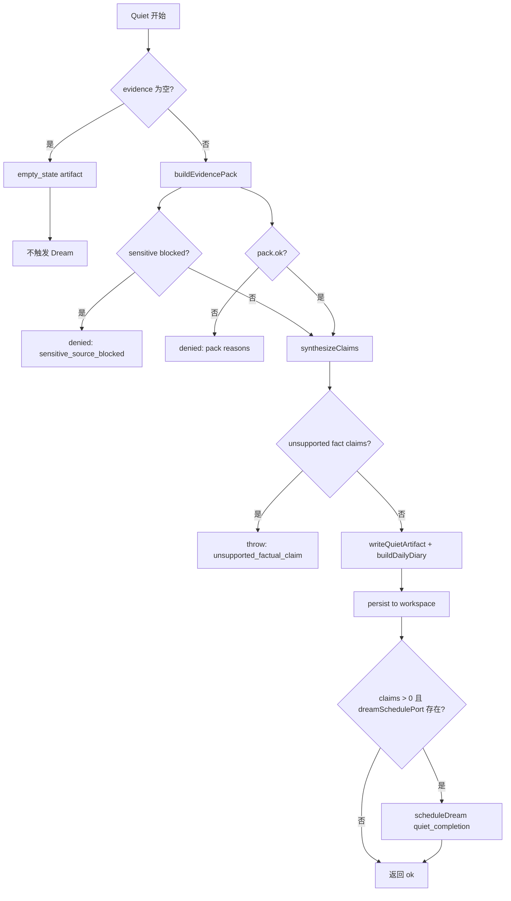
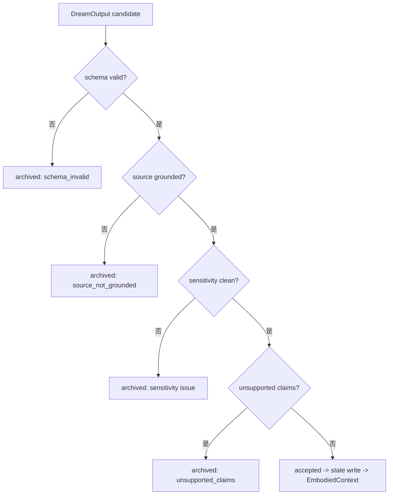
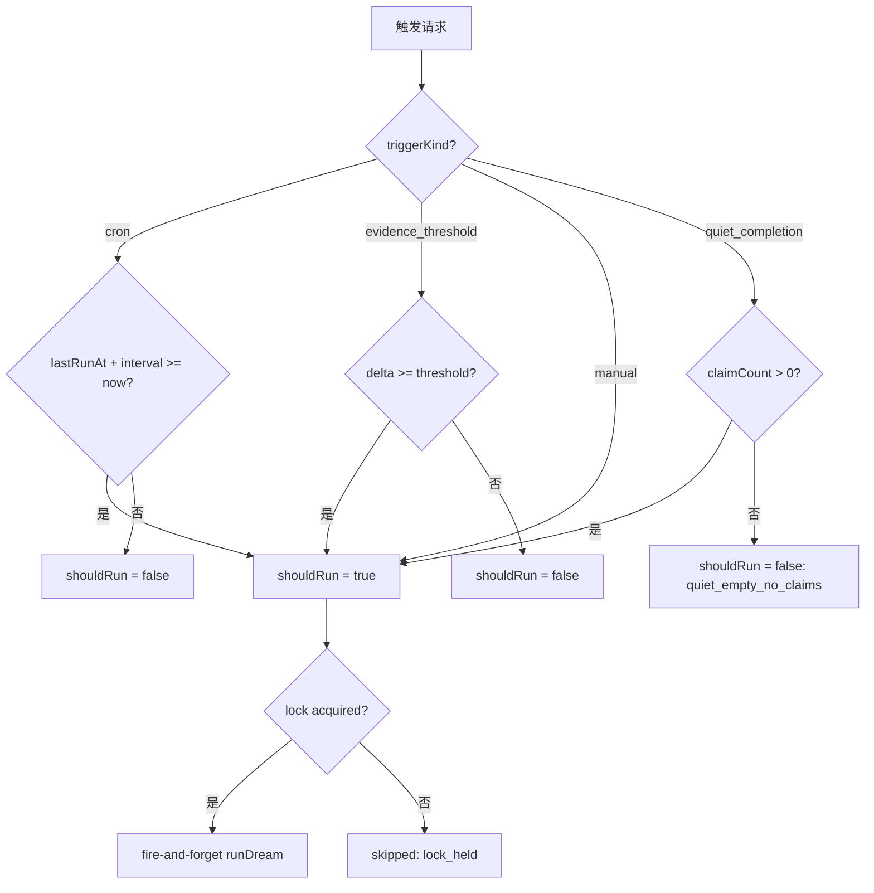

# Dream Quiet System -- 实现细节 (L1)

> **文件性质**: L1 实现层 · **对应 L0**: [`dream-quiet-system.md`](./dream-quiet-system.md)
> 本文件仅在 `/forge` 任务明确引用时加载。日常阅读和任务规划请优先看 L0。
> **孤岛检查**: 本文件各节均须在 L0 有对应超链接入口，禁止孤岛内容。

---

## 版本历史

| 版本 | 日期 | Changelog |
| --- | --- | --- |
| v7.0 | 2026-05-21 | 初始版本 — Quiet pipeline、Dream pipeline、projection lifecycle、DailyDiary |

---

## 本文件章节索引

| § | 章节 | 对应 L0 入口 |
| :---: | --- | :---: |
| §1 | [配置常量](#1-配置常量-config-constants) | L0 §6 数据模型 |
| §2 | [完整数据结构](#2-核心数据结构完整定义-full-data-structures) | L0 §6 数据模型 |
| §3 | [核心算法伪代码](#3-核心算法伪代码-non-trivial-algorithm-pseudocode) | L0 §5 操作契约表 |
| §4 | [决策树详细逻辑](#4-决策树详细逻辑-decision-tree-details) | L0 §4 架构图 |
| §5 | [边缘情况与注意事项](#5-边缘情况与注意事项-edge-cases--gotchas) | L0 §5 / §9 |
| §6 | [测试辅助](#6-测试辅助-test-helpers) | L0 §11 测试策略 |

---

## §1 配置常量 (Config Constants)

> 所有硬编码配置、枚举映射、查找表集中放在此处。
> **L0 对应入口**: L0 §6 末尾锚点 -> *配置常量字典详见 [L1 §1]*

```typescript
// ── Quiet Pipeline Constants ──
const QUIET_CONFIG = {
  /** 最小 source coverage ratio，低于此值拒绝 artifact */
  MIN_COVERAGE_RATIO: 0.51,
  /** DailyDiary 三段标题 */
  DIARY_SECTIONS: ["saw", "noticed", "tomorrow"] as const,
  /** 每次 Quiet 最大 claim 数 */
  MAX_CLAIMS_PER_RUN: 50,
  /** fact claim 无 sourceRef 时的错误码 */
  ERROR_UNSUPPORTED_FACTUAL_CLAIM: "quiet_artifact_unsupported_factual_claim",
  /** artifact 无 sourceRefs 时的错误码 */
  ERROR_REQUIRES_SOURCE_REFS: "quiet_artifact_requires_source_refs",
  /** coverage 过低时的错误码 */
  ERROR_COVERAGE_TOO_LOW: "quiet_artifact_source_coverage_too_low",
};

// ── Dream Pipeline Constants ──
const DREAM_CONFIG = {
  /** 默认 operator timeout (ms) */
  DEFAULT_TIMEOUT_MS: 30 * 60 * 1000, // 30min
  /** 默认 max canonical entries per output */
  DEFAULT_MAX_CANONICAL: 200,
  /** 默认 evidence 时间窗口 (天) */
  DEFAULT_TIME_WINDOW_DAYS: 30,
  /** 默认 evidence limit */
  DEFAULT_EVIDENCE_LIMIT: 1000,
  /** stale entry 阈值 (天) */
  STALE_DAYS: 90,
  /** 采样最近天数 */
  SAMPLING_RECENT_DAYS: 7,
};

// ── Dream Scheduler Constants ──
const SCHEDULER_CONFIG = {
  /** lock TTL (ms) — 覆盖 30min timeout + 5min buffer */
  DEFAULT_LOCK_TTL_MS: 35 * 60 * 1000,
  /** 默认 cron 间隔 (小时) */
  DEFAULT_CRON_INTERVAL_HOURS: 24,
  /** 默认 evidence threshold trigger */
  DEFAULT_EVIDENCE_THRESHOLD: 50,
  /** lock window key */
  LOCK_WINDOW_KEY: "dream_lock:default",
};

// ── Redaction Constants ──
const REDACTION_CONFIG = {
  /** credential pattern 最大命中数，超过则阻止 model stage */
  MAX_CREDENTIAL_HITS: 3,
  /** 阻止 model 的 sensitivity flags */
  BLOCKING_SENSITIVITY_FLAGS: ["credential", "sensitive"] as const,
};

// ── Insight Extraction Constants ──
const INSIGHT_CONFIG = {
  /** 最小 recurring theme count */
  MIN_THEME_COUNT: 3,
  /** 最小 recurring theme source 数 */
  MIN_THEME_SOURCES: 2,
  /** 最大 recurring themes */
  MAX_THEMES: 5,
  /** 最小 conflict items for insight */
  MIN_CONFLICT_ITEMS: 2,
  /** 最小 high-activity day events for observation */
  MIN_HIGH_ACTIVITY_EVENTS: 3,
  /** insight confidence base + increment */
  CONFIDENCE_BASE_PATTERN: 0.5,
  CONFIDENCE_INCREMENT_PATTERN: 0.05,
  CONFIDENCE_BASE_LEARNING: 0.4,
  CONFIDENCE_INCREMENT_LEARNING: 0.1,
  CONFIDENCE_BASE_CONFLICT: 0.5,
  CONFIDENCE_BASE_OBSERVATION: 0.4,
  /** low confidence threshold for unsupported claim */
  LOW_CONFIDENCE_THRESHOLD: 0.3,
};

// ── Key Event Kinds for Sampling ──
const KEY_EVENT_KINDS = [
  "outreach",
  "owner_reply",
  "goal_milestone",
  "delivery",
  "quiet_reflection",
] as const;

// ── Credential Patterns ──
const CREDENTIAL_PATTERNS = [
  /password\s*[:=]\s*\S+/gi,
  /token\s*[:=]\s*\S+/gi,
  /api[_-]?key\s*[:=]\s*\S+/gi,
  /secret\s*[:=]\s*\S+/gi,
  /cookie\s*[:=]\s*\S+/gi,
  /bearer\s+\S+/gi,
];

// ── PII Patterns ──
const PII_PATTERNS = [
  /\b\d{3}-\d{2}-\d{4}\b/g,                          // SSN-like
  /\b\d{4}[\s-]?\d{4}[\s-]?\d{4}[\s-]?\d{4}\b/g,    // Credit card-like
  /[a-zA-Z0-9._%+-]+@[a-zA-Z0-9.-]+\.[a-zA-Z]{2,}/g, // Email
];
```

---

## §2 核心数据结构完整定义 (Full Data Structures)

> 含方法体的完整类定义。L0 层只放属性声明和方法签名。
> **L0 对应入口**: L0 §6.1 末尾锚点 -> *完整方法实现详见 [L1 §2]*

```typescript
// ── DailyDiary 完整定义 (v7 新增) ──

interface DailyDiarySections {
  /** 今天看到了什么 — evidence-backed 观察 */
  saw: string;
  /** 什么值得注意 — 跨 evidence 的 pattern 或 notable event */
  noticed: string;
  /** 明天想看什么 — source-backed 方向性建议 */
  tomorrow: string;
}

interface DailyDiary {
  day: string;
  artifactId: string;
  kind: QuietArtifactKind;
  title: string;
  sections: DailyDiarySections;
  claims: QuietClaim[];
  sourceRefs: SourceRef[];
  sourceCoverage: SourceCoverage;
  createdAt: string;
}

function buildDailyDiary(params: {
  day: string;
  claims: QuietClaim[];
  sourceRefs: SourceRef[];
  sourceCoverage: SourceCoverage;
}): DailyDiary {
  const { day, claims, sourceRefs, sourceCoverage } = params;

  // Group claims by type for section generation
  const facts = claims.filter(c => c.claimType === "fact");
  const observations = claims.filter(c =>
    c.claimType === "interpretation" || c.claimType === "emotion"
  );
  const nextSteps = claims.filter(c => c.claimType === "next_step");

  const saw = facts.length > 0
    ? facts.map(f => f.text).join("; ")
    : "No specific observations today.";

  const noticed = observations.length > 0
    ? observations.map(o => o.text).join("; ")
    : facts.length >= 3
      ? `${facts.length} pieces of evidence gathered — worth reviewing patterns.`
      : "Nothing particularly stood out today.";

  const tomorrow = nextSteps.length > 0
    ? nextSteps.map(n => n.text).join("; ")
    : "Continue observing.";

  return {
    day,
    artifactId: `quiet:${crypto.randomUUID()}`,
    kind: "daily_report",
    title: `Quiet daily diary — ${day}`,
    sections: { saw, noticed, tomorrow },
    claims,
    sourceRefs,
    sourceCoverage,
    createdAt: new Date().toISOString(),
  };
}

// ── AcceptedProjection 完整定义 (v7 新增 read model) ──

interface AcceptedProjection {
  outputId: string;
  acceptedAt: string;
  canonicalEntrySummaries: string[];
  insightSummaries: string[];
  narrativeFocusDelta?: string;
  sourceRefs: string[];
}

function buildAcceptedProjection(output: DreamOutput): AcceptedProjection {
  return {
    outputId: output.outputId,
    acceptedAt: new Date().toISOString(),
    canonicalEntrySummaries: output.canonicalEntries
      .slice(0, 10)
      .map(e => e.summary),
    insightSummaries: output.insights
      .slice(0, 5)
      .map(i => i.summary),
    narrativeFocusDelta: output.narrativeUpdate?.focus,
    sourceRefs: [
      ...output.canonicalEntries.flatMap(e =>
        e.sourceRefs.map(r => r.sourceId)
      ),
      ...output.insights.flatMap(i => i.sourceRefs),
    ].filter((v, i, a) => a.indexOf(v) === i).slice(0, 20),
  };
}

// ── QuietCompletionTrigger (v7 新增) ──

interface QuietCompletionTrigger {
  type: "quiet_completion";
  quietArtifactId: string;
  claimCount: number;
  day: string;
}
```

---

## §3 核心算法伪代码 (Non-Trivial Algorithm Pseudocode)

### §3.1 runQuiet

**对应契约**: L0 §5.1 — `runQuiet(day, evidenceSlice)`
**准入理由**: 多步骤副作用链 (evidence -> claims -> diary -> artifact write -> Dream trigger)

```typescript
async function runQuiet(params: {
  day: string;
  evidenceSlice: LifeEvidenceSlice;
  userInterestSnapshot?: UserInterestSnapshot;
  workspaceRoot?: string;
  statePort: QuietStatePort;
  dreamSchedulePort?: DreamSchedulePort;
}): Promise<QuietRunResult> {
  const { day, evidenceSlice, statePort, dreamSchedulePort } = params;

  // Step 1: Empty check
  if (isLifeEvidenceSliceEmpty(evidenceSlice)) {
    const artifact = writeQuietArtifact({
      day, kind: "empty_state",
      title: "Quiet — no life evidence",
      body: "No source-backed life evidence in window.",
      claims: [], sourceRefs: [],
    });
    return { status: "empty_state", artifactAck: artifact, dreamTriggered: false };
  }

  // Step 2: Build evidence pack + validate
  const evidencePack = buildEvidencePack(evidenceSlice.evidenceRefs);
  if (!evidencePack.ok) {
    return { status: "denied", reasons: evidencePack.reasons, dreamTriggered: false };
  }
  if (evidencePack.pack.sensitiveBlocked) {
    return { status: "denied", reasons: ["sensitive_source_blocked"], dreamTriggered: false };
  }

  // Step 3: Synthesize claims
  const claims = synthesizeClaims(evidencePack.pack.groundedRefs);

  // Step 4: Source validation
  const sourceRefs = evidencePack.pack.groundedRefs.map(toSourceRef);
  const coverage = calculateQuietSourceCoverage(claims);
  if (coverage.unsupportedClaims.length > 0) {
    throw new Error(QUIET_CONFIG.ERROR_UNSUPPORTED_FACTUAL_CLAIM);
  }

  // Step 5: Write artifact + daily diary
  const artifact = writeQuietArtifact({
    day, kind: "daily_report",
    title: "Quiet daily report",
    body: `Source-backed summary (${sourceRefs.length} refs).`,
    claims, sourceRefs,
  });

  const diary = buildDailyDiary({ day, claims, sourceRefs, sourceCoverage: coverage });
  await statePort.writeDailyDiary(diary);

  // Step 6: Persist to workspace
  if (params.workspaceRoot) {
    await persistQuietArtifactToWorkspace(params.workspaceRoot, artifact, { day, claims, sourceRefs });
  }

  // Step 7: Auto-trigger Dream
  let dreamTriggered = false;
  if (dreamSchedulePort && claims.length > 0) {
    const scheduleResult = await dreamSchedulePort.scheduleDream({
      triggerKind: "quiet_completion" as any,
      runId: `dream:${crypto.randomUUID()}`,
      traceId: `trace:${crypto.randomUUID()}`,
    });
    dreamTriggered = scheduleResult.status === "started";
  }

  return { status: "ok", artifactAck: artifact, diary, dreamTriggered };
}
```

> **注意事项**: Step 7 的 Dream trigger 是 fire-and-forget，不影响 Quiet 返回值。

### §3.2 scheduleDream

**对应契约**: L0 §5.1 — `scheduleDream(trigger, ports)`
**准入理由**: lock 获取 + 异步 fire-and-forget 模式 + lock 释放的顺序依赖

```typescript
async function scheduleDream(input: SchedulerInput): Promise<ScheduleResult> {
  const lock = input.lockPort ?? memoryLockPort();
  const windowKey = SCHEDULER_CONFIG.LOCK_WINDOW_KEY;

  // Step 1: Acquire lock
  const lockResult = await lock.acquireLock({
    runId: input.runId,
    windowKey,
    ttlMs: SCHEDULER_CONFIG.DEFAULT_LOCK_TTL_MS,
  });
  if (!lockResult.acquired) {
    return { runId: input.runId, status: "skipped", reason: `lock_held_by:${lockResult.existingRunId}` };
  }

  // Step 2: Fire-and-forget Dream run
  runDream({ /* ... engine input ... */ })
    .then(async () => { await lock.releaseLock({ runId: input.runId, windowKey }); })
    .catch(async () => { await lock.releaseLock({ runId: input.runId, windowKey }); });

  return { runId: input.runId, status: "started" };
}
```

### §3.3 runDream

**对应契约**: L0 §5.1 — `runDream(engineInput)`
**准入理由**: 9 步 pipeline 有严格顺序依赖

参见现有实现 `src/dream/dream-engine.ts`。v7 扩展点：
1. `loadDreamInputs` 增加 `QuietClaim[]` 和 `ToolExperience[]` 输入通道。
2. `consolidateMemory` 增加 ToolExperience 作为 evidence source。
3. Pipeline 完成后调用 `transitionProjection` 判断 lifecycle。

### §3.4 validateDreamOutput

**对应契约**: L0 §5.1 — `validateDreamOutput(output, inputs)`
**准入理由**: 多维度 validation 含不明显的业务规则

参见现有实现 `src/dream/output-validator.ts`。四维度验证：
1. **Schema**: outputId, runId, canonicalEntries, insights 存在且类型正确。
2. **Source grounding**: 所有 sourceRefs 必须在 input evidence/chronicle ids 中。
3. **Sensitivity**: 扫描 password/token/secret 关键词。
4. **Unsupported claims**: insight confidence < 0.3 或 sourceRefs 为空。

`eligible = schemaValid && sourceGrounded && sensitivityClean && unsupportedClaims.length === 0`

### §3.5 transitionProjection

**对应契约**: L0 §5.1 — `transitionProjection(outputId, newStatus)`
**准入理由**: 状态转换含业务规则 (不可从 archived 转 accepted)

```typescript
async function transitionProjection(params: {
  outputId: string;
  validation: ValidationResult;
  statePort: DreamStatePort;
}): Promise<{ outputId: string; newStatus: DreamOutputStatus }> {
  const { outputId, validation, statePort } = params;

  let newStatus: DreamOutputStatus;
  if (validation.eligible) {
    newStatus = "accepted";
  } else if (validation.archiveReasons.some(r => r.includes("sensitivity"))) {
    newStatus = "archived";
  } else if (validation.archiveReasons.includes("source_not_grounded")) {
    newStatus = "archived";
  } else {
    newStatus = "archived";
  }

  await statePort.markDreamOutputLifecycle({
    outputId,
    newStatus,
    validation: validation.validation,
    updatedAt: new Date().toISOString(),
  });

  return { outputId, newStatus };
}
```

### §3.6 loadAcceptedProjection

**对应契约**: L0 §5.1 — `loadAcceptedProjection(query)`
**准入理由**: 签名已能表达意图；简要说明过滤逻辑

通过 `DreamStatePort` 查询 `status = "accepted"` 的 DreamOutput，调用 `buildAcceptedProjection` 构造 read model。只返回 accepted 状态的 output，candidate / archived / partial 不可返回。

### §3.7 writeDailyDiary

**对应契约**: L0 §5.1 — `writeDailyDiary(day, claims, style)`
**准入理由**: 含三段式自然语言组织逻辑

参见 §2 `buildDailyDiary` 实现。核心规则：
- `saw` 段：来自 fact claims 的拼接。
- `noticed` 段：来自 interpretation/emotion claims；如无则根据 fact 数量生成概括。
- `tomorrow` 段：来自 next_step claims；如无则 "Continue observing."。

### §3.8 shouldTriggerDream

**对应契约**: L0 §5.1 — `shouldTriggerDream(policy)`
**准入理由**: 签名已能表达意图

参见现有实现 `src/dream/dream-scheduler.ts` 的 `shouldTrigger` 函数。v7 新增 `quiet_completion` 类型：
```typescript
case "quiet_completion": {
  if (policy.claimCount === 0) {
    return { shouldRun: false, reason: "quiet_empty_no_claims" };
  }
  return { shouldRun: true, reason: `quiet_completed:${policy.claimCount}_claims` };
}
```

---

## §4 决策树详细逻辑 (Decision Tree Details)

> 对应 L0 §4 Mermaid 架构图的文字展开。
> **L0 对应入口**: L0 §4 架构图

### §4.1 Quiet Pipeline 决策树



### §4.2 Dream Output Lifecycle 决策树



### §4.3 Dream Trigger 决策树



---

## §5 边缘情况与注意事项 (Edge Cases & Gotchas)

> 实现时必须处理的非显而易见情况。
> **L0 对应入口**: L0 §5 / §9

| 场景 | 风险 | 处理方式 |
| --- | --- | --- |
| Quiet 只有 1 条弱 evidence | 生成 pattern insight (越权) | 单条 evidence 只能生成 observation/fact claim，不生成 pattern [REQ-005] |
| Dream model timeout 但 rules 有结果 | 丢失 rules 结果 | 标记 `partial` 而非 `failed`；rules output 仍写入 |
| Dream lock 在 run 中途 process crash | stale lock 阻止后续 Dream | lock TTL 35min 自动过期 |
| Quiet artifact 的 sourceRefs 包含后续被删除的 evidence | claim grounding 失效 | v7 不做 re-validation (future: projmem-style claim re-check) |
| Dream 输入窗口内无 QuietClaim 但有 historical evidence | Dream 仍能运行 | DreamInputLoader 读取 evidence + chronicle，不强依赖 QuietClaim |
| Quiet completion trigger 但 Dream 已在运行 | 重复 Dream run | lock 防止；返回 `skipped` + `lock_held_by` reason |
| ModelAssistPort 返回 unsupported claims | 这些 claims 可能污染 output | validation 检测 unsupported claims -> archived |
| sensitive sourceRefs 被 blocked 时 | claims 可能缺少 source | Quiet pipeline 直接 denied，不生成 artifact |
| DreamOutput canonical entries 超过 max | memory 膨胀 | `DEFAULT_MAX_CANONICAL = 200` 截断 |
| 多个 DreamOutput 同时为 accepted 状态 | heartbeat 读取哪个? | `loadAcceptedProjection` 按 `acceptedAt` 降序，默认 limit=1 |

### §5.1 单条弱 evidence 的处理

```typescript
// 正确做法: insight-extractor 中 pattern 要求 MIN_THEME_SOURCES >= 2
// 单条 evidence 无法满足 >= 2 sources，因此不会生成 pattern insight
const themes = findRecurringThemes(allItems);
// themes 为空 -> 不生成 pattern insight

// 但可以生成 observation (如果是 high-activity day with >= 3 events)
// 或 learning (如果匹配 learning keywords)
// 这些都是 OK 的 — 单条 evidence 可以是一个观察或学习事件
```

### §5.2 Dream fire-and-forget lock 释放

```typescript
// 正确做法: then/catch 都释放 lock
runDream(engineInput)
  .then(async () => {
    await lock.releaseLock({ runId, windowKey });
  })
  .catch(async () => {
    // 即使 Dream 异常也释放 lock — 防止 stale lock
    await lock.releaseLock({ runId, windowKey });
  });
// 注意: 不要 await 这个 Promise chain — 它是 fire-and-forget
```

---

## §6 测试辅助 (Test Helpers)

> 可选。单元测试中复用的工厂函数或 fixtures。
> **L0 对应入口**: L0 §11 测试策略锚点

```typescript
function makeTestQuietClaim(overrides?: Partial<QuietClaim>): QuietClaim {
  return {
    id: `fact:test_${crypto.randomUUID()}`,
    text: "Test evidence-backed claim",
    claimType: "fact",
    sourceRefs: [{
      id: `evidence:test_${crypto.randomUUID()}`,
      kind: "evidence",
    }],
    ...overrides,
  };
}

function makeTestDreamOutput(overrides?: Partial<DreamOutput>): DreamOutput {
  return {
    outputId: `dream_output:${crypto.randomUUID()}`,
    runId: `dream_run:${crypto.randomUUID()}`,
    status: "candidate",
    canonicalEntries: [],
    insights: [],
    validation: {
      schemaValid: true,
      sourceGrounded: true,
      sensitivityClean: true,
      unsupportedClaims: [],
      errors: [],
      checkedAt: new Date().toISOString(),
    },
    ...overrides,
  };
}

function makeTestDreamInputBundle(overrides?: Partial<DreamInputBundle>): DreamInputBundle {
  return {
    evidenceRefs: ["evidence:test_1", "evidence:test_2"],
    chronicleEntryIds: ["chronicle:test_1"],
    goalSnapshotIds: [],
    inputCounts: { evidence: 2, chronicle: 1, memoryEntries: 0 },
    ...overrides,
  };
}

function makeTestLifeEvidenceSlice(count: number = 3): LifeEvidenceSlice {
  return {
    evidenceRefs: Array.from({ length: count }, (_, i) => ({
      id: `evidence:test_${i}`,
      kind: "evidence" as const,
      uri: `urn:test:evidence:${i}`,
      observedAt: new Date().toISOString(),
    })),
  };
}
```
