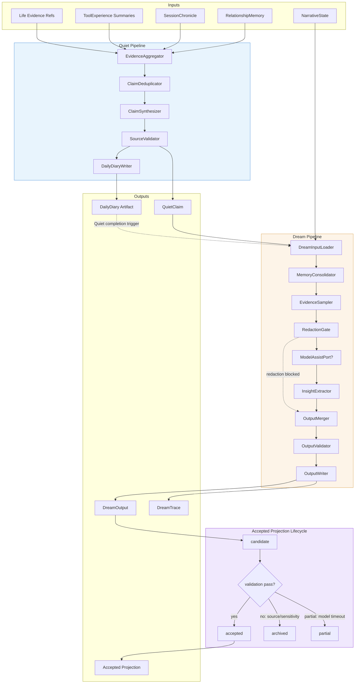
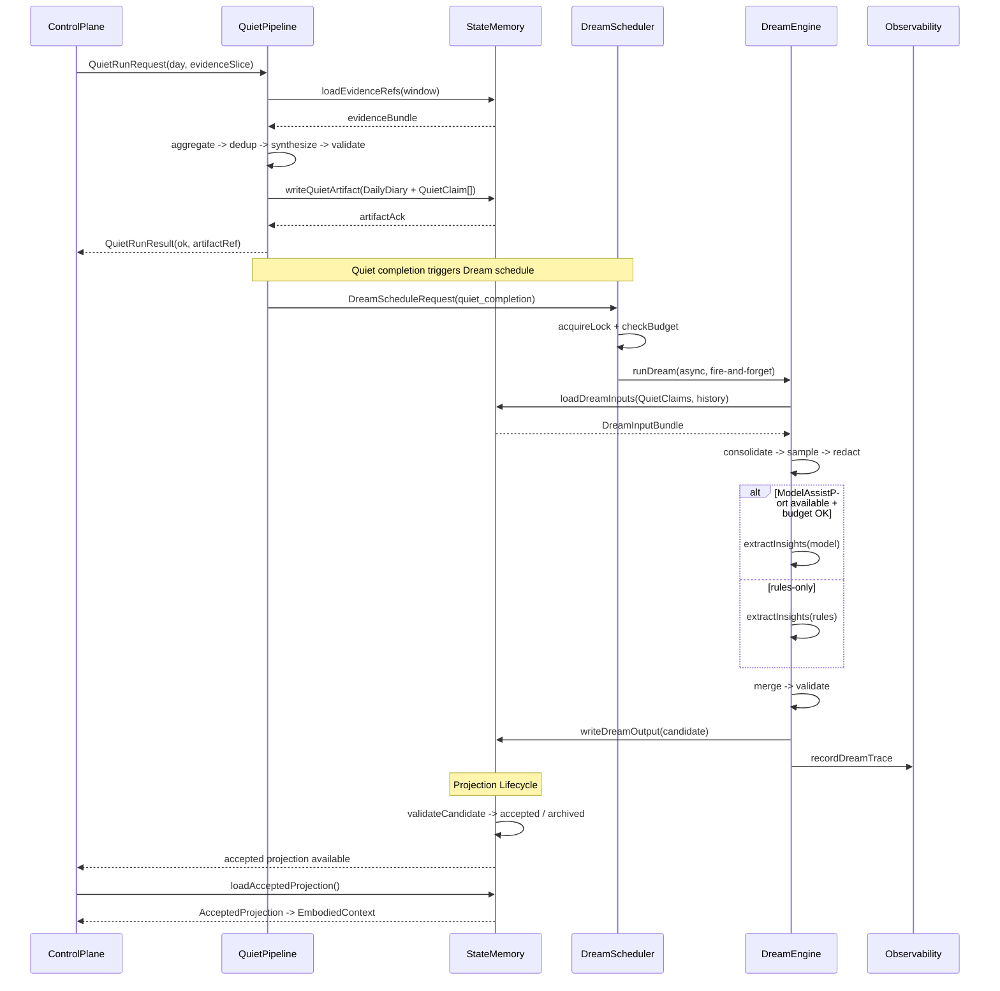
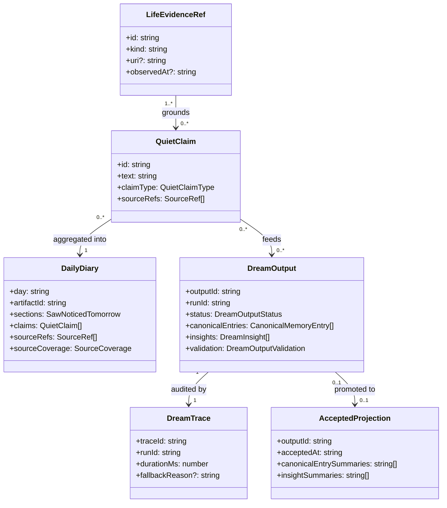

# Dream Quiet System 系统设计文档 (L0 - 导航层)

| 字段 | 值 |
| --- | --- |
| **System ID** | `dream-quiet-system` |
| **Project** | Second Nature |
| **Version** | 7.0 |
| **Status** | `Draft` |
| **Author** | GPT-5.5 / Nyx |
| **Date** | 2026-05-21 |
| **L1 Detail** | [dream-quiet-system.detail.md](./dream-quiet-system.detail.md) — 配置常量、完整数据结构、算法伪代码、pipeline 状态机与边缘 case |

> [!IMPORTANT]
> 本文件定义 v7 dream-quiet-system：Quiet claim materialization、DailyDiary 生成、Dream pipeline 的 memory consolidation 与 insight extraction、accepted projection lifecycle，以及自动调度。它不保存 canonical state schema、不执行 connector、不生成 outreach 文案、不运行 heartbeat 编排、不发布 HeartbeatDigest。

## 目录 (Table of Contents)

| § | 章节 | 关键内容 |
| :---: | --- | --- |
| 1 | [概览](#1-概览-overview) | 目的、边界、职责 |
| 2 | [目标与非目标](#2-目标与非目标-goals--non-goals) | Goals / Non-Goals |
| 3 | [背景与上下文](#3-背景与上下文-background--context) | v7 embodied loop、v6 基线、调研 |
| 4 | [系统架构](#4-系统架构-architecture) | Mermaid、组件、数据流：Quiet -> Dream -> candidate -> accepted |
| 5 | [接口设计](#5-接口设计-interface-design) | 操作契约表、跨系统协议、端口 |
| 6 | [数据模型](#6-数据模型-data-model) | 字段声明、关系、流向 |
| 7 | [技术选型](#7-技术选型-technology-stack) | TS/Node、rules-first、optional ModelAssistPort |
| 8 | [Trade-offs](#8-trade-offs--alternatives-权衡与备选方案) | ADR 引用与本系统取舍 |
| 9 | [安全性考虑](#9-安全性考虑-security-considerations) | source-backed 约束、redaction policy、no raw content |
| 10 | [性能考虑](#10-性能考虑-performance-considerations) | P95、异步执行、budget |
| 11 | [测试策略](#11-测试策略-testing-strategy) | Contract Verification Matrix |
| 12 | [部署与运维](#12-部署与运维-deployment--operations) | runtime、trace、lock |
| 13 | [未来考虑](#13-未来考虑-future-considerations) | 后续演进 |
| 14 | [附录](#14-appendix-附录) | L1 判断、术语、参考 |

**L1 实现层** -> [dream-quiet-system.detail.md](./dream-quiet-system.detail.md) (仅 `/forge` 时加载)
> [§1 配置常量](./dream-quiet-system.detail.md#1-配置常量-config-constants) · [§2 数据结构](./dream-quiet-system.detail.md#2-核心数据结构完整定义-full-data-structures) · [§3 算法](./dream-quiet-system.detail.md#3-核心算法伪代码-non-trivial-algorithm-pseudocode) · [§4 决策树](./dream-quiet-system.detail.md#4-决策树详细逻辑-decision-tree-details) · [§5 边缘情况](./dream-quiet-system.detail.md#5-边缘情况与注意事项-edge-cases--gotchas)

---

## 1. 概览 (Overview)

### 1.1 System Purpose (系统目的)

`dream-quiet-system` 是 Second Nature v7 的意义整理层。它将 agent 每日积累的 life evidence、tool experience、session chronicle、relationship feedback 整理为 source-backed claims 和自然语言日记 (Quiet)，然后在允许窗口自动触发 memory consolidation、insight extraction 和 projection generation (Dream)。

核心价值：让 agent 像人一样"带着昨晚的整理醒来"，但每一句来自整理的判断都有来源，不编造故事。

### 1.2 System Boundary (系统边界)

- **输入**: life evidence refs、ToolExperience summaries、SessionChronicle entries、NarrativeState snapshot、RelationshipMemory snapshot。
- **输出**: DailyDiary artifact、QuietClaim[]、DreamOutput (candidate projections + canonical entries + insights)、DreamTrace (审计)、accepted projection (经 lifecycle 后写入 state)。
- **依赖系统**: `state-memory-system` (读写 evidence、claims、outputs、projections)、`observability-health-system` (trace 记录、redaction policy)、optional `ModelAssistPort` (LLM insight extraction)。
- **被依赖系统**: `control-plane-system` (读取 accepted projection 构造 EmbodiedContext、发出 QuietRunRequest / DreamScheduleRequest)、`runtime-ops-system` (ops surface 暴露 Dream status / manual trigger)。

### 1.3 System Responsibilities (系统职责)

**负责**:
- Quiet pipeline：evidence aggregation -> deduplication -> claim synthesis -> source validation -> DailyDiary + QuietClaim 输出。
- Dream pipeline：load inputs -> rules consolidation -> sampling -> redaction -> optional model insights -> merge -> validation -> write output + trace。
- Dream scheduler：cron / evidence_threshold / Quiet-completion / manual 触发、lock 机制、budget gate。
- Accepted projection lifecycle：candidate -> validation -> accepted / archived / partial 状态转换。
- Quiet 完成后在允许窗口自动触发 Dream。
- DailyDiary 遵守 inner guide 写作原则：自然、感性、像朋友喝咖啡聊天，但必须 source-backed。

**不负责**:
- 不保存 IdentityProfile、AgentGoal、NarrativeTimeline 或 RestoreSnapshot；这些属于 `state-memory-system`。
- 不执行 connector、wet probe 或外部 API 调用；这些属于 `connector-system` / `body-tool-system`。
- 不生成 outreach 文案或投递消息；这些属于 `guidance-voice-system` / `runtime-ops-system`。
- 不运行 heartbeat 编排或判断候选意图；这些属于 `control-plane-system`。
- 不发布 HeartbeatDigest；digest 属于 `observability-health-system`。
- 不直接获得行动授权；Dream/Quiet 只提供 projection、proposal 或 claim。[NG6]

---

## 2. 目标与非目标 (Goals & Non-Goals)

### 2.1 Goals

- **[G1]**: Quiet 生成非空 observation/fact claims，且每条 claim 有 source_refs。[REQ-005]
- **[G2]**: Quiet 生成 DailyDiary artifact，包含"今天看到了什么 / 值得注意什么 / 明天想看什么"三段自然文本。[REQ-005]
- **[G3]**: Dream 在 Quiet 完成后的允许窗口自动调度，生成 trace 或 explicit skip reason。[REQ-005]
- **[G4]**: Dream output 始终为 `candidate`，只有通过 validation (schema + source grounding + sensitivity) 后才可进入 accepted 状态。[REQ-005]
- **[G5]**: accepted projection 写入 state 后可被 heartbeat 的 EmbodiedContext 读取；candidate 和 archived 不可被读取。[REQ-001], [REQ-005]
- **[G6]**: 单条弱 evidence 只能生成 observation claim，不能生成 pattern insight。[REQ-005]
- **[G7]**: Dream pipeline P95 < 5s (rules-only mode)；hybrid_llm mode P95 < 30s with operator timeout。[REQ-001]

### 2.2 Non-Goals

- **[NG1]**: 不让 Dream/Quiet output 直接获得行动授权。[NG6]
- **[NG2]**: 不保存完整私信正文、credential、token、raw prompt 到 claim、diary 或 Dream output。[NG4]
- **[NG3]**: 不替代 guidance-voice-system 的表达职责；DailyDiary 是内部产物，不是 outreach 消息。
- **[NG4]**: 不在 heartbeat critical path 同步等待 Dream 完成。Dream 是 fire-and-forget 异步任务。
- **[NG5]**: 不实现 connector execution、goal lifecycle、identity profile 或 health snapshot。

---

## 3. 背景与上下文 (Background & Context)

### 3.1 Why This System? (为什么需要这个系统?)

v6 的 Quiet claim 可能只有 `{statement: ""}` 或薄 summary，Dream 声明存在但不自然运行。v7 需要让 Quiet 像日记（今天看到了什么、什么值得注意、明天想看什么），Quiet 完成后 Dream 接着反思、去重、建 insight，且只有 accepted projection 才能影响下一轮 heartbeat。

**关联 PRD 需求**: [REQ-001], [REQ-005]

### 3.2 Current State (现状分析)

v6 已有以下基础代码：

| 文件 | 现有能力 | v7 缺口 |
| --- | --- | --- |
| `src/dream/dream-engine.ts` | hybrid pipeline: load -> consolidate -> sample -> redact -> model -> merge -> validate -> write | 无 Quiet-completion 触发；无 DailyDiary；validation 不影响 lifecycle |
| `src/dream/dream-scheduler.ts` | cron/evidence_threshold/manual 触发 + lock | 缺少 Quiet-completion 触发策略 |
| `src/dream/output-validator.ts` | schema + source grounding + sensitivity + unsupported claims | 结果未接入 lifecycle transition |
| `src/dream/memory-consolidator.ts` | rules-based dedup + merge + stale + conflict | 无 ToolExperience 输入通道 |
| `src/dream/insight-extractor.ts` | keyword-based pattern/learning/conflict/observation extraction | 无 relationship feedback 输入 |
| `src/dream/redaction-gate.ts` | credential + PII redaction | 功能足够 |
| `src/dream/sampler.ts` | priority sampling (recent + key + confidence) | 功能足够 |
| `src/core/second-nature/quiet/run-source-backed-quiet.ts` | evidence pack -> claims -> artifact write | 只生成 fact claims，无 DailyDiary，无 auto-Dream trigger |
| `src/storage/quiet/quiet-artifact-types.ts` | QuietClaim, QuietArtifactWrite types | 缺少 DailyDiary type |
| `src/storage/quiet/quiet-artifact-writer.ts` | source coverage validation + artifact ack | 功能足够 |

事实来源：v6 codebase scan 2026-05-21。

### 3.3 Constraints (约束条件)

- **技术约束**: 必须兼容 v6 的 DreamOutput、QuietClaim、SourceRef schema 和现有测试。[ADR-001]
- **性能约束**: heartbeat P95 < 2s；Dream 不得阻塞 heartbeat critical path。[PRD §6.1]
- **安全约束**: credential、token、cookie、raw private message、raw prompt 不进入 QuietClaim、DailyDiary、DreamOutput 或 DreamTrace。[PRD §6.2, NG4]
- **行为约束**: Dream/Quiet 不直接获得行动授权。[NG6]
- **source-backed 约束**: 每条 QuietClaim (fact type) 必须有 source_refs；没有 source 的 claim 不能进入 accepted 状态。

### 3.4 Research Summary (调研摘要)

> 详见 [_research/dream-quiet-system-research.md](./_research/dream-quiet-system-research.md)

关键结论：
1. Claude Auto-Dream 提供异步后台 consolidation + 锁机制的成熟参考，但缺少 candidate/accepted lifecycle 和 source grounding validation。
2. projmem 的 structured claims + re-validation 模式直接支撑 QuietClaim 的 source-backed 设计。
3. Reflection pattern 文献支持 generate + consolidate 分离，但 Second Nature 的 Quiet/Dream 不是 retry loop，是 daily consolidation。

---

## 4. 系统架构 (Architecture)

### 4.1 Architecture Diagram (架构图)



### 4.2 Core Components (核心组件)

| Component | Responsibility | Tech Stack | Notes |
| --- | --- | --- | --- |
| `EvidenceAggregator` | 收集 life evidence refs、ToolExperience、SessionChronicle、RelationshipMemory，输出统一 evidence bundle | TypeScript | 通过 state port 读取 |
| `ClaimDeduplicator` | 按 sourceRef id+kind 去重，保留最新 | TypeScript rules | 复用 memory-consolidator 逻辑 |
| `ClaimSynthesizer` | 从 evidence bundle 生成 QuietClaim (fact/observation/emotion/interpretation/next_step) | TypeScript rules + optional ModelAssistPort | rules-first |
| `SourceValidator` | 验证每条 fact claim 有 source_refs 且 grounding ratio >= threshold | TypeScript | 复用 quiet-artifact-writer |
| `DailyDiaryWriter` | 将 validated claims 组织为三段自然语言 diary (saw/noticed/tomorrow) | TypeScript rules + optional ModelAssistPort | inner guide 写作风格 |
| `DreamInputLoader` | 加载 QuietClaim + historical DreamOutput + NarrativeState + goals | TypeScript, via DreamStatePort | bounded query |
| `MemoryConsolidator` | rules-based dedup、merge、stale cleanup、conflict marking | TypeScript | 现有 `memory-consolidator.ts` |
| `EvidenceSampler` | priority sampling (recent + key events + high confidence) | TypeScript | 现有 `sampler.ts` |
| `RedactionGate` | credential + PII redaction; sensitivity flag blocks model stage | TypeScript | 现有 `redaction-gate.ts` |
| `InsightExtractor` | keyword pattern/learning/conflict/observation extraction | TypeScript rules | 现有 `insight-extractor.ts` |
| `OutputValidator` | schema + source grounding + sensitivity + unsupported claims check | TypeScript | 现有 `output-validator.ts` |
| `DreamScheduler` | cron / evidence_threshold / quiet_completion / manual trigger + lock | TypeScript | 现有 `dream-scheduler.ts` + v7 quiet_completion |
| `ProjectionLifecycleManager` | candidate -> accepted / archived / partial 状态转换 | TypeScript | v7 新增 |

### 4.3 Data Flow (数据流)



**关键数据流说明**:
1. **Quiet -> State**: QuietPipeline 生成 DailyDiary artifact 和 QuietClaim[]，通过 state port 写入。
2. **Quiet -> Dream**: Quiet completion 触发 DreamScheduleRequest，Dream 异步启动。
3. **Dream -> State**: DreamOutput 以 candidate 状态写入；经 validation 后 lifecycle transition。
4. **State -> ControlPlane**: 只有 accepted projection 可被 heartbeat 的 EmbodiedContext assembler 读取。

---

## 5. 接口设计 (Interface Design)

### 5.1 操作契约表 (Operation Contracts)

| 操作 | [REQ] | 前置条件 | 消耗/输入 | 产出/副作用 | 实现细节 |
| --- | :---: | --- | --- | --- | :---: |
| `runQuiet(day, evidenceSlice)` | [REQ-005] | evidence slice 非空; day 格式 YYYY-MM-DD | life evidence refs + ToolExperience + SessionChronicle | DailyDiary artifact + QuietClaim[]; 自动发出 DreamScheduleRequest | [L1 §3.1](./dream-quiet-system.detail.md#31-runquiet) |
| `runQuiet(day, emptySlice)` | [REQ-005] | evidence slice 为空 | 空 slice | empty_state artifact; 不触发 Dream | [L1 §3.1](./dream-quiet-system.detail.md#31-runquiet) |
| `scheduleDream(trigger, ports)` | [REQ-005] | lock 可获取; triggerKind valid | QuietClaims + history + NarrativeState | DreamRunResult (async); DreamTrace 写入 | [L1 §3.2](./dream-quiet-system.detail.md#32-scheduledream) |
| `runDream(engineInput)` | [REQ-005] | inputBundle 非空 | DreamInputBundle | DreamOutput(candidate) + DreamTrace | [L1 §3.3](./dream-quiet-system.detail.md#33-rundream) |
| `validateDreamOutput(output, inputs)` | [REQ-005] | output 存在 | DreamOutput + input evidence/chronicle ids | ValidationResult (eligible, archiveReasons) | [L1 §3.4](./dream-quiet-system.detail.md#34-validatedreamoutput) |
| `transitionProjection(outputId, newStatus)` | [REQ-005] | outputId 存在; newStatus in {accepted, archived} | validation result | lifecycle state change; accepted -> state write | [L1 §3.5](./dream-quiet-system.detail.md#35-transitionprojection) |
| `loadAcceptedProjection(query)` | [REQ-001] | query within time window | time window | AcceptedProjection[] (only status=accepted) | [L1 §3.6](./dream-quiet-system.detail.md#36-loadacceptedprojection) |
| `writeDailyDiary(day, claims, style)` | [REQ-005] | claims 非空; all fact claims source-backed | QuietClaim[] + inner guide style params | DailyDiary artifact (saw/noticed/tomorrow) | [L1 §3.7](./dream-quiet-system.detail.md#37-writedailydiary) |
| `shouldTriggerDream(policy)` | [REQ-005] | policy 有效 | TriggerPolicy (cron/evidence/manual/quiet_completion) | { shouldRun, reason } | [L1 §3.8](./dream-quiet-system.detail.md#38-shouldtriggerdream) |

### 5.2 跨系统接口协议 (Cross-System Interface)

```typescript
// ── 本系统暴露给 control-plane-system 的端口 ──

interface QuietRunPort {
  runSourceBackedQuiet(params: {
    day: string;
    evidenceSlice: LifeEvidenceSlice;
    userInterestSnapshot?: UserInterestSnapshot;
    workspaceRoot?: string;
  }): Promise<QuietRunResult>;
}

interface DreamSchedulePort {
  scheduleDream(params: {
    triggerKind: DreamTriggerKind;
    runId: string;
    traceId: string;
  }): Promise<ScheduleResult>;
}

interface AcceptedProjectionReadPort {
  loadAcceptedProjections(query: {
    since?: string;
    limit?: number;
  }): Promise<AcceptedProjection[]>;
}

// ── 本系统依赖的外部端口 ──

interface DreamStatePort {
  loadDreamInputs(query: {
    timeWindowDays?: number;
    evidenceLimit?: number;
  }): Promise<DreamInputBundle>;
  writeDreamOutput(output: DreamOutput): Promise<{
    outputId: string;
    status: "acknowledged" | "degraded";
  }>;
  markDreamOutputLifecycle(input: {
    outputId: string;
    newStatus: DreamOutputStatus;
    validation?: DreamOutputValidation;
    updatedAt: string;
  }): Promise<{ outputId: string; status: "acknowledged" | "degraded" }>;
}

interface DreamModelPort {
  extractInsights(input: {
    sampledEvidence: string[];
    chronicleSummary: string;
    activeMemorySummary?: string;
    redacted: boolean;
  }): Promise<{
    insights: DreamInsight[];
    narrativeUpdate?: DreamNarrativeUpdate;
    relationshipUpdate?: DreamRelationshipUpdate;
    unsupportedClaims: string[];
    costUsd?: number;
  }>;
}

interface DreamTracePort {
  recordDreamTrace(trace: DreamTrace): Promise<void>;
}

interface DreamBudgetPort {
  checkBudget(costEstimateUsd: number): Promise<{
    allowed: boolean;
    remainingUsd: number;
  }>;
}

interface DreamRunLockPort {
  acquireLock(input: {
    runId: string;
    windowKey: string;
    ttlMs: number;
  }): Promise<{ acquired: boolean; existingRunId?: string }>;
  releaseLock(input: { runId: string; windowKey: string }): Promise<void>;
}
```

### 5.3 错误语义 (Error Semantics)

| 错误码 | 触发条件 | 处理方式 |
| --- | --- | --- |
| `quiet_empty_state` | evidence slice 为空 | 写 empty_state artifact, 不触发 Dream |
| `quiet_guidance_sensitive_source_blocked` | sensitive source refs blocked | 拒绝 Quiet artifact 写入 |
| `quiet_artifact_requires_source_refs` | claims 存在但无 source refs | 抛出错误 |
| `quiet_artifact_unsupported_factual_claim` | fact claim 无 source coverage | 抛出错误 |
| `quiet_artifact_source_coverage_too_low` | grounding ratio < threshold | 抛出错误 |
| `dream_lock_held` | 另一个 Dream run 持有 lock | 跳过本次 Dream, 记录 skip reason |
| `dream_no_inputs` | inputBundle 为空 | 跳过并记录 trace |
| `dream_redaction_failed` | redaction gate 阻止 | 写入 partial output, 记录 trace |
| `dream_budget_exceeded` | budget check 失败 | rules-only fallback |
| `dream_model_timeout` | model 超时 | rules-only fallback, partial output |
| `dream_model_error` | model 调用异常 | rules-only fallback |
| `dream_source_not_grounded` | output 引用了非输入 source | archived, 不可 accept |
| `dream_sensitivity_in_output` | output 含 credential/token/secret | archived, 记录 trace |

---

## 6. 数据模型 (Data Model)

### 6.1 核心实体 (Core Entities)

```typescript
// ── QuietClaim ──
interface QuietClaim {
  id: string;                    // e.g. "fact:evidence_ref_123"
  text: string;                  // claim 文本
  claimType: QuietClaimType;     // "fact" | "emotion" | "interpretation" | "next_step"
  sourceRefs: SourceRef[];       // 每条 fact claim 必须非空
}

type QuietClaimType = "fact" | "emotion" | "interpretation" | "next_step";

// ── DailyDiary ──
interface DailyDiary {
  day: string;                   // YYYY-MM-DD
  artifactId: string;            // quiet:{uuid}
  kind: QuietArtifactKind;       // "daily_report" | "empty_state" | ...
  title: string;
  sections: {
    saw: string;                 // 今天看到了什么
    noticed: string;             // 什么值得注意
    tomorrow: string;            // 明天想看什么
  };
  claims: QuietClaim[];
  sourceRefs: SourceRef[];
  sourceCoverage: SourceCoverage;
  createdAt: string;
}

// ── DreamOutput ──
interface DreamOutput {
  outputId: string;              // "dream_output:{uuid}"
  runId: string;
  status: DreamOutputStatus;     // "candidate" | "accepted" | "archived" | "partial"
  inputMemoryStoreId?: string;
  canonicalEntries: CanonicalMemoryEntry[];
  insights: DreamInsight[];
  narrativeUpdate?: DreamNarrativeUpdate;
  relationshipUpdate?: DreamRelationshipUpdate;
  validation: DreamOutputValidation;
}

type DreamOutputStatus = "candidate" | "accepted" | "archived" | "partial";

// ── DreamTrace ──
interface DreamTrace {
  traceId: string;
  runId: string;
  startedAt: string;
  finishedAt: string;
  durationMs: number;
  llmCostUsd?: number;
  inputCounts: { evidence: number; chronicle: number; memoryEntries: number };
  fallbackReason?: string;
  validationErrors?: string[];
  timeoutMs?: number;
  sensitivityFailure?: boolean;
}

// ── AcceptedProjection (read model) ──
interface AcceptedProjection {
  outputId: string;
  acceptedAt: string;
  canonicalEntrySummaries: string[];  // bounded, max 10
  insightSummaries: string[];         // bounded, max 5
  narrativeFocusDelta?: string;
  sourceRefs: string[];               // flattened ref ids
}
```

> *(完整方法实现 -> [L1 §2](./dream-quiet-system.detail.md#2-核心数据结构完整定义-full-data-structures) · 配置常量字典 -> [L1 §1](./dream-quiet-system.detail.md#1-配置常量-config-constants))*

### 6.2 实体关系图 (Entity Relationship)



### 6.3 数据流向 (Data Flow Direction)

```
LifeEvidenceRef + ToolExperience + SessionChronicle + RelationshipMemory
    |
    v
[Quiet Pipeline] --> QuietClaim[] + DailyDiary  --> state-memory-system
    |
    v (auto trigger)
[Dream Pipeline] --> DreamOutput(candidate) + DreamTrace --> state-memory-system
    |
    v (lifecycle)
AcceptedProjection --> state-memory-system --> control-plane-system (EmbodiedContext)
```

---

## 7. 技术选型 (Technology Stack)

### 7.1 Core Technologies (核心技术)

| Domain | Choice | Rationale |
| --- | --- | --- |
| Language | TypeScript | v6 连续性；ADR-001 |
| Runtime | Node.js (OpenClaw plugin) | 与 v6 runtime 一致 |
| Pipeline | Rules-first async pipeline | Quiet/Dream 优先规则处理，减少 LLM 依赖 |
| ModelAssist | Optional DreamModelPort | 可选 LLM insight extraction；rules-only 是默认 |
| State | Via DreamStatePort (SQLite/sql.js + Markdown/JSON) | state-memory-system 负责实际持久化 |
| Concurrency | DreamRunLock (in-memory or port-backed) | 防止并发 Dream runs |

### 7.2 Key Dependencies

- `src/dream/memory-consolidator.ts`: rules-based dedup、merge、stale、conflict。
- `src/dream/sampler.ts`: priority sampling。
- `src/dream/redaction-gate.ts`: credential + PII redaction。
- `src/dream/insight-extractor.ts`: keyword-based insight extraction。
- `src/dream/output-validator.ts`: schema + source grounding + sensitivity validation。
- `src/storage/quiet/quiet-artifact-writer.ts`: source coverage validation。
- `src/storage/quiet/quiet-artifact-types.ts`: QuietClaim, QuietArtifactWrite types。

---

## 8. Trade-offs & Alternatives (权衡与备选方案)

### 8.1 技术栈 - 引用 ADR

> **决策来源**: [ADR-001: Continue TypeScript / Node / OpenClaw Plugin Runtime](../03_ADR/ADR_001_TECH_STACK.md)
>
> 本系统使用 ADR-001 定义的 TypeScript / Node / OpenClaw plugin runtime。
>
> **本系统特有实现**: Dream pipeline 以 TypeScript async 函数实现，fire-and-forget 模式不阻塞 heartbeat。

### 8.2 Embodied Agent Loop - 引用 ADR

> **决策来源**: [ADR-002: Embodied Agent Loop Guides the Mind Without Scripted Control](../03_ADR/ADR_002_EMBODIED_AGENT_LOOP.md)
>
> Dream/Quiet 只提供 projection、claim、diary，不直接授权行动。accepted projection 进入 EmbodiedContext 供 agent mind 参考。

### 8.3 Quiet DailyDiary + auto Dream + accepted projection - 引用 ADR

> **决策来源**: [ADR-005: Quiet Writes Diary, Dream Continues Sleep Consolidation](../03_ADR/ADR_005_DREAM_QUIET_PROJECTION.md)
>
> 本系统实现 ADR-005 定义的三阶段设计：Quiet DailyDiary + auto Dream + accepted projection。
>
> **本系统特有实现**:
> - Quiet-completion 作为第四种 Dream trigger (alongside cron/evidence_threshold/manual)
> - DailyDiary 三段式 (saw/noticed/tomorrow) inner guide 风格
> - ProjectionLifecycleManager 管理 candidate -> accepted/archived transition

### 8.4 Rules-first vs LLM-first pipeline (本系统特有决策)

**Option A: Rules-first with optional ModelAssist (Selected)**
- **优点**: 确定性、可测试、无外部依赖即可运行、budget 友好、零 LLM 成本场景可用。
- **缺点**: insight 质量受限于 keyword pattern；复杂跨 evidence 关联需要 model assist。

**Option B: LLM-first with rules fallback**
- **优点**: insight 更丰富、diary 语言更自然。
- **缺点**: 强依赖外部 LLM；成本不可控；redaction 复杂度更高；不可离线运行。

**Decision**: 选择 Option A。PRD 明确 Quiet 是 rules-first pipeline ([REQ-005])。ModelAssistPort 是可选增强，不是核心依赖。rules-only 模式必须能独立产出 source-backed claims 和 diary。

### 8.5 Candidate/Accepted 分离 vs 直接写入 (本系统特有决策)

**Option A: Candidate/Accepted lifecycle (Selected)**
- **优点**: 防止 validation failure 的 projection 影响行为；支持审计和回顾。
- **缺点**: 多一步 lifecycle 管理；需要 ProjectionLifecycleManager。

**Option B: Dream 直接写入 accepted state**
- **优点**: 简单，无中间状态。
- **缺点**: 越权（ADR-005 明确反对）；validation failure 的 output 会污染 heartbeat context。

**Decision**: 选择 Option A。ADR-005 明确要求 candidate 与 accepted 分离。只有 accepted projection 可进入下一轮 embodied context。

---

## 9. 安全性考虑 (Security Considerations)

### 9.1 Source-backed 约束 (Source Grounding)

- 每一个 `QuietClaim` (claimType=fact) 必须有非空 `sourceRefs`。
- `writeQuietArtifact` 在 `kind !== "empty_state"` 时验证 grounding ratio >= 0.51。
- `validateDreamOutput` 验证所有 canonical entries 和 insights 的 sourceRefs 都在 input evidence/chronicle ids 中。
- **没有 source 的 claim 不能进入 accepted 状态。这是防止 hallucination 进入 agent behavior 的核心护栏。**

### 9.2 Redaction Policy (数据净化)

- `RedactionGate` 在向 ModelAssistPort 发送前：
  - 移除 credential patterns (password, token, api_key, secret, cookie, bearer)。
  - 移除 PII patterns (SSN-like, credit card-like, email)。
  - sensitivity flag 为 "credential" 或 "sensitive" 时阻止 model stage。
  - credential hits > 3 时阻止 model stage。
- Dream output 的 `hasSensitivityIssues` 检测 password/token/secret 关键词。
- **ModelAssistPort 调用时只传 redacted summaries，不传 raw content。**

### 9.3 No Raw Content Policy

- 不保存完整私信正文到 QuietClaim、DailyDiary 或 DreamOutput。[NG4]
- ToolExperience 输入已经是 redacted summary（由 body-tool-system 负责）。
- SessionChronicle 输入只包含 topic + tone + commitments，不含 raw messages。
- DreamTrace 不记录原始 evidence 内容，只记录 counts、refs、timing。

### 9.4 Security Risks & Mitigations

| Risk | Severity | Mitigation |
| --- | :---: | --- |
| Hallucinated claim 进入 accepted projection | 高 | source grounding validation + unsupported claim check + sensitivity scan |
| Credential 泄漏到 LLM 或 DreamOutput | 高 | RedactionGate + hasSensitivityIssues + block if credential hits > 3 |
| Dream output 越权控制行动 | 高 | candidate/accepted lifecycle; NG6 hard constraint; control-plane only reads accepted |
| PII 进入 DailyDiary | 中 | source refs 只包含 id/kind/uri，不含 raw content |
| Stale lock 阻止 Dream | 低 | Lock TTL (35min) auto-expire |

---

## 10. 性能考虑 (Performance Considerations)

### 10.1 Performance Goals

- **Quiet pipeline P95**: < 500ms (rules-only, 20 evidence refs)。
- **Dream pipeline P95 (rules-only)**: < 5s (1000 evidence refs + consolidation + validation)。
- **Dream pipeline P95 (hybrid_llm)**: < 30s with operator timeout。
- **Heartbeat 不被阻塞**: Dream 是 fire-and-forget async；scheduleDream 返回立即。
- **EmbodiedContext assembly**: loadAcceptedProjection P95 < 100ms (bounded query)。

### 10.2 Optimization Strategies

1. **Sampling**: `EvidenceSampler` 在 evidence > limit 时 priority-sample (recent 7d + key events + high confidence)，防止 token/cost 爆炸。
2. **Bounded query**: `loadDreamInputs` 限制 `timeWindowDays` (default 30) 和 `evidenceLimit` (default 1000)。
3. **Fire-and-forget**: `scheduleDream` 不 await `runDream`；lock 确保单实例。
4. **Lock TTL**: 35min (覆盖 30min operator timeout + buffer)，防止 stale lock。
5. **Lazy model**: ModelAssistPort 只在 `budgetPort.checkBudget` 通过时调用。

### 10.3 Performance Monitoring

- **DreamTrace** 记录 `durationMs`、`llmCostUsd`、`inputCounts`、`fallbackReason`、`timeoutMs`。
- 通过 `observability-health-system` 的 explain read model 暴露 Dream 运行历史。
- Dream P95 超标时 trace 记录 `timeout` 或 `budget_exceeded` 降级原因。

---

## 11. 测试策略 (Testing Strategy)

### 11.1 Unit Testing

- **Coverage Target**: > 80% for core pipeline logic
- **Framework**: vitest / jest (existing project setup)
- **Key Test Areas**:
  - [ ] `ClaimSynthesizer`: fact/observation/emotion/next_step claim 生成 + source ref 绑定
  - [ ] `SourceValidator`: grounding ratio calculation + threshold enforcement
  - [ ] `DailyDiaryWriter`: 三段式输出 + inner guide 风格检查
  - [ ] `MemoryConsolidator`: dedup + merge + stale + conflict 逻辑
  - [ ] `InsightExtractor`: pattern/learning/conflict/observation extraction
  - [ ] `RedactionGate`: credential + PII redaction + sensitivity block
  - [ ] `OutputValidator`: schema + source grounding + sensitivity + unsupported claims
  - [ ] `shouldTriggerDream`: cron / evidence_threshold / manual / quiet_completion 策略
  - [ ] `ProjectionLifecycleManager`: candidate -> accepted / archived / partial 转换

### 11.2 Integration Testing

- **Test Scenarios**:
  - [ ] **Quiet full pipeline**: evidence refs -> QuietClaim[] + DailyDiary -> artifact ack + workspace persist
  - [ ] **Quiet empty state**: 空 evidence -> empty_state artifact, 不触发 Dream
  - [ ] **Dream full pipeline**: load -> consolidate -> sample -> redact -> validate -> write output + trace
  - [ ] **Dream auto trigger**: Quiet completion -> scheduleDream(quiet_completion) -> runDream
  - [ ] **Dream lock**: 并发 Dream request -> second request skipped with reason
  - [ ] **Dream rules-only fallback**: modelPort unavailable -> rules_only mode
  - [ ] **Accepted projection flow**: DreamOutput(candidate) -> validation pass -> accepted -> loadAcceptedProjection
  - [ ] **Rejected projection flow**: DreamOutput(candidate) -> validation fail -> archived -> not loadable

### 11.3 Contract Verification Matrix

| 契约 | 风险级别 | 正常态验证 | 失败态验证 | 回归责任 |
| --- | :---: | --- | --- | --- |
| `QuietClaim.sourceRefs` 非空 (fact type) | 关键路径 | unit: ClaimSynthesizer 每条 fact claim 有 refs | unit: 无 refs 时 writeQuietArtifact 抛错 | Quiet source-backed 主链路 |
| `DailyDiary` 三段式输出 | 核心契约 | unit: saw/noticed/tomorrow 非空 | unit: claims 为空时仍输出观察摘要 | Quiet diary 质量 |
| `DreamOutput.status` 始终为 `candidate` 初始值 | 关键路径 | int: runDream 输出 status=candidate | int: validation fail 时 status=archived | Dream lifecycle 主链路 |
| Source grounding validation | 关键路径 | int: 所有 sourceRefs 在 input ids 中 | int: 引用非输入 source -> archived | Dream source grounding |
| Sensitivity scan | 关键路径 | int: clean output -> candidate | int: credential in output -> archived + sensitivityFailure trace | Dream safety |
| Accepted projection 读取隔离 | 关键路径 | int: loadAcceptedProjection 只返回 accepted | int: candidate/archived 不可读取 | EmbodiedContext isolation |
| Quiet completion -> Dream auto trigger | 核心契约 | int: Quiet 完成 -> DreamScheduleRequest 发出 | int: Quiet empty_state -> 不触发 Dream | Quiet-Dream 联动 |
| Dream lock 单实例 | 基础规则 | int: 首次 acquire 成功 | int: 并发请求 -> skipped + reason | Dream 并发安全 |
| Dream fire-and-forget | 基础规则 | int: scheduleDream 立即返回 | int: Dream 失败 -> lock 仍释放 | Heartbeat 不阻塞 |
| Redaction gate 阻止敏感内容到 model | 关键路径 | unit: redacted output 无 credential/PII | unit: sensitivity flag -> allowed=false | Model safety |
| Dream budget gate | 基础规则 | int: budget OK -> hybrid_llm | int: budget exceeded -> rules_only + reason | Cost control |
| Unsupported claims detection | 核心契约 | unit: 有 source 的 insight -> no unsupported | unit: 无 source insight -> unsupported | Dream quality |
| Projection lifecycle: rejected 归档不销毁 | 核心契约 | int: archived output 仍可 query (审计) | int: archived 不可被 loadAccepted 返回 | Audit trail |

---

## 12. 部署与运维 (Deployment & Operations)

### 12.1 Runtime Context

- Dream/Quiet 运行在 OpenClaw plugin 进程内，与 heartbeat 共享 Node.js runtime。
- Dream 是 fire-and-forget：`scheduleDream` 不 await engine；lock 防并发。
- Quiet 在 heartbeat cycle 内同步运行（P95 < 500ms），不需要独立进程。

### 12.2 Observability

- **DreamTrace**: 每次 Dream run 写入 trace（成功、跳过或失败），记录 duration、cost、fallback reason。
- **QuietArtifactAck**: 每次 Quiet run 返回 artifact identity + source coverage。
- **Workspace persistence**: DailyDiary 和 Quiet artifacts 持久化到 `workspace/quiet/YYYY-MM-DD/` 目录。
- **Explain**: observability-health-system 可查询最近 Dream/Quiet runs 的 explain bundle。

### 12.3 Lock & Recovery

- Dream lock TTL 35min，超时自动释放。
- Lock 释放在 `runDream` 的 `then/catch` 中确保，即使异常也不留 stale lock。
- In-memory lock fallback 在无 lockPort 时使用。

---

## 13. 未来考虑 (Future Considerations)

### 13.1 Scalability

- **Multi-agent Dream**: 当前设计单 agent 单 Dream；多 agent 场景需要 per-agent lock key。
- **External Dream service**: 当前 Dream 在 plugin 进程内；长期可考虑独立 daemon 化 (ADR-001 暂不采用)。

### 13.2 Tech Debt

- [ ] v6 `run-source-backed-quiet.ts` 只生成 fact claims，需要扩展为 DailyDiary 三段式。
- [ ] `dream-engine.ts` 的 `buildOutput` 中 evidenceSummaries 用 placeholder 而非真实 summaries。
- [ ] `insight-extractor.ts` 的 keyword-based extraction 需要持续调优或引入 ModelAssistPort。

### 13.3 Future Enhancements

- [ ] Prospection-Guided Retrieval (PGR) 启发的 Dream input sampling，用模拟未来作为检索 cue。
- [ ] DailyDiary 的 ModelAssistPort 增强：更自然的 inner guide 风格文本。
- [ ] Quiet claim re-validation (projmem 启发)：每次读取时重新检查 claim 是否仍然成立。
- [ ] Dream output 的 cross-agent 共享 (team memory pattern)。

---

## 14. Appendix (附录)

### 14.1 Glossary (术语表)

- **QuietClaim**: source-backed 的结构化声明，由 Quiet pipeline 从 life evidence 中提取。
- **DailyDiary**: Quiet pipeline 的自然语言产物，包含 saw/noticed/tomorrow 三段。
- **DreamOutput**: Dream pipeline 的输出，包含 canonical entries、insights、narrative/relationship updates。
- **DreamTrace**: Dream run 的审计记录，包含 timing、cost、fallback reason。
- **AcceptedProjection**: 经过 validation 的 DreamOutput read model，可被 heartbeat 读取。
- **candidate**: DreamOutput 的初始状态，不可被 heartbeat context 读取。
- **accepted**: DreamOutput 经 validation 通过后的状态，可进入 EmbodiedContext。
- **archived**: DreamOutput validation 失败后的归档状态，保留用于审计。
- **partial**: Dream 部分完成（如 model timeout）的 output 状态。
- **ModelAssistPort**: 可选的 LLM 接口，rules-first 模式下不调用。
- **RedactionGate**: Dream 向 model 发送前的 credential/PII 净化层。
- **SourceRef**: 指向 evidence/chronicle/artifact 的引用，包含 id、kind、uri。

### 14.2 Research Resources

- [_research/dream-quiet-system-research.md](./_research/dream-quiet-system-research.md) — 调研全文
- Claude Auto-Dream (claude-wiki.com) — 后台 memory consolidation 参考
- projmem (GitHub) — structured claim + re-validation 模式
- Agent Design Pattern Catalogue (arxiv 2405.10467) — reflection pattern 分类

### 14.3 References

- [Architecture Overview](../02_ARCHITECTURE_OVERVIEW.md) — System 6 定义
- [ADR-001: Tech Stack](../03_ADR/ADR_001_TECH_STACK.md)
- [ADR-002: Embodied Agent Loop](../03_ADR/ADR_002_EMBODIED_AGENT_LOOP.md)
- [ADR-005: Dream Quiet Projection](../03_ADR/ADR_005_DREAM_QUIET_PROJECTION.md)
- [PRD v7](../01_PRD.md) — [REQ-001], [REQ-005]

### 14.4 L1 Trigger Assessment

| 规则 | 条件 | 本文件状态 | 触发? |
| --- | --- | --- | --- |
| R1 | 单个连续代码块 > 30 行 | §5.2 跨系统接口 ~60 行 | 是 |
| R2 | 全文代码块总行数 > 200 行 | ~180 行 (接近) | 边界 |
| R3 | 配置常量字典条目 > 5 个 | 是 (Dream defaults, Quiet thresholds, redaction patterns, sampling params, lock TTL, stale days, keyword lists) | 是 |
| R4 | 版本内联注释 > 5 处 | 否 | 否 |
| R5 | L0 总行数 > 500 行 | 是 (~580 行) | 是 |

**结论**: R1, R3, R5 触发。已创建 [dream-quiet-system.detail.md](./dream-quiet-system.detail.md)。

### 14.5 Change Log

| Version | Date | Changes | Author |
| --- | --- | --- | --- |
| 7.0 | 2026-05-21 | 初始版本 — v7 genesis design | GPT-5.5 / Nyx |
