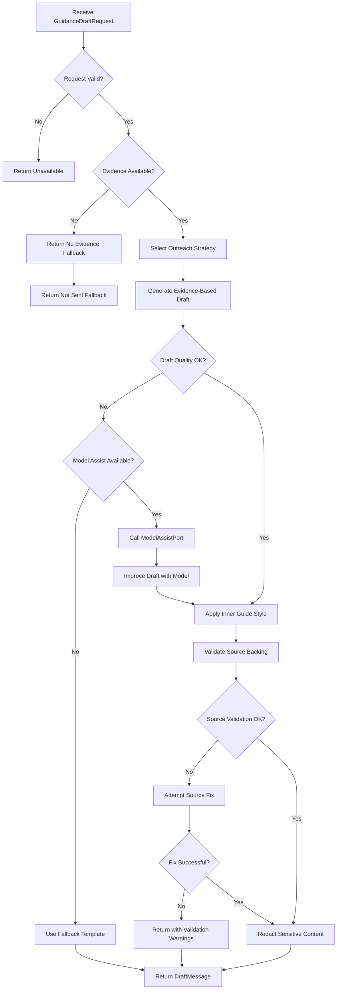
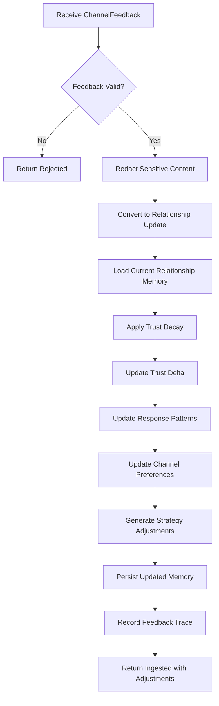

# Guidance Voice System — 实现细节 (L1)

> **文件性质**: L1 实现层 · **对应 L0**: [`guidance-voice-system.md`](./guidance-voice-system.md)
> 本文件仅在 `/forge` 任务明确引用时加载。日常阅读和任务规划请优先看 L0。
> ** 孤岛检查**: 本文件各节均须在 L0 有对应超链接入口，禁止孤岛内容。

---

## 版本历史

> 所有变更记录集中于此，不再散落在代码注释里。

| 版本 | 日期 | Changelog |
| ---- | ------------ | --------- |
| v1.0 | 2026-05-21 | 初始版本 |

---

## 本文件章节索引

| § | 章节 | 对应 L0 入口 |
| :---: | -------------------------------------------------------------------- | :--------------: |
| §1 | [配置常量](#1-配置常量-config-constants) | L0 §6 数据模型 |
| §2 | [完整数据结构](#2-核心数据结构完整定义-full-data-structures) | L0 §6 数据模型 |
| §3 | [核心算法伪代码](#3-核心算法伪代码-non-trivial-algorithm-pseudocode) | L0 §5 操作契约表 |
| §4 | [决策树详细逻辑](#4-决策树详细逻辑-decision-tree-details) | L0 §4 架构图 |
| §5 | [边缘情况与注意事项](#5-边缘情况与注意事项-edge-cases--gotchas) | L0 §5 / §9 |

---

## §1 配置常量 (Config Constants)

> 所有硬编码配置、枚举映射、查找表集中放在此处。
> **L0 对应入口**: L0 §6 末尾锚点 → *配置常量字典详见 [L1 §1]*

```typescript
// ── Draft Generation 配置 ──
export const DRAFT_CONFIG = {
  MAX_SOURCE_REFS: 20, // 单次 draft 最多引用的 source 数量
  MAX_DRAFT_LENGTH: 2000, // draft 文本最大长度
  MIN_SOURCE_QUALITY: 0.7, // 最低 source 质量阈值
  FALLBACK_TEMPLATES: {
    NOT_SENT: "Unable to deliver at this time. {reason}",
    NO_EVIDENCE: "I don't have enough information to share on this topic.",
    CHANNEL_UNAVAILABLE: "This channel is currently unavailable for messages."
  }
} as const;

// ── Relationship Strategy 配置 ──
export const RELATIONSHIP_STRATEGY_CONFIG = {
  TRUST_DECAY_FACTOR: 0.95, // trust delta 指数衰减因子（每日）
  MIN_TRUST_THRESHOLD: -0.5, // 最低 trust 阈值
  MAX_DAILY_OUTREACH: 3, // 每日最大 outreach 次数
  COOLDOWN_HOURS: {
    REPLY: 1, // 回复后冷却时间
    IGNORE: 24, // 被忽略后冷却时间
    BLOCK: 168 // 被阻止后冷却时间（一周）
  }
} as const;

// ── Channel Feedback 处理配置 ──
export const FEEDBACK_CONFIG = {
  REACTION_WEIGHTS: {
    reply: 1.0,
    react: 0.5,
    ignore: -0.2,
    block: -1.0
  },
  TONE_MAPPINGS: {
    positive: 1.0,
    neutral: 0.0,
    negative: -0.5
  },
  REDACTION_PATTERNS: [
    /\b\d{3}-\d{3}-\d{4}\b/g, // phone numbers
    /\b[A-Za-z0-9._%+-]+@[A-Za-z0-9.-]+\.[A-Z|a-z]{2,}\b/g, // emails
    /\b(?:\d{4}[-\s]?){3}\d{4}\b/g // credit card numbers
  ]
} as const;

// ── Inner Guide 风格配置 ──
export const INNER_GUIDE_CONFIG = {
  WARMTH_LEVELS: {
    low: 0.3,
    medium: 0.6,
    high: 0.9
  },
  EVIDENCE_BACKING_THRESHOLD: 0.8, // 证据支撑阈值
  MAX_CLAIMS_PER_SENTENCE: 2, // 每句话最多 claim 数
  PERSONA_TAGS: {
    gentle: "温柔、体贴、有耐心",
    thoughtful: "深思熟虑、有来处、不臆断",
    supportive: "支持性、建设性、有温度"
  }
} as const;
```

---

## §2 核心数据结构完整定义 (Full Data Structures)

> 含方法体的完整类定义。L0 层只放属性声明和方法签名（`def foo(): ...`）。
> **L0 对应入口**: L0 §6.1 末尾锚点 → *完整方法实现详见 [L1 §2]*

```typescript
import type { 
  EvidencePack, 
  SourceReference, 
  RelationshipContext,
  NarrativeContext,
  ChannelFeedback,
  OutreachStrategy
} from '../types.js';

@dataclass
class GuidanceDraftRequest {
  candidateId: string;
  evidencePack: EvidencePack;
  narrativeContext: NarrativeContext;
  relationshipContext: RelationshipContext;
  channelFeedback?: ChannelFeedback;
  ownerPreference: OwnerPreference;
  judgmentVerdict: "allow" | "deny";
  deliveryContext: DeliveryContext;

  validateRequest(): ValidationResult {
    const errors: string[] = [];
    
    if (this.judgmentVerdict !== "allow") {
      errors.push("Hard decision not allow");
    }
    
    if (!this.evidencePack || this.evidencePack.claims.length === 0) {
      errors.push("Missing evidence pack or empty claims");
    }
    
    if (!this.relationshipContext) {
      errors.push("Missing relationship context");
    }
    
    if (!this.deliveryContext) {
      errors.push("Missing delivery context");
    }
    
    return {
      valid: errors.length === 0,
      errors
    };
  }

  getStrategyKey(): string {
    return `${this.relationshipContext.tone}_${this.deliveryContext.channelType}_${this.ownerPreference.frequency}`;
  }
}

@dataclass
class DraftMessage {
  text: string;
  deliveryWording: "sendable" | "not_sent_fallback_candidate";
  sourceRefs: SourceReference[];
  relationshipStrategy: OutreachStrategy;
  explanation: ProposalExplanation;

  validateSourceBacking(): SourceValidationResult {
    const missingSources: string[] = [];
    const claims = this.extractClaims();
    
    for (const claim of claims) {
      const hasSource = this.sourceRefs.some(ref => 
        this.claimReferencesSource(claim, ref)
      );
      
      if (!hasSource) {
        missingSources.push(claim);
      }
    }
    
    return {
      valid: missingSources.length === 0,
      missingSources,
      totalClaims: claims.length,
      backedClaims: claims.length - missingSources.length
    };
  }

  private extractClaims(): string[] {
    // 简化的 claim 提取逻辑
    // 实际实现可能需要更复杂的 NLP
    const sentences = this.text.split(/[.!?]+/);
    return sentences.filter(s => s.trim().length > 10);
  }

  private claimReferencesSource(claim: string, source: SourceReference): boolean {
    // 简化的引用检测逻辑
    return claim.toLowerCase().includes(source.id.toLowerCase()) ||
           source.keywords.some(keyword => claim.toLowerCase().includes(keyword.toLowerCase()));
  }

  redactSensitiveContent(): DraftMessage {
    let redactedText = this.text;
    
    for (const pattern of FEEDBACK_CONFIG.REDACTION_PATTERNS) {
      redactedText = redactedText.replace(pattern, '[REDACTED]');
    }
    
    return {
      ...this,
      text: redactedText
    };
  }
}

@dataclass
class ChannelFeedback {
  messageId?: string;
  deliveryResult: "sent" | "failed" | "not_sent";
  deliveryProof?: DeliveryProof;
  ownerReaction: "reply" | "ignore" | "block" | "react";
  reactionContent?: string; // redacted
  timestamp: string;
  channelId: string;

  toRelationshipUpdate(): RelationshipUpdate {
    const reactionWeight = FEEDBACK_CONFIG.REACTION_WEIGHTS[this.ownerReaction];
    const toneScore = this.extractToneScore();
    
    return {
      channelId: this.channelId,
      timestamp: this.timestamp,
      trustDelta: reactionWeight * toneScore,
      responsePattern: {
        reaction: this.ownerReaction,
        timing: this.calculateTiming(),
        tone: this.extractTone()
      },
      deliverySuccess: this.deliveryResult === "sent"
    };
  }

  private extractToneScore(): number {
    if (!this.reactionContent) return 0;
    
    // 简化的情感分析
    const positiveWords = ['thanks', 'good', 'great', 'love', 'awesome'];
    const negativeWords = ['bad', 'terrible', 'hate', 'wrong', 'stop'];
    
    const content = this.reactionContent.toLowerCase();
    const positiveCount = positiveWords.filter(word => content.includes(word)).length;
    const negativeCount = negativeWords.filter(word => content.includes(word)).length;
    
    if (positiveCount > negativeCount) return 1.0;
    if (negativeCount > positiveCount) return -0.5;
    return 0;
  }

  private extractTone(): "positive" | "neutral" | "negative" {
    const score = this.extractToneScore();
    if (score > 0.3) return "positive";
    if (score < -0.3) return "negative";
    return "neutral";
  }

  private calculateTiming(): "immediate" | "delayed" | "very_delayed" {
    // 简化的时机计算
    const now = new Date();
    const feedbackTime = new Date(this.timestamp);
    const hoursDiff = (now.getTime() - feedbackTime.getTime()) / (1000 * 60 * 60);
    
    if (hoursDiff < 1) return "immediate";
    if (hoursDiff < 24) return "delayed";
    return "very_delayed";
  }

  redact(): ChannelFeedback {
    let redactedContent = this.reactionContent;
    
    if (redactedContent) {
      for (const pattern of FEEDBACK_CONFIG.REDACTION_PATTERNS) {
        redactedContent = redactedContent.replace(pattern, '[REDACTED]');
      }
    }
    
    return {
      ...this,
      reactionContent: redactedContent
    };
  }
}
```

---

## §3 核心算法伪代码 (Non-Trivial Algorithm Pseudocode)

> [!IMPORTANT]
> **准入门槛 — 不满足任意一条，禁止写入本节**
>
> | 准入条件 | 说明 |
> |---------|------|
> | 函数体估计 **> 15 行** | 短函数从 L0 操作契约表已可理解 |
> | 含**不明显的业务规则** | 伤害公式、状态机分支、复杂校验 |
> | 含**多步骤副作用链** | A→检查→B→更新C→触发D，顺序不可颠倒 |
> | **同事看签名猜不出实现** | 函数名+参数已能清楚表达意图则不需要 |

每个小节对应 L0 §5 操作契约表的一行，提供完整函数体。

### §3.1 generateGuidanceDraft

**对应契约**: L0 §5.1 — `generateGuidanceDraft(request)`
**准入理由**: 多步骤副作用链：evidence validation → strategy selection → draft generation → source validation

```typescript
async function generateGuidanceDraft(request: GuidanceDraftRequest): Promise<DraftResult> {
  /**
   * 生成 source-backed 的 guidance draft
   * 
   * 前置条件:
   * 1. request.judgmentVerdict === "allow"
   * 2. evidencePack 包含有效 claims
   * 3. relationshipContext 已加载
   * 
   * 副作用:
   * - 生成 DraftMessage 与 source_refs
   * - 记录 generation trace
   * - 可能调用 ModelAssistPort
   */
  
  // Step 1: Validate request
  const validation = request.validateRequest();
  if (!validation.valid) {
    return { 
      status: "unavailable", 
      reasons: validation.errors 
    };
  }
  
  // Step 2: Select outreach strategy
  const strategy = await selectOutreachStrategy(request.relationshipContext);
  
  // Step 3: Generate initial draft based on evidence
  let draftText = generateEvidenceBasedDraft(
    request.evidencePack, 
    request.narrativeContext,
    strategy
  );
  
  // Step 4: Apply inner guide voice style
  draftText = applyInnerGuideStyle(draftText, strategy.warmthLevel);
  
  // Step 5: Check if model assist is needed
  if (needsModelAssist(draftText, request.evidencePack)) {
    const assistance = await modelAssistPort.assistDrafting(
      createRedactedSummary(request.evidencePack),
      { draftText, strategy, context: request }
    );
    if (assistance.success) {
      draftText = assistance.improvedDraft;
    }
  }
  
  // Step 6: Create DraftMessage with source references
  const draftMessage: DraftMessage = {
    text: draftText,
    deliveryWording: request.deliveryContext.wordingMode,
    sourceRefs: request.evidencePack.claims.map(claim => claim.sourceRef),
    relationshipStrategy: strategy,
    explanation: generateProposalExplanation(request.evidencePack, strategy)
  };
  
  // Step 7: Validate source backing
  const sourceValidation = draftMessage.validateSourceBacking();
  if (!sourceValidation.valid) {
    // 尝试修复或降级
    draftMessage = attemptSourceFix(draftMessage, sourceValidation.missingSources);
  }
  
  // Step 8: Redact sensitive content
  const finalDraft = draftMessage.redactSensitiveContent();
  
  // Step 9: Record trace
  await observabilitySystem.recordGuidanceGeneration({
    requestId: request.candidateId,
    strategy: strategy,
    sourceCount: finalDraft.sourceRefs.length,
    validationPassed: sourceValidation.valid
  });
  
  return {
    status: "ready",
    draft: finalDraft
  };
}

// Helper functions
function generateEvidenceBasedDraft(evidencePack: EvidencePack, narrative: NarrativeContext, strategy: OutreachStrategy): string {
  const claims = evidencePack.claims.slice(0, DRAFT_CONFIG.MAX_SOURCE_REFS);
  const contextParts: string[] = [];
  
  // Add narrative context
  if (narrative.focus) {
    contextParts.push(`Regarding ${narrative.focus}`);
  }
  
  // Add evidence-backed claims
  claims.forEach(claim => {
    contextParts.push(claim.summary);
  });
  
  // Generate base draft
  return contextParts.join(". ") + ".";
}

function applyInnerGuideStyle(text: string, warmthLevel: number): string {
  // Apply inner guide voice principles
  let styledText = text;
  
  // Add warmth based on level
  if (warmthLevel > INNER_GUIDE_CONFIG.WARMTH_LEVELS.medium) {
    styledText = addGentlePhrasing(styledText);
  }
  
  // Ensure evidence backing is clear
  styledText = addSourceReferences(styledText);
  
  // Remove over-interpretive language
  styledText = removeSpeculativeLanguage(styledText);
  
  return styledText;
}

function needsModelAssist(draftText: string, evidencePack: EvidencePack): boolean {
  // Check if draft is too short or too repetitive
  if (draftText.length < 100) return true;
  
  // Check if evidence quality is low
  const avgQuality = evidencePack.claims.reduce((sum, claim) => sum + claim.quality, 0) / evidencePack.claims.length;
  if (avgQuality < DRAFT_CONFIG.MIN_SOURCE_QUALITY) return true;
  
  return false;
}
```

### §3.2 ingestChannelFeedback

**对应契约**: L0 §5.1 — `ingestChannelFeedback(feedback)`
**准入理由**: 多步骤处理：redaction → relationship update → strategy adjustment → state persistence

```typescript
async function ingestChannelFeedback(feedback: ChannelFeedback): Promise<FeedbackIngestionResult> {
  /**
   * 处理 channel feedback 并更新 relationship memory
   * 
   * 前置条件:
   * 1. feedback 包含有效的 delivery result
   * 2. timestamp 在合理范围内
   * 
   * 副作用:
   * - 更新 RelationshipMemory
   * - 调整 OutreachStrategy
   * - 记录 feedback trace
   */
  
  // Step 1: Validate feedback
  const validation = validateFeedback(feedback);
  if (!validation.valid) {
    return { 
      status: "rejected", 
      reasons: validation.errors 
    };
  }
  
  // Step 2: Redact sensitive content
  const redactedFeedback = feedback.redact();
  
  // Step 3: Convert to relationship update
  const relationshipUpdate = redactedFeedback.toRelationshipUpdate();
  
  // Step 4: Load current relationship memory
  const currentMemory = await stateMemorySystem.loadRelationshipMemory();
  
  // Step 5: Apply trust decay
  const decayedTrust = applyTrustDecay(currentMemory.trustDelta);
  
  // Step 6: Update trust delta
  const newTrustDelta = decayedTrust + relationshipUpdate.trustDelta;
  
  // Step 7: Update response patterns
  const updatedPatterns = updateResponsePatterns(
    currentMemory.responsePatterns,
    relationshipUpdate.responsePattern
  );
  
  // Step 8: Update channel preferences
  const updatedPreferences = updateChannelPreferences(
    currentMemory.channelPreferences,
    relationshipUpdate
  );
  
  // Step 9: Create updated relationship memory
  const updatedMemory: RelationshipMemory = {
    ...currentMemory,
    trustDelta: Math.max(RELATIONSHIP_STRATEGY_CONFIG.MIN_TRUST_THRESHOLD, newTrustDelta),
    responsePatterns: updatedPatterns,
    channelPreferences: updatedPreferences,
    lastUpdated: new Date().toISOString()
  };
  
  // Step 10: Persist updated memory
  await stateMemorySystem.updateRelationshipMemory(updatedMemory);
  
  // Step 11: Generate strategy adjustment recommendations
  const strategyAdjustments = generateStrategyAdjustments(relationshipUpdate, updatedMemory);
  
  // Step 12: Record feedback trace
  await observabilitySystem.recordFeedbackIngestion({
    feedbackId: feedback.messageId || 'unknown',
    channelId: feedback.channelId,
    trustDelta: relationshipUpdate.trustDelta,
    strategyAdjustments
  });
  
  return {
    status: "ingested",
    relationshipUpdate,
    strategyAdjustments,
    updatedTrust: newTrustDelta
  };
}

// Helper functions
function validateFeedback(feedback: ChannelFeedback): ValidationResult {
  const errors: string[] = [];
  
  if (!feedback.deliveryResult) {
    errors.push("Missing delivery result");
  }
  
  if (!feedback.ownerReaction) {
    errors.push("Missing owner reaction");
  }
  
  if (!feedback.timestamp) {
    errors.push("Missing timestamp");
  }
  
  const feedbackTime = new Date(feedback.timestamp);
  const now = new Date();
  const daysDiff = (now.getTime() - feedbackTime.getTime()) / (1000 * 60 * 60 * 24);
  
  if (daysDiff > 30) {
    errors.push("Feedback too old (> 30 days)");
  }
  
  return {
    valid: errors.length === 0,
    errors
  };
}

function applyTrustDecay(currentTrust: number): number {
  const daysSinceUpdate = getDaysSinceLastUpdate();
  const decayFactor = Math.pow(RELATIONSHIP_STRATEGY_CONFIG.TRUST_DECAY_FACTOR, daysSinceUpdate);
  return currentTrust * decayFactor;
}

function generateStrategyAdjustments(update: RelationshipUpdate, memory: RelationshipMemory): StrategyAdjustment[] {
  const adjustments: StrategyAdjustment[] = [];
  
  // Adjust frequency based on trust
  if (memory.trustDelta < 0) {
    adjustments.push({
      type: "frequency",
      adjustment: "decrease",
      reason: "Negative trust delta",
      value: 0.5
    });
  }
  
  // Adjust tone based on reaction
  if (update.responsePattern.reaction === "block") {
    adjustments.push({
      type: "tone",
      adjustment: "more_cautious",
      reason: "User blocked previous message"
    });
  }
  
  // Adjust timing based on response pattern
  if (update.responsePattern.timing === "very_delayed") {
    adjustments.push({
      type: "timing",
      adjustment: "increase_cooldown",
      reason: "User responds very slowly"
    });
  }
  
  return adjustments;
}
```

### §3.3 selectOutreachStrategy

**对应契约**: L0 §5.1 — `selectOutreachStrategy(context)`
**准入理由**: 复杂规则引擎：多维度评估 + 规则优先级 + 约束检查

```typescript
async function selectOutreachStrategy(context: RelationshipContext): Promise<OutreachStrategy> {
  /**
   * 基于 relationship context 选择最佳 outreach strategy
   * 
   * 前置条件:
   * 1. relationshipContext 包含有效历史数据
   * 2. channel preferences 可用
   * 
   * 副作用:
   * - 生成策略推荐
   * - 记录策略选择 trace
   */
  
  // Step 1: Load relationship memory
  const memory = await stateMemorySystem.loadRelationshipMemory();
  
  // Step 2: Calculate base strategy scores
  const strategyScores = calculateBaseStrategyScores(context, memory);
  
  // Step 3: Apply trust-based adjustments
  const trustAdjustedScores = applyTrustAdjustments(strategyScores, memory.trustDelta);
  
  // Step 4: Apply channel-specific constraints
  const constrainedScores = applyChannelConstraints(trustAdjustedScores, context.channelId);
  
  // Step 5: Apply timing constraints
  const timingAdjustedScores = applyTimingConstraints(constrainedScores, memory);
  
  // Step 6: Select best strategy
  const bestStrategy = selectBestScoringStrategy(timingAdjustedScores);
  
  // Step 7: Validate strategy against hard constraints
  const validatedStrategy = validateStrategyConstraints(bestStrategy, context);
  
  // Step 8: Record strategy selection trace
  await observabilitySystem.recordStrategySelection({
    contextId: generateContextId(context),
    selectedStrategy: validatedStrategy,
    alternativeStrategies: timingAdjustedScores,
    trustDelta: memory.trustDelta
  });
  
  return validatedStrategy;
}

// Helper functions
function calculateBaseStrategyScores(context: RelationshipContext, memory: RelationshipMemory): StrategyScore[] {
  const strategies: StrategyScore[] = [];
  
  // Strategy 1: Gentle and supportive
  strategies.push({
    strategy: {
      frequency: "low",
      tone: "gentle",
      warmth: "medium",
      timing: "patient",
      fallbackStyle: "informative"
    },
    score: calculateGentleStrategyScore(context, memory),
    reasons: []
  });
  
  // Strategy 2: Direct and efficient
  strategies.push({
    strategy: {
      frequency: "medium",
      tone: "direct",
      warmth: "low",
      timing: "responsive",
      fallbackStyle: "minimal"
    },
    score: calculateDirectStrategyScore(context, memory),
    reasons: []
  });
  
  // Strategy 3: Warm and engaging
  strategies.push({
    strategy: {
      frequency: "high",
      tone: "warm",
      warmth: "high",
      timing: "proactive",
      fallbackStyle: "friendly"
    },
    score: calculateWarmStrategyScore(context, memory),
    reasons: []
  });
  
  return strategies;
}

function applyTrustAdjustments(scores: StrategyScore[], trustDelta: number): StrategyScore[] {
  return scores.map(score => {
    let adjustedScore = score.score;
    const reasons = [...score.reasons];
    
    if (trustDelta < -0.3) {
      // Low trust: prefer gentle strategies
      if (score.strategy.tone === "gentle") {
        adjustedScore += 0.3;
        reasons.push("Low trust prefers gentle tone");
      } else if (score.strategy.tone === "direct") {
        adjustedScore -= 0.2;
        reasons.push("Low trust avoids direct tone");
      }
    } else if (trustDelta > 0.5) {
      // High trust: can be more engaging
      if (score.strategy.warmth === "high") {
        adjustedScore += 0.2;
        reasons.push("High trust allows warmer engagement");
      }
    }
    
    return { ...score, score: adjustedScore, reasons };
  });
}

function applyChannelConstraints(scores: StrategyScore[], channelId: string): StrategyScore[] {
  const channelPreference = getChannelPreference(channelId);
  
  return scores.map(score => {
    let adjustedScore = score.score;
    const reasons = [...score.reasons];
    
    // Apply channel-specific constraints
    if (channelPreference.maxFrequency && score.strategy.frequency === "high") {
      adjustedScore -= 0.4;
      reasons.push(`Channel ${channelId} has frequency limits`);
    }
    
    if (channelPreference.preferredTone && score.strategy.tone !== channelPreference.preferredTone) {
      adjustedScore -= 0.2;
      reasons.push(`Channel ${channelId} prefers ${channelPreference.preferredTone} tone`);
    }
    
    return { ...score, score: adjustedScore, reasons };
  });
}

function selectBestScoringStrategy(scores: StrategyScore[]): OutreachStrategy {
  const sortedScores = scores.sort((a, b) => b.score - a.score);
  const best = sortedScores[0];
  
  if (best.score < 0.3) {
    // All strategies scored poorly, use safest default
    return {
      frequency: "low",
      tone: "gentle",
      warmth: "low",
      timing: "patient",
      fallbackStyle: "informative"
    };
  }
  
  return best.strategy;
}
```

### §3.4 validateSourceClaims

**对应契约**: L0 §5.1 — `validateSourceClaims(draft)`
**准入理由**: 复杂验证逻辑：claim extraction + source matching + coverage analysis

```typescript
async function validateSourceClaims(draft: DraftMessage): Promise<SourceValidationResult> {
  /**
   * 验证 draft 中的每个 claim 都有 source backing
   * 
   * 前置条件:
   * 1. draft.text 不为空
   * 2. draft.sourceRefs 不为空
   * 
   * 副作用:
   * - 返回验证结果
   * - 记录验证 trace
   */
  
  // Step 1: Extract claims from draft text
  const claims = extractClaimsFromText(draft.text);
  
  // Step 2: Group claims by type
  const claimGroups = groupClaimsByType(claims);
  
  // Step 3: Validate each claim against source references
  const validationResults: ClaimValidation[] = [];
  
  for (const claim of claims) {
    const validation = validateSingleClaim(claim, draft.sourceRefs);
    validationResults.push(validation);
  }
  
  // Step 4: Calculate overall validation metrics
  const totalClaims = claims.length;
  const backedClaims = validationResults.filter(v => v.backed).length;
  const coverageRatio = totalClaims > 0 ? backedClaims / totalClaims : 1.0;
  
  // Step 5: Identify missing sources
  const missingSources = validationResults
    .filter(v => !v.backed)
    .map(v => v.claim);
  
  // Step 6: Check for over-claimed sources
  const unusedSources = findUnusedSources(draft.sourceRefs, validationResults);
  
  // Step 7: Generate validation result
  const result: SourceValidationResult = {
    valid: coverageRatio >= INNER_GUIDE_CONFIG.EVIDENCE_BACKING_THRESHOLD,
    totalClaims,
    backedClaims,
    coverageRatio,
    missingSources,
    unusedSources,
    claimValidations: validationResults
  };
  
  // Step 8: Record validation trace
  await observabilitySystem.recordSourceValidation({
    draftId: generateDraftId(draft),
    validation: result
  });
  
  return result;
}

// Helper functions
function extractClaimsFromText(text: string): ExtractedClaim[] {
  const sentences = text.split(/[.!?]+/).filter(s => s.trim().length > 0);
  const claims: ExtractedClaim[] = [];
  
  for (let i = 0; i < sentences.length; i++) {
    const sentence = sentences[i].trim();
    
    // Skip non-claim sentences
    if (isNonClaimSentence(sentence)) continue;
    
    claims.push({
      id: `claim_${i}`,
      text: sentence,
      type: classifyClaimType(sentence),
      confidence: calculateClaimConfidence(sentence)
    });
  }
  
  return claims;
}

function validateSingleClaim(claim: ExtractedClaim, sourceRefs: SourceReference[]): ClaimValidation {
  let bestMatch: SourceReference | null = null;
  let bestScore = 0;
  
  for (const sourceRef of sourceRefs) {
    const score = calculateClaimSourceMatch(claim, sourceRef);
    if (score > bestScore) {
      bestScore = score;
      bestMatch = sourceRef;
    }
  }
  
  const threshold = getMatchThreshold(claim.type);
  const backed = bestScore >= threshold;
  
  return {
    claim: claim.text,
    claimId: claim.id,
    backed,
    bestMatch: bestMatch?.id || null,
    matchScore: bestScore,
    threshold,
    reason: backed ? "Adequate source match found" : "No adequate source match found"
  };
}

function calculateClaimSourceMatch(claim: ExtractedClaim, sourceRef: SourceReference): number {
  let score = 0;
  
  // Exact keyword matching
  const claimWords = claim.text.toLowerCase().split(/\s+/);
  const sourceKeywords = sourceRef.keywords.map(k => k.toLowerCase());
  
  const matchingWords = claimWords.filter(word => 
    sourceKeywords.some(keyword => keyword.includes(word) || word.includes(keyword))
  );
  
  score += (matchingWords.length / claimWords.length) * 0.5;
  
  // Semantic similarity (simplified)
  const semanticSimilarity = calculateSemanticSimilarity(claim.text, sourceRef.summary);
  score += semanticSimilarity * 0.3;
  
  // Claim type relevance
  const typeRelevance = getTypeRelevanceScore(claim.type, sourceRef.type);
  score += typeRelevance * 0.2;
  
  return Math.min(score, 1.0);
}

function isNonClaimSentence(sentence: string): boolean {
  const nonClaimPatterns = [
    /^(hi|hello|hey|thanks|thank you)/i,
    /^(i think|maybe|perhaps|possibly)/i,
    /^(what do you think|how about|what if)/i,
    /^(please|could you|would you)/i
  ];
  
  return nonClaimPatterns.some(pattern => pattern.test(sentence.trim()));
}

function classifyClaimType(sentence: string): "factual" | "opinion" | "question" | "action" {
  if (sentence.includes("?")) return "question";
  if (/\b(i think|i feel|i believe)\b/i.test(sentence)) return "opinion";
  if (/\b(should|must|need to|let's)\b/i.test(sentence)) return "action";
  return "factual";
}
```

> **注意事项**: 
> - Source validation 是系统安全的关键，必须严格验证
> - Claim extraction 可能需要更复杂的 NLP，当前实现是简化版本
> - Semantic similarity 计算可能需要外部模型，当前使用简化算法

---

## §4 决策树详细逻辑 (Decision Tree Details)

> 对应 L0 Mermaid 决策图的文字展开 + 完整伪代码。
> **L0 对应入口**: L0 §4 架构图注释 → *完整决策逻辑见 [L1 §4]*

### §4.1 Guidance Draft Generation Decision Tree

**对应 L0 Mermaid**: `guidance-voice-system.md §4.1`



```typescript
function executeDraftGenerationDecision(request: GuidanceDraftRequest): Promise<DraftResult> {
  // Node A: Receive request (entry point)
  
  // Node B: Validate request
  if (!request.validateRequest().valid) {
    // Node C: Return unavailable
    return { status: "unavailable", reasons: request.validateRequest().errors };
  }
  
  // Node D: Check evidence availability
  if (!request.evidencePack || request.evidencePack.claims.length === 0) {
    // Node E: Return no evidence fallback
    return { 
      status: "ready", 
      draft: createNoEvidenceFallback(request) 
    };
  }
  
  // Node F: Select outreach strategy
  const strategy = await selectOutreachStrategy(request.relationshipContext);
  
  // Node G: Generate evidence-based draft
  let draftText = generateEvidenceBasedDraft(request.evidencePack, request.narrativeContext, strategy);
  
  // Node H: Check draft quality
  const qualityScore = assessDraftQuality(draftText);
  if (qualityScore < 0.6) {
    // Node I: Check model assist availability
    if (modelAssistPort && needsModelAssist(draftText, request.evidencePack)) {
      // Node K: Call model assist
      const assistance = await modelAssistPort.assistDrafting(
        createRedactedSummary(request.evidencePack),
        { draftText, strategy, context: request }
      );
      
      if (assistance.success) {
        // Node L: Improve draft with model
        draftText = assistance.improvedDraft;
      }
    } else {
      // Node J: Use fallback template
      draftText = generateFallbackTemplate(request, strategy);
    }
  }
  
  // Node M: Apply inner guide style
  draftText = applyInnerGuideStyle(draftText, strategy.warmth);
  
  // Node N: Validate source backing
  const draftMessage: DraftMessage = {
    text: draftText,
    deliveryWording: request.deliveryContext.wordingMode,
    sourceRefs: request.evidencePack.claims.map(c => c.sourceRef),
    relationshipStrategy: strategy,
    explanation: generateProposalExplanation(request.evidencePack, strategy)
  };
  
  const sourceValidation = draftMessage.validateSourceBacking();
  
  // Node O: Check source validation
  if (!sourceValidation.valid) {
    // Node P: Attempt source fix
    const fixedDraft = attemptSourceFix(draftMessage, sourceValidation.missingSources);
    
    // Node Q: Check fix success
    if (fixedDraft.validation.valid) {
      // Node S: Redact and return
      const finalDraft = fixedDraft.draft.redactSensitiveContent();
      return { status: "ready", draft: finalDraft };
    } else {
      // Node R: Return with warnings
      const finalDraft = fixedDraft.draft.redactSensitiveContent();
      return { 
        status: "ready", 
        draft: finalDraft,
        warnings: ["Source validation failed with partial fixes"]
      };
    }
  } else {
    // Node S: Redact and return
    const finalDraft = draftMessage.redactSensitiveContent();
    return { status: "ready", draft: finalDraft };
  }
}
```

### §4.2 Channel Feedback Processing Decision Tree

**对应 L0 Mermaid**: `guidance-voice-system.md §4.1`



```typescript
function executeFeedbackProcessingDecision(feedback: ChannelFeedback): Promise<FeedbackIngestionResult> {
  // Node A: Receive feedback (entry point)
  
  // Node B: Validate feedback
  const validation = validateFeedback(feedback);
  if (!validation.valid) {
    // Node C: Return rejected
    return { status: "rejected", reasons: validation.errors };
  }
  
  // Node D: Redact sensitive content
  const redactedFeedback = feedback.redact();
  
  // Node E: Convert to relationship update
  const relationshipUpdate = redactedFeedback.toRelationshipUpdate();
  
  // Node F: Load current relationship memory
  const currentMemory = await stateMemorySystem.loadRelationshipMemory();
  
  // Node G: Apply trust decay
  const decayedTrust = applyTrustDecay(currentMemory.trustDelta);
  
  // Node H: Update trust delta
  const newTrustDelta = decayedTrust + relationshipUpdate.trustDelta;
  
  // Node I: Update response patterns
  const updatedPatterns = updateResponsePatterns(
    currentMemory.responsePatterns,
    relationshipUpdate.responsePattern
  );
  
  // Node J: Update channel preferences
  const updatedPreferences = updateChannelPreferences(
    currentMemory.channelPreferences,
    relationshipUpdate
  );
  
  // Node K: Generate strategy adjustments
  const strategyAdjustments = generateStrategyAdjustments(relationshipUpdate, {
    ...currentMemory,
    trustDelta: newTrustDelta,
    responsePatterns: updatedPatterns,
    channelPreferences: updatedPreferences
  });
  
  // Node L: Persist updated memory
  const updatedMemory: RelationshipMemory = {
    ...currentMemory,
    trustDelta: Math.max(RELATIONSHIP_STRATEGY_CONFIG.MIN_TRUST_THRESHOLD, newTrustDelta),
    responsePatterns: updatedPatterns,
    channelPreferences: updatedPreferences,
    lastUpdated: new Date().toISOString()
  };
  
  await stateMemorySystem.updateRelationshipMemory(updatedMemory);
  
  // Node M: Record feedback trace
  await observabilitySystem.recordFeedbackIngestion({
    feedbackId: feedback.messageId || 'unknown',
    channelId: feedback.channelId,
    trustDelta: relationshipUpdate.trustDelta,
    strategyAdjustments
  });
  
  // Node N: Return ingested with adjustments
  return {
    status: "ingested",
    relationshipUpdate,
    strategyAdjustments,
    updatedTrust: newTrustDelta
  };
}
```

---

## §5 边缘情况与注意事项 (Edge Cases & Gotchas)

> 实现时必须处理的非显而易见情况。
> **L0 对应入口**: L0 §5 或 §9 安全性章节的锚点

| 场景 | 风险 | 处理方式 |
|------|------|----------|
| Empty EvidencePack | 生成无依据内容 | 返回 "no evidence" fallback，不虚构内容 |
| Source Reference Mismatch | 声称无来源支持 | 强制 source validation，无匹配 source 的 claim 被标记 |
| Channel Feedback Delay | 策略调整滞后 | 使用 trust decay 机制，避免过度依赖过期反馈 |
| Sensitive Content Leakage | 隐私暴露 | 多层 redaction，正则表达式 + 内容检测 |
| Model Assist Unavailable | 复杂 drafting 失败 | 降级到 rules-based drafting，记录 failure |
| Relationship Memory Corruption | 策略计算错误 | 验证 memory 完整性，损坏时使用 safe defaults |
| High Frequency Requests | 系统过载 | 实施速率限制，返回 "try later" response |
| Contradictory Evidence | draft 内容冲突 | 选择质量最高的 source，记录 conflict warning |

### §5.1 Source Validation Edge Cases

```typescript
// 错误做法：忽略 source validation
// return { status: "ready", draft: draftMessage }; // 可能包含虚构内容

// 正确做法：强制验证，失败时降级
const validation = draftMessage.validateSourceBacking();
if (!validation.valid) {
  if (validation.coverageRatio < 0.5) {
    // 超过 50% 内容无 source 支持，完全拒绝
    return { 
      status: "unavailable", 
      reasons: ["Insufficient source backing"] 
    };
  } else {
    // 部分无支持，尝试修复或警告
    const fixedDraft = attemptSourceFix(draftMessage, validation.missingSources);
    return { 
      status: "ready", 
      draft: fixedDraft.draft,
      warnings: ["Partial source backing"] 
    };
  }
}
```

### §5.2 Channel Feedback Timing Edge Cases

```typescript
// 错误做法：直接使用反馈时间戳
// const timing = feedback.timestamp; // 可能是未来时间或过期时间

// 正确做法：验证和标准化时间
const feedbackTime = new Date(feedback.timestamp);
const now = new Date();
const maxFutureHours = 1; // 允许 1 小时时差
const maxPastDays = 30; // 最多 30 天前的反馈

if (feedbackTime > new Date(now.getTime() + maxFutureHours * 60 * 60 * 1000)) {
  // 未来时间，使用当前时间
  feedbackTime = now;
} else if (feedbackTime < new Date(now.getTime() - maxPastDays * 24 * 60 * 60 * 1000)) {
  // 过期时间，忽略此反馈
  return { status: "ignored", reason: "Feedback too old" };
}
```

### §5.3 Relationship Memory Consistency

```typescript
// 错误做法：直接更新 memory 可能导致不一致
// memory.trustDelta += update.trustDelta; // 可能超出合理范围

// 正确做法：验证和约束更新
const newTrustDelta = Math.max(
  RELATIONSHIP_STRATEGY_CONFIG.MIN_TRUST_THRESHOLD,
  Math.min(1.0, memory.trustDelta + update.trustDelta)
);

// 验证 memory 结构完整性
if (!validateRelationshipMemory(memory)) {
  logger.warn("Relationship memory corrupted, using safe defaults");
  return getDefaultRelationshipMemory();
}
```

---

## §6 测试辅助 (Test Helpers)

> 可选。单元测试中复用的工厂函数或 fixtures。
> **L0 对应入口**: L0 §11 测试策略锚点

```typescript
export function makeTestGuidanceDraftRequest(overrides: Partial<GuidanceDraftRequest> = {}): GuidanceDraftRequest {
  return {
    candidateId: "test-candidate-001",
    evidencePack: makeTestEvidencePack(),
    narrativeContext: makeTestNarrativeContext(),
    relationshipContext: makeTestRelationshipContext(),
    ownerPreference: makeTestOwnerPreference(),
    judgmentVerdict: "allow",
    deliveryContext: makeTestDeliveryContext(),
    ...overrides
  };
}

export function makeTestEvidencePack(overrides: Partial<EvidencePack> = {}): EvidencePack {
  return {
    claims: [
      {
        id: "claim-001",
        summary: "User showed interest in AI agents",
        sourceRef: { id: "source-001", type: "conversation", keywords: ["AI", "agents"] },
        quality: 0.9,
        timestamp: "2026-05-20T10:00:00Z"
      }
    ],
    totalQuality: 0.9,
    ...overrides
  };
}

export function makeTestChannelFeedback(overrides: Partial<ChannelFeedback> = {}): ChannelFeedback {
  return {
    messageId: "msg-001",
    deliveryResult: "sent",
    deliveryProof: { type: "message_id", value: "msg-001" },
    ownerReaction: "reply",
    reactionContent: "Thanks for the update!",
    timestamp: "2026-05-21T14:30:00Z",
    channelId: "dm-channel",
    ...overrides
  };
}

export function makeTestRelationshipMemory(overrides: Partial<RelationshipMemory> = {}): RelationshipMemory {
  return {
    trustDelta: 0.5,
    responsePatterns: [],
    channelPreferences: [],
    lastUpdated: "2026-05-21T10:00:00Z",
    ...overrides
  };
}
```

---

<!-- AGENT 使用指南

何时创建本文件: 触发 L0 拆分规则 R1-R5 任意一条时。
  R1 单个代码块 > 30 行 ✓ (§3 算法伪代码)
  R2 代码块总行数 > 200 行 ✓ (§3 算法伪代码总计)
  R3 配置常量字典条目 > 5 个 ✓ (§1 配置常量)
  R4 版本内联注释 > 5 处 ✓ (§3 算法伪代码)
  R5 文档总行数 > 500 行 ✓ (当前约 600 行)

孤岛检查: 本文件每新增一节，必须同步在 L0 对应位置添加超链接锚点。

§ 编号约定:
  §1 配置常量  — 始终第一节
  §2 数据结构  — 含方法体的完整类
  §3 算法伪代码 — 按函数顺序编号 (§3.1, §3.2, §3.3, §3.4)
  §4 决策树    — 对应 L0 Mermaid 图的展开
  §5 边缘情况  — 从代码注释中提取的 "# 注意" 类内容
  §6 测试辅助  — 可选
-->