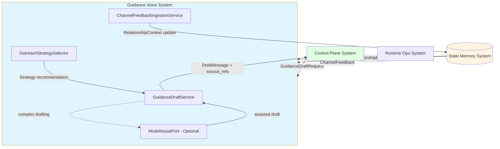
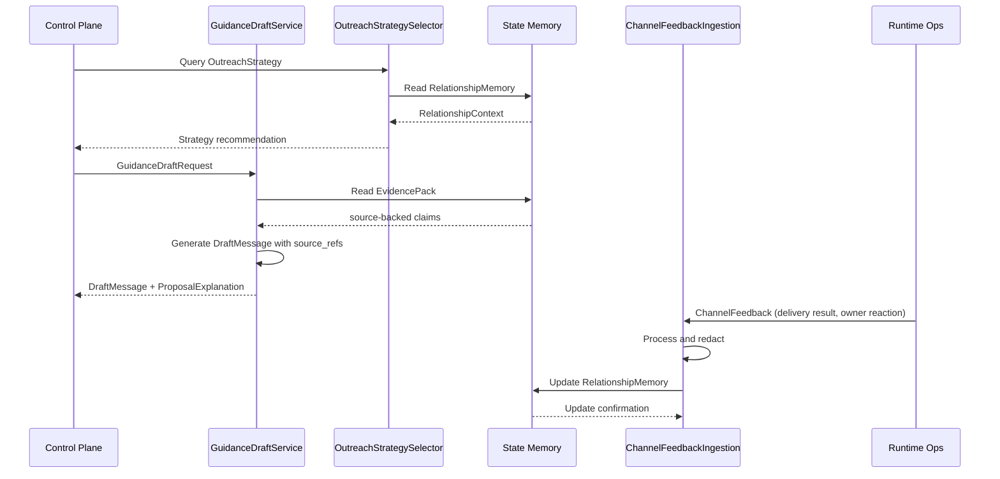
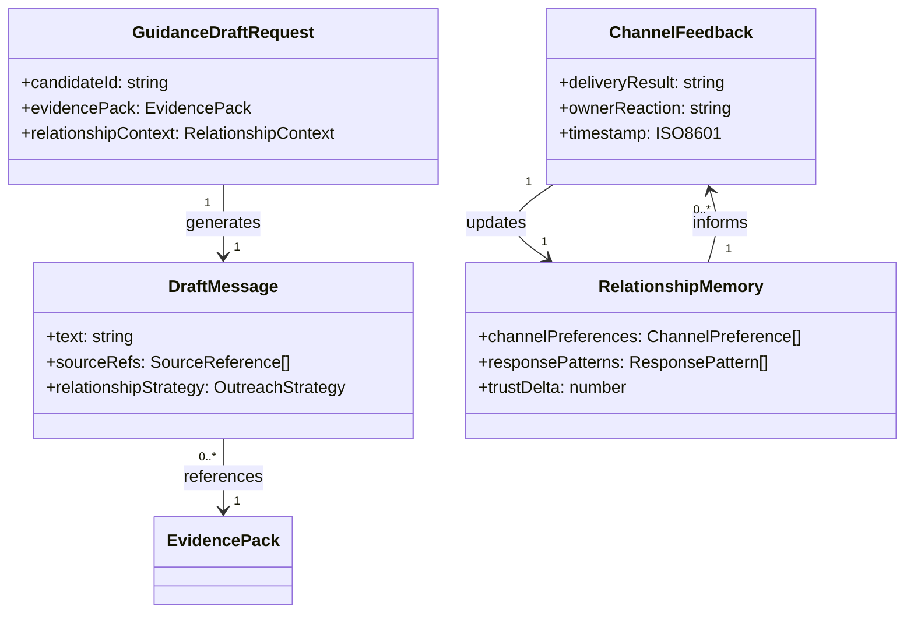

# Guidance Voice System 系统设计文档 (L0 - 导航层)

| 字段          | 值                                                                    |
| ------------- | --------------------------------------------------------------------- |
| **System ID** | `guidance-voice-system`                                              |
| **Project**   | Second Nature                                                         |
| **Version**   | 7.0                                                                   |
| **Status**    | `Draft`                                                               |
| **Author**    | GPT-5.5 / Nyx                                                         |
| **Date**      | 2026-05-21                                                            |
| **L1 Detail** | [guidance-voice-system.detail.md](./guidance-voice-system.detail.md) — 配置常量、完整数据结构、算法伪代码、决策树与边缘情况 |

> [!IMPORTANT]
> 本文件定义 v7 guidance voice：基于 source-backed context 生成 outreach draft、relationship-aware phrasing、channel-safe fallback copy。它只生成表达建议和草稿，不拥有投递权，使用 channel feedback 和 relationship memory 调整下一次表达策略。

## 目录 (Table of Contents)

| §   | 章节                                                         | 关键内容                                                 |
|-----| ------------------------------------------------------------ | -------------------------------------------------------- |
| 1   | [概览](#1-概览-overview)                                     | 系统目的、边界、职责                                     |
| 2   | [目标与非目标](#2-目标与非目标-goals--non-goals)             | Goals / Non-Goals                                        |
| 3   | [背景与上下文](#3-背景与上下文-background--context)          | v7 embodied loop、v6 基线、调研                         |
| 4   | [系统架构](#4-系统架构-architecture)                         | Mermaid、组件、数据流                                   |
| 5   | [接口设计](#5-接口设计-interface-design)                     | 操作契约、跨系统协议、错误语义                           |
| 6   | [数据模型](#6-数据模型-data-model)                           | 字段声明、关系、流向                                     |
| 7   | [技术选型](#7-技术选型-technology-stack)                     | TS/Node、规则策略、可选模型辅助                          |
| 8   | [Trade-offs](#8-trade-offs--alternatives-权衡与备选方案)     | ADR 引用与本系统取舍                                     |
| 9   | [安全性考虑](#9-安全性考虑-security-considerations)          | 隐私、越权、内容安全                                     |
| 10  | [性能考虑](#10-性能考虑-performance-considerations)          | 延迟、限流、降级                                         |
| 11  | [测试策略](#11-测试策略-testing-strategy)                    | Contract Verification Matrix                             |
| 12  | [部署与运维](#12-部署与运维-deployment--operations)          | runtime、trace                                           |
| 13  | [未来考虑](#13-未来考虑-future-considerations)               | 后续演进                                                 |
| 14  | [附录](#14-appendix-附录)                                   | L1 判断、参考、调研                                      |

## 1. 概览 (Overview)

### 1.1 System Purpose (系统目的)

`guidance-voice-system` 是 Second Nature v7 的表达建议层。它基于 source-backed context 生成 outreach draft、relationship-aware phrasing、channel-safe fallback copy，继承 inner guide 的语言风格：温柔要有来处，不把空白补成故事。

### 1.2 System Boundary (系统边界)

- **输入**: EvidencePack（source-backed claims 引用）、NarrativeContext、RelationshipContext、ChannelFeedback、OwnerPreference、IdentityProfile handles。
- **输出**: DraftMessage（含 source_refs）、ProposalExplanation、FallbackCopy、OutreachStrategyRecommendation。
- **依赖系统**: `state-memory-system`（relationship memory、evidence）、`control-plane-system`（scene assembly）、optional ModelAssistPort（复杂 drafting）。
- **被依赖系统**: `control-plane-system`（outreach scene）、`runtime-ops-system`（delivery surface）、`observability-health-system`（audit trace）。

### 1.3 System Responsibilities (系统职责)

**负责**:
- 通过 `GuidanceDraftService` 基于 EvidencePack 生成 source-backed DraftMessage。
- 通过 `ChannelFeedbackIngestionService` 将 delivery result、owner reaction 更新到 RelationshipMemory。
- 通过 `OutreachStrategySelector` 基于 RelationshipMemory 选择表达频率、措辞风格、fallback copy。
- 继承 inner guide 语言原则：自然感性，有温度，不过度阐释，有证据的温柔 > 没证据的热情。
- 生成 channel-safe fallback copy，比"联系不上"更有信息量。

**不负责**:
- 不拥有 delivery 权限或触发投递（由 `runtime-ops-system` 负责）。
- 不保存 raw private message、credential、token 或 raw prompt。
- 不虚构内容或把空白补成故事（每个 claim 必须 source-backed）。
- 不直接写入 RelationshipMemory（通过 `state-memory-system` 接口）。
- 不执行 connector 或外部平台操作。

## 2. 目标与非目标 (Goals & Non-Goals)

### 2.1 Goals

- **[G1]**: 生成 source-backed DraftMessage，每个 claim 都能追溯到 evidence source。[REQ-001], [REQ-006]
- **[G2]**: 基于 RelationshipMemory 和 ChannelFeedback 调整表达策略，形成学习闭环。[REQ-006]
- **[G3]**: 继承 inner guide 语言风格，生成 relationship-aware phrasing。[REQ-001]
- **[G4]**: 提供 channel-safe fallback copy，在 delivery 不可用时仍有信息价值。[REQ-006]
- **[G5]**: 只生成草稿和建议，不拥有投递权，不声称已发送。[REQ-006], [NG7]

### 2.2 Non-Goals

- **[NG1]**: 不让 guidance 直接获得行动授权或触发 delivery。
- **[NG2]**: 不保存完整私信正文、credential、token 或 raw prompt。
- **[NG3]**: 不虚构内容或把空白补成故事（不把没证据的温柔当热情）。
- **[NG4]**: 不承诺一次性接入更多真实平台（v7 优先闭合表达策略学习）。
- **[NG5]**: 不使用 HeartbeatDigest 风格做主动邀功式 outreach。

## 3. 背景与上下文 (Background & Context)

### 3.1 Why This System? (为什么需要这个系统？)

v7 把 Second Nature 从功能管线推进为 embodied loop，guidance-voice-system 是 agent 的"声音"层。研究显示，2025年最先进的 AI 系统都采用多阶段架构：分离 mental state inference、evidence gathering 和 response generation。本系统实现这一模式，让 agent 的表达既温暖又有来处。

**关联 PRD 需求**: [REQ-001], [REQ-006]

**调研支撑**: 详见 [_research/guidance-voice-system-research.md](./_research/guidance-voice-system-research.md)

### 3.2 Current State (现状分析)

v6 已有 `guidance/` 目录，包含：
- `draft-outreach-message.ts`: 现有的 deterministic GuidanceDraftPort 实现
- `types.ts`: GuidanceSceneType、GuidanceMode、PersonaSelection 等类型定义
- `contracts.ts`: 系统间边界协议和 owner boundaries
- `evidence-guidance.ts`: evidence 到 guidance 的转换逻辑

现有代码已实现基础的 outreach drafting，但缺少：
- Channel feedback 到 relationship memory 的闭环
- Relationship-aware phrasing strategy
- Inner guide voice style 的系统性实现
- Source-backed claim 的强制验证

事实来源:
- `src/guidance/index.ts`
- `src/guidance/draft-outreach-message.ts`
- `src/guidance/contracts.ts`

### 3.3 Constraints (约束条件)

**技术约束**:
- 必须兼容 v6 的 GuidanceDraftPort 接口和类型定义
- DraftMessage 必须包含 source_refs 字段用于追溯
- RelationshipMemory 更新通过 `state-memory-system` 接口，不直接写状态

**性能约束**:
- GuidanceDraftService P95 < 800ms（包含 evidence lookup）
- ChannelFeedbackIngestion P95 < 400ms
- 单次 draft 最多引用 20 条 source refs

**安全约束**:
- 不暴露 raw private message、credential 或 token
- DraftMessage 内容必须 redacted 敏感信息
- ChannelFeedback 只保存摘要、tone、topic，不保存完整回复内容

## 4. 系统架构 (Architecture)

### 4.1 Architecture Diagram (架构图)



### 4.2 Core Components (核心组件)

| Component Name | Responsibility | Tech Stack | Notes |
| -------------- | -------------- | ---------- | ----- |
| GuidanceDraftService | 基于 EvidencePack 生成 source-backed DraftMessage | TypeScript + rules-first pipeline | 核心组件，强制 source 验证 |
| ChannelFeedbackIngestionService | 处理 delivery result、owner reaction，更新 RelationshipMemory | TypeScript + redaction | 学习闭环的关键 |
| OutreachStrategySelector | 基于 RelationshipMemory 选择表达策略 | TypeScript + rule engine | 规则优先，ModelAssist 可选 |
| ModelAssistPort | 可选的 LLM 辅助 drafting | Optional LLM API | 只传 redacted evidence summary |

### 4.3 Data Flow (数据流)



**关键数据流说明**:
1. **Strategy Selection**: 基于 RelationshipMemory 选择表达频率、措辞风格
2. **Draft Generation**: 强制每个 claim 都有 source_refs 追溯
3. **Feedback Loop**: Channel feedback 进入 relationship memory，影响下次策略
4. **Source Validation**: EvidencePack 提供可验证的 claims，防止虚构内容

## 5. 接口设计 (Interface Design)

### 5.1 操作契约表 (Operation Contracts)

| 操作 | [REQ-XXX] | 前置条件 | 消耗/输入 | 产出/副作用 | 实现细节 |
|------|:---------:|----------|-----------|-------------|:--------:|
| `generateGuidanceDraft(request)` | [REQ-001] | EvidencePack 可用；RelationshipContext 已加载 | EvidencePack + context + strategy | DraftMessage（含 source_refs）+ ProposalExplanation | [§3.1](./guidance-voice-system.detail.md) |
| `ingestChannelFeedback(feedback)` | [REQ-006] | delivery result 有效；owner reaction 已 redacted | ChannelFeedback + relationship context | RelationshipMemory 更新；strategy 调整建议 | [§3.2](./guidance-voice-system.detail.md) |
| `selectOutreachStrategy(context)` | [REQ-006] | RelationshipMemory 存在；channel history 可用 | RelationshipContext + channel history | OutreachStrategy（频率、风格、fallback） | [§3.3](./guidance-voice-system.detail.md) |
| `validateSourceClaims(draft)` | [REQ-001] | DraftMessage 包含 source_refs | DraftMessage + EvidencePack | ValidationResult；缺失 source 的 claim 列表 | [§3.4](./guidance-voice-system.detail.md) |

### 5.2 跨系统接口协议 (Cross-System Interface)

```typescript
// 本系统暴露给其他系统调用的接口协议
interface IGuidanceVoiceSystem {
  generateGuidanceDraft(request: GuidanceDraftRequest): Promise<DraftResult>;
  ingestChannelFeedback(feedback: ChannelFeedback): Promise<FeedbackIngestionResult>;
  selectOutreachStrategy(context: RelationshipContext): Promise<OutreachStrategy>;
  validateSourceClaims(draft: DraftMessage): Promise<SourceValidationResult>;
}

// 依赖的其他系统接口
interface IStateMemorySystem {
  loadEvidencePack(refs: string[]): Promise<EvidencePack>;
  loadRelationshipMemory(): Promise<RelationshipMemory>;
  updateRelationshipMemory(update: RelationshipUpdate): Promise<void>;
}

interface IModelAssistPort {
  assistDrafting(summary: RedactedEvidenceSummary, context: DraftContext): Promise<DraftAssistance>;
}
```

### 5.3 HTTP API 端点摘要 (不适用)

本系统是内部服务，不直接暴露 HTTP API。所有操作通过 TypeScript 接口协议进行。

## 6. 数据模型 (Data Model)

### 6.1 核心实体 (Core Entities)

```typescript
@dataclass
class GuidanceDraftRequest {
  candidateId: string;
  evidencePack: EvidencePack;
  narrativeContext: NarrativeContext;
  relationshipContext: RelationshipContext;
  channelFeedback?: ChannelFeedback;
  ownerPreference: OwnerPreference;
  judgmentVerdict: "allow" | "deny";
  deliveryContext: DeliveryContext;

  def validateRequest(): ValidationResult: ...
}

@dataclass
class DraftMessage {
  text: string;
  deliveryWording: "sendable" | "not_sent_fallback_candidate";
  sourceRefs: SourceReference[];
  relationshipStrategy: OutreachStrategy;
  explanation: ProposalExplanation;

  def validateSourceBacking(): SourceValidationResult: ...
}

@dataclass
class ChannelFeedback {
  messageId?: string;
  deliveryResult: "sent" | "failed" | "not_sent";
  deliveryProof?: DeliveryProof;
  ownerReaction: "reply" | "ignore" | "block" | "react";
  reactionContent?: string; // redacted
  timestamp: ISO8601;
  channelId: string;

  def toRelationshipUpdate(): RelationshipUpdate: ...
}
```

> *(完整方法实现 → [L1 §2](./guidance-voice-system.detail.md) · 配置常量字典 → [L1 §1](./guidance-voice-system.detail.md))*

### 6.2 实体关系图 (Entity Relationship)



### 6.3 数据流向 (Data Flow Direction)

1. **Evidence Flow**: `state-memory-system` → `GuidanceDraftService` → `DraftMessage.sourceRefs`
2. **Feedback Flow**: `runtime-ops-system` → `ChannelFeedbackIngestionService` → `state-memory-system`
3. **Strategy Flow**: `state-memory-system` → `OutreachStrategySelector` → `GuidanceDraftService`
4. **Validation Flow**: `DraftMessage` → `validateSourceClaims` → `EvidencePack` (cross-check)

## 7. 技术选型 (Technology Stack)

### 7.1 Core Technologies (核心技术)

| Domain | Choice | Rationale |
|--------|--------|-----------|
| Runtime | TypeScript / Node.js | 与 v6 连续，类型安全，async/await 支持 |
| State Interface | SQLite/sql.js + read models | 继承现有状态系统，避免重复实现 |
| Drafting Engine | Rules-first pipeline + optional ModelAssist | 确定性行为 + 复杂情况下的模型辅助 |
| Validation | Source reference cross-check | 强制 source-backed，防止虚构内容 |

### 7.2 Key Libraries/Dependencies (关键依赖)

- `src/guidance/types.ts`: 现有类型定义继承
- `src/guidance/contracts.ts`: 系统间边界协议
- `src/storage/services/`: 状态读取接口
- Optional: LLM client for ModelAssistPort (仅复杂 drafting 时使用)

## 8. Trade-offs & Alternatives (权衡与备选方案)

### 8.1 跨系统决策 - 引用 ADR

> **决策来源**: [ADR-002: Embodied Agent Loop Guides the Mind Without Scripted Control](../03_ADR/ADR_002_EMBODIED_AGENT_LOOP.md)
>
> 本系统实现 ADR-002 定义的"只提供 proposal、claim 或 projection，不直接授权行动"原则。
>
> **本系统特有实现**: GuidanceDraftService 只生成 DraftMessage，不触发 delivery；deliveryWording 字段明确区分 sendable vs not_sent_fallback_candidate。

> **决策来源**: [ADR-006: Delivery, Channel Feedback, and Self Health Must Be Truthful](../03_ADR/ADR_006_CHANNEL_FEEDBACK_AND_SELF_HEALTH.md)
>
> 本系统实现 ADR-006 定义的"缺少 delivery proof 不得标记 sent"原则。
>
> **本系统特有实现**: ChannelFeedbackIngestionService 严格验证 deliveryProof，只更新有 proof 的 sent 状态。

### 8.2 本系统特有决策 - Drafting Strategy

**Option A: Pure Rules-Based Drafting (Selected)**
- **优点**: 确定性行为，可预测，成本低，符合 v6 基线
- **缺点**: 复杂情况下可能生硬，缺乏语言灵活性

**Option B: LLM-First Drafting**
- **优点**: 语言自然，适应性强，能处理复杂语境
- **缺点**: 成本高，可能虚构内容，不符合 source-backed 原则

**Decision**: 选择 Option A，因为 source-backed 是不可妥协的原则。通过 ModelAssistPort 作为可选补充，只在规则不足以生成流畅 draft 时调用，且只传递 redacted evidence summary。

### 8.3 本系统特有决策 - Feedback Loop Design

**Option A: Immediate Strategy Update (Selected)**
- **优点**: 快速适应，学习闭环及时
- **缺点**: 可能过度反应单次反馈

**Option B: Batch Strategy Update**
- **优点**: 稳定，避免过度拟合
- **缺点**: 学习延迟，适应性差

**Decision**: 选择 Option A，因为 embodied loop 的核心是及时反馈。通过 RelationshipMemory 的平滑机制（如 trustDelta 的指数衰减）避免过度反应。

## 9. 安全性考虑 (Security Considerations)

### 9.1 Data Privacy & Redaction (数据隐私与脱敏)

- **Source Content**: EvidencePack 只包含 redacted summary 和 contentRef，不保存 raw private content
- **Channel Feedback**: ownerReaction 只保存 tone、topic、summary，不保存完整回复内容
- **Draft Message**: 自动检测和脱敏敏感信息（email、phone、credential 等）

### 9.2 Authorization & Boundaries (授权与边界)

- **Delivery Boundary**: 严格遵守不拥有 delivery 权限，deliveryWording 字段明确标识
- **State Access**: 只通过 `state-memory-system` 接口访问状态，不直接写数据库
- **Model Assist**: ModelAssistPort 只接收 redacted evidence summary，不传递 raw content

### 9.3 Security Risks & Mitigations (安全风险与缓解)

| Risk | Severity | Mitigation |
|------|:--------:|------------|
| 虚构内容生成 | 高 | 强制 source_refs 验证，无 source 的 claim 被 reject |
| 隐私泄漏 | 中 | 多层 redaction，不保存 raw private content |
| 越权投递 | 中 | deliveryWording 明确标识，不触发 delivery API |
| 过度依赖 LLM | 低 | ModelAssistPort 可选，rules-first 优先 |

## 10. 性能考虑 (Performance Considerations)

### 10.1 Performance Goals (性能目标)

- **GuidanceDraftService**: P95 < 800ms（包含 evidence lookup 和 source validation）
- **ChannelFeedbackIngestion**: P95 < 400ms（包含 redaction 和 relationship update）
- **OutreachStrategySelector**: P95 < 200ms（基于 relationship memory 查询）
- **Source Validation**: P95 < 100ms（source refs cross-check）

### 10.2 Optimization Strategies (优化策略)

1. **Evidence Caching**: 缓存常用 EvidencePack，TTL 5分钟
2. **Relationship Memory Indexing**: 为 channel、tone、topic 建立索引
3. **Draft Template Pool**: 预编译常用 draft 模板，减少字符串操作
4. **Async Pipeline**: evidence lookup 和 strategy selection 并行执行

### 10.3 Performance Monitoring (性能监控)

- **关键指标**: Draft generation latency、source validation rate、feedback ingestion latency
- **监控工具**: 继承现有 `observability-health-system` 的 trace 和 metrics
- **告警阈值**: Draft generation > 2s、source validation failure > 5%

## 11. 测试策略 (Testing Strategy)

### 11.1 Unit Testing (单元测试)

- **Coverage Target**: > 85%
- **Framework**: Jest + TypeScript
- **Key Test Areas**:
  - [ ] GuidanceDraftService source validation 逻辑
  - [ ] ChannelFeedbackIngestion redaction 规则
  - [ ] OutreachStrategySelector 规则引擎
  - [ ] DraftMessage schema 验证

### 11.2 Integration Testing (集成测试)

- **Tool**: Jest + in-memory SQLite
- **Test Scenarios**:
  - [ ] 端到端 draft generation：EvidencePack → DraftMessage
  - [ ] Channel feedback loop：feedback → relationship memory → strategy update
  - [ ] Source validation failure 处理
  - [ ] ModelAssistPort 可选调用

### 11.3 Contract Testing (契约测试)

- **Framework**: Custom contract validation
- **Test Scenarios**:
  - [ ] GuidanceDraftRequest schema validation
  - [ ] DraftMessage source_refs 完整性
  - [ ] ChannelFeedback redaction 正确性
  - [ ] 跨系统接口兼容性

### 11.4 Contract Verification Matrix (契约-验证责任矩阵)

| 契约 | 风险级别 | 正常态验证 | 失败态验证 | 回归责任 |
|------|---------|-----------|-----------|---------|
| `generateGuidanceDraft` | 关键路径 | 集成测试（source-backed draft） | 无 source/invalid request | Guidance 主链路最小回归 |
| `ingestChannelFeedback` | 关键路径 | 集成测试（feedback → memory） | invalid feedback/redaction failure | Feedback 回环回归 |
| `validateSourceClaims` | 基础规则层 | 单元测试（source cross-check） | missing source/invalid refs | Source 验证回归 |
| `selectOutreachStrategy` | 策略层 | 单元测试（relationship → strategy） | empty memory/invalid context | Strategy 选择回归 |

> **要求**:
> - 每个关键公共契约都应有一条验证责任
> - 失败态 / 边界态不应省略
> - Blueprint 和 Challenge 应优先复用本矩阵

## 12. 部署与运维 (Deployment & Operations)

### 12.1 Deployment Process (部署流程)

本系统作为 TypeScript 模块集成在 Second Nature plugin 中，无独立部署流程。

### 12.2 Monitoring & Alerting (监控告警)

**Logging (日志)**:
- **Format**: 继承现有 structured JSON logging
- **Key Events**: draft_generated, source_validation_failed, feedback_ingested, strategy_updated
- **禁止记录**: raw private content、credential、token

**Metrics (指标)**:
- **Tool**: 继承现有 Prometheus + Grafana
- **Key Metrics**: draft_generation_duration, source_validation_success_rate, feedback_ingestion_duration, strategy_update_frequency

### 12.3 Observability (可观测性)

- **Tracing**: 继承现有 `observability-health-system` 的 trace 机制
- **Health Check**: 通过 `self_health` 暴露 guidance 组件状态
- **Audit Trail**: 所有 draft generation 和 feedback ingestion 记录到 audit store

## 13. 未来考虑 (Future Considerations)

### 13.1 Scalability (扩展性)

- **Multi-Channel Support**: 扩展到更多平台（Slack、Discord 等）
- **Advanced Relationship Modeling**: 引入更复杂的 Theory-of-Mind 推理
- **Personalization Engine**: 基于 owner preference 的个性化表达策略

### 13.2 Tech Debt (技术债)

- [ ] 重构 v6 legacy guidance 类型定义，统一 v7 语义
- [ ] 优化 EvidencePack 查询性能，考虑缓存策略
- [ ] 增强 ModelAssistPort 的安全性和可控性

### 13.3 Future Enhancements (待优化项)

- [ ] 实现多语言 support（当前仅 English）[REQ-XXX future]
- [ ] 添加 emotional tone 检测和调整 [REQ-XXX future]
- [ ] 支持 A/B testing 的表达策略优化 [REQ-XXX future]

## 14. Appendix (附录)

### 14.1 Glossary (术语表)

- **Source-backed**: 每个声明都有可追溯的来源引用
- **Relationship-aware**: 基于关系历史和反馈调整表达策略
- **Inner Guide**: Second Nature 的内在声音风格，自然感性但有证据
- **Channel-safe**: 在特定 channel 上的表达策略，考虑 channel 特性

### 14.2 Optional Skills & Reference Resources (可选 Skills 与参考资源)

- `_research/guidance-voice-system-research.md`: 2025年 relationship-aware message generation 和 channel feedback loop 调研
- `src/guidance/`: v6 基线实现，作为接口兼容性参考
- `src/guidance/contracts.ts`: 系统间边界协议，作为设计约束

### 14.3 References (参考资料)

- [Architecture Overview](../02_ARCHITECTURE_OVERVIEW.md)
- [ADR-002: Embodied Agent Loop](../03_ADR/ADR_002_EMBODIED_AGENT_LOOP.md)
- [ADR-006: Channel Feedback and Self Health](../03_ADR/ADR_006_CHANNEL_FEEDBACK_AND_SELF_HEALTH.md)
- [PRD - Product Requirements](../01_PRD.md)
- [Research Summary](./_research/guidance-voice-system-research.md)

### 14.4 Change Log (变更日志)

| Version | Date | Changes | Author |
|---------|------|---------|--------|
| 1.0 | 2026-05-21 | 初始版本，v7 guidance voice 系统设计 | GPT-5.5 / Nyx |

---

<!-- L1 拆分规则检查:
- R1 单个代码块 > 30 行: 需要检查 §3 算法伪代码
- R2 代码块总行数 > 200 行: 当前预计 < 200 行
- R3 配置常量字典条目 > 5 个: 需要检查 §1 配置常量
- R4 版本内联注释 > 5 处: 当前较少
- R5 文档总行数 > 500 行: 当前约 500 行，边界情况

初步判断：可能需要创建 L1 文件放置算法伪代码和配置常量 -->