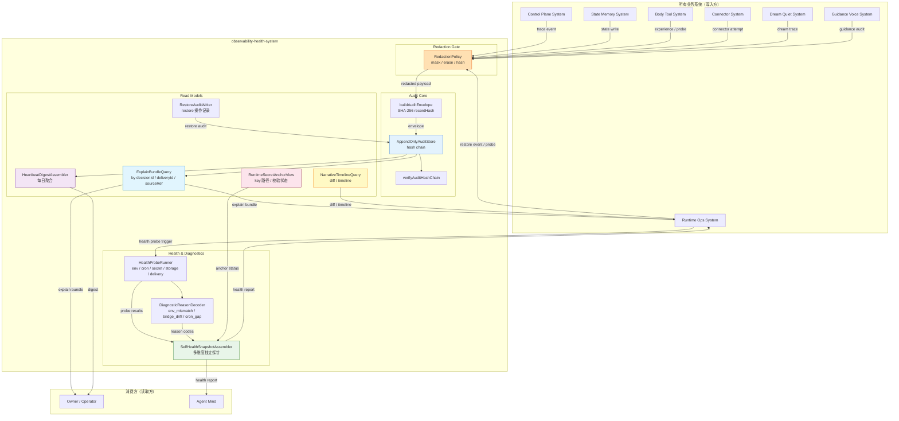
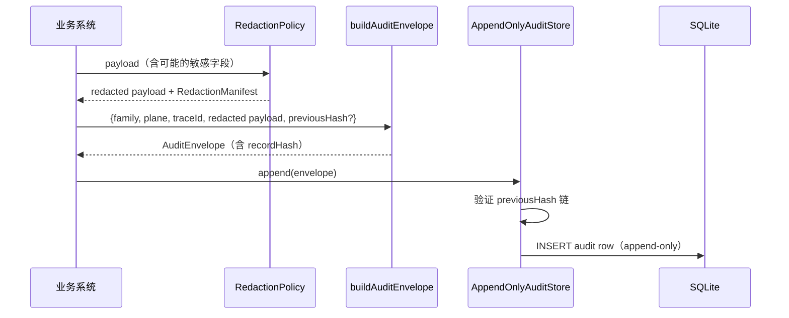
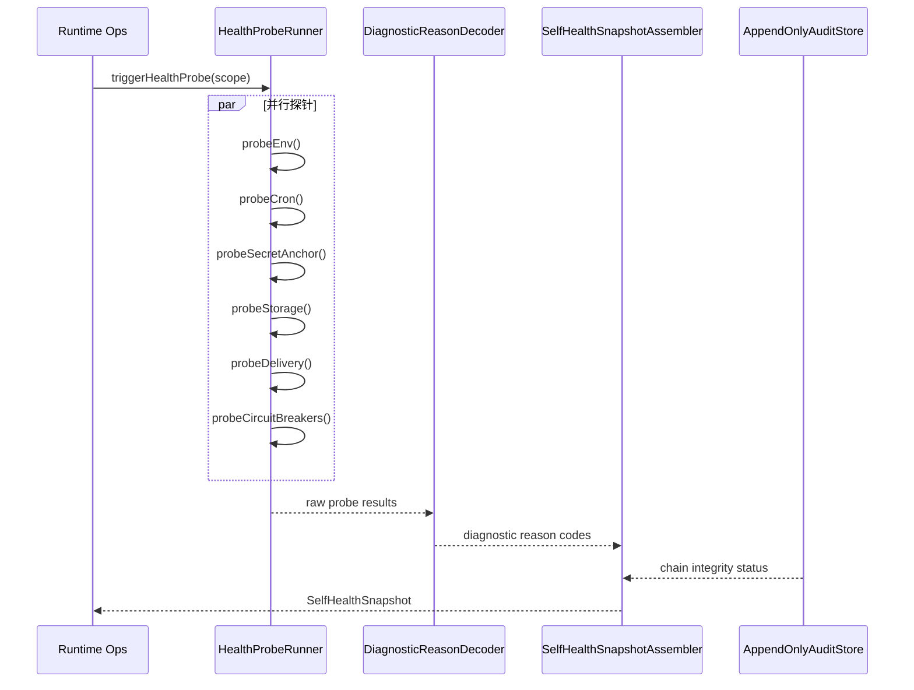
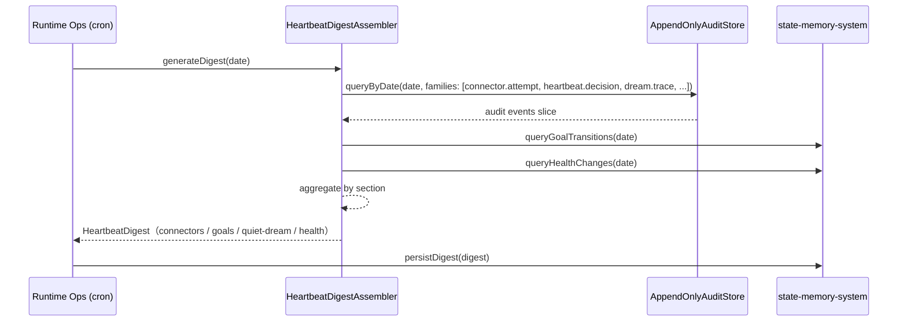
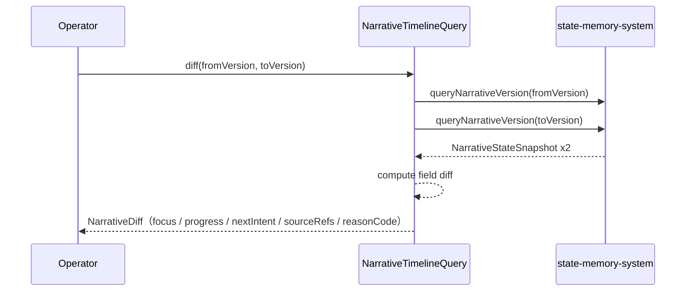
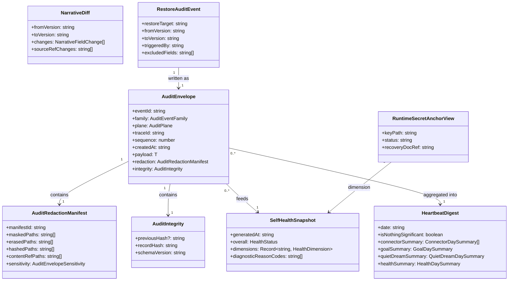

# Observability Health System 系统设计文档 (L0 — 导航层)

| 字段          | 值                                                                    |
| ------------- | --------------------------------------------------------------------- |
| **System ID** | `observability-health-system`                                         |
| **Project**   | Second Nature                                                         |
| **Version**   | 7.0                                                                   |
| **Status**    | `Draft`                                                               |
| **Author**    | GPT-5.5 / Nyx                                                         |
| **Date**      | 2026-05-21                                                            |
| **L1 Detail** | [observability-health-system.detail.md](./observability-health-system.detail.md) — 配置常量、完整数据结构、算法伪代码、边缘情况 |

> [!IMPORTANT]
> **文档分层说明**
> - **本文件 (L0 导航层)**: 架构图、操作契约、设计决策。面向快速理解与任务规划。禁止放配置字典、算法伪代码和方法体。
> - **[observability-health-system.detail.md](./observability-health-system.detail.md) (L1 实现层)**: 完整伪代码、配置常量、边缘情况。仅 `/forge` 任务明确引用时加载。
> - **L1 锚点原则**: L1 中的每一节都必须在本文件有对应超链接入口。严禁 L1 出现 L0 完全未提及的"孤岛内容"。
>
> **核心定位**: `observability-health-system` 是横切关注点层——它服务于所有系统，但**不拥有核心业务状态**。它的职责是解释、诊断、证明与守护隐私边界。

---

## 目录 (Table of Contents)

|   §   | 章节                                                                         | 关键内容                                                              |
| :---: | ---------------------------------------------------------------------------- | --------------------------------------------------------------------- |
|   1   | [概览](#1-概览-overview)                                                     | 系统目的、边界、职责                                                  |
|   2   | [目标与非目标](#2-目标与非目标-goals--non-goals)                             | Goals / Non-Goals                                                     |
|   3   | [背景与上下文](#3-背景与上下文-background--context)                          | v6 基线、v7 新增、约束                                                |
|   4   | [系统架构](#4-系统架构-architecture)                                         | 横切关注点图、内部组件、数据流                                        |
|   5   | [接口设计](#5-接口设计-interface-design)                                     | 操作契约表、跨系统协议                                                |
|   6   | [数据模型](#6-数据模型-data-model)                                           | 实体字段声明、ER 图 → [L1 §1-2](./observability-health-system.detail.md) |
|   7   | [技术选型](#7-技术选型-technology-stack)                                     | 核心技术、关键依赖                                                    |
|   8   | [Trade-offs](#8-trade-offs--alternatives-权衡与备选方案)                     | ADR 引用与本系统特有取舍                                              |
|   9   | [安全性考虑](#9-安全性考虑-security-considerations)                          | Redaction、audit chain、secret anchor                                 |
|  10   | [性能考虑](#10-性能考虑-performance-considerations)                          | 性能目标、探针隔离、降级策略                                          |
|  11   | [测试策略](#11-测试策略-testing-strategy)                                    | Contract Verification Matrix                                          |
|  12   | [部署与运维](#12-部署与运维-deployment--operations)                          | 运行模式、可观测性说明                                                |
|  13   | [未来考虑](#13-未来考虑-future-considerations)                               | 演进方向                                                              |
|  14   | [附录](#14-appendix-附录)                                                    | 术语表、参考资料                                                      |

**L1 实现层** → [observability-health-system.detail.md](./observability-health-system.detail.md)（仅 `/forge` 时加载）
> [§1 配置常量](./observability-health-system.detail.md#1-配置常量-config-constants) · [§2 数据结构](./observability-health-system.detail.md#2-核心数据结构完整定义-full-data-structures) · [§3 算法伪代码](./observability-health-system.detail.md#3-核心算法伪代码-non-trivial-algorithm-pseudocode) · [§4 决策树](./observability-health-system.detail.md#4-决策树详细逻辑-decision-tree-details) · [§5 边缘情况](./observability-health-system.detail.md#5-边缘情况与注意事项-edge-cases--gotchas)

---

## 1. 概览 (Overview)

### 1.1 System Purpose (系统目的)

`observability-health-system` 是 Second Nature v7 的**横切诊断与守护层**。它不替 agent 做决策，也不拥有身份、目标或关系记忆；它的职责是：

1. **解释**: 把所有系统的 trace event 聚合为可读的 explain bundle，让 owner 和 agent 都能看懂"发生了什么"
2. **诊断**: 把 connector circuit breaker、delivery proof、secret anchor、环境漂移整合为 `SelfHealthSnapshot`，让"身体哪里疼"可见
3. **证明**: 通过 `HeartbeatDigest` 提供每日无噪声存在证明，`NarrativeTimeline` 提供 narrative 变化追溯
4. **守护**: 统一 redaction policy，确保 credential/token/raw private content 在写入任何 audit row 之前被移除

### 1.2 System Boundary (系统边界)

- **输入**:
  - trace event（来自 control-plane / connector / dream-quiet / guidance-voice 的执行轨迹）
  - audit envelope（各系统写入的结构化事件，含 family/plane/payload）
  - health probe result（运行时环境探针：workspace root、env、cron、credential、storage）
  - delivery proof（channel 投递结果：messageId / hostProofRef / fallback reason）
  - runtime capability report（connector auto-probe 的 actualCapabilities）
  - snapshot/restore event（mutable state 写入前的 snapshot 和 restore 操作）

- **输出**:
  - explain bundle（`OperatorExplainReadModel`：summary + warnings + redacted events）
  - self health report（`SelfHealthSnapshot`：各维度 healthy/degraded/unknown）
  - heartbeat digest（`HeartbeatDigest`：每日聚合仪表盘摘要）
  - narrative diff/timeline（`NarrativeDiff`、`NarrativeTimeline`：narrative state 变化序列）
  - redacted audit row（通过 `RedactionPolicy` 处理后的安全 audit 记录）
  - diagnostic reason code（`env_mismatch` / `bridge_drift` / `cron_gap` / `runtime_secret_unavailable` 等）

- **依赖系统**:
  - `state-memory-system`：读取 NarrativeState 版本、RestoreSnapshot 历史、HeartbeatDigest 存储
  - local runtime / host probe surfaces：直接探测 workspace root、env、cron timer、bridge状态

- **被依赖系统（横切服务）**:
  - `control-plane-system`：读取 explain bundle、self health、narrative timeline
  - `state-memory-system`：使用 redaction policy 过滤写入内容
  - `body-tool-system`：读取 connector circuit breaker posture、ToolExperience redaction
  - `connector-system`：写入 connector attempt audit、actualCapabilities probe result
  - `dream-quiet-system`：写入 DreamTrace、QuietClaim audit
  - `guidance-voice-system`：写入 guidance grounding audit
  - `runtime-ops-system`：暴露 self_health / digest / timeline / explain CLI surface

### 1.3 System Responsibilities (系统职责)

**负责**:
- 提供统一 `RedactionPolicy`：mask credential/token、erase raw private content/prompt、hash userId/traceId
- 维护 `AppendOnlyAuditStore`：hash chain 完整性验证、不允许 update/delete
- 生成 `SelfHealthSnapshot`：独立探针汇聚，各维度 healthy/degraded/unknown，任意维度失败不影响整体
- 生成 `HeartbeatDigest`：每日聚合，按 connector/goal/Quiet/Dream/health 分段，无事件时 `nothing_significant`
- 提供 `NarrativeTimeline` + diff：任意两版本 narrative 的字段差异
- 维护 `RestoreAudit`：每次 restore 操作必须写 audit，记录 from_version/to_version/reason
- 提供 `RuntimeSecretAnchor` 健康视图：只记录 key 的存放路径、校验状态、恢复说明（不记录明文 key）
- 检测 host/cron/bridge 漂移：生成 diagnostic reason code
- 提供 `ExplainBundle` query：按 decisionId / deliveryId / sourceRefId 聚合相关 audit events

**不负责**:
- 不拥有 IdentityProfile、AgentGoal、ToolExperience、NarrativeState、RelationshipMemory 等核心业务状态（属于 `state-memory-system`）
- 不执行 connector、不生成 outreach 草稿、不决定 heartbeat 意图（属于其他业务系统）
- 不主动推送 HeartbeatDigest（推送机制属于 `runtime-ops-system`）
- 不保存 encryption key 明文（只记录路径和校验状态）
- 不自动修复任何诊断出的问题（只提供 diagnostic reason code，action 由 operator 决定）

---

## 2. 目标与非目标 (Goals & Non-Goals)

### 2.1 Goals

- **[G1]**: 统一 redaction policy，所有系统在写入 audit/state 前通过同一 gate，确保 credential/token/raw private content 不落盘。[REQ-001], [REQ-003], [REQ-006]
- **[G2]**: 维护 append-only audit hash chain，chain integrity 可按需验证，写入后不可篡改。[REQ-003], [REQ-007]
- **[G3]**: 提供 `SelfHealthSnapshot`，覆盖 connector circuit breaker、delivery truth、Quiet/Dream 调度、credential anchor、storage、cron/env 漂移，每个维度独立探针，不可用时标 `unknown`。[REQ-007], [REQ-012]
- **[G4]**: 提供 `HeartbeatDigest`，每日聚合 connector 操作计数、goal 变化、Quiet/Dream 状态、health 变化，格式为 dashboard-style 仪表盘摘要，不是日志转储，不是 outreach。[REQ-010]
- **[G5]**: 提供 `NarrativeTimeline` 与 diff query，支持任意两个时间点的 narrative 字段差异。[REQ-011]
- **[G6]**: 每次 restore 操作写 audit log（RestoreAudit），不恢复 credential 明文，不绕过 trust policy。[REQ-011]
- **[G7]**: 提供 `RuntimeSecretAnchor` 健康视图，检测 key 路径缺失/错误/无法解密，返回 `runtime_secret_unavailable` / `credential_recovery_required`。[REQ-012]
- **[G8]**: 提供 `ExplainBundle` query，按 subject（decision/delivery/sourceRef）聚合 redacted audit events，附 warnings（如 `no_user_visible_contact_claim_prohibited`）。[REQ-001], [REQ-006]
- **[G9]**: 检测 host/cron/bridge 漂移，生成 diagnostic reason code（`env_mismatch` / `bridge_drift` / `cron_gap`），供 self_health 消费。[REQ-007]

### 2.2 Non-Goals

- **[NG1]**: 不保存 credential 明文、token、raw private message、raw prompt 或 encryption key value（[NG4], [NG8] from PRD）
- **[NG2]**: `HeartbeatDigest` 不是 outreach，不使用朋友式"找你聊聊"语气（[NG7] from PRD）
- **[NG3]**: 不拥有核心业务状态，不替 `state-memory-system` 持久化 IdentityProfile / AgentGoal / ToolExperience
- **[NG4]**: 不自动修复诊断出的问题（key 丢失、env 漂移等需 operator 手动处理）
- **[NG5]**: 不主动推送 digest（推送 trigger 来自 `runtime-ops-system` cron 或 operator 命令）
- **[NG6]**: `RestoreSnapshot` 执行属于 `state-memory-system`，本系统只负责 restore audit 记录

---

## 3. 背景与上下文 (Background & Context)

### 3.1 Why This System? (为什么需要这个系统？)

Second Nature v6 已有 audit/observability 基础，但它被当作技术日志而非身体信号：

- audit hash chain 存在，但 chain integrity 没有进入 `self_health` 诊断
- redaction policy 存在，但各业务系统各自调用，没有统一 gate
- explain query 存在，但 narrative timeline、heartbeat digest、restore audit、secret anchor 四类 v7 新能力尚未落地
- connector circuit breaker 和 env 漂移诊断散落在各系统，没有统一的 `SelfHealthSnapshot` 汇总视图

v7 要求这个系统成为真正的横切关注点层：既要让 owner 能一眼看到身体哪里健康、哪里疼、哪里未知，又要保证私信内容、credential、raw prompt 在系统各处边界的安全。

**关联 PRD 需求**: [REQ-001], [REQ-002], [REQ-003], [REQ-006], [REQ-007], [REQ-010], [REQ-011], [REQ-012]

### 3.2 Current State (现状分析)

**v6 已有基线**（`src/observability/`）:
- `AppendOnlyAuditStore`：in-memory hash chain，`append()` 验证 previousHash，`list()` 只读
- `buildAuditEnvelope`：SHA-256 recordHash + previousHash chain，payload 自动 redact
- `verifyAuditHashChain`：批量验证 chain integrity
- `DEFAULT_REDACTION_POLICY`：mask（10个字段） + erase（7个字段） + hash（4个字段）
- `queryExplain`：按 decisionId/deliveryId/sourceRefId 聚合 audit events
- `GovernanceAudit`、`ExecutionTelemetry`、`LivedExperienceAuditRecorder`：各类 audit writer
- `OperatorExplainReadModel`：summary + warnings + relatedEventIds + events

**v7 新增需求**:
- `SelfHealthSnapshot`（v7 新）：多维度健康状态汇总，含 circuit breaker、secret anchor、cron/env 漂移
- `HeartbeatDigest`（v7 新）：每日聚合仪表盘，dashboard-style，非 outreach
- `NarrativeTimeline` + diff（v7 新）：narrative state 版本历史与字段差异
- `RestoreAudit`（v7 新）：mutable state restore 操作的 audit 记录
- `RuntimeSecretAnchor` health view（v7 新）：key 路径校验状态诊断

### 3.3 Constraints (约束条件)

- **技术约束**: TypeScript / Node / OpenClaw plugin-first；SQLite/sql.js 持久化；无外部 audit SaaS
- **性能约束**: `SelfHealthSnapshot` P95 < 1s（DB available 时）；`HeartbeatDigest` 生成 P95 < 2s；explain query P95 < 500ms for 1000 events
- **安全约束**: credential/token/raw private content/raw prompt/encryption key 明文不得写入任何 audit row；redaction 先于 persistence
- **隐私约束**: `DeliveryProof` 只存 status + timestamp + channel + message_hash；`ToolExperience` sample response 必须 size-bounded + redacted
- **循环依赖降级策略**（DR-032）：`observability-health-system` 依赖 `state-memory` 读取 NarrativeState / HeartbeatDigest，但同时被所有系统依赖用于 audit write 和 redaction。为打破循环依赖的可用性风险，规定以下分层：
  1. **Audit write 路径与 state-memory read 路径解耦**：`AppendOnlyAuditStore` 和 `RedactionPolicy` 不依赖 state-memory，可在 state-memory 不可用时独立工作；各系统的 audit write 调用此路径，不受 state-memory 降级影响。
  2. **NarrativeTimeline / HeartbeatDigest 查询路径降级**：若 state-memory 不可用（DB 连接失败、startup repair 未完成），`NarrativeTimelineQueryService` 和 `HeartbeatDigestAssembler` 返回 `{ status: "degraded", reason: "state_memory_unavailable", lastKnownAt: <timestamp> }`，不阻塞其他探针。
  3. **SelfHealthSnapshot 探针隔离**：`state-memory` 相关探针（narrative_timeline_probe、digest_probe）失败时，仅标记对应维度为 `degraded`，不影响 env / secret / storage / delivery / circuit-breaker 探针；`SelfHealthSnapshot` 整体仍可输出，附带 `degraded_dimensions[]`。
  4. **自身 audit write 失败的处理**：若 `AppendOnlyAuditStore` 写入失败，记录到 stderr（host-level log），不重试、不抛出阻塞调用方的异常；调用方（各业务系统）收到 `audit_write_failed` error code 后可选择继续 state write 或 fail-fast，决策权在调用方。

> **DR-035 补充 - 各系统 audit write 失败策略约定**：
> - **state-memory 写入**：audit write 失败时 state write 继续（两者互不阻塞），失败通过 `audit_write_failed` event 到 stderr；调用方收到 `audit_write_failed` error code 后**默认继续**（fire-and-forget 语义）。
> - **高安全性操作（credential 相关、restore 操作）**：调用方可选择 fail-fast——在 `ingestTraceEvent` 调用前设置 `required: true` 标志，失败时中止操作并返回 `audit_required_write_failed`。
> - **connector execution**：audit write 失败时 execution result 仍返回给 body-tool，不重试 execution；audit 丢失通过 batch re-attempt（由 observability 在恢复后尝试从 local queue 补写）。

---

## 4. 系统架构 (Architecture)

### 4.1 Architecture Diagram (横切关注点图)



### 4.2 Core Components (核心组件)

| Component | Responsibility | Tech Stack | Source |
| --- | --- | --- | --- |
| `RedactionPolicy` | 统一 mask/erase/hash 规则，所有 audit 写入前通过 | TypeScript | `src/observability/redaction/policy.ts` |
| `RedactionManifest` | 记录哪些字段被 redact（maskedPaths/erasedPaths/hashedPaths） | TypeScript | `src/observability/redaction/manifest.ts` |
| `AppendOnlyAuditStore` | hash chain 维护，`append()` 验证，`list()` 只读 | TypeScript, SQLite | `src/observability/audit/append-only-audit-store.ts` |
| `buildAuditEnvelope` | SHA-256 recordHash 计算，与 previousHash 链接 | TypeScript, crypto | `src/observability/audit/audit-envelope.ts` |
| `verifyAuditHashChain` | 批量验证 chain integrity，返回 broken 位置 | TypeScript | `src/observability/audit/verify-audit-hash-chain.ts` |
| `SelfHealthSnapshotAssembler` | 汇聚多维度独立探针结果，输出 healthy/degraded/unknown | TypeScript (v7 新增) | `src/observability/services/self-health-snapshot.ts` |
| `HealthProbeRunner` | 并行运行 env/cron/secret/storage/delivery/circuit-breaker 探针 | TypeScript (v7 新增) | `src/observability/services/health-probe-runner.ts` |
| `DiagnosticReasonDecoder` | 将探针结果转为标准 diagnostic reason code | TypeScript (v7 新增) | `src/observability/services/diagnostic-reason-decoder.ts` |
| `HeartbeatDigestAssembler` | 聚合一天内 audit events，生成 dashboard-style 摘要 | TypeScript (v7 新增) | `src/observability/services/heartbeat-digest-assembler.ts` |
| `ExplainBundleQuery` | 按 subject 过滤 audit store，组装 OperatorExplainReadModel | TypeScript | `src/observability/query/explain-query.ts` |
| `NarrativeTimelineQuery` | 查询 narrative 版本历史，计算 diff | TypeScript (v7 新增) | `src/observability/query/narrative-timeline-query.ts` |
| `RestoreAuditWriter` | 将 restore 操作写入 audit store，含 from/to version | TypeScript (v7 新增) | `src/observability/services/restore-audit-writer.ts` |
| `RuntimeSecretAnchorView` | 读取 key 路径和校验状态，生成诊断 | TypeScript (v7 新增) | `src/observability/services/runtime-secret-anchor-view.ts` |

> **AppendOnlyAuditStore hash chain 写入优化**（DR-033）：`AppendOnlyAuditStore` 在进程生命周期内维护一个 in-memory `lastHashCache`（per audit family），缓存最近一条记录的 `recordHash`；`append()` 直接从 cache 获取 `previousHash`，无需每次读 DB。cache miss（进程重启后首次写入）时从 DB 读取最新 hash 并填充 cache。
> 高频写入场景下（heartbeat 产生 10~30 条 events/cycle），每个 family 的 hash chain 验证开销降至 O(1)。
> 详见 [L1 §3.1](./observability-health-system.detail.md#31-ingesttraceevent)。

### 4.3 Data Flow (数据流)

#### 流程 A: 事件写入（Trace Ingestion）



#### 流程 B: SelfHealth 诊断



#### 流程 C: HeartbeatDigest 生成



#### 流程 D: NarrativeTimeline diff query



**关键数据流说明**:
1. RedactionPolicy 是所有写入路径的守门人，业务系统不可绕过
2. SelfHealthSnapshot 探针并行运行，任意探针超时只影响该维度（标 unknown）
3. HeartbeatDigest 是每日批次聚合，不是实时推送
4. NarrativeTimeline 查询不修改 state，只读 snapshot 再 diff

---

## 5. 接口设计 (Interface Design)

### 5.1 操作契约表 (Operation Contracts)

| 操作 | [REQ] | 前置条件 | 消耗/输入 | 产出/副作用 | 实现细节 |
| --- | :---: | --- | --- | --- | :---: |
| `ingestTraceEvent(envelope)` | [REQ-001] | envelope.family 合法; previousHash 匹配链尾 | AuditEnvelope | 写入 AppendOnlyAuditStore; chain hash 更新 | [§3.1](./observability-health-system.detail.md#31-ingesttraceevent) |
| `redactPayload(payload)` | [REQ-003] | payload 为 object | 原始 payload | redacted payload + RedactionManifest; 敏感字段 mask/erase/hash | [§3.2](./observability-health-system.detail.md#32-redactpayload) |
| `probeHealth(scope)` | [REQ-007] | runtime 可访问 | scope（env/cron/secret/storage/delivery/circuit） | SelfHealthSnapshot; 各维度 healthy/degraded/unknown; diagnostic reason codes | [§3.3](./observability-health-system.detail.md#33-probehealth) |
| `generateHeartbeatDigest(date)` | [REQ-010] | audit store 有当日事件记录 | date string | HeartbeatDigest; 写入 state-memory-system | [§3.4](./observability-health-system.detail.md#34-generateheartbeatdigest) |
| `queryNarrativeDiff(fromVer, toVer)` | [REQ-011] | state-memory 有两个版本 | fromVersion, toVersion | NarrativeDiff（字段级差异列表）; 不修改 state | [§3.5](./observability-health-system.detail.md#35-querynarrativediff) |
| `queryNarrativeTimeline(from, to)` | [REQ-011] | state-memory 有 timeline 记录 | from/to timestamp | NarrativeTimeline（版本序列 + transitions） | [§3.6](./observability-health-system.detail.md#36-querynarrativetimeline) |
| `writeRestoreAudit(event)` | [REQ-011] | restore 操作正在执行 | RestoreAuditEvent | audit row（family: restore.audit）; 写 AppendOnlyAuditStore | [§3.7](./observability-health-system.detail.md#37-writerestoreaudit) |
| `queryExplainBundle(query)` | [REQ-001] | AppendOnlyAuditStore 有相关事件 | ExplainQuery（kind + subject） | OperatorExplainReadModel; warnings; redacted events | [§3.8](./observability-health-system.detail.md#38-queryexplainbundle) |
| `verifyAuditChain(range?)` | [REQ-007] | audit store 非空 | 可选 range | AuditHashChainVerificationReport（broken 位置/valid） | [§3.9](./observability-health-system.detail.md#39-verifyauditchain) |
| `viewSecretAnchor()` | [REQ-012] | runtime 可访问 | — | RuntimeSecretAnchorView（path/status/recovery_doc）; 不含 key 明文 | [§3.10](./observability-health-system.detail.md#310-viewsecretanchor) |

> **NarrativeTimeline 分页与查询范围**（DR-037）：
> - **分页机制**：cursor-based pagination，`cursor` 为上次结果最后一条记录的 `version` id；每页默认 50 条，`limit` 参数可调（最大 200）。
> - **最大查询范围**：90 天；请求范围超过 90 天时返回 `{ error: "query_range_exceeded", maxRangeDays: 90, hint: "使用 cursor pagination 分批查询" }`。
> - **30 天内 P95 < 500ms**；30~90 天范围 P95 < 2s。
> - **超出 90 天**：返回 error，不做 truncate（防止调用方误以为数据完整）。

> **audit hash chain 损坏处理流程**（DR-039）：
> `verifyAuditHashChain` 检测到损坏后：
> 1. **隔离损坏 segment**：标记 chain 中损坏起点之后的所有 records 为 `audit_integrity_suspect`（不删除）。
> 2. **标记 audit unreliable**：`SelfHealthSnapshot` 的 `audit` 维度标记为 `degraded`，reason: `chain_integrity_violated`。
> 3. **触发 operator alert**：写入 `observability.chain_broken` audit event（使用新 genesis chain，不延续破损链）；operator 通过 `sn self_health` 可查看 alert。
> 4. **下游影响**：`ExplainBundle` 查询时若涉及损坏 segment，在结果中附 `warnings: ["audit_segment_suspect"]`；不中断查询但提示数据不可信。
> 5. **修复**：chain 损坏无法自动修复；operator 可手动 archive 损坏 segment 并重新 genesis 新链。

> **restore 原子性保证**（DR-041）：
> - **all-or-nothing**：restore 操作在 state-memory 端执行，`writeRestoreAudit` 在 restore 成功后写入；若 audit write 失败，restore **不回滚**（state 已改变），但返回 `{ ok: true, warnings: ["audit_write_failed: restore_audit_missing"] }`，operator 可重新手动 `ingestTraceEvent` 补写 audit。
> - **partial_restore_error**：若 restore 执行期间 state-memory 写入部分成功（例如 IdentityProfile 已写但 AgentGoal 未写），state-memory 标记 `partial_restore_error`，observability audit 记录已完成和未完成的 entity 清单。
> - 原则：audit 失败不能逆转已完成的 state restore；state restore 失败则 audit 记录失败原因。

> **操作错误语义**:
> - `audit_previous_hash_mismatch`：hash chain 断裂，拒绝写入
> - `audit_genesis_previous_hash`：首条记录不应有 previousHash
> - `probe_timeout:{dimension}`：某探针超时，该维度标 `unknown`
> - `runtime_secret_unavailable`：key 路径不存在或无法验证
> - `credential_recovery_required`：key 验证失败，已有 credential 无法解密
> - `runtime_secret_anchor_missing`：workspace 无 key anchor 记录
> - `context_degraded:{kind}`：某上下文维度不可用，继续降级运行

> **SelfHealthSnapshot 探针超时配置**（DR-036）：
> | 探针维度 | 默认超时 | 超时行为 |
> |---|---|---|
> | `env` / `storage` | 200ms | 标记 `unknown`，reason: `probe_timeout:env` |
> | `cron` / `bridge` | 500ms | 标记 `unknown`，reason: `probe_timeout:cron` |
> | `secret` / `credential` | 1000ms | 标记 `unknown`，reason: `probe_timeout:secret` |
> | `delivery` / `circuit_breaker` | 800ms | 标记 `unknown`，reason: `probe_timeout:delivery` |
> | `state_memory` （narrative/digest probe） | 500ms | 标记 `degraded`，reason: `state_memory_unavailable` |
>
> **总体超时上限**：3000ms（`Promise.allSettled`，所有探针并行，超出后强制返回已完成的探针结果 + 未完成的标记 `unknown`）。
> **全部超时时**：返回 `SelfHealthSnapshot{ overall: "unknown", reason: "all_probes_timed_out", lastKnownAt: <上次成功快照 timestamp> }`。

### 5.2 跨系统接口协议 (Cross-System Interface)

```typescript
// 其他系统调用 observability-health-system 的接口签名

interface IObservabilityHealthSystem {
  // ── 写入（所有系统） ──
  ingestTraceEvent(envelope: AuditEnvelope<unknown>): Promise<void>;
  redactPayload<T extends object>(payload: T): RedactResult<T>;
  buildRedactedEnvelope<T extends object>(input: BuildEnvelopeInput<T>): AuditEnvelope<T>;

  // ── 健康诊断（runtime-ops 触发） ──
  probeHealth(scope?: HealthProbeScope): Promise<SelfHealthSnapshot>;
  viewSecretAnchor(): Promise<RuntimeSecretAnchorView>;
  verifyAuditChain(range?: AuditExportRange): Promise<AuditHashChainVerificationReport>;

  // ── 摘要与时间线（runtime-ops / owner） ──
  generateHeartbeatDigest(date: string): Promise<HeartbeatDigest>;
  queryNarrativeDiff(fromVersion: string, toVersion: string): Promise<NarrativeDiff>;
  queryNarrativeTimeline(from: string, to: string): Promise<NarrativeTimeline>;

  // ── Explain（runtime-ops / agent） ──
  queryExplainBundle(query: ExplainQuery): Promise<OperatorExplainReadModel>;

  // ── Restore Audit（state-memory 调用） ──
  writeRestoreAudit(event: RestoreAuditEvent): Promise<void>;
}

// 所有系统的 audit 写入方向：通过 buildRedactedEnvelope + ingestTraceEvent
// RedactionPolicy 不可绕过，所有写入方必须通过这两步
```

### 5.3 AuditEventFamily 枚举（v7 扩展）

v6 有：`heartbeat.decision` / `delivery` / `source_coverage` / `guidance.grounding` / `host_capability` / `connector.attempt` / `state.governance` / `narrative.trace` / `dream.trace`

**v7 新增**:
- `restore.audit`：mutable state restore 操作
- `health.probe`：SelfHealth 探针结果摘要
- `narrative.snapshot`：narrative state 版本快照
- `secret.anchor`：RuntimeSecretAnchor 状态变化（不含 key 值）

---

## 6. 数据模型 (Data Model)

### 6.1 核心实体 (Core Entities)

```typescript
// ── AuditEnvelope（v6 基础，v7 扩展 family） ──
interface AuditEnvelope<TPayload> {
  eventId: string;
  family: AuditEventFamily;          // v7 新增：restore.audit / health.probe / narrative.snapshot / secret.anchor
  plane: AuditPlane;                 // "decision" | "delivery" | "source_coverage" | "governance" | "telemetry"
  traceId: string;
  sequence: number;
  createdAt: string;                 // ISO 8601
  payload: TPayload;                 // 已 redact 的内容
  redaction: AuditRedactionManifest; // maskedPaths / erasedPaths / hashedPaths / sensitivity
  integrity: AuditIntegrity;         // previousHash? + recordHash (SHA-256) + schemaVersion
}

// ── SelfHealthSnapshot（v7 新增） ──
interface SelfHealthSnapshot {
  generatedAt: string;
  overall: HealthStatus;            // "healthy" | "degraded" | "unknown"
  dimensions: {
    connectorCircuitBreakers: CircuitBreakerHealthDimension;
    deliveryTruth: DeliveryHealthDimension;
    quietDreamCadence: QuietDreamHealthDimension;
    secretAnchor: SecretAnchorHealthDimension;
    storageLayer: StorageHealthDimension;
    cronEnvDrift: CronEnvDriftDimension;
    auditChainIntegrity: AuditChainHealthDimension;
  };
  diagnosticReasonCodes: string[];   // ["cron:env_mismatch", "connector:circuit_open:moltbook", ...]
}

type HealthStatus = "healthy" | "degraded" | "unknown";

// ── HeartbeatDigest（v7 新增） ──
interface HeartbeatDigest {
  date: string;                      // YYYY-MM-DD
  generatedAt: string;
  isNothingSignificant: boolean;     // 无显著事件时为 true
  connectorSummary: ConnectorDaySummary[];
  goalSummary: GoalDaySummary;
  quietDreamSummary: QuietDreamDaySummary;
  healthSummary: HealthDaySummary;
  deliveredAt?: string;              // digest 投递时间
  deliveryProof?: DeliveryProofRef;  // 投递 proof（不含原文）
}

interface ConnectorDaySummary {
  platformId: string;
  capability: string;
  successCount: number;
  failureCount: number;
  circuitOpenCount: number;
  blockedCount: number;
}

// ── NarrativeDiff（v7 新增） ──
interface NarrativeDiff {
  fromVersion: string;
  toVersion: string;
  computedAt: string;
  changes: NarrativeFieldChange[];
  sourceRefChanges: string[];        // 新增/移除的 source refs
  reasonCode?: string;               // 触发变化的 reason code
}

interface NarrativeFieldChange {
  field: "focus" | "progress" | "nextIntent" | "toneSignal" | "acceptedGoalId";
  from: string | null;
  to: string | null;
}

// ── NarrativeTimeline（v7 新增） ──
interface NarrativeTimeline {
  from: string;                      // ISO 8601
  to: string;
  entries: NarrativeTimelineEntry[];
}

interface NarrativeTimelineEntry {
  version: string;
  timestamp: string;
  triggerKind: "heartbeat.decision" | "goal.transition" | "restore.applied" | "dream.projection";
  sourceRefs: string[];
  reasonCode?: string;
}

// ── RestoreAuditEvent（v7 新增） ──
interface RestoreAuditEvent {
  id: string;
  restoreTarget: "goal" | "narrative" | "evidence" | "relationship";
  fromVersion: string;
  toVersion: string;
  triggeredBy: "operator" | "agent";
  reason: string;
  excludedFields: string[];          // 不恢复的敏感字段（credential / key 等）
  createdAt: string;
}

// ── RuntimeSecretAnchorView（v7 新增，DR-034 扩展） ──
export interface RuntimeSecretAnchorView {
  status: "ok" | "missing_key" | "wrong_key" | "unknown";
  anchorLocation?: string;
  recoveryPrincipleRef: string;          // 指向 AGENTS.md Bootstrap Recovery section
  plaintextKeyExposed: false;
  recoverySteps: RecoveryStep[];         // DR-034: 内联恢复步骤列表（不含密钥明文）
}

export interface RecoveryStep {
  step: number;
  action: string;    // e.g. "检查 SECOND_NATURE_ENCRYPTION_KEY 环境变量是否已设置"
  verification: string; // e.g. "执行 `sn runtime_secret_bootstrap`，status 应变为 ok"
}
```

> **recoverySteps 默认内容**（DR-034）：当 status 为 `missing_key` 时，`recoverySteps` 包含：(1) 检查环境变量 `SECOND_NATURE_ENCRYPTION_KEY` 是否存在；(2) 检查 workspace anchor 文件路径是否正确；(3) 执行 `sn runtime_secret_bootstrap` 重新验证。status 为 `ok` 时 `recoverySteps: []`。完整步骤文档见 `AGENTS.md #bootstrap-recovery`。

> *(完整方法实现 → [L1 §2](./observability-health-system.detail.md#2-核心数据结构完整定义-full-data-structures) · 配置常量字典 → [L1 §1](./observability-health-system.detail.md#1-配置常量-config-constants))*

> **Audit family/plane 注册机制**（DR-040）：每个系统在 `observability-health-system` 的 manifest 注册文件（`audit-family-registry.json`）中声明其 audit family 前缀和 plane 名称；非注册 family 的 `ingestTraceEvent` 调用返回 `audit_family_not_registered` 错误。
> 已注册 families：
> | Family 前缀 | Plane | 系统 |
> |---|---|---|
> | `control_plane.*` | `control` | control-plane-system |
> | `connector.*` | `connector` | connector-system |
> | `body_tool.*` | `body` | body-tool-system |
> | `dream_quiet.*` | `dream` | dream-quiet-system |
> | `guidance.*` | `guidance` | guidance-voice-system |
> | `state_memory.*` | `state` | state-memory-system |
> | `runtime_ops.*` | `ops` | runtime-ops-system |
> | `observability.*` | `obs` | observability-health-system（自身）|
>
> 新增系统时，PR 中必须同步更新 `audit-family-registry.json`。

### 6.2 实体关系图 (Entity Relationship)



### 6.3 数据流向 (Data Flow Direction)

- **写入方向**: 业务系统 → RedactionPolicy → buildAuditEnvelope → AppendOnlyAuditStore → SQLite
- **读取方向**: SQLite → AppendOnlyAuditStore → ExplainBundleQuery / HeartbeatDigestAssembler / NarrativeTimelineQuery → owner/agent
- **health 方向**: runtime probes → HealthProbeRunner → SelfHealthSnapshotAssembler → SelfHealthSnapshot
- **不存储**: encryption key 明文、credential 值、raw private message、raw prompt、完整私信正文

---

## 7. 技术选型 (Technology Stack)

### 7.1 Core Technologies (核心技术)

| Domain | Choice | Rationale |
| --- | --- | --- |
| 语言 / Runtime | TypeScript / Node.js | v6 连续，避免迁移成本（ADR-001） |
| Audit 持久化 | SQLite (drizzle ORM) + in-memory AppendOnlyAuditStore | Plugin-first，无外部服务依赖 |
| Hash 算法 | `node:crypto` SHA-256 | 零依赖，与 v6 一致 |
| Redaction | 自研 `DEFAULT_REDACTION_POLICY` | 精确控制 mask/erase/hash 行为，避免 third-party PII SDK 引入体积 |
| Schema 验证 | TypeScript 类型系统 + drizzle schema | 编译时类型安全 |
| Read Model | In-process query functions（`queryExplain`、`NarrativeTimelineQuery`） | 本地聚合，无 CQRS projection service |

### 7.2 Key Libraries/Dependencies (关键依赖)

- `drizzle-orm`：SQLite 持久化，audit 表 / governance 表 / execution_attempts 表
- `node:crypto`：SHA-256 hash chain 计算
- `sql.js` / native SQLite：存储层（由 `state-memory-system` 统一管理）
- 无外部 audit SaaS（如 Langfuse / AuditKit cloud）

---

## 8. Trade-offs & Alternatives (权衡与备选方案)

### 8.1 技术栈延续

> **决策来源**: [ADR-001: Continue TypeScript / Node / OpenClaw Plugin Runtime](../03_ADR/ADR_001_TECH_STACK.md)
>
> 本系统使用 ADR-001 定义的 TypeScript / Node / SQLite 栈。
>
> **本系统特有实现**: 不引入外部 audit SaaS（trailkit / AuditKit cloud）；hash chain 在 in-process + SQLite 层完成，与 plugin-first 约束一致。

### 8.2 Delivery Truthfulness + SelfHealth 设计

> **决策来源**: [ADR-006: Delivery, Channel Feedback, and Self Health Must Be Truthful](../03_ADR/ADR_006_CHANNEL_FEEDBACK_AND_SELF_HEALTH.md)
>
> delivery 需要 messageId 或 hostProofRef；ChannelFeedback 进入 RelationshipMemory；SelfHealth 聚合 root/env/credential/connector/delivery/Dream/storage/setup 状态。
>
> **本系统特有实现**: `probeHealth()` 按维度独立运行，任意维度 probe 超时标 `unknown`，不导致 SelfHealthSnapshot 整体失败。

### 8.3 HeartbeatDigest 不是 Outreach

> **决策来源**: [ADR-007: Identity, Digest, and Runtime Secret Recovery Are First-Class Body Signals](../03_ADR/ADR_007_IDENTITY_DIGEST_AND_RECOVERY.md)
>
> `HeartbeatDigest` 是 dashboard proof，不是朋友式 outreach。
>
> **本系统特有实现**: `generateHeartbeatDigest()` 产出的文本格式为仪表盘摘要（计数、状态、时间），不使用社交语气；无 significant 事件时输出 `nothing_significant` 标记而非零字节。

### 8.4 Restore Audit + Bounded Rollback

> **决策来源**: [ADR-008: Probe Truth, History Browser, and Bounded Rollback](../03_ADR/ADR_008_CONNECTOR_PROBE_CIRCUIT_BREAKER_AND_ROLLBACK.md)
>
> NarrativeTimeline 提供 diff 和 timeline；restore 必须写 audit，不恢复 credential 明文，不绕过 trust policy。
>
> **本系统特有实现**: `writeRestoreAudit()` 在 restore 操作**执行时**同步调用（不是事后补写），`excludedFields` 明确列出不恢复的字段（credential/key 等）。

### 8.5 Redaction 粒度：字段级 vs 内容级

**Option A: 字段级 Redaction（Selected ✓）**
- 按字段名 mask/erase/hash，精确控制
- `maskedPaths` 等 manifest 清楚记录哪些字段被处理
- 优点：可审计、可精确配置
- 缺点：无法捕获嵌套或动态字段名的敏感内容

**Option B: 全文内容扫描（正则 + ML）**
- 优点：覆盖更多边界场景（如嵌套 JSON 中的 token）
- 缺点：引入 ML 体积；plugin-first 体积约束；v6 已验证字段级方案足够

**Decision**: 选择 Option A。字段级策略与 `DEFAULT_REDACTION_POLICY` 可枚举、可测试、可审计；v7 通过扩展 erase 列表应对新业务场景（`raw_payload` / `credential_value`）。

### 8.6 SelfHealth 探针：顺序执行 vs 并行执行

**Option A: 并行执行（Selected ✓）**
- 各维度探针互不依赖，并行运行最快
- 任意探针失败/超时只影响该维度（标 `unknown`），不影响其他
- 满足 P95 < 1s 性能目标

**Option B: 顺序执行**
- 简单，便于调试
- 总时间是各探针时间之和；若某探针阻塞则整体延迟

**Decision**: 选择 Option A。`Promise.allSettled()` 并行运行所有探针，每个维度独立超时控制。

---

## 9. 安全性考虑 (Security Considerations)

### 9.1 Redaction Policy（数据守护核心）

所有写入路径必须通过 `redactPayload()` 再调用 `buildAuditEnvelope()`，不允许直接写入未 redact 的 payload。

**字段处理规则**:
- `mask`（`***`）：token / access_token / refresh_token / api_key / apiSecret / secret / password / bearer_token / authorization / node_secret
- `erase`（字段值置空）：full_message / full_post / private_message / prompt / system_prompt / completion / response_content / **raw_payload** / **credential_value**（v7 新增）
- `hash`（SHA-256 不可逆）：user_id / session_id / trace_id / content_hash

**禁止写入的内容**:
- encryption key 明文（`SECOND_NATURE_ENCRYPTION_KEY` 的值）
- raw private message 原文
- raw prompt / system_prompt 全文
- credential 值（只能写入 platformId + status + credentialId，不写值）

### 9.2 Audit Chain Integrity（防篡改）

- `AppendOnlyAuditStore.append()` 验证 `previousHash` 必须等于链尾的 `recordHash`，不匹配则抛 `audit_previous_hash_mismatch`
- `verifyAuditHashChain()` 重新计算每条记录的 hash 并与存储值对比，发现不一致即报告 broken 位置
- SQLite 层不允许 UPDATE / DELETE audit 表
- chain integrity status 进入 `SelfHealthSnapshot.dimensions.auditChainIntegrity`

### 9.3 RuntimeSecretAnchor（密钥安全）

- `viewSecretAnchor()` 只返回 `keyPath`（路径）+ `status`（校验状态）+ `recoveryDocRef`（文档引用）
- 永远不返回 key 值本身
- `status` 枚举：`verified` / `missing` / `wrong_key` / `decryption_failed`
- missing 或 decryption_failed 时，SelfHealth 输出 `runtime_secret_unavailable` / `credential_recovery_required`

### 9.4 Security Risks & Mitigations

| Risk | Severity | Mitigation |
| --- | :---: | --- |
| 业务系统绕过 redaction 直接写 audit | 高 | `buildAuditEnvelope` 内部强制调用 `redactAuditEvent`，不可绕过 |
| audit 表被直接 UPDATE/DELETE | 高 | SQLite 层 append-only 语义；`AppendOnlyAuditStore` 不暴露 update 接口 |
| key 明文通过 `RuntimeSecretAnchorView` 泄露 | 严重 | `viewSecretAnchor()` 接口不包含 key 值字段；单测验证返回无 key 字段 |
| delivery proof 声称已送达实际未送达 | 高 | `DeliveryProof` 只存 status + message_hash，`not_sent` 不可声称 `sent` |
| SelfHealth 探针泄露敏感配置 | 中 | 所有 SelfHealth 输出经 redaction；probe 结果不包含 token/key 值 |
| hash chain 被部分替换（同 hash 碰撞） | 低 | SHA-256 碰撞概率极低；审计环境无对手攻击场景 |

---

## 10. 性能考虑 (Performance Considerations)

### 10.1 Performance Goals (性能目标)

（继承自 PRD §6.1 技术约束）

- `SelfHealthSnapshot` P95 < **1s**（DB available 时）
- `HeartbeatDigest` 生成 P95 < **2s**（当日 audit events）
- `queryExplainBundle` P95 < **500ms**（1000 个 audit events 内）
- `NarrativeTimeline diff` P95 < **300ms**（最近 30 版 snapshot）
- `redactPayload` P95 < **5ms**（单个 payload）

### 10.2 Optimization Strategies (优化策略)

1. **SelfHealth 并行探针**: `Promise.allSettled()` 并行运行所有维度探针，最慢的探针决定总时间；每个探针有独立 timeout（默认 500ms），超时标 `unknown`
2. **HeartbeatDigest 预聚合**: 当日 audit events 按 family 分组查询，不做全量 scan；利用 SQLite `date` 索引
3. **ExplainBundle 早停**: 找到足够 matched events（默认 50 条上限）即停止扫描，不做全量 audit store 遍历
4. **NarrativeTimeline 版本快照**: narrative snapshot 存储在 state-memory-system（独立表），diff 只需两次点查询 + 字段比较，不走 audit store
5. **Redaction 内存操作**: `redactPayload` 纯内存操作，不走 DB；单次调用 < 5ms

### 10.3 Graceful Degradation (降级策略)

- 任意 SelfHealth 探针失败 → 该维度标 `unknown`，其他维度不受影响
- SQLite 不可用 → `AppendOnlyAuditStore` 降级为 in-memory only，标记 `storage: degraded`
- digest 生成超时 → 发送部分 digest + `partial_data` 标记，不发送空 digest
- chain verify 超时 → 该次验证结果标 `unknown`，下次 health probe 重试

---

## 11. 测试策略 (Testing Strategy)

### 11.1 Unit Testing (单元测试)

- **Coverage Target**: > 80%
- **Framework**: Jest / Vitest
- **Key Test Areas**:
  - [ ] `redactPayload` — 覆盖 mask/erase/hash 三种 action，验证字段级处理
  - [ ] `buildAuditEnvelope` — 验证 SHA-256 recordHash 计算、previousHash 链接
  - [ ] `AppendOnlyAuditStore.append` — 验证 hash mismatch 抛错、首条无 previousHash
  - [ ] `SelfHealthSnapshotAssembler` — 各维度 healthy/degraded/unknown 状态转换
  - [ ] `RuntimeSecretAnchorView` — 验证 missing/wrong_key/verified 三种状态，验证无 key 字段泄露
  - [ ] `NarrativeDiff` — 字段级 diff 计算，空变化 / 多字段变化场景

### 11.2 Integration Testing (集成测试)

- **Test Scenarios**:
  - [ ] trace ingestion end-to-end：business system → redact → build envelope → store → query explain
  - [ ] audit hash chain 验证：写入 5 条 → verify chain → 手动篡改第 3 条 → verify 返回 broken at 3
  - [ ] SelfHealth 全维度探针：构造 credential missing、circuit open、cron gap fixture，验证各维度 diagnostic reason code
  - [ ] HeartbeatDigest 生成：构造一天多 connector attempt / goal transition / dream trace，验证 digest section 计数正确
  - [ ] NarrativeTimeline diff：v1 → v2 → v3 三版 narrative，验证 `diff(v1, v3)` 包含所有变化字段
  - [ ] RestoreAudit 写入：执行 restore → 验证 audit store 有 `restore.audit` 事件 → 验证 excludedFields 包含 credential

### 11.3 Security Testing (安全测试)

- [ ] 写入含 token 的 payload → 验证 audit row 中 token 已 mask（`***`）
- [ ] 写入含 full_message 的 payload → 验证 audit row 中 full_message 已 erase（空）
- [ ] 调用 `viewSecretAnchor()` → 验证返回对象无任何包含 key 值的字段
- [ ] 尝试直接构造无 redact 的 envelope → 验证 `buildAuditEnvelope` 内部强制 redact
- [ ] delivery not_sent → 验证 ExplainBundle warning 包含 `no_user_visible_contact_claim_prohibited`

### 11.4 Performance Testing (性能测试)

- [ ] `probeHealth()` 全维度 × 100 次 → P95 < 1s
- [ ] `generateHeartbeatDigest()` 1000 条当日事件 → P95 < 2s
- [ ] `queryExplainBundle()` 1000 条 audit events → P95 < 500ms

### 11.5 Contract Verification Matrix (契约-验证责任矩阵)

| 契约 | 风险级别 | 正常态验证 | 失败态验证 | 回归责任 |
| --- | :---: | --- | --- | --- |
| Redaction：token/credential 字段 mask | **严重** | 单测：payload 含 token → 输出 `***` | 输出含原始 token 值 → 测试失败 | redaction 相关回归（所有写入路径） |
| Redaction：raw message/prompt 字段 erase | **严重** | 单测：payload 含 full_message → 输出空 | 输出含原始内容 → 测试失败 | redaction 相关回归 |
| Audit chain integrity：previousHash 匹配 | **高** | 集成测：5 条正常写入 → chain verify ok | hash mismatch → 抛 `audit_previous_hash_mismatch` | audit 写入回归 |
| Audit chain integrity：篡改检测 | **高** | 集成测：手动修改第 3 条 → verify 报 broken at 3 | 未检测到篡改 → 测试失败 | audit verify 回归 |
| SelfHealth：probe 维度独立 | **中** | 集成测：某探针超时 → 该维度 unknown，整体仍返回 | 整体失败 → 测试失败 | health probe 回归 |
| SelfHealth 准确性：credential missing → reason code | **高** | 集成测：无 key anchor → `runtime_secret_anchor_missing` | 未输出 reason code → 测试失败 | secret anchor 回归 |
| HeartbeatDigest：无事件 → nothing_significant | **中** | 集成测：空日期 → `isNothingSignificant: true` | 输出空 digest / 编造数据 → 测试失败 | digest 回归 |
| DeliveryProof：not_sent 不声称 sent | **高** | 集成测：delivery failed → ExplainBundle warn `no_user_visible_contact_claim_prohibited` | 未附 warning → 测试失败 | delivery truth 回归 |
| RestoreAudit：restore 操作必须写 audit | **中** | 集成测：restore 执行 → audit store 有 `restore.audit` 事件 | 无 audit row → 测试失败 | restore 回归 |
| RuntimeSecretAnchorView：无 key 明文泄露 | **严重** | 单测：viewSecretAnchor() 返回对象无 key/secret 字段 | 含 key 值 → 测试失败 | secret anchor 安全回归 |
| NarrativeDiff：字段级差异正确 | **低** | 单测：v1/v2 diff → 输出正确 changed fields | diff 错误 → 测试失败 | narrative timeline 回归 |

---

## 12. 部署与运维 (Deployment & Operations)

### 12.1 运行模式

- **Plugin-first**: 随 OpenClaw plugin 加载，in-process，无独立守护进程
- `probeHealth()` 由 `runtime-ops-system` 在 heartbeat 或 operator 命令触发
- `generateHeartbeatDigest()` 由 `runtime-ops-system` cron window 触发（每日一次）
- `verifyAuditChain()` 按需触发，不阻塞 heartbeat critical path

### 12.2 监控说明

本系统是可观测性层，它自身的"健康"通过以下方式体现：
- `SelfHealthSnapshot.dimensions.auditChainIntegrity` — chain 验证状态
- `SelfHealthSnapshot.dimensions.storageLayer` — SQLite audit DB 连接状态
- 若 observability 本身的 probe 失败，该维度标 `unknown`（不死循环）

> **循环依赖风险**: Health probe 不依赖 observability 的 DB read（只写入），避免"监控监控自己"的循环问题，与 GENesis-AGI Awareness Loop 设计原则一致（见调研 `_research/observability-health-system-research.md`）

---

## 13. 未来考虑 (Future Considerations)

### 13.1 扩展性

- **更多 AuditEventFamily**: v8+ 可加入 `identity.change`、`relationship.update` 等事件族
- **Digest delivery target 扩展**: 当前 Feishu / dm / dashboard；未来可加 webhook / Slack
- **Chain snapshot / Merkle tree**: 当 audit 体积超过 10万条时可引入 Merkle checkpoint 验证，当前 linear chain 足够
- **Per-connector 细粒度 health probe**: 当 connector 数 > 50 时可按 connector 分组并行探针

### 13.2 Tech Debt

- [ ] `AppendOnlyAuditStore` 目前是 in-memory + SQLite 双写，v8 考虑统一到 SQLite-only with cursor-based page scan
- [ ] `redactPayload` 目前字段名精确匹配，v8 考虑支持 glob pattern（如 `*.token`）
- [ ] `NarrativeTimeline` 版本快照存储在 `state-memory-system`，查询接口需跨系统调用；v8 可考虑 observability 维护独立的 timeline index

### 13.3 Future Enhancements

- [ ] 结构化 digest delivery（当前 text format）→ 未来支持 JSON schema digest 以便 owner dashboard 渲染
- [ ] `SelfHealthSnapshot` 历史趋势（当前只有最新一次）→ 存储最近 30 次快照支持趋势图

---

## 14. Appendix (附录)

### 14.1 Glossary (术语表)

- **AuditEnvelope**: 带 hash chain 完整性字段的结构化 audit 事件包装器
- **RedactionManifest**: 记录本次 redact 操作中哪些字段被 mask/erase/hash 的清单
- **AppendOnlyAuditStore**: 只允许 append 的 audit 存储，写入时验证 previousHash
- **SelfHealthSnapshot**: 各系统维度健康状态的聚合快照，三态：healthy/degraded/unknown
- **HeartbeatDigest**: 每日 dashboard-style 聚合摘要，不是 outreach
- **NarrativeDiff**: 两个 narrative 版本之间的字段级差异
- **NarrativeTimeline**: narrative state 变化的时间线序列
- **RestoreAudit**: 记录 mutable state restore 操作的 audit 事件
- **RuntimeSecretAnchorView**: encryption key 的路径、校验状态和恢复说明视图（不含 key 值）
- **DiagnosticReasonCode**: 标准化的诊断原因码，如 `cron:env_mismatch`、`connector:circuit_open:moltbook`
- **ProofTruthfulness**: delivery 只保存 status + timestamp + channel + message_hash，不保存原文
- **ExplainBundle**: 聚合了相关 audit events + warnings 的操作员可读模型

### 14.2 Research References (调研参考)

> 本节记录设计过程中实际参考过的资源。最终方案以 PRD、ADR、Architecture Overview 为准。

- **trailkit / @sentinel-atl/audit / grantex SDK**: 用于校验 SHA-256 linear hash chain 设计与 `verifyIntegrity()` 接口设计
- **agent-vitals (kneelinghorse)**: 用于验证 `healthy/degraded/unknown` 三态设计与独立探针维度设计
- **sentinel-ai**: 用于参考 diagnostic syndrome / reason code 命名模式
- **data443 PII gateway / HIPAA audit article**: 用于验证 `mask/erase/hash` 三层 redaction action 分类
- **Dailybot heartbeat template / agent-heartbeat-log**: 用于验证 `nothing_significant` 模式与 dashboard-style digest 格式
- 完整调研报告：[_research/observability-health-system-research.md](./_research/observability-health-system-research.md)

### 14.3 References (参考资料)

- [Architecture Overview](../02_ARCHITECTURE_OVERVIEW.md) — System 8 定义
- [PRD v7.0](../01_PRD.md) — REQ-001, REQ-002, REQ-003, REQ-006, REQ-007, REQ-010, REQ-011, REQ-012
- [ADR-001: Tech Stack](../03_ADR/ADR_001_TECH_STACK.md)
- [ADR-006: Channel Feedback and Self Health](../03_ADR/ADR_006_CHANNEL_FEEDBACK_AND_SELF_HEALTH.md)
- [ADR-007: Identity, Digest, and Runtime Secret Recovery](../03_ADR/ADR_007_IDENTITY_DIGEST_AND_RECOVERY.md)
- [ADR-008: Probe Truth, History Browser, and Bounded Rollback](../03_ADR/ADR_008_CONNECTOR_PROBE_CIRCUIT_BREAKER_AND_ROLLBACK.md)
- [L1 实现层](./observability-health-system.detail.md)
- [调研报告](./_research/observability-health-system-research.md)
- v6 源码：`src/observability/audit/`、`src/observability/redaction/`、`src/observability/query/`、`src/observability/services/`

### 14.4 Change Log (变更日志)

| Version | Date | Changes | Author |
| --- | --- | --- | --- |
| 1.0 | 2026-05-21 | 初始版本，v7 genesis 设计 | GPT-5.5 / Nyx |
