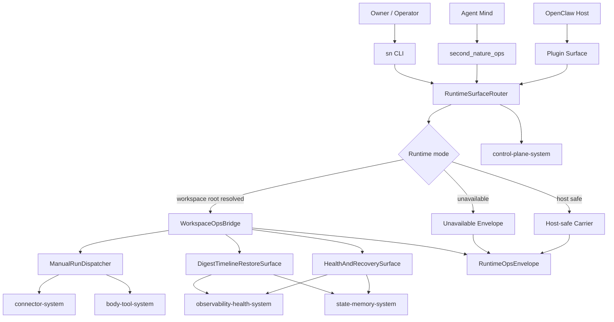
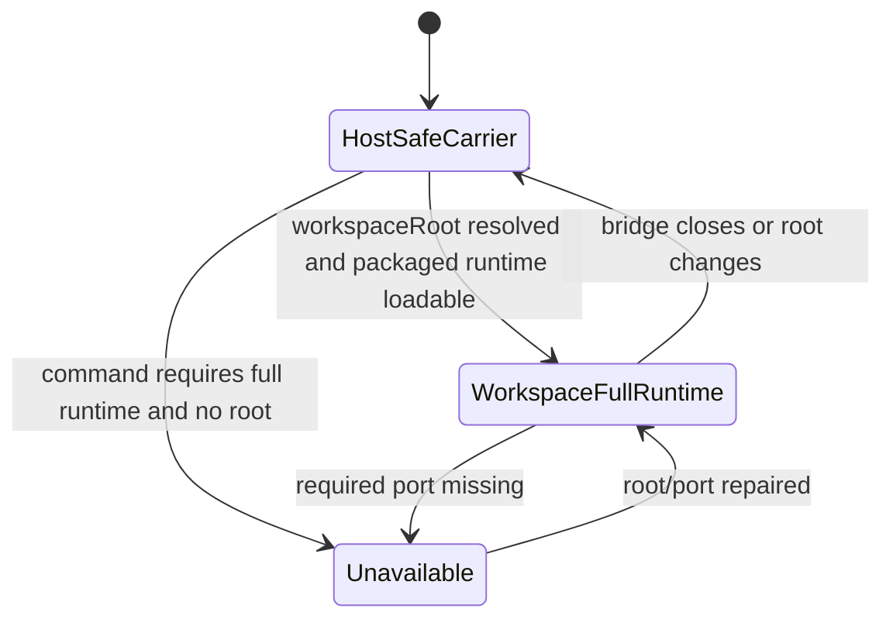

# Runtime Ops System 系统设计文档 (L0 — 导航层)

| 字段 | 值 |
| --- | --- |
| **System ID** | `runtime-ops-system` |
| **Project** | Second Nature |
| **Version** | 7.0 |
| **Status** | `Draft` |
| **Author** | GPT-5.5 / Nyx |
| **Date** | 2026-05-21 |
| **L1 Detail** | [runtime-ops-system.detail.md](./runtime-ops-system.detail.md) — 配置常量、完整数据结构、算法伪代码、决策树与边缘 case |

> [!IMPORTANT]
> 本文件定义 v7 runtime-ops-system：OpenClaw plugin、CLI、workspace bridge、manual run 与 agent/operator JSON-first ops surface。runtime-ops 是宿主神经接口，不拥有 heartbeat planner、state truth、ToolAffordance 计算、SelfHealth 诊断算法或 RestoreSnapshot 存储。

---

## 目录 (Table of Contents)

| § | 章节 | 关键内容 |
| :---: | --- | --- |
| 1 | [概览](#1-概览-overview) | 目的、边界、职责 |
| 2 | [目标与非目标](#2-目标与非目标-goals--non-goals) | Goals / Non-Goals |
| 3 | [背景与上下文](#3-背景与上下文-background--context) | v7 契约、v6 基线、调研 |
| 4 | [系统架构](#4-系统架构-architecture) | plugin/CLI/bridge/manual flow |
| 5 | [接口设计](#5-接口设计-interface-design) | 操作契约、跨系统协议、命令集 |
| 6 | [数据模型](#6-数据模型-data-model) | envelope、runtime context、surface views |
| 7 | [技术选型](#7-技术选型-technology-stack) | TypeScript / OpenClaw / SQLite/sql.js |
| 8 | [Trade-offs](#8-trade-offs--alternatives-权衡与备选方案) | ADR 单向引用与系统取舍 |
| 9 | [安全性考虑](#9-安全性考虑-security-considerations) | secret、redaction、manual safety |
| 10 | [性能考虑](#10-性能考虑-performance-considerations) | P95 目标、lazy loading、bounded query |
| 11 | [测试策略](#11-测试策略-testing-strategy) | Contract Verification Matrix |
| 12 | [部署与运维](#12-部署与运维-deployment--operations) | packaging、workspace root、host E2E |
| 13 | [未来考虑](#13-未来考虑-future-considerations) | dashboard、subprocess bridge、typed schema |
| 14 | [附录](#14-appendix-附录) | 术语、参考、L1 判定 |

---

## 1. 概览 (Overview)

### 1.1 System Purpose (系统目的)

`runtime-ops-system` 是 Second Nature v7 暴露给 OpenClaw Host、Agent Mind、Owner 和 Operator 的运行时入口层。它把 plugin tool call、CLI command、workspace bridge、manual connector run、health/recovery/timeline 查询统一成 JSON-first ops surface，让宿主边界、运行模式、降级原因和下一步动作可被机器和人同时读取。

### 1.2 System Boundary (系统边界)

- **输入 (Input)**: OpenClaw `second_nature_ops` tool call、CLI command、plugin lifecycle event、workspaceRoot、environment、current channel hint、manual run request。
- **输出 (Output)**: `RuntimeOpsEnvelope`、host-safe carrier response、workspace full-runtime response、manual execution result、redacted remediation、required action。
- **依赖系统 (Dependencies)**: `control-plane-system`, `state-memory-system`, `body-tool-system`, `connector-system`, `observability-health-system`, `dream-quiet-system`。
- **被依赖系统 (Dependents)**: OpenClaw Host、Agent Mind、Owner、Operator、host E2E / release gate。

### 1.3 System Responsibilities (系统职责)

**负责**:

- 注册 OpenClaw plugin command/tool/service surface。
- 维护 CLI 与 `second_nature_ops` 的同构 command router。
- 解析 workspace root、host-safe carrier、workspace full runtime 与 unavailable 模式。
- 暴露 `self_health`、`tool_affordance`、`connector:run`、`connector_test --wet`、`heartbeat_digest`、`narrative:diff`、`timeline`、`restore`、`runtime_secret_bootstrap` 等 v7 ops 入口。
- 保证 manual run / wet test 与 cron heartbeat cadence 隔离，并把 trigger source 显式传给下游。
- 以 redacted response 展示 RuntimeSecretAnchor、credential health 和 recovery next step。

**不负责**:

- 不构造 `EmbodiedContext`，由 `control-plane-system` 负责。
- 不计算 `ToolAffordanceMap`、`ToolExperienceLog` 或 `ConnectorCircuitBreaker`，由 `body-tool-system` 负责。
- 不保存 canonical state、timeline、digest 或 restore snapshot，由 `state-memory-system` 负责。
- 不执行 connector adapter 细节，由 `connector-system` 负责。
- 不生成 SelfHealth 诊断结论、Digest 内容或 restore audit，由 `observability-health-system` 负责。
- 不保存 `SECOND_NATURE_ENCRYPTION_KEY` 明文。

---

## 2. 目标与非目标 (Goals & Non-Goals)

### 2.1 Goals

- **[G1]**: 所有 plugin/CLI/tool 返回统一 `RuntimeOpsEnvelope`，明确 `runtimeMode`、`surfaceMode`、`ok`、`data` 或 `error`。[REQ-007]
- **[G2]**: `self_health` 展示 root/env/cron/bridge/credential/storage/delivery/Dream/setup 的 redacted 诊断入口，任何探针不可用时局部 `unknown`。[REQ-007], [REQ-012]
- **[G3]**: `tool_affordance` 透传 body-tool 的 read-only、side-effect、pending-trust、degraded、blocked 能力视图，不泄漏 credential/raw payload。[REQ-002]
- **[G4]**: `connector_test --wet` 对 safe/read-only endpoint 做真实探针，返回真实 status/path/reason/redacted sample，不用 dry-run 冒充健康。[REQ-009]
- **[G5]**: `connector:run` 和 wet test 标记 `triggerSource: "manual"`，不推进 heartbeat cadence，不伪装自然生活事件。[REQ-003], [REQ-006], [REQ-009]
- **[G6]**: `heartbeat_digest`、`narrative:diff`、`timeline`、`restore` 作为 read/action surface 接入 observability/state，不复制实现逻辑。[REQ-010], [REQ-011]
- **[G7]**: `runtime_secret_bootstrap` 展示 key anchor 管理位置、校验状态和恢复原则，不保存或输出 key 明文。[REQ-012]

### 2.2 Non-Goals

- **[NG1]**: 不实现新的 workflow engine 或外部 daemon。
- **[NG2]**: 不把 `status` 直接改名成 `self_health`；self-health 是多探针健康视图。
- **[NG3]**: 不让 digest 使用 outreach 语气或绕过 dashboard proof 语义。
- **[NG4]**: 不让 wet test 默认执行；必须由 operator/agent 显式请求。
- **[NG5]**: 不恢复 credential 明文，不绕过 trust policy 或 owner/policy gate。

---

## 3. 背景与上下文 (Background & Context)

### 3.1 Why This System? (为什么需要这个系统？)

v7 要让 agent 有“身体”：手脚、触觉、健康、历史和恢复。但身体必须有清晰入口，否则 owner 和 agent 只能在日志、artifact、plugin host 和 DB 之间盲摸。runtime-ops 把这些入口统一成可解析、可降级、可审计的 surface。

**关联 PRD需求**: [REQ-001], [REQ-002], [REQ-003], [REQ-006], [REQ-007], [REQ-009], [REQ-010], [REQ-011], [REQ-012]

### 3.2 Current State (现状分析)

v6 已有 `second_nature_ops`、host-safe carrier、workspace bridge、`status`、`explain`、`heartbeat_check`、`fallback`、`credential`、`narrative`、`goal`、`dream:recent`、`connector_status`、`connector_test`、`cycle:recent` 等入口。当前代码中 `connector_test` 仍默认 dry-run，credential health 已能识别 missing/wrong key，但 v7 `self_health`、wet truth、digest/timeline/restore surface 还需要明确契约。

### 3.3 Constraints (约束条件)

- **技术约束**: TypeScript / Node.js / OpenClaw native plugin；状态使用 SQLite/sql.js index 加 Markdown/JSON workspace artifacts。
- **运行约束**: plugin register 必须 host-safe；full workspace runtime 通过 lazy bridge 装配。
- **性能约束**: SelfHealthSnapshot DB 可用时 P95 < 1s；ToolAffordanceMap 50 manifests P95 < 1s；heartbeat P95 < 2s。
- **安全约束**: credential、token、cookie、raw private message、raw prompt 不进入 ordinary state、ToolExperience 或 self health。
- **协作约束**: 本系统设计不得修改 control-plane、state-memory 或 observability-health 的文档。

### 3.4 调研结论摘要

完整研究见 [_research/runtime-ops-system-research.md](./_research/runtime-ops-system-research.md)。结论是：v7 应继承 v6 JSON-first ops surface 与 workspace bridge，新增命令作为增量入口接入，不拆 plugin-system / cli-system；wet/manual/restore/secret 是高风险公共契约，必须有显式 mode、source 和失败语义。

---

## 4. 系统架构 (Architecture)

### 4.1 Architecture Diagram (架构图)



### 4.2 Core Components (核心组件)

| Component | Responsibility | Tech Stack | Notes |
| --- | --- | --- | --- |
| `PluginSurfaceRegistrar` | 同步注册 OpenClaw command/tool/service | TypeScript / OpenClaw SDK | 不在 module scope 加载 DB |
| `RuntimeSurfaceRouter` | 标准化 command、args、runtime mode 和 envelope | TypeScript | CLI/tool 同构 |
| `WorkspaceOpsBridge` | lazy full-runtime bridge；解析 workspace root；动态装配 DB/read models/router | Node dynamic import | 继承 v6 bridge |
| `ManualRunDispatcher` | `connector:run`、`connector_test --wet`、manual heartbeat probe 的隔离入口 | typed ports | 必须标记 `triggerSource` |

> **Manual run 并发控制**（DR-038）：`ManualRunDispatcher` 在调用 state write 前通过 `ManualTriggerContext.affectsHeartbeatCadence: false` 标记隔离 trigger source；state-memory 的 write queue（参见 state-memory §12.Y）保证串行写入，`triggerSource` 字段由调用方在构建 `AttemptRecord`/`ToolExperienceRow` 时写入，不依赖写入顺序推断。在 `connector:run` 执行期间，系统不阻止 cron heartbeat 并发运行——两者通过 write queue 自然串行化，各自的 `triggerSource` 独立且准确。测试补充："并发 manual + cron"场景见 [L1 detail.md §11](./runtime-ops-system.detail.md)。

| `HealthAndRecoverySurface` | `self_health`、`runtime_secret_bootstrap`、credential key health 读面 | read ports | 不拥有诊断算法 |
| `DigestTimelineRestoreSurface` | `heartbeat_digest`、`narrative:diff`、`timeline`、`restore` 入口 | read/action ports | restore 写 audit 由下游负责 |
| `OpsEnvelopeBuilder` | 统一 `RuntimeOpsEnvelope` 与 error shape | TypeScript schema | 防止 command-specific error 漂移 |

### 4.3 Command Data Flow

Caller 进入 `RuntimeSurfaceRouter` 后先验证 command 和 runtime mode；host-safe 路径只返回 carrier envelope，full runtime 路径经 `WorkspaceOpsBridge` 调用 read/action ports，并由下游系统返回 redacted view、manual result 或 restore audit ref。

### 4.4 Runtime Mode State



**关键规则**:

1. `host_safe_carrier` 能注册和返回结构化错误，但不能假装已读取 workspace DB。
2. `workspace_full_runtime` 必须来自显式 env/tool `workspaceRoot` 或 CLI cwd。
3. `unavailable` 必须给出 stable `error.code`、`requiredUserInput` 和 `nextStep`。

---

## 5. 接口设计 (Interface Design)

### 5.1 操作契约表 (Operation Contracts)

| 操作 | 需求 | 前置条件 | 消耗/输入 | 产出/副作用 | 实现细节 |
| --- | :---: | --- | --- | --- | :---: |
| `dispatchRuntimeOps(command,args,context)` | [REQ-007] | command 已注册 | command; args; workspaceRoot; channelHint | `RuntimeOpsEnvelope` | L0 |
| `resolveWorkspaceRuntime(context)` | [REQ-007], [REQ-012] | plugin/CLI 已启动 | env; cwd; tool workspaceRoot | runtime mode + root diagnostics | L0 |
| `self_health(scope)` | [REQ-007], [REQ-012] | observability-health read port 可用或可降级 | scope; includeUnknown | redacted health sections; unknown section 不整体失败 | L0 |
| `tool_affordance(query)` | [REQ-002], [REQ-003] | body-tool read port 可用 | platform/capability filter | affordance rows; source refs; cooldown hints | L0 |
| `connector_run(request)` | [REQ-003], [REQ-006], [REQ-009] | trust/policy/idempotency 由下游验证 | platformId; capability; payloadRef; manual reason | manual result; ToolExperience trigger source | L0 |
| `connector_test(mode=wet)` | [REQ-009] | connector registered; wet endpoint safe/read-only | platformId; capability?; timeout | real status/path/reason/redacted sample | L0 |
| `heartbeat_digest(query)` | [REQ-010] | digest read model 可用 | day/window; delivery target? | dashboard proof or fallback | L0 |
| `narrative_diff(query)` | [REQ-011] | timeline read model 可用 | from; to; narrativeId | diff view; source refs | L0 |
| `timeline(query)` | [REQ-011] | observability/state read model 可用 | time range; subject filters | ordered transitions | L0 |
| `restore(request)` | [REQ-011] | restore target allowed; snapshot exists | target; version; reason | restore result; restore audit ref | L0 |
| `runtime_secret_bootstrap(query)` | [REQ-012] | credential/anchor read port 可用或 unknown | workspaceRoot; platformId? | key anchor health; recovery next step | L0 |

### 5.2 跨系统接口协议 (Cross-System Interface)

```ts
export interface RuntimeOpsPort {
  dispatch(input: RuntimeOpsCommandInput): Promise<RuntimeOpsEnvelope>;
}

export interface RuntimeOpsReadPorts {
  loadSelfHealth(query: SelfHealthQuery): Promise<SelfHealthView>;
  loadToolAffordance(query: ToolAffordanceQuery): Promise<ToolAffordanceView>;
  loadHeartbeatDigest(query: HeartbeatDigestQuery): Promise<HeartbeatDigestView>;
  loadTimeline(query: TimelineQuery): Promise<NarrativeTimelineView>;
  diffNarrative(query: NarrativeDiffQuery): Promise<NarrativeDiffView>;
  loadRuntimeSecretBootstrap(query: RuntimeSecretBootstrapQuery): Promise<RuntimeSecretBootstrapView>;
}

export interface RuntimeOpsActionPorts {
  runConnectorManual(request: ManualConnectorRunRequest): Promise<ManualConnectorRunResult>;
  testConnectorWet(request: WetConnectorTestRequest): Promise<CapabilityProbeView>;
  restoreSnapshot(request: RestoreRequest): Promise<RestoreResult>;
}
```

### 5.3 Command Set

命令名以 §5.1 操作契约为准；CLI 使用 `sn <command>`，OpenClaw 使用 `second_nature_ops.command`，两者共享同一 `RuntimeOpsEnvelope` 和 runtime mode 语义。

### 5.4 Failure Semantics

| Failure | Result code | Required response |
| --- | --- | --- |
| no workspace root | `WORKSPACE_ROOT_UNRESOLVED` | `runtimeMode=host_safe_carrier`; required input names |
| packaged runtime missing | `PACKAGED_RUNTIME_UNAVAILABLE` | no DB access claimed |
| required port missing | `RUNTIME_PORT_UNAVAILABLE` | command-specific `requiredPort` |
| wet endpoint unsafe | `WET_PROBE_UNSAFE_ENDPOINT` | no network call attempted |
| wet 404/401/5xx | `WET_PROBE_FAILED` | true status/path/reason |
| proof missing | `DELIVERY_PROOF_MISSING` | no sent claim |
| wrong encryption key | `CREDENTIAL_RECOVERY_REQUIRED` | recovery section path, no key value |
| restore target unsafe | `RESTORE_TARGET_DENIED` | no mutation; audit/refusal reason |

---

## 6. 数据模型 (Data Model)

### 6.1 核心实体 (Core Entities)

```ts
export interface RuntimeOpsEnvelope<T = unknown> {
  ok: boolean;
  command: string;
  runtimeMode: "host_safe_carrier" | "workspace_full_runtime" | "unavailable";
  surfaceMode: "cli" | "openclaw_tool" | "plugin_command" | "cron_probe";
  generatedAt: string;
  data?: T;
  error?: RuntimeOpsError;
  warnings: RuntimeOpsWarning[];
  sourceRefs: SourceRef[];
  requiredAction?: RuntimeRequiredAction;
}

export interface RuntimeRootContext {
  resolution: "env" | "tool_args" | "cli_cwd" | "unknown";
  declaredRoot?: string;
  runtimeRoot?: string;
  drift: Array<"env_vs_tool" | "env_vs_cwd" | "cron_vs_bridge" | "missing_data_dir">;
}

export interface ManualTriggerContext {
  triggerSource: "manual";
  caller: "owner" | "agent" | "operator" | "host";
  reason: string;
  affectsHeartbeatCadence: false;
  idempotencyKey?: string;
}

export interface RuntimeSecretBootstrapView {
  status: "ok" | "runtime_secret_anchor_missing" | "runtime_secret_unavailable" | "credential_recovery_required" | "unknown";
  anchorLocation?: string;
  keyHealth: "ok" | "missing_key" | "wrong_key" | "unknown";
  recoveryPrincipleRef: string;
  plaintextKeyExposed: false;
}

// SelfHealthView — runtime-ops self_health 命令的 data 字段（DR-042）
// canonical 字段由 observability-health-system.SelfHealthSnapshot 定义
export interface SelfHealthView {
  overall: "healthy" | "degraded" | "unknown";
  generatedAt: string;                     // ISO8601
  degraded_dimensions: string[];           // 降级维度名称列表
  dimensions: {
    [dimension: string]: {
      status: "healthy" | "degraded" | "unknown";
      reason?: string;                     // diagnostic reason code
      lastProbeAt?: string;                // ISO8601
    };
  };
  lastKnownAt?: string;                    // 全部探针超时时返回最后已知快照时间
}
```

> `SelfHealthView` 是 `observability-health-system.SelfHealthSnapshot` 的 runtime-ops surface 投影，字段 1:1 对应；runtime-ops 不实现诊断算法，只做 envelope 包装（DR-042）。

字段声明只描述公共契约；`ToolAffordanceView`、`HeartbeatDigestView`、`RestoreResult` 的 canonical 字段由对应系统设计持有。

### 6.2 实体关系 (Entity Relationship)

`RuntimeOpsEnvelope` 是所有 response 的外壳；`RuntimeRootContext` 描述 workspace/root 漂移；`ManualTriggerContext` 只出现在 manual run / wet probe；`RuntimeSecretBootstrapView` 只出现在 secret recovery surface，且固定 `plaintextKeyExposed=false`。

### 6.3 数据流向 (Data Flow Direction)

- OpenClaw plugin / CLI 只生成 command input 与 envelope。
- workspace bridge 装配 state/observability/read ports，但不直接定义 state schema。
- `self_health` 从 observability-health 读取诊断，从 state-memory/credential read model 补 key health。
- `tool_affordance` 从 body-tool 读取结果，并只做 redaction envelope 包装。
- `restore` 调用 state-memory action port；restore audit 由 observability-health 写入。

---

## 7. 技术选型 (Technology Stack)

### 7.1 Core Technologies (核心技术)

| Domain | Choice | Rationale |
| --- | --- | --- |
| Runtime | TypeScript + Node.js | 继承 ADR-001 |
| Host surface | OpenClaw native plugin | v6 plugin/tool/service surface 已存在 |
| Command router | JSON-first OpsRouter | CLI/tool 同构、可测试 |
| Workspace bridge | lazy dynamic import + SQLite/sql.js DB open | 保持 register host-safe |
| State access | typed ports/read models | 不越界读取 raw artifacts |
| Output validation | TypeScript schema + stable reason codes | 防止 command-specific 漂移 |

### 7.2 Key Dependencies

- `plugin/index.ts`: OpenClaw plugin registration 与 host-safe carrier。
- `plugin/workspace-ops-bridge.ts`: packaged runtime bridge。
- `src/cli/ops/ops-router.ts`: full runtime command dispatch。
- `src/cli/read-models/index.ts`: status/credential/dream/cycle/narrative read models。
- `src/storage/services/credential-vault.ts`: runtime secret key health probe。

---

## 8. Trade-offs & Alternatives (权衡与备选方案)

### 8.1 TypeScript / Node / OpenClaw runtime

> **决策来源**: [ADR-001: Continue TypeScript / Node / OpenClaw Plugin Runtime](../03_ADR/ADR_001_TECH_STACK.md)
>
> 本系统继续使用 ADR-001 定义的 TypeScript / Node / OpenClaw plugin runtime。
>
> **本系统特有实现**: plugin register 保持 host-safe；workspace DB 与 full read models 通过 lazy bridge 装配。

### 8.2 Embodied loop entry without scripted control

> **决策来源**: [ADR-002: Embodied Agent Loop Guides the Mind Without Scripted Control](../03_ADR/ADR_002_EMBODIED_AGENT_LOOP.md)
>
> runtime-ops 暴露 embodied read surfaces，但不替 agent 或 control-plane 做语义判断。
>
> **本系统特有实现**: `tool_affordance`、`self_health`、digest、timeline 均以 bounded view 形式返回。

### 8.3 Tool affordance and experience

> **决策来源**: [ADR-003: Tool Affordance and Tool Experience Form the Agent Body](../03_ADR/ADR_003_TOOL_AFFORDANCE_AND_EXPERIENCE.md)
>
> runtime-ops 只暴露 `tool_affordance`、manual run 和 wet test 入口；affordance、experience、breaker 由 body-tool/connector 系统负责。
>
> **本系统特有实现**: manual result 必须携带 `ManualTriggerContext`。

### 8.4 Channel feedback and self health

> **决策来源**: [ADR-006: Delivery, Channel Feedback, and Self Health Must Be Truthful](../03_ADR/ADR_006_CHANNEL_FEEDBACK_AND_SELF_HEALTH.md)
>
> delivery proof 缺失不得标记 sent；SelfHealth 要纳入 root/env/cron/bridge/credential/storage 等诊断。
>
> **本系统特有实现**: `self_health` 不整体失败，section 不可用时返回 `unknown`。

### 8.5 Identity, digest, and runtime secret recovery

> **决策来源**: [ADR-007: Identity, Digest, and Runtime Secret Recovery Are First-Class Body Signals](../03_ADR/ADR_007_IDENTITY_DIGEST_AND_RECOVERY.md)
>
> RuntimeSecretAnchor 只记录路径与恢复原则；HeartbeatDigest 是 dashboard proof，不是 outreach。
>
> **本系统特有实现**: `runtime_secret_bootstrap` 保证 `plaintextKeyExposed=false`。

### 8.6 Probe truth, history browser, and restore

> **决策来源**: [ADR-008: Probe Truth, History Browser, and Bounded Rollback](../03_ADR/ADR_008_CONNECTOR_PROBE_CIRCUIT_BREAKER_AND_ROLLBACK.md)
>
> runtime-ops 提供 `connector_test --wet`、`narrative:diff`、`timeline`、`restore` 的入口，不保存 snapshot payload。
>
> **本系统特有实现**: `restore` 必须返回 audit ref 或 refusal reason。

### 8.7 Single runtime-ops surface vs split plugin/CLI systems

**Option A: 单一 runtime-ops surface (Selected)**

- **优点**: 复用 workspace resolution、host-safe carrier、JSON-first envelope，降低重复错误语义。
- **缺点**: 命令表更大，需要 Contract Verification Matrix 控制膨胀。

**Option B: 拆成 plugin-system 与 cli-system**

- **优点**: 文件层面更分散。
- **缺点**: 会复制 bridge、runtime mode、unavailable 语义，违背 v7 架构“不再拆分”的理由。

**Decision**: 选择 Option A。入口复杂度是本质复杂度，复制入口才是偶然复杂度。

---

## 9. 安全性考虑 (Security Considerations)

| Risk | Severity | Mitigation |
| --- | :---: | --- |
| host-safe carrier 被误判 full runtime | High | `runtimeMode` 必填；workspace DB 未读时不得返回 full data |
| wet test 触发副作用 | High | 只允许 safe/read-only endpoint；side-effect capability 拒绝 wet probe |
| manual run 污染 heartbeat cadence | High | `ManualTriggerContext.affectsHeartbeatCadence=false`；triggerSource 必填 |
| credential key 泄漏 | Critical | RuntimeSecretAnchor 永不输出 key 明文；只输出 anchor path / key health |
| raw payload / private text 泄漏 | High | envelope 只传 redacted sample/ref；raw content 留在下游受控存储 |
| digest 被误当 outreach | Medium | digest command 使用 dashboard proof mode；无朋友式邀请语气 |
| restore 绕过 trust/policy | High | restore action port 执行目标校验；runtime-ops 只提交请求 |
| current channel proof 缺失 | High | proof missing 返回 not_sent/fallback，不写 sent |

---

## 10. 性能考虑 (Performance Considerations)

| 指标 | 目标 | 策略 |
| --- | --- | --- |
| plugin register | P95 < 500ms | 不加载 DB；只注册 host-safe surface |
| common read command | P95 < 1s | indexed read models + bounded response |
| `self_health` | DB 可用时 P95 < 1s | 并行 section probe；section failure 局部 unknown |
| `tool_affordance` | 50 manifests P95 < 1s | body-tool 提供 bounded snapshot；runtime-ops 不现场扫描全部历史 |
| `connector_test --wet` | bounded by explicit timeout | 默认小 timeout；返回 partial probe result |
| timeline/digest query | 最近 30 天 P95 < 1s | observability indexes and pagination |

RuntimeSurfaceRouter 不应在启动时隐式 reload connectors、扫描 Dream artifacts 或运行 wet probe。

---

## 11. 测试策略 (Testing Strategy)

### 11.1 Test Layers

| 类型 | 覆盖范围 |
| --- | --- |
| Unit | command normalization、envelope builder、runtime mode resolver、error code mapping |
| Contract | CLI 与 `second_nature_ops` schema parity |
| Integration | workspace bridge full runtime dispatch、read model availability、credential key health |
| Safety | wet endpoint safe gate、manual trigger isolation、redaction、secret no plaintext |
| Host E2E | OpenClaw plugin load、tool visibility、cron env vs bridge env、current channel proof |
| Regression | v6 `status`、`explain`、`fallback`、`connector_status`、`connector_test` 不倒退 |

### 11.2 Contract Verification Matrix

| 契约 | Producer | Consumer | 正常态验证 | 失败态验证 | 回归责任 |
| --- | --- | --- | --- | --- | --- |
| `RuntimeOpsEnvelope` | runtime-ops | agent/OpenClaw/CLI/tests | ok/data/warnings/sourceRefs present | `runtimeMode=unavailable` with stable error | unit + contract |
| workspace root resolution | runtime-ops | workspace bridge/self_health | env/tool/cwd root resolved | missing/drift returns remediation | integration + host E2E |
| host-safe carrier | plugin surface | OpenClaw host | register succeeds without DB | full data not claimed | plugin smoke |
| `self_health` | observability-health via runtime-ops | owner/agent | sections show ok/degraded/unknown | one probe failure does not fail whole command | integration |
| `runtime_secret_bootstrap` | runtime-ops/state/observability | operator | key health ok without plaintext | missing/wrong key returns recovery reason | security |
| `tool_affordance` | body-tool via runtime-ops | agent/control-plane | five posture classes visible | credential/raw payload absent | contract + security |
| `connector_test --wet` | connector via runtime-ops | operator/body-tool | 200 returns true status/path/sample ref | 404/401 return true failure, not dry ok | connector integration |
| `connector:run` manual isolation | runtime-ops/connector/body-tool | observability/control-plane | triggerSource manual recorded | cadence unchanged after manual run | integration |
| delivery proof propagation | runtime-ops/observability | owner/guidance | proof ref visible when sent | missing proof returns not_sent/fallback | host E2E |
| `heartbeat_digest` | observability-health via runtime-ops | owner | counts connector/goal/Quiet/Dream/health | no events returns `nothing_significant` | integration |
| `narrative:diff` | observability/state via runtime-ops | owner/agent | from/to diff visible | missing version returns clear input error | integration |
| `timeline` | observability/state via runtime-ops | owner/agent | ordered transitions with refs | sensitive refs redacted | integration + security |
| `restore` | state-memory via runtime-ops | operator | restore result and audit ref returned | unsafe target denied and audited | integration |

---

## 12. 部署与运维 (Deployment & Operations)

- Plugin package ships `plugin/index.ts`, `workspace-ops-bridge.ts`, `openclaw.plugin.json`, and packaged `plugin/runtime`.
- Operators should set `SECOND_NATURE_WORKSPACE_ROOT` to the OpenClaw agent workspace, not plugin install directory.
- `SECOND_NATURE_ENCRYPTION_KEY` must be managed outside chat history and ordinary memory; runtime-ops only surfaces anchor metadata and health.
- Host-safe carrier must remain usable even when workspace DB or dynamic import fails.
- Host E2E must verify plugin load, tool visibility, cron env vs bridge env, current channel / dm proof, and manual `connector:run` isolation.

---

## 13. 未来考虑 (Future Considerations)

后续可在 JSON-first 契约稳定后补 dashboard UI、subprocess bridge fallback、generated JSON Schema 和 typed OpenClaw current-channel probe；这些都不进入 v7 L0 基线。

---

## 14. Appendix (附录)

### 14.1 Glossary

- **RuntimeOpsEnvelope**: runtime-ops 所有 CLI/tool/plugin command 的稳定 JSON 返回外壳。
- **Host-safe carrier**: plugin 已加载但未访问 workspace DB 时的安全响应模式。
- **Workspace full runtime**: workspace root 已解析、state/observability DB 与 read/action ports 已装配的运行模式。
- **Manual trigger**: operator/agent 显式触发的 connector run 或 wet probe，不等于 cron heartbeat。
- **RuntimeSecretAnchor**: encryption key 的管理位置与恢复原则，不包含 key 明文。

### 14.2 L1 Trigger Review

未触发 R1-R5：本 L0 只保留短接口字段声明、Mermaid 摘要图、操作契约和验证矩阵；无长伪代码、配置字典或超过 500 行内容。若后续实现需要展开完整 command JSON Schema、reason code 字典、wet probe 状态机或 restore edge-case 表，再创建 `runtime-ops-system.detail.md`。

> **已生成**: `runtime-ops-system.detail.md` 包含配置常量、完整类型、四个核心算法伪代码、决策树与边缘 case。

### 14.3 References

- [_research/runtime-ops-system-research.md](./_research/runtime-ops-system-research.md)
- [PRD v7](../01_PRD.md), [Architecture Overview v7](../02_ARCHITECTURE_OVERVIEW.md)
- [ADR-001](../03_ADR/ADR_001_TECH_STACK.md), [ADR-002](../03_ADR/ADR_002_EMBODIED_AGENT_LOOP.md), [ADR-003](../03_ADR/ADR_003_TOOL_AFFORDANCE_AND_EXPERIENCE.md), [ADR-006](../03_ADR/ADR_006_CHANNEL_FEEDBACK_AND_SELF_HEALTH.md), [ADR-007](../03_ADR/ADR_007_IDENTITY_DIGEST_AND_RECOVERY.md), [ADR-008](../03_ADR/ADR_008_CONNECTOR_PROBE_CIRCUIT_BREAKER_AND_ROLLBACK.md)
- [v6 CLI System Design](../../v6/04_SYSTEM_DESIGN/cli-system.md), [v6 Control Plane System Design](../../v6/04_SYSTEM_DESIGN/control-plane-system.md), [v6 Observability System Design](../../v6/04_SYSTEM_DESIGN/observability-system.md)
- `plugin/index.ts`, `plugin/workspace-ops-bridge.ts`, `src/cli/index.ts`, `src/cli/ops/ops-router.ts`, `src/cli/commands/connector-status.ts`, `src/storage/services/credential-vault.ts`
