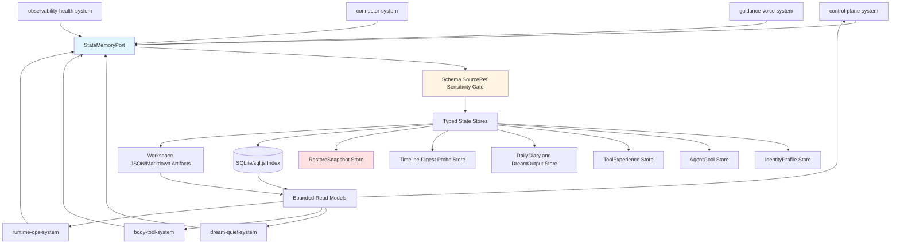
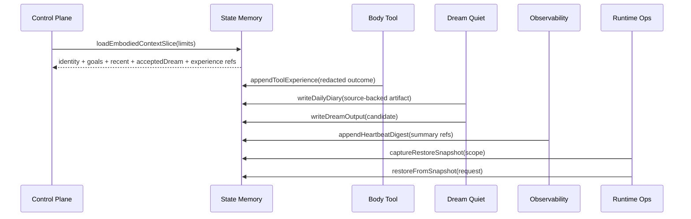
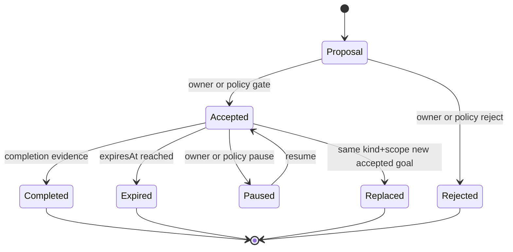
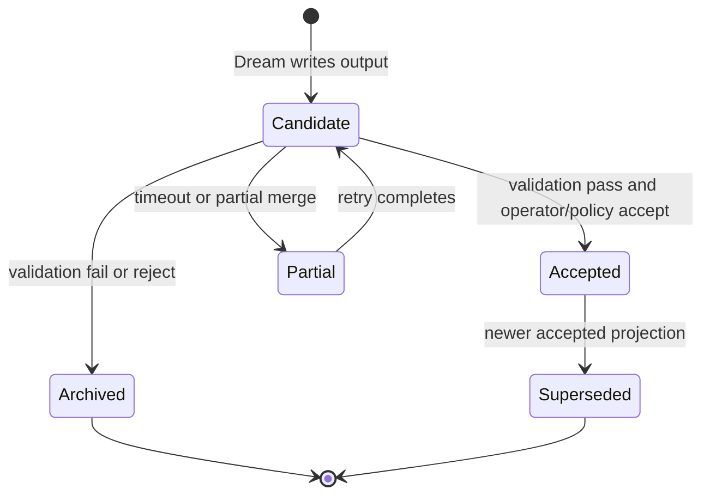
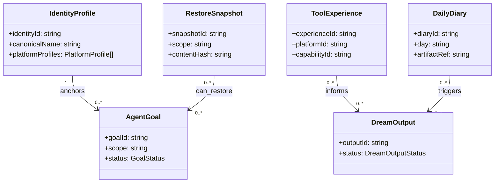

# State Memory System 系统设计文档 (L0 — 导航层)

| 字段 | 值 |
| --- | --- |
| **System ID** | `state-memory-system` |
| **Project** | Second Nature |
| **Version** | 7.0 |
| **Status** | `Draft` |
| **Author** | GPT-5.5 / Nyx |
| **Date** | 2026-05-21 |
| **L1 Detail** | [state-memory-system.detail.md](./state-memory-system.detail.md) — 配置常量、migration 顺序、算法伪代码、决策树与边缘 case |

> [!IMPORTANT]
> 本文件定义 v7 的长期记忆与状态持久化边界。`state-memory-system` 保存可追溯、已脱敏、可恢复的 state/read model，不保存 credential、token、raw private content、raw prompt，也不替 control-plane 做行动决策。

---

## 目录 (Table of Contents)

| § | 章节 | 关键内容 |
| :---: | --- | --- |
| 1 | [概览](#1-概览-overview) | 目的、边界、职责 |
| 2 | [目标与非目标](#2-目标与非目标-goals--non-goals) | Goals / Non-Goals |
| 3 | [背景与上下文](#3-背景与上下文-background--context) | v7 需求、v6 继承、调研 |
| 4 | [系统架构](#4-系统架构-architecture) | 组件、数据流、生命周期 |
| 5 | [接口设计](#5-接口设计-interface-design) | 操作契约、跨系统端口、失败语义 |
| 6 | [数据模型](#6-数据模型-data-model) | 字段声明、持久化边界、关系图 |
| 7 | [技术选型](#7-技术选型-technology-stack) | TypeScript、SQLite/sql.js、workspace artifacts |
| 8 | [Trade-offs](#8-trade-offs--alternatives-权衡与备选方案) | ADR 引用与系统取舍 |
| 9 | [安全性考虑](#9-安全性考虑-security-considerations) | 隐私、脱敏、restore 排除 |
| 10 | [性能考虑](#10-性能考虑-performance-considerations) | 读模型上限、索引、repair |
| 11 | [测试策略](#11-测试策略-testing-strategy) | Contract Verification Matrix |
| 12 | [部署与运维](#12-部署与运维-deployment--operations) | packaging、DB 路径、repair |
| 13 | [未来考虑](#13-未来考虑-future-considerations) | 向量索引、多 workspace、migration CLI |
| 14 | [附录](#14-appendix-附录) | L1 判定、参考、变更历史 |
---

## 1. 概览 (Overview)

### 1.1 System Purpose (系统目的)

`state-memory-system` 是 Second Nature v7 的本地状态与记忆真相源。它把 embodied loop 需要的身份、目标、近期交互摘要、工具经验、日记、梦境输出、时间线、日报、探针结果和恢复快照保存为可追溯结构，并为 heartbeat、Dream、ops、guidance 和 body-tool 提供 bounded read models。

### 1.2 System Boundary (系统边界)

- **输入 (Input)**: redacted state write request、source refs、artifact append、owner goal command、tool experience summary、daily diary output、Dream output、probe result、digest summary、restore request。
- **输出 (Output)**: `EmbodiedContext` state slices、accepted goals、recent interaction snapshot、accepted Dream projection、ToolExperience rows、DailyDiary refs、HeartbeatDigest rows、NarrativeTimeline rows、RestoreSnapshot result。
- **依赖系统 (Dependencies)**: SQLite/sql.js index、workspace Markdown/JSON artifacts、`observability-health-system` redaction policy and health diagnostics。
- **被依赖系统 (Dependents)**: `control-plane-system`, `body-tool-system`, `dream-quiet-system`, `guidance-voice-system`, `runtime-ops-system`, `observability-health-system`, `connector-system`。

### 1.3 System Responsibilities (系统职责)

**负责**:
- 持久化 IdentityProfile、AgentGoal、RecentInteractionSnapshot、ToolExperience、DailyDiary、DreamOutput、NarrativeTimeline、HeartbeatDigest、CapabilityProbeResult、RestoreSnapshot 和 RuntimeSecretAnchor metadata。
- 继承 v6 `SessionChronicle`、`NarrativeState`、`RelationshipMemory`、`MemoryStore`、life evidence 与 credential health 兼容面。
- 提供 bounded read models，默认限制 source refs、recent interactions、ToolExperience 和 accepted projection 数量。
- 在 mutable state 写入前捕获 RestoreSnapshot，并记录敏感排除清单。
- 对所有写入执行 source-ref、schema、sensitivity 和 lifecycle 校验。

**不负责**:
- 不决定 heartbeat intent、IdleCuriosity selection、connector execution 或 outreach delivery；这些由 control/body/connector/guidance/runtime 系统负责。
- 不保存 credential、token、cookie、raw private message、raw prompt、raw model input/output 或未脱敏 platform payload。
- 不把 `candidate` DreamOutput 暴露给 heartbeat active context。
- 不绕过 trust policy、credential gate、CircuitBreaker 或 delivery proof 语义。

---

## 2. 目标与非目标 (Goals & Non-Goals)

### 2.1 Goals

- **[G1]**: 为 heartbeat 提供 bounded `EmbodiedContext` state slices，覆盖 IdentityProfile、accepted goals、recent interaction、accepted Dream projection、ToolExperience 和 life evidence。[REQ-001], [REQ-008]
- **[G2]**: 持久化 ToolExperience 与 CapabilityProbeResult 的 redacted summary，供 body-tool、Dream、digest 和 self health 使用。[REQ-002], [REQ-003], [REQ-009]
- **[G3]**: 扩展 AgentGoal lifecycle，支持 active uniqueness、replace、expire、complete、pause、completion evidence 和 scope。[REQ-004]
- **[G4]**: 保存 DailyDiary 与 DreamOutput lifecycle，并只让 accepted projection 进入 active read path。[REQ-005]
- **[G5]**: 保存 ChannelFeedback/RecentInteraction 派生摘要和 RelationshipMemory 输入，不保存完整私信正文。[REQ-006]
- **[G6]**: 保存 HeartbeatDigest、NarrativeTimeline 和 RestoreSnapshot 的 state side，使 owner/operator 可以追溯历史和有限恢复。[REQ-010], [REQ-011]
- **[G7]**: 保存 RuntimeSecretAnchor metadata，只记录 key location/ref、health 和恢复原则，不记录 key 明文。[REQ-012]

### 2.2 Non-Goals

- **[NG1]**: 不实现向量搜索、长期 raw transcript、全文私密内容归档。
- **[NG2]**: 不让 Dream/Quiet/guidance output 直接获得行动授权。
- **[NG3]**: 不把 observability audit ledger 当作 canonical state。
- **[NG4]**: 不恢复 credential 明文，也不承诺错误 key 下可解密旧密文。
- **[NG5]**: 不做多 agent / 多 owner 租户隔离；v7 字段可预留，但 P0 是单 workspace。

---

## 3. 背景与上下文 (Background & Context)

### 3.1 Why This System? (为什么需要这个系统？)

v7 的核心是 embodied loop。模型是头脑，Second Nature 是身体和生活环境；身体如果没有持久记忆，就只是一组临时工具调用。PRD v7 要求 heartbeat 每轮读取身份、近期交互、工具经验、健康、Quiet/Dream 沉淀和 life evidence，并要求历史、digest 和 restore 可见。

**关联 PRD需求**: [REQ-001], [REQ-003], [REQ-004], [REQ-005], [REQ-006], [REQ-008], [REQ-010], [REQ-011], [REQ-012]

### 3.2 Current State (现状分析)

v6 已有 `AgentGoalStore`、`NarrativeStateStore`、`RelationshipMemoryStore`、`SessionChronicleStore`、`MemoryStoreLifecycle`、life evidence、quiet artifact、credential vault 和 audit trace。v7 不应该重开一套 memory blob；它应该沿着这些 typed stores 增量扩展。

### 3.3 Constraints (约束条件)

- **技术约束**: 继承 TypeScript / Node.js / OpenClaw plugin、SQLite/sql.js index、workspace Markdown/JSON artifacts。
- **性能约束**: EmbodiedContext assembly P95 < 400ms；最近 1000 条 ToolExperience bounded query；最近 100 条 interaction summary；至少 30 天 digest timeline。
- **安全约束**: credential、token、cookie、raw private message、raw prompt 不进入 ordinary memory、ToolExperience、digest、snapshot 或 self health。
- **恢复约束**: 默认至少保留最近 3 版 RestoreSnapshot；restore 不绕过 trust policy，不恢复 credential 明文。

### 3.4 Research Summary

调研结论是：采用 v6 typed state + lifecycle port，新增 v7 domain stores 和 redacted projections。完整调研见 [_research/state-memory-system-research.md](./_research/state-memory-system-research.md)。

---

## 4. 系统架构 (Architecture)

### 4.1 Architecture Diagram (架构图)

### 4.2 Core Components (核心组件)

| Component | Responsibility | Notes |
| --- | --- | --- |
| `StateMemoryPort` | Typed cross-system entry; no arbitrary table writes | Public contract for runtime, control, dream, body, connector |
| `WriteValidationGate` | Schema, source refs, sensitivity, lifecycle, size limits | Calls observability redaction policy where needed |
| `IdentityProfileStore` | Canonical self and per-platform handles | Identity is not credential |
| `GoalLifecycleStore` | Goal write, replace, expire, complete, pause | Active uniqueness by `kind+scope` |
| `InteractionSnapshotProjector` | Redacted recent conversation / reply / commitment summary | Derived from chronicle/channel feedback |
| `ToolExperienceStore` | Append redacted outcomes, pain, evidence quality | Consumed by body-tool and Dream |
| `DiaryDreamStore` | DailyDiary artifact refs and DreamOutput lifecycle | Candidate/accepted separation |
| `HistoryDigestStore` | NarrativeTimeline, HeartbeatDigest, CapabilityProbeResult | Summaries, not raw audit |
| `RestoreSnapshotStore` | Bounded pre-mutation snapshots and restore preflight | Excludes sensitive raw fields |
| `RepairMigrationService` | Rebuild indexes from artifacts and mark degraded rows | Must not delete unknown user files |

### 4.3 Data Flow (数据流)

### 4.4 Lifecycle Diagrams

---

## 5. 接口设计 (Interface Design)

### 5.1 操作契约表 (Operation Contracts)

| 操作 | 需求 | 前置条件 | 消耗/输入 | 产出/副作用 | 实现细节 |
| --- | :---: | --- | --- | --- | :---: |
| `upsertIdentityProfile(profile)` | [REQ-008] | canonical profile source-backed | profile fields; platform handles | identity revision | L0 |
| `loadIdentityProfile(query)` | [REQ-001], [REQ-008] | state readable | platform filter; limit | canonical identity slice | L0 |
| `appendRecentInteractionSummary(summary)` | [REQ-001], [REQ-006] | raw text already redacted or referenced | tone/topic/commitment/contentRef | recent snapshot input | L0 |
| `loadRecentInteractionSnapshot(limit)` | [REQ-001], [REQ-006] | limit <= policy max | interaction query | redacted bounded snapshot | L0 |
| `upsertAgentGoal(goal)` | [REQ-004] | completion criteria; source refs; scope | goal payload | goal revision; optional replacement | L0 |
| `transitionGoalLifecycle(input)` | [REQ-004] | valid transition; evidence when complete | goal id; status; reason | lifecycle update | L0 |
| `appendToolExperience(experience)` | [REQ-003] | raw payload absent; redaction pass | outcome/failure/latency/source refs | append-only experience row | L0 |
| `loadToolExperienceSlice(query)` | [REQ-001], [REQ-003] | bounded query | platform/capability/window | experience summaries | L0 |
| `writeDailyDiary(diary)` | [REQ-005] | source refs non-empty; sensitive refs allowed | three diary sections; claim refs | diary artifact + index | L0 |
| `writeDreamOutput(output)` | [REQ-005] | schema parseable; status not accepted by default | candidate/partial output | DreamOutput artifact + index | L0 |
| `transitionDreamOutputLifecycle(input)` | [REQ-005] | validation summary exists | output id; target status | accepted pointer or archive | L0 |
| `appendHeartbeatDigest(digest)` | [REQ-010] | digest is dashboard summary | daily counts; proof/fallback refs | digest row | L0 |
| `appendCapabilityProbeResult(result)` | [REQ-009] | sample response redacted and bounded | declared/actual/path/status | probe result row | L0 |
| `captureRestoreSnapshot(scope)` | [REQ-011] | before mutable write; exclusions known | state refs; mutation id | bounded snapshot | L0 |
| `restoreFromSnapshot(request)` | [REQ-011] | preflight pass; audit sink available | snapshot id; scope | restored state subset + audit ref | L0 |
| `upsertRuntimeSecretAnchor(anchor)` | [REQ-012] | no key material in payload | locationRef; health; recovery refs | anchor metadata row | L0 |

### 5.2 Cross-System Interface

| Port | Methods | Primary Consumers |
| --- | --- | --- |
| `IdentityStatePort` | `upsertIdentityProfile`, `loadIdentityProfile` | control-plane, connector, runtime-ops |
| `GoalLifecyclePort` | `upsertAgentGoal`, `transitionGoalLifecycle`, `listActiveGoals` | control-plane, runtime-ops |
| `EmbodiedContextStatePort` | `loadIdentityProfile`, `listActiveGoals`, `loadRecentInteractionSnapshot`, `loadToolExperienceSlice`, `loadAcceptedDreamProjection` | control-plane |
| `DreamQuietStatePort` | `writeDailyDiary`, `writeDreamOutput`, `transitionDreamOutputLifecycle` | dream-quiet |
| `BodyFeedbackStatePort` | `appendToolExperience`, `appendCapabilityProbeResult` | body-tool, connector |
| `HistoryRecoveryStatePort` | `appendHeartbeatDigest`, `appendNarrativeTimelineEvent`, `captureRestoreSnapshot`, `restoreFromSnapshot` | runtime-ops, observability-health |

> **EmbodiedContext 完整读取路径**（DR-011/DR-013）：`control-plane` 组装 `EmbodiedContext` 时，通过 `EmbodiedContextStatePort` 读取 state-memory 中的 identity / active goals / recent interactions / experience / accepted dream 五类切片；affordance 切片由 `body-tool-system` 的 `assembleAffordanceMap` 提供（非 state-memory 直接读取）；self-health 切片由 `observability-health-system` 的 `SelfHealthSnapshot` 提供。三类来源通过不同 port 注入，`EmbodiedContextAssembler` 统一聚合。

### 5.3 Failure Semantics

| Failure | Result | State write | Consumer behavior |
| --- | --- | --- | --- |
| `sensitive_raw_payload_detected` | reject | no durable row | caller records degraded reason |
| `source_refs_missing` | reject or insufficient state | no active projection | heartbeat marks `context_degraded:{kind}` |
| `goal_same_scope_replace_failed` | degraded | old active remains | planner uses previous accepted goal |
| `dream_candidate_not_accepted` | ignored by active read | candidate row only | heartbeat does not consume |
| `probe_sample_too_large` | reject sample; keep status only | probe row without sampleRef | affordance marks degraded |
| `snapshot_scope_contains_secret` | exclude sensitive fields | snapshot with exclusion manifest | restore cannot recover excluded field |
| `restore_conflict` | preflight fail | no mutation | runtime returns conflict reason |

---

## 6. 数据模型 (Data Model)

### 6.1 Persistence Boundary

| Entity | Storage Boundary | Producer | Consumers | Explicitly Forbidden |
| --- | --- | --- | --- | --- |
| `IdentityProfile` | SQLite current row + optional JSON artifact for profile refs | runtime/connector/operator | heartbeat, connector | credential, private profile material |
| `AgentGoal` | SQLite revision rows and lifecycle events | owner/runtime/control | heartbeat, runtime | raw prompt as goal source |
| `RecentInteractionSnapshot` | Derived SQLite/materialized read model | channel feedback/chronicle | heartbeat, guidance | raw private message |
| `ToolExperience` | Append-only SQLite rows; optional artifact for large summaries | body/connector/runtime | body, Dream, digest | raw payload, token, cookie |
| `DailyDiary` | Markdown/JSON artifact + SQLite index | dream-quiet | heartbeat, Dream, runtime | sensitive source refs when blocked |
| `DreamOutput` | JSON artifact + lifecycle index | dream-quiet | heartbeat after accepted | candidate in active context |
| `NarrativeTimeline` | Append-only summary rows | observability/control/runtime | runtime, owner | raw prompt, full model output |
| `HeartbeatDigest` | Daily summary row + delivery proof refs | observability/runtime | owner/runtime | outreach wording, raw payload |
| `CapabilityProbeResult` | Redacted probe row | connector/runtime | body, self health | credential, unbounded sample |
| `RestoreSnapshot` | Bounded snapshot artifact + hash/index | state/runtime | runtime restore | credential plaintext, raw private content |
| `RuntimeSecretAnchor` | Metadata row only | runtime/operator | self health, README/AGENTS views | encryption key plaintext |

### 6.2 Field Declarations

| Entity | Required Fields |
| --- | --- |
| `IdentityProfile` | `identityId`, `canonicalName`, `bioSummary`, `avatarRef?`, `platformProfiles[]`, `sourceRefs[]`, `status`, `updatedAt` |
| `PlatformProfile` | `platformId`, `handle`, `displayName?`, `profileRef`, `avatarUrl?`, `lastVerifiedAt?`, `degradedReason?` |
| `AgentGoal` | `goalId`, `kind`, `scope`, `status`, `origin`, `description`, `completionCriteria`, `priorityHint`, `expiresAt?`, `completedAt?`, `completionEvidenceRefs[]`, `replacedByGoalId?`, `sourceRefs[]`, `updatedAt` |
| `RecentInteractionSnapshot` | `snapshotId`, `generatedAt`, `channelRef?`, `interactionSummaries[]`, `toneSignals[]`, `topics[]`, `pendingCommitments[]`, `contentRefs[]`, `sourceRefs[]` |
| `ToolExperience` | `experienceId`, `platformId`, `capabilityId`, `triggerSource`, `outcome`, `failureClass?`, `latencyMs?`, `evidenceQuality`, `painScore`, `sourceRefs[]`, `redactionStatus`, `createdAt` |
| `DailyDiary` | `diaryId`, `day`, `observedToday`, `notableSignals`, `tomorrowDirection`, `claimRefs[]`, `sourceRefs[]`, `artifactRef`, `sensitivityStatus`, `createdAt` |
| `DreamOutput` | `outputId`, `runId`, `status`, `projectionSummary`, `insightRefs[]`, `narrativeProposalRef?`, `relationshipProposalRef?`, `toolExperienceProjectionRefs[]`, `validation`, `sourceRefs[]`, `createdAt` |
| `NarrativeTimeline` | `timelineEventId`, `narrativeId`, `fromRevision?`, `toRevision`, `transitionKind`, `reasonCode`, `diffSummary`, `sourceRefs[]`, `createdAt` |
| `HeartbeatDigest` | `digestId`, `day`, `connectorCounts`, `breakerSummary`, `goalSummary`, `quietDreamSummary`, `healthSummaryRef?`, `deliveryStatus`, `proofRef?`, `sourceRefs[]` |
| `CapabilityProbeResult` | `probeId`, `platformId`, `capabilityId`, `probeKind`, `endpointRef`, `httpStatus?`, `declaredStatus`, `actualStatus`, `sampleResponseRef?`, `mismatchReason?`, `redactionStatus`, `observedAt` |
| `RestoreSnapshot` | `snapshotId`, `scope`, `version`, `capturedBeforeMutationId`, `stateRefs[]`, `excludedSensitiveKinds[]`, `contentHash`, `retentionExpiresAt`, `createdAt` |
| `RuntimeSecretAnchor` | `anchorId`, `locationRef`, `keyHealth`, `rotationPolicyRef`, `recoveryDocRef`, `lastVerifiedAt`, `updatedAt` |

### 6.3 Entity Relationship

### 6.4 Data Flow Direction

- Connector/body/runtime append ToolExperience and CapabilityProbeResult; state-memory validates and persists redacted rows.
- Dream-quiet writes DailyDiary and candidate DreamOutput; state-memory owns accepted pointer and active projection.
- Control-plane reads bounded state slices; it does not write raw prompt or direct behavior decisions into memory.
- Observability-health can derive digest/timeline/probe diagnostics, but state-memory remains the durable row owner for these summary read models.

---

## 7. 技术选型 (Technology Stack)

### 7.1 Core Technologies

| Domain | Choice | Rationale |
| --- | --- | --- |
| Runtime | TypeScript + Node.js | Inherited from ADR-001 and current codebase |
| Structured index | SQLite/sql.js | Local-first typed queries and migration |
| Artifacts | JSON/Markdown workspace files | Human-readable diary, Dream output, snapshot manifests |
| Validation | TypeScript schema parser or existing zod-equivalent pattern | Write boundary needs parseable contracts |
| Redaction | Observability redaction policy + local write gate | Avoid duplicate privacy logic |
| Repair | Artifact/index rebuild and degraded markers | Existing v6 storage pattern |

### 7.2 Storage Shape

Implementation extends `src/storage/` with typed domain stores for identity, interactions, tool experience, diary/dream, timeline, digest, probe, restore, and shared services. Exact file split is a `/forge` concern as long as the ports in §5 remain stable.

---

## 8. Trade-offs & Alternatives (权衡与备选方案)

### 8.1 Runtime and Storage Stack

> **决策来源**: [ADR-001: Continue TypeScript / Node / OpenClaw Plugin Runtime](../03_ADR/ADR_001_TECH_STACK.md)
>
> 本系统继承 TypeScript、Node.js、SQLite/sql.js index 与 workspace artifacts；不重复 ADR 的主栈理由。

### 8.2 Embodied Context Without Scripted Control

> **决策来源**: [ADR-002: Embodied Agent Loop Guides the Mind Without Scripted Control](../03_ADR/ADR_002_EMBODIED_AGENT_LOOP.md)
>
> 本系统只提供 bounded state slices、source refs 和 degraded reasons，不把状态读取变成确定性 planner。

### 8.3 Tool Experience as Body Feedback

> **决策来源**: [ADR-003: Tool Affordance and Tool Experience Form the Agent Body](../03_ADR/ADR_003_TOOL_AFFORDANCE_AND_EXPERIENCE.md)
>
> 本系统持久化 ToolExperience 与 probe summaries；affordance 解释和 breaker policy 由 `body-tool-system` 负责。

### 8.4 Goal Lifecycle

> **决策来源**: [ADR-004: Goals Give Direction, IdleCuriosity Gives Natural Observation](../03_ADR/ADR_004_GOAL_LIFECYCLE_AND_IDLE_CURIOSITY.md)
>
> 本系统保存 goal lifecycle 真相；IdleCuriosity selection 留给 `control-plane-system`。

### 8.5 Quiet and Dream Projection

> **决策来源**: [ADR-005: Quiet Writes Diary, Dream Continues Sleep Consolidation](../03_ADR/ADR_005_DREAM_QUIET_PROJECTION.md)
>
> 本系统保存 DailyDiary 和 DreamOutput lifecycle，且 only accepted projection 可进入 heartbeat。

### 8.6 Channel Feedback and Self Health

> **决策来源**: [ADR-006: Delivery, Channel Feedback, and Self Health Must Be Truthful](../03_ADR/ADR_006_CHANNEL_FEEDBACK_AND_SELF_HEALTH.md)
>
> 本系统保存 redacted interaction/channel feedback summaries；delivery proof truthfulness 和 health explanation 由 observability/runtime 承担。

### 8.7 Identity, Digest, Secret Recovery

> **决策来源**: [ADR-007: Identity, Digest, and Runtime Secret Recovery Are First-Class Body Signals](../03_ADR/ADR_007_IDENTITY_DIGEST_AND_RECOVERY.md)
>
> 本系统持久化 IdentityProfile、HeartbeatDigest 和 RuntimeSecretAnchor metadata，不保存 encryption key 明文。

### 8.8 Probe Truth and Bounded Rollback

> **决策来源**: [ADR-008: Probe Truth, History Browser, and Bounded Rollback](../03_ADR/ADR_008_CONNECTOR_PROBE_CIRCUIT_BREAKER_AND_ROLLBACK.md)
>
> 本系统保存 CapabilityProbeResult、NarrativeTimeline summary 和 RestoreSnapshot，restore 必须可审计且排除敏感原文。

### 8.9 System-specific Alternatives

| Decision | Selected | Rejected | Reason |
| --- | --- | --- | --- |
| Memory shape | Typed stores and ports | Generic memory blob | Lifecycle, source refs, redaction, and verification must be testable at the boundary |
| Recent interaction | Derived summary with content refs | Raw transcript in state | Heartbeat needs context, not private text |
| Restore history | Bounded RestoreSnapshot | Full version repository | v7 needs undo for common state mistakes without expanding privacy surface |

---

## 9. 安全性考虑 (Security Considerations)

### 9.1 Data Exclusion Rules

| Forbidden Data | Required Handling |
| --- | --- |
| credential, token, cookie, API key | reject, erase, or keep only encrypted credential vault reference |
| raw private message | store redacted summary and `contentRef` only |
| raw prompt or raw model input/output | reject ordinary memory write; audit may keep redacted manifest only |
| raw connector payload | store summary, source refs, evidence quality, and optional bounded sample ref |
| encryption key plaintext | never store; RuntimeSecretAnchor keeps `locationRef` and health only |

### 9.2 Risks & Mitigations

| Risk | Severity | Mitigation |
| --- | :---: | --- |
| Candidate DreamOutput enters heartbeat | High | active projection reads accepted only |
| RecentInteraction leaks private text | High | summary/contentRef split; raw text rejected |
| Restore reintroduces bad credential state | High | secret fields excluded; restore audit required |
| ToolExperience stores raw payload | High | write gate detects sensitive raw fields |
| Digest becomes outreach-like copy | Medium | digest schema is dashboard summary, not guidance text |
| SQLite/artifact mismatch | Medium | repair markers and startup rebuild |
| SourceRef shape drift | Medium | normalize SourceRef at boundary and reject ambiguous refs |

---

## 10. 性能考虑 (Performance Considerations)

| Operation | Target | Strategy |
| --- | --- | --- |
| `loadEmbodiedContextSlice` | P95 < 400ms | parallel bounded reads; no full artifact scan |
| `loadRecentInteractionSnapshot` | latest 100 summaries max | materialized snapshot and time index |
| `loadToolExperienceSlice` | latest 1000 rows bounded | platform/capability/time indexes |
| `appendToolExperience` | P95 < 100ms local | append-only row; large sample stored by ref |
| `writeDailyDiary` | artifact size bounded | temp file + atomic rename + index transaction |
| `appendHeartbeatDigest` | 30-day timeline query P95 < 1s | day index and summary row |
| `captureRestoreSnapshot` | P95 < 500ms for configured scope | copy refs and hashes, not raw blobs |
| startup repair | P95 < 2s normal workspace | incremental artifact index validation |

Bounded read models must return explicit degraded reasons instead of silently scanning the whole workspace.

---

## 11. 测试策略 (Testing Strategy)

### 11.1 Test Layers

| Layer | Coverage |
| --- | --- |
| Unit | schema parsing, lifecycle transition, redaction rejection, source ref normalization |
| Contract | state ports consumed by control-plane, dream-quiet, body-tool, runtime-ops |
| Integration | heartbeat context slice, Dream candidate/accepted lifecycle, goal replace, restore |
| Security | forbidden raw fields absent from DB/artifacts/snapshots |
| Recovery | artifact/index mismatch, snapshot restore preflight, sql.js flush |
| Regression | v6 goal, narrative, relationship, chronicle, memory-store behavior remains readable |

### 11.2 Contract Verification Matrix

| Contract | Producer | Consumer | Normal Verification | Failure Verification | Regression Responsibility |
| --- | --- | --- | --- | --- | --- |
| `IdentityProfile` | runtime/connector | control/connector | canonical + platform handles loaded | missing platform yields degraded reason | REQ-008 |
| `AgentGoalLifecycle` | owner/runtime | control | same `kind+scope` replacement and completion evidence | expired/replaced ignored by planner | REQ-004 |
| `RecentInteractionSnapshot` | channel feedback/chronicle | control/guidance | bounded summaries load | raw private text rejected | REQ-001, REQ-006 |
| `ToolExperience` | body/connector/runtime | body/dream/digest | outcome/failure/latency/source refs visible | raw payload rejected; failure class retained | REQ-003 |
| `DailyDiary` | dream-quiet | control/dream/runtime | three sections and source refs indexed | sensitive source refs blocked | REQ-005 |
| `DreamOutputLifecycle` | dream-quiet/state | control | accepted projection readable | candidate not readable; archived on validation fail | REQ-005 |
| `NarrativeTimeline` | observability/control | runtime/owner | diff summary and source refs visible | missing revision reports not found | REQ-011 |
| `HeartbeatDigest` | observability/runtime | owner/runtime | daily counts and proof refs visible | no events gives `nothing_significant` | REQ-010 |
| `CapabilityProbeResult` | connector/runtime | body/health | 404/401/200 status persisted | sample redacted or omitted when too large | REQ-009 |
| `RestoreSnapshot` | state/runtime | runtime | previous goal/evidence/narrative restored | secret/raw content excluded and conflict blocked | REQ-011 |
| `RuntimeSecretAnchor` | runtime/operator | self health/docs | key location and health visible | no plaintext key persisted | REQ-012 |
| `v6StateCompatibility` | existing storage | all | v6 stores still load | migration failure marks degraded | v6 regression gate |

---

## 12. 部署与运维 (Deployment & Operations)

-  运行在 OpenClaw plugin packaged runtime 中，与  同进程。
- SQLite/sql.js index 文件位于  目录；workspace artifacts（diary、dream、snapshot）位于  子目录。
- 启动时运行 ：扫描 artifact 目录，重建缺失 index row，标记 degraded row（P95 < 2s 正常 workspace）。
-  模式（无 native sqlite3）：每次写入后必须 flush（），flush 失败视为写入失败。
- RestoreSnapshot 默认保留最近 3 版；超过后清理最旧的 snapshot（不删除 artifact，只移除 index row 和 retention pointer）。
-  变更后，旧密文不可自动解密； 标记 ，self health 展示恢复原则。

---

## 13. 未来考虑 (Future Considerations)

- 向量索引（semantic search over ToolExperience / NarrativeTimeline）可在 P0 typed stores 稳定后作为独立 read model 添加，不修改写边界。
- 多 workspace 租户隔离：v7 预留  字段占位符，但 P0 只支持单 workspace。
- Migration CLI：目前 repair 在启动时隐式运行；后续可以提供  入口。
- Interaction snapshot 全文归档（owner 明确选择 opt-in）可作为可选扩展，不进入 v7 基线。

---

## 14. Appendix (附录)

### 14.1 L1 Decision

> **已生成**: [state-memory-system.detail.md](./state-memory-system.detail.md) 包含配置常量、文件路径规划、migration 顺序、核心算法伪代码（upsert/append/transition/snapshot）、决策树与边缘 case。

触发规则：
- R2（所有代码块合计行数 > 200 行）：11 个实体的字段声明 + 15 个操作契约 + lifecycle 图展开超出阈值。
- R5（预计文档总行数 > 500 行）：L0 已踩 500 行边界，实现层内容无法全部放入。

### 14.2 References

- [_research/state-memory-system-research.md](./_research/state-memory-system-research.md)
- [PRD v7](../01_PRD.md), [Architecture Overview v7](../02_ARCHITECTURE_OVERVIEW.md)
- [ADR-001](../03_ADR/ADR_001_TECH_STACK.md), [ADR-002](../03_ADR/ADR_002_EMBODIED_AGENT_LOOP.md), [ADR-003](../03_ADR/ADR_003_TOOL_AFFORDANCE_AND_EXPERIENCE.md), [ADR-004](../03_ADR/ADR_004_GOAL_LIFECYCLE_AND_IDLE_CURIOSITY.md), [ADR-005](../03_ADR/ADR_005_DREAM_QUIET_PROJECTION.md), [ADR-006](../03_ADR/ADR_006_CHANNEL_FEEDBACK_AND_SELF_HEALTH.md), [ADR-007](../03_ADR/ADR_007_IDENTITY_DIGEST_AND_RECOVERY.md), [ADR-008](../03_ADR/ADR_008_CONNECTOR_PROBE_CIRCUIT_BREAKER_AND_ROLLBACK.md)
- [v6 State System Design](../../v6/04_SYSTEM_DESIGN/state-system.md), [v6 State Detail](../../v6/04_SYSTEM_DESIGN/state-system.detail.md)
- `src/storage/` (existing v6 typed stores)

### 14.3 Change Log

| Version | Date | Changes | Author |
| --- | --- | --- | --- |
| 7.0 | 2026-05-21 | Initial v7 state-memory-system L0 design | GPT-5.5 / Nyx |
| 7.1 | 2026-05-21 | Add §12-14; generate L1 detail file | GPT-5.5 / Nyx |
