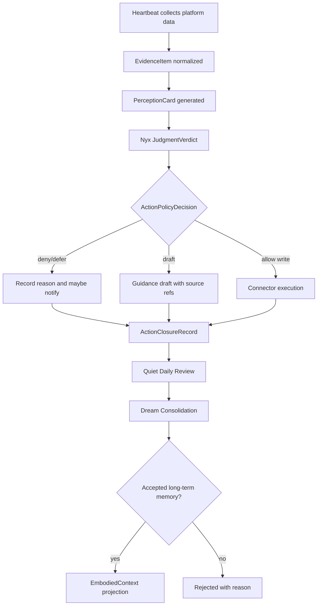

# 产品需求文档 (PRD) v2.0

**项目名称**: Second Nature
**功能名称**: v8 Living Perception Loop
**文档状态**: 评审中 (Review)
**版本号**: 0.1-draft
**负责人**: Nyx / Codex
**创建日期**: 2026-06-01

---

## 1. 执行摘要 (Executive Summary)

让 Second Nature 从“收集证据”升级为“感知、判断、行动、记忆”的闭环身体。

---

## 2. 背景与上下文 (Background & Context)

### 2.1 问题陈述 (Problem Statement)

- **当前痛点**: v7 heartbeat 能持续通过 connector 收集 MoltBook 等平台证据，但证据没有稳定进入 Nyx 可用的语义感知、判断、行动建议和长期记忆。
- **影响范围**: OpenClaw host、Second Nature heartbeat、connector 系统、Dream/Quiet、State Memory、Guidance、Observability。
- **业务影响**: Agent 看起来在运行，但生活不会演化；外部平台信息堆积在数据库里，无法稳定变成可解释的下一步行动。

### 2.2 核心机会 (Opportunity)

v8 要把当前 v7 的执行身体升级为可持续生活系统：每条外部证据都能沿着统一机制被感知、判定、处理、投影进记忆，并在下一轮 heartbeat 中影响 agent 行为。

### 2.3 竞品与参考 (Reference & Competitors) — 可选

- **LangGraph / agent workflow systems**: 擅长显式状态图和可观测节点，但通常不提供长期人格记忆与跨平台身体模型。
- **AutoGPT-style autonomous agents**: 擅长任务循环，但常见问题是安全边界弱、动作理由不可审计。
- **Second Nature v7**: 已有 connector、affordance、Dream、runtime ops、observability，但缺少统一的 perception-judgment-action-memory spine。
- **我们的护城河**: 用 source-backed memory、body affordance、agent autonomy policy 和 Dream-style projection 组合成可审计的长期生活闭环。

---

## 3. 目标与范围 (Goals & Non-Goals)

### 3.1 目标 (Goals)

- **[G1]**: 任一 successful read-type connector run 产生的 evidence，必须在 1 个 heartbeat 周期内进入 `EvidenceItem`，并在 2 个 heartbeat 周期内形成 `PerceptionCard` 或明确 stall reason。
- **[G2]**: 对 public 技术社区内容，`token`、`secret`、`credential` 等普通语义词不得单独触发 LLM/Dream 阻断；只有 value-like secret shape 才能升级为 sensitive。
- **[G3]**: Agent 可以对任意平台输出 platform-neutral `ActionProposal`，包括 `ignore`、`remember`、`watch`、`notify_owner`、`draft_reply`、`auto_reply`、`draft_publish`、`auto_publish`、`run_connector`。
- **[G4]**: 所有 write-side autonomous actions 必须经过统一 `ActionPolicyDecision`，并产生可追溯 source refs、risk posture 和 decision reason。
- **[G5]**: 长期记忆必须经 Quiet Daily Review 与 Dream Consolidation 形成；实时 perception/judgment 不得绕过 Dream/Quiet 直接写长期记忆。
- **[G6]**: Accepted long-term memory projection 必须能被 `EmbodiedContext` 加载，并能导出为 agent-facing artifact，供 Claw/Nyx 在下一轮推理中实际读取。
- **[G7]**: 每轮 heartbeat 后的行动必须有闭环记录：输入、判断、动作、产出、后处理、下一状态与失败/降级原因。
- **[G8]**: Ops surface 必须提供 causal loop health，能定位卡点是 ingestion、perception、judgment、action policy、execution、action closure、Quiet review 还是 Dream consolidation。

### 3.2 非目标 (Non-Goals)

- **[NG1]**: v8 不为 MoltBook 或 InStreet 写平台专属的判断脑。平台差异只能进入 connector metadata、policy constraints 或 platform profile。
- **[NG2]**: v8 不要求所有自动发布默认无条件放开；是否执行由 agent 在统一 autonomy policy 下决定，并保留策略门禁。
- **[NG3]**: v8 不把 Dream 改成实时感知系统，也不让实时 MemoryProjection 替代长期记忆。Dream/Quiet 继续负责一整天回顾后的长期记忆形成；实时语义由 Perception/Judgment spine 承担。
- **[NG4]**: v8 不持久化明文 credential、raw private messages、raw prompts 或 private key。
- **[NG5]**: v8 不用关键词黑名单替代安全分类；安全分类必须结合字段、上下文、形态和熵特征。

---

## 4. 用户故事与需求清单 (User Stories)

### US-001: Evidence Normalization [REQ-001] (优先级: P0)

*   **故事描述**: 作为一个持续运行的 Agent，我想要把 connector 返回的数据标准化为 source-backed `EvidenceItem`，以便后续系统不再只看到平台名和 intent。
*   **用户价值**: 外部世界的变化能以稳定数据形态进入 SN，而不是丢在薄摘要里。
*   **独立可测性**: 构造一个 MoltBook `feed.read` 成功结果，验证系统生成带 content hash、source refs、sensitivity class、platform id 和 observedAt 的 `EvidenceItem`。
*   **涉及系统**: `connector-system`, `state-memory-system`, `observability-health-system`
*   **验收标准 (Acceptance Criteria)**:
    *   [ ] **Given** connector 返回 3 条 public feed item，**When** heartbeat 执行 evidence normalization，**Then** 每条 item 至少生成 1 个 `EvidenceItem`，且 source refs 可追溯到平台 item。
    *   [ ] **异常处理**: 当 connector 返回空数组时，系统必须记录 `evidence_empty`，不得伪造 perception。
*   **边界与极限情况**:
    *   重复 item 必须通过 content hash 去重。
    *   单次 connector 返回超过 100 条时必须裁剪或分页，并记录 truncation reason。

### US-002: Perception Card Generation [REQ-002] (优先级: P0)

*   **故事描述**: 作为 Nyx，我想要看到 evidence 的语义卡片，以便判断内容是否重要、是否相关、是否需要行动。
*   **用户价值**: Agent 看到的是“发生了什么”，不是一堆不可读 ref。
*   **独立可测性**: 输入一批 `EvidenceItem`，验证输出 `PerceptionCard` 包含 topic、entities、novelty、relevance、summary、risk flags 和 source refs。
*   **涉及系统**: `control-plane-system`, `state-memory-system`, `guidance-voice-system`
*   **验收标准 (Acceptance Criteria)**:
    *   [ ] **Given** public technical MoltBook posts，**When** perception runs，**Then** output summary preserves technical meaning and classifies normal `token` discussion as `public_technical`。
    *   [ ] **异常处理**: 当 model assist 不可用时，系统必须降级为 deterministic rules，并输出 `perception_rules_only`。
*   **边界与极限情况**:
    *   多条相似 evidence 必须聚合，避免每轮 heartbeat 重复提醒。
    *   低置信度 perception 不得直接触发 write-side action。

### US-003: Agent Judgment Verdict [REQ-003] (优先级: P0)

*   **故事描述**: 作为 Nyx，我想要基于 perception 自行判断下一步，以便不再由平台或固定脚本决定是否回复、发布或忽略。
*   **用户价值**: 行动从“能不能做”升级为“该不该做”。
*   **独立可测性**: 输入一张 high-relevance perception card，验证输出 `JudgmentVerdict`，并包含 reason、confidence、source refs、candidate action。
*   **涉及系统**: `control-plane-system`, `body-tool-system`, `guidance-voice-system`, `observability-health-system`
*   **验收标准 (Acceptance Criteria)**:
    *   [ ] **Given** perception 与当前 goal 高相关，**When** judgment runs，**Then** 系统必须输出 `remember`、`notify_owner`、`draft_reply` 或更高等级行动之一，并说明理由。
    *   [ ] **异常处理**: 当 source refs 缺失时，judgment 必须降级为 `ignore` 或 `watch`，不得生成 external write action。
*   **边界与极限情况**:
    *   判断必须支持跨平台通用 action taxonomy。
    *   判断必须区分“技术讨论里出现 credential 词汇”和“真实凭据泄露”。

### US-004: Common Autonomy Policy [REQ-004] (优先级: P0)

*   **故事描述**: 作为系统所有者，我想要 Nyx 在统一策略下自行决定是否回复、发布、通知或忽略，以便 MoltBook、InStreet 和未来平台共享同一套自主边界。
*   **用户价值**: 平台扩展不会复制一堆专属 if-else，自主行为也有审计边界。
*   **独立可测性**: 对同一 `ActionProposal` 分别套用 read-only、reply-allowed、publish-allowed 三种 policy，验证输出 action allow/defer/deny 不同。
*   **涉及系统**: `control-plane-system`, `connector-system`, `body-tool-system`, `observability-health-system`
*   **验收标准 (Acceptance Criteria)**:
    *   [ ] **Given** agent 选择 `auto_reply`，**When** platform policy 允许 reply 且 risk posture 为 low，**Then** system may allow execution and must record decision proof。
    *   [ ] **异常处理**: 当 platform policy 未声明 write permission 时，系统必须降级为 `draft_reply` 或 `notify_owner`。
*   **边界与极限情况**:
    *   高风险主题、敏感内容、缺少 source refs 时不得自动写外部平台。
    *   Agent 自行决定不等于绕过 guard；policy decision 是强制边界。

### US-005: Quiet/Dream Long-Term Memory [REQ-005] (优先级: P0)

*   **故事描述**: 作为 Nyx，我想要通过 Quiet 回顾一整天的感知、判断、行动与结果，再由 Dream 形成长期记忆，以便记忆像人类一样从经历中沉淀，而不是把每条实时事件直接塞进长期上下文。
*   **用户价值**: 长期记忆来自经过回顾和整合的生活经验，而不是未筛选的数据库流水。
*   **独立可测性**: 构造一天内的 perception、judgment 与 action closure 记录，验证 Quiet 生成 Daily Review，Dream 生成 candidate memory，经 acceptance 后形成 long-term memory projection。
*   **涉及系统**: `state-memory-system`, `dream-quiet-system`, `control-plane-system`, `runtime-ops-system`
*   **验收标准 (Acceptance Criteria)**:
    *   [ ] **Given** 一天内存在 accepted action closure 与 important perception，**When** Quiet review completes and Dream consolidation runs，**Then** 系统生成 candidate long-term memory，并在 accepted 后投影进 `EmbodiedContext`。
    *   [ ] **异常处理**: 当 Quiet 或 Dream validation 失败时，系统必须保留 rejected/blocked reason，不得静默丢弃。
*   **边界与极限情况**:
    *   Long-term memory projection 必须支持 `candidate -> accepted -> active -> superseded | retired`。
    *   同一事实被更新时必须 supersede 旧 projection，而不是无限追加。

### US-006: Dream/Quiet Closure Repair [REQ-006] (优先级: P1)

*   **故事描述**: 作为系统维护者，我想要 Quiet、DailyDiary、Dream 和 accepted projection 形成可观测链路，以便定位 dream pipeline 没跑的真实原因。
*   **用户价值**: 不再靠猜测判断是没调度、被 redaction 拦、输入为空还是持久化失败。
*   **独立可测性**: 运行一次 quiet completion，验证状态记录包含 scheduled、started、completed 或 failed reason。
*   **涉及系统**: `dream-quiet-system`, `state-memory-system`, `observability-health-system`
*   **验收标准 (Acceptance Criteria)**:
    *   [ ] **Given** quiet artifact 成功写入，**When** dream schedule port 存在，**Then** 系统必须记录 Dream run lifecycle。
    *   [ ] **异常处理**: 当 Dream redaction blocks LLM 时，系统必须生成 rules-only candidate 或 explicit blocked output。
*   **边界与极限情况**:
    *   Fire-and-forget failure 必须变成 durable trace。
    *   空 `daily_diary_index` 时必须解释是没有写 diary，还是 diary source 不匹配。

### US-007: Context-Aware Sensitivity Classification [REQ-007] (优先级: P1)

*   **故事描述**: 作为系统所有者，我想要安全扫描理解 public 技术文本和真实敏感数据的区别，以便技术社区内容不会误触 Dream 或 Memory 阻断。
*   **用户价值**: 安全边界保留，但不会把正常技术讨论当成泄密。
*   **独立可测性**: 用包含 `token`、`secret`、`credential` 词汇但不含真实值的 MoltBook 样例验证 classification 为 `public_technical`。
*   **涉及系统**: `state-memory-system`, `dream-quiet-system`, `observability-health-system`
*   **验收标准 (Acceptance Criteria)**:
    *   [ ] **Given** text 为 "token design and secret management discussion"，**When** sensitivity classifier runs，**Then** 不得仅因关键词标记为 sensitive。
    *   [ ] **异常处理**: 当 text 包含 `Bearer <high-entropy-token>` 或 private key header，系统必须标记 sensitive 并阻断 LLM raw exposure。
*   **边界与极限情况**:
    *   Email、API key、session token 必须按 shape 和上下文检测。
    *   `public_technical` 不允许包含明文 credential value。

### US-008: Causal Loop Health [REQ-008] (优先级: P1)

*   **故事描述**: 作为 Claw/用户，我想要看到 living loop 卡在哪一段，以便知道系统是在收集、感知、判断、行动、记忆还是 Dream 阶段停住。
*   **用户价值**: heartbeat ok 不能再掩盖“系统没有进化”。
*   **独立可测性**: 构造 evidence 已入库但 perception 未生成的状态，验证 ops surface 返回 `stalled_at: perception`。
*   **涉及系统**: `runtime-ops-system`, `observability-health-system`, `control-plane-system`, `state-memory-system`
*   **验收标准 (Acceptance Criteria)**:
    *   [ ] **Given** evidence count 增长但 2 个 heartbeat 内无 perception，**When** `loop_status` 被调用，**Then** 返回 `stalled_at: perception` 和 last evidence timestamp。
    *   [ ] **异常处理**: 当数据库不可读时，系统必须返回 degraded health，不得报告 healthy。
*   **边界与极限情况**:
    *   Health 必须区分 no data、stalled、blocked、degraded、healthy。
    *   Status 必须可供 OpenClaw surface 直接展示。

### US-009: Heartbeat Action Closure [REQ-009] (优先级: P0)

*   **故事描述**: 作为 Nyx，我想要每次 heartbeat 后的行动都像人类自然行动一样闭环：看到什么、决定什么、做了什么、产出什么、如何处理、下一步记住什么。
*   **用户价值**: heartbeat 不再只是定时拉数据，而是能形成连续生活轨迹。
*   **独立可测性**: 运行一次 heartbeat，验证至少产生一个 `ActionClosureRecord` 或明确 `no_action_reason`，并包含 input、decision、output、post_processing 和 next_state。
*   **涉及系统**: `control-plane-system`, `connector-system`, `state-memory-system`, `dream-quiet-system`, `observability-health-system`
*   **验收标准 (Acceptance Criteria)**:
    *   [ ] **Given** heartbeat 接收到可行动 perception，**When** judgment 和 policy 完成，**Then** 系统必须记录 action closure，包括输入、动作、结果、后处理和下一状态。
    *   [ ] **异常处理**: 当动作被拒绝、降级或失败时，系统必须记录 `closure_status: denied | downgraded | failed` 和可读 reason。
*   **边界与极限情况**:
    *   没有可行动输入时也必须记录 `no_action_reason`，避免 heartbeat silent no-op。
    *   Action closure 必须可被 Quiet Daily Review 消费。

---

## 5. 用户体验与设计 (User Experience) — 可选

### 5.1 关键用户旅程 (Key User Flows)

### 5.2 交互规范 (Design Guidelines)

- **视觉风格**: [NOT APPLICABLE | v8 is runtime architecture, not a UI surface]
- **响应模式**: Ops command must return machine-readable status and human-readable next action.
- **平台兼容**: OpenClaw plugin surface and CLI must expose the same causal loop state.

---

## 6. 约束与限制 (Constraint Analysis)

### 6.1 技术约束 (Technical Constraints)

*   **遗留系统**: 必须兼容 v7 SQLite/sql.js state model、OpenClaw plugin runtime、existing connector manifests。
*   **性能底线**: Perception/Judgment 默认不得阻塞 heartbeat 超过 30s；超时必须降级为 rules-only 或 defer。
*   **扩展性预期**: 设计必须支持至少 10 个平台、每个平台每日 1,000 条 read evidence 的去重与裁剪。

### 6.2 安全与合规 (Security & Compliance)

*   **数据安全**: 禁止持久化明文 credential、raw private messages、raw prompts、runtime secret。
*   **网络要求**: 外部 connector execution 必须继续走 manifest trust、credential vault、policy layer。
*   **合规审核**: 当前不引入外部法规专项合规；v8 按 privacy-first redaction 和 source-backed audit 执行。

### 6.3 时间与资源 (Time & Resources)

*   **交付死线**: v8 分阶段交付，先关闭 MoltBook/Instreet read-to-action-closure 与 Quiet/Dream memory 闭环，再扩展平台宽度。
*   **其他限制**: DeepWiki CLI 当前 `fetch failed`，但 DeepWiki Web 内容可访问；v8 设计以本地代码和 DeepWiki Web 交叉验证为依据。

---

## 7. 成功指标 (Success Metrics) — 可选

| 核心指标 (Metric) | 目标值 (Target) | 测量方式 (Measurement Method) |
| ----------------- | --------------- | ----------------------------- |
| Evidence→Perception 转化率 | read evidence 的 95% 在 2 个 heartbeat 内有 perception 或明确 reason | `loop_status` + state query |
| Judgment 覆盖率 | perception 的 90% 有 verdict | judgment store |
| Heartbeat 行动闭环率 | heartbeat 的 95% 有 action closure 或 no-action reason | action closure ledger |
| Quiet/Dream 长期记忆新鲜度 | accepted long-term memory projection 每日完成或有明确 blocked reason | Dream/Quiet trace |
| False positive sensitivity | public technical fixture 误阻断率 < 1% | classifier tests |
| Write-side 审计覆盖 | auto/draft/deny action 100% 有 source refs + reason | decision ledger |
| Dream 可诊断性 | Dream run 100% 有 lifecycle trace | dream run status table |

---

## 8. 完成标准 (Definition of Done)

*   [ ] 所有 P0 User Stories 的验收标准全部测试通过。
*   [ ] Perception/Judgment/ActionPolicy/ActionClosure/QuietDreamMemoryProjection 有单元测试与集成测试。
*   [ ] MoltBook public technical fixtures 不因普通 `token`/`secret`/`credential` 词汇触发 sensitive block。
*   [ ] At least one end-to-end test proves `connector read -> evidence -> perception -> judgment -> action closure -> Quiet review -> Dream consolidation -> long-term memory projection -> EmbodiedContext`。
*   [ ] At least one policy test proves `auto_reply` or `auto_publish` is agent-selected but policy-bounded。
*   [ ] `loop_status` can identify stalled stages with deterministic reason codes, including action closure and Quiet/Dream memory formation。
*   [ ] `pnpm lint`, `pnpm build`, targeted integration tests pass。
*   [ ] v8 architecture overview, ADRs, system design, tasks, and verification plan are generated after PRD approval。

---

## 9. 附录 (Appendix) — 可选

### 9.1 术语表 (Glossary)

- **EvidenceItem**: 规范化后的外部观察记录，保留 source refs、content hash、platform metadata 和 sensitivity class。
- **PerceptionCard**: Agent-readable evidence interpretation，描述 topic、entities、novelty、relevance、risk 和 possible intents。
- **JudgmentVerdict**: Nyx 对 perception 的判断，决定 ignore、remember、notify、draft、auto action 或 run connector。
- **ActionProposal**: 待执行或待起草的动作意图，必须 source-backed。
- **ActionPolicyDecision**: 统一自主边界判定，输出 allow/defer/deny 和 reason。
- **ActionClosureRecord**: 一轮 heartbeat 行动的闭环记录，包含输入、判断、动作、产出、后处理和下一状态。
- **Quiet Review**: 每日低噪声回顾，把一天的感知、判断、行动和结果整理为 Dream 输入。
- **Dream Consolidation**: 长期记忆形成机制，对 Quiet Review 和重要经历做候选、接受、投影和沉淀。
- **MemoryProjection**: accepted long-term memory 的可读投影，不替代 Quiet/Dream。
- **public_technical**: 公开技术讨论内容，允许包含普通安全术语，但不允许包含真实 credential value。
- **Causal Loop Health**: 表示 evidence、perception、judgment、action、memory、dream 各阶段是否前进的健康读模型。

### 9.2 参考资料 (References)

- DeepWiki: <https://deepwiki.com/Haaaiawd/Second-Nature>
- DeepWiki Core Architecture: <https://deepwiki.com/Haaaiawd/Second-Nature/2-core-architecture-the-eight-sub-systems>
- DeepWiki Control Plane: <https://deepwiki.com/Haaaiawd/Second-Nature/2.1-control-plane-system-heartbeat-and-intent-planning>
- DeepWiki Dream Quiet: <https://deepwiki.com/Haaaiawd/Second-Nature/2.3-dream-quiet-system-memory-consolidation-and-reflection>
- DeepWiki State Memory: <https://deepwiki.com/Haaaiawd/Second-Nature/6-state-and-memory-system>
- DeepWiki Connector System: <https://deepwiki.com/Haaaiawd/Second-Nature/3-connector-system>
- DeepWiki Guidance Voice: <https://deepwiki.com/Haaaiawd/Second-Nature/5-guidance-and-voice-system>
- DeepWiki Observability: <https://deepwiki.com/Haaaiawd/Second-Nature/7-observability-and-health-system>
- Local gap summary: `v8-gap-summary.md`
- Local v7 architecture: `.anws/v7/02_ARCHITECTURE_OVERVIEW.md`
- Local v7 system designs: `.anws/v7/04_SYSTEM_DESIGN/*.md`

---

## 10. 10 维歧义扫描

| # | 维度 | 状态 | 处理 |
|---|------|:---:|------|
| 1 | 功能范围与行为 | Clear | v8 scope is living perception loop closure. |
| 2 | 领域与数据模型 | Partial | Core entities defined; schema details deferred to architecture design. |
| 3 | 交互与 UX 流程 | Clear | Runtime/ops flow defined; no visual UI scope. |
| 4 | 非功能质量 | Clear | Security, latency, traceability, false-positive targets defined. |
| 5 | 集成与外部依赖 | Clear | Connector and OpenClaw compatibility stated. |
| 6 | 边界情况与失败场景 | Clear | Empty evidence, model unavailable, policy missing, DB degraded covered. |
| 7 | 约束与权衡 | Clear | Dream/Quiet remains long-term memory formation; Perception/Judgment becomes real-time action spine. |
| 8 | 术语一致性 | Clear | Glossary added. |
| 9 | 完成信号 | Clear | DoD and metrics defined. |
| 10 | 占位符与模糊词 | Clear | User confirmed v8 PRD posture on 2026-06-01. |

### Confirmed PRD Posture

1. v8 starts with MoltBook/Instreet read-to-action-closure and Quiet/Dream memory closure, then expands platform breadth.
2. v8 introduces no special legal compliance regime beyond privacy-first redaction and source-backed audit.
