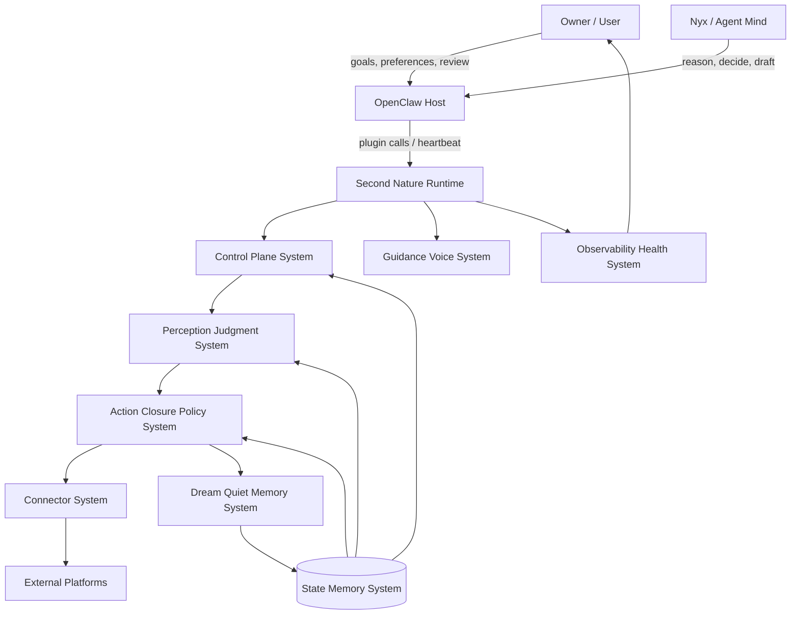
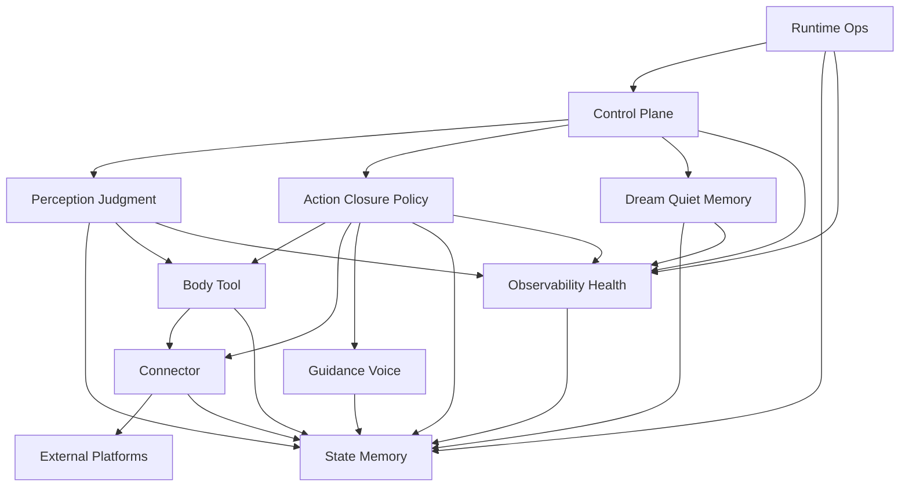

# 系统架构总览 (Architecture Overview) v8

**项目**: Second Nature
**架构版本**: v8.0
**日期**: 2026-06-01
**状态**: Genesis draft / PRD confirmed
**前序版本**: `.anws/v7`

---

## 1. 系统上下文 (System Context)

Second Nature v8 保留 v7 的身体模型，但修正主闭环：heartbeat 不再只收集 evidence，而必须把输入推进为感知、判断、行动闭环、Quiet 日回顾、Dream 长期记忆和下一轮可读投影。

### 1.1 C4 Level 1 - 系统上下文图



### 1.2 关键用户 (Key Users)

- **Nyx / Agent Mind**: 需要看到感知、判断、行动闭环与长期记忆投影。
- **Owner / User**: 设置方向，允许 agent 自主行动，同时需要审计和回滚。
- **OpenClaw Host**: 承载插件、heartbeat、ops 命令和 agent-facing context。
- **Operator / Maintainer**: 验证 connector、credential、plugin package、state health 和 loop health。

### 1.3 外部系统 (External Systems)

- **OpenClaw Host**: 插件加载、工具调用、cron/heartbeat、channel/runtime 环境。
- **LLM Runtime**: Nyx 的开放头脑；Second Nature 提供 source-backed context 与护栏。
- **Connector Platforms**: MoltBook、InStreet、EvoMap、Agent World、娱乐平台与未来平台。
- **Local Workspace**: `.second-nature/` artifacts、SQLite/sql.js state、Markdown/JSON 文档。

---

## 2. 系统清单 (System Inventory)

### System 1: Runtime Ops System

**系统ID**: `runtime-ops-system`

**职责 (Responsibility)**:
- OpenClaw plugin、CLI、manual run、heartbeat ops surface。
- 暴露 `loop_status`、heartbeat run、connector run、Dream/Quiet status、restore 和 package diagnostics。
- 保持 JSON-first response，不拥有语义判断。

**边界 (Boundary)**:
- **输入**: plugin tool call、CLI command、workspaceRoot、env、channel hint。
- **输出**: ops envelope、runtime response、diagnostic reason code。
- **依赖**: `control-plane-system`, `state-memory-system`, `observability-health-system`

**关联需求**: [REQ-006], [REQ-008], [REQ-009]

**技术栈**:
- TypeScript / Node.js
- OpenClaw native plugin
- JSON-first command surface

**源码根目录**: `plugin/`, `src/cli/`

**仓库内物理结构 (ASCII)**:

```text
plugin/
  index.ts
  workspace-ops-bridge.ts
src/cli/
  commands/
  ops/
```

**设计文档**: `04_SYSTEM_DESIGN/runtime-ops-system.md`

---

### System 2: Control Plane System

**系统ID**: `control-plane-system`

**职责 (Responsibility)**:
- heartbeat 主循环、节律、EmbodiedContext assembly、跨系统编排。
- 从 judged proposals 和 policy results 推进下一步，而不是直接从 raw evidence 决策。
- 保证每轮 heartbeat 有 closure 或 no-action reason。

**边界 (Boundary)**:
- **输入**: heartbeat signal、accepted goals、EmbodiedContext、loop health。
- **输出**: cycle trace、perception request、action closure request、Quiet/Dream trigger。
- **依赖**: `state-memory-system`, `perception-judgment-system`, `action-closure-policy-system`, `dream-quiet-memory-system`, `observability-health-system`

**关联需求**: [REQ-002], [REQ-003], [REQ-004], [REQ-008], [REQ-009]

**技术栈**:
- TypeScript orchestration modules
- deterministic guards

**源码根目录**: `src/core/second-nature/heartbeat/`, `src/core/second-nature/orchestrator/`

**仓库内物理结构 (ASCII)**:

```text
src/core/second-nature/
  heartbeat/
  orchestrator/
```

**设计文档**: `04_SYSTEM_DESIGN/control-plane-system.md`

---

### System 3: Perception Judgment System

**系统ID**: `perception-judgment-system`

**职责 (Responsibility)**:
- 把 `EvidenceItem` 转成 `PerceptionCard`。
- 让 Nyx 基于 perception 产生 `JudgmentVerdict`，包括 ignore、watch、remember candidate、notify、draft、reply、publish、run_connector。
- 区分 public technical vocabulary 与真实 credential shape。

**边界 (Boundary)**:
- **输入**: EvidenceItem、goals、accepted memory projection、tool affordance。
- **输出**: PerceptionCard、JudgmentVerdict、risk flags、source-backed reason。
- **依赖**: `state-memory-system`, `body-tool-system`, `observability-health-system`, optional ModelAssistPort

**关联需求**: [REQ-001], [REQ-002], [REQ-003], [REQ-007]

**技术栈**:
- TypeScript rules-first classification
- optional ModelAssistPort for summarization/judgment assist

**源码根目录**: `src/core/second-nature/perception/`, `src/core/second-nature/judgment/` (新增)

**仓库内物理结构 (ASCII)**:

```text
src/core/second-nature/
  perception/
  judgment/
```

**设计文档**: `04_SYSTEM_DESIGN/perception-judgment-system.md`

---

### System 4: Action Closure Policy System

**系统ID**: `action-closure-policy-system`

**职责 (Responsibility)**:
- 对所有平台共用 `ActionPolicyDecision`。
- 将 agent 自主决定裁决为 allow、defer、downgrade、deny。
- 记录 `ActionClosureRecord`: input、decision、action、output、post_processing、next_state。

**边界 (Boundary)**:
- **输入**: JudgmentVerdict、ActionProposal、platform policy、affordance、risk posture。
- **输出**: ActionPolicyDecision、execution request、draft/notify output、ActionClosureRecord。
- **依赖**: `body-tool-system`, `connector-system`, `guidance-voice-system`, `state-memory-system`, `observability-health-system`

**关联需求**: [REQ-003], [REQ-004], [REQ-009]

**技术栈**:
- TypeScript policy evaluator
- append-only closure ledger

**源码根目录**: `src/core/second-nature/action/` (新增), `src/core/second-nature/policy/` (新增)

**仓库内物理结构 (ASCII)**:

```text
src/core/second-nature/
  action/
  policy/
```

**设计文档**: `04_SYSTEM_DESIGN/action-closure-policy-system.md`

---

### System 5: State Memory System

**系统ID**: `state-memory-system`

**职责 (Responsibility)**:
- 持久化 EvidenceItem、PerceptionCard、JudgmentVerdict、ActionClosureRecord、Quiet Review、DreamOutput、long-term memory projection。
- 提供 bounded read models 给 heartbeat、perception、Dream、ops。
- 执行 redaction/write validation，不持久化明文 credential 或 raw private content。

**边界 (Boundary)**:
- **输入**: state write request、source-backed artifacts、projection lifecycle mutations。
- **输出**: read models、bounded snapshots、projection rows、restore points。
- **依赖**: SQLite/sql.js, Markdown/JSON workspace artifacts, `observability-health-system`

**关联需求**: [REQ-001], [REQ-005], [REQ-006], [REQ-007], [REQ-008], [REQ-009]

**技术栈**:
- SQLite/sql.js
- Markdown/JSON artifacts
- TypeScript stores

**源码根目录**: `src/storage/`

**仓库内物理结构 (ASCII)**:

```text
src/storage/
  db/
  life-evidence/
  services/
  state/
```

**设计文档**: `04_SYSTEM_DESIGN/state-memory-system.md`

---

### System 6: Body Tool System

**系统ID**: `body-tool-system`

**职责 (Responsibility)**:
- 维护 ToolAffordance、ToolExperience、CircuitBreaker。
- 回答“能不能做、做起来疼不疼”，不回答“该不该做”。

**边界 (Boundary)**:
- **输入**: connector inventory、execution result、probe result、policy denial、owner feedback。
- **输出**: affordance map、experience row、breaker posture、pain signal。
- **依赖**: `connector-system`, `state-memory-system`, `observability-health-system`

**关联需求**: [REQ-003], [REQ-004], [REQ-009]

**技术栈**:
- TypeScript read models and services

**源码根目录**: `src/core/second-nature/body/`, `src/connectors/base/`

**仓库内物理结构 (ASCII)**:

```text
src/core/second-nature/body/
  tool-affordance/
  tool-experience/
src/connectors/base/
```

**设计文档**: `04_SYSTEM_DESIGN/body-tool-system.md`

---

### System 7: Connector System

**系统ID**: `connector-system`

**职责 (Responsibility)**:
- 执行 manifest-defined platform capabilities。
- 将 read results 交给 Evidence normalization，不在 connector 层做语义判断。
- 执行 write-side actions only after ActionPolicyDecision allows。

**边界 (Boundary)**:
- **输入**: capability request、payload、credential context、policy decision。
- **输出**: ConnectorResult、source refs、telemetry、structured unavailable reason。
- **依赖**: external platform APIs, `state-memory-system`, `observability-health-system`

**关联需求**: [REQ-001], [REQ-004], [REQ-009]

**技术栈**:
- TypeScript adapters
- declarative HTTP runner
- scriptable runner
- manifest validation

**源码根目录**: `src/connectors/`

**仓库内物理结构 (ASCII)**:

```text
src/connectors/
  base/
  social-community/
  agent-network/
```

**设计文档**: `04_SYSTEM_DESIGN/connector-system.md`

---

### System 8: Dream Quiet Memory System

**系统ID**: `dream-quiet-memory-system`

**职责 (Responsibility)**:
- Quiet Daily Review 聚合一天的感知、判断、行动闭环和结果。
- Dream Consolidation 从 daily review 中形成 candidate long-term memory。
- 维护 accepted long-term memory projection，供 EmbodiedContext 加载。

**边界 (Boundary)**:
- **输入**: ActionClosureRecord、important PerceptionCard、ToolExperience、RelationshipMemory、DailyDiary。
- **输出**: Quiet Review、DreamOutput、accepted long-term memory projection、DreamTrace。
- **依赖**: `state-memory-system`, `observability-health-system`, optional ModelAssistPort

**关联需求**: [REQ-005], [REQ-006], [REQ-009]

**技术栈**:
- TypeScript async pipeline
- rules-first consolidation
- optional ModelAssistPort

**源码根目录**: `src/dream/`, `src/core/second-nature/quiet/`

**仓库内物理结构 (ASCII)**:

```text
src/dream/
  dream-engine.ts
  dream-scheduler.ts
src/core/second-nature/quiet/
```

**设计文档**: `04_SYSTEM_DESIGN/dream-quiet-memory-system.md`

---

### System 9: Guidance Voice System

**系统ID**: `guidance-voice-system`

**职责 (Responsibility)**:
- 根据 ActionProposal 生成 source-backed draft、notify copy、reply/publish text。
- 只负责表达，不拥有外部投递权。

**边界 (Boundary)**:
- **输入**: ActionProposal、JudgmentVerdict、relationship context、channel feedback。
- **输出**: draft message、explanation snippet、style validation result。
- **依赖**: `state-memory-system`, `perception-judgment-system`, optional ModelAssistPort

**关联需求**: [REQ-003], [REQ-004], [REQ-009]

**技术栈**:
- TypeScript guidance services
- optional LLM-assisted drafting

**源码根目录**: `src/guidance/`

**仓库内物理结构 (ASCII)**:

```text
src/guidance/
  evidence/
  outreach/
  review/
```

**设计文档**: `04_SYSTEM_DESIGN/guidance-voice-system.md`

---

### System 10: Observability Health System

**系统ID**: `observability-health-system`

**职责 (Responsibility)**:
- 提供 causal loop health：ingestion、perception、judgment、policy、execution、closure、Quiet、Dream、projection。
- 统一 audit、redaction、trace、self-health、digest。
- 让 `heartbeat ok` 不再掩盖生活不演化。

**边界 (Boundary)**:
- **输入**: trace events、audit envelopes、health probes、closure events、Dream lifecycle events。
- **输出**: loop_status、self health report、digest、timeline、redacted audit row。
- **依赖**: `state-memory-system`, host probes

**关联需求**: [REQ-006], [REQ-007], [REQ-008], [REQ-009]

**技术栈**:
- TypeScript audit services
- append-only audit store
- redaction policy

**源码根目录**: `src/observability/`

**仓库内物理结构 (ASCII)**:

```text
src/observability/
  audit/
  read-models/
  services/
```

**设计文档**: `04_SYSTEM_DESIGN/observability-health-system.md`

---

## 3. 系统边界矩阵 (System Boundary Matrix)

| 系统 | 输入 | 输出 | 依赖系统 | 被依赖系统 | 关联需求 |
|---|---|---|---|---|---|
| `runtime-ops-system` | plugin/CLI/env/workspace | ops envelope/reason code | control/state/observability | Host/Owner | [REQ-006], [REQ-008], [REQ-009] |
| `control-plane-system` | heartbeat/context/goals | cycle trace/requests | state/perception/action/dream/observability | runtime | [REQ-002], [REQ-003], [REQ-004], [REQ-008], [REQ-009] |
| `perception-judgment-system` | EvidenceItem/goals/memory/affordance | PerceptionCard/JudgmentVerdict | state/body/observability | control/action/guidance | [REQ-001], [REQ-002], [REQ-003], [REQ-007] |
| `action-closure-policy-system` | verdict/proposal/policy/risk | decision/closure/execution request | body/connector/guidance/state/observability | control/dream | [REQ-003], [REQ-004], [REQ-009] |
| `state-memory-system` | writes/artifacts/projections | read models/snapshots | storage/observability | all systems | [REQ-001], [REQ-005], [REQ-006], [REQ-007], [REQ-008], [REQ-009] |
| `body-tool-system` | inventory/results/probes | affordance/experience/breaker | connector/state/observability | perception/action/control | [REQ-003], [REQ-004], [REQ-009] |
| `connector-system` | capability request/payload/credential | ConnectorResult/source refs | external APIs/state/observability | body/action/control | [REQ-001], [REQ-004], [REQ-009] |
| `dream-quiet-memory-system` | closures/perceptions/diary/experience | review/DreamOutput/projection | state/observability/model assist | control/state | [REQ-005], [REQ-006], [REQ-009] |
| `guidance-voice-system` | proposal/verdict/relationship/channel | draft/explanation/style result | state/perception/model assist | action/runtime | [REQ-003], [REQ-004], [REQ-009] |
| `observability-health-system` | traces/audit/probes/events | loop_status/health/digest | state/host probes | all systems | [REQ-006], [REQ-007], [REQ-008], [REQ-009] |

---

## 4. 系统依赖图 (System Dependency Graph)



**依赖关系说明**:
- `control-plane-system` 编排 heartbeat，但不做语义判断。
- `perception-judgment-system` 是 agent 判断层，不执行外部动作。
- `action-closure-policy-system` 是自主边界和闭环账本，不生成长期记忆。
- `dream-quiet-memory-system` 是长期记忆形成边界。
- `connector-system` 是手脚执行边界，不决定是否应该行动。

---

## 5. 技术栈总览 (Technology Stack Overview)

| Layer | Technology | Used By |
|---|---|---|
| Runtime | Node.js + TypeScript + OpenClaw plugin | runtime-ops-system |
| State | SQLite/sql.js + Markdown/JSON artifacts | state-memory-system |
| Orchestration | TypeScript deterministic cycle runner | control-plane-system |
| Perception/Judgment | Rules-first TypeScript + optional ModelAssistPort | perception-judgment-system |
| Policy/Closure | TypeScript policy evaluator + append-only ledger | action-closure-policy-system |
| Connectors | Manifest adapters + declarative HTTP + script runner | connector-system |
| Long-term Memory | Quiet/Dream pipeline + accepted projection lifecycle | dream-quiet-memory-system |
| Observability | Audit hash chain + redaction + loop_status read model | observability-health-system |

**Step 3 技术评估结论**:
- 采用 v7 存量 TypeScript / Node / OpenClaw plugin 栈内演进。
- 不引入外部 workflow engine；当前瓶颈是语义断点，不是流程调度能力。
- 不外置 daemon；会扩大凭据、部署与 host surface。

---

## 6. 拆分原则与理由 (Decomposition Rationale)

### 为什么拆分为这些系统？

**用户触点维度**:
- `runtime-ops-system` 承接 CLI、plugin 和 host surface。

**核心逻辑维度**:
- `control-plane-system` 只做节律编排。
- `perception-judgment-system` 承担“看到什么、意味着什么、该不该关心”。
- `action-closure-policy-system` 承担“是否允许做、做完如何闭环”。

**数据存储维度**:
- `state-memory-system` 统一 schema、read model、projection、restore。

**外部集成维度**:
- `connector-system` 保持平台 API、credential、trust、idempotency 执行边界。

**长期记忆维度**:
- `dream-quiet-memory-system` 单独承接每日回顾与 Dream 长期记忆，不让实时感知直接污染长期记忆。

### 为什么不进一步拆分？

- `perception-judgment-system` 暂不拆成 perception 与 judgment 两个系统：二者共享 source refs、risk flags 和 ModelAssistPort，先作为一个语义层更简单。
- `action-closure-policy-system` 暂不拆成 policy 与 closure：二者共同定义“行动是否完成”，拆开会制造重复状态。
- `dream-quiet-memory-system` 暂不拆成 dream 与 quiet：长期记忆形成必须把 daily review 与 Dream candidate/accepted 生命周期放在同一边界内。

### 为什么不继续合并？

- 不把 perception/judgment 合并进 control-plane：否则 heartbeat 会重新变成大脑。
- 不把 action policy 合并进 connector：手脚不能决定该不该做事。
- 不把 memory projection 合并进 state-memory：state 存储事实，Dream/Quiet 决定长期记忆语义。

---

## 7. 系统复杂度评估 (Complexity Assessment)

**系统数量**: 10 个系统。

**评估**:
- 数量达到上限，但 v8 是重大架构升级，新增的两个核心系统对应真实断点：语义判断与行动闭环。
- 依赖方向可控：runtime/control 触发，perception 判断，action 闭环，Dream/Quiet 形成长期记忆，state 持久化，observability 解释。
- 没有未解释依赖环。

**潜在风险**:
- `perception-judgment-system` 可能变成“半个 LLM brain”；设计时必须保持 source-backed、bounded、可降级。
- `action-closure-policy-system` 可能过度复杂；必须优先实现最小 action taxonomy 和 closure ledger。
- 系统数较多；后续 design-system 必须按接口收敛，不能每个系统都发明新数据模型。

---

## 8. 项目结构 (Physical Project Tree)

```text
plugin/
├── index.ts
├── workspace-ops-bridge.ts
├── openclaw.plugin.json
└── package.json

src/
├── cli/
│   ├── commands/
│   └── ops/
├── core/
│   └── second-nature/
│       ├── heartbeat/
│       ├── orchestrator/
│       ├── perception/      # v8 new
│       ├── judgment/        # v8 new
│       ├── action/          # v8 new
│       ├── policy/          # v8 new
│       ├── quiet/
│       └── body/
├── connectors/
├── dream/
├── guidance/
├── storage/
├── observability/
└── shared/

.anws/
└── v8/
    ├── 00_MANIFEST.md
    ├── 00_DEEPWIKI_MECHANISM_AUDIT.md
    ├── 01_PRD.md
    ├── 02_ARCHITECTURE_OVERVIEW.md
    ├── 03_ADR/
    ├── 04_SYSTEM_DESIGN/
    ├── 06_CHANGELOG.md
    └── concept_model.json
```

---

## 9. 下一步行动 (Next Steps)

### `/genesis` Step 5

写入 v8 ADR：

```text
ADR_001_TECH_STACK.md
ADR_002_LIVING_PERCEPTION_LOOP.md
ADR_003_QUIET_DREAM_LONG_TERM_MEMORY.md
ADR_004_PLATFORM_NEUTRAL_AUTONOMY_POLICY.md
ADR_005_CAUSAL_LOOP_HEALTH.md
```

### `/design-system`

Genesis 完成后，为新增和变更系统创建详细设计：

```text
/design-system perception-judgment-system
/design-system action-closure-policy-system
/design-system dream-quiet-memory-system
/design-system observability-health-system
```

### `/blueprint`

全部系统设计完成并通过 `/challenge` 后运行 `/blueprint`。
