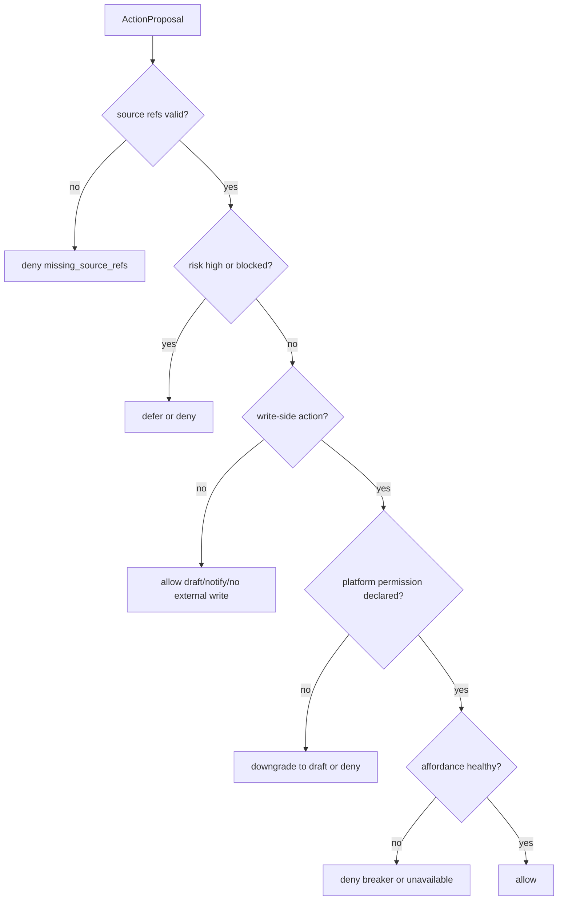
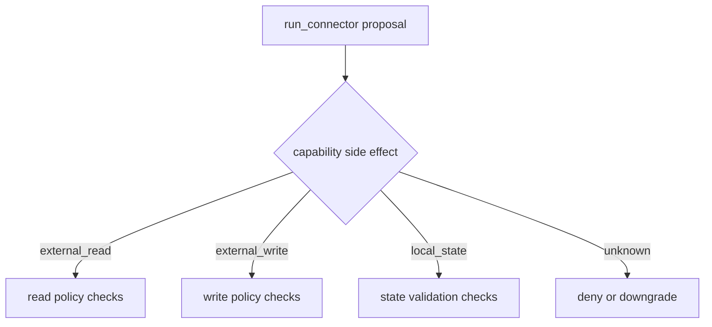
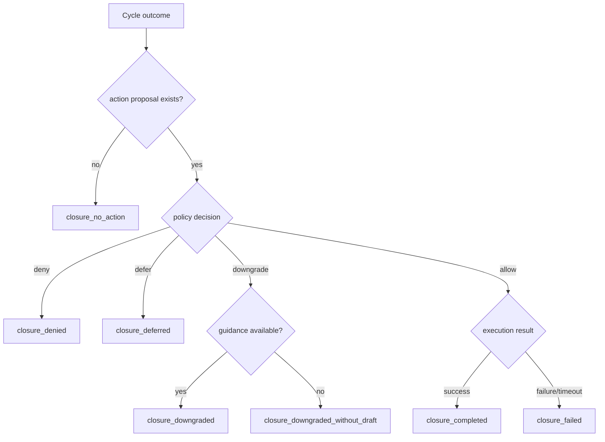

# Action Closure Policy System — 实现细节 (L1)

> **文件性质**: L1 实现层 · **对应 L0**: [action-closure-policy-system.md](./action-closure-policy-system.md)
> 本文件只定义接口、枚举、reason code、决策表和测试 fixture 形状；不写具体实现代码。

---

## 版本历史

| 版本 | 日期 | Changelog |
| --- | --- | --- |
| v1.1 | 2026-06-01 | CH-07 修复：T-AC dispatch 定义 guidance-unavailable 降级闭环，不再要求 guidance 才能完成 S3 closure。 |
| v1.0 | 2026-06-01 | 初始 L1：补 policy 输入、closure ledger 字段、降级规则、测试矩阵。 |

## 本文件章节索引

| § | 章节 | 对应 L0 入口 |
| :---: | --- | :---: |
| §1 | [配置常量](#1-配置常量-config-constants) | L0 §6 |
| §2 | [核心数据结构完整定义](#2-核心数据结构完整定义-full-data-structures) | L0 §6 |
| §3 | [操作契约细化](#3-操作契约细化-operation-contract-details) | L0 §5 |
| §4 | [决策树详细逻辑](#4-决策树详细逻辑-decision-tree-details) | L0 §4 |
| §5 | [边缘情况与注意事项](#5-边缘情况与注意事项-edge-cases--gotchas) | L0 §5 / §9 |
| §6 | [测试辅助](#6-测试辅助-test-helpers) | L0 §11 |

---

## §1 配置常量 (Config Constants)

### §1.1 Policy Defaults

| 名称 | 默认值 | 说明 |
| --- | --- | --- |
| `AUTO_WRITE_MIN_RISK` | `low` | 只有 low risk 可自动写外部平台。 |
| `OWNER_ATTENTION_ACTIONS` | `notify_owner`, `draft_reply`, `draft_publish` | 这些动作必须有 source refs 和 reason。 |
| `WRITE_SIDE_ACTIONS` | `auto_reply`, `auto_publish` plus `run_connector` only when capability side effect is `external_write` | 必须经过 allow decision。 |
| `DEFAULT_CONNECTOR_TIMEOUT_MS` | inherited from connector | action 层只记录 timeout，不硬编码 runner。 |

### §1.2 Reason Codes

| 类别 | Reason codes |
| --- | --- |
| proposal | `proposal_created`, `proposal_no_action`, `proposal_missing_source_refs`, `proposal_risk_blocked` |
| policy | `policy_allowed`, `policy_deferred_owner_confirmation`, `policy_downgraded_to_draft`, `policy_denied_missing_permission`, `policy_denied_high_risk`, `policy_denied_breaker_open` |
| execution | `execution_completed`, `execution_failed`, `execution_timeout`, `execution_unavailable`, `guidance_unavailable` |
| closure | `closure_completed`, `closure_no_action`, `closure_denied`, `closure_deferred`, `closure_downgraded`, `closure_downgraded_without_draft`, `closure_failed` |

### §1.3 Shared Contracts

`PlatformNeutralActionKind`, action side-effect classification, `SourceRef`, `MemoryReviewCandidateClosure`, and cross-system reason codes are defined in [shared-v8-contracts.md](./shared-v8-contracts.md). This system owns policy evaluation but not the action taxonomy itself.

## §2 核心数据结构完整定义 (Full Data Structures)

### §2.1 Request / Result Types

```ts
interface BuildActionProposalRequest {
  cycleId: string;
  judgmentVerdictId: string;
  now: string;
}

interface PolicyEvaluationRequest {
  cycleId: string;
  proposalId: string;
  platformProfileRef?: string;
  ownerPreferenceRefs: string[];
  now: string;
}

interface ActionClosureRequest {
  cycleId: string;
  proposalId?: string;
  decisionId?: string;
  executionResultRef?: string;
  draftOutputRef?: string;
  degradedDispatchReason?: V8ReasonCode;
  noActionReason?: string;
  now: string;
}
```

### §2.2 Entity Field Contracts

```ts
interface ActionProposal {
  id: string;
  cycleId: string;
  judgmentVerdictId: string;
  actionKind: PlatformNeutralActionKind;
  targetPlatformId?: string;
  targetCapabilityId?: string;
  sourceRefs: SourceRef[];
  reason: string;
  riskPosture: RiskPosture;
  expectedOutput: string;
  sideEffectClass: "none" | "local_state" | "owner_attention" | "external_read" | "external_write" | "capability_declared";
  idempotencyKey: string;
  createdAt: string;
}

interface ActionPolicyDecision {
  id: string;
  proposalId: string;
  decision: "allow" | "defer" | "downgrade" | "deny";
  decisionReason: string;
  autonomyLevel: "none" | "draft_only" | "owner_confirm" | "auto_allowed";
  downgradedActionKind?: PlatformNeutralActionKind;
  proofRefs: SourceRef[];
  decidedAt: string;
}

interface GuidanceUnavailableDispatchResult {
  id: string;
  cycleId: string;
  decisionId: string;
  status: "skipped";
  reason: "guidance_unavailable";
  downgradedActionKind: PlatformNeutralActionKind;
  sourceRefs: SourceRef[];
  createdAt: string;
}

interface ActionClosureRecord {
  id: string;
  cycleId: string;
  proposalId?: string;
  decisionId?: string;
  idempotencyKey?: string;
  retryOfClosureId?: string;
  dispatchAttempt: number;
  closureStatus: "completed" | "no_action" | "denied" | "deferred" | "downgraded" | "failed";
  inputSummary: string;
  outputSummary?: string;
  postProcessing: string[];
  nextState: string;
  reason: string;
  sourceRefs: SourceRef[];
  memoryReviewCandidate?: MemoryReviewCandidateClosure;
  closedAt: string;
}
```

### §2.3 Invariants

| 编号 | Invariant |
| --- | --- |
| AC-I1 | `WRITE_SIDE_ACTIONS` 不得在缺少 `ActionPolicyDecision.decision=allow` 时 dispatch。 |
| AC-I2 | `downgrade` 必须指定 `downgradedActionKind`。 |
| AC-I3 | 每个 heartbeat cycle 至少有一个 `ActionClosureRecord` 或 `closure_no_action`。 |
| AC-I4 | connector failure、timeout、policy deny 都必须写 closure。 |
| AC-I5 | guidance 不可用不得阻塞 closure；downgrade 路径必须返回可闭环的 `guidance_unavailable` dispatch result。 |

## §3 操作契约细化 (Operation Contract Details)

### §3.1 buildActionProposal

| 输入 verdict | 输出 |
| --- | --- |
| `ignore` / `watch` | no-action proposal result + reason |
| `remember` | writes `closureStatus=completed` with `memoryReviewCandidate.closureSubtype=remember_for_review`; does not write long-term memory |
| `notify_owner` / `draft_*` / `auto_*` | `ActionProposal` with source refs, risk posture, expected output |
| `run_connector` | `ActionProposal` with target capability and idempotency key |

### §3.2 evaluateActionPolicy

| 条件 | Decision |
| --- | --- |
| source refs missing for owner/write action | `deny`, reason `policy_denied_missing_source_refs` |
| platform profile lacks write permission | `downgrade` to draft or `deny` |
| risk posture high/blocked | `deny` or `defer` owner confirmation |
| circuit breaker open | `deny`, reason `policy_denied_breaker_open` |
| low risk + permission + affordance healthy | `allow` |

### §3.3 dispatchAllowedAction

| Decision | Dispatch target |
| --- | --- |
| `allow` + `run_connector` | `connector-system` with policy proof |
| `allow` + `run_connector` + `capabilitySideEffect=external_read` | `connector-system` with read proof and source-backed reason |
| `allow` + `run_connector` + `capabilitySideEffect=external_write` | `connector-system` with write permission, idempotency key, and policy proof |
| `allow` + `auto_reply` / `auto_publish` | `guidance-voice-system` generates text, then connector executes with proof |
| `downgrade` to draft/notify + guidance available | `guidance-voice-system` only; no external platform write |
| `downgrade` to draft/notify + guidance unavailable | no guidance dependency; return local dispatch result with reason `guidance_unavailable` for closure |
| `defer` / `deny` | no external dispatch |

### §3.4 recordActionClosure

| Closure source | Required fields |
| --- | --- |
| no-action | `cycleId`, `closureStatus=no_action`, `reason`, `nextState` |
| remember-for-review | `memoryReviewCandidate`, `sourceRefs`, `perceptionRef`, `judgmentVerdictId`, `topicKey`, `reviewPriority` |
| deny/defer | `decisionId`, `decisionReason`, `postProcessing`, `nextState` |
| connector success | `executionResultRef`, `outputSummary`, `sourceRefs`, `nextState` |
| connector failure | `executionResultRef`, failure reason, retry/defer posture |
| downgrade draft | `draftOutputRef`, output summary, owner-visible next state |
| downgrade guidance unavailable | `decisionId`, `degradedDispatchReason=guidance_unavailable`, `closure reason=closure_downgraded_without_draft`, owner-visible next state |

#### Retry and duplicate closure semantics

| Scenario | Required behavior |
| --- | --- |
| same `idempotencyKey` retry before external result | update or append an attempt row with `retryOfClosureId`, but do not create a second external write request. |
| same `idempotencyKey` after completed external write | return prior `closureStatus=completed` read model; do not dispatch again. |
| same `idempotencyKey` after failed retryable execution | create a new closure attempt linked by `retryOfClosureId`; preserve original failure reason. |
| same `idempotencyKey` with different action payload hash | block as idempotency conflict and write `closure_failed` with no external dispatch. |
| no idempotency key for external write | policy must deny before dispatch; closure records `policy_denied_missing_permission` or equivalent proof failure. |

## §4 决策树详细逻辑 (Decision Tree Details)

### §4.1 Policy Decision Tree



### §4.1a Connector Side-Effect Resolution



### §4.2 Closure Decision Tree



## §5 边缘情况与注意事项 (Edge Cases & Gotchas)

| 场景 | 风险 | 处理方式 |
| --- | --- | --- |
| auto action text generated but connector fails | draft 被误认为已发送 | closure status 必须是 `failed`，outputSummary 标明未投递。 |
| downgrade 后 guidance 不可用 | 闭环丢失 | 不阻塞 S3；写 `closure_downgraded_without_draft`，nextState 指向 owner-visible pending state，后续 T-GVS.C.1 可补 draft。 |
| downgrade 后 draft 生成失败 | 草稿被误认为可用 | 写 `closure_failed`，reason 指向 guidance failure。 |
| policy allow 后重复 dispatch | 外部重复写 | idempotency key 必须传给 connector。 |
| no actionable input | silent no-op | 写 `closure_no_action`。 |
| `remember` closure | 绕过 Quiet/Dream | 只能写 `remember_for_review`，由 Quiet 消费。 |

## §6 测试辅助 (Test Helpers)

| Fixture | 用途 |
| --- | --- |
| `lowRiskReplyAllowedProposal` | 验证 allow。 |
| `missingPermissionAutoPublishProposal` | 验证 downgrade/deny。 |
| `breakerOpenConnectorProposal` | 验证 deny breaker open。 |
| `guidanceUnavailableDowngradeDecision` | 验证 downgrade without draft 仍可 closure。 |
| `noActionCycle` | 验证 closure_no_action。 |
