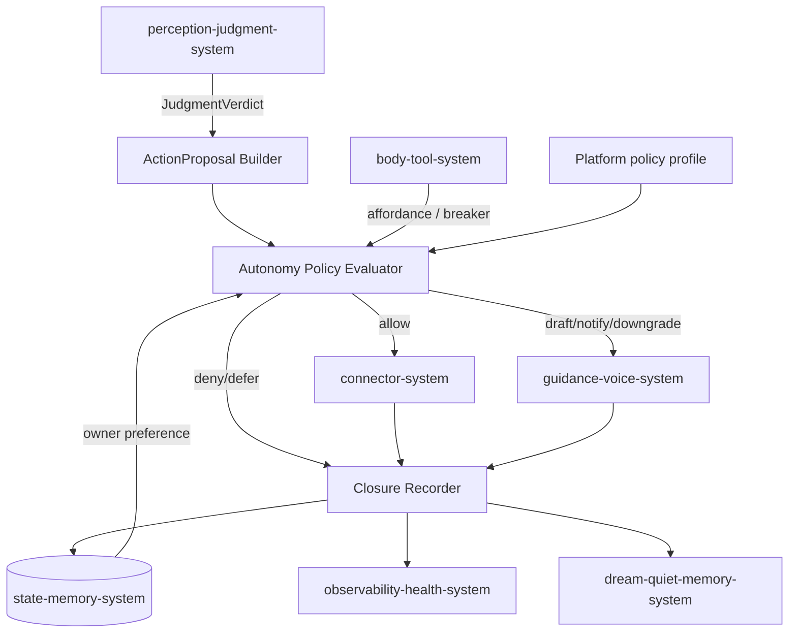
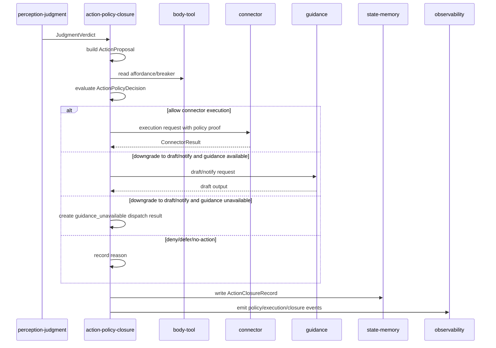
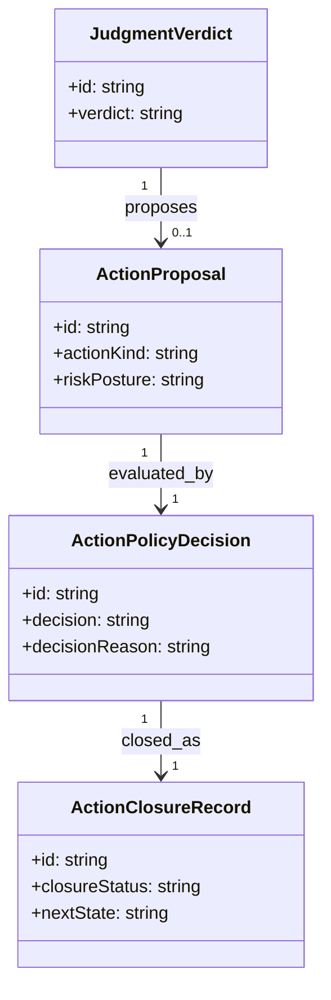
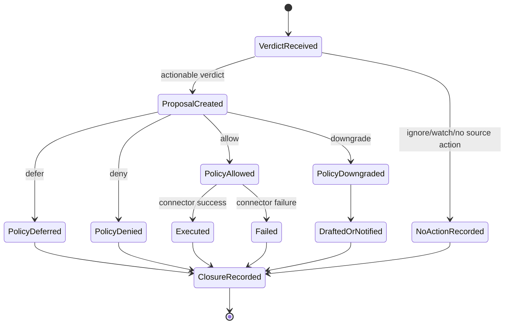

# Action Closure Policy System 系统设计文档 (L0)

| 字段 | 值 |
| --- | --- |
| **System ID** | `action-closure-policy-system` |
| **Project** | Second Nature |
| **Version** | v8.0 |
| **Status** | `Draft` |
| **Author** | Nyx / Codex |
| **Date** | 2026-06-01 |
| **L1 Detail** | [action-closure-policy-system.detail.md](./action-closure-policy-system.detail.md) |

## 1. 概览 (Overview)

### 1.1 System Purpose

`action-closure-policy-system` 是 v8 自主行动边界和 heartbeat 闭环账本。它把 `JudgmentVerdict` 转为 platform-neutral `ActionProposal`，强制经过 `ActionPolicyDecision`，再记录 `ActionClosureRecord` 或 `no_action_reason`。

### 1.2 System Boundary

- **输入**: `JudgmentVerdict`、`ActionProposal`、platform policy、ToolAffordance、risk posture、owner preference、connector/guidance execution result；shared action/source-ref contracts 见 [shared-v8-contracts.md](./shared-v8-contracts.md)。
- **输出**: `ActionPolicyDecision`、execution request、draft/notify request、`ActionClosureRecord`、no-action reason。
- **依赖系统**: `body-tool-system`, `connector-system`, `guidance-voice-system`, `state-memory-system`, `observability-health-system`。
- **被依赖系统**: `control-plane-system`, `dream-quiet-memory-system`, `runtime-ops-system`, `observability-health-system`。

### 1.3 System Responsibilities

**负责**:
- 将 actionable judgment 标准化为 `ActionProposal`。[REQ-003], [REQ-004]
- 对所有 owner-attention 和 write-side action 生成 `ActionPolicyDecision`。[REQ-004]
- 将 allow/defer/downgrade/deny/fail/no-action 全部落为 `ActionClosureRecord`。[REQ-009]
- 保证 heartbeat 后总有 closure 或 no-action reason。

**不负责**:
- 不生成 judgment；由 `perception-judgment-system` 负责。
- 不决定 connector 能力是否存在；由 `body-tool-system` 和 `connector-system` 提供 affordance/capability。
- 不生成最终文案；由 `guidance-voice-system` 负责 draft/notify/reply/publish text。
- 不形成长期记忆；closure 只是 Quiet/Dream 的输入。

## 2. 目标与非目标 (Goals & Non-Goals)

### 2.1 Goals

- **[G1]**: 所有 write-side autonomous actions 必须有 `ActionPolicyDecision` 和 decision reason。[REQ-004]
- **[G2]**: 每轮 heartbeat 必须有 `ActionClosureRecord` 或 `no_action_reason`。[REQ-009]
- **[G3]**: `downgrade` 必须有明确降级目标，如 `auto_reply -> draft_reply` 或 `auto_publish -> draft_publish`。[REQ-004]
- **[G4]**: closure 必须可被 Quiet Daily Review 消费。[REQ-005], [REQ-009]

### 2.2 Non-Goals

- **[NG1]**: 不让平台专属规则决定 agent judgment。
- **[NG2]**: 不在 policy 层调用 raw platform API。
- **[NG3]**: 不把 denied/deferred 当作错误丢弃；它们是闭环事实。

## 3. 背景与上下文 (Background & Context)

### 3.1 Why This System?

PRD [REQ-004] 要求 agent 可对任意平台自主决定动作，但必须经过统一策略。PRD [REQ-009] 要求 heartbeat 后像人类自然行动一样闭环。本系统把自主性、安全和闭环放在同一个 contract 面。

### 3.2 Current State

v7 有 connector execution、guard、outreach 和 delivery fallback，但缺少统一的 `ActionProposal -> ActionPolicyDecision -> ActionClosureRecord` 链路。结果是 action 成败、降级、无动作原因难以被 Quiet/Dream 和 loop health 稳定消费。

### 3.3 Constraints

- **技术约束**: 继承 TypeScript runtime；通过 state ports 写 ledger。
- **安全约束**: 缺 source refs、高风险、平台未声明 write permission 时不得 auto write。
- **架构约束**: connector 是手脚执行边界，不决定“该不该做”；control-plane 是节律编排，不变成大脑。

## 4. 系统架构 (Architecture)

### 4.1 Architecture Diagram



### 4.2 Core Components

| Component | Responsibility | Notes |
| --- | --- | --- |
| `ActionProposalBuilder` | 从 verdict 生成 platform-neutral action proposal | 必须带 source refs 和 expected output |
| `AutonomyPolicyEvaluator` | 输出 allow/defer/downgrade/deny | 强制门禁 |
| `ExecutionDispatcherPort` | 对 allow 的 connector action 发出执行请求 | 不直接实现 connector |
| `DraftNotifyDispatcherPort` | 对 draft/notify 交给 guidance | 不拥有文案生成 |
| `ActionClosureRecorder` | 记录完整 closure 或 no-action reason | append-only 语义 |
| `ActionStageTraceEmitter` | 发出 policy/execution/closure stage events | 供 loop_status 消费 |

### 4.3 Data Flow



## 5. 接口设计 (Interface Design)

### 5.1 操作契约表

| 操作 | [REQ] | 前置条件 | 消耗/输入 | 产出/副作用 | 实现细节 |
| --- | :---: | --- | --- | --- | --- |
| `buildActionProposal(verdictId)` | [REQ-003], [REQ-004] | verdict exists; source refs present or no-action | JudgmentVerdict | `ActionProposal` or no-action reason | [L1 §3.1](./action-closure-policy-system.detail.md#31-buildactionproposal) |
| `evaluateActionPolicy(proposalId)` | [REQ-004] | proposal has action kind and risk posture | platform profile, affordance, owner preference | `ActionPolicyDecision` | [L1 §3.2](./action-closure-policy-system.detail.md#32-evaluateactionpolicy) |
| `dispatchAllowedAction(decisionId)` | [REQ-004], [REQ-009] | decision is allow or downgrade | decision proof, action payload | ConnectorResult, draft/notify output, or guidance-unavailable downgraded dispatch result | [L1 §3.3](./action-closure-policy-system.detail.md#33-dispatchallowedaction) |
| `recordActionClosure(cycleId)` | [REQ-009] | decision/output/no-action exists | input, decision, output, post-processing | writes `ActionClosureRecord` | [L1 §3.4](./action-closure-policy-system.detail.md#34-recordactionclosure) |
| `finalizeCycle(cycleId)` | [REQ-009] | cycle reached terminal branch or early exit | proposal, decision, dispatch output, no-action reason, degraded diagnostic | writes exactly one terminal closure/no-action record | Wave 116 `CycleFinalizer` contract |

### 5.2 跨系统接口协议

```ts
interface ActionClosurePolicyPort {
  buildProposal(input: BuildActionProposalRequest): Promise<ActionProposalResult>;
  evaluatePolicy(input: PolicyEvaluationRequest): Promise<ActionPolicyDecision>;
  closeAction(input: ActionClosureRequest): Promise<ActionClosureRecord>;
  finalizeCycle(input: CycleFinalizationRequest): Promise<ActionClosureRecord>;
}

interface ActionExecutionPort {
  executeConnectorAction(request: PolicyBoundConnectorRequest): Promise<ConnectorExecutionResult>;
  generateDraftOrNotify(request: PolicyBoundGuidanceRequest): Promise<GuidanceOutput | GuidanceUnavailableDispatchResult>;
}

interface GuidanceUnavailableDispatchResult {
  status: "skipped";
  reason: "guidance_unavailable";
  decisionId: string;
  downgradedActionKind: PlatformNeutralActionKind;
  sourceRefs: SourceRef[];
}
```

### 5.3 HTTP API 端点摘要

N/A - 本系统不暴露 HTTP API；ops 只读取其 ledger/health read model。

## 6. 数据模型 (Data Model)

### 6.1 核心实体

```ts
interface ActionProposal {
  id: string;
  cycleId: string;
  judgmentVerdictId: string;
  actionKind: PlatformNeutralActionKind;
  sourceRefs: SourceRef[];
  reason: string;
  riskPosture: "low" | "medium" | "high" | "blocked";
  expectedOutput: string;
  sideEffectClass: "none" | "local_state" | "owner_attention" | "external_read" | "external_write" | "capability_declared";
  createdAt: string;
}

interface ActionPolicyDecision {
  id: string;
  proposalId: string;
  decision: "allow" | "defer" | "downgrade" | "deny";
  decisionReason: string;
  autonomyLevel: "none" | "draft_only" | "owner_confirm" | "auto_allowed";
  downgradedActionKind?: PlatformNeutralActionKind;
  proofRefs: SourceRef[];
  decidedAt: string;
}

interface ActionClosureRecord {
  id: string;
  cycleId: string;
  proposalId?: string;
  decisionId?: string;
  closureStatus: "completed" | "no_action" | "denied" | "deferred" | "downgraded" | "failed";
  inputSummary: string;
  outputSummary?: string;
  postProcessing: string[];
  nextState: string;
  reason: string;
  sourceRefs: SourceRef[];
  proofRefs?: SourceRef[];
  traceRefs?: SourceRef[];
  memoryReviewCandidate?: MemoryReviewCandidateClosure;
  closedAt: string;
}
```

`CycleFinalizer` owns the exactly-one terminal closure invariant. Branch-local code may prepare proposal, policy, dispatch, no-action, or degraded facts, but must not independently decide that the cycle is complete.

### 6.1a CycleFinalizer protocol

| Protocol item | Contract |
| --- | --- |
| Idempotency key | `cycleId` is the finalizer idempotency key; retries for the same cycle return or reconcile the existing terminal closure. |
| Write order | Write `ActionClosureRecord` first, then emit the closure stage event; missing event is recoverable from the closure row. |
| Partial failure recovery | On the next cycle or `loop_status`, if a closure row exists without a closure event, emit/replay the event with `traceRefs`; if an event exists without a closure row, mark `closure_unavailable` and do not fabricate closure content. |
| Duplicate prevention | More than one terminal closure for the same `cycleId` is an idempotency conflict and must surface as `unsafe`. |
| Provenance | Real input evidence remains in `sourceRefs`; policy/setup/runtime proof goes to `proofRefs`; stage/audit diagnostics go to `traceRefs`. |

Affected payload migration list: `ActionClosureRecord`, `ActionPolicyDecision`, `GuidanceUnavailableDispatchResult`, `LoopStageEvent`, `RuntimeOpsEnvelope`, heartbeat cycle traces, and setup/tool visibility proofs.

### 6.2 实体关系图



### 6.3 状态机



## 7. 技术选型 (Technology Stack)

| Domain | Choice | Rationale |
| --- | --- | --- |
| Runtime | TypeScript / Node.js | 继承 ADR-001。 |
| Policy | deterministic evaluator | 安全边界必须可测、可解释。 |
| Ledger | append-only state write via state-memory | closure 是审计与 Quiet 输入。 |
| Execution | connector/guidance ports | 保持手脚和声音边界清晰。 |

## 8. Trade-offs & Alternatives

### 8.1 Platform-neutral autonomy policy

> **决策来源**: [ADR-004: Use Platform-Neutral Autonomy Policy](../03_ADR/ADR_004_PLATFORM_NEUTRAL_AUTONOMY_POLICY.md)
>
> 本系统实现统一 `ActionProposal` 与 `ActionPolicyDecision`，平台差异只作为 policy input。

### 8.2 Living loop closure

> **决策来源**: [ADR-002: Introduce the Living Perception Loop](../03_ADR/ADR_002_LIVING_PERCEPTION_LOOP.md)
>
> 本系统实现 action proposal、policy decision 与 action closure 段。

### 8.3 Policy 与 closure 是否拆系统

**Option A: policy 与 closure 分两个系统**
- **优点**: 单一职责更细。
- **缺点**: `deny/defer/no_action` 的闭环容易在系统间丢失。

**Option B: policy 与 closure 同系统 (Selected)**
- **优点**: “能否做”和“这轮如何收尾”在同一账本闭合。
- **缺点**: 本系统是关键安全边界，测试压力更高。

**Decision**: 选择 Option B；否则最容易重现 v7 的 silent no-op。

## 9. 安全性考虑 (Security Considerations)

| Risk | Severity | Mitigation |
| --- | :---: | --- |
| agent auto action 绕过 policy | Critical | 所有 owner-attention/write action 必须有 decision proof。 |
| 平台未声明 write permission 仍执行 | Critical | policy deny 或 downgrade to draft/notify。 |
| 缺 source refs 执行外部动作 | High | external write action requires non-empty source refs。 |
| connector 执行失败不入账 | High | failure still produces `ActionClosureRecord` with reason。 |

## 10. 性能考虑 (Performance Considerations)

- Policy evaluation 必须是 deterministic local operation，不依赖长模型调用。
- Connector execution 可异步或 bounded timeout；closure 记录必须写入 success/failure/deferred。
- No-action closure 是轻量路径，不能因没有 action 而跳过 ledger。

## 11. 测试策略 (Testing Strategy)

### 11.1 Unit Testing

- `auto_reply` 在 low risk + reply allowed + source refs 存在时 allow。
- `auto_publish` 在 platform profile 缺 write permission 时 downgrade 或 deny。
- 缺 source refs 时 external write action deny。
- no actionable perception 时写 `no_action_reason`。

### 11.2 Integration Testing

- `JudgmentVerdict -> ActionProposal -> ActionPolicyDecision -> ActionClosureRecord`。
- allow connector action 后 ConnectorResult 被写入 closure。
- downgrade draft 后 GuidanceOutput 被写入 closure。

### 11.3 Contract Verification Matrix

| 契约 | 风险级别 | 正常态验证 | 失败态验证 | 回归责任 |
| --- | --- | --- | --- | --- |
| `evaluateActionPolicy` | P0 | allowed reply produces proof | missing permission downgrades/denies | policy unit |
| `recordActionClosure` | P0 | success writes next state | deny/fail/defer still writes closure | closure integration |
| no-action closure | P0 | no actionable verdict writes reason | state write failure emits degraded event | heartbeat integration |

## 12. 部署与运维 (Deployment & Operations)

N/A - 内部 runtime 模块；`loop_status` 与 timeline 由 observability/runtime ops 暴露。

## 13. 未来考虑 (Future Considerations)

- 可扩展 owner confirmation workflow，但不得让 confirmation 替代 policy decision。
- 可引入 policy profile versioning，便于审计某次 decision 使用了哪版规则。

## 14. Appendix (附录)

### 14.1 Research

- [_research/action-closure-policy-system-research.md](./_research/action-closure-policy-system-research.md)
- [action-closure-policy-system.detail.md](./action-closure-policy-system.detail.md)
- [shared-v8-contracts.md](./shared-v8-contracts.md)

### 14.2 未决问题

无。
