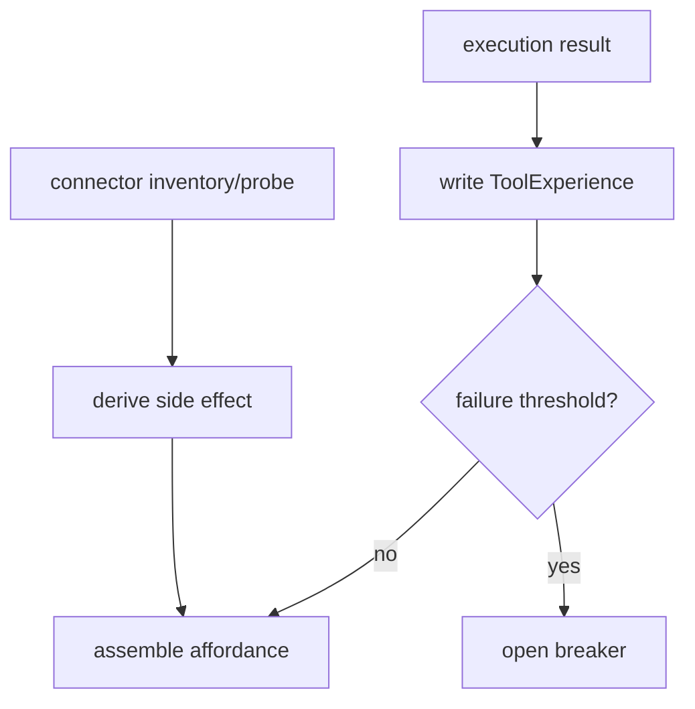

# Body Tool System 系统设计文档 (L0)

| 字段 | 值 |
| --- | --- |
| **System ID** | `body-tool-system` |
| **Project** | Second Nature |
| **Version** | v8.0 |
| **Status** | `Draft` |
| **Author** | Nyx / Codex |
| **Date** | 2026-06-01 |

## 1. 系统职责与非职责

`body-tool-system` 描述系统“能不能做”和“做起来是否可靠”。它向 perception/action 提供 affordance、experience 和 breaker posture，但不判断“该不该做”。

**负责**:
- 汇总 connector capability side effect、trust、auth、rate limit、breaker 状态。
- 记录 `ToolExperience`，形成成功率、失败类型、pain signal。
- 给 action policy 提供 capability posture。

**不负责**:
- 不决定 action allow/deny；这是 `action-closure-policy-system`。
- 不执行 connector；这是 `connector-system`。
- 不生成 perception/judgment 或长期记忆。

## 2. 输入/输出契约

| 方向 | 契约 |
| --- | --- |
| 输入 | connector manifest, capability probe result, execution result, owner feedback |
| 输出 | `ToolAffordance`, `ToolExperience`, `CircuitBreakerState`, capability side-effect class |
| 共享契约 | [shared-v8-contracts.md](./shared-v8-contracts.md) §1.2 |

```ts
interface ToolAffordance {
  connectorId: string;
  capabilityId: string;
  sideEffectClass: "external_read" | "external_write" | "local_state" | "unknown";
  authStatus: "ready" | "needs_auth" | "revoked" | "unknown";
  breakerStatus: "closed" | "open" | "half_open";
}
```

## 3. 核心数据模型

| 模型 | 说明 |
| --- | --- |
| `ToolAffordance` | 当前能力姿态，供 policy 判断输入。 |
| `ToolExperience` | 执行经验，供 Quiet/Dream 和 future affordance 使用。 |
| `CircuitBreakerState` | 防止重复失败和危险平台写。 |

## 4. 状态机/流程图



## 5. 依赖关系

| 依赖 | 用途 |
| --- | --- |
| `connector-system` | capability manifest, probe, execution result。 |
| `state-memory-system` | affordance and experience persistence。 |
| `observability-health-system` | breaker and probe diagnostics。 |

## 6. 错误/降级/安全边界

- Unknown side effect must be treated as `unknown`; policy must deny or downgrade.
- State unreadable returns degraded affordance and must not be treated as healthy.
- Breaker open blocks execution posture but does not make semantic judgment.
- External write capability must expose idempotency support or be denied by policy.

## 7. 测试策略

| 层级 | 覆盖 |
| --- | --- |
| 单元 | side-effect derivation, breaker transitions, unknown capability posture。 |
| API | affordance read model request/result shape。 |
| 集成 | connector result -> ToolExperience -> policy input。 |

## 8. Trade-offs

- **能力姿态独立于 policy**: 遵循 ADR-004，手脚报告状态，大脑和 policy 决定动作。
- **保守 unknown**: 减少错误外部写风险，代价是新 connector 需要声明更多 metadata。
- **breaker 作为 pain signal**: 保留 v7 身体经验价值，同时避免 connector 反复失败拖垮 heartbeat。

## 9. 未决问题

无
