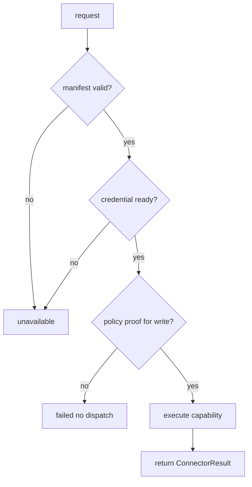

# Connector System 系统设计文档 (L0)

| 字段 | 值 |
| --- | --- |
| **System ID** | `connector-system` |
| **Project** | Second Nature |
| **Version** | v8.0 |
| **Status** | `Draft` |
| **Author** | Nyx / Codex |
| **Date** | 2026-06-01 |

## 1. 系统职责与非职责

`connector-system` 是平台执行边界。它执行 manifest-defined capability，返回 source-backed result；它是手脚，不是判断脑。

**负责**:
- 加载/校验 connector manifest、credential posture 和 capability metadata。
- 执行 read/write/local capability request。
- 返回 `ConnectorResult`、source refs、failure taxonomy 和 idempotency echo。
- 将 read result 交给 Evidence normalization。

**不负责**:
- 不决定“该不该做”。
- 不绕过 `ActionPolicyDecision` 执行外部写。
- 不生成 platform-specific agent brain。
- 不把 connector raw payload 直接写入长期记忆。

## 2. 输入/输出契约

| 方向 | 契约 |
| --- | --- |
| 输入 | `PolicyBoundConnectorRequest`, capability payload, credential context, idempotency key |
| 输出 | `ConnectorResult`, `SourceRef[]`, telemetry, structured unavailable reason |
| 共享契约 | action side-effect class, `SourceRef`, degraded response |

```ts
interface PolicyBoundConnectorRequest {
  connectorId: string;
  capabilityId: string;
  payloadRef: SourceRef;
  policyDecisionRef: SourceRef;
  idempotencyKey: string;
}

interface ConnectorResult {
  status: "success" | "failed" | "unavailable" | "timeout";
  sideEffectClass: "external_read" | "external_write" | "local_state" | "unknown";
  resultRefs: SourceRef[];
  failureReason?: V8ReasonCode;
  idempotencyKey?: string;
}
```

## 3. 核心数据模型

| 模型 | 说明 |
| --- | --- |
| `ConnectorManifest` | connector identity, capabilities, trust, credential needs。 |
| `CapabilityDescriptor` | side effect, input schema, output schema, idempotency support。 |
| `ConnectorResult` | execution truth; no semantic judgment。 |

## 4. 状态机/流程图



## 5. 依赖关系

| 依赖 | 用途 |
| --- | --- |
| external platform APIs | actual execution。 |
| `state-memory-system` | manifest cache, result refs, evidence handoff。 |
| `observability-health-system` | execution trace and failure diagnostics。 |

## 6. 错误/降级/安全边界

- External write without policy proof is rejected before platform call.
- Duplicate external write uses `idempotencyKey`; result echo lets closure dedupe attempts.
- Credential missing returns `execution_unavailable`, not platform-specific judgment.
- Connector may classify data shape, but cannot choose autonomous action.

## 7. 测试策略

| 层级 | 覆盖 |
| --- | --- |
| 单元 | manifest validation, side-effect metadata, idempotency echo。 |
| API | connector execution adapter request/result branches。 |
| 集成 | read fixture -> `EvidenceItem`; write proof -> connector result -> closure。 |

## 8. Trade-offs

- **Manifest adapters over platform brains**: 遵循 ADR-004，平台差异在 capability metadata，不在判断逻辑。
- **Policy proof required for writes**: 增加调用负担，但避免 connector 成为隐性 action policy。
- **Idempotency echo**: 修复 CH-10 下游 closure 去重需要，代价是所有 write capability 必须暴露 key 支持或被 deny。

## 9. 未决问题

无
