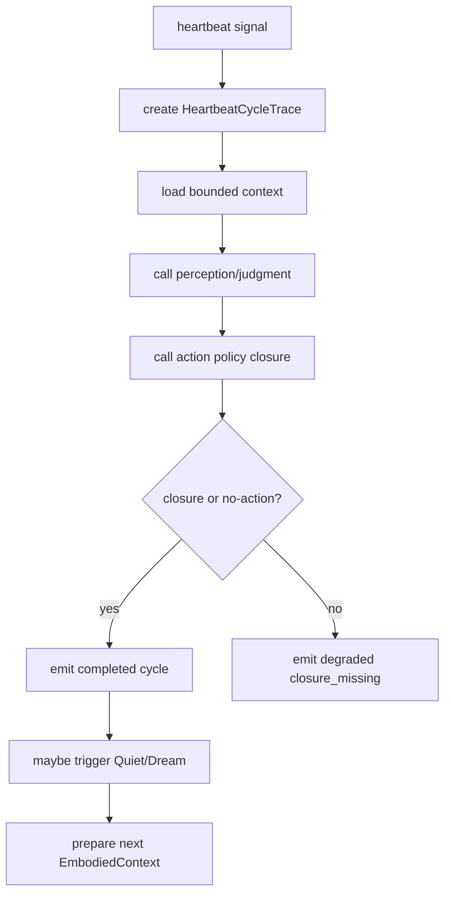

# Control Plane System 系统设计文档 (L0)

| 字段 | 值 |
| --- | --- |
| **System ID** | `control-plane-system` |
| **Project** | Second Nature |
| **Version** | v8.0 |
| **Status** | `Draft` |
| **Author** | Nyx / Codex |
| **Date** | 2026-06-01 |

## 1. 系统职责与非职责

`control-plane-system` 是 heartbeat 节律和跨系统编排层。它推进 `ingestion -> perception -> judgment -> policy -> execution -> closure -> Quiet/Dream -> projection`，但不拥有语义判断、行动许可或长期记忆语义。

**负责**:
- 创建 `HeartbeatCycleTrace`，分配单调递增 `cycleSequence`。
- 调用 perception/judgment/action closure/Dream-Quiet 的窄接口。
- 在下一轮 EmbodiedContext 中装载 accepted memory projection。
- 确保每轮 heartbeat 有 closure 或 no-action reason。

**不负责**:
- 不从 raw evidence 直接判断“该不该做”。
- 不绕过 `ActionPolicyDecision` 执行动作。
- 不写长期记忆；只加载 accepted projection。
- 不把 `loop_status` 诊断逻辑内置成大脑。

## 2. 输入/输出契约

| 方向 | 契约 |
| --- | --- |
| 输入 | heartbeat signal, workspaceRoot, accepted goals, bounded context, loop health snapshot |
| 输出 | `HeartbeatCycleTrace`, perception request, judgment/action requests, Quiet/Dream trigger, next EmbodiedContext slice |
| 共享契约 | [shared-v8-contracts.md](./shared-v8-contracts.md) §3.3 heartbeat rhythm, §4.1 degraded response |

```ts
interface HeartbeatOrchestrationRequest {
  workspaceRoot: string;
  requestedAt: string;
  trigger: "scheduled" | "manual" | "host";
}

interface HeartbeatOrchestrationResult {
  cycleId: string;
  cycleSequence: number;
  closureRef?: SourceRef;
  noActionReason?: V8ReasonCode;
  degraded?: DegradedOperationResult;
}
```

## 3. 核心数据模型

| 模型 | 说明 |
| --- | --- |
| `HeartbeatCycleTrace` | ordered cycle truth；heartbeat-count SLA 唯一依据。 |
| `EmbodiedContextSlice` | accepted goals, accepted projections, recent loop health, bounded tool affordance。 |
| `StageRequestEnvelope` | 给下游系统的请求包装，必须携带 `cycleId`, `cycleSequence`, `sourceRefs`。 |

## 4. 状态机/流程图



## 5. 依赖关系

| 依赖 | 用途 |
| --- | --- |
| `state-memory-system` | cycle trace, read models, projection read。 |
| `perception-judgment-system` | perception/judgment stage。 |
| `action-closure-policy-system` | policy, dispatch, closure stage。 |
| `dream-quiet-memory-system` | daily review and memory projection trigger。 |
| `observability-health-system` | stage event and loop health。 |

## 6. 错误/降级/安全边界

- State unreadable: return `DegradedOperationResult(reason=state_unreadable, ownerStage=ingestion)` and emit failed stage event.
- Downstream unavailable: do not synthesize judgment/action; write skipped/blocked stage event with canonical reason.
- Heartbeat-count SLA uses `cycleSequence`; wall-clock is display/freshness only.
- Control-plane never inspects raw credentials or private payload beyond bounded refs.

## 7. 测试策略

| 层级 | 覆盖 |
| --- | --- |
| 单元 | `cycleSequence` monotonic, `expectedDownstreamByCycle`, degraded envelope。 |
| 集成 | evidence -> perception/judgment request, action closure request, next context projection load。 |
| API/ops | manual heartbeat result includes cycle id, closure/no-action, degraded reason。 |

## 8. Trade-offs

- **编排而非大脑**: 遵循 ADR-002，control-plane 只排序和调用，不判断语义。
- **cycleSequence 优先**: 修复 CH-08；heartbeat-count SLA 不受 host 频率漂移影响。
- **窄端口调用**: 牺牲一点直接便利，换来 action/policy/memory 边界可审计。

## 9. 未决问题

无
