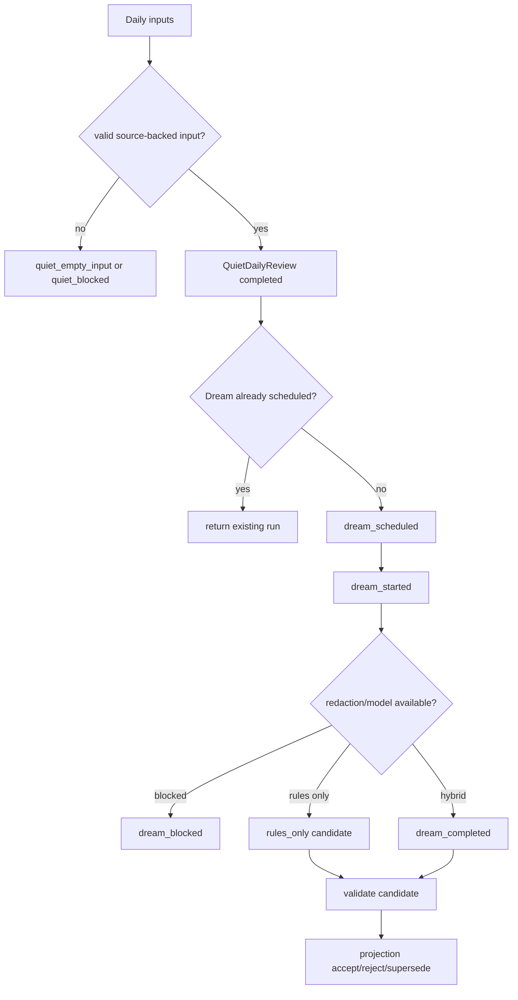
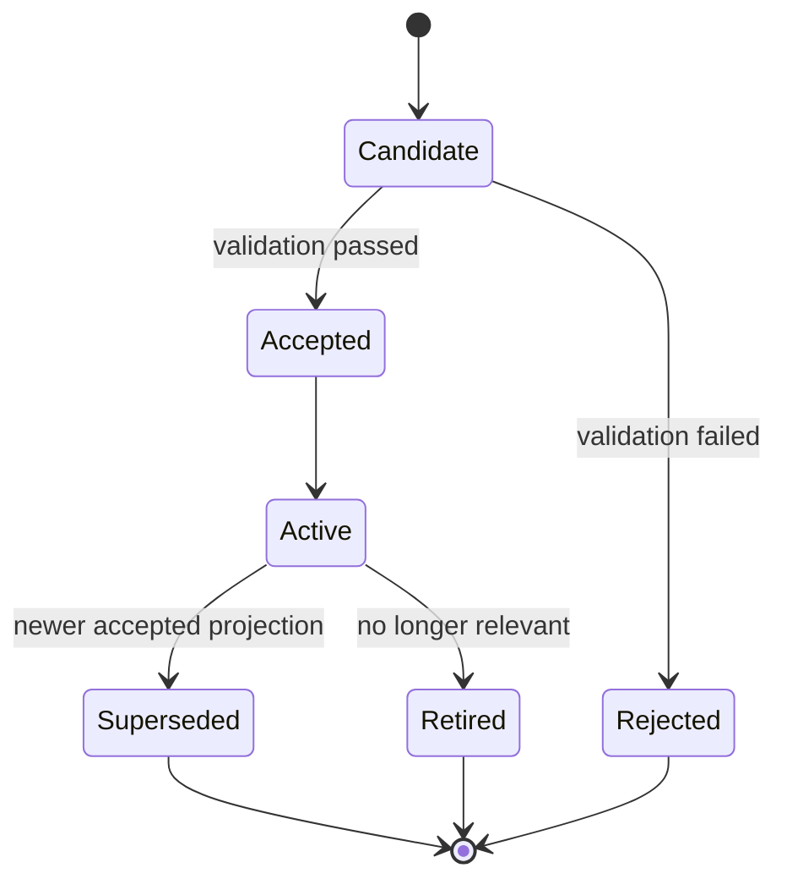

# Dream Quiet Memory System — 实现细节 (L1)

> **文件性质**: L1 实现层 · **对应 L0**: [dream-quiet-memory-system.md](./dream-quiet-memory-system.md)
> 本文件只定义接口、枚举、lifecycle、reason code 和测试 fixture 形状；不写具体实现代码。

---

## 版本历史

| 版本 | 日期 | Changelog |
| --- | --- | --- |
| v1.0 | 2026-06-01 | 初始 L1：补 Quiet/Dream/projection 接口、生命周期和失败语义。 |
| v1.1 | 2026-06-14 | Wave 109：补充 content-bearing Quiet review、Dream 7 天周期、stale scheduled 修复、UUID 误杀避免。 |

## 本文件章节索引

| § | 章节 | 对应 L0 入口 |
| :---: | --- | :---: |
| §1 | [配置常量](#1-配置常量-config-constants) | L0 §6 |
| §2 | [核心数据结构完整定义](#2-核心数据结构完整定义-full-data-structures) | L0 §6 |
| §3 | [操作契约细化](#3-操作契约细化-operation-contract-details) | L0 §5 |
| §4 | [决策树详细逻辑](#4-决策树详细逻辑-decision-tree-details) | L0 §4 |
| §5 | [边缘情况与注意事项](#5-边缘情况与注意事项-edge-cases--gotchas) | L0 §5 / §9 |
| §6 | [测试辅助](#6-测试辅助-test-helpers) | L0 §11 |

---

## §1 配置常量 (Config Constants)

### §1.1 Review / Dream Defaults

| 名称 | 默认值 | 说明 |
| --- | ---: | --- |
| `QUIET_REVIEW_LOOKBACK_DAYS` | 1 | 默认日回顾窗口。 |
| `QUIET_MAX_CLOSURES_PER_DAY` | 200 | 单次 review 最多消费 closure 数。 |
| `QUIET_MAX_PERCEPTIONS_PER_DAY` | 200 | 单次 review 最多消费 important perception 数。 |
| `QUIET_MAX_EVIDENCE_PER_DAY` | 200 | 单次 review 最多消费 evidence 数。 |
| `DREAM_MODEL_TIMEOUT_MS` | 15000 | Dream model assist 超时后 rules-only 或 blocked。 |
| `DREAM_DEFAULT_INTERVAL_DAYS` | 7 | Dream 默认最小间隔（参考 MiMo Code Dream/Distill 周期模型）。 |
| `PROJECTION_MAX_ACTIVE_PER_TOPIC` | 3 | 同主题 active projection 上限，超出需 supersede/retire。 |

### §1.2 Reason Codes

| 类别 | Reason codes |
| --- | --- |
| quiet | `quiet_completed`, `quiet_empty_input`, `quiet_state_unreadable`, `quiet_validation_failed`, `quiet_redaction_blocked` |
| dream | `dream_scheduled`, `dream_scheduler_unavailable`, `dream_started`, `dream_completed`, `dream_failed`, `dream_blocked_redaction`, `dream_rules_only`, `dream_model_timeout`, `dream_scheduled_stalled` |
| projection | `projection_candidate_created`, `projection_accepted`, `projection_rejected`, `projection_superseded`, `projection_retired`, `projection_source_missing` |

### §1.3 Shared Contracts

`SourceRef`, `MemoryReviewCandidateClosure`, `HeartbeatCycleTrace`, and the canonical reason-code registry are defined in [shared-v8-contracts.md](./shared-v8-contracts.md). Dream/Quiet must emit reason codes from that registry.

## §2 核心数据结构完整定义 (Full Data Structures)

### §2.1 Request / Result Types

```ts
interface QuietDailyReviewRequest {
  day: string;
  workspaceRoot: string;
  force?: boolean;
  now: string;
}

interface QuietDailyReviewResult {
  status: "completed" | "empty" | "blocked" | "degraded";
  review?: QuietDailyReview;
  reason: string;
}

interface DreamConsolidationRequest {
  runId: string;
  reviewId: string;
  triggerKind: "quiet_completion" | "manual" | "repair";
  now: string;
}

interface MemoryProjectionResult {
  status: "accepted" | "rejected" | "superseded" | "retired";
  projection?: LongTermMemoryProjection;
  reason: string;
}
```

### §2.2 Entity Field Contracts

```ts
interface QuietDailyReview {
  id: string;
  day: string;
  closureRefs: SourceRef[];
  perceptionRefs: SourceRef[];
  toolExperienceRefs: SourceRef[];
  relationshipRefs: SourceRef[];
  memoryReviewCandidates: MemoryReviewCandidateClosure[];
  unresolvedRefs: SourceRef[];
  sourceRefs: [SourceRef, ...SourceRef[]];
  reviewSummary: string;
  importanceSignals: string[];
  createdAt: string;
}

interface DreamMemoryCandidate {
  id: string;
  runId: string;
  reviewId: string;
  candidateText: string;
  sourceRefs: [SourceRef, ...SourceRef[]];
  confidence: number;
  validationStatus: "valid" | "rejected" | "blocked";
  validationReason?: string;
}

interface LongTermMemoryProjection {
  id: string;
  candidateId: string;
  status: "candidate" | "accepted" | "active" | "superseded" | "retired" | "rejected";
  memoryText: string;
  topicKey: string;
  sourceRefs: [SourceRef, ...SourceRef[]];
  supersedesProjectionId?: string;
  acceptedAt?: string;
  retiredAt?: string;
}
```

### §2.3 Invariants

| 编号 | Invariant |
| --- | --- |
| DQ-I1 | Long-term memory projection 只能由 accepted Dream candidate 产生。 |
| DQ-I2 | `QuietDailyReview.sourceRefs` 必须覆盖进入 review 的核心 closure/perception refs。 |
| DQ-I3 | Dream run 进入 started 后必须以 completed、failed 或 blocked 收尾。 |
| DQ-I4 | projection 替换同一 topic 的 active memory 时必须 supersede 旧 projection。 |

## §3 操作契约细化 (Operation Contract Details)

### §3.1 runQuietDailyReview

| 步骤 | 契约 |
| --- | --- |
| input load | 读取 day window 内 closure、important perception、tool experience、relationship signals、content-bearing `EvidenceItem`。 |
| memory review candidates | 读取 `ActionClosureRecord.memoryReviewCandidate` 并保持 `remember_for_review` reason。 |
| empty handling | 无有效输入时写 empty/blocked reason，不伪造 diary。 |
| review build | 生成 source-backed review summary、notable signals、memory candidates、unresolved refs；禁止模板占位文本。 |
| persistence | 写 DailyDiary artifact、review row（含完整 payloadJson）、quiet stage event。 |

### §3.2 scheduleDreamAfterQuiet

| 条件 | 输出 |
| --- | --- |
| quiet completed | 写 `dream_scheduled` run lifecycle。 |
| dream already scheduled for review | 若 run 仍在 `scheduled` 且未超时，返回 existing run；若已 stale，标记 `dream_scheduled_stalled` 并触发新 run。 |
| scheduler unavailable | 写 canonical `dream_scheduler_unavailable` diagnostic event。 |
| interval not elapsed | 默认 7 天内不重复自动触发；可手动 `force`。 |

### §3.3 runDreamConsolidation

| 步骤 | 契约 |
| --- | --- |
| start | run status 从 scheduled 到 started；runner 必须显式 claim run，防止多个进程重复执行。 |
| redaction | raw private/sensitive input blocked；public technical 不因关键词阻断；UUID/sourceRef IDs 不得被误杀。 |
| candidate | 生成 `DreamMemoryCandidate[]` 或 explicit blocked output。 |
| validation | source refs、confidence、duplicate/supersession 检查。 |
| close | run status completed/failed/blocked 必须落盘；stale scheduled run 下次检查时被标记为 `dream_scheduled_stalled` 并重新启动。 |

### §3.4 acceptMemoryProjection

| 条件 | 输出 |
| --- | --- |
| candidate valid + source refs present | projection accepted/active。 |
| duplicate same topic with newer evidence | new projection active，old projection superseded。 |
| source refs missing | candidate rejected，reason `projection_source_missing`。 |
| owner/manual reject | candidate rejected，保留 rejected reason。 |

## §4 决策树详细逻辑 (Decision Tree Details)

### §4.1 Quiet to Dream Lifecycle



### §4.2 Projection Lifecycle



## §5 边缘情况与注意事项 (Edge Cases & Gotchas)

| 场景 | 风险 | 处理方式 |
| --- | --- | --- |
| Quiet 成功但 Dream schedule 失败 | health 无法解释 projection 缺失 | 写 durable `dream_failed` event。 |
| Dream redaction blocked | 用户误以为没运行 | 写 blocked output 和 stage reason；字段级 attribution。 |
| closure record 很多 | review 过长污染 Dream | bounded load + truncation reason。 |
| 同一事实重复出现 | projection 无限追加 | topicKey + supersession。 |
| remember candidate missing priority | Quiet 选择不稳定 | 降级为 medium priority 并写 diagnostic reason。 |
| Dream run 长期 scheduled | health 无法判断是没跑还是卡住 | `dream_scheduled_stalled` reason + runner repair on next trigger。 |
| UUID 被 sensitivity scan 误杀 | 正常 platform ID 导致写入失败 | sourceRef/ID fields exempted from high-entropy secret patterns; scan reports field attribution。 |

## §6 测试辅助 (Test Helpers)

| Fixture | 用途 |
| --- | --- |
| `dayWithCompletedClosureAndImportantPerception` | 验证 Quiet review 正常生成。 |
| `dayWithContentBearingEvidence` | 验证 Quiet review 消费 evidence payload 生成可读 summary。 |
| `quietCompletedDreamSchedulerMissing` | 验证 durable failure event。 |
| `redactionBlockedDreamInput` | 验证 blocked output。 |
| `duplicateProjectionCandidate` | 验证 supersession。 |
| `staleScheduledDreamRun` | 验证 `dream_scheduled_stalled` 修复路径。 |
