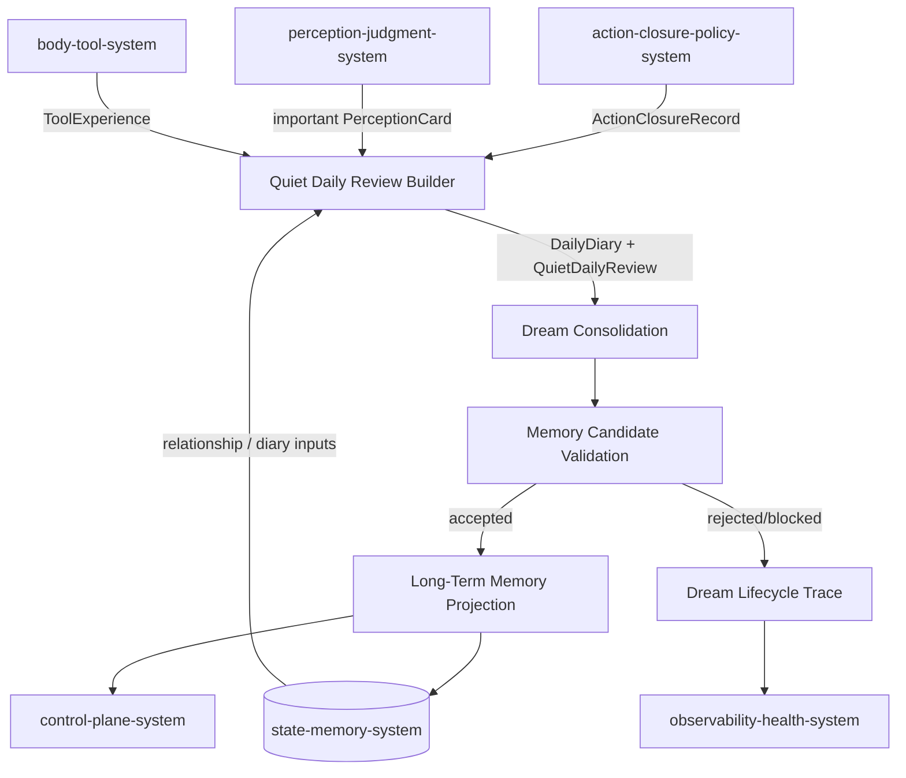
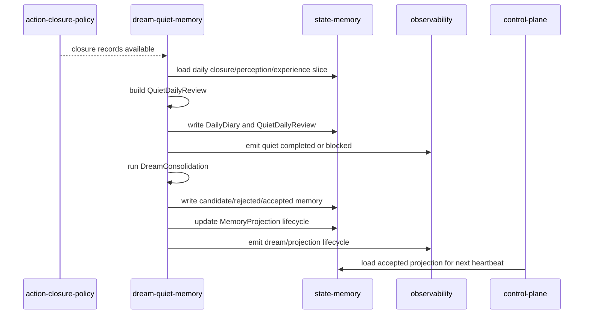
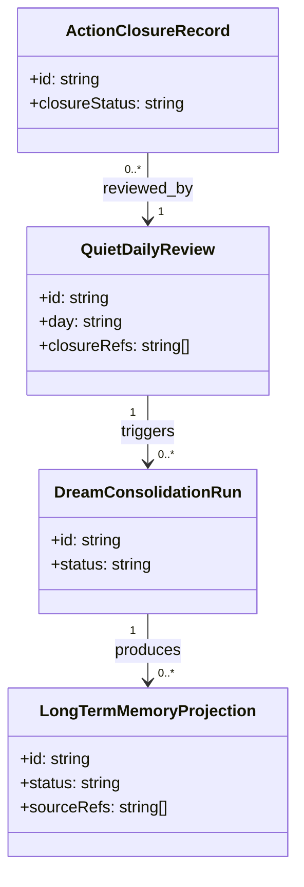
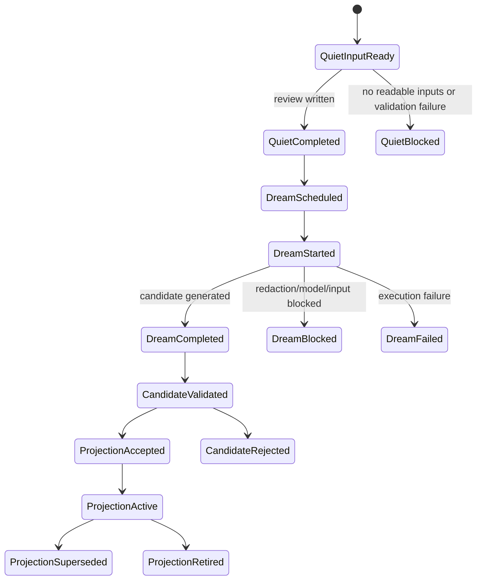

# Dream Quiet Memory System 系统设计文档 (L0)

| 字段 | 值 |
| --- | --- |
| **System ID** | `dream-quiet-memory-system` |
| **Project** | Second Nature |
| **Version** | v8.0 |
| **Status** | `Draft` |
| **Author** | Nyx / Codex |
| **Date** | 2026-06-01 |
| **L1 Detail** | [dream-quiet-memory-system.detail.md](./dream-quiet-memory-system.detail.md) |

## 1. 概览 (Overview)

### 1.1 System Purpose

`dream-quiet-memory-system` 是 v8 的长期记忆形成边界。它通过 Quiet Daily Review 汇总一天的 perception、judgment、action closure 和 tool/relationship experience，再由 Dream Consolidation 形成 candidate long-term memory，并在 accepted 后生成 agent-facing memory projection。

### 1.2 System Boundary

- **输入**: `ActionClosureRecord`、`MemoryReviewCandidateClosure`、important `PerceptionCard`、ToolExperience、RelationshipMemory、DailyDiary、Dream trigger。
- **输出**: `QuietDailyReview`、DailyDiary artifact、`DreamConsolidationRun`、candidate memory、accepted long-term memory projection、DreamTrace。
- **依赖系统**: `state-memory-system`, `observability-health-system`, optional ModelAssistPort。
- **被依赖系统**: `control-plane-system`, `state-memory-system`, `runtime-ops-system`, `observability-health-system`。

### 1.3 System Responsibilities

**负责**:
- 生成 daily Quiet review，覆盖当天重要 perception、judgment、closure 和 unresolved observations。[REQ-005]
- 运行 Dream consolidation，形成 candidate long-term memory 并执行 validation。[REQ-005], [REQ-006]
- 管理 accepted projection 生命周期：candidate -> accepted -> active -> superseded | retired。[REQ-005]
- 记录 scheduled、started、completed、failed、blocked 等 lifecycle trace。[REQ-006]

**不负责**:
- 不做实时 perception/judgment；由 `perception-judgment-system` 负责。
- 不执行外部动作；由 action/connector/guidance 负责。
- 不绕过 Quiet/Dream 直接写长期记忆。
- 不拥有 `EmbodiedContext` assembly；只提供 accepted projection read model。

## 2. 目标与非目标 (Goals & Non-Goals)

### 2.1 Goals

- **[G1]**: Quiet Daily Review 必须消费 `ActionClosureRecord`，而不只消费 raw evidence。[REQ-005], [REQ-009]
- **[G2]**: Dream run 100% 有 lifecycle trace 或 blocked reason。[REQ-006]
- **[G3]**: accepted long-term memory projection 可被 `EmbodiedContext` 加载。[REQ-005]
- **[G4]**: Dream validation 失败时保留 rejected/blocked reason，不静默丢弃。[REQ-006]
- **[G5]**: Quiet review must be content-bearing or explicitly empty; template placeholders cannot become memory input。[REQ-005]

### 2.2 Non-Goals

- **[NG1]**: 不把实时 perception 直接写入长期记忆。
- **[NG2]**: 不让 Dream 替代实时行动判断。
- **[NG3]**: 不把 projection 当成原始 diary 的无筛选拷贝。

## 3. 背景与上下文 (Background & Context)

### 3.1 Why This System?

PRD [REQ-005] 明确长期记忆必须通过 Quiet/Dream 形成；ADR-003 将 MemoryProjection 定义为 accepted long-term memory read model。v8 需要把 heartbeat action closure 与每日回顾接起来，让经历能沉淀。

### 3.2 Current State

v7 已有 Quiet、DailyDiary、DreamOutput、accepted projection 的基础，但机制审计指出 trigger、diary input、Dream lifecycle 和 projection visibility 不稳定。v8 要把这些从“可能发生”变成可诊断契约。

### 3.3 Constraints

- **技术约束**: 保留现有 Dream/Quiet TypeScript pipeline，按 state ports 演进。
- **安全约束**: Dream model assist 只能读取 redacted bundle；sensitive block 必须产生 explicit blocked output。
- **架构约束**: 长期记忆只能由 Quiet Daily Review -> Dream Consolidation -> accepted projection 形成。

## 4. 系统架构 (Architecture)

### 4.1 Architecture Diagram



### 4.2 Core Components

| Component | Responsibility | Notes |
| --- | --- | --- |
| `QuietReviewBuilder` | 聚合当天 closure、important perception、tool experience | 生成 source-backed review |
| `DailyDiaryWriter` | 写每日 diary artifact 与 index | 不允许 raw private content |
| `DreamConsolidationRunner` | 读取 review/diary，生成 candidate memory | rules-first，可选 ModelAssistPort |
| `MemoryCandidateValidator` | 校验 source refs、redaction、重复与可信度 | 失败保留 reason |
| `ProjectionLifecycleManager` | 管理 accepted/active/superseded/retired | 提供 EmbodiedContext read model |
| `DreamQuietTraceEmitter` | 记录 Quiet/Dream/projection stage events | 支撑 loop_status |

### 4.3 Data Flow



Control-plane only emits `DailyRhythmTriggerRequest` after a finalized cycle. This system owns whether Quiet is due, whether Dream is due, 7-day interval enforcement, stale scheduled repair, and duplicate-schedule prevention.

## 5. 接口设计 (Interface Design)

### 5.1 操作契约表

| 操作 | [REQ] | 前置条件 | 消耗/输入 | 产出/副作用 | 实现细节 |
| --- | :---: | --- | --- | --- | --- |
| `runQuietDailyReview(day)` | [REQ-005], [REQ-009] | state readable; day window resolved | closure, perception, experience slice | writes `QuietDailyReview` and diary artifact | [L1 §3.1](./dream-quiet-memory-system.detail.md#31-runquietdailyreview) |
| `scheduleDreamAfterQuiet(reviewId)` | [REQ-006] | quiet review completed | review id, day, trigger reason | writes scheduled lifecycle event | [L1 §3.2](./dream-quiet-memory-system.detail.md#32-scheduledreamafterquiet) |
| `runDreamConsolidation(runId)` | [REQ-005], [REQ-006] | scheduled run exists; redaction passed or fallback available | review, diary, tool experience, memory context | candidate memory or blocked output | [L1 §3.3](./dream-quiet-memory-system.detail.md#33-rundreamconsolidation) |
| `acceptMemoryProjection(candidateId)` | [REQ-005] | candidate validated | candidate memory, source refs | accepted projection and supersession updates | [L1 §3.4](./dream-quiet-memory-system.detail.md#34-acceptmemoryprojection) |

### 5.2 跨系统接口协议

```ts
interface DreamQuietMemoryPort {
  runQuietDailyReview(input: QuietDailyReviewRequest): Promise<QuietDailyReviewResult>;
  scheduleDreamAfterQuiet(input: DreamScheduleRequest): Promise<DreamScheduleResult>;
  runDreamConsolidation(input: DreamConsolidationRequest): Promise<DreamConsolidationResult>;
  projectAcceptedMemory(input: MemoryProjectionRequest): Promise<MemoryProjectionResult>;
}

interface DreamQuietStatePort {
  loadDailyReviewInputs(query: DailyReviewInputQuery): Promise<DailyReviewInputBundle>;
  writeQuietReview(review: QuietDailyReview): Promise<void>;
  writeDreamRun(run: DreamConsolidationRun): Promise<void>;
  writeMemoryProjection(projection: LongTermMemoryProjection): Promise<void>;
}
```

### 5.3 HTTP API 端点摘要

N/A - 本系统不暴露 HTTP API；manual run/status 由 runtime ops 调用内部 port。

## 6. 数据模型 (Data Model)

### 6.1 核心实体

```ts
interface QuietDailyReview {
  id: string;
  day: string;
  closureRefs: string[];
  perceptionRefs: string[];
  unresolvedRefs: string[];
  memoryReviewCandidateRefs: SourceRef[];
  sourceRefs: SourceRef[];
  reviewSummary: string;
  importanceSignals: string[];
  createdAt: string;
  payloadJson: string; // contains detailed summary, notable signals, memory candidates, input stats
}

interface QuietReviewPayload {
  reviewSummary: string;
  contentStatus: "content_present" | "empty" | "placeholder_rejected" | "content_missing";
  notableSignals: string[];
  memoryCandidates: Array<{
    text: string;
    reason: string;
    sourceRefs: SourceRef[];
    confidence: number;
  }>;
  unresolvedRefs: SourceRef[];
  inputStats: {
    evidenceCount: number;
    perceptionCount: number;
    closureCount: number;
    duplicateCount: number;
    truncated: boolean;
  };
}

interface DreamConsolidationRun {
  id: string;
  reviewId: string;
  status: "scheduled" | "started" | "completed" | "failed" | "blocked";
  mode: "rules_only" | "hybrid_llm" | "model_skipped";
  reason?: string;
  startedAt?: string;
  completedAt?: string;
}

interface LongTermMemoryProjection {
  id: string;
  candidateId: string;
  status: "candidate" | "accepted" | "active" | "superseded" | "retired" | "rejected";
  memoryText: string;
  sourceRefs: SourceRef[];
  supersedesProjectionId?: string;
  acceptedAt?: string;
}
```

Dream blocked/skipped reasons must distinguish no content, private content redacted, credential-shaped block, and validation failure. A broad sensitivity block is not enough for operator repair.

### 6.2 实体关系图



### 6.3 状态机



### 6.4 Dream Periodicity

- Quiet runs daily after the first closure of the day.
- Dream runs no more frequently than the configured `dreamIntervalDays` (default 7 days), or on manual force.
- A scheduled Dream run must move to `started` within a bounded time; stale `scheduled` runs are surfaced by `loop_status` as `dream_scheduled_stalled`.
- Long-term memory projection is formed from a window of Quiet reviews, not from a single heartbeat.

## 7. 技术选型 (Technology Stack)

| Domain | Choice | Rationale |
| --- | --- | --- |
| Runtime | TypeScript async pipeline | 继承 ADR-001 与 v7 Dream/Quiet 基础。 |
| Consolidation | rules-first + optional ModelAssistPort | sensitive/model failure 时仍能生成 blocked/rules-only output。 |
| State | SQLite/sql.js + Markdown/JSON artifacts via state ports | 继承现有 state model。 |
| Trace | Dream/Quiet lifecycle events | 支撑 ADR-005。 |

## 8. Trade-offs & Alternatives

### 8.1 Long-term memory formation boundary

> **决策来源**: [ADR-003: Long-Term Memory Must Be Formed by Quiet and Dream](../03_ADR/ADR_003_QUIET_DREAM_LONG_TERM_MEMORY.md)
>
> 本系统是长期记忆唯一形成边界；实时 perception/judgment 不得直接写长期记忆。

### 8.2 Causal loop health

> **决策来源**: [ADR-005: Add Causal Loop Health](../03_ADR/ADR_005_CAUSAL_LOOP_HEALTH.md)
>
> Quiet、Dream 和 projection lifecycle 必须发出 stage events。

### 8.3 Projection 是否由 state-memory 独立决定

**Option A: state-memory 根据写入数据自动投影**
- **优点**: 实现简单。
- **缺点**: 存储层会拥有语义接受权，违反 Dream/Quiet 边界。

**Option B: Dream/Quiet 决定 accepted projection，state-memory 持久化 (Selected)**
- **优点**: 语义形成边界清晰，projection 可追溯。
- **缺点**: lifecycle 需要更多事件和测试。

**Decision**: 选择 Option B；state-memory 保存事实，Dream/Quiet 决定长期记忆是否成立。

## 9. 安全性考虑 (Security Considerations)

| Risk | Severity | Mitigation |
| --- | :---: | --- |
| raw private content 进入 Dream model | Critical | redacted bundle + blocked output + no raw prompt persistence。 |
| real-time noise 污染长期记忆 | High | only Quiet/Dream accepted candidate can project memory。 |
| Dream failure 静默丢失 | High | scheduled/started/failed/blocked/completed durable trace。 |
| supersession 缺失导致记忆冲突 | Medium | projection lifecycle requires `supersedesProjectionId` when replacing same fact。 |
| Dream run 长期停留在 scheduled | High | `loop_status` surfaces `dream_scheduled_stalled`; runner transitions stale scheduled runs to `failed` on next attempt. |

## 10. 性能考虑 (Performance Considerations)

- Quiet/Dream 不在 heartbeat critical path 同步等待长模型。
- Quiet input 按 day window、importance 和 source refs bounded load。
- Dream consolidation 可异步运行，但 lifecycle event 必须即时写入。

## 11. 测试策略 (Testing Strategy)

### 11.1 Unit Testing

- Quiet review consumes closure records, important perception refs, and evidence summaries.
- Quiet review builds readable `reviewSummary` and `notableSignals`, not template placeholders.
- Dream validation rejects candidate without source refs.
- Projection supersession moves old active projection to superseded.
- Stale `scheduled` Dream run is surfaced as `dream_scheduled_stalled` in health.

### 11.2 Integration Testing

- closure + perception + evidence day slice -> `QuietDailyReview` with content-bearing payload -> `DreamConsolidationRun` moves to started -> candidate memory -> accepted projection.
- redaction blocked Dream -> explicit blocked output and health event.
- accepted projection loaded into EmbodiedContext through state read model.

### 11.3 Contract Verification Matrix

| 契约 | 风险级别 | 正常态验证 | 失败态验证 | 回归责任 |
| --- | --- | --- | --- | --- |
| `runQuietDailyReview` | P0 | closure + evidence inputs produce readable review with memory candidates | empty/unreadable input writes blocked reason | quiet integration |
| `runDreamConsolidation` | P0 | review produces candidate; run status advances from scheduled to started to completed/blocked/failed | redaction/model failure records blocked/failed; stale scheduled surfaced | dream integration |
| `projectAcceptedMemory` | P0 | accepted candidate becomes active projection | duplicate fact supersedes old projection | projection unit |

## 12. 部署与运维 (Deployment & Operations)

N/A - 内部 async pipeline；manual trigger 和 status 由 `runtime-ops-system` 暴露，health 由 `observability-health-system` 聚合。

## 13. 未来考虑 (Future Considerations)

- 可引入 richer memory conflict resolution，但必须保留 source refs 和 supersession。
- 可扩展 quiet review 到 multiple daily windows，但仍必须产生单一 day-level consolidation input。
- 可借鉴 MiMo Code 的 Dream/Distill 周期模型：Dream 7 天 consolidation，Distill 30 天 workflow packaging。SN v8 先实现 Dream 7 天周期与每日 Quiet review。

## 14. Appendix (附录)

### 14.1 Research

- [_research/dream-quiet-memory-system-research.md](./_research/dream-quiet-memory-system-research.md)
- [dream-quiet-memory-system.detail.md](./dream-quiet-memory-system.detail.md)
- [shared-v8-contracts.md](./shared-v8-contracts.md)
- [MiMo Code Dream/Distill Workflows](https://zread.ai/XiaomiMiMo/MiMo-Code/11-dream-and-distill-workflows), accessed 2026-06-14

### 14.2 未决问题

无。
