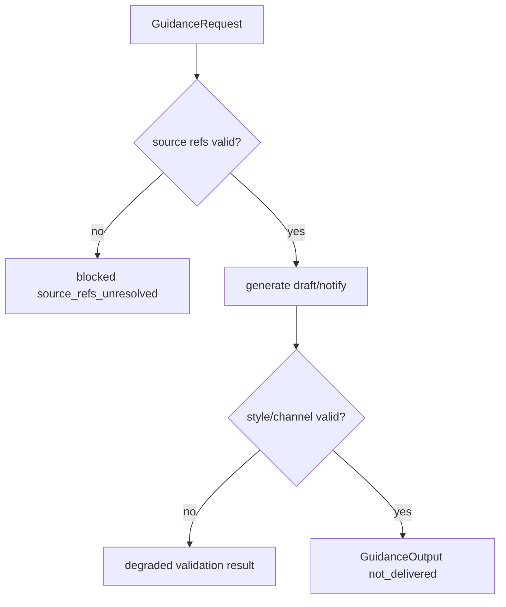

# Guidance Voice System 系统设计文档 (L0)

| 字段 | 值 |
| --- | --- |
| **System ID** | `guidance-voice-system` |
| **Project** | Second Nature |
| **Version** | v8.0 |
| **Status** | `Draft` |
| **Author** | Nyx / Codex |
| **Date** | 2026-06-01 |

## 1. 系统职责与非职责

`guidance-voice-system` 负责 source-backed draft、notify、reply、publish text。它是表达层，不拥有外部投递权，也不决定 action 是否允许。

**负责**:
- 从 policy-bound `ActionProposal` 生成 grounded draft/notify 文案。
- 校验 source refs、channel style、owner preference 和 invalidated source。
- 返回 `GuidanceOutput` 或 degraded result。

**不负责**:
- 不调用 connector 投递外部平台。
- 不决定 allow/deny/downgrade。
- 不形成长期记忆。
- 不在 guidance 不可用时阻塞 S3 closure；action closure 可写 `closure_downgraded_without_draft`。

## 2. 输入/输出契约

| 方向 | 契约 |
| --- | --- |
| 输入 | policy-bound ActionProposal, JudgmentVerdict ref, relationship context, channel hint, source refs |
| 输出 | `GuidanceOutput`, validation result, degraded operation result |
| 共享契约 | `SourceRef`, `guidance_unavailable`, `closure_downgraded_without_draft` |

```ts
interface GuidanceRequest {
  proposalRef: SourceRef;
  decisionRef: SourceRef;
  sourceRefs: SourceRef[];
  channelHint?: string;
  mode: "draft" | "notify";
}

interface GuidanceOutput {
  id: string;
  mode: "draft" | "notify";
  textRef: SourceRef;
  sourceRefs: SourceRef[];
  deliveryClaim: "not_delivered";
}
```

## 3. 核心数据模型

| 模型 | 说明 |
| --- | --- |
| `GuidanceRequest` | policy-bound text generation input。 |
| `GuidanceOutput` | draft/notify output; never claims external delivery。 |
| `GuidanceValidationResult` | source/style/channel validation result。 |

## 4. 状态机/流程图



## 5. 依赖关系

| 依赖 | 用途 |
| --- | --- |
| `state-memory-system` | source resolution and output artifact write。 |
| `perception-judgment-system` | source-backed judgment context。 |
| optional ModelAssistPort | drafting assist only; deterministic fallback preferred for notify. |

## 6. 错误/降级/安全边界

- Guidance output must always include source refs and `deliveryClaim=not_delivered`.
- Source unresolved returns blocked result; no hallucinated source.
- Model unavailable returns deterministic template or `guidance_unavailable`.
- Private/raw payload is never copied into draft without redacted source validation.

## 7. 测试策略

| 层级 | 覆盖 |
| --- | --- |
| 单元 | draft/notify generation, source validation, invalidated source。 |
| API | guidance request/result shape and degraded output。 |
| 集成 | ActionProposal -> GuidanceOutput -> ActionClosureRecord when available。 |

## 8. Trade-offs

- **Voice separated from delivery**: 遵循 ADR-004，表达层不能拥有投递权。
- **Fallback belongs to action closure**: CH-07 修复后，guidance 缺席不阻塞 S3；代价是可能先产生 without-draft closure，再由后续 guidance 补文案。
- **Source-first drafting**: 降低无依据文案风险，但会拒绝 source refs 不完整的 draft。

## 9. 未决问题

无
