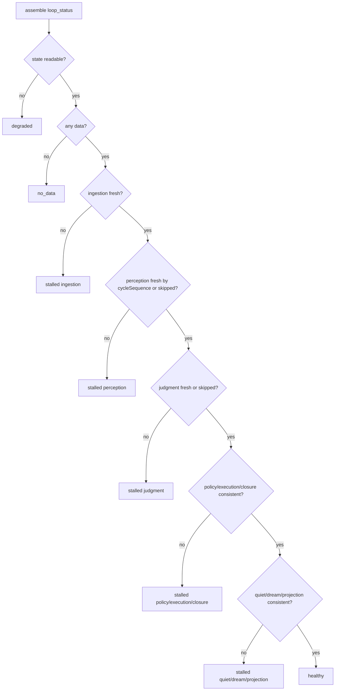
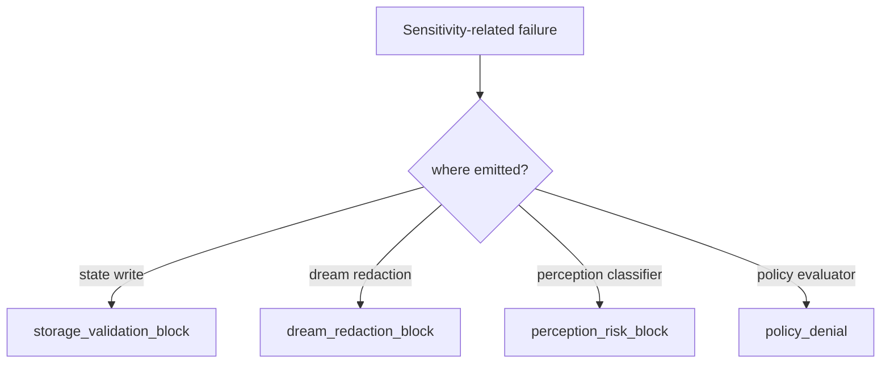

# Observability Health System — 实现细节 (L1)

> **文件性质**: L1 实现层 · **对应 L0**: [observability-health-system.md](./observability-health-system.md)
> 本文件只定义接口、枚举、reason code、read model 和测试 fixture 形状；不写具体实现代码。

---

## 版本历史

| 版本 | 日期 | Changelog |
| --- | --- | --- |
| v1.0 | 2026-06-01 | 初始 L1：补 stage event、loop_status、stall reason 和 redaction 诊断契约。 |

## 本文件章节索引

| § | 章节 | 对应 L0 入口 |
| :---: | --- | :---: |
| §1 | [配置常量](#1-配置常量-config-constants) | L0 §6 |
| §2 | [核心数据结构完整定义](#2-核心数据结构完整定义-full-data-structures) | L0 §6 |
| §3 | [操作契约细化](#3-操作契约细化-operation-contract-details) | L0 §5 |
| §4 | [决策树详细逻辑](#4-决策树详细逻辑-decision-tree-details) | L0 §4 |
| §5 | [边缘情况与注意事项](#5-边缘情况与注意事项-edge-cases--gotchas) | L0 §5 / §9 |
| §6 | [测试辅助](#6-测试辅助-test-helpers) | L0 §11 |

---

## §1 配置常量 (Config Constants)

### §1.1 Stage Freshness Defaults

| 名称 | 默认值 | 说明 |
| --- | ---: | --- |
| `EVIDENCE_TO_PERCEPTION_MAX_HEARTBEATS` | 2 | evidence 增长后 2 轮内应有 perception 或 reason。 |
| `PERCEPTION_TO_JUDGMENT_MAX_HEARTBEATS` | 1 | perception 产生后 1 轮内应有 judgment 或 reason。 |
| `ACTION_TO_CLOSURE_MAX_HEARTBEATS` | 1 | policy/execution 后必须闭环。 |
| `QUIET_REVIEW_MAX_AGE_HOURS` | 36 | 超过该窗口未回顾则 quiet stale。 |
| `DREAM_AFTER_QUIET_MAX_HOURS` | 6 | Quiet 完成后 Dream 应调度或给出 blocked reason。 |

Heartbeat-count defaults use `cycleSequence`; wall-clock defaults use timestamps. `loop_status.stalledAt` for ingestion/perception/judgment/policy/execution/closure must not be inferred from elapsed hours unless the stage contract explicitly names a wall-clock SLA.

### §1.2 Stage / Reason Taxonomy

| Stage | 常见 reason codes |
| --- | --- |
| ingestion | `ingestion_no_data`, `ingestion_empty`, `ingestion_state_unreadable`, `ingestion_connector_failed` |
| perception | `perception_missing`, `perception_rules_only`, `perception_blocked_redaction`, `perception_state_unreadable` |
| judgment | `judgment_missing`, `judgment_low_confidence`, `judgment_missing_source_refs`, `judgment_blocked_risk` |
| policy | `policy_missing`, `policy_denied_high_risk`, `policy_downgraded`, `policy_denied_permission` |
| execution | `execution_skipped_by_policy`, `execution_failed`, `execution_timeout`, `execution_unavailable` |
| closure | `closure_missing`, `closure_no_action`, `closure_completed`, `closure_failed` |
| quiet | `quiet_not_due`, `quiet_empty_input`, `quiet_failed`, `quiet_completed` |
| dream | `dream_not_scheduled`, `dream_scheduler_unavailable`, `dream_blocked_redaction`, `dream_failed`, `dream_completed` |
| projection | `projection_missing`, `projection_rejected`, `projection_active`, `projection_superseded` |

## §2 核心数据结构完整定义 (Full Data Structures)

### §1.3 Shared Contracts

`HeartbeatCycleTrace`, `LoopStageEvent`, `SourceRef`, and canonical reason codes are defined in [shared-v8-contracts.md](./shared-v8-contracts.md). Observability assembles health from those contracts and must not invent parallel reason names.

### §2.0 Heartbeat Cycle Trace

```ts
interface HeartbeatCycleTrace {
  cycleId: string;
  cycleSequence: number;
  heartbeatStartedAt: string;
  heartbeatCompletedAt?: string;
  inputCount: number;
  outputCount: number;
  expectedDownstreamByCycle?: number;
  status: "started" | "completed" | "failed" | "degraded";
}
```

### §2.1 Request / Result Types

```ts
interface LoopStatusRequest {
  workspaceRoot: string;
  cycleId?: string;
  includeRecentEvents?: boolean;
  now: string;
}

interface LoopStageEvent {
  id: string;
  cycleId: string;
  cycleSequence: number;
  stage: LoopStage;
  status: "started" | "completed" | "skipped" | "blocked" | "failed";
  reason?: V8ReasonCode;
  sourceRefs: SourceRef[];
  redactionClass: "none" | "redacted" | "blocked";
  occurredAt: string;
  expectedDownstreamByCycle?: number;
}

interface CausalLoopHealthSnapshot {
  id: string;
  workspaceRoot: string;
  overallStatus: "healthy" | "degraded" | "blocked" | "stalled" | "no_data";
  stalledAt?: LoopStage;
  stages: StageHealth[];
  nextAction: string;
  generatedAt: string;
}
```

### §2.2 Stage Health Contracts

```ts
interface StageHealth {
  stage: LoopStage;
  status: "healthy" | "no_data" | "stalled" | "blocked" | "degraded";
  lastStartedAt?: string;
  lastCompletedAt?: string;
  backlogCount?: number;
  reason?: string;
  evidenceRefs: SourceRef[];
}

interface LoopDiagnosticReason {
  code: string;
  stage: LoopStage;
  severity: "info" | "warning" | "error";
  humanMessage: string;
  operatorNextAction: string;
}
```

### §2.3 Invariants

| 编号 | Invariant |
| --- | --- |
| OBS-I1 | `overallStatus=healthy` 只能在 required stages fresh 或 explicit skipped reason 存在时返回。 |
| OBS-I2 | state unreadable 必须返回 `degraded`，不得返回 healthy。 |
| OBS-I3 | health/audit payload 不得包含 raw credential、raw private message、raw prompt。 |
| OBS-I4 | policy deny 后 execution 缺失不算 stalled；closure 缺失才算 stalled。 |

## §3 操作契约细化 (Operation Contract Details)

### §3.1 recordLoopStageEvent

| 步骤 | 契约 |
| --- | --- |
| validate | `cycleId`, `stage`, `status`, `occurredAt` 必填。 |
| redact | payload 先过 redaction；blocked 时记录 blocked reason 而非 raw 内容。 |
| append | 写 append-only trace/audit row。 |
| degrade | malformed event 写 diagnostic，不中断业务主链路。 |

### §3.2 assembleLoopStatus

| 输入事实 | 判断 |
| --- | --- |
| no evidence and no cycles | `overallStatus=no_data` |
| evidence increased but no perception within threshold | `stalledAt=perception` |
| perception exists but no judgment | `stalledAt=judgment` |
| policy denied and closure exists | healthy or blocked by policy, not execution stall |
| Quiet completed but Dream absent beyond heartbeat/time threshold | `stalledAt=dream` |
| accepted Dream exists but projection absent | `stalledAt=projection` |
| state read fails | `overallStatus=degraded` |

### §3.3 classifyStallReason

| Stage | 优先级最高 reason |
| --- | --- |
| ingestion | state unreadable > connector failed > empty |
| perception | redaction blocked > model timeout > missing event |
| judgment | missing source refs > low confidence > missing event |
| policy | high risk deny > missing permission > missing event |
| execution | skipped by policy > connector failed > timeout |
| closure | missing closure > state write failed |
| quiet | not due > empty input > failed |
| dream | redaction blocked > `dream_scheduler_unavailable` > failed |
| projection | rejected > source missing > not accepted |

### §3.4 redactDiagnosticPayload

| 内容类型 | 输出 |
| --- | --- |
| public technical text | 保留摘要，标记 `redactionClass=none` |
| credential-shaped value | redact value，保留 reason code |
| raw private message | block raw payload，输出 source ref 和 blocked reason |
| raw prompt | block raw payload，输出 diagnostic only |

## §4 决策树详细逻辑 (Decision Tree Details)

### §4.1 Loop Status Decision Tree



### §4.2 Sensitivity Diagnostic Attribution



## §5 边缘情况与注意事项 (Edge Cases & Gotchas)

| 场景 | 风险 | 处理方式 |
| --- | --- | --- |
| policy denied action 没有 execution event | 误报 execution stalled | 只要 closure 存在，就不算 execution stall。 |
| event append 失败 | health 失真 | 返回 degraded，并保留 state probe 结果。 |
| repeated no-data workspace | digest 噪音 | `no_data` 是合法状态，不升级 error。 |
| public technical 被 redacted | 诊断误导 | attribution 必须标出 classifier/redaction 来源。 |

## §6 测试辅助 (Test Helpers)

| Fixture | 用途 |
| --- | --- |
| `evidenceWithoutPerceptionForTwoHeartbeats` | 验证 `stalledAt=perception`。 |
| `policyDeniedWithClosure` | 验证不误报 execution stall。 |
| `quietCompletedDreamMissing` | 验证 `stalledAt=dream`。 |
| `stateUnreadableProbe` | 验证 `overallStatus=degraded`。 |
