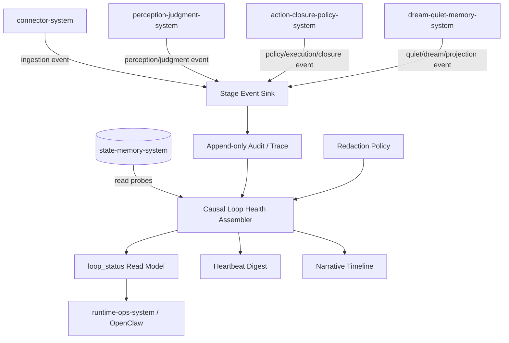
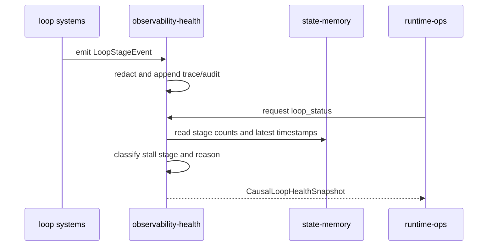
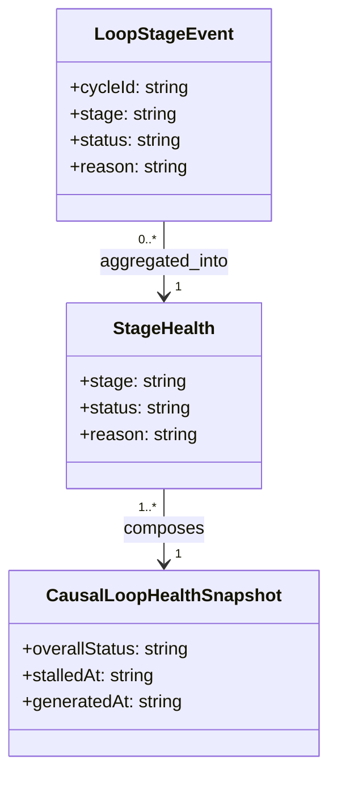
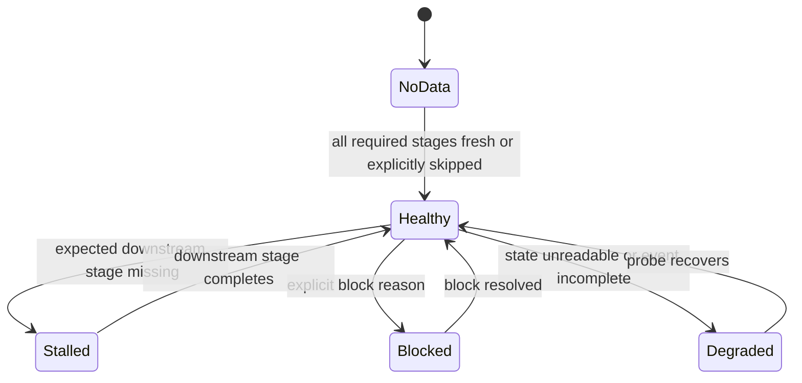

# Observability Health System 系统设计文档 (L0)

| 字段 | 值 |
| --- | --- |
| **System ID** | `observability-health-system` |
| **Project** | Second Nature |
| **Version** | v8.0 |
| **Status** | `Draft` |
| **Author** | Nyx / Codex |
| **Date** | 2026-06-01 |
| **L1 Detail** | [observability-health-system.detail.md](./observability-health-system.detail.md) |

## 1. 概览 (Overview)

### 1.1 System Purpose

`observability-health-system` 提供 v8 causal loop health。它聚合 ingestion、perception、judgment、policy、execution、closure、Quiet、Dream、projection 的 stage events，输出 `loop_status`、self health、digest、timeline 和 redacted audit rows，防止 `heartbeat ok` 掩盖生活闭环停滞。

### 1.2 System Boundary

- **输入**: `HeartbeatCycleTrace`、stage events、audit envelopes、redaction results、health probes、closure events、Dream lifecycle events、state read probes。
- **输出**: `CausalLoopHealthSnapshot`、`loop_status` read model、digest、timeline、redacted audit row、stall reason。
- **依赖系统**: `state-memory-system`, host probes。
- **被依赖系统**: `runtime-ops-system`, `control-plane-system`, `perception-judgment-system`, `action-closure-policy-system`, `dream-quiet-memory-system`, Owner/OpenClaw。

### 1.3 System Responsibilities

**负责**:
- 记录并聚合 living loop stage events。[REQ-008]
- 解释 loop 卡在 ingestion、perception、judgment、policy、execution、closure、Quiet、Dream、projection 哪一段。[REQ-008]
- 统一 audit、redaction、trace、self-health、digest 的诊断语义。[REQ-006], [REQ-007]
- 在 state 不可读或 event 缺失时返回 degraded health，而不是 healthy。

**不负责**:
- 不做业务 judgment 或 policy decision。
- 不执行 connector、guidance、Dream 或 state mutation。
- 不持久化明文 credential、raw private messages、raw prompts 或 private key。

## 2. 目标与非目标 (Goals & Non-Goals)

### 2.1 Goals

- **[G1]**: `loop_status` 能定位 stalled stage，并给出 deterministic reason code。[REQ-008]
- **[G2]**: Evidence count 增长但 2 个 heartbeat 内无 perception 时返回 `stalled_at: perception`。[REQ-008]
- **[G3]**: Quiet/Dream/projection lifecycle 缺失时可区分 not_scheduled、blocked、failed、empty_input、state_unreadable。[REQ-006]
- **[G4]**: sensitivity 相关诊断能区分 public technical、storage validation block、Dream redaction block、policy denial。[REQ-007]

### 2.2 Non-Goals

- **[NG1]**: 不把 health counter 当作语义判断。
- **[NG2]**: 不让每个系统各自暴露互不一致的 health truth。
- **[NG3]**: 不通过 raw payload 增强可观测性；read model 必须 redacted。

## 3. 背景与上下文 (Background & Context)

### 3.1 Why This System?

PRD [REQ-008] 要求 owner/Claw 能知道系统卡在收集、感知、判断、行动、记忆还是 Dream 阶段。ADR-005 采纳 causal loop health read model。该系统是 v8 可诊断性的统一入口。

### 3.2 Current State

v7 有 audit、redaction、self-health、digest、timeline，但机制审计指出 heartbeat healthy 不等于 living loop evolving。v8 需要 stage-by-stage causality。

### 3.3 Constraints

- **技术约束**: 保持 TypeScript audit/read-model services；从 state-memory 读取事实。
- **安全约束**: audit 和 health 输出必须 redacted。
- **运维约束**: `loop_status` 必须能被 OpenClaw surface 直接展示。

## 4. 系统架构 (Architecture)

### 4.1 Architecture Diagram



### 4.2 Core Components

| Component | Responsibility | Notes |
| --- | --- | --- |
| `LoopStageEventSink` | 接收各系统 stage event | 缺 event 视为 degraded signal |
| `CausalLoopHealthAssembler` | 聚合 stage freshness、backlog、blocked reason | 输出 `CausalLoopHealthSnapshot` |
| `StallReasonClassifier` | 将事实映射为 deterministic reason code | 不做业务判断 |
| `RedactedAuditProjector` | 输出可展示 audit/timeline | 不泄露 raw secret/private content |
| `LoopStatusReadModel` | 提供 ops surface 读取结构 | JSON-first |
| `DigestAssembler` | 将 causal health 纳入 heartbeat digest | owner-facing summary |

### 4.3 Data Flow



## 5. 接口设计 (Interface Design)

### 5.1 操作契约表

| 操作 | [REQ] | 前置条件 | 消耗/输入 | 产出/副作用 | 实现细节 |
| --- | :---: | --- | --- | --- | --- |
| `recordLoopStageEvent(event)` | [REQ-008], [REQ-009] | event has cycleId/stage/status | stage event | append redacted trace/audit | [L1 §3.1](./observability-health-system.detail.md#31-recordloopstageevent) |
| `assembleLoopStatus(workspaceRoot)` | [REQ-008] | state probe attempted | stage events, state counts, freshness thresholds | `CausalLoopHealthSnapshot` | [L1 §3.2](./observability-health-system.detail.md#32-assembleloopstatus) |
| `classifyStallReason(stage)` | [REQ-006], [REQ-008] | stage facts loaded | timestamps, counts, blocked reasons | deterministic reason code | [L1 §3.3](./observability-health-system.detail.md#33-classifystallreason) |
| `redactDiagnosticPayload(payload)` | [REQ-007] | payload may contain sensitive fields | audit/health payload | redacted output or blocked reason | [L1 §3.4](./observability-health-system.detail.md#34-redactdiagnosticpayload) |

### 5.2 跨系统接口协议

```ts
type LoopStage =
  | "ingestion"
  | "perception"
  | "judgment"
  | "policy"
  | "execution"
  | "closure"
  | "quiet"
  | "dream"
  | "projection";

interface ObservabilityHealthPort {
  recordLoopStageEvent(event: LoopStageEvent): Promise<void>;
  assembleLoopStatus(input: LoopStatusRequest): Promise<CausalLoopHealthSnapshot>;
}

interface LoopStageEvent {
  cycleId: string;
  cycleSequence: number;
  stage: LoopStage;
  status: "started" | "completed" | "skipped" | "blocked" | "failed";
  reason?: string;
  sourceRefs: SourceRef[];
  occurredAt: string;
  expectedDownstreamByCycle?: number;
}
```

### 5.3 HTTP API 端点摘要

N/A - runtime ops/plugin surface 暴露 `loop_status` 命令；本系统提供内部 read model。

## 6. 数据模型 (Data Model)

### 6.1 核心实体

```ts
interface StageHealth {
  stage: LoopStage;
  status: "healthy" | "no_data" | "stalled" | "blocked" | "degraded";
  lastStartedAt?: string;
  lastCompletedAt?: string;
  backlogCount?: number;
  reason?: string;
}

interface CausalLoopHealthSnapshot {
  id: string;
  workspaceRoot: string;
  overallStatus: "healthy" | "degraded" | "blocked" | "stalled" | "no_data";
  stalledAt?: LoopStage;
  stages: StageHealth[];
  nextAction: string;
  generatedAt: string;
}

interface LoopDiagnosticReason {
  code: string;
  stage: LoopStage;
  severity: "info" | "warning" | "error";
  humanMessage: string;
}
```

### 6.2 实体关系图



### 6.3 状态机



## 7. 技术选型 (Technology Stack)

| Domain | Choice | Rationale |
| --- | --- | --- |
| Runtime | TypeScript services | 继承 ADR-001。 |
| Audit | append-only audit/trace store | 复用 v7 审计基础。 |
| Read Model | state probes + stage events | 支撑 causal diagnosis。 |
| Redaction | unified redaction policy | 安全输出前置。 |

## 8. Trade-offs & Alternatives

### 8.1 Causal loop health read model

> **决策来源**: [ADR-005: Add Causal Loop Health](../03_ADR/ADR_005_CAUSAL_LOOP_HEALTH.md)
>
> 本系统实现 ingestion、perception、judgment、policy、execution、closure、Quiet、Dream、projection 的 causal health。

### 8.2 Living loop observability

> **决策来源**: [ADR-002: Introduce the Living Perception Loop](../03_ADR/ADR_002_LIVING_PERCEPTION_LOOP.md)
>
> `loop_status` 观察 ADR-002 的 real-time spine 和 action closure。

### 8.3 单一 loop_status vs 分散 health

**Option A: 各系统单独 health**
- **优点**: 实现局部简单。
- **缺点**: 用户仍无法判断因果断点。

**Option B: 单一 causal loop read model (Selected)**
- **优点**: 直接回答 stuck stage，适合 ops 和测试。
- **缺点**: 需要所有系统稳定发 stage event。

**Decision**: 选择 Option B；missing event 被视为 degraded signal。

## 9. 安全性考虑 (Security Considerations)

| Risk | Severity | Mitigation |
| --- | :---: | --- |
| health 输出泄露 secret/private content | Critical | redacted audit/read model only，禁止 raw payload。 |
| heartbeat ok 误导用户 | High | overallStatus 以 causal progression 为准。 |
| sensitivity block 归因错误 | Medium | reason code 区分 storage validation、Dream redaction、policy denial。 |
| event 缺失被报告 healthy | High | missing required stage event -> degraded。 |

## 10. 性能考虑 (Performance Considerations)

- `loop_status` 应使用 bounded state probes 和 recent event windows。
- stage event append 必须轻量，不阻塞主业务链路。
- freshness threshold 应配置化，但默认覆盖 2 个 heartbeat 内 evidence -> perception 的 PRD 约束。

## 11. 测试策略 (Testing Strategy)

### 11.1 Unit Testing

- evidence count 增长但无 perception event -> `stalled_at: perception`。
- state read failure -> overallStatus `degraded`。
- Dream redaction blocked -> stalled/blocked stage 为 `dream`，reason 不混同 storage validation。

### 11.2 Integration Testing

- full happy path emits all stage events and returns healthy。
- policy denied action still emits closure event and does not mark execution missing。
- Quiet completed but Dream not scheduled returns `stalled_at: dream` or `blocked` with reason。

### 11.3 Contract Verification Matrix

| 契约 | 风险级别 | 正常态验证 | 失败态验证 | 回归责任 |
| --- | --- | --- | --- | --- |
| `recordLoopStageEvent` | P0 | stage event appends redacted trace | malformed event marks degraded | observability unit |
| `assembleLoopStatus` | P0 | full stage chain returns healthy | missing perception after evidence returns stalled | loop status integration |
| `redactDiagnosticPayload` | P1 | public technical retained | credential-shaped value redacted/blocked | redaction fixtures |

## 12. 部署与运维 (Deployment & Operations)

- Runtime ops 应暴露 `loop_status`，返回 machine-readable `overallStatus`、`stalledAt`、stage table 和 `nextAction`。
- Digest 应纳入 causal health 摘要，避免 owner 只看到 heartbeat process status。
- 本系统不要求外部 daemon。

## 13. 未来考虑 (Future Considerations)

- 可增加 trend view，显示 stage latency over time。
- 可把 repeated stall reason 汇总为 `/challenge` 或 `/change` 输入，但不自动修改架构/任务。

## 14. Appendix (附录)

### 14.1 Research

- [_research/observability-health-system-research.md](./_research/observability-health-system-research.md)
- [observability-health-system.detail.md](./observability-health-system.detail.md)
- [shared-v8-contracts.md](./shared-v8-contracts.md)

### 14.2 未决问题

无。
