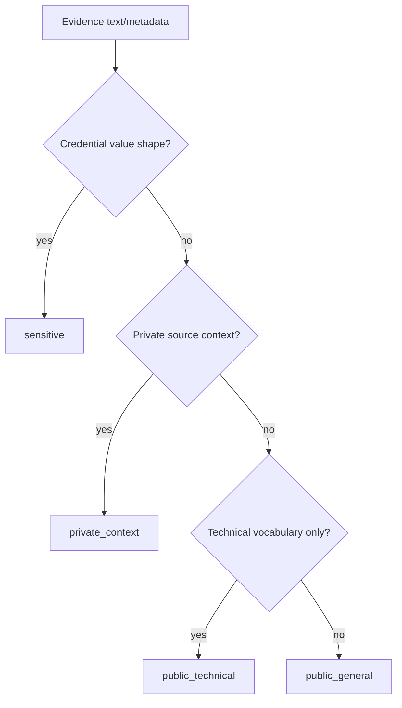
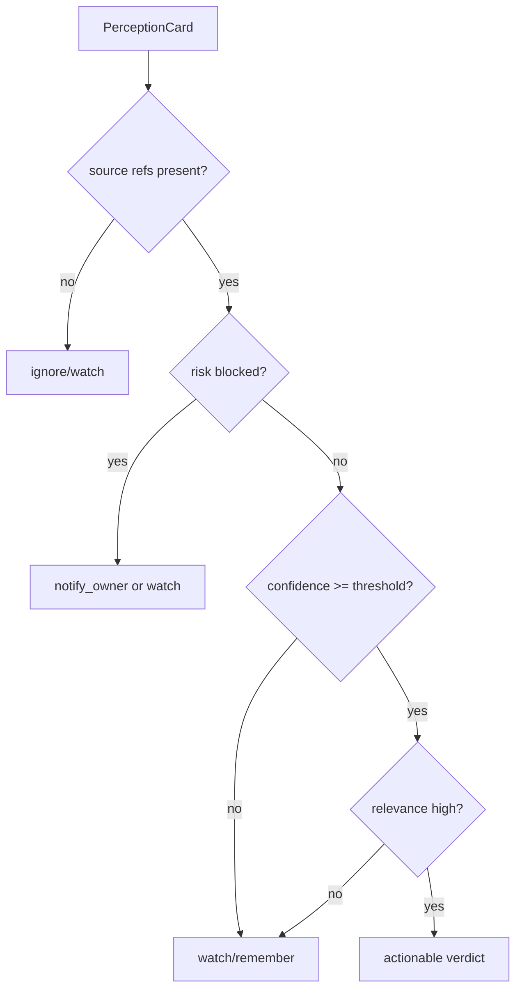

# Perception Judgment System — 实现细节 (L1)

> **文件性质**: L1 实现层 · **对应 L0**: [perception-judgment-system.md](./perception-judgment-system.md)
> 本文件只定义接口、枚举、reason code、决策规则与测试 fixture 形状；不写具体实现代码。

---

## 版本历史

| 版本 | 日期 | Changelog |
| --- | --- | --- |
| v1.0 | 2026-06-01 | 初始 L1：补接口、reason code、分类规则、契约测试输入形状。 |

## 本文件章节索引

| § | 章节 | 对应 L0 入口 |
| :---: | --- | :---: |
| §1 | [配置常量](#1-配置常量-config-constants) | L0 §6 |
| §2 | [核心数据结构完整定义](#2-核心数据结构完整定义-full-data-structures) | L0 §6 |
| §3 | [操作契约细化](#3-操作契约细化-operation-contract-details) | L0 §5 |
| §4 | [决策树详细逻辑](#4-决策树详细逻辑-decision-tree-details) | L0 §4 |
| §5 | [边缘情况与注意事项](#5-边缘情况与注意事项-edge-cases--gotchas) | L0 §5 / §9 |
| §6 | [测试辅助](#6-测试辅助-test-helpers) | L0 §11 |

---

## §1 配置常量 (Config Constants)

### §1.1 Bounded Runtime Defaults

| 名称 | 默认值 | 说明 |
| --- | ---: | --- |
| `PERCEPTION_MAX_EVIDENCE_PER_CYCLE` | 100 | 单 heartbeat 最多处理 evidence 数；超量写 `evidence_batch_truncated`。 |
| `PERCEPTION_MODEL_TIMEOUT_MS` | 8000 | summary assist 超时后降级 rules-only。 |
| `JUDGMENT_MODEL_TIMEOUT_MS` | 8000 | judgment assist 超时后输出 deferred 或 rules-only verdict。 |
| `MIN_EXTERNAL_ACTION_CONFIDENCE` | 0.70 | 低于该阈值不得产生 auto/draft external write verdict。 |
| `MIN_SOURCE_REFS_FOR_EXTERNAL_ACTION` | 1 | external write action 必须有 source refs。 |

### §1.2 Enumerations

| 枚举 | 值 |
| --- | --- |
| `SensitivityClass` | `public_technical`, `public_general`, `private_context`, `sensitive` |
| `NoveltyClass` | `new`, `changed`, `duplicate`, `stale` |
| `RelevanceClass` | `low`, `medium`, `high` |
| `RiskPosture` | `low`, `medium`, `high`, `blocked` |
| `PerceptionStageReason` | `ok`, `perception_rules_only`, `evidence_batch_empty`, `evidence_batch_truncated`, `model_timeout`, `redaction_blocked`, `state_unreadable` |
| `JudgmentStageReason` | `ok`, `missing_source_refs`, `low_confidence`, `risk_blocked`, `judgment_rules_only`, `model_timeout`, `no_actionable_signal` |

### §1.3 Shared Contracts

`PlatformNeutralActionKind` and `SourceRef` are defined in [shared-v8-contracts.md](./shared-v8-contracts.md). This system consumes those contracts and must not redefine action side-effect classes locally.

## §2 核心数据结构完整定义 (Full Data Structures)

### §2.1 Port Request / Result Types

```ts
interface PerceptionBuildRequest {
  cycleId: string;
  workspaceRoot: string;
  maxEvidence?: number;
  now: string;
}

interface PerceptionBuildResult {
  cycleId: string;
  status: "completed" | "rules_only" | "blocked" | "empty" | "degraded";
  cards: PerceptionCard[];
  reason: PerceptionStageReason;
  truncated: boolean;
}

interface JudgmentRequest {
  cycleId: string;
  perceptionCardIds: string[];
  acceptedGoalRefs: string[];
  acceptedMemoryProjectionRefs: string[];
  now: string;
}

interface JudgmentResult {
  cycleId: string;
  status: "completed" | "deferred" | "blocked" | "degraded";
  verdicts: JudgmentVerdict[];
  reason: JudgmentStageReason;
}
```

### §2.2 Entity Field Contracts

```ts
interface PerceptionCard {
  id: string;
  cycleId: string;
  evidenceRefs: [SourceRef, ...SourceRef[]];
  topic: string;
  entities: string[];
  novelty: NoveltyClass;
  relevance: RelevanceClass;
  summary: string;
  possibleIntents: PlatformNeutralActionKind[];
  reviewPriority?: "low" | "medium" | "high";
  sensitivityClass: SensitivityClass;
  riskFlags: string[];
  confidence: number;
  createdAt: string;
}

interface JudgmentVerdict {
  id: string;
  cycleId: string;
  perceptionCardId: string;
  verdict: PlatformNeutralActionKind;
  confidence: number;
  reason: string;
  sourceRefs: [SourceRef, ...SourceRef[]] | [];
  riskPosture: RiskPosture;
  candidateAction?: ActionProposalSeed;
  createdAt: string;
}
```

### §2.3 Invariants

| 编号 | Invariant |
| --- | --- |
| PJ-I1 | `PerceptionCard.evidenceRefs` 非空，除非 result status 为 `empty`。 |
| PJ-I2 | `JudgmentVerdict.sourceRefs` 缺失时，verdict 只能是 `ignore` 或 `watch`。 |
| PJ-I3 | `riskPosture = blocked` 时不得携带 `candidateAction`。 |
| PJ-I4 | `SensitivityClass.public_technical` 不允许包含 credential value。 |

## §3 操作契约细化 (Operation Contract Details)

### §3.1 buildPerceptionCards

| 项 | 规定 |
| --- | --- |
| 输入读取 | 从 state-memory 读取 pending/new/changed evidence，按 `contentHash` 去重。 |
| 正常输出 | 写入 `PerceptionCard[]`，每张 card 绑定 source refs 和 confidence。 |
| 空输入 | 返回 `status=empty`, `reason=evidence_batch_empty`，不得伪造 perception。 |
| 超量输入 | 裁剪到 `PERCEPTION_MAX_EVIDENCE_PER_CYCLE`，写 `evidence_batch_truncated`。 |
| model 不可用 | 使用 deterministic summary/rules，返回 `status=rules_only`。 |

### §3.2 classifyEvidenceSensitivity

| 条件 | 输出 |
| --- | --- |
| 只出现 `token` / `secret` / `credential` 等词，无 value-like shape | `public_technical` |
| 出现 `Bearer <high-entropy>`、private key header、assignment-like secret | `sensitive` + `credential_shape_detected` |
| 私信、私有 channel、用户未授权 raw content | `private_context` |
| 不确定但无明显 secret shape | `public_general` + `classification_low_confidence` |

### §3.3 runAgentJudgment

| 输入条件 | 允许 verdict |
| --- | --- |
| relevance low | `ignore`, `watch` |
| relevance high + source refs + low risk | `remember`, `notify_owner`, `draft_reply`, `auto_reply`, `draft_publish`, `auto_publish`, `run_connector` |
| source refs missing | `ignore`, `watch` only |
| confidence < `MIN_EXTERNAL_ACTION_CONFIDENCE` | no auto/draft external write |
| risk blocked | `watch` 或 `notify_owner`，不得外部写 |
| `remember` verdict | MUST set `reviewPriority` and emit source refs sufficient for `MemoryReviewCandidateClosure` |

### §3.4 emitPerceptionJudgmentHealth

| Stage | 成功事件 | 失败/降级事件 |
| --- | --- | --- |
| `perception` | `completed` with card count | `blocked`, `degraded`, `skipped` with reason |
| `judgment` | `completed` with verdict count | `blocked`, `degraded`, `skipped` with reason |

## §4 决策树详细逻辑 (Decision Tree Details)

### §4.1 Sensitivity Decision Tree



### §4.2 Judgment Decision Tree



## §5 边缘情况与注意事项 (Edge Cases & Gotchas)

| 场景 | 风险 | 处理方式 |
| --- | --- | --- |
| 相同 content hash 多次出现 | 重复 judgment 污染 action | 聚合成一张 card，并更新 freshness。 |
| ModelAssistPort 返回无 source grounding | 伪 grounding | 丢弃 model 输出，降级 rules-only。 |
| technical post 讨论 secret management | 误判泄密 | 必须看 value shape，不看关键词单点。 |
| evidence source 被删除 | source refs 断裂 | card 标记 `source_unavailable`，judgment 只能 watch/ignore。 |
| high relevance memory signal | 长期记忆路径被绕开 | 输出 `remember` 时只生成 review intent，不得直接写 projection。 |

## §6 测试辅助 (Test Helpers)

| Fixture | 用途 |
| --- | --- |
| `publicTechnicalTokenDiscussion` | 验证普通安全术语不触发 sensitive。 |
| `bearerTokenLeak` | 验证 value-like secret shape 被阻断。 |
| `highRelevanceMoltbookPost` | 验证 high relevance -> actionable verdict。 |
| `missingSourceRefsCard` | 验证 source refs 缺失只能 ignore/watch。 |
