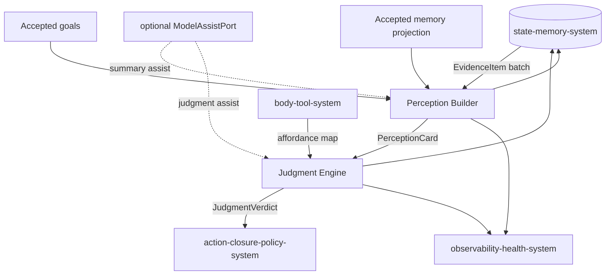
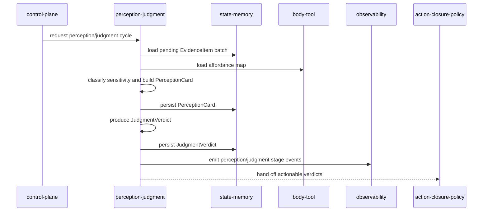
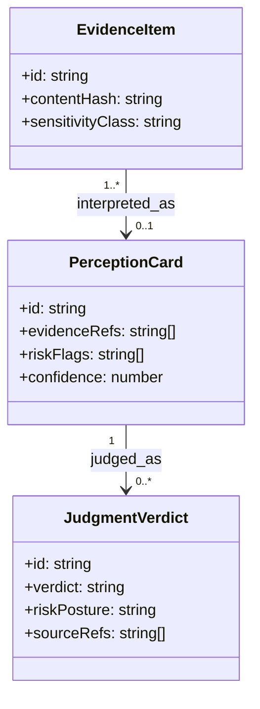
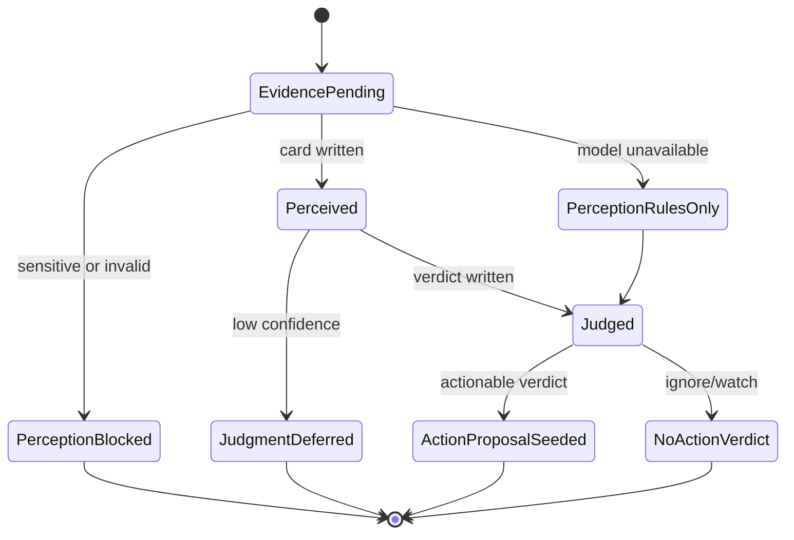

# Perception Judgment System 系统设计文档 (L0)

| 字段 | 值 |
| --- | --- |
| **System ID** | `perception-judgment-system` |
| **Project** | Second Nature |
| **Version** | v8.0 |
| **Status** | `Draft` |
| **Author** | Nyx / Codex |
| **Date** | 2026-06-01 |
| **L1 Detail** | [perception-judgment-system.detail.md](./perception-judgment-system.detail.md) |

## 1. 概览 (Overview)

### 1.1 System Purpose

`perception-judgment-system` 把 source-backed `EvidenceItem` 变成 Nyx 可读的 `PerceptionCard`，再由 Nyx 基于 perception 产出 `JudgmentVerdict`。它解决 v7 evidence 增长但 agent 不知道“发生了什么、该不该关心”的语义断点。

### 1.2 System Boundary

- **输入**: `EvidenceItem`、accepted goals、accepted long-term memory projection、ToolAffordance、bounded context、optional `ModelAssistPort`。
- **输出**: `PerceptionCard`、`JudgmentVerdict`、risk flags、source-backed reason、stall reason；shared action/source-ref contracts 见 [shared-v8-contracts.md](./shared-v8-contracts.md)。
- **依赖系统**: `state-memory-system`, `body-tool-system`, `observability-health-system`, optional ModelAssistPort。
- **被依赖系统**: `control-plane-system`, `action-closure-policy-system`, `guidance-voice-system`, `observability-health-system`。

### 1.3 System Responsibilities

**负责**:
- 将 evidence 聚合、去重、解释为 `PerceptionCard`。[REQ-002]
- 生成 agent-authored `JudgmentVerdict`，覆盖 ignore、watch、remember candidate、notify、draft、reply、publish、run_connector。[REQ-003]
- 区分 public technical vocabulary 与 credential-shaped risk。[REQ-007]
- 在 model assist 不可用时输出 rules-only perception/judgment 与明确降级原因。

**不负责**:
- 不执行 connector 或外部写动作；由 `connector-system` 在 policy allow 后执行。
- 不决定 action 是否允许；由 `action-closure-policy-system` 生成 `ActionPolicyDecision`。
- 不写长期记忆；长期记忆只由 `dream-quiet-memory-system` 形成。
- 不编排 heartbeat；由 `control-plane-system` 调度本系统。

## 2. 目标与非目标 (Goals & Non-Goals)

### 2.1 Goals

- **[G1]**: 新增或变化的 `EvidenceItem` 在 2 个 heartbeat 周期内生成 `PerceptionCard` 或明确 `perception_stall_reason`。[REQ-002]
- **[G2]**: `JudgmentVerdict` 必须包含 source refs、reason、confidence、candidate action 或 no-action verdict。[REQ-003]
- **[G3]**: 普通 `token`、`secret`、`credential` 技术词汇不得单独触发 sensitive block。[REQ-007]
- **[G4]**: 低置信度、缺 source refs 或敏感风险未清时不得产生 external write action verdict。[REQ-003], [REQ-007]

### 2.2 Non-Goals

- **[NG1]**: 不为 MoltBook、InStreet 或任何未来平台写专属判断脑。
- **[NG2]**: 不绕过 `ActionPolicyDecision` 直接执行 auto reply/publish。
- **[NG3]**: 不把 `PerceptionCard` 直接升级为长期记忆。

## 3. 背景与上下文 (Background & Context)

### 3.1 Why This System?

v8 的主目标是 `EvidenceItem -> PerceptionCard -> JudgmentVerdict -> ActionProposal -> ActionPolicyDecision -> ActionClosureRecord`。本系统负责前半段语义 spine，对应 [REQ-001], [REQ-002], [REQ-003], [REQ-007]。

### 3.2 Current State

v7 可以通过 connector 写入 life evidence，但机制审计指出 evidence 常被压缩为平台与 intent 摘要，缺少 agent-readable meaning。现有 outreach judgment 是局部能力，不是所有平台通用的 perception/judgment spine。

### 3.3 Constraints

- **技术约束**: TypeScript / Node / OpenClaw runtime 内演进；数据通过 `state-memory-system` 读写。
- **性能约束**: perception/judgment 不得阻塞 heartbeat 超过 30s；超时降级为 rules-only 或 defer。
- **安全约束**: 不暴露 raw credential、raw private content 或 raw prompt；risk flags 必须区分 public technical 与 value-like secret shape。

## 4. 系统架构 (Architecture)

### 4.1 Architecture Diagram



### 4.2 Core Components

| Component | Responsibility | Notes |
| --- | --- | --- |
| `EvidenceBatchSelector` | 读取待处理 evidence，按 content hash、source refs、freshness 去重 | 只读 state，不持久化 raw payload |
| `SensitivityClassifier` | 输出 `public_technical`、`credential_shape_detected`、`sensitive_blocked` 等 flags | 关键词不是充分条件 |
| `PerceptionBuilder` | 生成 topic、entities、novelty、relevance、summary、possible intents | rules-first，可用 ModelAssistPort |
| `JudgmentEngine` | 生成 `JudgmentVerdict` 与 candidate action | agent-authored, source-backed |
| `PerceptionJudgmentTraceEmitter` | 发出 stage event 与 stall reason | 供 causal loop health 消费 |

### 4.3 Data Flow



**关键数据流说明**:
1. Evidence 先形成 `PerceptionCard`，再进入 judgment；不得从 raw connector result 直接生成 write action。
2. `JudgmentVerdict` 可以是 ignore/watch/no_action，仍要写入 reason，供 closure 与 health 使用。

## 5. 接口设计 (Interface Design)

### 5.1 操作契约表

| 操作 | [REQ] | 前置条件 | 消耗/输入 | 产出/副作用 | 实现细节 |
| --- | :---: | --- | --- | --- | --- |
| `buildPerceptionCards(cycleId)` | [REQ-002], [REQ-007] | pending evidence exists; state readable | EvidenceItem batch, goals, memory projection | writes `PerceptionCard[]` or `perception_rules_only`/stall reason | [L1 §3.1](./perception-judgment-system.detail.md#31-buildperceptioncards) |
| `classifyEvidenceSensitivity(evidenceId)` | [REQ-007] | evidence has text or metadata summary | content shape, field context, source kind | risk flags and `sensitivityClass` | [L1 §3.2](./perception-judgment-system.detail.md#32-classifyevidencesensitivity) |
| `runAgentJudgment(perceptionCardId)` | [REQ-003] | perception card has source refs | perception, goals, affordance, memory | writes `JudgmentVerdict` | [L1 §3.3](./perception-judgment-system.detail.md#33-runagentjudgment) |
| `emitPerceptionJudgmentHealth(cycleId)` | [REQ-008] | stage outcome exists | stage result, latency, reason | stage events for loop health | [L1 §3.4](./perception-judgment-system.detail.md#34-emitperceptionjudgmenthealth) |

### 5.2 跨系统接口协议

```ts
interface PerceptionJudgmentPort {
  buildPerceptionCards(input: PerceptionBuildRequest): Promise<PerceptionBuildResult>;
  runJudgment(input: JudgmentRequest): Promise<JudgmentResult>;
}

interface PerceptionJudgmentStatePort {
  loadPendingEvidence(query: PendingEvidenceQuery): Promise<EvidenceItem[]>;
  writePerceptionCards(cards: PerceptionCard[]): Promise<void>;
  writeJudgmentVerdicts(verdicts: JudgmentVerdict[]): Promise<void>;
}
```

### 5.3 HTTP API 端点摘要

N/A - 本系统不暴露 HTTP API；由 runtime ops/control-plane 通过内部 port 调用。

## 6. 数据模型 (Data Model)

### 6.1 核心实体

```ts
type SensitivityClass = "public_technical" | "public_general" | "private_context" | "sensitive";

interface PerceptionCard {
  id: string;
  cycleId: string;
  evidenceRefs: SourceRef[];
  topic: string;
  entities: string[];
  novelty: "new" | "changed" | "duplicate" | "stale";
  relevance: "low" | "medium" | "high";
  summary: string;
  possibleIntents: PlatformNeutralActionKind[];
  reviewPriority?: "low" | "medium" | "high";
  riskFlags: string[];
  confidence: number;
  createdAt: string;
}

interface JudgmentVerdict {
  id: string;
  perceptionCardId: string;
  verdict: "ignore" | "watch" | "remember" | "notify_owner" | "draft_reply" | "auto_reply" | "draft_publish" | "auto_publish" | "run_connector";
  confidence: number;
  reason: string;
  sourceRefs: SourceRef[];
  riskPosture: "low" | "medium" | "high" | "blocked";
  candidateAction?: ActionProposalSeed;
  createdAt: string;
}
```

### 6.2 实体关系图



### 6.3 状态机



## 7. 技术选型 (Technology Stack)

| Domain | Choice | Rationale |
| --- | --- | --- |
| Runtime | TypeScript / Node.js | 继承 ADR-001，复用 v7 runtime。 |
| Summarization | rules-first + optional ModelAssistPort | model 不可用时仍有 deterministic fallback。 |
| Persistence | state-memory ports | 本系统不直接拥有 SQLite schema。 |
| Observability | stage event emission | 支撑 ADR-005 causal loop health。 |

## 8. Trade-offs & Alternatives

### 8.1 Living loop spine

> **决策来源**: [ADR-002: Introduce the Living Perception Loop](../03_ADR/ADR_002_LIVING_PERCEPTION_LOOP.md)
>
> 本系统实现 `EvidenceItem -> PerceptionCard -> JudgmentVerdict`，不复制 ADR 决策理由。

### 8.2 Platform-neutral judgment

> **决策来源**: [ADR-004: Use Platform-Neutral Autonomy Policy](../03_ADR/ADR_004_PLATFORM_NEUTRAL_AUTONOMY_POLICY.md)
>
> Judgment 输出 platform-neutral action kind；平台差异只作为 constraints/risk 输入。

### 8.3 Rules-first + optional model assist

**Option A: LLM-first judgment**
- **优点**: 语义能力强。
- **缺点**: redaction、延迟、不可用和可审计性风险高。

**Option B: Rules-first with optional model assist (Selected)**
- **优点**: 可降级、可测、符合 30s heartbeat 约束。
- **缺点**: 需要持续维护 fixture 与 scoring。

**Decision**: 选择 Option B；模型只能增强 summary/judgment，不是唯一执行路径。

## 9. 安全性考虑 (Security Considerations)

| Risk | Severity | Mitigation |
| --- | :---: | --- |
| public technical 被误判 sensitive | High | shape/context/entropy 组合判定，关键词只作为弱信号。 |
| raw private content 进入 model assist | High | state/observability redaction gate 前置；blocked 时输出 rules-only 或 stall reason。 |
| low-confidence judgment 触发 write action | High | 缺 source refs、低 confidence 或 high risk 时只允许 ignore/watch/draft-level verdict。 |
| platform-specific behavior 泄漏进 judgment | Medium | action kind 使用 platform-neutral taxonomy，平台约束交给 policy gate。 |

## 10. 性能考虑 (Performance Considerations)

- 单轮 perception/judgment 总预算默认不超过 heartbeat 30s。
- Evidence batch 需要按 freshness 和 content hash bounded load，超量时记录 truncation reason。
- ModelAssistPort 必须有 timeout；超时输出 `perception_rules_only` 或 `judgment_deferred_model_timeout`。

## 11. 测试策略 (Testing Strategy)

### 11.1 Unit Testing

- public technical fixture 中包含 `token`、`secret`、`credential` 词汇但无真实值时 classified as `public_technical`。
- `Bearer <high-entropy-token>`、private key header、assignment-like secret 被标记 sensitive。
- 低 confidence 或缺 source refs 的 judgment 不产生 external write action。

### 11.2 Integration Testing

- MoltBook read fixture -> `EvidenceItem` -> `PerceptionCard` -> `JudgmentVerdict`。
- ModelAssistPort timeout -> rules-only perception -> stage event emitted。
- Duplicate evidence -> one aggregated perception card。

### 11.3 Contract Verification Matrix

| 契约 | 风险级别 | 正常态验证 | 失败态验证 | 回归责任 |
| --- | --- | --- | --- | --- |
| `buildPerceptionCards` | P0 | Evidence batch produces cards with source refs | model unavailable returns rules-only reason | perception unit + integration |
| `runAgentJudgment` | P0 | high relevance card produces sourced verdict | missing source refs downgrades to ignore/watch | judgment unit |
| sensitivity classification | P1 | public technical stays non-sensitive | credential-shaped value blocks raw exposure | classifier fixtures |

## 12. 部署与运维 (Deployment & Operations)

N/A - 本系统作为 runtime 内部模块部署，运维面由 `runtime-ops-system` 与 `observability-health-system` 暴露。

## 13. 未来考虑 (Future Considerations)

- 可引入 per-domain relevance calibrator，但不得变成平台专属判断脑。
- 可缓存 stable `PerceptionCard`，但 cache 命中必须保留 source refs 与 freshness。

## 14. Appendix (附录)

### 14.1 Research

- [_research/perception-judgment-system-research.md](./_research/perception-judgment-system-research.md)
- [perception-judgment-system.detail.md](./perception-judgment-system.detail.md)
- [shared-v8-contracts.md](./shared-v8-contracts.md)

### 14.2 未决问题

无。
