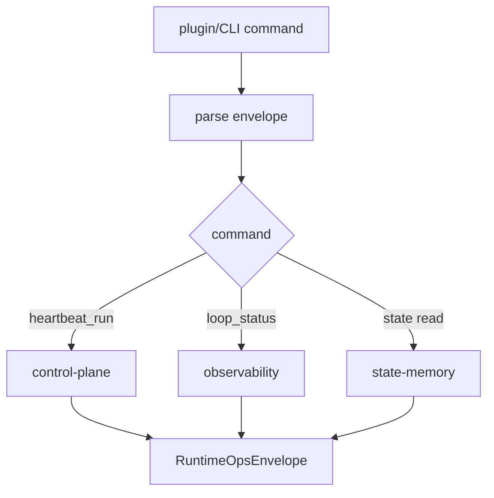

# Runtime Ops System 系统设计文档 (L0)

| 字段 | 值 |
| --- | --- |
| **System ID** | `runtime-ops-system` |
| **Project** | Second Nature |
| **Version** | v8.0 |
| **Status** | `Draft` |
| **Author** | Nyx / Codex |
| **Date** | 2026-06-01 |

## 1. 系统职责与非职责

`runtime-ops-system` 是 OpenClaw plugin、CLI 和 owner/operator 可见 ops surface。它暴露命令、返回 JSON-first envelope，不拥有语义判断。

**负责**:
- 暴露 `heartbeat_run`, `loop_status`, connector run, Quiet/Dream status, restore/package diagnostics。
- 传入 workspace/env/channel context，调用 control/state/observability 窄接口。
- 保证 ops response 可审计、可 redaction、可机器读取。

**不负责**:
- 不决定 action。
- 不修改 policy 结果。
- 不直接读取 raw credential 明文。
- 不把健康诊断包装成“agent 判断”。

## 2. 输入/输出契约

| 方向 | 契约 |
| --- | --- |
| 输入 | plugin tool call, CLI args, workspaceRoot, env, host cadence hint, optional host capability discovery ports |
| 输出 | `RuntimeOpsEnvelope`, command result, diagnostic reason code |
| 共享契约 | heartbeat rhythm, degraded response, loop status reason registry |

```ts
interface RuntimeOpsEnvelope<T> {
  ok: boolean;
  command: string;
  evidenceLevel: "carrier_ack" | "contract_smoke" | "state_present" | "real_runtime" | "durable_verified";
  result?: T;
  degraded?: DegradedOperationResult;
  generatedAt: string;
}
```

`ok=true` only means the command envelope was produced. It must not be interpreted as real living-loop health unless `evidenceLevel` is `real_runtime` or `durable_verified` and `loop_status` agrees.

## 3. 核心数据模型

| 模型 | 说明 |
| --- | --- |
| `RuntimeOpsEnvelope` | all ops response wrapper。 |
| `LoopStatusCommandResult` | causal loop health read model。 |
| `HeartbeatRunCommandResult` | manual/scheduled heartbeat result。 |

### 3.1 Host Reality Setup State

Runtime setup is complete only when host-visible surfaces are actually available:

- `second_nature_ops` must be visible in the host tool list, or ops must report `host_tool_unavailable` with an owner next action.
- Packaged `SKILL.md` is not enough; the skill must be discoverable by the host skill registry or reported as `skill_projection_unavailable`.
- `setup/agent-inner-guide-ack.json` with `placedIn: "unspecified"` is an incomplete ack, not a success state.

```ts
interface HostCapabilityDiscoveryPort {
  listHostTools(): Promise<HostToolDiscoveryResult>;
  listHostSkills?(): Promise<HostSkillDiscoveryResult>;
}

interface HostToolDiscoveryResult {
  status: "available" | "unavailable" | "unsupported" | "blocked";
  tools: string[];
  hostName?: string;
  hostVersion?: string;
  observedAt: string;
  reason?: "host_tool_unavailable" | "host_probe_unsupported" | "host_policy_blocked" | "host_probe_timeout";
}

interface HostSkillDiscoveryResult {
  status: "available" | "unavailable" | "unsupported" | "blocked";
  skills: string[];
  observedAt: string;
  reason?: "skill_projection_unavailable" | "skill_probe_unsupported" | "host_policy_blocked" | "host_probe_timeout";
}
```

Probe rules:

- If the host probe is unsupported or blocked, setup remains incomplete and the runtime reports the precise reason; it must not silently promote to `real_runtime`.
- `second_nature_ops` visibility is proven only by `listHostTools().tools` containing `second_nature_ops` in the current host session.
- Skill projection is proven only by `listHostSkills().skills` containing the Second Nature skill id or by a host-provided equivalent discovery proof.
- Carrier fallback without a host probe is capped at `evidenceLevel=carrier_ack` for setup and at `contract_smoke` for plugin package checks.

### 3.2 SetupAck Schema

```ts
interface SetupAck {
  schemaVersion: 1;
  acknowledgedAt: string;
  placedIn: "workspace_guide" | "host_skill_registry" | "agent_profile" | "manual_operator_instruction";
  placementProofRef: string;
  writer: "setup_ack_command" | "host_setup_bridge";
  hostName?: string;
  hostVersion?: string;
}
```

Setup ack rules:

- `placedIn: "unspecified"`, missing `placementProofRef`, unknown `writer`, or missing `schemaVersion` means setup is incomplete.
- Only the setup command or host setup bridge may create a complete ack; hand-written files are treated as `state_present` evidence until verified by host discovery.
- `setup_hint` may return package content, but setup completion requires either host discovery proof or a blocked diagnostic with owner next action.

### 3.3 Operator Command Evidence Caps

| Command/path | Required operator model | Evidence cap unless proven |
| --- | --- | --- |
| `heartbeat_run` / `heartbeat_check` | v8 living-loop cycle only | `real_runtime` only when v8 `cycleId` has stage + final closure proof. |
| legacy v7 heartbeat request | rejected command surface | `carrier_ack` at most for the rejection envelope; no cycle produced. |
| `setup_hint` | package/setup guidance | `carrier_ack` or `contract_smoke`; never setup complete. |
| `setup_ack` | setup state mutation | `state_present` until host discovery confirms placement. |
| `loop_status` | causal health read model | minimum of required stage evidence levels. |

## 4. 状态机/流程图



## 5. 依赖关系

| 依赖 | 用途 |
| --- | --- |
| `control-plane-system` | heartbeat run。 |
| `state-memory-system` | state/package diagnostics。 |
| `observability-health-system` | loop status and redacted diagnostics。 |
| HostCapabilityDiscoveryPort | optional host tool/skill registry proof; unavailable hosts produce explicit blocked diagnostics。 |

## 6. 错误/降级/安全边界

- Command exceptions return `ok=false` or degraded envelope; no unstructured throw to host.
- Carrier/plugin acknowledgements must use `evidenceLevel=carrier_ack` or `contract_smoke`; they cannot claim real runtime health.
- `heartbeatCadenceHintMs` is diagnostic only; does not define heartbeat-count SLA.
- Runtime secret location may be referenced, never printed.
- Raw audit/private payload must be redacted before response.

## 7. 测试策略

| 层级 | 覆盖 |
| --- | --- |
| API | command success/error/degraded envelopes。 |
| 集成 | `loop_status` healthy/stalled/blocked/degraded fixtures。 |
| 冒烟 | plugin registration and command routing。 |
| 手动 E2E | hostName, hostVersion, timestamp, raw tool list JSON, raw skill list/probe result, command envelope, and evidenceLevel. |

## 8. Trade-offs

- **JSON-first ops**: 延续 ADR-001 plugin/CLI runtime，便于 host 和 tests 消费。
- **Diagnostics not brain**: 遵循 ADR-005，ops explain loop health but cannot decide actions.
- **Cadence hint as display**: 修复 CH-08 的时间口径问题，避免不同 host 频率改变 stalled 判定。

## 9. 未决问题

无
