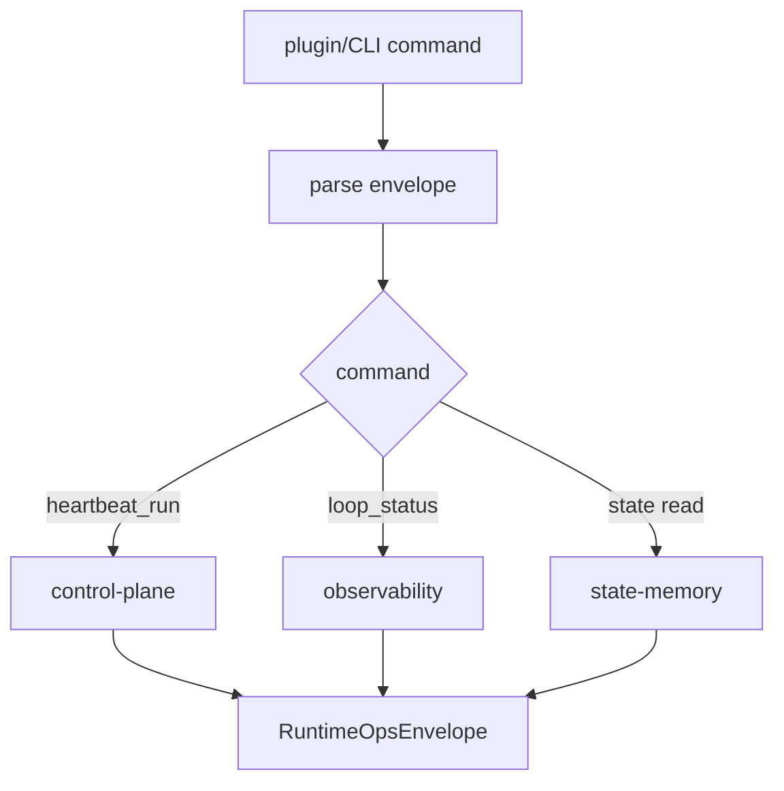

# Runtime Ops System 系统设计文档 (L0)

| 字段 | 值 |
| --- | --- |
| **System ID** | `runtime-ops-system` |
| **Project** | Second Nature |
| **Version** | v8.0 |
| **Status** | `Draft` |
| **Author** | Nyx / Codex |
| **Date** | 2026-06-01 |

## 1. 系统职责与非职责

`runtime-ops-system` 是 OpenClaw plugin、CLI 和 owner/operator 可见 ops surface。它暴露命令、返回 JSON-first envelope，不拥有语义判断。

**负责**:
- 暴露 `heartbeat_run`, `loop_status`, connector run, Quiet/Dream status, restore/package diagnostics。
- 传入 workspace/env/channel context，调用 control/state/observability 窄接口。
- 保证 ops response 可审计、可 redaction、可机器读取。

**不负责**:
- 不决定 action。
- 不修改 policy 结果。
- 不直接读取 raw credential 明文。
- 不把健康诊断包装成“agent 判断”。

## 2. 输入/输出契约

| 方向 | 契约 |
| --- | --- |
| 输入 | plugin tool call, CLI args, workspaceRoot, env, host cadence hint |
| 输出 | `RuntimeOpsEnvelope`, command result, diagnostic reason code |
| 共享契约 | heartbeat rhythm, degraded response, loop status reason registry |

```ts
interface RuntimeOpsEnvelope<T> {
  ok: boolean;
  command: string;
  result?: T;
  degraded?: DegradedOperationResult;
  generatedAt: string;
}
```

## 3. 核心数据模型

| 模型 | 说明 |
| --- | --- |
| `RuntimeOpsEnvelope` | all ops response wrapper。 |
| `LoopStatusCommandResult` | causal loop health read model。 |
| `HeartbeatRunCommandResult` | manual/scheduled heartbeat result。 |

## 4. 状态机/流程图



## 5. 依赖关系

| 依赖 | 用途 |
| --- | --- |
| `control-plane-system` | heartbeat run。 |
| `state-memory-system` | state/package diagnostics。 |
| `observability-health-system` | loop status and redacted diagnostics。 |

## 6. 错误/降级/安全边界

- Command exceptions return `ok=false` or degraded envelope; no unstructured throw to host.
- `heartbeatCadenceHintMs` is diagnostic only; does not define heartbeat-count SLA.
- Runtime secret location may be referenced, never printed.
- Raw audit/private payload must be redacted before response.

## 7. 测试策略

| 层级 | 覆盖 |
| --- | --- |
| API | command success/error/degraded envelopes。 |
| 集成 | `loop_status` healthy/stalled/blocked/degraded fixtures。 |
| 冒烟 | plugin registration and command routing。 |

## 8. Trade-offs

- **JSON-first ops**: 延续 ADR-001 plugin/CLI runtime，便于 host 和 tests 消费。
- **Diagnostics not brain**: 遵循 ADR-005，ops explain loop health but cannot decide actions.
- **Cadence hint as display**: 修复 CH-08 的时间口径问题，避免不同 host 频率改变 stalled 判定。

## 9. 未决问题

无
