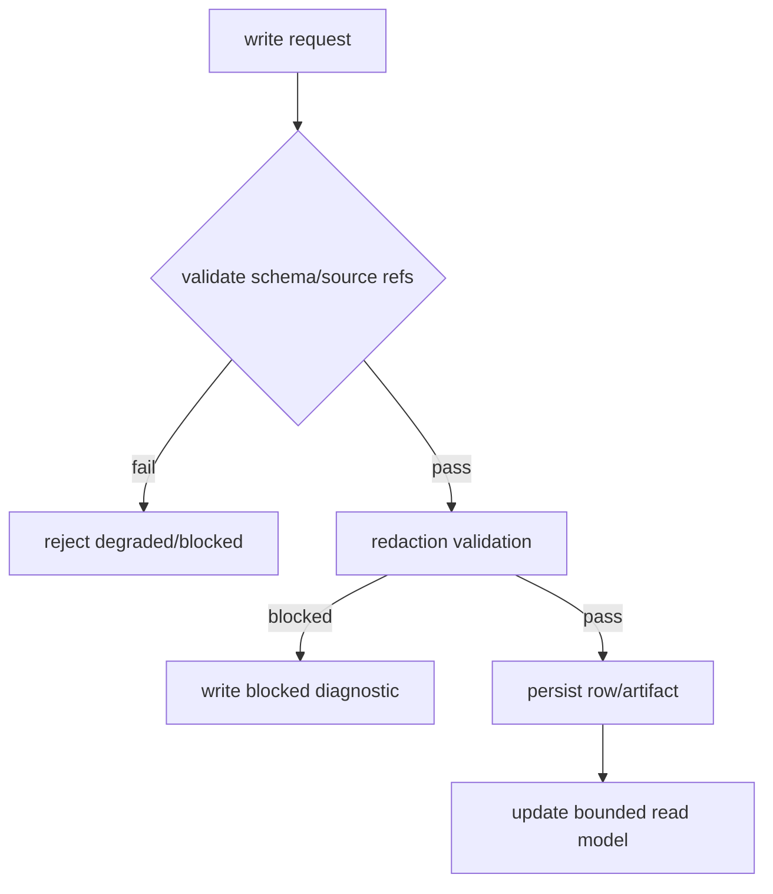

# State Memory System 系统设计文档 (L0)

| 字段 | 值 |
| --- | --- |
| **System ID** | `state-memory-system` |
| **Project** | Second Nature |
| **Version** | v8.0 |
| **Status** | `Draft` |
| **Author** | Nyx / Codex |
| **Date** | 2026-06-01 |

## 1. 系统职责与非职责

`state-memory-system` 是 v8 生活闭环的持久化和 bounded read model 层。它存事实、状态和投影生命周期，不决定事实的语义价值。

**负责**:
- 持久化 `EvidenceItem`, `PerceptionCard`, `JudgmentVerdict`, `ActionClosureRecord`, `QuietDailyReview`, `DreamConsolidationRun`, `LongTermMemoryProjection`。
- 提供 heartbeat/perception/action/Dream/ops 的 bounded read models。
- 执行 write validation、redaction-safe persistence 和 restore snapshot。

**不负责**:
- 不判断 evidence 是否重要。
- 不直接形成长期记忆；只存储 Dream/Quiet 输出和 accepted projection。
- 不决定 action 是否允许。
- 不把 raw credential 或 raw private content 写入 artifacts。
- 不解释 `EvidenceItem.payloadJson` 的语义；只负责其 schema 与 redaction 校验。

## 2. 输入/输出契约

| 方向 | 契约 |
| --- | --- |
| 输入 | state write request, source-backed artifact, lifecycle mutation, restore request |
| 输出 | read model, projection row, snapshot, degraded state result |
| 共享契约 | `SourceRef`, `DegradedOperationResult`, reason-code registry |

```ts
interface StateWriteRequest<T> {
  family: SourceRef["family"];
  entity: T;
  sourceRefs: SourceRef[];
  redactionClass: SourceRef["redactionClass"];
}

interface StateReadResult<T> {
  status: "ok" | "empty" | "degraded";
  rows: T[];
  degraded?: DegradedOperationResult;
}
```

## 3. 核心数据模型

| 模型 | 写入方 | 读取方 |
| --- | --- | --- |
| `EvidenceItem` | connector normalization | perception, observability |
| `PerceptionCard` | perception | judgment, Quiet, loop status |
| `JudgmentVerdict` | judgment | action, guidance |
| `ActionClosureRecord` | action closure | Quiet, observability |
| `QuietDailyReview` | Dream/Quiet | Dream, ops |
| `DreamConsolidationRun` | Dream | projection, loop status |
| `LongTermMemoryProjection` | Dream projection lifecycle | control-plane context |

## 4. 状态机/流程图



## 5. 依赖关系

| 依赖 | 用途 |
| --- | --- |
| SQLite/sql.js | indexed state and read model。 |
| Markdown/JSON workspace artifacts | human-inspectable durable artifacts。 |
| `observability-health-system` | audit, redaction diagnostics, health events。 |

## 6. 错误/降级/安全边界

- State unreadable returns `DegradedOperationResult(reason=state_unreadable)`; callers must not report healthy.
- Writes with unresolved `SourceRef` are rejected or stored as blocked diagnostic, not silently accepted.
- Accepted memory projection read model only exposes `status=accepted|active`; candidates are not injected into EmbodiedContext.
- Restore snapshot may roll back state rows, but not rewrite challenge/ADR/design history.
- `write_validation_gate` must not treat stable identifiers (UUID, runId, sourceRef URI fragments) as secret leakage; field-level attribution is required when a scan fails.

## 7. 测试策略

| 层级 | 覆盖 |
| --- | --- |
| 单元 | schema validation, source ref validation, redaction block, UUID/sourceRef ID not treated as secret。 |
| API | before/after write-read assertions for all v8 families; evidence dedupe by externalId/contentHash。 |
| 集成 | closure -> content-bearing Quiet input, Dream candidate -> accepted projection read model。 |

## 8. Trade-offs

- **事实存储与语义决策分离**: 遵循 ADR-003，state 存储 memory lifecycle，但不决定什么是长期记忆。
- **Markdown/JSON + SQLite 双轨**: 延续 ADR-001 栈内演进，提升可审计性但需要 schema/artifact 一致性测试。
- **bounded read models**: 降低 context 污染风险，代价是需要明确 projection 查询接口。
- **content-bearing payload without full-text capture**: `EvidenceItem.payloadJson` 保存摘要与 sourceRefs，不默认保存全文；全文走可选 `rawContentRef`。

## 9. 未决问题

- v7 `LifeEvidence` artifact 双写保留多久？（当前 decision: Wave 109 双写兼容，后续 version 再评估是否淘汰）
