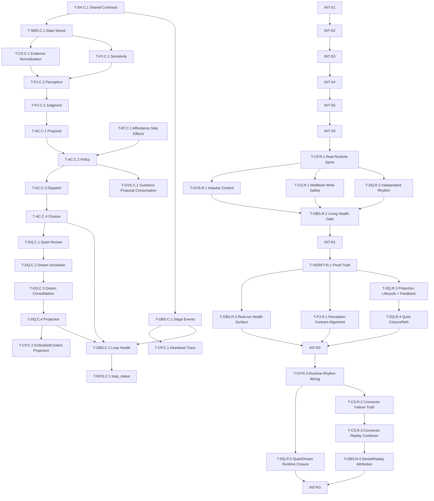

# 05A_TASKS.md — 执行主清单

> 版本: v8
> 产出自: /blueprint
> 最后更新: 2026-06-11
>
> 验证计划: [05B_VERIFICATION_PLAN.md](./05B_VERIFICATION_PLAN.md)

---

## 依赖图总览

---

## Sprint 路线图

| Sprint | 代号 | 核心任务 | 退出标准 | 预估 |
| --- | --- | --- | --- | --- |
| S1 | Contract Spine | Shared contracts + state/event foundations | shared action/source/cycle/reason contracts compile and persistable stores exist | 3-4d |
| S2 | See and Judge | Evidence normalization + perception + judgment | connector read fixture produces `PerceptionCard` and `JudgmentVerdict` with source refs | 4-5d |
| S3 | Act and Close | proposal + policy + dispatch + closure | every heartbeat path writes closure or no-action reason | 4-5d |
| S4 | Remember by Quiet/Dream | Quiet review + Dream + projection | closure/day slice produces accepted projection loadable by context | 5-6d |
| S5 | Explain the Loop | causal health + loop_status + guidance integration | `loop_status` identifies stalled stages and policy-denied closures correctly | 4-5d |
| S6 | Living Loop Gate | full chain regression | connector read -> memory projection -> next context passes with report | 2-3d |
| S7 | Runtime Activation Repair | real heartbeat spine + impulse context + safe write + multi-rhythm | real workspace heartbeat produces closure/Quiet/Dream/context evidence, not only contract smoke | 4-6d |
| S8 | Proof and Memory Closure | proof truth + real-run health surface + perception contract + memory feedback | runtime proof cannot false-green, and accepted memory feeds the next heartbeat context | 3-5d |
| S9 | Runtime Recovery Closure | heartbeat-rhythm wiring + connector failure truth + replay control | real heartbeat advances closure -> Quiet/Dream or reports a precise blocked reason without infinite connector replay | 2-4d |

---

## System 0: Shared v8 Contracts

### Phase C: Core

- [x] **T-SH.C.1** [REQ-003, REQ-004, REQ-008, REQ-009]: Implement shared v8 contract types
  - **描述**: Define the shared action taxonomy, `SourceRef`, `HeartbeatCycleTrace`, `LoopStageEvent`, `MemoryReviewCandidateClosure`, heartbeat rhythm, degraded operation response, and `V8ReasonCode` contracts.
  - **输入**: `04_SYSTEM_DESIGN/shared-v8-contracts.md`, `04_SYSTEM_DESIGN/action-closure-policy-system.detail.md §1`, `04_SYSTEM_DESIGN/observability-health-system.detail.md §2`
  - **输出**: shared TypeScript contract module and exported test fixtures.
  - **契约承接**: `PlatformNeutralActionKind`, `SourceRef`, `HeartbeatCycleTrace`, `LoopStageEvent`, `MemoryReviewCandidateClosure`, `DegradedOperationResult`, heartbeat rhythm contract, `V8ReasonCode`
  - **参考**: `03_ADR/ADR_002_LIVING_PERCEPTION_LOOP.md`, `03_ADR/ADR_004_PLATFORM_NEUTRAL_AUTONOMY_POLICY.md`, `03_ADR/ADR_005_CAUSAL_LOOP_HEALTH.md`
  - **验收标准**:
    - Given shared contract fixtures
    - When TypeScript compiles and contract tests run
    - Then action side effects, source refs, cycle sequence, degraded response, memory-review closure, and reason codes validate consistently
  - **验证类型**: 单元测试 / 编译检查
  - **E2E触发设想**: 不触发 E2E。
  - **验证摘要**: Validate enum compatibility, required fields, heartbeat rhythm, degraded response, and invalid shape rejection.
  - **验证引用**: `05B_VERIFICATION_PLAN.md#t-sh-c-1`
  - **证据产出**: `tests/unit/contracts/v8-shared-contracts.test.ts`, `logs/tsc-v8-contracts.log`
  - **估时**: 6h
  - **依赖**: 无
  - **优先级**: P0

- [x] **INT-S1** [MILESTONE]: S1 集成验证 — Contract Spine
  - **描述**: Verify shared contracts and state/event foundations are ready for downstream systems.
  - **输入**: T-SH.C.1, T-SMS.C.1, T-OBS.C.1 outputs
  - **输出**: `reports/int-s1-v8-contract-spine.md`
  - **契约承接**: Sprint S1 exit gate
  - **参考**: `04_SYSTEM_DESIGN/shared-v8-contracts.md`
  - **验收标准**:
    - Given S1 tasks are complete
    - When contract/store/event smoke checks run
    - Then shared fixtures persist and validate without schema drift
  - **验证类型**: 冒烟测试 / 集成测试 / 编译检查
  - **E2E触发设想**: 不触发 E2E。
  - **验证摘要**: Validate S1 exit criteria and produce an integration report.
  - **验证引用**: `05B_VERIFICATION_PLAN.md#int-s1`
  - **证据产出**: `reports/int-s1-v8-contract-spine.md`
  - **估时**: 3h
  - **依赖**: T-SH.C.1, T-SMS.C.1, T-OBS.C.1
  - **优先级**: P0

---

## System 5: state-memory-system

### Phase C: Core

- [x] **T-SMS.C.1** [REQ-001, REQ-002, REQ-003, REQ-005, REQ-008, REQ-009]: Add v8 living-loop stores and read models
  - **描述**: Persist EvidenceItem, PerceptionCard, JudgmentVerdict, ActionClosureRecord, QuietDailyReview, DreamConsolidationRun, MemoryProjection, HeartbeatCycleTrace, and LoopStageEvent.
  - **输入**: `02_ARCHITECTURE_OVERVIEW.md §System 5`, `04_SYSTEM_DESIGN/shared-v8-contracts.md`, T-SH.C.1 output
  - **输出**: state store modules, migrations/schema entries, bounded read-model ports.
  - **契约承接**: v8 state persistence and read model contracts
  - **参考**: `03_ADR/ADR_003_QUIET_DREAM_LONG_TERM_MEMORY.md`, `03_ADR/ADR_005_CAUSAL_LOOP_HEALTH.md`
  - **验收标准**:
    - Given valid v8 entities
    - When stores write and read them
    - Then source refs, lifecycle status, cycle sequence, and redaction posture round-trip correctly
  - **验证类型**: 单元测试 / 集成测试 / API接口功能测试
  - **E2E触发设想**: 不触发 E2E。
  - **验证摘要**: Unit-test store validation and API-style port tests for normal/error read-write semantics.
  - **验证引用**: `05B_VERIFICATION_PLAN.md#t-sms-c-1`
  - **证据产出**: `tests/unit/storage/v8-state-stores.test.ts`, `tests/api/storage/v8-state-port.test.ts`
  - **估时**: 2d
  - **依赖**: T-SH.C.1
  - **优先级**: P0

---

## System 10: observability-health-system

### Phase C: Core

- [x] **T-OBS.C.1** [REQ-008, REQ-009]: Implement loop stage event sink
  - **描述**: Append redacted `LoopStageEvent` rows with `cycleSequence`, canonical reason codes, and structured `SourceRef[]`.
  - **输入**: `04_SYSTEM_DESIGN/observability-health-system.md §5`, `04_SYSTEM_DESIGN/observability-health-system.detail.md §3.1`, T-SH.C.1, T-SMS.C.1 outputs
  - **输出**: loop stage event sink and redacted audit projection.
  - **契约承接**: `recordLoopStageEvent(event)`, `LoopStageEvent`, `V8ReasonCode`
  - **参考**: `03_ADR/ADR_005_CAUSAL_LOOP_HEALTH.md`
  - **验收标准**:
    - Given valid and malformed stage events
    - When events are recorded
    - Then valid events append redacted traces and malformed events return degraded diagnostics
  - **验证类型**: 单元测试 / API接口功能测试
  - **E2E触发设想**: 不触发 E2E。
  - **验证摘要**: Cover normal event append, redaction, missing required fields, and canonical reason validation.
  - **验证引用**: `05B_VERIFICATION_PLAN.md#t-obs-c-1`
  - **证据产出**: `tests/unit/observability/loop-stage-event-sink.test.ts`, `tests/api/observability/loop-stage-event-port.test.ts`
  - **估时**: 1d
  - **依赖**: T-SH.C.1, T-SMS.C.1
  - **优先级**: P0

- [x] **T-OBS.C.2** [REQ-008]: Implement causal loop health assembler
  - **描述**: Assemble `CausalLoopHealthSnapshot` from cycle traces, stage events, state counts, and freshness thresholds.
  - **输入**: `04_SYSTEM_DESIGN/observability-health-system.detail.md §3.2`, T-OBS.C.1 output, T-CP.C.1 output
  - **输出**: `assembleLoopStatus` service and staged stall classifier.
  - **契约承接**: `assembleLoopStatus(workspaceRoot)`, `stalledAt`, `overallStatus`, stage freshness semantics
  - **参考**: `03_ADR/ADR_005_CAUSAL_LOOP_HEALTH.md`
  - **验收标准**:
    - Given evidence grows in cycle N and no perception exists by N+2
    - When loop status is assembled
    - Then it returns `stalledAt=perception` with the last evidence timestamp and cycle sequence
  - **验证类型**: 单元测试 / API接口功能测试 / 集成测试
  - **E2E触发设想**: 不触发 E2E。
  - **验证摘要**: Cover healthy/no_data/stalled/blocked/degraded states with cycle-sequence assertions.
  - **验证引用**: `05B_VERIFICATION_PLAN.md#t-obs-c-2`
  - **证据产出**: `tests/unit/observability/causal-loop-health.test.ts`, `tests/api/runtime/loop-status-read-model.test.ts`
  - **估时**: 1.5d
  - **依赖**: T-OBS.C.1, T-CP.C.1
  - **优先级**: P0

- [x] **T-OBS.C.3** [REQ-007, REQ-008]: Implement diagnostic redaction and attribution
  - **描述**: Attribute sensitivity blocks to perception classifier, state write validation, Dream redaction, or policy denial.
  - **输入**: `04_SYSTEM_DESIGN/observability-health-system.detail.md §3.4`, `04_SYSTEM_DESIGN/shared-v8-contracts.md §5`, T-OBS.C.1 output
  - **输出**: diagnostic redaction projector and attribution reason mapper.
  - **契约承接**: redacted health/audit payload and sensitivity diagnostic attribution
  - **参考**: `03_ADR/ADR_005_CAUSAL_LOOP_HEALTH.md`
  - **验收标准**:
    - Given public technical text and credential-shaped text
    - When diagnostics are projected
    - Then public technical summaries are preserved and credential values are redacted or blocked with source attribution
  - **验证类型**: 单元测试 / API接口功能测试
  - **E2E触发设想**: 不触发 E2E。
  - **验证摘要**: Use representative diagnostic payloads for public technical, credential value, private message, and raw prompt cases.
  - **验证引用**: `05B_VERIFICATION_PLAN.md#t-obs-c-3`
  - **证据产出**: `tests/unit/observability/diagnostic-redaction.test.ts`, `tests/api/observability/diagnostic-projection.test.ts`
  - **估时**: 1d
  - **依赖**: T-OBS.C.1, T-PJ.C.1
  - **优先级**: P1

- [x] **T-OBS.R.1** [REQ-006, REQ-008, REQ-009]: Repair audit-backed digest closure for connector and Quiet runs
  - **描述**: Ensure manual connector runs, heartbeat connector runs, and source-backed Quiet outcomes write audit truth that `heartbeat_digest` can aggregate.
  - **输入**: `04_SYSTEM_DESIGN/observability-health-system.md §4.2`, `04_SYSTEM_DESIGN/dream-quiet-memory-system.detail.md §3.1`, T-OBS.C.1, T-ROS.C.1, T-DQ.C.1 outputs
  - **输出**: shared connector-attempt audit recorder, Quiet audit emission, shared CLI/runtime audit store wiring, and digest audit fallback updates.
  - **契约承接**: `connector.attempt` audit family, Quiet audit visibility in digest, `heartbeat_digest.connectorSummary`, `heartbeat_digest.quietDreamSummary`
  - **参考**: `03_ADR/ADR_005_CAUSAL_LOOP_HEALTH.md`
  - **验收标准**:
    - Given `connector:run` executes a connector manually
    - When `heartbeat_digest` is requested for the same UTC day
    - Then `connectorSummary` includes the platform/capability attempt outcome without raw payload or credential leakage
    - Given source-backed Quiet writes an artifact or returns an explicit empty/blocked outcome
    - When `heartbeat_digest` is requested without a state-memory quiet port
    - Then `quietDreamSummary` reflects the Quiet run or explicit reason from audit instead of hard-coded zero
  - **验证类型**: 单元测试 / API接口功能测试 / 集成测试 / 回归测试
  - **验证摘要**: Cover audit write helpers, digest audit fallback aggregation, `connector:run` -> `heartbeat_digest` visibility, and shared audit store wiring.
  - **验证引用**: `05B_VERIFICATION_PLAN.md#t-obs-r-1`
  - **证据产出**: `tests/unit/observability/heartbeat-digest-assembler.test.ts`, `tests/unit/ops/manual-run-dispatcher.test.ts`, `tests/integration/runtime-ops/commands.test.ts`
  - **估时**: 1d
  - **依赖**: T-OBS.C.1, T-ROS.C.1, T-DQ.C.1
  - **优先级**: P0

- [x] **T-OBS.R.2** [REQ-006, REQ-008, REQ-009]: Add real living-loop health gate for runtime activation
  - **描述**: Extend `loop_status`, `heartbeat_digest`, and integration reports so they distinguish contract-only v8 smoke from real workspace heartbeat activity across perception, judgment, policy, execution, closure, Quiet, Dream, projection, and impulse-context freshness.
  - **输入**: `04_SYSTEM_DESIGN/observability-health-system.md §4.2`, `04_SYSTEM_DESIGN/control-plane-system.md §4`, T-OBS.C.2, T-ROS.C.1, T-OBS.R.1, T-CP.R.2, T-GVS.R.1, T-CS.R.1, T-DQ.R.2 outputs
  - **输出**: living-loop runtime health gate, real-run integration report, and updated loop/digest fixtures.
  - **契约承接**: real-run causal health, stage freshness, missing-stage reason, impulse-context freshness, Quiet/Dream absence reason
  - **参考**: `03_ADR/ADR_002_LIVING_PERCEPTION_LOOP.md`, `03_ADR/ADR_005_CAUSAL_LOOP_HEALTH.md`
  - **验收标准**:
    - Given the workspace runtime only passes contract smoke but no real closure or Quiet/Dream artifact exists
    - When `loop_status` and `heartbeat_digest` are requested
    - Then the result reports the exact missing real-run stage instead of `healthy`
    - Given a real workspace heartbeat completes perception through closure and daily rhythm runs Quiet/Dream
    - When the repair gate executes
    - Then the report shows non-empty stage evidence or explicit absence reasons for each living-loop stage
  - **验证类型**: API接口功能测试 / 集成测试 / 回归测试
  - **E2E触发设想**: 不触发浏览器 E2E；host-facing smoke 可在 INT-R1 中用 OpenClaw tool response JSON 作为证据。
  - **验证摘要**: Cover false-healthy prevention, contract-smoke detection, missing impulse artifact, missing closure, missing Quiet/Dream cadence, and redacted digest output.
  - **验证引用**: `05B_VERIFICATION_PLAN.md#t-obs-r-2`
  - **证据产出**: `tests/api/runtime-ops/living-loop-health-gate.test.ts`, `tests/integration/v8/real-runtime-living-loop.test.ts`, `reports/int-r1-v8-runtime-activation-repair.md`
  - **估时**: 1.5d
  - **依赖**: T-CP.R.2, T-GVS.R.1, T-CS.R.1, T-DQ.R.2
  - **优先级**: P0

- [x] **T-VERIFY.R.1** [REQ-002, REQ-005, REQ-006, REQ-008, REQ-009]: Repair Wave 106 proof truth and handoff artifacts
  - **描述**: Replace the current false-green INT-R1 proof with a gate that proves runtime-produced closure/no-action, impulse context freshness, Quiet/Dream cadence, and operator-facing loop status using generated evidence artifacts instead of manually seeded state.
  - **输入**: `reports/v8-current-system-mechanism-audit-2026-06-09.md`, `reports/v8-wave107-proof-memory-change-spec.md`, INT-R1 task contract, current `tests/integration/v8/int-r1-runtime-activation-repair.test.ts`
  - **输出**: repaired INT-R1 test/report/log/review artifact set and explicit failure mode for missing runtime-produced proof.
  - **契约承接**: runtime proof truth, no manually seeded closure as success proof, required handoff artifact completeness, no false completion record
  - **参考**: `03_ADR/ADR_002_LIVING_PERCEPTION_LOOP.md`, `03_ADR/ADR_005_CAUSAL_LOOP_HEALTH.md`
  - **验收标准**:
    - Given INT-R1 runs without runtime-produced closure/no-action evidence
    - When the repair gate evaluates proof artifacts
    - Then the gate fails with an explicit missing-proof reason instead of passing from seeded state
    - Given a real heartbeat path produces closure/no-action and related rhythm/context evidence
    - When INT-R1 completes
    - Then `reports/int-r1-v8-runtime-activation-repair.md`, `logs/int-r1-loop-status.json`, and `.anws/v8/wave-reviews/wave-106-review.md` exist and agree on the same outcome
  - **验证类型**: 集成测试 / 冒烟测试 / 回归测试 / 静态审查
  - **E2E触发设想**: 不触发浏览器 E2E；host-facing smoke 只记录 JSON/log 证据。
  - **验证摘要**: Cover missing report/log/review artifacts, seeded closure rejection, runtime-produced closure proof, and consistency between test result, report, and loop status log.
  - **验证引用**: `05B_VERIFICATION_PLAN.md#t-verify-r-1`
  - **证据产出**: `tests/integration/v8/int-r1-runtime-activation-repair.test.ts`, `reports/int-r1-v8-runtime-activation-repair.md`, `logs/int-r1-loop-status.json`, `.anws/v8/wave-reviews/wave-106-review.md`
  - **估时**: 1d
  - **依赖**: INT-R1
  - **优先级**: P0

- [x] **T-OBS.R.3** [REQ-006, REQ-008, REQ-009]: Wire real-run health gate into `loop_status` and `heartbeat_digest`
  - **描述**: Make operator-facing runtime surfaces consume the real-run health gate so closure, impulse context, Quiet/Dream cadence, projection feedback, and proof-artifact gaps are visible as explicit unhealthy/degraded states.
  - **输入**: `04_SYSTEM_DESIGN/observability-health-system.md §4.2`, T-OBS.R.2 implementation, T-VERIFY.R.1 outputs
  - **输出**: real-run health projection in `loop_status`, digest parity for real-run health, and redacted next-action diagnostics.
  - **契约承接**: real-run health read model, impulse freshness, closure proof, Quiet/Dream absence reason, projection feedback freshness
  - **参考**: `03_ADR/ADR_005_CAUSAL_LOOP_HEALTH.md`
  - **验收标准**:
    - Given the generic causal snapshot is healthy but real-run proof artifacts or impulse context are missing
    - When `loop_status` is requested
    - Then the result is not reported as healthy and includes the concrete missing real-run stage
    - Given `heartbeat_digest` is requested for the same workspace/day
    - When real-run health is degraded
    - Then digest reports the same degraded reason without raw platform payload or credential leakage
  - **验证类型**: 单元测试 / API接口功能测试 / 集成测试 / 回归测试
  - **E2E触发设想**: 不触发 E2E。
  - **验证摘要**: Cover healthy parity, missing closure, stale impulse context, missing Quiet/Dream cadence, missing projection feedback, missing proof artifacts, and digest/loop_status agreement.
  - **验证引用**: `05B_VERIFICATION_PLAN.md#t-obs-r-3`
  - **证据产出**: `tests/api/runtime-ops/loop-status-real-run-gate.test.ts`, `tests/integration/runtime-ops/heartbeat-digest-real-run-gate.test.ts`, `logs/int-r2-loop-status.json`
  - **估时**: 1d
  - **依赖**: T-VERIFY.R.1, T-OBS.R.2
  - **优先级**: P0

- [x] **T-OBS.R.4** [REQ-008, REQ-009]: Attribute heartbeat denial and connector replay root causes
  - **描述**: Split operator diagnostics for `decision_denied`, hard-guard denial, connector terminal failure, and cooldown/replay prevention so governance-looking counters do not hide the actual blocked stage or repeated platform failure.
  - **输入**: `04_SYSTEM_DESIGN/observability-health-system.md §4.2`, `04_SYSTEM_DESIGN/control-plane-system.md §6`, T-OBS.R.3, T-CS.R.2, T-CS.R.3 outputs
  - **输出**: denial/replay attribution read model, loop_status/digest diagnostics, and redacted operator next-action messages.
  - **契约承接**: `decision_denied` attribution, hard-guard reason projection, connector replay/cooldown diagnostics, no false governance blame
  - **参考**: `03_ADR/ADR_005_CAUSAL_LOOP_HEALTH.md`
  - **验收标准**:
    - Given heartbeat returns `denied` because all candidates fail hard guards
    - When `loop_status` or digest is requested
    - Then the result reports guard reasons such as missing source refs, affordance unavailable, quiet suppression, or awaiting user instead of only `decision_denied`
    - Given a connector repeatedly fails with the same terminal class
    - When replay control blocks a later heartbeat attempt
    - Then observability reports the cooldown/replay block and next operator action without raw credential or platform payload leakage
  - **验证类型**: 单元测试 / API接口功能测试 / 集成测试 / 回归测试
  - **E2E触发设想**: 不触发 E2E。
  - **验证摘要**: Cover denied/deferred attribution, terminal connector replay attribution, cooldown active state, redaction, and loop_status/digest parity.
  - **验证引用**: `05B_VERIFICATION_PLAN.md#t-obs-r-4`
  - **证据产出**: `tests/unit/observability/heartbeat-denial-attribution.test.ts`, `tests/api/runtime-ops/loop-status-denial-attribution.test.ts`, `tests/integration/runtime-ops/connector-replay-diagnostics.test.ts`
  - **估时**: 1d
  - **依赖**: T-OBS.R.3, T-CS.R.2, T-CS.R.3
  - **优先级**: P0

---

## System 7: connector-system

### Phase C: Core

- [x] **T-CS.C.1** [REQ-001]: Normalize connector read results into EvidenceItem
  - **描述**: Convert successful read-type ConnectorResult payloads into deduplicated `EvidenceItem` rows with structured `SourceRef`, content hash, platform id, observedAt, and sensitivity hint.
  - **输入**: `02_ARCHITECTURE_OVERVIEW.md §System 7`, T-SH.C.1, T-SMS.C.1 outputs
  - **输出**: evidence normalization adapter and connector result mapping updates.
  - **契约承接**: EvidenceItem normalization, source ref traceability, empty result `evidence_empty`
  - **参考**: `03_ADR/ADR_002_LIVING_PERCEPTION_LOOP.md`
  - **验收标准**:
    - Given a MoltBook `feed.read` result with 3 public items
    - When evidence normalization runs
    - Then 3 EvidenceItems are written with content hash, source refs, platform id, observedAt, and sensitivity class
  - **验证类型**: 单元测试 / 集成测试 / API接口功能测试
  - **E2E触发设想**: 不触发 E2E。
  - **验证摘要**: Cover successful read, duplicate hash, empty result, over-100 truncation, and connector failure no-fabrication.
  - **验证引用**: `05B_VERIFICATION_PLAN.md#t-cs-c-1`
  - **证据产出**: `tests/unit/connectors/evidence-normalizer.test.ts`, `tests/integration/connectors/v8-evidence-normalization.test.ts`
  - **估时**: 1.5d
  - **依赖**: T-SH.C.1, T-SMS.C.1
  - **优先级**: P0

- [x] **T-CS.R.1** [REQ-004, REQ-009]: Wire MoltBook write capabilities through policy proof and closure
  - **描述**: Activate MoltBook `comment.reply` and `post.publish` only through policy-bound dispatch with payload validation, idempotency, dry-run/owner-confirm mode, connector result truth, and ActionClosureRecord output.
  - **输入**: `04_SYSTEM_DESIGN/connector-system.md §2`, `04_SYSTEM_DESIGN/action-closure-policy-system.md §4.1`, `docs/validation/openclaw-plugin-classification.md §5`, T-AC.C.2, T-AC.C.3, T-AC.C.4, T-CP.R.2 outputs
  - **输出**: MoltBook write request contract tests, policy-proof connector execution adapter path, dry-run/owner-confirm runtime surface, and closure integration fixture.
  - **契约承接**: `PolicyBoundConnectorRequest`, write-side idempotency echo, `post.publish`, `comment.reply`, policy proof required for external write, closure on success/failure/downgrade
  - **参考**: `03_ADR/ADR_004_PLATFORM_NEUTRAL_AUTONOMY_POLICY.md`
  - **验收标准**:
    - Given a MoltBook reply/publish proposal without policy proof or owner-confirm mode
    - When connector dispatch is attempted
    - Then the connector rejects before any platform write and records a denied/downgraded closure
    - Given a low-risk source-backed draft with policy proof and owner-confirm mode
    - When MoltBook write dispatch runs in dry-run or safe test mode
    - Then request payload, idempotency key, connector result, and closure record are all persisted without leaking credentials
  - **验证类型**: 单元测试 / API接口功能测试 / 集成测试 / 回归测试
  - **E2E触发设想**: 不触发真实平台写入 E2E；仅在用户提供安全测试账号和确认后由后续手动验证执行。
  - **验证摘要**: Cover no-proof deny, owner-confirm downgrade, dry-run success, terminal failure closure, duplicate idempotency, and no raw credential/payload leakage.
  - **验证引用**: `05B_VERIFICATION_PLAN.md#t-cs-r-1`
  - **证据产出**: `tests/unit/connectors/moltbook-write-policy.test.ts`, `tests/api/connectors/moltbook-write-port.test.ts`, `tests/integration/action/moltbook-write-closure.test.ts`
  - **估时**: 1.5d
  - **依赖**: T-AC.C.3, T-AC.C.4, T-CP.R.2
  - **优先级**: P1

- [x] **T-CS.R.2** [REQ-001, REQ-008, REQ-009]: Restore connector failure truth for read availability
  - **描述**: Normalize MoltBook and Agent-world HTTP/API failures into actionable failure classes so `unknown_platform_change` is reserved for genuinely unclassified platform drift and connector read failures can be repaired or blocked honestly.
  - **输入**: `04_SYSTEM_DESIGN/connector-system.md §2`, `04_SYSTEM_DESIGN/connector-system.md §6`, T-CS.C.1, T-OBS.R.3 outputs
  - **输出**: connector failure normalization, MoltBook/Agent-world HTTP status mapping, credential/config diagnostics, and no-fabrication evidence handoff proof.
  - **契约承接**: connector failure taxonomy, `auth_failure`, `credential_expired`, `verification_required`, `permanent_input_error`, `transport_failure`, `unknown_platform_change`, connector read availability diagnostics
  - **参考**: `03_ADR/ADR_002_LIVING_PERCEPTION_LOOP.md`, `03_ADR/ADR_005_CAUSAL_LOOP_HEALTH.md`
  - **验收标准**:
    - Given MoltBook or Agent-world returns 401/403, 404/422, 429, or 5xx
    - When connector execution completes
    - Then the failure class maps to auth, permanent input, rate limit, or transport instead of defaulting to `unknown_platform_change`
    - Given connector execution fails or returns empty data
    - When evidence normalization runs
    - Then no evidence is fabricated and loop health reports the precise connector reason
  - **验证类型**: 单元测试 / API接口功能测试 / 集成测试 / 回归测试
  - **E2E触发设想**: 不触发真实平台 E2E；external API validation remains manual after safe credentials exist.
  - **验证摘要**: Cover HTTP status mapping, unknown-platform reservation, credential/config absence, empty read no-fabrication, and redacted telemetry detail.
  - **验证引用**: `05B_VERIFICATION_PLAN.md#t-cs-r-2`
  - **证据产出**: `tests/unit/connectors/failure-taxonomy.test.ts`, `tests/api/connectors/connector-failure-truth.test.ts`, `tests/integration/connectors/read-failure-no-fabrication.test.ts`
  - **估时**: 1d
  - **依赖**: T-CS.C.1, T-OBS.R.3
  - **优先级**: P0

- [x] **T-CS.R.3** [REQ-001, REQ-008, REQ-009]: Add connector terminal-failure cooldown to prevent infinite replay
  - **描述**: Persist a bounded cooldown or breaker state for repeated terminal connector failures so heartbeat does not keep replaying the same read intent every cycle while Quiet/Dream waits on absent evidence.
  - **输入**: `04_SYSTEM_DESIGN/connector-system.md §6`, `04_SYSTEM_DESIGN/body-tool-system.md §4`, T-CS.R.2, T-BT.C.1 outputs
  - **输出**: connector cooldown state, route-planner cooldown read/write integration, heartbeat guard diagnostics, and operator reset/retry guidance.
  - **契约承接**: connector cooldown state, repeated terminal failure suppression, affordance/replay diagnostics, safe retry window
  - **参考**: `03_ADR/ADR_005_CAUSAL_LOOP_HEALTH.md`
  - **验收标准**:
    - Given the same platform/capability returns terminal failure repeatedly within the cooldown window
    - When the next heartbeat plans the same connector action
    - Then route planning or guard evaluation blocks replay with a durable cooldown reason
    - Given the cooldown expires or operator resets it
    - When heartbeat runs again
    - Then the connector may be retried and the attempt is recorded with a new trace
  - **验证类型**: 单元测试 / API接口功能测试 / 集成测试 / 回归测试
  - **E2E触发设想**: 不触发 E2E。
  - **验证摘要**: Cover cooldown write/read, retry-after semantics, route-planner blocking, heartbeat reason projection, expiry/reset, and no suppression for successful recovery.
  - **验证引用**: `05B_VERIFICATION_PLAN.md#t-cs-r-3`
  - **证据产出**: `tests/unit/connectors/connector-cooldown.test.ts`, `tests/api/connectors/connector-cooldown-port.test.ts`, `tests/integration/control-plane/connector-replay-cooldown.test.ts`
  - **估时**: 1.5d
  - **依赖**: T-CS.R.2, T-BT.C.1
  - **优先级**: P0

---

## System 3: perception-judgment-system

### Phase C: Core

- [x] **T-PJ.C.1** [REQ-007]: Implement context-aware sensitivity classifier
  - **描述**: Classify evidence as public technical, public general, private context, or sensitive using field context, source context, value shape, and entropy signals.
  - **输入**: `04_SYSTEM_DESIGN/perception-judgment-system.detail.md §3.2`, `04_SYSTEM_DESIGN/shared-v8-contracts.md §2`, T-CS.C.1 output
  - **输出**: `SensitivityClassifier` and public technical fixtures.
  - **契约承接**: public technical vs credential-shaped sensitive classification
  - **参考**: `03_ADR/ADR_002_LIVING_PERCEPTION_LOOP.md`
  - **验收标准**:
    - Given text contains `token`, `secret`, and `credential` as technical vocabulary
    - When classification runs
    - Then it returns `public_technical` unless value-like secret shape exists
  - **验证类型**: 单元测试 / API接口功能测试
  - **E2E触发设想**: 不触发 E2E。
  - **验证摘要**: Unit-test shape/context/entropy rules and API-style classifier port error semantics.
  - **验证引用**: `05B_VERIFICATION_PLAN.md#t-pj-c-1`
  - **证据产出**: `tests/unit/perception/sensitivity-classifier.test.ts`, `tests/api/perception/sensitivity-port.test.ts`
  - **估时**: 1d
  - **依赖**: T-SH.C.1, T-CS.C.1
  - **优先级**: P0

- [x] **T-PJ.C.2** [REQ-002]: Build PerceptionCard generation
  - **描述**: Generate `PerceptionCard` records from EvidenceItem batches with topic, entities, novelty, relevance, summary, risk flags, confidence, and `reviewPriority`.
  - **输入**: `04_SYSTEM_DESIGN/perception-judgment-system.md §5`, `04_SYSTEM_DESIGN/perception-judgment-system.detail.md §3.1`, T-PJ.C.1 output
  - **输出**: Perception builder and rules-only fallback path.
  - **契约承接**: `buildPerceptionCards(cycleId)`, `PerceptionCard`, `perception_rules_only`
  - **参考**: `03_ADR/ADR_002_LIVING_PERCEPTION_LOOP.md`
  - **验收标准**:
    - Given public technical evidence items
    - When perception runs
    - Then it writes source-backed cards and preserves technical meaning without false sensitive block
  - **验证类型**: 单元测试 / API接口功能测试 / 集成测试
  - **E2E触发设想**: 不触发 E2E。
  - **验证摘要**: Cover normal generation, duplicate aggregation, empty batch, model timeout, and truncation reason.
  - **验证引用**: `05B_VERIFICATION_PLAN.md#t-pj-c-2`
  - **证据产出**: `tests/unit/perception/perception-builder.test.ts`, `tests/api/perception/perception-port.test.ts`
  - **估时**: 1.5d
  - **依赖**: T-PJ.C.1, T-SMS.C.1
  - **优先级**: P0

- [x] **T-PJ.C.3** [REQ-003]: Build JudgmentVerdict engine
  - **描述**: Produce source-backed `JudgmentVerdict` records from perception, goals, accepted memory projection, and affordance map.
  - **输入**: `04_SYSTEM_DESIGN/perception-judgment-system.detail.md §3.3`, T-PJ.C.2 output, T-BT.C.1 output
  - **输出**: Judgment engine and verdict writer.
  - **契约承接**: `runAgentJudgment(perceptionCardId)`, `JudgmentVerdict`, `remember` review intent, low-confidence downgrade
  - **参考**: `03_ADR/ADR_004_PLATFORM_NEUTRAL_AUTONOMY_POLICY.md`
  - **验收标准**:
    - Given high-relevance perception with source refs and low risk
    - When judgment runs
    - Then it outputs a sourced verdict with confidence, reason, risk posture, and valid platform-neutral action kind
  - **验证类型**: 单元测试 / API接口功能测试 / 集成测试
  - **E2E触发设想**: 不触发 E2E。
  - **验证摘要**: Cover high relevance, missing source refs, blocked risk, low confidence, and remember review priority.
  - **验证引用**: `05B_VERIFICATION_PLAN.md#t-pj-c-3`
  - **证据产出**: `tests/unit/judgment/judgment-engine.test.ts`, `tests/api/judgment/judgment-port.test.ts`
  - **估时**: 1.5d
  - **依赖**: T-PJ.C.2, T-BT.C.1
  - **优先级**: P0

- [x] **T-PJ.R.1** [REQ-002, REQ-003, REQ-007]: Canonicalize `PerceptionCard` novelty and relevance contract
  - **描述**: Resolve design/code drift by making perception write a canonical novelty/relevance shape and by either migrating or compatibility-reading legacy cards without silently persisting ambiguous semantics.
  - **输入**: `04_SYSTEM_DESIGN/perception-judgment-system.md §5`, `04_SYSTEM_DESIGN/perception-judgment-system.detail.md §2`, current `src/core/second-nature/perception/perception-builder.ts`, current v8 state schema
  - **输出**: canonical PerceptionCard contract update, builder/store validation, compatibility read path if needed, and drift report.
  - **契约承接**: `noveltyClass=new|changed|duplicate|stale`, `relevanceScore=0..1`, `relevanceClass=low|medium|high`, no ambiguous `recurring/update` write semantics
  - **参考**: `03_ADR/ADR_002_LIVING_PERCEPTION_LOOP.md`
  - **验收标准**:
    - Given new evidence is transformed into a PerceptionCard
    - When the card is written
    - Then novelty and relevance are persisted in the canonical shape
    - Given an older card uses `recurring`, `update`, or numeric-only relevance
    - When the read/migration path handles it
    - Then the result is normalized or explicitly rejected with a drift diagnostic
  - **验证类型**: 单元测试 / API接口功能测试 / 集成测试
  - **E2E触发设想**: 不触发 E2E。
  - **验证摘要**: Cover canonical writes, legacy read normalization/rejection, store schema compatibility, judgment consumption, and reportable drift diagnostics.
  - **验证引用**: `05B_VERIFICATION_PLAN.md#t-pj-r-1`
  - **证据产出**: `tests/unit/perception/perception-contract-alignment.test.ts`, `tests/api/perception/perception-port.test.ts`, `reports/perception-contract-alignment.md`
  - **估时**: 1d
  - **依赖**: T-VERIFY.R.1, T-PJ.C.2, T-PJ.C.3
  - **优先级**: P0

- [x] **INT-S2** [MILESTONE]: S2 集成验证 — See and Judge
  - **描述**: Verify connector read evidence becomes perception and judgment with stage events.
  - **输入**: T-CS.C.1, T-PJ.C.1, T-PJ.C.2, T-PJ.C.3, T-CP.C.1 outputs
  - **输出**: `reports/int-s2-v8-see-and-judge.md`
  - **契约承接**: S2 exit gate
  - **参考**: `04_SYSTEM_DESIGN/perception-judgment-system.md`
  - **验收标准**:
    - Given connector read fixture and heartbeat cycle trace
    - When S2 chain runs
    - Then EvidenceItem, PerceptionCard, JudgmentVerdict, and perception/judgment stage events are present
  - **验证类型**: 冒烟测试 / 集成测试
  - **E2E触发设想**: 不触发 E2E。
  - **验证摘要**: Validate S2 exit criteria with fixture-driven integration.
  - **验证引用**: `05B_VERIFICATION_PLAN.md#int-s2`
  - **证据产出**: `reports/int-s2-v8-see-and-judge.md`
  - **估时**: 3h
  - **依赖**: T-CS.C.1, T-PJ.C.3, T-CP.C.1
  - **优先级**: P0

---

## System 2: control-plane-system

### Phase C: Core

- [x] **T-CP.C.1** [REQ-002, REQ-003, REQ-008, REQ-009]: Wire heartbeat cycle trace and perception/judgment orchestration
  - **描述**: Emit ordered `HeartbeatCycleTrace`, call perception/judgment ports, and pass stage events without making semantic decisions in control-plane.
  - **输入**: `02_ARCHITECTURE_OVERVIEW.md §System 2`, `04_SYSTEM_DESIGN/shared-v8-contracts.md §3`, T-OBS.C.1 output, T-PJ.C.2 output
  - **输出**: heartbeat orchestration updates and cycle trace writer.
  - **契约承接**: `HeartbeatCycleTrace`, perception/judgment request orchestration, no brain in control-plane
  - **参考**: `03_ADR/ADR_002_LIVING_PERCEPTION_LOOP.md`
  - **验收标准**:
    - Given a heartbeat cycle with pending evidence
    - When control-plane runs
    - Then it writes ordered cycle trace and invokes perception/judgment ports without directly deciding action
  - **验证类型**: 单元测试 / 集成测试 / API接口功能测试
  - **E2E触发设想**: 不触发 E2E。
  - **验证摘要**: Cover cycle sequence ordering, port invocation, degraded perception path, and no semantic decision in control-plane.
  - **验证引用**: `05B_VERIFICATION_PLAN.md#t-cp-c-1`
  - **证据产出**: `tests/unit/control-plane/heartbeat-cycle-trace.test.ts`, `tests/integration/control-plane/perception-judgment-orchestration.test.ts`
  - **估时**: 1.5d
  - **依赖**: T-SH.C.1, T-OBS.C.1, T-PJ.C.2
  - **优先级**: P0

- [x] **T-CP.C.2** [REQ-006]: Load accepted long-term memory projection into EmbodiedContext
  - **描述**: Load only accepted/active long-term memory projections into EmbodiedContext and expose blocked/degraded reason when unavailable.
  - **输入**: `04_SYSTEM_DESIGN/dream-quiet-memory-system.md §5`, T-DQ.C.4 output, T-SMS.C.1 output
  - **输出**: EmbodiedContext projection loader update.
  - **契约承接**: accepted projection read model, candidate projection exclusion
  - **参考**: `03_ADR/ADR_003_QUIET_DREAM_LONG_TERM_MEMORY.md`
  - **验收标准**:
    - Given accepted and candidate projections exist
    - When EmbodiedContext loads memory
    - Then only accepted/active projections appear in context
  - **验证类型**: 单元测试 / 集成测试 / API接口功能测试
  - **E2E触发设想**: Full living loop E2E may include this as the final context assertion in INT-V8.
  - **验证摘要**: Cover accepted-only loading, superseded exclusion, and state unavailable degraded reason.
  - **验证引用**: `05B_VERIFICATION_PLAN.md#t-cp-c-2`
  - **证据产出**: `tests/unit/control-plane/accepted-projection-loader.test.ts`, `tests/integration/control-plane/embodied-context-v8-memory.test.ts`
  - **估时**: 1d
  - **依赖**: T-DQ.C.4
  - **优先级**: P0

- [x] **T-CP.R.2** [REQ-002, REQ-003, REQ-004, REQ-008, REQ-009]: Wire real runtime heartbeat into the v8 action-closure spine
  - **描述**: Replace the current split between the workspace heartbeat path and the v8 contract-only orchestrator with a real runtime path that advances from perception and judgment into ActionProposal, ActionPolicyDecision, dispatch envelope, ActionClosureRecord or no-action reason, and stage events.
  - **输入**: `04_SYSTEM_DESIGN/control-plane-system.md §4`, `04_SYSTEM_DESIGN/action-closure-policy-system.md §4.3`, `04_SYSTEM_DESIGN/runtime-ops-system.md §4`, T-CP.C.1, T-PJ.C.3, T-AC.C.1, T-AC.C.2, T-AC.C.3, T-AC.C.4 outputs
  - **输出**: real workspace heartbeat orchestration bridge, CLI/OpenClaw heartbeat result parity, and integration tests using state-backed v8 entities.
  - **契约承接**: real `heartbeat_run`/`heartbeat_check` spine, `ActionClosureRecord` or `no_action_reason` per cycle, policy/execution/closure stage events, contract-smoke vs real-run distinction
  - **参考**: `03_ADR/ADR_002_LIVING_PERCEPTION_LOOP.md`, `03_ADR/ADR_004_PLATFORM_NEUTRAL_AUTONOMY_POLICY.md`, `03_ADR/ADR_005_CAUSAL_LOOP_HEALTH.md`
  - **验收标准**:
    - Given a workspace heartbeat ingests source-backed evidence and produces a JudgmentVerdict
    - When the runtime heartbeat path completes
    - Then it builds proposals, evaluates policy, records dispatch/no-dispatch outcomes, and writes exactly one closure or no-action record for the cycle
    - Given the action path degrades at policy, guidance, connector, or state write
    - When the heartbeat returns
    - Then it emits a canonical stage event and `loop_status` can identify the owner stage without reporting false health
  - **验证类型**: 单元测试 / API接口功能测试 / 集成测试 / 回归测试
  - **E2E触发设想**: 不触发浏览器 E2E；INT-R1 负责 host-facing JSON smoke。
  - **验证摘要**: Cover real state-backed heartbeat, no-action closure, allow/downgrade/deny/failure closure, stage event ordering, and CLI/OpenClaw surface parity.
  - **验证引用**: `05B_VERIFICATION_PLAN.md#t-cp-r-2`
  - **证据产出**: `tests/unit/control-plane/real-runtime-spine.test.ts`, `tests/api/runtime-ops/heartbeat-run-v8-spine.test.ts`, `tests/integration/v8/real-runtime-living-loop.test.ts`
  - **估时**: 2d
  - **依赖**: T-CP.C.1, T-PJ.C.3, T-AC.C.4, T-ROS.C.1
  - **优先级**: P0

- [x] **T-CP.R.3** [REQ-005, REQ-006, REQ-008, REQ-009]: Wire daily rhythm advancement into real heartbeat and ops runtime
  - **描述**: Invoke the daily Quiet/Dream rhythm check after state-backed heartbeat closure/no-action so the real runtime advances from ActionClosureRecord into QuietDailyReview and Dream scheduling, or records an explicit blocked/empty reason.
  - **输入**: `04_SYSTEM_DESIGN/control-plane-system.md §4`, `04_SYSTEM_DESIGN/dream-quiet-memory-system.md §4`, T-CP.R.2, T-DQ.R.2 outputs
  - **输出**: heartbeat/ops rhythm wiring, closure -> daily rhythm bridge, runtime response diagnostics, and integration proof.
  - **契约承接**: closure -> Quiet/Dream runtime advancement, daily rhythm state, no silent post-closure stall, real-run health gate input
  - **参考**: `03_ADR/ADR_002_LIVING_PERCEPTION_LOOP.md`, `03_ADR/ADR_003_QUIET_DREAM_LONG_TERM_MEMORY.md`, `03_ADR/ADR_005_CAUSAL_LOOP_HEALTH.md`
  - **验收标准**:
    - Given a real heartbeat writes an ActionClosureRecord or no-action closure for today
    - When the heartbeat/ops runtime completes
    - Then it runs or schedules the daily rhythm check and persists Quiet/Dream state or explicit absence reason
    - Given Quiet cannot complete or Dream cannot be scheduled
    - When `loop_status` evaluates real-run health
    - Then the missing stage and operator next action reflect the durable rhythm state
  - **验证类型**: 单元测试 / API接口功能测试 / 集成测试 / 回归测试
  - **E2E触发设想**: Optional host smoke may capture OpenClaw `heartbeat_check` JSON after `/forge`; no browser automation.
  - **验证摘要**: Cover heartbeat success, no-action closure, Quiet completed, Quiet empty/blocked, Dream scheduled/blocked, and realRunHealth parity.
  - **验证引用**: `05B_VERIFICATION_PLAN.md#t-cp-r-3`
  - **证据产出**: `tests/api/runtime-ops/heartbeat-rhythm-advance.test.ts`, `tests/integration/v8/real-runtime-quiet-dream-advance.test.ts`, `logs/int-r3-loop-status.json`
  - **估时**: 1d
  - **依赖**: T-CP.R.2, T-DQ.R.2
  - **优先级**: P0

---

## System 6: body-tool-system

### Phase C: Core

- [x] **T-BT.C.1** [REQ-004, REQ-009]: Expose connector capability side-effect and affordance posture
  - **描述**: Extend affordance map so action policy can derive `external_read`, `external_write`, `local_state`, or `unknown` side effects for `run_connector`.
  - **输入**: `04_SYSTEM_DESIGN/shared-v8-contracts.md §1.2`, `02_ARCHITECTURE_OVERVIEW.md §System 6`
  - **输出**: side-effect-aware affordance read model.
  - **契约承接**: connector capability side-effect classification for policy
  - **参考**: `03_ADR/ADR_004_PLATFORM_NEUTRAL_AUTONOMY_POLICY.md`
  - **验收标准**:
    - Given connector capability metadata
    - When affordance map is assembled
    - Then each connector action exposes effective side-effect class and breaker posture
  - **验证类型**: 单元测试 / API接口功能测试
  - **E2E触发设想**: 不触发 E2E。
  - **验证摘要**: Cover read/write/local/unknown capability side effects and breaker-open posture.
  - **验证引用**: `05B_VERIFICATION_PLAN.md#t-bt-c-1`
  - **证据产出**: `tests/unit/body/affordance-side-effect.test.ts`, `tests/api/body/tool-affordance-v8.test.ts`
  - **估时**: 1d
  - **依赖**: T-SH.C.1
  - **优先级**: P0

---

## System 4: action-closure-policy-system

### Phase C: Core

- [x] **T-AC.C.1** [REQ-003, REQ-004, REQ-009]: Build ActionProposal and memory-review closure input
  - **描述**: Convert actionable JudgmentVerdict into ActionProposal, and convert `remember` into `MemoryReviewCandidateClosure` without direct projection.
  - **输入**: `04_SYSTEM_DESIGN/action-closure-policy-system.detail.md §3.1`, `04_SYSTEM_DESIGN/shared-v8-contracts.md §4`, T-PJ.C.3 output
  - **输出**: proposal builder and memory-review candidate mapper.
  - **契约承接**: `buildActionProposal(verdictId)`, `MemoryReviewCandidateClosure`, no direct long-term memory write
  - **参考**: `03_ADR/ADR_003_QUIET_DREAM_LONG_TERM_MEMORY.md`, `03_ADR/ADR_004_PLATFORM_NEUTRAL_AUTONOMY_POLICY.md`
  - **验收标准**:
    - Given a `remember` verdict
    - When proposal building runs
    - Then it writes a `remember_for_review` closure input and does not create memory projection
  - **验证类型**: 单元测试 / API接口功能测试
  - **E2E触发设想**: 不触发 E2E。
  - **验证摘要**: Cover action proposal creation, no-action, remember-for-review, and missing source refs.
  - **验证引用**: `05B_VERIFICATION_PLAN.md#t-ac-c-1`
  - **证据产出**: `tests/unit/action/action-proposal-builder.test.ts`, `tests/api/action/action-proposal-port.test.ts`
  - **估时**: 1d
  - **依赖**: T-PJ.C.3
  - **优先级**: P0

- [x] **T-AC.C.2** [REQ-004]: Implement autonomy policy evaluator
  - **描述**: Evaluate ActionProposal with side-effect class, platform policy, owner preference, source refs, risk posture, and affordance.
  - **输入**: `04_SYSTEM_DESIGN/action-closure-policy-system.detail.md §3.2`, `04_SYSTEM_DESIGN/shared-v8-contracts.md §1`, T-BT.C.1 output
  - **输出**: `ActionPolicyDecision` evaluator and reason-code mapping.
  - **契约承接**: `evaluateActionPolicy(proposalId)`, allow/defer/downgrade/deny semantics
  - **参考**: `03_ADR/ADR_004_PLATFORM_NEUTRAL_AUTONOMY_POLICY.md`
  - **验收标准**:
    - Given read connector, write connector, auto reply, and missing permission proposals
    - When policy evaluates them
    - Then decisions match side-effect class and use canonical reason codes
  - **验证类型**: 单元测试 / API接口功能测试
  - **E2E触发设想**: 不触发 E2E。
  - **验证摘要**: Table-driven tests for allow/defer/downgrade/deny and side-effect class branches.
  - **验证引用**: `05B_VERIFICATION_PLAN.md#t-ac-c-2`
  - **证据产出**: `tests/unit/action/autonomy-policy-evaluator.test.ts`, `tests/api/action/policy-evaluation-port.test.ts`
  - **估时**: 1.5d
  - **依赖**: T-AC.C.1, T-BT.C.1
  - **优先级**: P0

- [x] **T-AC.C.3** [REQ-004, REQ-009]: Implement policy-bound dispatch ports
  - **描述**: Dispatch allowed connector requests and closure-safe downgraded guidance requests with policy proof, idempotency key, canonical source refs, and a no-guidance fallback.
  - **输入**: `04_SYSTEM_DESIGN/action-closure-policy-system.detail.md §3.3`, T-AC.C.2 output, connector existing ports, optional guidance port
  - **输出**: policy-bound connector dispatch adapter and downgraded dispatch result that can close even when guidance is unavailable.
  - **契约承接**: `dispatchAllowedAction(decisionId)`, policy proof, idempotent write dispatch, `guidance_unavailable` downgraded closure path
  - **参考**: `03_ADR/ADR_004_PLATFORM_NEUTRAL_AUTONOMY_POLICY.md`
  - **验收标准**:
    - Given allowed external write, downgraded draft decisions, and unavailable guidance
    - When dispatch runs
    - Then write actions go through connector with proof, downgraded actions generate draft/notify output when guidance is available, and guidance-unavailable downgrade returns `closure_downgraded_without_draft` input for T-AC.C.4
  - **验证类型**: 单元测试 / API接口功能测试 / 集成测试
  - **E2E触发设想**: 不触发 E2E； full chain E2E is recorded under INT-V8 only.
  - **验证摘要**: Cover connector success/failure, guidance draft, guidance-unavailable downgrade fallback, idempotency, and no dispatch for deny/defer.
  - **验证引用**: `05B_VERIFICATION_PLAN.md#t-ac-c-3`
  - **证据产出**: `tests/unit/action/policy-bound-dispatch.test.ts`, `tests/integration/action/dispatch-to-connector-guidance.test.ts`
  - **估时**: 1.5d
  - **依赖**: T-AC.C.2
  - **优先级**: P0

- [x] **T-AC.C.4** [REQ-009]: Implement ActionClosureRecord ledger
  - **描述**: Write closure records for completed, no-action, denied, deferred, downgraded, and failed outcomes.
  - **输入**: `04_SYSTEM_DESIGN/action-closure-policy-system.detail.md §3.4`, T-AC.C.3 output including `guidance_unavailable` downgraded dispatch result, T-SMS.C.1 output
  - **输出**: action closure recorder and closure read model.
  - **契约承接**: `recordActionClosure(cycleId)`, `ActionClosureRecord`, `no_action_reason`, `memoryReviewCandidate`, idempotent closure retry semantics
  - **参考**: `03_ADR/ADR_002_LIVING_PERCEPTION_LOOP.md`
  - **验收标准**:
    - Given any heartbeat action outcome
    - When closure recording runs
    - Then exactly one closure or no-action reason is written with next state and canonical reason code, including `closure_downgraded_without_draft` for guidance-unavailable downgrade and idempotent retry behavior for duplicate dispatch
  - **验证类型**: 单元测试 / API接口功能测试 / 集成测试
  - **E2E触发设想**: 不触发 E2E。
  - **验证摘要**: Cover all closure statuses, guidance-unavailable downgrade closure, duplicate idempotency key behavior, and before/after state assertions.
  - **验证引用**: `05B_VERIFICATION_PLAN.md#t-ac-c-4`
  - **证据产出**: `tests/unit/action/action-closure-recorder.test.ts`, `tests/api/action/action-closure-port.test.ts`
  - **估时**: 1.5d
  - **依赖**: T-AC.C.3
  - **优先级**: P0

- [x] **INT-S3** [MILESTONE]: S3 集成验证 — Act and Close
  - **描述**: Verify judgment becomes proposal, policy decision, dispatch result, and closure/no-action record.
  - **输入**: T-AC.C.1, T-AC.C.2, T-AC.C.3, T-AC.C.4, T-BT.C.1 outputs
  - **输出**: `reports/int-s3-v8-act-and-close.md`
  - **契约承接**: S3 exit gate
  - **参考**: `04_SYSTEM_DESIGN/action-closure-policy-system.md`
  - **验收标准**:
    - Given representative judgment verdicts
    - When S3 chain runs
    - Then allow/downgrade/deny/no-action/failure paths all produce closure records, and downgrade still closes when guidance is unavailable
  - **验证类型**: 冒烟测试 / 集成测试 / 回归测试
  - **E2E触发设想**: 不触发 E2E。
  - **验证摘要**: Validate action closure across policy paths, guidance-unavailable downgrade fallback, and minimal v7 connector regression.
  - **验证引用**: `05B_VERIFICATION_PLAN.md#int-s3`
  - **证据产出**: `reports/int-s3-v8-act-and-close.md`
  - **估时**: 3h
  - **依赖**: T-AC.C.4
  - **优先级**: P0

---

## System 8: dream-quiet-memory-system

### Phase C: Core

- [x] **T-DQ.C.1** [REQ-005, REQ-009]: Build Quiet Daily Review from closures and memory candidates
  - **描述**: Generate QuietDailyReview from action closures, memory-review candidates, important perception, tool experience, and relationship signals.
  - **输入**: `04_SYSTEM_DESIGN/dream-quiet-memory-system.detail.md §3.1`, T-AC.C.4 output, T-PJ.C.2 output
  - **输出**: Quiet review builder and diary writer updates.
  - **契约承接**: `runQuietDailyReview(day)`, `QuietDailyReview`, `MemoryReviewCandidateClosure` consumption
  - **参考**: `03_ADR/ADR_003_QUIET_DREAM_LONG_TERM_MEMORY.md`
  - **验收标准**:
    - Given one day of closure records and memory-review candidates
    - When Quiet review runs
    - Then it writes a source-backed daily review and preserves remember-for-review reasons
  - **验证类型**: 单元测试 / API接口功能测试 / 集成测试
  - **E2E触发设想**: 不触发 E2E。
  - **验证摘要**: Cover normal review, empty input, memory candidate priority fallback, and redaction-blocked input.
  - **验证引用**: `05B_VERIFICATION_PLAN.md#t-dq-c-1`
  - **证据产出**: `tests/unit/quiet/quiet-daily-review-builder.test.ts`, `tests/api/quiet/quiet-review-port.test.ts`
  - **估时**: 1.5d
  - **依赖**: T-AC.C.4
  - **优先级**: P0

- [x] **T-DQ.C.2** [REQ-006]: Implement Dream scheduler lifecycle trace
  - **描述**: Schedule Dream after Quiet completion and record scheduled, started, completed, failed, blocked, and scheduler-unavailable states.
  - **输入**: `04_SYSTEM_DESIGN/dream-quiet-memory-system.detail.md §3.2`, `04_SYSTEM_DESIGN/shared-v8-contracts.md §5`, T-DQ.C.1 output
  - **输出**: dream scheduler lifecycle writer and trace port.
  - **契约承接**: `scheduleDreamAfterQuiet(reviewId)`, canonical Dream reason codes
  - **参考**: `03_ADR/ADR_005_CAUSAL_LOOP_HEALTH.md`
  - **验收标准**:
    - Given a completed Quiet review and unavailable scheduler
    - When scheduling is attempted
    - Then `dream_scheduler_unavailable` is durably recorded
  - **验证类型**: 单元测试 / API接口功能测试 / 集成测试
  - **E2E触发设想**: 不触发 E2E。
  - **验证摘要**: Cover scheduled, duplicate schedule, unavailable scheduler, and failure trace.
  - **验证引用**: `05B_VERIFICATION_PLAN.md#t-dq-c-2`
  - **证据产出**: `tests/unit/dream/dream-scheduler-lifecycle.test.ts`, `tests/api/dream/dream-schedule-port.test.ts`
  - **估时**: 1d
  - **依赖**: T-DQ.C.1
  - **优先级**: P0

- [x] **T-DQ.C.3** [REQ-005, REQ-006, REQ-007]: Implement Dream consolidation candidate pipeline
  - **描述**: Generate Dream memory candidates from Quiet review with rules-only/model-assisted modes, redaction gate, validation, and blocked output.
  - **输入**: `04_SYSTEM_DESIGN/dream-quiet-memory-system.detail.md §3.3`, T-DQ.C.2 output, T-OBS.C.3 output
  - **输出**: Dream consolidation runner and candidate validator.
  - **契约承接**: `runDreamConsolidation(runId)`, candidate memory, redaction-blocked output
  - **参考**: `03_ADR/ADR_003_QUIET_DREAM_LONG_TERM_MEMORY.md`
  - **验收标准**:
    - Given a valid Quiet review and public technical evidence
    - When Dream consolidation runs
    - Then it produces candidate memory with source refs and does not block ordinary technical vocabulary
  - **验证类型**: 单元测试 / API接口功能测试 / 集成测试
  - **E2E触发设想**: 不触发 E2E。
  - **验证摘要**: Cover rules-only, model timeout, redaction block, missing source refs, and candidate validation.
  - **验证引用**: `05B_VERIFICATION_PLAN.md#t-dq-c-3`
  - **证据产出**: `tests/unit/dream/dream-consolidation-runner.test.ts`, `tests/api/dream/dream-consolidation-port.test.ts`
  - **估时**: 2d
  - **依赖**: T-DQ.C.2, T-OBS.C.3
  - **优先级**: P0

- [x] **T-DQ.C.4** [REQ-005, REQ-006]: Implement long-term memory projection lifecycle
  - **描述**: Accept, activate, supersede, retire, and reject long-term memory projections derived only from validated Dream candidates.
  - **输入**: `04_SYSTEM_DESIGN/dream-quiet-memory-system.detail.md §3.4`, T-DQ.C.3 output, T-SMS.C.1 output
  - **输出**: projection lifecycle manager and accepted projection read model.
  - **契约承接**: `acceptMemoryProjection(candidateId)`, candidate -> accepted -> active -> superseded | retired
  - **参考**: `03_ADR/ADR_003_QUIET_DREAM_LONG_TERM_MEMORY.md`
  - **验收标准**:
    - Given validated candidate memory and existing active projection on same topic
    - When projection acceptance runs
    - Then new projection becomes active and old projection becomes superseded
  - **验证类型**: 单元测试 / API接口功能测试 / 集成测试
  - **E2E触发设想**: Full living loop E2E may assert accepted projection in INT-V8.
  - **验证摘要**: Cover accept/reject/supersede/retire, source missing, and candidate direct-write denial.
  - **验证引用**: `05B_VERIFICATION_PLAN.md#t-dq-c-4`
  - **证据产出**: `tests/unit/dream/memory-projection-lifecycle.test.ts`, `tests/api/dream/memory-projection-port.test.ts`
  - **估时**: 1.5d
  - **依赖**: T-DQ.C.3
  - **优先级**: P0

- [x] **INT-S4** [MILESTONE]: S4 集成验证 — Remember by Quiet/Dream
  - **描述**: Verify action closure and memory-review candidates flow through Quiet, Dream, and accepted projection.
  - **输入**: T-DQ.C.1, T-DQ.C.2, T-DQ.C.3, T-DQ.C.4, T-CP.C.2 outputs
  - **输出**: `reports/int-s4-v8-quiet-dream-memory.md`
  - **契约承接**: S4 exit gate
  - **参考**: `04_SYSTEM_DESIGN/dream-quiet-memory-system.md`
  - **验收标准**:
    - Given a completed closure day slice
    - When Quiet and Dream run
    - Then accepted projection is created or explicit blocked reason is recorded
  - **验证类型**: 冒烟测试 / 集成测试
  - **E2E触发设想**: 不触发 E2E。
  - **验证摘要**: Validate Quiet/Dream/projection chain and lifecycle trace.
  - **验证引用**: `05B_VERIFICATION_PLAN.md#int-s4`
  - **证据产出**: `reports/int-s4-v8-quiet-dream-memory.md`
  - **估时**: 4h
  - **依赖**: T-DQ.C.4, T-CP.C.2
  - **优先级**: P0

- [x] **T-DQ.R.2** [REQ-005, REQ-006, REQ-008, REQ-009]: Add independent Quiet/Dream cadence with absence reasons
  - **描述**: Decouple daily Quiet and Dream scheduling from opportunistic heartbeat candidate selection so the runtime records due/skipped/completed/blocked states for daily review, Dream scheduling, and projection attempts even when no quiet intent is selected by the fast heartbeat.
  - **输入**: `04_SYSTEM_DESIGN/dream-quiet-memory-system.md §4`, `04_SYSTEM_DESIGN/dream-quiet-memory-system.detail.md §3.1-§3.4`, T-DQ.C.1, T-DQ.C.2, T-DQ.C.3, T-DQ.C.4, T-CP.R.2 outputs
  - **输出**: rhythm scheduler read model, daily Quiet/Dream due-state recorder, absence-reason events, and runtime ops visibility.
  - **契约承接**: daily Quiet cadence, Dream schedule lifecycle, `quiet_empty_input`, `dream_scheduler_unavailable`, blocked/empty absence reasons, projection freshness
  - **参考**: `03_ADR/ADR_003_QUIET_DREAM_LONG_TERM_MEMORY.md`, `03_ADR/ADR_005_CAUSAL_LOOP_HEALTH.md`
  - **验收标准**:
    - Given a day has closure records and no Quiet artifact yet
    - When the daily rhythm check runs
    - Then it schedules or runs Quiet and records a durable due/completed/blocked state
    - Given Quiet completes but Dream cannot run or has no valid input
    - When `loop_status`, `heartbeat_digest`, or Quiet/Dream status is requested
    - Then the response reports the explicit Dream absence reason instead of a silent zero
  - **验证类型**: 单元测试 / API接口功能测试 / 集成测试
  - **E2E触发设想**: 不触发 E2E。
  - **验证摘要**: Cover due Quiet, empty input, completed Quiet, scheduler unavailable, blocked Dream, duplicate daily scheduling, and projection freshness diagnostics.
  - **验证引用**: `05B_VERIFICATION_PLAN.md#t-dq-r-2`
  - **证据产出**: `tests/unit/dream/daily-rhythm-scheduler.test.ts`, `tests/api/dream/quiet-dream-status-port.test.ts`, `tests/integration/v8/quiet-dream-cadence.test.ts`
  - **估时**: 1.5d
  - **依赖**: T-DQ.C.4, T-CP.R.2
  - **优先级**: P1

- [x] **T-DQ.R.3** [REQ-005, REQ-006, REQ-008, REQ-009]: Fix projection supersession and load accepted memory into heartbeat context
  - **描述**: Repair long-term memory projection lifecycle so supersession performs a real status transition, then wire accepted active projections into the next heartbeat context used by judgment.
  - **输入**: `04_SYSTEM_DESIGN/dream-quiet-memory-system.md §6`, `04_SYSTEM_DESIGN/control-plane-system.md §4`, T-DQ.C.4, T-CP.C.2, T-DQ.R.2 outputs
  - **输出**: projection status-transition path, accepted projection context loader wiring, stale/superseded exclusion, and integration proof.
  - **契约承接**: candidate -> accepted/active -> superseded/retired lifecycle, accepted-only context, no candidate memory leakage, projection feedback freshness
  - **参考**: `03_ADR/ADR_003_QUIET_DREAM_LONG_TERM_MEMORY.md`, `03_ADR/ADR_005_CAUSAL_LOOP_HEALTH.md`
  - **验收标准**:
    - Given an active projection exists for a topic and a new validated candidate is accepted
    - When projection acceptance runs
    - Then the old projection is transitioned to `superseded` without insert-only primary-key conflict and the new projection becomes active
    - Given an active accepted projection exists
    - When the next heartbeat context is assembled
    - Then judgment receives the accepted memory slice and excludes candidate/superseded projections
  - **验证类型**: 单元测试 / API接口功能测试 / 集成测试 / 回归测试
  - **E2E触发设想**: 不触发浏览器 E2E；INT-R2 consumes the integration proof.
  - **验证摘要**: Cover supersession status update, duplicate topic acceptance, candidate exclusion, context assembly feedback, stale projection diagnostics, and loop health freshness.
  - **验证引用**: `05B_VERIFICATION_PLAN.md#t-dq-r-3`
  - **证据产出**: `tests/unit/dream/memory-projection-lifecycle.test.ts`, `tests/api/dream/memory-projection-port.test.ts`, `tests/integration/control-plane/accepted-projection-feedback.test.ts`
  - **估时**: 1.5d
  - **依赖**: T-VERIFY.R.1, T-DQ.C.4, T-CP.C.2, T-DQ.R.2
  - **优先级**: P0

- [x] **T-DQ.R.4** [REQ-005, REQ-009]: Make `QuietDailyReview.closureRefs` first-class
  - **描述**: Add explicit closure references to QuietDailyReview write/read models so Quiet, Dream, projection, and audit can trace which ActionClosureRecords were reviewed without reconstructing provenance from generic source refs or payload JSON.
  - **输入**: `04_SYSTEM_DESIGN/dream-quiet-memory-system.md §4`, `04_SYSTEM_DESIGN/dream-quiet-memory-system.detail.md §3.1`, T-DQ.C.1, T-DQ.R.2, T-DQ.R.3 outputs
  - **输出**: QuietDailyReview closureRefs contract, store/read model support, builder updates, and cadence integration proof.
  - **契约承接**: `closureRefs: SourceRef[]`, daily review provenance, Dream input grounding, action-closure -> Quiet traceability
  - **参考**: `03_ADR/ADR_003_QUIET_DREAM_LONG_TERM_MEMORY.md`
  - **验收标准**:
    - Given a daily review has one or more ActionClosureRecords
    - When QuietDailyReview is written
    - Then the review contains first-class `closureRefs` for each reviewed closure
    - Given Dream consumes a QuietDailyReview
    - When source grounding is validated
    - Then closureRefs are available without parsing payload JSON
  - **验证类型**: 单元测试 / API接口功能测试 / 集成测试
  - **E2E触发设想**: 不触发 E2E。
  - **验证摘要**: Cover non-empty closureRefs, empty Quiet input, redacted read model, Dream source grounding, and backward compatibility for older reviews.
  - **验证引用**: `05B_VERIFICATION_PLAN.md#t-dq-r-4`
  - **证据产出**: `tests/unit/quiet/quiet-daily-review-builder.test.ts`, `tests/api/quiet/quiet-review-port.test.ts`, `tests/integration/v8/quiet-dream-cadence.test.ts`
  - **估时**: 1d
  - **依赖**: T-DQ.R.3
  - **优先级**: P0

- [x] **T-DQ.R.5** [REQ-005, REQ-006, REQ-008, REQ-009]: Close Quiet/Dream runtime chain from daily rhythm state
  - **描述**: Repair Quiet/Dream runtime closure so a daily rhythm check with existing ActionClosureRecords writes QuietDailyReview, records DailyDiary/Dream absence truth, schedules or runs Dream consolidation when eligible, and exposes blocked/empty reasons when memory cannot form.
  - **输入**: `04_SYSTEM_DESIGN/dream-quiet-memory-system.md §4`, `04_SYSTEM_DESIGN/dream-quiet-memory-system.detail.md §3.1-§3.4`, T-CP.R.3, T-DQ.C.1, T-DQ.C.2, T-DQ.C.3, T-DQ.R.4 outputs
  - **输出**: daily rhythm -> QuietDailyReview -> Dream lifecycle integration, diary absence diagnostics, and source-grounded blocked memory reason.
  - **契约承接**: QuietDailyReview runtime production, DailyDiary absence truth, DreamConsolidationRun scheduling, blocked/empty memory reason, closureRefs grounding
  - **参考**: `03_ADR/ADR_003_QUIET_DREAM_LONG_TERM_MEMORY.md`, `03_ADR/ADR_005_CAUSAL_LOOP_HEALTH.md`
  - **验收标准**:
    - Given ActionClosureRecords exist for a day and no QuietDailyReview exists
    - When daily rhythm advancement runs
    - Then a QuietDailyReview is written with closureRefs and Dream is scheduled or explicitly blocked
    - Given there is no valid Dream input, diary source is absent, or redaction blocks memory formation
    - When loop health or digest is assembled
    - Then the response reports the precise Quiet/Dream absence reason instead of silent zero counts
  - **验证类型**: 单元测试 / API接口功能测试 / 集成测试 / 回归测试
  - **E2E触发设想**: 不触发 E2E。
  - **验证摘要**: Cover closure-day slice, Quiet write, closureRefs, diary absent vs empty, Dream scheduled/blocked, redaction block, and digest/loop_status parity.
  - **验证引用**: `05B_VERIFICATION_PLAN.md#t-dq-r-5`
  - **证据产出**: `tests/unit/dream/daily-rhythm-scheduler.test.ts`, `tests/api/dream/quiet-dream-runtime-chain.test.ts`, `tests/integration/v8/real-runtime-quiet-dream-advance.test.ts`
  - **估时**: 1.5d
  - **依赖**: T-CP.R.3, T-DQ.R.4
  - **优先级**: P0

---

## System 9: guidance-voice-system

### Phase C: Core

- [x] **T-GVS.C.1** [REQ-003, REQ-004, REQ-009]: Consume policy-bound ActionProposal for draft/notify text
  - **描述**: Generate source-backed draft/notify/reply/publish text from policy-bound ActionProposal without owning external delivery.
  - **输入**: `02_ARCHITECTURE_OVERVIEW.md §System 9`, T-AC.C.2 output, T-PJ.C.3 output
  - **输出**: guidance request adapter and draft proof metadata.
  - **契约承接**: source-backed guidance output for downgraded and allowed actions
  - **参考**: `03_ADR/ADR_004_PLATFORM_NEUTRAL_AUTONOMY_POLICY.md`
  - **验收标准**:
    - Given downgraded `auto_reply -> draft_reply`
    - When guidance generates output
    - Then the draft contains source refs, action reason, and no external delivery proof
  - **验证类型**: 单元测试 / API接口功能测试 / 集成测试
  - **E2E触发设想**: 不触发 E2E。
  - **验证摘要**: Cover draft, notify, source validation, invalidated source, and style output.
  - **验证引用**: `05B_VERIFICATION_PLAN.md#t-gvs-c-1`
  - **证据产出**: `tests/unit/guidance/action-proposal-guidance.test.ts`, `tests/api/guidance/guidance-proposal-port.test.ts`
  - **估时**: 1d
  - **依赖**: T-AC.C.2
  - **优先级**: P1

- [x] **T-GVS.R.1** [REQ-003, REQ-004, REQ-008, REQ-009]: Project impulse payload into agent-facing context
  - **描述**: Turn scene/capability impulse assembly from a passive `guidance_payload` ops command into a bounded agent-facing context artifact that can be read during setup, heartbeat, and platform-scene entry without pretending the plugin is an OpenClaw context-engine.
  - **输入**: `04_SYSTEM_DESIGN/guidance-voice-system.md §1`, `docs/validation/openclaw-plugin-classification.md §5`, `plugin/agent-inner-guide.md`, T-GVS.C.1, T-CP.R.2 outputs
  - **输出**: impulse context artifact writer/read model, setup/heartbeat response projection, freshness diagnostics, and no-context-engine safety tests.
  - **契约承接**: impulse context artifact, `guidance_payload` parity, platform/capability impulse selection, context freshness, no false delivery/decision claim
  - **参考**: `03_ADR/ADR_004_PLATFORM_NEUTRAL_AUTONOMY_POLICY.md`, `03_ADR/ADR_005_CAUSAL_LOOP_HEALTH.md`
  - **验收标准**:
    - Given a scene enters MoltBook `feed.read`, `comment.reply`, or `post.publish`
    - When impulse context projection runs
    - Then the agent-facing artifact contains the selected impulse, atmosphere, capability class, source, and freshness metadata
    - Given the OpenClaw host has no real context-engine hook wired
    - When setup or heartbeat surfaces are used
    - Then they expose the artifact/read pointer without registering a fake context-engine or claiming delivery
  - **验证类型**: 单元测试 / API接口功能测试 / 集成测试 / 手动验证
  - **E2E触发设想**: Optional host manual smoke may verify the returned artifact is visible to an agent session; no browser automation required.
  - **验证摘要**: Cover impulse selection parity, artifact persistence/read, missing artifact diagnostics, setup nudge integration, and no false context-engine registration.
  - **验证引用**: `05B_VERIFICATION_PLAN.md#t-gvs-r-1`
  - **证据产出**: `tests/unit/guidance/impulse-context-artifact.test.ts`, `tests/api/runtime-ops/guidance-context-command.test.ts`, `tests/integration/cli/plugin-workspace-ops-bridge.test.ts`
  - **估时**: 1d
  - **依赖**: T-GVS.C.1, T-CP.R.2
  - **优先级**: P0

---

## System 1: runtime-ops-system

### Phase C: Core

- [x] **T-ROS.C.1** [REQ-006, REQ-008, REQ-009]: Expose v8 `loop_status` ops surface
  - **描述**: Add CLI/OpenClaw `loop_status` surface that returns machine-readable causal health and human-readable next action.
  - **输入**: `02_ARCHITECTURE_OVERVIEW.md §System 1`, `04_SYSTEM_DESIGN/observability-health-system.md §12`, T-OBS.C.2 output
  - **输出**: runtime ops command and plugin bridge response shape.
  - **契约承接**: `loop_status` command, degraded state semantics, stalled stage reason
  - **参考**: `03_ADR/ADR_005_CAUSAL_LOOP_HEALTH.md`
  - **验收标准**:
    - Given evidence exists without perception for two cycles
    - When `loop_status` is called
    - Then response returns `overallStatus=stalled`, `stalledAt=perception`, and operator next action
  - **验证类型**: API接口功能测试 / 集成测试 / 冒烟测试
  - **E2E触发设想**: 不触发 E2E； host smoke is captured by INT-S5.
  - **验证摘要**: Cover healthy/no_data/stalled/blocked/degraded and plugin/CLI parity.
  - **验证引用**: `05B_VERIFICATION_PLAN.md#t-ros-c-1`
  - **证据产出**: `tests/api/runtime-ops/loop-status-command.test.ts`, `tests/integration/runtime-ops/v8-loop-status.test.ts`
  - **估时**: 1d
  - **依赖**: T-OBS.C.2
  - **优先级**: P0

- [x] **INT-S5** [MILESTONE]: S5 集成验证 — Explain the Loop
  - **描述**: Verify causal loop health, loop_status ops surface, diagnostic attribution, and guidance proposal consumption.
  - **输入**: T-OBS.C.2, T-OBS.C.3, T-ROS.C.1, T-GVS.C.1 outputs
  - **输出**: `reports/int-s5-v8-explain-the-loop.md`
  - **契约承接**: S5 exit gate
  - **参考**: `04_SYSTEM_DESIGN/observability-health-system.md`
  - **验收标准**:
    - Given healthy, stalled, blocked, and degraded fixtures
    - When S5 checks run
    - Then loop_status and digest explain the correct stage and reason
  - **验证类型**: 冒烟测试 / 集成测试 / 回归测试
  - **E2E触发设想**: 不触发 E2E。
  - **验证摘要**: Validate runtime surface and causal health read model.
  - **验证引用**: `05B_VERIFICATION_PLAN.md#int-s5`
  - **证据产出**: `reports/int-s5-v8-explain-the-loop.md`
  - **估时**: 4h
  - **依赖**: T-ROS.C.1, T-GVS.C.1
  - **优先级**: P0

---

## System INT: v8 Full Living Loop

### Phase I: Integration

- [x] **INT-V8** [MILESTONE]: v8 Living Perception Loop 集成验证
  - **描述**: Verify the full chain from connector read to accepted memory projection and next EmbodiedContext.
  - **输入**: INT-S1, INT-S2, INT-S3, INT-S4, INT-S5 outputs
  - **输出**: `reports/int-v8-living-perception-loop.md`
  - **契约承接**: v8 Definition of Done full-chain contract
  - **参考**: `01_PRD.md §8`, `02_ARCHITECTURE_OVERVIEW.md §1`, `03_ADR/ADR_002_LIVING_PERCEPTION_LOOP.md`
  - **验收标准**:
    - Given a read-type connector fixture and heartbeat cycle
    - When the full v8 living loop runs through Quiet/Dream
    - Then evidence, perception, judgment, policy, closure, Quiet review, Dream candidate, accepted projection, and next EmbodiedContext are all present or have explicit blocked reasons
  - **验证类型**: 集成测试 / 冒烟测试 / E2E测试 / 回归测试
  - **E2E触发设想**: Trigger only after all INT-S1..S5 pass; key path is connector read -> loop_status -> accepted projection visible in next context; evidence is report + logs, not browser automation unless runtime host demands it.
  - **验证摘要**: Full-chain integration plus minimal host-facing smoke; no broad E2E matrix.
  - **验证引用**: `05B_VERIFICATION_PLAN.md#int-v8`
  - **证据产出**: `reports/int-v8-living-perception-loop.md`, `tests/integration/v8/living-perception-loop.test.ts`, `logs/v8-loop-status.json`
  - **估时**: 1d
  - **依赖**: INT-S1, INT-S2, INT-S3, INT-S4, INT-S5
  - **优先级**: P0

- [x] **INT-R1** [MILESTONE]: Runtime Activation Repair Gate — Real Living Loop
  - **描述**: Verify the repair backlog turns the v8 living loop from contract-smoke complete into real workspace runtime activity with agent-facing context, safe write capability, independent Quiet/Dream cadence, and causal health evidence.
  - **输入**: T-CP.R.2, T-GVS.R.1, T-CS.R.1, T-DQ.R.2, T-OBS.R.2 outputs
  - **输出**: `reports/int-r1-v8-runtime-activation-repair.md`
  - **契约承接**: real runtime living-loop activation gate
  - **参考**: `01_PRD.md §8`, `02_ARCHITECTURE_OVERVIEW.md §1`, `04_SYSTEM_DESIGN/control-plane-system.md §4`
  - **验收标准**:
    - Given repair tasks are complete and a workspace runtime is available
    - When the INT-R1 gate runs a real heartbeat, impulse context projection, MoltBook write dry-run/owner-confirm fixture, daily Quiet/Dream rhythm check, and `loop_status`
    - Then every stage has persisted evidence or explicit absence reason, and no result relies on contract-only smoke as proof of runtime life
  - **验证类型**: 集成测试 / 冒烟测试 / 回归测试 / 手动验证
  - **E2E触发设想**: Optional OpenClaw host smoke only; no external platform write unless a safe test account and explicit owner confirmation are supplied.
  - **验证摘要**: Close the repair wave with real state-backed evidence, host-facing JSON output, no fake context-engine registration, no raw credential leakage, and regression safety.
  - **验证引用**: `05B_VERIFICATION_PLAN.md#int-r1`
  - **证据产出**: `reports/int-r1-v8-runtime-activation-repair.md`, `tests/integration/v8/real-runtime-living-loop.test.ts`, `logs/int-r1-loop-status.json`
  - **估时**: 4h
  - **依赖**: T-OBS.R.2
  - **优先级**: P0

- [x] **INT-R2** [MILESTONE]: Proof Truth and Memory Feedback Gate
  - **描述**: Verify Wave 107 closes the proof-truth and memory-feedback gaps without relying on completed-task labels or manually seeded state.
  - **输入**: T-VERIFY.R.1, T-OBS.R.3, T-PJ.R.1, T-DQ.R.3, T-DQ.R.4 outputs
  - **输出**: `reports/int-r2-v8-proof-memory-closure.md`
  - **契约承接**: proof artifact completeness, real-run operator health, canonical perception contract, projection feedback into heartbeat context, Quiet closure provenance
  - **参考**: `reports/v8-current-system-mechanism-audit-2026-06-09.md`, `reports/v8-wave107-proof-memory-change-spec.md`
  - **验收标准**:
    - Given Wave 107 repair tasks are complete
    - When INT-R2 runs the proof and memory feedback gate
    - Then loop_status/digest health, perception contract, projection lifecycle, accepted memory feedback, Quiet closureRefs, and required proof artifacts all pass together
    - Given any proof artifact or memory feedback link is absent
    - When INT-R2 evaluates the workspace
    - Then it fails with a specific missing-link reason
  - **验证类型**: 集成测试 / 冒烟测试 / 回归测试 / 静态审查
  - **E2E触发设想**: Optional host smoke only; no real external platform write.
  - **验证摘要**: Close the repair with a single report that cross-checks all Wave 107 artifacts and runtime read models.
  - **验证引用**: `05B_VERIFICATION_PLAN.md#int-r2`
  - **证据产出**: `reports/int-r2-v8-proof-memory-closure.md`, `tests/integration/v8/proof-memory-closure.test.ts`, `logs/int-r2-loop-status.json`
  - **估时**: 4h
  - **依赖**: T-VERIFY.R.1, T-OBS.R.3, T-PJ.R.1, T-DQ.R.4
  - **优先级**: P0

- [x] **INT-R3** [MILESTONE]: Runtime Recovery Closure Gate
  - **描述**: Verify the Wave 108 recovery repairs restore the PRD living loop path from heartbeat closure into Quiet/Dream while connector failures and repeated denials are truthful, bounded, and operator-actionable.
  - **输入**: T-CP.R.3, T-DQ.R.5, T-CS.R.2, T-CS.R.3, T-OBS.R.4 outputs
  - **输出**: `reports/int-r3-v8-runtime-recovery-closure.md`
  - **契约承接**: closure -> Quiet/Dream runtime advance, connector failure truth, replay cooldown, denial attribution, real-run health parity
  - **参考**: `01_PRD.md §3.1`, `01_PRD.md §5.1`, `03_ADR/ADR_002_LIVING_PERCEPTION_LOOP.md`, `03_ADR/ADR_005_CAUSAL_LOOP_HEALTH.md`
  - **验收标准**:
    - Given a real heartbeat produces a closure/no-action record
    - When INT-R3 executes the runtime recovery gate
    - Then QuietDailyReview and Dream schedule/block truth are present, or the gate fails with a precise missing-link reason
    - Given MoltBook/Agent-world connector reads fail with representative HTTP/auth/config classes
    - When heartbeat repeats
    - Then failures are classified truthfully, replay is cooldown-bounded, and `loop_status` explains the root cause without blaming generic governance
  - **验证类型**: 集成测试 / 冒烟测试 / 回归测试 / 静态审查
  - **E2E触发设想**: Optional OpenClaw host smoke only; no real external platform write.
  - **验证摘要**: Close Wave 108 with a single report cross-checking real heartbeat rhythm advancement, connector failure taxonomy, cooldown behavior, denial attribution, and digest/loop_status agreement.
  - **验证引用**: `05B_VERIFICATION_PLAN.md#int-r3`
  - **证据产出**: `reports/int-r3-v8-runtime-recovery-closure.md`, `tests/integration/v8/runtime-recovery-closure.test.ts`, `logs/int-r3-loop-status.json`
  - **估时**: 4h
  - **依赖**: T-CP.R.3, T-DQ.R.5, T-CS.R.2, T-CS.R.3, T-OBS.R.4
  - **优先级**: P0

- [x] **T-REG.C.1** [REGRESSION]: v8 build/lint and v7 capability regression gate
  - **描述**: Run build, lint, targeted v7 regression suites, and package/plugin smoke after v8 integration.
  - **输入**: INT-V8 output and existing regression suites
  - **输出**: `reports/v8-regression-gate.md`
  - **契约承接**: Definition of Done build/lint/regression gate
  - **参考**: `01_PRD.md §8`, `03_ADR/ADR_001_TECH_STACK.md`
  - **验收标准**:
    - Given all v8 milestone checks pass
    - When regression gate runs
    - Then build, lint, targeted regression, and plugin packaging smoke pass or document justified skips
  - **验证类型**: 编译检查 / Lint检查 / 回归测试 / 冒烟测试
  - **E2E触发设想**: 不触发 E2E。
  - **验证摘要**: Confirm v8 did not break v7 runtime surfaces.
  - **验证引用**: `05B_VERIFICATION_PLAN.md#t-reg-c-1`
  - **证据产出**: `reports/v8-regression-gate.md`, `logs/pnpm-build.log`, `logs/pnpm-lint.log`
  - **估时**: 4h
  - **依赖**: INT-V8
  - **优先级**: P0

---

## User Story Overlay

### US-001: Evidence Normalization [REQ-001]
**涉及任务**: T-SH.C.1 -> T-SMS.C.1 -> T-CS.C.1 -> INT-S2
**关键路径**: T-CS.C.1 -> INT-S2
**独立可测**: S2 ends with connector read fixture producing EvidenceItem.
**覆盖状态**: Complete

### US-002: Perception Card Generation [REQ-002]
**涉及任务**: T-PJ.C.1 -> T-PJ.C.2 -> T-CP.C.1 -> INT-S2
**关键路径**: T-PJ.C.2 -> INT-S2
**独立可测**: S2 validates EvidenceItem -> PerceptionCard.
**覆盖状态**: Complete

### US-003: Agent Judgment Verdict [REQ-003]
**涉及任务**: T-PJ.C.3 -> T-AC.C.1 -> INT-S2 -> INT-S3
**关键路径**: T-PJ.C.3 -> T-AC.C.1
**独立可测**: S2 validates judgment; S3 validates proposal handoff.
**覆盖状态**: Complete

### US-004: Common Autonomy Policy [REQ-004]
**涉及任务**: T-BT.C.1 -> T-AC.C.2 -> T-AC.C.3 -> INT-S3
**关键路径**: T-AC.C.2 -> T-AC.C.3
**独立可测**: S3 validates allow/defer/downgrade/deny.
**覆盖状态**: Complete

### US-005: Quiet/Dream Long-Term Memory [REQ-005]
**涉及任务**: T-AC.C.4 -> T-DQ.C.1 -> T-DQ.C.3 -> T-DQ.C.4 -> T-CP.C.2 -> INT-S4
**关键路径**: T-DQ.C.1 -> T-DQ.C.4 -> T-CP.C.2
**独立可测**: S4 validates projection and context loading.
**覆盖状态**: Complete

### US-006: Dream/Quiet Closure Repair [REQ-006]
**涉及任务**: T-DQ.C.2 -> T-DQ.C.3 -> T-DQ.C.4 -> T-OBS.C.2 -> INT-S4 -> INT-S5
**关键路径**: T-DQ.C.2 -> T-OBS.C.2
**独立可测**: S4/S5 validate Dream lifecycle diagnostics.
**覆盖状态**: Complete

### US-007: Context-Aware Sensitivity Classification [REQ-007]
**涉及任务**: T-PJ.C.1 -> T-OBS.C.3 -> T-DQ.C.3
**关键路径**: T-PJ.C.1 -> T-OBS.C.3
**独立可测**: Classifier and Dream redaction fixtures.
**覆盖状态**: Complete

### US-008: Causal Loop Health [REQ-008]
**涉及任务**: T-SH.C.1 -> T-OBS.C.1 -> T-CP.C.1 -> T-OBS.C.2 -> T-ROS.C.1 -> INT-S5
**关键路径**: T-OBS.C.2 -> T-ROS.C.1
**独立可测**: S5 validates `stalledAt` states.
**覆盖状态**: Complete

### US-009: Heartbeat Action Closure [REQ-009]
**涉及任务**: T-AC.C.1 -> T-AC.C.2 -> T-AC.C.3 -> T-AC.C.4 -> T-DQ.C.1 -> INT-S3
**关键路径**: T-AC.C.4 -> INT-S3
**独立可测**: S3 validates closure/no-action ledger.
**覆盖状态**: Complete

---

## Repair Overlay — Runtime Activation Findings (2026-06-05)

### RF-001: Real Runtime Spine
**用户反馈**: “SN 给我装了感官和记忆，但没给我手、没给我嘴、没给我和自己的对话。”
**涉及任务**: T-CP.R.2 -> T-OBS.R.2 -> INT-R1
**关键路径**: T-CP.R.2
**独立可测**: A real workspace heartbeat writes ActionClosureRecord or no-action reason after perception/judgment.
**覆盖状态**: Repair Closed

### RF-002: Impulse Context Injection
**用户反馈**: “Impulse 应该被 injection 进 agent context，而不是作为被动返回的 API 结果。”
**涉及任务**: T-GVS.R.1 -> T-OBS.R.2 -> INT-R1
**关键路径**: T-GVS.R.1
**独立可测**: Agent-facing impulse context artifact exists and setup/heartbeat surfaces expose its freshness without fake context-engine registration.
**覆盖状态**: Repair Closed

### RF-003: Safe Hands for Platform Write
**用户反馈**: “我能看，但我不能碰。”
**涉及任务**: T-CS.R.1 -> T-OBS.R.2 -> INT-R1
**关键路径**: T-CS.R.1
**独立可测**: MoltBook reply/publish dry-run or owner-confirm path carries policy proof, idempotency, connector result, and closure.
**覆盖状态**: Repair Closed

### RF-004: Multiple Rhythms and Self Dialogue
**用户反馈**: “我的节律只有一根线” / “我缺少和自己对话。”
**涉及任务**: T-DQ.R.2 -> T-OBS.R.2 -> INT-R1
**关键路径**: T-DQ.R.2
**独立可测**: Daily Quiet/Dream due/completed/blocked states are visible even when fast heartbeat does not select a quiet intent.
**覆盖状态**: Repair Closed

---

## Repair Overlay — Proof Truth and Memory Feedback Findings (2026-06-09)

### RF-005: Proof Truth Is Not Runtime Truth
**审查发现**: INT-R1 is marked complete, but the required report/log/review artifacts are absent and the integration test can pass from manually seeded closure state.
**涉及任务**: T-VERIFY.R.1 -> T-OBS.R.3 -> INT-R2
**关键路径**: T-VERIFY.R.1
**独立可测**: The repair gate fails when closure/no-action proof is not produced by the runtime path, and required artifacts exist when it passes.
**覆盖状态**: Repair Closed

### RF-006: Real-run Health Is Not Operator-facing
**审查发现**: The real-run health helper exists, but `loop_status` and `heartbeat_digest` do not consume it as the truth gate.
**涉及任务**: T-OBS.R.3 -> INT-R2
**关键路径**: T-OBS.R.3
**独立可测**: `loop_status` and digest report missing closure, stale impulse context, missing rhythm, or missing projection feedback instead of returning false healthy.
**覆盖状态**: Repair Closed

### RF-007: PerceptionCard Contract Drift
**审查发现**: Design says novelty is `new|changed|duplicate|stale` and relevance is `low|medium|high`; code writes `new|recurring|update` and numeric relevance.
**涉及任务**: T-PJ.R.1 -> INT-R2
**关键路径**: T-PJ.R.1
**独立可测**: New PerceptionCards use canonical novelty/relevance fields, and legacy cards are normalized or rejected with drift diagnostics.
**覆盖状态**: Repair Closed

### RF-008: Memory Projection Does Not Reliably Feed Back
**审查发现**: Projection supersession risks insert-only primary-key conflict, and the heartbeat path does not clearly load accepted projections into the next context.
**涉及任务**: T-DQ.R.3 -> INT-R2
**关键路径**: T-DQ.R.3
**独立可测**: Accepting a same-topic projection supersedes the old row and the next heartbeat receives accepted active memory in context.
**覆盖状态**: Repair Closed

### RF-009: Quiet Closure Provenance Is Implicit
**审查发现**: QuietDailyReview design names `closureRefs`, but implementation stores closure provenance only through generic source refs/payload JSON.
**涉及任务**: T-DQ.R.4 -> INT-R2
**关键路径**: T-DQ.R.4
**独立可测**: QuietDailyReview exposes first-class closureRefs consumed by Dream/source grounding without parsing payload JSON.
**覆盖状态**: Repair Closed

### RF-010: Runtime Closure Does Not Advance Daily Rhythm
**用户反馈**: “Pipeline 卡在 Quiet 阶段，无法产出任何内容” / “ActionClosureRecord exists but no QuietDailyReview”。
**涉及任务**: T-CP.R.3 -> T-DQ.R.5 -> INT-R3
**关键路径**: T-CP.R.3
**独立可测**: A real heartbeat closure triggers daily rhythm advancement and produces QuietDailyReview/Dream state or explicit absence reason.
**覆盖状态**: Repair Closed

### RF-011: Connector Failure Classes Hide Repair Actions
**用户反馈**: “Connector 全部不可用，无法获取证据” / “moltbook:feed.read unknown_platform_change”。
**涉及任务**: T-CS.R.2 -> T-OBS.R.4 -> INT-R3
**关键路径**: T-CS.R.2
**独立可测**: MoltBook and Agent-world representative HTTP/auth/config failures map to actionable failure classes and do not fabricate evidence.
**覆盖状态**: Repair Closed

### RF-012: Connector Terminal Failures Replay Forever
**用户反馈**: “每 30 分钟产生一条 intent-exploration-moltbook ... 已重复 50+ 次”。
**涉及任务**: T-CS.R.3 -> T-OBS.R.4 -> INT-R3
**关键路径**: T-CS.R.3
**独立可测**: Repeated terminal failure for the same platform/capability enters cooldown and blocks replay until expiry/reset.
**覆盖状态**: Repair Closed

### RF-013: Decision Denied Is Over-aggregated
**用户反馈**: “decision_denied 标记出现了 330 次 ... 被 governance 拒绝”。
**涉及任务**: T-OBS.R.4 -> INT-R3
**关键路径**: T-OBS.R.4
**独立可测**: Denied heartbeat outcomes are attributed to hard guard, cooldown, source absence, quiet suppression, or true policy/governance causes.
**覆盖状态**: Repair Closed

---

## Repair Overlay — Content-Bearing Evidence and Memory Activation Findings (2026-06-14)

### RF-014: Connector Evidence Is Ref-Only
**诊断发现**: MoltBook `feed.read` returns full items, but SN only extracts `id/kind/uri/observedAt` into `SourceRef`; no title, content, body, text, or author reaches `EvidenceItem`.
**涉及任务**: T-CS.R.4 -> T-CS.R.5 -> T-PJ.R.2 -> INT-R4
**关键路径**: T-CS.R.5
**独立可测**: A real connector success writes v8 `EvidenceItem` with content-bearing `payloadJson`, and `evidence_item` count grows after heartbeat runs.
**覆盖状态**: Repair Closed

### RF-015: v8 Evidence Pipeline Is Not Fed By Real Heartbeat
**诊断发现**: `evidence_item` table has 0 rows; real heartbeat still writes v7 `LifeEvidence` artifact via `mapLifeEvidence`/`appendLifeEvidence`. v8 perception reads `evidence_item(status=pending)` and sees nothing.
**涉及任务**: T-CS.R.5 -> T-PJ.R.2 -> INT-R4
**关键路径**: T-CS.R.5
**独立可测**: After real heartbeat with connector success, both v7 `LifeEvidence` artifact and v8 `evidence_item` row exist; v8 perception produces PerceptionCard from `payloadJson`.
**覆盖状态**: Repair Closed

### RF-016: Quiet Daily Review Is Template Text
**诊断发现**: `quiet` artifact `title` is "Quiet daily report", `body` is "Source-backed quiet summary (N refs).", and every claim text is "Evidence-backed note 1/2/3...".
**涉及任务**: T-DQ.R.6 -> INT-R4
**关键路径**: T-DQ.R.6
**独立可测**: `QuietDailyReview.payloadJson.reviewSummary` is a readable day summary derived from evidence/perception/closure content, not a fixed template.
**覆盖状态**: Repair Closed

### RF-017: Dream Consolidation Never Executes
**诊断发现**: `dream_consolidation_run` rows stay `status=scheduled, lifecycle_status=pending`; `daily-rhythm-scheduler.ts` only schedules but never runs `runDreamConsolidation`.
**涉及任务**: T-DQ.R.7 -> INT-R4
**关键路径**: T-DQ.R.7
**独立可测**: After Quiet completes, Dream run transitions scheduled -> started -> completed/blocked/failed; stale scheduled runs are repaired.
**覆盖状态**: Repair Closed

### RF-018: Sensitivity Scan Kills UUIDs
**诊断发现**: `write-validation-gate.ts` uses `/\b[A-Za-z0-9_\-]{32,}\b/`, which matches UUID-like item IDs; Dream/artifact writes may be silently rejected.
**涉及任务**: T-OBS.R.5 -> INT-R4
**关键路径**: T-OBS.R.5
**独立可测**: UUID/sourceRef ID values pass write validation; credential-shaped values (Bearer token, API key assignment, private key) still fail with field-level attribution.
**覆盖状态**: Repair Closed

### RF-019: Evidence Is Repeated Without Deduplication
**诊断发现**: 16,167 sourceRef entries, 2,619 unique IDs, 83.8% duplicates; feed returns the same top-20 items every 30 minutes but `observedAt` changes, so they are stored as new evidence.
**涉及任务**: T-CS.R.4 -> T-CS.R.5 -> INT-R4
**关键路径**: T-CS.R.4
**独立可测**: Same `platformId + capabilityId + externalId` or same `contentHash` does not create duplicate `EvidenceItem`; repeat increments seen count or updates lastObservedAt.
**覆盖状态**: Repair Closed

### RF-020: INT-V8 Is Contract Smoke, Not Content Loop
**诊断发现**: `tests/integration/v8/living-perception-loop.test.ts` asserts registry and shape only; it does not exercise connector -> evidence -> perception -> judgment -> closure -> quiet -> dream -> projection with real DB writes.
**涉及任务**: INT-R4
**关键路径**: INT-R4
**独立可测**: New integration test runs the full loop with real in-memory DB, content-bearing connector fixture, and asserts evidence > 0, perception > 0, closure exists, quiet payload is non-template, dream advances past scheduled, projection candidate or blocked reason exists.
**覆盖状态**: Repair Closed

---

## Wave 109 — Content-Bearing Evidence and Memory Activation Repair

- [x] **T-CS.R.4** [REQ-001, REQ-007]: Add generic `NormalizedEvidenceContent` envelope and platform-agnostic extractor
  - **描述**: Define a cross-platform evidence content envelope (title, summary, excerpt, actor, url, occurredAt, tags, entities, metrics, rawContentRef, summaryProducer) and an extractor that maps arbitrary connector payloads into this shape without platform-specific judgment.
  - **输入**: `04_SYSTEM_DESIGN/connector-system.md`, `04_SYSTEM_DESIGN/perception-judgment-system.md`, real MoltBook feed shape
  - **输出**: `src/connectors/base/normalized-evidence-content.ts`, extractor unit tests, fixture coverage for post/comment/profile/task/event/game_state/notification/document/unknown.
  - **契约承接**: `NormalizedEvidenceContent`, `EvidenceItem.payloadJson`, source-backed evidence summary
  - **参考**: `01_PRD.md` US-001, ADR-002
  - **验收标准**:
    - Given a MoltBook-like feed payload with title/content/author/url
    - When the extractor runs
    - Then it produces a `NormalizedEvidenceContent` with non-empty summary, actor, url, sourceKind="post", and summaryProducer="connector_rules"
  - **验证类型**: 单元测试 / API接口功能测试
  - **E2E触发设想**: 不触发 E2E。
  - **验证摘要**: Validate extractor handles nested arrays, missing fields, unknown shapes, and credential-shaped values in content (should not crash; sensitivity classifier handles blocking later).
  - **验证引用**: `05B_VERIFICATION_PLAN.md#t-cs-r-4`
  - **证据产出**: `tests/unit/connectors/normalized-evidence-content.test.ts`, `tests/api/connectors/evidence-extractor-port.test.ts`
  - **估时**: 6h
  - **依赖**: 无
  - **优先级**: P0

- [x] **T-CS.R.5** [REQ-001, REQ-008, REQ-009]: Bridge real heartbeat to write content-bearing v8 EvidenceItem with idempotency
  - **描述**: After connector success in `heartbeat-loop.ts`, call `normalizeConnectorEvidence` to write v8 `EvidenceItem` rows. Keep v7 `LifeEvidence` artifact as compatibility double-write. Deduplicate by `platformId + capabilityId + externalId` first, then by `contentHash(summary|excerpt|canonicalText)`. Repeated items update `lastObservedAt`/`seenCount` instead of creating duplicates.
  - **输入**: `src/connectors/evidence-normalizer.ts`, `src/core/second-nature/heartbeat/heartbeat-loop.ts`, T-CS.R.4 output
  - **输出**: Updated heartbeat evidence path, `evidence_item` rows with payloadJson, dedupe unit/integration tests.
  - **契约承接**: `EvidenceItem`, content hash, source refs, connector result mapping
  - **参考**: `01_PRD.md` US-001, `04_SYSTEM_DESIGN/state-memory-system.md`
  - **验收标准**:
    - Given a heartbeat with successful MoltBook feed.read returning 20 items
    - When the cycle completes
    - Then `evidence_item` has <=20 new rows (deduped), each with content-bearing payloadJson and sourceRefs traceable to platform item
  - **验证类型**: 单元测试 / 集成测试 / API接口功能测试
  - **E2E触发设想**: INT-R4
  - **验证摘要**: Assert v7 artifact and v8 evidence_item both exist; assert duplicate 30-minute reruns do not inflate row count; assert no evidence fabrication on empty/failed connector results.
  - **验证引用**: `05B_VERIFICATION_PLAN.md#t-cs-r-5`
  - **证据产出**: `tests/integration/v8/real-evidence-ingestion.test.ts`, `tests/unit/connectors/evidence-dedupe.test.ts`
  - **估时**: 8h
  - **依赖**: T-CS.R.4
  - **优先级**: P0

- [x] **T-PJ.R.2** [REQ-002, REQ-007]: Build readable PerceptionCard from content-bearing EvidenceItem
  - **描述**: Update `perception-builder.ts` to read `EvidenceItem.payloadJson.summary/excerpt/entities/tags/title`, produce readable `summary` and `topic`, and mark ref-only evidence with `contentMissing`. Dedupe by externalId/contentHash and update novelty class to duplicate/stale.
  - **输入**: `src/core/second-nature/perception/perception-builder.ts`, T-CS.R.5 output
  - **输出**: Readable PerceptionCard generation, duplicate/stale novelty handling, contentMissing flag.
  - **契约承接**: `PerceptionCard`, `NoveltyClass`, content-bearing evidence consumption
  - **参考**: `01_PRD.md` US-002, `04_SYSTEM_DESIGN/perception-judgment-system.md`
  - **验收标准**:
    - Given EvidenceItems with payloadJson summary "React 19 compiler discussion"
    - When buildPerceptionCards runs
    - Then output card summary contains the evidence content and topic is "React 19 compiler discussion"
  - **验证类型**: 单元测试 / 集成测试
  - **E2E触发设想**: INT-R4
  - **验证摘要**: Assert ref-only evidence produces contentMissing or rules-only stall; assert duplicate evidence by same externalId collapses to one card with novelty=duplicate/stale.
  - **验证引用**: `05B_VERIFICATION_PLAN.md#t-pj-r-2`
  - **证据产出**: `tests/unit/perception/perception-content-bearing.test.ts`, `tests/integration/v8/perception-from-evidence.test.ts`
  - **估时**: 6h
  - **依赖**: T-CS.R.5
  - **优先级**: P0

- [x] **T-DQ.R.6** [REQ-005, REQ-009]: Generate non-template QuietDailyReview from evidence/perception/closure content
  - **描述**: Rewrite `quiet-daily-review-builder.ts` to load content-bearing EvidenceItem and PerceptionCard rows for the day, build a readable `reviewSummary`, `notableSignals`, and `memoryCandidates` with sourceRefs. Remove hard-coded "Quiet daily report" / "Source-backed quiet summary (N refs)." / "Evidence-backed note N" placeholders.
  - **输入**: `src/core/second-nature/quiet-dream/quiet-daily-review-builder.ts`, T-PJ.R.2 output
  - **输出**: Readable Quiet review with `QuietReviewPayload` schema, v8 state store read helpers for evidence/perception by day.
  - **契约承接**: `QuietDailyReview`, `QuietReviewPayload`, source-backed daily summary
  - **参考**: `01_PRD.md` US-005, `04_SYSTEM_DESIGN/dream-quiet-memory-system.md`
  - **验收标准**:
    - Given a day with 3 content-bearing evidence/perception and 2 closures
    - When `buildQuietDailyReview` runs
    - Then `payloadJson.reviewSummary` is a readable sentence, `memoryCandidates` have non-template text, and all claims have sourceRefs
  - **验证类型**: 单元测试 / 集成测试 / API接口功能测试
  - **E2E触发设想**: INT-R4
  - **验证摘要**: Assert template strings do not appear in payloadJson; assert source coverage maps every memoryCandidate back to evidence/perception/closure; assert empty input still returns honest empty reason.
  - **验证引用**: `05B_VERIFICATION_PLAN.md#t-dq-r-6`
  - **证据产出**: `tests/unit/quiet/quiet-review-content.test.ts`, `tests/api/quiet/quiet-review-content-port.test.ts`
  - **估时**: 8h
  - **依赖**: T-PJ.R.2
  - **优先级**: P0

- [x] **T-DQ.R.7** [REQ-005, REQ-006]: Execute Dream consolidation after scheduling and repair stale scheduled runs
  - **描述**: Update `daily-rhythm-scheduler.ts` to call `runDreamConsolidation` after scheduling a run, transitioning status scheduled -> started -> completed/blocked/failed. Add a `dreamIntervalDays` default of 7 (MiMo-style) and a stale-scheduled repair path: if a run has been scheduled longer than a threshold, mark it `dream_scheduled_stalled` and re-attempt.
  - **输入**: `src/core/second-nature/quiet-dream/daily-rhythm-scheduler.ts`, `src/core/second-nature/quiet-dream/dream-consolidation-runner.ts`, T-DQ.R.6 output
  - **输出**: Dream runner execution wiring, stale scheduled repair, lifecycle trace events.
  - **契约承接**: `DreamConsolidationRun` lifecycle, `dream_scheduled_stalled` reason code
  - **参考**: `01_PRD.md` US-005, US-006, `04_SYSTEM_DESIGN/dream-quiet-memory-system.detail.md`
  - **验收标准**:
    - Given a completed QuietDailyReview and no recent Dream run
    - When daily rhythm advances
    - Then a DreamConsolidationRun is scheduled, started, and completes/blocks/fails with durable status and reason
  - **验证类型**: 单元测试 / 集成测试 / API接口功能测试
  - **E2E触发设想**: INT-R4
  - **验证摘要**: Assert no run stays in `scheduled` after execution; assert stale scheduled run is repaired; assert blocked/failed reasons are persisted with field-level attribution.
  - **验证引用**: `05B_VERIFICATION_PLAN.md#t-dq-r-7`
  - **证据产出**: `tests/unit/dream/dream-runner-lifecycle.test.ts`, `tests/integration/v8/dream-execution-after-quiet.test.ts`
  - **估时**: 8h
  - **依赖**: T-DQ.R.6
  - **优先级**: P0

- [x] **T-OBS.R.5** [REQ-007, REQ-008]: Fix UUID/sourceRef ID false positives in write-validation sensitivity scan
  - **描述**: Narrow the high-entropy secret pattern so UUID-like identifiers, sourceRef IDs, run IDs, and URI fragments are not treated as leaked secrets. Add field-level attribution when a scan fails (which field, which pattern). Keep blocking for Bearer tokens, API key assignments, private key headers, and other value-like secrets.
  - **输入**: `src/storage/services/write-validation-gate.ts`, diagnostic tests
  - **输出**: Updated sensitivity scan with identifier exemption and field-level attribution.
  - **契约承接**: `write_validation_failed:sensitivity_scan_failed`, diagnostic attribution
  - **参考**: `01_PRD.md` US-007, `04_SYSTEM_DESIGN/state-memory-system.md`
  - **验收标准**:
    - Given a payload containing UUID "d7903d94-a6df-40e4-8cee-c2ff80c0ade1"
    - When write validation runs
    - Then it passes (or is attributed as identifier, not secret)
  - **验证类型**: 单元测试 / API接口功能测试
  - **E2E触发设想**: INT-R4
  - **验证摘要**: Assert UUID in id/sourceRef/uri passes; assert Bearer token and API key assignment still fail with field attribution; assert diagnostic redaction maps to `storage_validation_block`.
  - **验证引用**: `05B_VERIFICATION_PLAN.md#t-obs-r-5`
  - **证据产出**: `tests/unit/storage/write-validation-gate-uuid.test.ts`, `tests/api/observability/sensitivity-attribution-port.test.ts`
  - **估时**: 4h
  - **依赖**: 无
  - **优先级**: P0

- [x] **INT-R4** [MILESTONE]: Content-Bearing Living Loop Gate
  - **描述**: End-to-end integration gate that exercises the full v8 loop with a content-bearing connector fixture and real in-memory DB: connector success -> v8 EvidenceItem -> PerceptionCard -> JudgmentVerdict -> ActionClosureRecord -> QuietDailyReview -> DreamConsolidationRun -> LongTermMemoryProjection candidate or explicit blocked reason.
  - **输入**: T-CS.R.4, T-CS.R.5, T-PJ.R.2, T-DQ.R.6, T-DQ.R.7, T-OBS.R.5 outputs
  - **输出**: `reports/int-r4-v8-content-bearing-loop.md`
  - **契约承接**: INT-V8 real-loop exit gate
  - **参考**: `01_PRD.md` US-001..US-006, `04_SYSTEM_DESIGN/02_ARCHITECTURE_OVERVIEW.md`
  - **验收标准**:
    - Given a heartbeat with content-bearing MoltBook fixture
    - When the full loop runs
    - Then evidence_item > 0, perception_card > 0, action_closure_record exists, quiet_daily_review.payloadJson is non-template, dream_consolidation_run status reaches completed/blocked/failed (not stuck in scheduled), and either long_term_memory_projection candidate exists or a precise blocked reason is recorded
  - **验证类型**: 集成测试 / 冒烟测试 / 编译检查
  - **E2E触发设想**: 本 gate 使用真实 DB，不依赖外部 platform；可作为 INT-V8 的强化替代。
  - **验证摘要**: Run `tests/integration/v8/content-bearing-living-loop.test.ts` and document pass/fail table; if blocked, record blocked reason and source attribution.
  - **验证引用**: `05B_VERIFICATION_PLAN.md#int-r4`
  - **证据产出**: `tests/integration/v8/content-bearing-living-loop.test.ts`, `reports/int-r4-v8-content-bearing-loop.md`, `logs/int-r4-loop-status.json`
  - **估时**: 6h
  - **依赖**: T-CS.R.4, T-CS.R.5, T-PJ.R.2, T-DQ.R.6, T-DQ.R.7, T-OBS.R.5
  - **优先级**: P0

---

## Wave 110 — v0.2.10 Host Injection and Runtime Closure Repair

- [x] **T-ROS.R.6** [REQ-008, REQ-009]: Make plugin tool activation capability-neutral for Feishu/OpenClaw sessions
  - **描述**: Remove `activation.onCapabilities:["tool"]` as a hard host-session gate while preserving `activation.onStartup:true` and `contracts.tools:["second_nature_ops"]`. Update packaging checks and docs that previously treated `onCapabilities` as mandatory.
  - **输入**: `plugin/openclaw.plugin.json`, `scripts/build-plugin-package.ts`, `scripts/plugin-smoke-check.ts`, OpenClaw Feishu E2E report
  - **输出**: Capability-neutral plugin manifest and tests that assert startup + tool contract without requiring session capabilities.
  - **契约承接**: runtime-ops-system tool surface, `second_nature_ops` host visibility
  - **验收标准**:
    - Given a host session with `capabilities=none`
    - When the plugin loads at startup
    - Then `second_nature_ops` is eligible for tool list injection via `contracts.tools`, not blocked by `activation.onCapabilities`
  - **验证类型**: 集成测试 / 打包检查 / 手动 E2E
  - **验证引用**: `05B_VERIFICATION_PLAN.md#t-ros-r-6`
  - **证据产出**: `tests/integration/cli/plugin-packaging-walkthrough.test.ts`, `.anws/v8/wave-reviews/wave-110-e2e.md`
  - **依赖**: 无
  - **优先级**: P0

- [x] **T-GVS.R.2** [REQ-005, REQ-008, REQ-009]: Let heartbeat own heartbeat-scoped impulse context
  - **描述**: Ensure `heartbeat_check` / `heartbeat_run` writes or refreshes a `sceneType="heartbeat"` impulse context artifact during the real v8 spine path. `guidance_payload` may still preview/refresh, but real-run health must not require a separate manual call.
  - **输入**: `heartbeat-surface.ts`, `impulse-context-writer.ts`, `living-loop-health-gate.ts`, guidance templates
  - **输出**: Heartbeat-owned impulse artifact and readable surface diagnostics.
  - **契约承接**: guidance-voice-system artifact, observability-health-system real-run gate
  - **验收标准**:
    - Given a real heartbeat run with state DB wired
    - When the cycle completes
    - Then `readLoopStatus` reports `hasFreshImpulseContext=true` without requiring prior manual `guidance_payload`
  - **验证类型**: API接口功能测试 / 集成测试
  - **验证引用**: `05B_VERIFICATION_PLAN.md#t-gvs-r-2`
  - **证据产出**: `tests/api/runtime-ops/loop-status-real-run-gate.test.ts`, `tests/api/runtime-ops/heartbeat-run-v8-spine.test.ts`
  - **依赖**: T-CP.R.2
  - **优先级**: P0

- [x] **T-CS.R.6** [REQ-001, REQ-008]: Harden MoltBook `feed.read` route and diagnostics
  - **描述**: Keep MoltBook read paths on stable `api_rest` or mock fallback. Do not route read execution into the unimplemented skill runner and report `moltbook_skill_runner_not_configured` as `protocol_mismatch` for feed reads.
  - **输入**: `connector-executor-adapter.ts`, `moltbook/adapter.ts`, `moltbook/manifest.ts`
  - **输出**: Stable MoltBook `feed.read` execution path and sharper failure taxonomy.
  - **契约承接**: connector-system failure truth and no-fabrication evidence boundary
  - **验收标准**:
    - Given `connector:run` for `moltbook/feed.read`
    - When API config is absent or present
    - Then the result is success/mock, `api_error`, `network_error`, or `configuration_missing`, never `moltbook_skill_runner_not_configured`
  - **验证类型**: 单元测试 / 集成测试
  - **验证引用**: `05B_VERIFICATION_PLAN.md#t-cs-r-6`
  - **证据产出**: `tests/integration/connectors/connector-executor-adapter-honest-failure.test.ts`, `tests/integration/cli/plugin-workspace-ops-bridge.test.ts`
  - **依赖**: T-CS.R.2
  - **优先级**: P1

- [x] **T-CS.R.7** [REQ-001, REQ-008]: Add safe workspace shadowing for built-in connector manifests
  - **描述**: Replace permanent duplicate-ID noise with explicit, auditable `workspace_shadow` handling. Workspace manifests may shadow built-ins only with `trust.override=true`, a non-empty `trust.reason`, and a trusted runner kind; otherwise conflicts remain fail-closed.
  - **输入**: `dynamic-connector-registry.ts`, connector manifest schema, connector status tests
  - **输出**: Conflict-free shadow entries with visible source and reason; fail-closed behavior for unsafe overrides.
  - **契约承接**: connector-system manifest trust boundary
  - **验收标准**:
    - Given a workspace manifest for a built-in platform with explicit override reason
    - When registry reloads
    - Then connector status reports a `workspace_shadow` entry and no duplicate conflict
  - **验证类型**: 单元测试 / API接口功能测试
  - **验证引用**: `05B_VERIFICATION_PLAN.md#t-cs-r-7`
  - **证据产出**: `tests/unit/connectors/t3-1-1-dynamic-registry.test.ts`, `tests/unit/cli/t1-2-3-connector-status.test.ts`
  - **依赖**: 无
  - **优先级**: P1

- [x] **T-OBS.R.6** [REQ-008]: Update host E2E truth report for v0.2.10
  - **描述**: Document the Feishu/OpenClaw tool visibility gate, heartbeat-owned impulse context, MoltBook routing, and workspace shadowing acceptance checks without claiming results before real host execution.
  - **输入**: Cloud E2E report, `.anws/v8/wave-reviews/wave-109-e2e.md`
  - **输出**: `.anws/v8/wave-reviews/wave-110-e2e.md`
  - **契约承接**: observability-health-system operator truth
  - **验收标准**:
    - Given v0.2.10 package/tag
    - When owner runs Feishu cloud E2E
    - Then tool list, loop_status, connector status, and credential redaction evidence can be filled without ambiguity
  - **验证类型**: 手动 E2E 指南 / 报告
  - **验证引用**: `05B_VERIFICATION_PLAN.md#t-obs-r-6`
  - **证据产出**: `.anws/v8/wave-reviews/wave-110-e2e.md`
  - **依赖**: T-ROS.R.6, T-GVS.R.2, T-CS.R.6, T-CS.R.7
  - **优先级**: P1

- [x] **INT-R5** [MILESTONE]: Feishu/OpenClaw Host Closure Gate
  - **描述**: Verify v0.2.10 closes the real host gap: tool visibility under `capabilities=none`, heartbeat impulse persistence, MoltBook read truth, connector shadow diagnostics, and no credential leakage.
  - **输入**: T-ROS.R.6, T-GVS.R.2, T-CS.R.6, T-CS.R.7, T-OBS.R.6 outputs
  - **输出**: v0.2.10 release candidate and cloud E2E guide
  - **契约承接**: v8 runtime host closure
  - **验收标准**:
    - Given v0.2.10 installed in Feishu/OpenClaw
    - When owner runs the guide
    - Then `second_nature_ops` is visible and the loop no longer stalls on missing heartbeat impulse context
  - **验证类型**: 集成测试 / 打包检查 / 手动 E2E
  - **验证引用**: `05B_VERIFICATION_PLAN.md#int-r5`
  - **证据产出**: `.anws/v8/wave-reviews/wave-110-e2e.md`, plugin tarball, git tag `v0.2.10`
  - **依赖**: T-ROS.R.6, T-GVS.R.2, T-CS.R.6, T-CS.R.7, T-OBS.R.6
  - **优先级**: P0

---

## Wave 111 — v8 /change Repair: Review Closure Gaps

> 触发：v0.2.10 静态审查发现 High/Medium 级闭环缺口。
> 目标：在不引入新架构版本的前提下，修复 migration/schema 对齐、rhythm 失败传播、Dream 7 天间隔、connector shadow 执行层一致性、remember closure 重复写入、impulse context 职责。

- [x] **T-SMS.R.2** [REQ-001, REQ-008]: Align v8 migrations with bootstrap schema
  - **描述**: Add `v8-004-schema-closure` migration to create `daily_rhythm_state`, `impulse_context_artifact`, `connector_cooldown_state` tables for DBs that predate them; ensure `action_closure_record.platform_id/capability_id` and `quiet_daily_review.closure_refs_json` are added idempotently.
  - **输入**: `src/storage/db/index.ts`, `src/storage/db/schema/v8-entities.ts`, `src/storage/db/migrations/index.ts`
  - **输出**: `v8-004-schema-closure.ts`, updated `applyStateSchemaMigrations`, Drizzle unique index on `evidence_item(platform_id, content_hash)`
  - **契约承接**: v8 schema durability and upgrade path
  - **验收标准**:
    - Given a DB initialized at v8-003 or earlier
    - When migrations run
    - Then all v8 tables/columns/indexes match the current bootstrap schema
  - **验证类型**: 单元测试 / 集成测试 / 编译检查
  - **验证引用**: `05B_VERIFICATION_PLAN.md#t-sms-r-2`
  - **证据产出**: `tests/integration/storage/schema-migration.test.ts` 新增 case, `logs/schema-alignment.log`
  - **依赖**: 无
  - **优先级**: P0

- [x] **T-CP.R.4** [REQ-008, REQ-009]: Propagate daily rhythm degraded state through heartbeat cycle result
  - **描述**: Capture `rhythmDegraded` from `advanceAndRecordDailyRhythm` and merge it into `HeartbeatOrchestrationResult` / `RealRuntimeSpineResult` so `loop_status` can surface rhythm write failures.
  - **输入**: `src/core/second-nature/control-plane/heartbeat-orchestrator.ts`, `src/core/second-nature/control-plane/real-runtime-spine.ts`
  - **输出**: `rhythmDegraded` field on cycle/spine results
  - **契约承接**: `HeartbeatOrchestrationResult`, `RealRuntimeSpineResult`
  - **验收标准**:
    - Given `checkDailyRhythm` returns degraded
    - When `runHeartbeatCycle` returns
    - Then `result.degraded` or `result.rhythmDegraded` reflects the failure
  - **验证类型**: 单元测试 / API接口功能测试
  - **验证引用**: `05B_VERIFICATION_PLAN.md#t-cp-r-4`
  - **证据产出**: `tests/unit/control-plane/heartbeat-cycle-trace.test.ts`, `tests/api/runtime-ops/heartbeat-run-v8-spine.test.ts`
  - **依赖**: T-SMS.R.2
  - **优先级**: P0

- [x] **T-DQ.R.8** [REQ-003, REQ-008]: Enforce global 7-day Dream interval across Quiet review IDs
  - **描述**: Replace `loadLatestDreamRunForQuiet` (per-quiet-review) with a global latest-completed/blocked Dream run query so consecutive daily Quiet reviews cannot trigger Dream more than once per 7 days.
  - **输入**: `src/core/second-nature/quiet-dream/daily-rhythm-scheduler.ts`, `src/storage/v8-state-stores.ts`
  - **输出**: `readLatestDreamConsolidationRunByStatus`, updated interval check
  - **契约承接**: Quiet/Dream cadence contract (L0 §6.4)
  - **验收标准**:
    - Given a completed Dream run within 7 days
    - When tomorrow's Quiet review completes
    - Then Dream status is `completed`/`blocked` with reason `dream_interval_active`, not `due`
  - **验证类型**: 单元测试 / 集成测试
  - **验证引用**: `05B_VERIFICATION_PLAN.md#t-dq-r-8`
  - **证据产出**: `tests/unit/quiet/daily-rhythm-scheduler.test.ts`
  - **依赖**: T-SMS.R.2
  - **优先级**: P0

- [x] **T-AC.R.1** [REQ-008]: Remove remember closure duplicate write and ensure platform_id
  - **描述**: `buildActionProposal` currently writes a remember closure and `heartbeat-orchestrator` writes it again. Move the single write to `recordRememberClosure` with explicit `platformId: "heartbeat"`.
  - **输入**: `src/core/second-nature/action/action-proposal-builder.ts`, `src/core/second-nature/action/action-closure-recorder.ts`, `src/core/second-nature/control-plane/heartbeat-orchestrator.ts`
  - **输出**: Single remember closure per verdict, `platform_id` populated
  - **契约承接**: `ActionClosureRecord` schema, exactly-one-closure-per-cycle
  - **验收标准**:
    - Given a `remember` verdict
    - When the cycle completes
    - Then exactly one `action_closure_record` exists with `platform_id = 'heartbeat'` and `reason = 'remember_for_review'`
  - **验证类型**: 单元测试 / 集成测试
  - **验证引用**: `05B_VERIFICATION_PLAN.md#t-ac-r-1`
  - **证据产出**: `tests/unit/action/action-proposal-builder.test.ts`, `tests/unit/action/action-closure-recorder.test.ts`
  - **依赖**: T-SMS.R.2
  - **优先级**: P1

- [x] **T-CS.R.8** [REQ-001, REQ-008]: Unify connector shadow safety between registry and executor
  - **描述**: `registerWorkspaceManifests` in executor adapter registers workspace manifests without checking `DynamicConnectorRegistry` shadow policy. Add `trust.override` + `trust.reason` + safe runner kind gating, and map `mock_read_error` to `configuration_missing`.
  - **输入**: `src/connectors/services/connector-executor-adapter.ts`, `src/connectors/registry/dynamic-connector-registry.ts`
  - **输出**: Shared `isSafeBuiltInShadow` helper, executor adapter skips unsafe built-in shadows
  - **契约承接**: Connector shadow trust policy
  - **验收标准**:
    - Given a workspace manifest shadowing MoltBook without `trust.override`/`reason`
    - When `executeEffect` runs
    - Then the built-in MoltBook runner is used, not the workspace manifest
  - **验证类型**: 单元测试 / 集成测试
  - **验证引用**: `05B_VERIFICATION_PLAN.md#t-cs-r-8`
  - **证据产出**: `tests/unit/connectors/t3-1-1-dynamic-registry.test.ts`, `tests/integration/connectors/connector-executor-adapter-honest-failure.test.ts`
  - **依赖**: 无
  - **优先级**: P0

- [x] **T-GVS.R.3** [REQ-005, REQ-008]: Unify heartbeat impulse context refresh responsibility
  - **描述**: `heartbeat-orchestrator` and `heartbeat-surface` both refresh impulse context. Remove refresh from orchestrator; surface refreshes after v8 spine and exposes `impulseContextArtifactId` in `v8Spine` result.
  - **输入**: `src/core/second-nature/control-plane/heartbeat-orchestrator.ts`, `src/cli/ops/heartbeat-surface.ts`, `src/core/second-nature/control-plane/real-runtime-spine.ts`
  - **输出**: Single refresh point, `impulseContextArtifactId` handoff
  - **契约承接**: `RealRuntimeSpineResult`, `HeartbeatSurfaceResult.impulseContext`
  - **验收标准**:
    - Given a successful v8 spine
    - When heartbeat surface returns
    - Then `impulseContextArtifactId` points to a freshly persisted heartbeat artifact
  - **验证类型**: 单元测试 / API接口功能测试
  - **验证引用**: `05B_VERIFICATION_PLAN.md#t-gvs-r-3`
  - **证据产出**: `tests/api/runtime-ops/heartbeat-run-v8-spine.test.ts`
  - **依赖**: T-CP.R.4
  - **优先级**: P1

- [x] **INT-R6** [MILESTONE]: Wave 111 Repair Gate
  - **描述**: Verify all Wave 111 repairs pass targeted tests, typecheck, build, and do not regress Wave 108–110.
  - **输入**: T-SMS.R.2, T-CP.R.4, T-DQ.R.8, T-AC.R.1, T-CS.R.8, T-GVS.R.3 outputs
  - **输出**: Wave 111 integration report and release candidate
  - **契约承接**: v8 runtime recovery closure
  - **验收标准**:
    - Given Wave 111 code changes
    - When targeted tests + Wave 108/109/110 regression run
    - Then 0 blocking failures and typecheck/build pass
  - **验证类型**: 回归门 / 集成测试
  - **验证引用**: `05B_VERIFICATION_PLAN.md#int-r6`
  - **证据产出**: `reports/int-r6-wave-111-repair-gate.md`
  - **依赖**: T-SMS.R.2, T-CP.R.4, T-DQ.R.8, T-AC.R.1, T-CS.R.8, T-GVS.R.3
  - **优先级**: P0

---

## Repair Overlay — Round 3 Code Health Findings (2026-06-16)

### RF-021: SourceRef Homonym Heterogeneity
**审查发现**: `SourceRef` is defined in at least four incompatible shapes across the codebase (v7 tuple, v8 canonical object, control-plane local clone, host-capability local clone). `shared/types/index.ts` deliberately avoids re-exporting v8 contracts to prevent collision.
**涉及任务**: T-SH.R.2 -> T-SMS.R.3 -> INT-R7
**关键路径**: T-SH.R.2
**独立可测**: After Wave 112, `shared/types/index.ts` re-exports v8 contracts and only one object-shaped `SourceRef` remains in v8 space.
**覆盖状态**: Partially Closed — v7 tuple renamed and v8 contracts re-exported; local `ControlPlaneSourceRef` / host-capability `SourceRef` / life-evidence `SourceRef` clones remain and are scheduled for Wave 113.

### RF-022: Dual Status Columns and Fragmented SourceRef Serialization
**审查发现**: Six v8 tables carry both `status` and `lifecycleStatus`; `sourceRefsJson` parsing and serialization is implemented independently in every consumer module.
**涉及任务**: T-SMS.R.3 -> INT-R7
**关键路径**: T-SMS.R.3
**独立可测**: Schema introspection shows a single semantic status column per v8 table and all SourceRef JSON round-trips go through `src/shared/serialization.ts`.
**覆盖状态**: Partially Closed — shared serializer created and wired into `v8-state-stores.ts`; dual-status columns and other ad-hoc JSON handling deferred to Waves 114–115.

---

## Wave 112 — v8 /change Repair: Canonical Contract Shape (Hemostasis)

> 触发：`07_CHALLENGE_REPORT.md` Round 3 静态审查发现 Critical P0 阻断项 CH-12（SourceRef 同名异构）与 CH-16（双 status + SourceRef 序列化碎片化）。
> 目标：在不引入新架构版本的前提下，止血最关键的契约漂移，为后续 Wave 113–117 的结构化重构奠定基础。

- [x] **T-SH.R.2** [REQ-001, REQ-002, REQ-008]: Unify `SourceRef` canonical object shape
  - **描述**: Rename the v7 tuple type in `src/shared/types/source-ref.ts` to `SourceRefTuple`; remove the local `ControlPlaneSourceRef` clone in `src/core/second-nature/types.ts` and the local `SourceRef` clone in `src/cli/host-capability/types.ts`; make `src/shared/types/v8-contracts.ts` the single source of truth for the object-shaped `SourceRef`; re-export v8 contracts from `src/shared/types/index.ts` once the name collision is resolved. Update all call sites that currently assume tuple or local object shapes.
  - **输入**: `src/shared/types/source-ref.ts`, `src/shared/types/v8-contracts.ts`, `src/core/second-nature/types.ts`, `src/cli/host-capability/types.ts`, `src/shared/types/index.ts`, `07_CHALLENGE_REPORT.md` CH-12
  - **输出**: Canonical `SourceRef` object type, renamed v7 tuple, no local clones, re-exported v8 contracts.
  - **契约承接**: `SourceRef` canonical shape, source grounding contract
  - **参考**: `04_SYSTEM_DESIGN/shared-v8-contracts.md`, `03_ADR/ADR_002_LIVING_PERCEPTION_LOOP.md`
  - **验收标准**:
    - Given the codebase before Wave 112
    - When TypeScript compiles after the rename and removal
    - Then only one `SourceRef` object shape exists in v8 space, v7 tuple is reachable as `SourceRefTuple`, and `shared/types/index.ts` re-exports v8 contracts
  - **验证类型**: 编译检查 / 单元测试 / 回归测试
  - **E2E触发设想**: 不触发 E2E。
  - **验证摘要**: Compile-time proof that no two `SourceRef` definitions collide; unit tests for tuple/object conversion helpers if v7 code still consumes the tuple.
  - **验证引用**: `05B_VERIFICATION_PLAN.md#t-sh-r-2`
  - **证据产出**: `logs/tsc-source-ref-unification.log`, updated contract tests
  - **估时**: 6h
  - **依赖**: 无
  - **优先级**: P0

- [x] **T-SMS.R.3** [REQ-008, REQ-009]: Single status column per v8 table and centralized SourceRef serialization
  - **描述**: For each v8 table (`action_closure_record`, `quiet_daily_review`, `dream_consolidation_run`, `long_term_memory_projection`, `heartbeat_cycle_trace`, `loop_stage_event`), keep exactly one semantic status column and deprecate/remove the redundant one at the schema and Drizzle level. Introduce `src/shared/serialization.ts` with `parseSourceRefs` and `serializeSourceRefs` helpers, and replace all ad-hoc `JSON.parse`/`JSON.stringify` of `sourceRefsJson` / `source_refs_json` in storage and core modules.
  - **输入**: `src/storage/db/schema/v8-entities.ts`, `src/storage/v8-state-stores.ts`, `src/core/second-nature/**`, `07_CHALLENGE_REPORT.md` CH-16
  - **输出**: Schema with single status semantics, `src/shared/serialization.ts`, no scattered SourceRef JSON handling.
  - **契约承接**: v8 persistence schema, SourceRef JSON serialization contract
  - **参考**: `04_SYSTEM_DESIGN/state-memory-system.md`, `04_SYSTEM_DESIGN/shared-v8-contracts.md`
  - **验收标准**:
    - Given any v8 table row
    - When code reads or writes status / sourceRefsJson
    - Then exactly one status column has business meaning and SourceRef round-trip uses the shared serializer
  - **验证类型**: 单元测试 / 集成测试 / 编译检查
  - **E2E触发设想**: 不触发 E2E。
  - **验证摘要**: Schema introspection asserts no dual-status columns remain active; serialization unit tests cover malformed JSON, empty arrays, and canonical object shapes.
  - **验证引用**: `05B_VERIFICATION_PLAN.md#t-sms-r-3`
  - **证据产出**: `tests/unit/shared/source-ref-serialization.test.ts`, `tests/integration/storage/v8-schema-shape.test.ts`
  - **估时**: 8h
  - **依赖**: T-SH.R.2
  - **优先级**: P0

- [x] **INT-R7** [MILESTONE]: Wave 112 Hemostasis Gate
  - **描述**: Verify Wave 112 closes CH-12 and CH-16 without regressing Wave 108–111 behavior.
  - **输入**: T-SH.R.2, T-SMS.R.3 outputs
  - **输出**: `reports/int-r7-wave-112-hemostasis-gate.md`
  - **契约承接**: v8 canonical contract shape
  - **验收标准**:
    - Given Wave 112 code changes
    - When targeted tests + Wave 108/109/110/111 regression run
    - Then 0 blocking failures and typecheck/build pass
  - **验证类型**: 回归门 / 集成测试
  - **验证引用**: `05B_VERIFICATION_PLAN.md#int-r7`
  - **证据产出**: `reports/int-r7-wave-112-hemostasis-gate.md`
  - **依赖**: T-SH.R.2, T-SMS.R.3
  - **优先级**: P0

---

## Wave 113 — v8 /change Repair: Remove SourceRef Local Clones

> 触发：`07_CHALLENGE_REPORT.md` Round 3 CH-12 剩余部分。
> 目标：删除 `ControlPlaneSourceRef`、`cli/host-capability` 本地 `SourceRef`、`storage/life-evidence` 本地 `SourceRef`，将所有 object-shaped source refs 统一到 `src/shared/types/v8-contracts.ts` 的 canonical `SourceRef`。

- [x] **T-SH.R.3** [REQ-001, REQ-002, REQ-008]: Remove `ControlPlaneSourceRef` and migrate control-plane call sites
  - **描述**: Delete `ControlPlaneSourceRef` from `src/core/second-nature/types.ts`; change `CandidateIntent.sourceRefs` and related types to canonical `SourceRef`. Map existing `kind` values (`platform_item`, `workspace_artifact`, `decision_record`, `user_anchor`, `connector_result`, `host_report`, `fallback_artifact`) to canonical `family` values and add required `redactionClass`. Update `intent-planner.ts`, `platform-capability-router.ts`, `narrative-update.ts`, `judge-input-from-snapshot.ts`, `build-outreach-draft-request.ts`, `run-source-backed-quiet.ts`, and tests.
  - **输入**: `src/core/second-nature/types.ts`, `src/core/second-nature/orchestrator/intent-planner.ts`, `src/core/second-nature/orchestrator/platform-capability-router.ts`, `src/core/second-nature/orchestrator/narrative-update.ts`, `src/core/second-nature/outreach/judge-input-from-snapshot.ts`, `src/core/second-nature/outreach/build-outreach-draft-request.ts`, `src/core/second-nature/quiet/run-source-backed-quiet.ts`, T-SH.R.2 output
  - **输出**: Control-plane source refs use canonical `SourceRef` from `v8-contracts.ts`.
  - **契约承接**: `SourceRef` canonical shape
  - **参考**: `04_SYSTEM_DESIGN/shared-v8-contracts.md §2`
  - **验收标准**:
    - Given control-plane modules before Wave 113
    - When TypeScript compiles
    - Then no `ControlPlaneSourceRef` references remain and all `sourceRefs` use canonical `SourceRef`
  - **验证类型**: 编译检查 / 单元测试 / 集成测试
  - **验证引用**: `05B_VERIFICATION_PLAN.md#t-sh-r-3`
  - **证据产出**: `logs/tsc-control-plane-source-ref.log`, updated unit/integration tests
  - **估时**: 8h
  - **依赖**: T-SH.R.2
  - **优先级**: P0

- [x] **T-SH.R.4** [REQ-001, REQ-008]: Remove host-capability local `SourceRef`
  - **描述**: Delete the local `SourceRef` interface in `src/cli/host-capability/types.ts` and use canonical `SourceRef`. Map host capability evidence to canonical `family` and `redactionClass`. Update `probe-host-capability.ts`, `classify-delivery.ts`, `record-host-capability.ts`, and tests.
  - **输入**: `src/cli/host-capability/types.ts`, `src/cli/host-capability/probe-host-capability.ts`, `src/cli/host-capability/classify-delivery.ts`, `src/cli/host-capability/record-host-capability.ts`, T-SH.R.2 output
  - **输出**: Host-capability source refs use canonical `SourceRef`.
  - **契约承接**: `SourceRef` canonical shape
  - **参考**: `04_SYSTEM_DESIGN/shared-v8-contracts.md §2`
  - **验收标准**:
    - Given host-capability modules before Wave 113
    - When TypeScript compiles
    - Then no local `SourceRef` remains in `src/cli/host-capability` and all evidence refs use canonical `SourceRef`
  - **验证类型**: 编译检查 / 单元测试
  - **验证引用**: `05B_VERIFICATION_PLAN.md#t-sh-r-4`
  - **证据产出**: updated host-capability tests
  - **估时**: 4h
  - **依赖**: T-SH.R.2
  - **优先级**: P0

- [x] **T-SH.R.5** [REQ-001, REQ-008]: Rename or remove `storage/life-evidence` local `SourceRef`
  - **描述**: Either delete the local `SourceRef` in `src/storage/life-evidence/types.ts` and migrate v7 `LifeEvidence` to canonical `SourceRef`, or rename it to `LifeEvidenceSourceRef` if v7 tuple/object semantics must be preserved. Ensure no name collision with canonical `SourceRef` in v8 space.
  - **输入**: `src/storage/life-evidence/types.ts`, `src/connectors/base/map-life-evidence.ts`, `src/storage/life-evidence/append-life-evidence.ts`, T-SH.R.2 output
  - **输出**: `LifeEvidenceSourceRef` or canonical `SourceRef` in life-evidence module.
  - **契约承接**: `SourceRef` canonical shape
  - **参考**: `04_SYSTEM_DESIGN/shared-v8-contracts.md §2`, `04_SYSTEM_DESIGN/state-memory-system.md`
  - **验收标准**:
    - Given life-evidence module before Wave 113
    - When TypeScript compiles
    - Then no local `SourceRef` named `SourceRef` remains in `src/storage/life-evidence`
  - **验证类型**: 编译检查 / 单元测试
  - **验证引用**: `05B_VERIFICATION_PLAN.md#t-sh-r-5`
  - **证据产出**: updated life-evidence tests
  - **估时**: 4h
  - **依赖**: T-SH.R.2
  - **优先级**: P1

- [x] **INT-R8** [MILESTONE]: Wave 113 SourceRef Clone Removal Gate
  - **描述**: Verify Wave 113 removes all local `SourceRef` clones without regressing Wave 108–112 behavior.
  - **输入**: T-SH.R.3, T-SH.R.4, T-SH.R.5 outputs
  - **输出**: `reports/int-r8-wave-113-source-ref-clones.md`
  - **契约承接**: v8 canonical contract shape
  - **验收标准**:
    - Given Wave 113 code changes
    - When targeted tests + Wave 108-112 regression run
    - Then 0 blocking failures and typecheck/build pass
  - **验证类型**: 回归门 / 集成测试
  - **验证引用**: `05B_VERIFICATION_PLAN.md#int-r8`
  - **证据产出**: `reports/int-r8-wave-113-source-ref-clones.md`
  - **依赖**: T-SH.R.3, T-SH.R.4, T-SH.R.5
  - **优先级**: P0

---

## Wave 114 — v8 /change Repair: v8 Schema Single Status Column

> 触发：`07_CHALLENGE_REPORT.md` Round 3 CH-16 剩余部分。
> 目标：为每个 v8 表保留单一语义状态列，消除 `status` / `lifecycleStatus` 双列歧义。

- [x] **T-SMS.R.4** [REQ-008, REQ-009]: Single semantic status column for v8 tables
  - **描述**: For `action_closure_record`, `dream_consolidation_run`, `long_term_memory_projection`, `heartbeat_cycle_trace`, and `loop_stage_event`, remove or deprecate the redundant `lifecycleStatus` column and keep only `status`. Update Drizzle schema, migrations, and all read/write code. Update `quiet_daily_review` if it uses both columns.
  - **输入**: `src/storage/db/schema/v8-entities.ts`, `src/storage/db/index.ts`, `src/storage/db/migrations/`, `src/storage/v8-state-stores.ts`, `src/core/second-nature/**`, T-SMS.R.3 output
  - **输出**: v8 schema with one status column per table; no dual-status reads/writes.
  - **契约承接**: v8 persistence schema
  - **参考**: `04_SYSTEM_DESIGN/state-memory-system.md`
  - **验收标准**:
    - Given any v8 table row
    - When schema introspection runs
    - Then exactly one semantic status column exists per table
  - **验证类型**: 单元测试 / 集成测试 / 编译检查
  - **验证引用**: `05B_VERIFICATION_PLAN.md#t-sms-r-4`
  - **证据产出**: `tests/integration/storage/v8-schema-shape.test.ts`, migration file
  - **估时**: 8h
  - **依赖**: T-SMS.R.3
  - **优先级**: P0

- [x] **INT-R9** [MILESTONE]: Wave 114 Single-Status Schema Gate
  - **描述**: Verify Wave 114 single-status cleanup without regressing prior waves.
  - **输入**: T-SMS.R.4 output
  - **输出**: `reports/int-r9-wave-114-single-status-schema.md`
  - **契约承接**: v8 persistence schema
  - **验收标准**:
    - Given Wave 114 code changes
    - When targeted tests + regression run
    - Then 0 blocking failures and typecheck/build pass
  - **验证类型**: 回归门 / 集成测试
  - **验证引用**: `05B_VERIFICATION_PLAN.md#int-r9`
  - **证据产出**: `reports/int-r9-wave-114-single-status-schema.md`
  - **依赖**: T-SMS.R.4
  - **优先级**: P0

---

## Wave 115 — v8 /change Repair: Migrate Remaining SourceRef Serialization to Shared Helper

> 触发：`07_CHALLENGE_REPORT.md` Round 3 CH-16 剩余部分。
> 目标：将所有 v8-relevant `sourceRefsJson` parse/stringify 调用迁移到 `src/shared/serialization.ts`。

- [x] **T-SMS.R.5** [REQ-008, REQ-009]: Migrate remaining v8 sourceRefs JSON handling to shared serializer
  - **描述**: Replace ad-hoc `JSON.parse`/`JSON.stringify` of `sourceRefsJson` in v8-related modules (e.g. `policy-bound-dispatch.ts`, `living-loop-health-gate.ts`, `repair-gate.ts`, and any remaining core/observability sites) with `parseSourceRefs`/`serializeSourceRefs`. v7 tables may keep their own handling if they do not use canonical `SourceRef`.
  - **输入**: `src/core/second-nature/action/policy-bound-dispatch.ts`, `src/observability/living-loop-health-gate.ts`, `src/storage/bootstrap/repair-gate.ts`, and other v8 `sourceRefsJson` consumers, T-SMS.R.3 output
  - **输出**: All v8-relevant SourceRef JSON round-trips use `src/shared/serialization.ts`.
  - **契约承接**: SourceRef JSON serialization contract
  - **参考**: `04_SYSTEM_DESIGN/state-memory-system.md`
  - **验收标准**:
    - Given a search for `JSON.parse`/`JSON.stringify` of sourceRefsJson in v8 modules
    - When the search runs
    - Then only `src/shared/serialization.ts` implements the parse/serialize logic
  - **验证类型**: 编译检查 / 单元测试 / 集成测试
  - **验证引用**: `05B_VERIFICATION_PLAN.md#t-sms-r-5`
  - **证据产出**: updated tests, search log
  - **估时**: 6h
  - **依赖**: T-SMS.R.3
  - **优先级**: P1

- [x] **INT-R10** [MILESTONE]: Wave 115 Shared Serialization Completion Gate
  - **描述**: Verify Wave 115 completes serialization migration without regression.
  - **输入**: T-SMS.R.5 output
  - **输出**: `reports/int-r10-wave-115-serialization-completion.md`
  - **契约承接**: SourceRef JSON serialization contract
  - **验收标准**:
    - Given Wave 115 code changes
    - When targeted tests + regression run
    - Then 0 blocking failures and typecheck/build pass
  - **验证类型**: 回归门 / 集成测试
  - **验证引用**: `05B_VERIFICATION_PLAN.md#int-r10`
  - **证据产出**: `reports/int-r10-wave-115-serialization-completion.md`
  - **依赖**: T-SMS.R.5
  - **优先级**: P1

