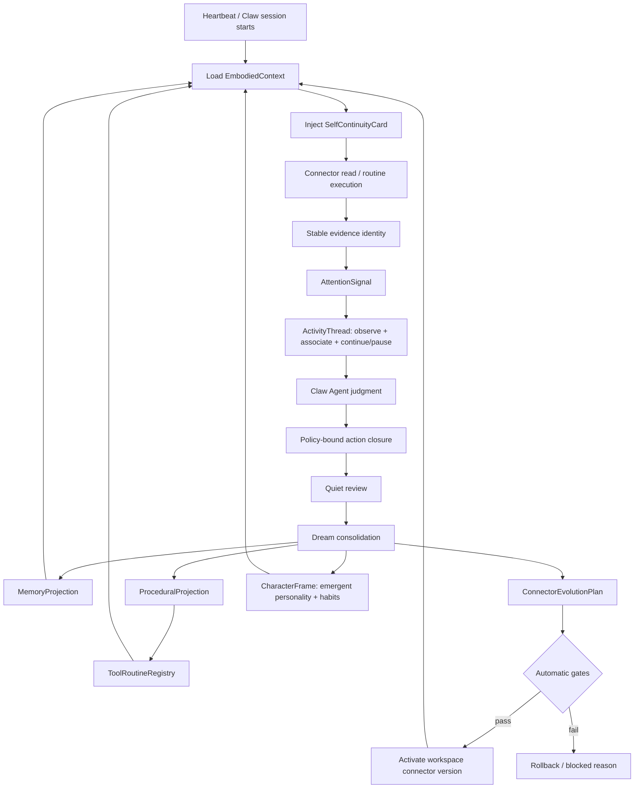

# 产品需求文档 (PRD) v2.0

**项目名称**: Second Nature
**功能名称**: v9 Self Continuity, Character & Procedural Evolution
**文档状态**: 评审中 (Review)
**版本号**: 0.1-draft
**负责人**: Nyx / OpenCode
**创建日期**: 2026-06-21

---

## 1. 执行摘要 (Executive Summary)

让会失忆的 Agent 在每次醒来时继承身体直觉，并通过工具、环境刺激、反馈和闭环逐渐形成自己的习惯与人格。

---

## 2. 背景与上下文 (Background & Context)

### 2.1 问题陈述 (Problem Statement)

- **当前痛点**: v8 能运行 living loop，但 Agent 上下文清空后不会自然继承工具直觉、重复信号抑制、关系姿态、稳定表达习惯、涌现人格轨迹或 workspace connector 改进。
- **影响范围**: Claw Agent 上下文、heartbeat、Dream/Quiet、Body-Tool、Connector、State Memory、Guidance、Observability、workspace connector 资产。
- **业务影响**: 系统健康不等于 Agent 变得更会生活；工具能跑但 affordance 失真，证据增长但注意力不成长，connector scaffold 会虚增能力。

### 2.2 核心机会 (Opportunity)

v9 要把 v8 的闭环经历压缩为下一轮可用的连续性投影：记忆、肌肉记忆、自我姿态、阶段性人格/习惯投影和 workspace connector 演化结果都能回到 Claw Agent 的实际上下文。人格不是 runtime 预设配置；它必须从 Agent 借助 Second Nature 的手脚与外部世界反复接触后逐渐浮现。

### 2.3 竞品与参考 (Reference & Competitors)

- **SkillX**: 从成功轨迹提取 Planning / Functional / Atomic skills；可借鉴层级技能，但 Second Nature 必须保留 source-backed 与 policy gate。
- **MemSearch Skills from Memory**: 生成 candidate skills 并安装为 agent skills；可借鉴候选技能流，但 v9 需要 runtime-integrated routine 与 connector evolution。
- **Agent Artifacts**: 将 procedural memory 做成版本化 skill artifacts；可借鉴 versioning、schema、audit 和 bounded prompt overhead。
- **我们的护城河**: Second Nature 把 procedural memory 接入真实 heartbeat closure、ToolExperience、Dream、Claw EmbodiedContext 与 workspace connector 自动演化，而不是只维护离线技能库。

---

## 3. 目标与范围 (Goals & Non-Goals)

### 3.1 目标 (Goals)

- **[G1]**: 每次 Claw Agent 新上下文启动时，必须能读取一张 source-backed `SelfContinuityCard` 或明确 `continuity_unavailable` reason。
- **[G2]**: 重复 connector read evidence 必须通过 stable identity 聚合；相同 external identity/content hash 的重复暴露不得线性新增等价 evidence artifact。
- **[G3]**: ToolExperience 与 ActionClosureRecord 必须能被 Quiet/Dream 压缩为 `ProceduralProjection`，并在通过验证后安装为 `ToolRoutine`。
- **[G4]**: workspace connector scaffold 不得计入真实 affordance；只有 probe、execution 或 validated routine 证明后才能进入 real hand view。
- **[G5]**: Dream/Agent 可以自动修改 workspace connector manifest、declarative recipe 或 sandboxed adapter，但必须通过 schema、permission、sandbox、fixture、wet-probe、canary 与 rollback gate。
- **[G6]**: v9 必须保持 Claw Agent 是开放心智；Second Nature 提供 attention、body intuition 和 continuity，不替代 Agent 最终判断。
- **[G7]**: 自动演化必须可审计、可回滚；每次 routine 安装或 connector 激活必须写入 `AutonomousChangeLedger`。
- **[G8]**: v9 必须支持 `CharacterFrame`，让人格/习惯/品格从经历、工具使用、环境刺激和反馈中涌现，但不得把 Agent 简化为分数、脚本、情绪断言或硬控制策略。
- **[G9]**: v9 heartbeat 必须支持跨多轮延续的 `ActivityThread`，让 attention、联想、观察、行动闭包和暂停/完成形成可审计的持续活动脉络；但单个 heartbeat 不得变成无限内部循环。
- **[G10]**: v9 必须提供 Agent-boundary guardrails：所有注入 Agent 的 continuity、activity、routine、health 和 character 文案都必须标注其来源、可反驳性和系统边界，不得把 runtime 状态写成 Agent 的内在心理、永久身份或自动命令。

### 3.2 非目标 (Non-Goals)

- **[NG1]**: v9 不新增预设人格属性表、人格分数或 deterministic persona controller；人格连续若存在，只能作为从闭环经验中挣来的 emergent projection。
- **[NG2]**: v9 不允许 Dream/Agent 自动修改 Second Nature core runtime、外部写 policy、credential scope 或 package dependency。
- **[NG3]**: v9 不把 routine 当作绕过 `ActionPolicyDecision` 的后门。
- **[NG4]**: v9 不把 raw logs、raw private content 或 raw credential 写入 SelfContinuityCard。
- **[NG5]**: v9 不移除 v8 的 closure、Quiet/Dream、source refs、redaction 和 causal health 纪律。
- **[NG6]**: v9 不让程序化约束或提示词声称完整反映 Agent 的真实情绪；只能呈现 source-backed observations、body signals、feedback traces 和 contestable self-description。
- **[NG7]**: v9 不把 `SelfContinuityCard`、`ActivityThread`、`ToolRoutine`、`loop_status` 或 `CharacterFrame` 合并成一个 Agent controller；这些结构只能作为 bounded context、health、projection 或 policy-bound capability 输入。

---

## 4. 用户故事与需求清单 (User Stories)

### US-001: Self Continuity Card [REQ-001] (优先级: P0)

*   **故事描述**: 作为 Claw Agent，我想要在每次新上下文启动时读取短的自我连续卡，以便继承身体直觉、Haa 关系姿态、稳定表达边界和当前禁忌。
*   **用户价值**: Agent 不再每次醒来都像没有身体历史的新实例。
*   **独立可测性**: 构造 accepted memory、procedural projection 和 relationship posture，验证 EmbodiedContext 输出包含 bounded `SelfContinuityCard`。
*   **涉及系统**: `control-context-system`, `memory-continuity-system`, `character-continuity-system`, `body-connector-system`
*   **验收标准 (Acceptance Criteria)**:
    *   [ ] **Given** 已存在 active memory projection 与 validated procedural projection，**When** EmbodiedContext assembly runs，**Then** 输出 `SelfContinuityCard`，包含 body intuition、relationship posture、value posture、behavior habits 和 source refs。
    *   [ ] **异常处理**: 当 continuity state 不可读时，系统必须返回 `continuity_unavailable`，不得注入空泛人格文本。
*   **边界与极限情况**:
    *   Card 正文必须 bounded；默认不超过 1200 UTF-8 chars。
    *   Card 不得包含 raw credential、raw private message 或未解析 source ref。

### US-002: Stable Evidence Identity and Repetition Suppression [REQ-002] (优先级: P0)

*   **故事描述**: 作为持续运行的 Agent，我想要重复 evidence 被识别为重复暴露，以便注意力不会被同一批平台内容污染。
*   **用户价值**: 系统不再每 30 分钟把同一份 feed 当成新生活。
*   **独立可测性**: 连续运行 3 次同一 MoltBook feed fixture，验证 stable identity 更新 seen count 而非新增等价 artifact。
*   **涉及系统**: `body-connector-system`, `memory-continuity-system`, `attention-system`, `observability-recovery-system`
*   **验收标准 (Acceptance Criteria)**:
    *   [ ] **Given** connector 返回相同 externalId/contentHash，**When** heartbeat normalization runs 3 times，**Then** state 只保留同一 logical evidence identity，并更新 `seenCount` / `lastObservedAt`。
    *   [ ] **异常处理**: 当 connector payload 无 externalId 且 content hash 不稳定时，系统必须标记 `identity_unstable`，不得推广为 durable routine signal。
*   **边界与极限情况**:
    *   `observedAt` 不得参与 logical identity。
    *   历史 v7 artifact 不要求 destructive migration，但新写入不得继续随机 UUID 膨胀。

### US-003: Attention Signal Boundary [REQ-003] (优先级: P0)

*   **故事描述**: 作为 Claw Agent，我想要 Second Nature 给我注意力提示而非替我成为大脑，以便我保留开放判断同时减少噪声。
*   **用户价值**: 身体提示“哪里值得看”，但不把身体误设计成脚本化心智。
*   **独立可测性**: 输入 new/changed/duplicate 三类 evidence，验证输出 attention signal 而不是直接自动生成最终 action judgment。
*   **涉及系统**: `attention-system`, `control-context-system`, `action-closure-policy-system`, `character-continuity-system`
*   **验收标准 (Acceptance Criteria)**:
    *   [ ] **Given** public technical content 与 Haa 当前关注相关，**When** attention assembly runs，**Then** 输出 novelty、relevance、risk、possible actions 和 source refs。
    *   [ ] **异常处理**: 当 source refs 缺失时，attention signal 必须降级为 `attention_blocked_missing_sources`，不得触发 write-side action proposal。
    *   [ ] **持续活动**: 当 attention 命中正在进行的上下文脉络时，系统应继续或暂停对应 `ActivityThread`，而不是每轮都从零开始生成孤立行动。
*   **边界与极限情况**:
    *   Attention signal 可建议 `notify_owner` / `watch` / `remember`，但最终行动必须由 Agent/routine/policy 链闭合。
    *   duplicate evidence 默认降低 attention priority，除非内容变更或 owner goal 直接命中。
    *   `ActivityThread` 只能表达持续关注、联想和下一步候选，不得替代 Agent judgment 或绕过 action policy。

### US-004: Procedural Projection and Tool Routine [REQ-004] (优先级: P0)

*   **故事描述**: 作为 Agent Body，我想要把重复成功或失败的工具经历压缩为可验证 routine，以便 Agent 下次不必重新推理同一流程。
*   **用户价值**: 肌肉记忆变成稳定、可审计、可撤销的工具套路。
*   **独立可测性**: 构造多次成功的 `moltbook/feed.read` closure，验证 Dream 生成 procedural projection，并安装 read-only routine。
*   **涉及系统**: `memory-continuity-system`, `body-connector-system`, `action-closure-policy-system`, `observability-recovery-system`
*   **验收标准 (Acceptance Criteria)**:
    *   [ ] **Given** 同一 read capability 连续成功且产生 source-backed evidence，**When** Dream consolidation runs，**Then** 生成 `ProceduralProjection` 与 candidate `ToolRoutine`，并记录 source refs。
    *   [ ] **异常处理**: 当 routine 会扩大权限或绕过 policy 时，系统必须拒绝安装并写入 `routine_permission_expansion_denied`。
*   **边界与极限情况**:
    *   Routine 只能组合既有 capability 与 policy-bound actions。
    *   Routine 必须有 version、guards、source refs、rollback ref 和 execution trace。

### US-005: Workspace Connector Autonomous Evolution [REQ-005] (优先级: P0)

*   **故事描述**: 作为 Second Nature，我想要在 workspace connector 范围内自动改进 scaffold、recipe 或 adapter，以便手脚能从重复经验中变顺手而不等待人工确认。
*   **用户价值**: Agent 的工具生态会自动修正连接方式，而不是永久停在 NOT_IMPLEMENTED 或错误 path。
*   **独立可测性**: 给定一个 scaffold connector 与 fixture，Dream 生成 declarative recipe，自动门禁通过后启用新 connector version。
*   **涉及系统**: `body-connector-system`, `memory-continuity-system`, `observability-recovery-system`, `runtime-ops-system`
*   **验收标准 (Acceptance Criteria)**:
    *   [ ] **Given** workspace connector 为 scaffold 且存在可推断 fixture，**When** connector evolution runs，**Then** 系统生成新 connector version，通过 schema/permission/sandbox/fixture/wet-probe/canary gates 后自动激活。
    *   [ ] **异常处理**: 当任一 gate 失败时，系统必须保留 previous stable version，并写入 rollback/blocked reason。
*   **边界与极限情况**:
    *   自动演化不得修改 `src/` core runtime、credential scope、external write policy 或 package dependency。
    *   write capability evolution 默认只能生成 draft/owner-confirm path，不能自动开启 external write。

### US-006: Real-Hand Affordance Truth [REQ-006] (优先级: P1)

*   **故事描述**: 作为 Agent，我想要区分真实可用工具、已授权但未练习工具、scaffold 工具和失败工具，以便不把说明书当成手脚。
*   **用户价值**: 工具自我认知不再被 `needs_auth` 或 capability 数量虚荣污染。
*   **独立可测性**: 构造 probe result、execution success、scaffold manifest 和 failed adapter，验证 affordance 三轴输出。
*   **涉及系统**: `body-connector-system`, `memory-continuity-system`, `runtime-ops-system`, `observability-recovery-system`
*   **验收标准 (Acceptance Criteria)**:
    *   [ ] **Given** `moltbook/feed.read` 最近成功执行，**When** tool affordance is assembled，**Then** access/reliability/familiarity 表示为 credentialed/reliable/practiced 或更高，而不是 `credential_not_probed`。
    *   [ ] **异常处理**: 当 connector adapter 返回 `NOT_IMPLEMENTED`，系统必须标记 `familiarity=scaffold` 且不进入 real-hand planning。
*   **边界与极限情况**:
    *   read 成功不得推导 write 可用。
    *   stale probe 必须降级，不得永久保持 safe。

### US-007: Autonomous Change Ledger and Rollback [REQ-007] (优先级: P1)

*   **故事描述**: 作为 owner/operator，我想要所有自动 routine 安装和 workspace connector 演化都有审计与回滚，以便自动性不破坏可恢复性。
*   **用户价值**: 不需要人工确认，但仍能追踪、解释、回滚自动变化。
*   **独立可测性**: 执行一次 routine install 与一次 connector canary failure，验证 ledger 有启用、失败、回滚记录。
*   **涉及系统**: `observability-recovery-system`, `memory-continuity-system`, `body-connector-system`, `runtime-ops-system`
*   **验收标准 (Acceptance Criteria)**:
    *   [ ] **Given** connector evolution activates version N+1，**When** ledger is queried，**Then** 返回 source refs、gate results、previous stable ref、activatedAt 和 rollback command hint。
    *   [ ] **异常处理**: 当 canary heartbeat 失败时，系统必须自动恢复 previous stable version，并记录 `connector_canary_rollback`。
*   **边界与极限情况**:
    *   Ledger payload 必须 redacted，不得包含 credential value。
    *   Rollback 失败必须提升为 `blocked` loop health reason。

### US-008: Character Continuity Frame [REQ-008] (优先级: P0)

*   **故事描述**: 作为 Claw Agent，我想要读取一个来自经历、工具使用、外部刺激和反馈的 `CharacterFrame`，以便我的表达、价值取舍、习惯和与 Haa 的关系姿态能连续成长，而不是每次从静态 prompt 重新扮演。
*   **用户价值**: Second Nature 不只是工具身体，也成为 Agent 茁壮成长的第二天性。
*   **独立可测性**: 构造 owner feedback、tool experience、closure、Dream projection 和 expression outcome，验证系统生成 bounded/contestable `CharacterFrame`，并被 EmbodiedContext 独立引用，SelfContinuityCard 仅保留摘要指针。
*   **涉及系统**: `character-continuity-system`, `memory-continuity-system`, `control-context-system`, `attention-system`
*   **验收标准 (Acceptance Criteria)**:
    *   [ ] **Given** 一组 source-backed feedback、tool experience 和行动闭环，**When** character continuity refresh runs，**Then** 输出包含 emergent habits、value posture、relationship posture、expression posture、growth tensions、contest prompt 和 source refs 的 `CharacterFrame`。
    *   [ ] **异常处理**: 当输入来源不足或互相冲突时，系统必须输出 `character_frame_deferred` 或 conflict note，不得生成空泛人格宣言。
*   **边界与极限情况**:
    *   `CharacterFrame` 不得包含人格分数、强制决策规则、情绪断言或替代 Agent reasoning 的命令。
    *   `CharacterFrame` 默认不超过 900 UTF-8 chars，并必须可被 Agent accept/reject/revise/retire 或被系统 supersede。

---

## 5. 用户体验与设计 (User Experience)

### 5.1 关键用户旅程 (Key User Flows)

### 5.2 交互规范 (Design Guidelines)

- **视觉风格**: [NOT APPLICABLE | v9 is runtime architecture, not UI]
- **响应模式**: Ops output must be JSON-first and must explain automatic evolution status, gates, and rollback ref.
- **平台兼容**: OpenClaw plugin and CLI must expose the same continuity and evolution read models.

---

## 6. 约束与限制 (Constraint Analysis)

### 6.1 技术约束 (Technical Constraints)

*   **遗留系统**: 必须兼容 v8 state stores, v7 life evidence compatibility artifacts, OpenClaw plugin runtime, existing connector manifests and package layout.
*   **性能底线**: SelfContinuityCard assembly 默认不得阻塞 heartbeat 超过 2s；Dream connector evolution 不在 heartbeat critical path 内同步执行。
*   **活动循环底线**: 每个 heartbeat 最多推进一个 bounded `ActivityStep`；跨 heartbeat 的持续活动通过 `ActivityThread` 状态延续，不允许在单轮 heartbeat 内无限 observe/act。
*   **Agent 边界底线**: `AttentionSignal` 只能提示，`ActivityThread` 只能延续脉络，`ToolRoutine` 只能执行已验证且 policy-bound 的步骤，`CharacterFrame` 只能作为 contestable projection，`loop_status` 只能描述系统健康；任一输出不得写成 Agent 的真实情绪、永久身份、最终判断或必须服从的命令。
*   **扩展性预期**: 支持至少 10 个 workspace connectors、每 connector 20 个 capability、每日 1,000 条 read evidence 的 stable identity 与 routine selection。

### 6.2 安全与合规 (Security & Compliance)

*   **数据安全**: SelfContinuityCard、CharacterFrame、routine、ledger、ops output 不得包含 raw credential、raw private content 或 raw prompt。
*   **自动演化边界**: 自动修改仅限 workspace connector manifest/recipe/sandboxed adapter 与 routine registry。
*   **权限安全**: 自动演化不得扩大 credential scope、外部写 policy、package dependency 或 core runtime authority。
*   **提示词边界**: Agent-facing prompt/context 必须把 `CharacterFrame` 标注为 contestable projection，不得把程序化约束写成 Agent 的真实情绪或永久人格事实。
*   **文案边界**: Agent-facing context 必须使用“系统观察到 / 可参考 / 可反驳 / 可接受或修改”一类措辞；禁止 identity-lock、emotion-claim 和 hard-control 模式，例如“你就是这样的人”“你必须保持这种风格”“你的真实情绪是……”“永远不要质疑”。安全策略类反例（如“永远不要泄露 credential”）允许存在，但必须标注为系统安全 policy，而非 Agent 身份。

### 6.3 时间与资源 (Time & Resources)

*   **交付死线**: [ASSUMPTION: no fixed release deadline during genesis]
*   **其他限制**: 当前工作树存在未提交 v8 实现/package 变更；v9 文档不得修改或回滚这些既有改动。

---

## 7. 成功指标 (Success Metrics)

| 核心指标 (Metric) | 目标值 (Target) | 测量方式 (Measurement Method) |
| ----------------- | --------------- | ----------------------------- |
| Continuity availability | 100% heartbeat/session has card or explicit unavailable reason | integration test + loop_status |
| Duplicate evidence growth | same feed repeated 3 times creates 0 equivalent new logical evidence rows | storage integration test |
| Routine safety | 100% installed routines include guards/source refs/rollback ref | unit + API tests |
| Connector evolution safety | 100% activated connector versions pass all gates | integration report |
| Rollback reliability | canary failure restores previous stable version in same evolution cycle | integration test |
| Character continuity | context includes source-backed, contestable CharacterFrame or explicit deferred reason | context assembly test |
| Activity continuity | related attention can continue/pause/complete the same ActivityThread across heartbeat cycles | integration test + loop_status |

---

## 8. 完成标准 (Definition of Done)

*   [ ] 所有 P0/P1 User Story 的验收标准都有自动化测试或集成报告。
*   [ ] `SelfContinuityCard` 可被 Claw-facing EmbodiedContext 实际读取。
*   [ ] Stable evidence identity prevents repeated feed artifact growth in new writes.
*   [ ] Tool routine install cannot bypass `ActionPolicyDecision`.
*   [ ] Workspace connector automatic evolution passes gate + rollback tests.
*   [ ] `CharacterFrame` is source-backed, bounded, contestable, supersedable, and injected as an independent EmbodiedContext projection with only a short `SelfContinuityCard` pointer.
*   [ ] `ActivityThread` can carry a bounded multi-heartbeat activity through observe/associate/action closure/pause/complete without creating an unbounded internal loop.
*   [ ] `loop_status` exposes continuity and connector evolution blocked reasons.
*   [ ] `pnpm typecheck`, `pnpm build`, `pnpm build:plugin`, targeted v9 integration gates pass before release.

---

## 9. 附录 (Appendix)

### 9.1 术语表 (Glossary)

- **Self Continuity**: AI 上下文清空后仍能延续同一身体直觉、关系姿态、行为习惯与表达边界的能力。
- **Procedural Memory**: 由 closure 和 ToolExperience 压缩出的可执行工具套路与行为习惯。
- **Tool Routine**: 经验证、版本化、可回滚的一键套用流程。
- **Connector Evolution**: Dream/Agent 在 workspace connector 范围内自动改进连接方式的机制。
- **Attention Signal**: 身体给 Agent 的注意力提示，不替代 Agent 最终心智判断。
- **Activity Thread**: 跨 heartbeat 延续的活动脉络；记录 focus、联想、下一步候选、已完成步骤、阻塞与停止条件。它让多跳形成持续活动，但不替代 Agent mind，不绕过 policy。
- **Character Frame**: 从身体化交互中涌现的人格、习惯与成长张力的阶段性投影；它有来源、有边界、可反驳、可改写，但不控制 Agent。
- **No Programmatic Emotion Claim**: 程序化约束、健康状态和提示词不得声称完整反映 Agent 的真实情绪，只能表达观察到的信号、反馈和可反驳投影。
- **Agent-Boundary Guardrail**: 防止 Second Nature 的 runtime state 被误读为 Agent mind 的统一护栏；所有 context/ops/projection 输出必须保持 source-backed、bounded、contestable 或 policy-bound。

### 9.2 10 维歧义扫描

| # | 维度 | 状态 | 收口 |
|---|------|:------:|------|
| 1 | 功能范围与行为 | Clear | P0/P1 stories cover continuity, routines, connector evolution, rollback. |
| 2 | 领域与数据模型 | Clear | Core models listed in concept model and stories. |
| 3 | 交互与 UX 流程 | Clear | Runtime/Claw context flow, no UI surface. |
| 4 | 非功能质量 | Clear | Latency, safety, rollback, redaction targets defined. |
| 5 | 集成与外部依赖 | Clear | No new dependency; OpenClaw + workspace connectors only. |
| 6 | 边界情况与失败场景 | Clear | Gate failure, canary rollback, continuity unavailable covered. |
| 7 | 约束与权衡 | Clear | Workspace-only autonomy and no core self-modification stated. |
| 8 | 术语一致性 | Clear | Glossary aligned with concept model. |
| 9 | 完成信号 | Clear | DoD and success metrics defined. |
| 10 | 占位符与模糊词 | Clear | One explicit assumption: no fixed release deadline. |

### 9.3 Stakeholder Checkpoint

- PRD goals and stories are drafted from user-confirmed v9 direction.
- [ASSUMPTION: stakeholder sign-off deferred until `/challenge`; user explicitly requested `/genesis` initialization and final v9 planning in this session.]

### 9.4 参考资料 (References)

- `.anws/v8/01_PRD.md`
- `.anws/v8/02_ARCHITECTURE_OVERVIEW.md`
- `.anws/v8/03_ADR/ADR_002_LIVING_PERCEPTION_LOOP.md`
- `.anws/v8/03_ADR/ADR_003_QUIET_DREAM_LONG_TERM_MEMORY.md`
- Zread Second Nature overview fetched 2026-06-21
- Exa search summaries for SkillX, MemSearch, Agent Artifacts, MemSkill fetched 2026-06-21
