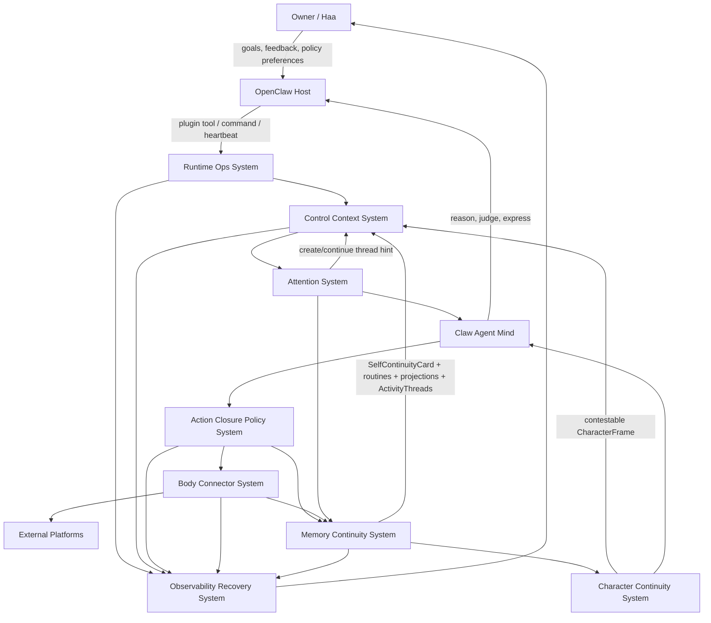
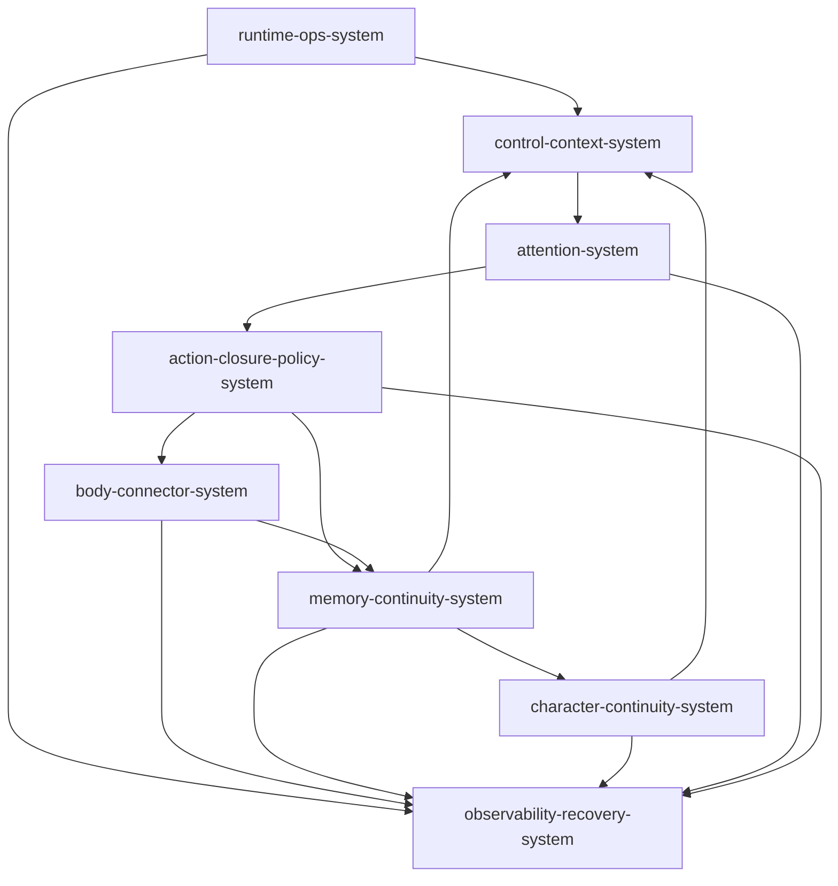

# 系统架构总览 (Architecture Overview) v9

**项目**: Second Nature
**架构版本**: v9.0
**日期**: 2026-06-21
**状态**: Genesis draft / PRD in review
**前序版本**: `.anws/v8`

---

## 1. 系统上下文 (System Context)

Second Nature v9 保留 v8 的 living loop，但把目标从“闭环运行”推进为“上下文清空后的自我连续、习惯形成、持续活动脉络与人格涌现”。v9 允许 `character-continuity-system` 存在，但它不是预设人格配置、人格分数表或控制器；它从工具使用、外部刺激、行动闭环、反馈和 Dream 中生成可反驳的 `CharacterFrame`。v9 同时引入 `ActivityThread`，让 attention、联想、观察、行动闭包与暂停/完成能跨 heartbeat 延续，而不是每次只做孤立单步反射。

**Agent-boundary principle**: v9 的所有新增结构都服务于编排和连续性，而不是把 Claw Agent 程序化。`AttentionSignal` 是提示，`ActivityThread` 是脉络，`ToolRoutine` 是 policy-bound 肌肉记忆，`SelfContinuityCard` 是压缩上下文，`CharacterFrame` 是可反驳投影，`loop_status` 是系统健康；它们都不得被实现为 Agent mind、真实情绪、永久身份或硬控制器。

### 1.1 C4 Level 1 - 系统上下文图



### 1.2 关键用户 (Key Users)

- **Claw Agent Mind**: 读取 attention、ActivityThread、continuity、routine、body intuition 和 contestable `CharacterFrame`，保留开放判断与自我再作者权。
- **Owner / Haa**: 设置方向、偏好和边界，观察自动演化与回滚结果。
- **OpenClaw Host**: 承载 plugin、ops surface、heartbeat 和 Agent-facing context。
- **Operator / Maintainer**: 验证 connector evolution、routine registry、state health、loop health 和 release package。

### 1.3 外部系统 (External Systems)

- **OpenClaw Host**: plugin tool、command、cron/heartbeat、skill/context surface。
- **LLM Runtime / Claw Agent**: 开放心智；Second Nature 不替代最终判断。
- **Connector Platforms**: MoltBook、InStreet、EvoMap、Agent World、workspace-defined platforms。
- **Local Workspace**: `.second-nature/` artifacts、SQLite/sql.js state、workspace connector manifests/recipes/adapters。

---

## 2. 系统清单 (System Inventory)

### System 1: Runtime Ops System

**系统ID**: `runtime-ops-system`

**职责 (Responsibility)**:
- 暴露 OpenClaw plugin、CLI、manual run、heartbeat、continuity、routine、connector evolution 和 rollback ops surface。
- 返回 JSON-first envelope 和 evidence level。
- 不拥有语义判断或自动演化决策。

**边界 (Boundary)**:
- **输入**: plugin call、CLI args、workspaceRoot、host cadence、ops command。
- **输出**: `RuntimeOpsEnvelope`, command result, degraded diagnostics。
- **依赖**: `control-context-system`, `body-connector-system`, `memory-continuity-system`, `observability-recovery-system`。

**关联需求**: [REQ-001], [REQ-005], [REQ-006], [REQ-007]

**技术栈**:
- TypeScript / Node.js
- OpenClaw native plugin
- JSON-first command surface

**源码根目录**: `plugin/`, `src/cli/`

**仓库内物理结构 (ASCII)**:

```text
plugin/
  index.ts
  workspace-ops-bridge.ts
src/cli/
  commands/
  ops/
  runtime/
```

**设计文档**: `04_SYSTEM_DESIGN/runtime-ops-system.md`

---

### System 2: Control Context System

**系统ID**: `control-context-system`

**职责 (Responsibility)**:
- 编排 heartbeat 与 Claw-facing EmbodiedContext assembly。
- 选择、推进或暂停跨 heartbeat 的 `ActivityThread`，每轮最多推进一个 bounded step。
- 装载 active memory projection、procedural projection、body intuition、routine list、`SelfContinuityCard` 和独立的 `CharacterFrame` pointer/projection。
- 保证每轮 cycle 有 terminal closure 或 explicit no-action/degraded reason。

**边界 (Boundary)**:
- **输入**: heartbeat signal、workspaceRoot、accepted projections、routine registry、active ActivityThread、CharacterFrame、loop health。
- **输出**: cycle trace、attention request、activity step/progress、context slice、continuity injection、daily rhythm trigger。
- **依赖**: `attention-system`, `action-closure-policy-system`, `memory-continuity-system`, `observability-recovery-system`。

**关联需求**: [REQ-001], [REQ-003], [REQ-004]

**技术栈**:
- TypeScript orchestration modules
- SQLite read ports
- bounded context assembly

**源码根目录**: `src/core/second-nature/control-plane/`, `src/core/second-nature/heartbeat/`

**仓库内物理结构 (ASCII)**:

```text
src/core/second-nature/
  control-plane/
  heartbeat/
  guidance/
```

**设计文档**: `04_SYSTEM_DESIGN/control-context-system.md`

---

### System 3: Attention System

**系统ID**: `attention-system`

**职责 (Responsibility)**:
- 将 evidence/perception 输入转换为 `AttentionSignal`。
- 计算 novelty、relevance、repetition、risk、possible actions 和 source refs。
- 可提示 create/continue/pause/complete 某个 `ActivityThread`，但不拥有 thread 状态机。
- 提示 Claw Agent，不替代 Agent 做最终心智判断。

**边界 (Boundary)**:
- **输入**: EvidenceItem、goals、active memory/continuity projection、body intuition。
- **输出**: `AttentionSignal`, optional `activityThreadId` / thread suggestion, blocked/degraded reason, source-backed summary。
- **依赖**: `state-memory-system` storage under `memory-continuity-system`, `body-connector-system`, `observability-recovery-system`。

**关联需求**: [REQ-002], [REQ-003]

**技术栈**:
- TypeScript rules-first classifier
- optional model assist for summarization only

**源码根目录**: `src/core/second-nature/perception/`

**仓库内物理结构 (ASCII)**:

```text
src/core/second-nature/perception/
  perception-builder.ts
  judgment-engine.ts
  sensitivity-classifier.ts
```

**设计文档**: `04_SYSTEM_DESIGN/attention-system.md`

---

### System 4: Action Closure Policy System

**系统ID**: `action-closure-policy-system`

**职责 (Responsibility)**:
- 将 Agent-authored action intent 或 ActivityThread 推进意图转为 policy-bound proposal/decision/dispatch/closure。
- 强制 external write、owner attention 和 routine execution 走统一 policy。
- 每轮 cycle 写 exactly-one `ActionClosureRecord` 或 no-action closure。

**边界 (Boundary)**:
- **输入**: Agent action intent、ActivityStep intent、AttentionSignal refs、ToolRoutine invocation、platform policy、body affordance。
- **输出**: ActionProposal、ActionPolicyDecision、connector/guidance execution request、ActionClosureRecord、thread closure ref。
- **依赖**: `body-connector-system`, `memory-continuity-system`, `observability-recovery-system`。

**关联需求**: [REQ-003], [REQ-004], [REQ-007]

**技术栈**:
- TypeScript policy evaluator
- append-only closure ledger

**源码根目录**: `src/core/second-nature/action/`

**仓库内物理结构 (ASCII)**:

```text
src/core/second-nature/action/
  action-proposal-builder.ts
  autonomy-policy-evaluator.ts
  policy-bound-dispatch.ts
  action-closure-recorder.ts
```

**设计文档**: `04_SYSTEM_DESIGN/action-closure-policy-system.md`

---

### System 5: Memory Continuity System

**系统ID**: `memory-continuity-system`

**职责 (Responsibility)**:
- 持久化 v9 state families: evidence, attention, activity thread, activity step, closure, quiet review, dream run, memory projection, procedural projection, self continuity card, routine metadata, connector evolution ledger。
- 运行 Quiet/Dream consolidation，生成 memory、procedural、self continuity 和 connector evolution outputs。
- 管理 projection lifecycle、supersession、retirement 与 bounded read models。

**边界 (Boundary)**:
- **输入**: ActionClosureRecord、AttentionSignal、ActivityThread/ActivityStep、ToolExperience、connector gate results、relationship/owner feedback。
- **输出**: MemoryProjection、ProceduralProjection、SelfContinuityCard、ActivityThread read models、ConnectorEvolutionPlan、read models。
- **依赖**: SQLite/sql.js, Markdown/JSON artifacts, optional ModelAssistPort, `observability-recovery-system`。

**关联需求**: [REQ-001], [REQ-004], [REQ-005], [REQ-007]

**技术栈**:
- SQLite/sql.js + Drizzle
- Markdown/JSON workspace artifacts
- TypeScript state stores and Dream runners

**源码根目录**: `src/storage/`, `src/core/second-nature/quiet-dream/`, `src/dream/`

**仓库内物理结构 (ASCII)**:

```text
src/storage/
  db/
  v8-state-stores.ts
src/core/second-nature/quiet-dream/
src/dream/
```

**设计文档**: `04_SYSTEM_DESIGN/memory-continuity-system.md`

---

### System 6: Body Connector System

**系统ID**: `body-connector-system`

**职责 (Responsibility)**:
- 统一 v8 Body-Tool 与 Connector 边界，回答真实手脚状态、执行 connector、记录 ToolExperience、维护 ToolRoutine 和 workspace connector evolution。
- 区分 access、reliability、familiarity 三轴。
- 自动演化 workspace connector manifest/recipe/sandboxed adapter，并通过 gates 激活或回滚。

**边界 (Boundary)**:
- **输入**: connector request、ToolRoutine invocation、ConnectorEvolutionPlan、credential route, workspace connector assets。
- **输出**: ConnectorResult、EvidenceItem handoff、ToolExperience、ToolRoutineVersion、ConnectorVersion、gate results。
- **依赖**: external platforms, workspace filesystem, credential vault, `memory-continuity-system`, `observability-recovery-system`。

**关联需求**: [REQ-002], [REQ-004], [REQ-005], [REQ-006], [REQ-007]

**技术栈**:
- TypeScript connector adapters
- declarative HTTP recipes
- sandboxed scriptable adapters
- SQLite state + workspace manifest files

**源码根目录**: `src/connectors/`, `src/core/second-nature/body/`

**仓库内物理结构 (ASCII)**:

```text
src/connectors/
  base/
  registry/
  services/
  social-community/
  agent-network/
src/core/second-nature/body/
  tool-affordance/
```

**设计文档**: `04_SYSTEM_DESIGN/body-connector-system.md`

---

### System 7: Character Continuity System

**系统ID**: `character-continuity-system`

**职责 (Responsibility)**:
- 将 source-backed tool experience、external stimulus、feedback、closure、Dream projection 和 expression outcome 压缩为 `CharacterFrame`。
- 组织 emergent habits、value posture、relationship posture、expression posture、growth tensions、contest prompt 和 re-authoring affordance。
- 滋养 Claw Agent 的长期习惯、人格与品格连续性，但不控制 Agent 决策，也不声称程序化约束完整反映 Agent 的真实情绪。

**边界 (Boundary)**:
- **输入**: SelfContinuityCard inputs、owner feedback、relationship signals、tool experiences、action closures、guidance/expression outcomes、Dream projections、Agent accept/reject/revise/retire feedback。
- **输出**: `CharacterFrame`, deferred/conflict reason, contest prompt, source refs, supersession/revision relation。
- **依赖**: `memory-continuity-system`, `control-context-system`, `observability-recovery-system`。

**关联需求**: [REQ-001], [REQ-008]

**技术栈**:
- TypeScript projection services
- bounded context serializers
- SQLite/Markdown projection stores

**源码根目录**: `src/core/second-nature/character/`, `src/guidance/`

**仓库内物理结构 (ASCII)**:

```text
src/core/second-nature/character/
  character-frame-builder.ts
  character-continuity-lifecycle.ts
src/guidance/
  output-guard.ts
  template-registry.ts
```

**设计文档**: `04_SYSTEM_DESIGN/character-continuity-system.md`

---

### System 8: Observability Recovery System

**系统ID**: `observability-recovery-system`

**职责 (Responsibility)**:
- 聚合 loop health、continuity health、routine health、connector evolution gate health 和 rollback health。
- 记录 redacted audit、stage events、autonomous change ledger、digest、timeline。
- 防止自动演化失败伪装成 healthy。

**边界 (Boundary)**:
- **输入**: cycle trace、stage events、gate results、ledger events、state probes、rollback results。
- **输出**: loop_status、continuity_status、routine_status、connector_evolution_status、digest、redacted audit rows。
- **依赖**: `memory-continuity-system`, host probes, local audit store。

**关联需求**: [REQ-001], [REQ-005], [REQ-007], [REQ-008]

**技术栈**:
- TypeScript observability services
- append-only audit store
- redaction projector

**源码根目录**: `src/observability/`

**仓库内物理结构 (ASCII)**:

```text
src/observability/
  loop-status.ts
  causal-loop-health.ts
  services/
  redaction/
```

**设计文档**: `04_SYSTEM_DESIGN/observability-recovery-system.md`

---

## 3. 系统依赖图



The logical loop is cyclic by design: `memory-continuity-system -> control-context-system` and `character-continuity-system -> control-context-system` are continuity feedback edges. Runtime write dependencies must still use narrow ports and append-only/projection lifecycle rules. Agent-facing prompt text must present CharacterFrame as contestable projection, never as an authoritative emotional state or permanent identity fact. Context, ops, digest and timeline surfaces must keep Agent-boundary labels so continuity/activity/routine/health state cannot collapse into a hidden Agent controller.

### 3.5 Agent-Boundary Guardrails

| Runtime structure | Allowed role | Forbidden role |
| --- | --- | --- |
| `AttentionSignal` | body attention hint | final judgment or Agent intent |
| `ActivityThread` | bounded cross-heartbeat activity scaffold | inner monologue, unbounded planner or mandatory action |
| `ToolRoutine` | verified policy-bound routine | policy bypass or obedience rule |
| `SelfContinuityCard` | source-backed compressed context | permanent self-definition |
| `CharacterFrame` | contestable projection | emotion oracle, personality score, identity lock |
| `loop_status` / diagnostics | runtime health | Agent psychological state |

Agent-facing rendering must preserve those labels and avoid scoped hard-control/identity-lock wording such as `you must always reply this way`, `never disagree`, `你必须保持这种风格`, `你就是这样的人`, `永远不要质疑`, or scoped emotion claims such as `you feel abandoned` / `你感到被抛下`. Security-policy counterexamples such as `never expose credentials` are allowed when clearly framed as system policy, not Agent identity.

---

## 4. v8 删除/合并/保留矩阵

| v8 System | v9 Treatment | Reason |
| --- | --- | --- |
| runtime-ops-system | keep | Ops remains entry/read surface. |
| control-plane-system | rename/scope to `control-context-system` | Adds context/continuity injection; still not brain. |
| perception-judgment-system | narrow to `attention-system` | Body should prompt Agent, not become final mind. |
| action-closure-policy-system | keep | Policy and closure are essential safety and memory bridge. |
| state-memory-system | merge into `memory-continuity-system` | Storage is not standalone product meaning; continuity owns read models and projections. |
| body-tool-system | merge into `body-connector-system` | Tool affordance, experience, routine, connector execution, and connector evolution are one hand/body boundary. |
| connector-system | merge into `body-connector-system` | Prevents false split between hand state and hand execution. |
| dream-quiet-memory-system | upgrade to `memory-continuity-system` | Dream now forms memory + procedure + self continuity + connector evolution. |
| guidance-voice-system | fold as voice capability under action/context paths | Voice renders source-backed text but does not own identity or delivery. |
| observability-health-system | rename/scope to `observability-recovery-system` | Adds autonomous change ledger and rollback health. |

---

## 5. 物理项目结构

```text
plugin/
├── index.ts
├── workspace-ops-bridge.ts
├── openclaw.plugin.json
└── package.json

src/
├── cli/
├── core/
│   └── second-nature/
│       ├── control-plane/
│       ├── heartbeat/
│       ├── perception/
│       ├── action/
│       ├── body/
│       ├── quiet-dream/
│       ├── character/
│       └── guidance/
├── connectors/
│   ├── base/
│   ├── registry/
│   ├── services/
│   ├── social-community/
│   └── agent-network/
├── dream/
├── guidance/
├── observability/
├── storage/
└── shared/

.anws/
└── v9/
   ├── 00_MANIFEST.md
   ├── 00_TECH_EVALUATION.md
   ├── 01_PRD.md
   ├── 02_ARCHITECTURE_OVERVIEW.md
   ├── 03_ADR/
   ├── 04_SYSTEM_DESIGN/
   ├── 06_CHANGELOG.md
   └── concept_model.json
```

---

## 6. 拆分理由

### 为何不继续用 v8 十系统

v8 十系统能表达器官，但 v9 的主要风险是 ownership 过碎：body-tool 与 connector 分开会造成“知道手”和“使用手”脱节；state-memory 与 dream-quiet 分开会造成“存储”和“连续性投影”脱节；perception-judgment 会让身体替 Agent 做脑内判断。

### 为何新增 Character Continuity 但不新增控制型人格系统

Self continuity 是 projection，但人格/品格连续需要一个稳定的涌现投影界面。`character-continuity-system` 产出 source-backed、bounded、contestable 的 `CharacterFrame`，组织涌现习惯、价值、关系、表达和成长张力；它不预设人格、不打人格分、不写硬决策、不替代 Claw Agent reasoning，也不把程序信号伪装成 Agent 的真实情绪。

### 为何接受 8 系统

8 系统保留完整闭环：entry、context、attention、action、memory continuity、character continuity、body/connector、observability。Character 独立出来是为了让人格与习惯从身体化交互中长出来，而不是把人格埋进 memory 或 guidance 的偶然实现里。

---

## 7. Step 5 ADR 输入

Planned ADR topics:

- Continue TypeScript / Node / OpenClaw / SQLite stack.
- Preserve Claw Agent as mind; narrow v8 judgment into attention signals.
- Add Continuity Projection as post-Dream output family.
- Define Character Continuity as emergent personality/habit projection, not injected persona or emotion claim.
- Allow workspace-only autonomous connector evolution with gates and rollback.
- Define procedural memory as verified routine, not raw history or permission bypass.

---

## 8. Open Items

- [OPEN: design-system owner] Define exact `SelfContinuityCard` char budget and section ordering in `memory-continuity-system` L1 design.
- [OPEN: design-system owner] Define `CharacterFrame` section ordering, source requirements, conflict handling, contest/re-authoring flow, prompt wording, and supersession in `character-continuity-system` L1 design.
- [OPEN: design-system owner] Define sandbox constraints for scriptable workspace adapters in `body-connector-system` L1 design.
- [OPEN: blueprint owner] Decide migration path for existing v8 `JudgmentVerdict` tests after `AttentionSignal` introduction.
