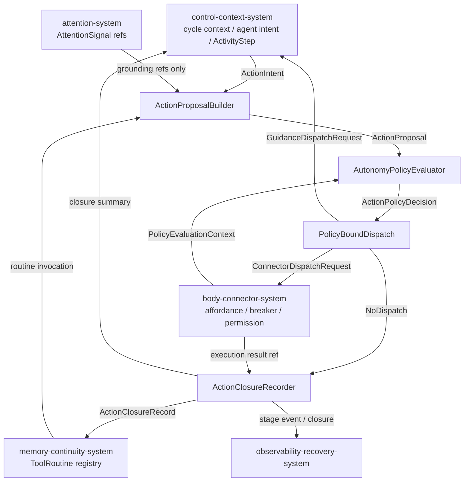
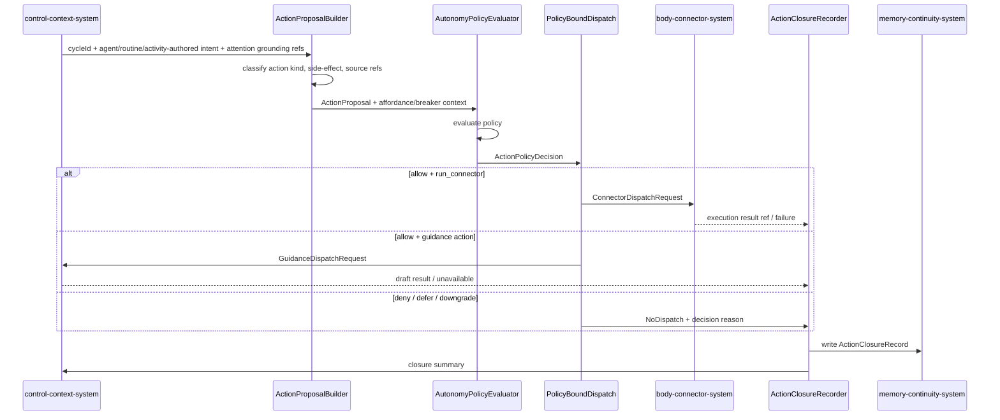
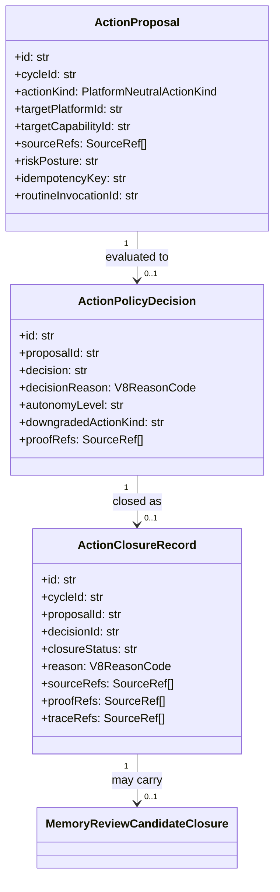

# action-closure-policy-system 系统设计文档 (L0 — 导航层)

| 字段          | 值                                                                    |
| ------------- | --------------------------------------------------------------------- |
| **System ID** | `action-closure-policy-system`                                        |
| **Project**   | Second Nature v9                                                      |
| **Version**   | 1.0                                                                   |
| **Status**    | Draft                                                                 |
| **Author**    | System Designer (Nyx / OpenCode)                                      |
| **Date**      | 2026-06-21                                                            |
| **L1 Detail** | [action-closure-policy-system.detail.md](./action-closure-policy-system.detail.md) — 已创建 |

> [!IMPORTANT]
> **文档分层说明**
> - **本文件 (L0 导航层)**: 架构图、操作契约、设计决策。面向快速理解与任务规划。禁止放配置字典、算法伪代码和方法体。
> - **[action-closure-policy-system.detail.md](./action-closure-policy-system.detail.md) (L1 实现层)**: 完整数据结构、配置常量、核心算法伪代码、决策树与边缘情况。仅 `/forge` 任务明确引用时加载。

---

## 目录 (Table of Contents)

|   §   | 章节                                                         | 关键内容                                                 |
| :---: | ------------------------------------------------------------ | -------------------------------------------------------- |
|   1   | [概览](#1-概览-overview)                                     | 系统目的、边界、职责                                     |
|   2   | [目标与非目标](#2-目标与非目标-goals--non-goals)             | Goals / Non-Goals                                        |
|   3   | [背景与上下文](#3-背景与上下文-background--context)          | 为什么需要这个系统、约束                                 |
|   4   | [系统架构](#4-系统架构-architecture)                         | Mermaid 架构图、组件职责、数据流                         |
|   5   | [接口设计](#5-接口设计-interface-design)                     | 操作契约表、跨系统协议                                   |
|   6   | [数据模型](#6-数据模型-data-model)                           | 实体字段声明                                             |
|   7   | [技术选型](#7-技术选型-technology-stack)                     | 核心技术、关键依赖                                       |
|   8   | [Trade-offs](#8-trade-offs--alternatives-权衡与备选方案)     | 决策理由、备选方案对比                                   |
|   9   | [安全性考虑](#9-安全性考虑-security-considerations)          | 认证授权、风险与缓解                                     |
|  10   | [性能考虑](#10-性能考虑-performance-considerations)          | 性能目标、优化策略                                       |
|  11   | [测试策略](#11-测试策略-testing-strategy)                    | 单测、集成、契约验证矩阵                                 |
|  12   | [部署与运维](#12-部署与运维-deployment--operations) *(可选)* | N/A                                                      |
|  13   | [未来考虑](#13-未来考虑-future-considerations) *(可选)*      | N/A                                                      |
|  14   | [附录](#14-appendix-附录) *(可选)*                           | 术语表、参考资料                                         |

---

## 1. 概览 (Overview)

### 1.1 System Purpose (系统目的)

`action-closure-policy-system` 是 Second Nature v9 的「行动门禁与闭环记录」层。它把 Agent-authored action intent、policy-bound `ActivityStep` 推进意图以及 verified `ToolRoutine` 调用意图统一转换为受 policy 约束的 proposal、decision、dispatch 和 terminal closure；`AttentionSignal` 只能作为 source/provenance/risk grounding refs，不能自行 author action intent。系统确保每一轮 heartbeat cycle 有且仅有一条 `ActionClosureRecord`，并且外部写、owner attention、routine 执行都走同一套决策门。

### 1.2 System Boundary (系统边界)

- **输入 (Input)**:
  - 来自 `control-context-system` 的 cycle 上下文、Agent-authored action intent、`ActivityStep` 推进意图、`ToolRoutine` 调用请求。
  - 来自 `attention-system` 的 `AttentionSignal` refs（含 novelty / relevance / risk / possible actions / source refs），仅用于 grounding，不作为 action author。
  - 来自 `body-connector-system` 的 tool affordance posture、credential health、circuit breaker status、connector execution result ref。
  - 来自 `memory-continuity-system` 的 `ToolRoutine` 注册表读模型。
  - 来自 `observability-recovery-system` 的 cycle trace ref 与 stage event sink。

- **输出 (Output)**:
  - 向 `body-connector-system` 输出 connector dispatch request（含 policy proof）。
  - 向 `control-context-system` 输出 cycle closure summary（含 closure id、status、reason）。
  - 向 `memory-continuity-system` 输出持久化的 `ActionClosureRecord`。
  - 向 `observability-recovery-system` 输出 policy/execution/closure stage events。

- **依赖系统 (Dependencies)**: `attention-system`, `control-context-system`, `body-connector-system`, `memory-continuity-system`, `observability-recovery-system`。

- **被依赖系统 (Dependents)**: `control-context-system`, `memory-continuity-system`, `observability-recovery-system`。

### 1.3 System Responsibilities (系统职责)

**负责**:
- 将 Agent-authored intent、policy-bound `ActivityStep` intent、`ToolRoutine` invocation 转换为 policy-bound `ActionProposal`；`AttentionSignal` refs 只参与 grounding / risk / source attribution [REQ-003][REQ-004]。
- 根据 side-effect class、risk posture、platform permission、owner preference、breaker status 评估 `ActionPolicyDecision` [REQ-003][REQ-007]。
- 把 allow / downgrade / deny / defer 决策路由为 connector 或 guidance dispatch request [REQ-003]。
- 每轮 cycle 写 exactly-one terminal `ActionClosureRecord`（包括 no-action、denied、deferred、downgraded、completed、failed）[REQ-007]。
- 保证所有 closure 输出 source-backed，含 decision reason 与 source/proof/trace refs [REQ-007]。
- 在 `ToolRoutine` 调用路径上重新执行 policy 评估，禁止 routine 绕过 `ActionPolicyDecision` [REQ-004][NG3]。

**不负责**:
- 不直接执行 connector HTTP 调用或生成 guidance text（由 `body-connector-system` 与 `guidance` 能力负责）[^02_ARCHITECTURE_OVERVIEW §2 System 4]。
- 不直接修改 workspace connector manifest/recipe/adapter（由 `body-connector-system` 在 ADR-004 gate 后负责）[^ADR-004]。
- 不做长期记忆压缩或 `ProceduralProjection` 生成（由 `memory-continuity-system` 的 Quiet/Dream 负责）[^ADR-005]。
- 不做情绪断言或人格评分（由 `character-continuity-system` 以 contestable projection 方式负责）[^01_PRD NG1][NG6]。

---

## 2. 目标与非目标 (Goals & Non-Goals)

### 2.1 Goals

- **[G1]** 任意进入本系统的 intent（Agent、attention、activity step、routine）都必须经过统一的 `ActionPolicyDecision`；不允许存在「routine 特权通道」或「activity thread 特权通道」[REQ-004][NG3]。
- **[G2]** 每轮 heartbeat cycle 最终产生 exactly-one `ActionClosureRecord`；空轮次也必须产生 no-action closure [REQ-007]。
- **[G3]** 外部写（`external_write`）、owner attention（`owner_attention`）和 capability-declared 动作在缺失 source refs、permission 或 breaker open 时，默认降级或拒绝，不自动执行 [REQ-003][REQ-007]。
- **[G4]** 所有 closure 携带可解析的 `SourceRef[]` 与 decision reason，支持 `observability-recovery-system` 做 causal replay [REQ-007]。
- **[G5]** 禁止通过 action proposal 自动扩大 credential scope、external write policy 或 core runtime authority [REQ-005][NG2]。

### 2.2 Non-Goals

- **[NG1]** 本系统不维护 connector 自动演化的 gate 实现细节；只记录演化动作经 policy 评估后的 closure [ADR-004]。
- **[NG2]** 本系统不生成或安装 `ToolRoutine` 本身；只验证 routine invocation 是否仍符合当前 policy [ADR-005]。
- **[NG3]** 本系统不做 attention 计算或证据 novelty 推断；不把 `AttentionSignal` 的 possible actions 当作 action author，只消费其 refs 作为 grounding [REQ-003]。

---

## 3. 背景与上下文 (Background & Context)

### 3.1 Why This System? (为什么需要这个系统？)

v8 的 living loop 已经证明：没有统一 policy gate 的 action closure 会让外部写、owner attention 和 connector 执行混在同一入口，导致降级理由不一致、空轮次缺少 closure、routine 可能被当作「已授权」后门。v9 把 v8 的 `perception-judgment-system` 收窄为 `attention-system`（只提示、不替代 Agent 心智），因此 action 侧必须能够同时处理：

1. Agent 在新上下文中主动发出的 action intent；
2. `attention-system` 提供的 source/risk/context refs（仅用于 grounding）；
3. `control-context-system` 为持续活动生成的 policy-bound `ActivityStep` 推进意图；
4. `memory-continuity-system` 安装的 `ToolRoutine` 调用；
5. `body-connector-system` 返回的执行结果闭环。

本系统把这些异构输入收敛到统一的 proposal → policy → dispatch → closure 脊柱。`ActivityThread` 只提供持续活动脉络，不能绕过本系统；涉及 external write、owner notification 或 routine invocation 的 `ActivityStep` 必须生成 `ActionProposal` 并写入 terminal closure。

**关联PRD需求**: [REQ-003], [REQ-004], [REQ-007]。

### 3.2 Current State (现状分析)

v8 已实现 `action-proposal-builder.ts`、`autonomy-policy-evaluator.ts`、`policy-bound-dispatch.ts`、`action-closure-recorder.ts`，并定义了 `PlatformNeutralActionKind`、`ActionPolicyDecision`、`ActionClosureRecord` 等核心契约 [src/shared/types/v8-contracts.ts][src/core/second-nature/action/]。v9 复用这些实现骨架，主要变化是：

- 输入从单一 `JudgmentVerdict` 扩展到 Agent intent + policy-bound `ActivityStep` intent + `ToolRoutine` invocation，并用 `AttentionSignal` refs 作为 grounding；
- `run_connector` 动作需要显式 target platform/capability，而不是占位符；
- `ToolRoutine` 调用必须被识别并重新评估，不能复用旧 decision id。

### 3.3 Constraints (约束条件)

- **技术约束**: 必须兼容 v8 SQLite schema（`action_closure_record` 表）与 `StateDatabase` 端口；使用现有 `SourceRef`、`ProvenanceBundle`、`V8ReasonCode` 契约 [src/storage/db/schema/v8-entities.ts][src/shared/types/v8-contracts.ts]。
- **性能约束**: policy evaluation 必须是纯函数且单次 cycle 内完成；closure 写操作必须 append-only，不阻塞 heartbeat 关键路径超过 100 ms [^01_PRD §6.1]。
- **安全约束**: 任何 `external_write` / `owner_attention` / `capability_declared` action 必须携带 source refs；缺失时默认 deny / downgrade [REQ-003]。
- **自动演化约束**: 不得通过 action dispatch 直接修改 Second Nature core、凭据权限、external write policy 或 package dependency [REQ-005][NG2]。

---

## 4. 系统架构 (Architecture)

### 4.1 Architecture Diagram (架构图)



### 4.2 Core Components (核心组件)

| Component Name | Responsibility | Tech Stack | Notes |
| -------------- | -------------- | ---------- | ----- |
| `ActionProposalBuilder` | 把 Agent intent、policy-bound `ActivityStep` intent、`ToolRoutine` invocation 统一转换为 `ActionProposal`；`AttentionSignal` 只作为 grounding refs；识别 `ignore`/`watch`/`remember` 等无外部执行分支 | TypeScript | 输入类型定义见 L1 §2.1 |
| `AutonomyPolicyEvaluator` | 纯函数策略评估：allow / defer / downgrade / deny；输出 `ActionPolicyDecision` 与 autonomy level | TypeScript | 来源: [src/core/second-nature/action/autonomy-policy-evaluator.ts] |
| `PolicyBoundDispatch` | 根据 decision 路由为 connector dispatch、guidance dispatch 或 no dispatch；降级时只生成 draft / notify，不自动写外部 | TypeScript | 来源: [src/core/second-nature/action/policy-bound-dispatch.ts] |
| `ActionClosureRecorder` | 写 exactly-one terminal `ActionClosureRecord`；支持 idempotency、retry、memory review candidate 附着 | TypeScript | 来源: [src/core/second-nature/action/action-closure-recorder.ts] |

### 4.3 Data Flow (数据流)



**关键数据流说明**:
1. **Proposal 阶段**: 把异构输入统一为 `ActionProposal`，显式标注 `actionKind`、`sideEffectClass`、`riskPosture`、`sourceRefs`、`idempotencyKey`；`ActivityStep.propose_action` 不得绕过该阶段 [REQ-003]。
2. **Policy 阶段**: 基于 `PolicyEvaluationContext`（affordance、permission、breaker、owner preference）生成不可变的 `ActionPolicyDecision` [REQ-007]。
3. **Dispatch 阶段**: 只有 `allow` 且满足 autonomy level 的动作才会生成真实 dispatch；`downgrade` 退化为 draft / notify；`deny` / `defer` 不 dispatch [REQ-003]。
4. **Closure 阶段**: 无论执行与否，每轮 cycle 最终写入一条 terminal `ActionClosureRecord`，并记录决策 reason 与 provenance refs [REQ-007]。

---

## 5. 接口设计 (Interface Design)

### 5.1 操作契约表 (Operation Contracts)

| 操作 | [REQ] | 前置条件 | 消耗/输入 | 产出/副作用 | 实现细节 |
| ---- | :---: | -------- | --------- | ------------ | :------: |
| `buildActionProposal(cycleId, intent, attentionRefs, routineInvocation, affordance)` | [REQ-003][REQ-004] | cycle 已启动；source refs 可解析或明确降级 | Agent intent / attention / routine | `ActionProposal` 或 `NoActionResult` | §4.2 APB |
| `evaluateActionPolicy(proposal, context)` | [REQ-003][REQ-007] | proposal 已构造；context 含 affordance/breaker/permission/owner preference | `ActionProposal` + `PolicyEvaluationContext` | `ActionPolicyDecision` | §4.2 APE |
| `dispatchAllowedAction(proposal, decision, guidanceAvailable)` | [REQ-003] | decision ∈ {allow, downgrade} | `ActionPolicyDecision` + `ActionProposal` | `ConnectorDispatchRequest` / `GuidanceDispatchRequest` / `NoDispatch` | §4.2 PBD |
| `recordNoActionClosure(cycleId, reason)` | [REQ-007] | cycle 无可执行 proposal | cycle id + reason | exactly-one no-action closure row | §4.2 ACR |
| `recordPolicyOutcomeClosure(cycleId, status, reason, params)` | [REQ-007] | policy decision 已生成 | decision id + proposal id + reason | terminal closure row | §4.2 ACR |
| `recordExecutionClosure(cycleId, status, reason, params)` | [REQ-007] | connector/guidance 执行完成 | execution result ref + decision id | terminal closure row | §4.2 ACR |
| `recordRememberClosure(cycleId, memoryCandidate)` | [REQ-004] | proposal kind = remember | `MemoryReviewCandidateClosure` | terminal closure row（用于 Dream 输入） | §4.2 ACR |

### 5.2 跨系统接口协议 (Cross-System Interface)

本系统对外暴露的端口（Protocol 风格，无方法体）：

```typescript
// 由 control-context-system 调用
interface IActionClosurePolicySystem {
  buildAndEvaluate(
    cycleId: string,
    inputs: ActionClosureInputs,
    context: PolicyEvaluationContext,
  ): Promise<ActionClosureCycleResult>;
}

// 由 body-connector-system 调用，回写执行结果
interface IActionExecutionCallback {
  onConnectorResult(
    cycleId: string,
    proposalId: string,
    decisionId: string,
    result: ConnectorResultSummary,
  ): Promise<RecordClosureResult>;
}
```

**依赖方向与数据类型**:

| 方向 | 接口 | 数据类型 | 来源 |
| ---- | ---- | -------- | ---- |
| `attention-system` → 本系统 | grounding refs only | `AttentionSignalRef[]` | [REQ-003][concept_model.json flows[1]] |
| `control-context-system` → 本系统 | cycle / intent | `ActionIntent` + `cycleId` | [REQ-003][^02_ARCHITECTURE_OVERVIEW §3] |
| `memory-continuity-system` → 本系统 | routine registry | `ToolRoutineReadModel` | [REQ-004][ADR-005] |
| `body-connector-system` → 本系统 | affordance context | `PolicyEvaluationContext` | [REQ-006][^02_ARCHITECTURE_OVERVIEW §2 System 6] |
| 本系统 → `body-connector-system` | dispatch request | `ConnectorDispatchRequest` | [REQ-003] |
| 本系统 → `control-context-system` | guidance request / closure | `GuidanceDispatchRequest` / `ClosureSummary` | [REQ-003] |
| 本系统 → `memory-continuity-system` | closure persistence | `ActionClosureRecord` | [REQ-007] |
| 本系统 → `observability-recovery-system` | stage event | `LoopStageEvent` (policy/execution/closure) | [REQ-007] |

### 5.3 HTTP API 端点摘要

不适用。本系统是运行时编排库，不直接暴露 HTTP 端点；命令入口由 `runtime-ops-system` 统一暴露 [^02_ARCHITECTURE_OVERVIEW §2 System 1]。

---

## 6. 数据模型 (Data Model)

### 6.1 核心实体 (Core Entities)

```python
@dataclass
class ActionProposal:
    id: str
    cycleId: str
    actionKind: PlatformNeutralActionKind
    targetPlatformId: Optional[str]
    targetCapabilityId: Optional[str]
    sourceRefs: List[SourceRef]
    reason: V8ReasonCode
    riskPosture: Literal["low", "medium", "high", "blocked"]
    sideEffectClass: ActionSideEffectClass
    idempotencyKey: str
    routineInvocationId: Optional[str]   # 若来自 ToolRoutine 调用
    routineVersion: Optional[str]
    createdAt: str

@dataclass
class ActionPolicyDecision:
    id: str
    proposalId: str
    decision: Literal["allow", "defer", "downgrade", "deny"]
    decisionReason: V8ReasonCode
    autonomyLevel: Literal["none", "draft_only", "owner_confirm", "auto_allowed"]
    downgradedActionKind: Optional[PlatformNeutralActionKind]
    proofRefs: List[SourceRef]
    decidedAt: str

@dataclass
class ActionClosureRecord:
    id: str
    cycleSequence: int
    intentId: Optional[str]
    actionKind: Literal["no_action", "remember", "connector", "guidance", "routine"]
    decision: Literal["allow", "defer", "downgrade", "deny"]
    platformId: Optional[str]
    capabilityId: Optional[str]
    sourceRefs: List[SourceRef]
    proofRefs: List[SourceRef]
    traceRefs: List[SourceRef]
    closureRefs: List[SourceRef]
    payloadJson: Optional[str]
    reasonCode: str
    createdAt: str
```

### 6.2 持久化字段声明

复用并扩展 v8 `action_closure_record` 表 [src/storage/db/schema/v8-entities.ts §4]：

| 字段 | 类型 | 约束 | 说明 |
| ---- | ---- | ---- | ---- |
| `id` | TEXT | PK | closure id |
| `created_at` | TEXT | NOT NULL | ISO-8601 |
| `cycle_id` | TEXT | NOT NULL | 关联 cycle |
| `platform_id` | TEXT | nullable | 目标平台 |
| `capability_id` | TEXT | nullable | 目标 capability |
| `proposal_id` | TEXT | nullable | 关联 ActionProposal |
| `decision_id` | TEXT | nullable | 关联 ActionPolicyDecision |
| `status` | TEXT | NOT NULL | `no_action` / `completed` / `denied` / `deferred` / `downgraded` / `failed` |
| `reason` | TEXT | nullable | `V8ReasonCode` |
| `next_state` | TEXT | nullable | cycle 后状态 |
| `source_refs_json` | TEXT | NOT NULL | `SourceRef[]` 序列化 |
| `proof_refs_json` | TEXT | nullable | decision / execution 证据 |
| `trace_refs_json` | TEXT | nullable | cycle / closure trace |
| `redaction_class` | TEXT | NOT NULL default 'none' | `none` / `redacted` / `blocked` |
| `payload_json` | TEXT | nullable | dispatchAttempt、inputSummary、outputSummary、routineInvocationId 等 |

> 来源: [src/storage/db/schema/v8-entities.ts]; v9 新增 `payload_json` 中的 `routineInvocationId`/`routineVersion` 字段，不修改表结构。

### 6.3 实体关系图 (Entity Relationship)



### 6.4 数据流向 (Data Flow Direction)

- **读**: `ActionProposalBuilder` 读取 `attention-system` 输出、`memory-continuity-system` 的 routine registry、`control-context-system` 的 intent 与 ActivityStep；`AutonomyPolicyEvaluator` 读取 `body-connector-system` 提供的 affordance/policy context。
- **写**: `ActionClosureRecorder` 写入 `memory-continuity-system` 的 `action_closure_record` 表；同时通过 `observability-recovery-system` 的 stage event sink 输出 policy/execution/closure 事件。

---

## 7. 技术选型 (Technology Stack)

### 7.1 Core Technologies

| Domain | Choice | Rationale |
| ------ | ------ | --------- |
| Language | TypeScript | ADR-001 延续栈；与 v8 实现同构 [^00_TECH_EVALUATION][^ADR-001] |
| Runtime | Node.js + OpenClaw native plugin | 与 `runtime-ops-system` 一致 |
| Storage | SQLite/sql.js + Drizzle | 复用 `memory-continuity-system` 的 append-only state store [src/storage/db/schema/v8-entities.ts] |
| Policy engine | 纯函数 table-driven evaluator | 可测试、无副作用、避免 embedding 模型引入不可解释决策 [REQ-003] |

### 7.2 Key Libraries/Dependencies

- `drizzle-orm/sqlite-core`: schema 与 query 层（已存在）。
- `src/shared/types/v8-contracts.ts`: `PlatformNeutralActionKind`, `SourceRef`, `V8ReasonCode`, `ACTION_KIND_REGISTRY`。
- `src/shared/serialization.ts`: `parseSourceRefs` / `serializeSourceRefs`。
- `src/shared/provenance-tier.ts`: `buildClosureProvenance`, `cycleTraceRef`, `closureTraceRef`, `decisionProofRef`。

---

## 8. Trade-offs & Alternatives (权衡与备选方案)

> **ADR 引用规则 (单向引用链)**: 跨系统决策只引用 `03_ADR/*`，不复制决策理由。

### 8.1 Workspace-Only Connector Evolution (引用 ADR-004)

> **决策来源**: [ADR-004: Allow Workspace-Only Autonomous Connector Evolution](../03_ADR/ADR_004_WORKSPACE_ONLY_CONNECTOR_EVOLUTION.md)
>
> 本系统实现 ADR-004 定义的边界：connector evolution 的写操作不允许通过 action dispatch 直接落地。`PolicyBoundDispatch` 收到 connector evolution intent 时，只生成指向 `body-connector-system` 的受控请求；`body-connector-system` 在 schema/permission/sandbox/fixture/wet-probe/canary/rollback gate 之后才会修改 workspace 资产。action closure 仅记录 evolution 尝试的 policy 评估结果与 outcome ref。
>
> **本系统特有实现**: `ActionProposalBuilder` 识别 `actionKind = run_connector` 且 `targetCapabilityId` 属于 workspace evolution 范围时，强制要求 `autonomyLevel = draft_only` 或走 body-connector gate；不直接产生文件系统写请求。

### 8.2 Procedural Memory as Verified Routine (引用 ADR-005)

> **决策来源**: [ADR-005: Model Procedural Memory as Verified Routine](../03_ADR/ADR_005_PROCEDURAL_MEMORY_AS_VERIFIED_ROUTINE.md)
>
> 本系统实现 ADR-005 的约束：`ToolRoutine` 调用不是已授权的后门。每次 routine invocation 进入 `ActionProposalBuilder` 时都会生成新的 `ActionProposal`（标注 `routineInvocationId`/`routineVersion`），并由 `AutonomyPolicyEvaluator` 使用当前 affordance、breaker、permission context 重新评估。只有评估为 `allow` 才 dispatch；否则按普通 action 降级或拒绝。
>
> **本系统特有实现**: routine 调用的 `sourceRefs` 必须包含原始 routine 安装来源 + 当前 invocation context；closure payload 记录 `routineInvocationId`，供 `observability-recovery-system` 写入 `AutonomousChangeLedger`。

### 8.3 统一 Policy Evaluator vs 按 ActionKind 分 evaluator

**Option A: 统一 Policy Evaluator (Selected)**
- **优点**: 所有 action kind、routine invocation、Agent intent 走同一套决策表，避免「某个 kind 遗漏 guard」；可追溯性强。
- **缺点**: `PolicyEvaluationContext` 需要包含足够多的上下文（affordance、permission、owner preference、breaker），接口较宽。

**Option B: 按 ActionKind 分 evaluator**
- **优点**: 每个 evaluator 逻辑简短，新增 kind 时改动局部。
- **缺点**: 容易出现不一致的降级/拒绝语义；routine 调用可能通过专用 evaluator 绕过通用 policy。

**Decision**: 选择统一 Policy Evaluator，因为 [REQ-004] 明确禁止 routine 绕过 `ActionPolicyDecision`，统一表是满足该约束的最小设计。

---

## 9. 安全性考虑 (Security Considerations)

### 9.1 Authentication & Authorization

- 本系统不直接管理 credential；credential 状态由 `body-connector-system` 的 credential vault 提供，通过 `PolicyEvaluationContext.platformPermissionDeclared` 与 affordance posture 间接参与决策 [REQ-006]。
- 禁止在 `ActionClosureRecord` payload 中写入 credential value、raw private content 或 raw prompt [^01_PRD §6.2]。

### 9.2 Data Redaction & Source Grounding

- 所有 `external_write`、`owner_attention`、`capability_declared` action 必须携带 `sourceRefs`；缺失时 `policy_denied_missing_permission` 或降级为 draft [REQ-003]。
- closure 的 `sourceRefs`/`proofRefs`/`traceRefs` 遵循 `ProvenanceBundle` 契约，支持 `redactionClass` 标注 [src/shared/types/v8-contracts.ts §2.2]。

### 9.3 Security Risks & Mitigations

| Risk | Severity | Mitigation |
| ---- | :------: | ---------- |
| Routine 绕过 policy 自动执行外部写 | 高 | 每次 invocation 重新评估；closure payload 记录 routine id / version；`observability-recovery-system` 审计 [REQ-004][NG3] |
| Connector evolution 通过 action dispatch 直接改 core runtime | 高 | 只 dispatch 给 `body-connector-system`；core runtime / credential / policy / dependency 修改禁止进入 proposal [REQ-005][NG2] |
| Source refs 缺失导致不可追溯 closure | 中 | 写动作缺失 source refs 默认 deny / downgrade [REQ-007] |
| Idempotency 冲突造成重复 closure | 中 | 每 cycle 限制 exactly-one terminal closure；retry 使用 `retryOfClosureId` [REQ-007] |

---

## 10. 性能考虑 (Performance Considerations)

### 10.1 Performance Goals

- **Policy evaluation 延迟**: p95 < 5 ms（纯函数，无 I/O）。
- **Closure write 延迟**: p95 < 50 ms（单条 SQLite append-only write）。
- **Cycle 级别 invariant**: action-closure-policy-system 整体贡献的 heartbeat 耗时 p95 < 100 ms，保证 `control-context-system` 2s 总预算 [^01_PRD §6.1]。

### 10.2 Optimization Strategies

1. **纯函数 evaluator**: `AutonomyPolicyEvaluator` 不访问 DB 或外部平台，只依赖调用方传入的 `PolicyEvaluationContext`。
2. **Append-only closure**: 不更新已有 closure，只写入新行；读取 idempotency 时按 cycle + status 索引。
3. **异步外部执行**: connector / guidance 真实执行移出本系统到 `body-connector-system` 与 `control-context-system`；本系统只处理 outcome callback。

### 10.3 Performance Monitoring

- `observability-recovery-system` 记录 `policy`、`execution`、`closure` stage 的耗时与状态 [^02_ARCHITECTURE_OVERVIEW §2 System 8]。
- `loop_status` 暴露 closure 缺失、重复 closure、policy 降级率等指标 [^01_PRD §7]。

---

## 11. 测试策略 (Testing Strategy)

### 11.1 Unit Testing

- **Framework**: `node --test` + TypeScript build（沿用 v8 测试风格）。
- **覆盖目标**: `AutonomyPolicyEvaluator` 100% 分支覆盖；`ActionProposalBuilder` / `PolicyBoundDispatch` / `ActionClosureRecorder` 核心路径覆盖 > 90%。
- **关键测试区域**:
  - `buildActionProposal`: Agent intent、activity step、attention refs、routine invocation 四类输入的 proposal 生成。
  - `evaluateActionPolicy`: allow / defer / downgrade / deny 全分支；source refs 缺失、high risk、breaker open、owner preference false、permission false。
  - `dispatchAllowedAction`: allow → connector/guidance；downgrade → draft；deny/defer → none。
  - `ActionClosureRecorder`: exactly-one closure、idempotency、retry、memory review candidate 附着。

### 11.2 Integration Testing

- **Action closure cycle 集成**: 从 `AttentionSignal` / Agent intent → proposal → policy → dispatch → closure 的全链路。
- **Routine bypass 拒绝**: 构造已安装的 `ToolRoutine` 调用，验证其仍被重新评估；若当前 policy 不允许则降级/拒绝。
- **Connector evolution 不落地 core**: 验证 connector evolution intent 只生成到 `body-connector-system` 的请求，不会直接写 `src/` 或 package 文件。
- **Exactly-one closure**: 同 cycle 多次触发只产生一条 terminal closure。

### 11.3 End-to-End Testing

不适用本系统；E2E 由 `runtime-ops-system` 与 OpenClaw plugin 承载 [^02_ARCHITECTURE_OVERVIEW §2 System 1]。

### 11.4 Performance Testing

- 对 `evaluateActionPolicy` 进行 10,000 次纯函数调用压测，目标 p95 < 5 ms。
- 对 closure write 进行 1,000 次顺序写入压测，目标 p95 < 50 ms。

### 11.5 Contract Verification Matrix

| 契约 | 风险级别 | 正常态验证 | 失败态验证 | 回归责任 |
|------|---------|-----------|-----------|---------|
| `buildActionProposal` 生成 source-backed proposal | 关键路径 | 单元测试（Agent / activity / routine authoring + attention grounding refs） | attention-only → no-action；缺失 source refs 返回降级/拒绝 | action proposal 主链路最小回归 |
| `evaluateActionPolicy` allow 条件 | 关键路径 | 单元测试（低风险+有权限+健康） | 高风险 / breaker open / 无权限 降级或拒绝 | policy evaluator 全分支回归 |
| `PolicyBoundDispatch` 不自动执行 downgrade 外部写 | 高 | downgrade → guidance dispatch | guidance unavailable → closure safe reason | dispatch 安全回归 |
| 每 cycle exactly-one `ActionClosureRecord` | 关键路径 | 集成测试（成功/失败/无行动） | 重复调用 → idempotent | closure cycle 回归 |
| `ToolRoutine` 调用不绕过 policy | 高 | routine allow 路径 | routine 权限变更后拒绝 | routine safety 回归 |
| Connector evolution 不直接改 core | 高 | evolution intent → body-connector request | 尝试写 core 路径不存在 | workspace-only autonomy 回归 |

---

## 12. 部署与运维 (Deployment & Operations)

不适用。本系统是 TypeScript 库，随 Second Nature package 一起构建；无独立部署流程。监控通过 `observability-recovery-system` 的 stage event 与 `loop_status` 完成 [^02_ARCHITECTURE_OVERVIEW §2 System 8]。

---

## 13. 未来考虑 (Future Considerations)

不适用。v9 范围内 action-closure-policy-system 的职责已完整覆盖 proposal/policy/dispatch/closure；routine 与 connector evolution 的安全约束在 §8 通过 ADR-004/005 解决，不预留额外 future enhancement。

---

## 14. Appendix (附录)

### 14.1 Glossary (术语表)

- **ActionProposal**: 候选行动的结构化描述，含 action kind、side-effect、risk、source refs。
- **ActionPolicyDecision**: policy 评估结果，决定 allow / defer / downgrade / deny 及 autonomy level。
- **ActionClosureRecord**: 每轮 cycle 的 terminal 闭环记录，是 living loop 的「原子单元」。
- **ToolRoutine**: 经验证、版本化、可回滚的工具套路；调用时必须重新过 policy gate。
- **Autonomy Level**: `none` / `draft_only` / `owner_confirm` / `auto_allowed`，描述动作被允许执行的自动程度。

### 14.2 References (参考资料)

- [PRD v9](../01_PRD.md) — [REQ-003], [REQ-004], [REQ-007]
- [Architecture Overview v9](../02_ARCHITECTURE_OVERVIEW.md) — §2 System 4, §3 依赖图
- [ADR-004: Workspace-Only Autonomous Connector Evolution](../03_ADR/ADR_004_WORKSPACE_ONLY_CONNECTOR_EVOLUTION.md)
- [ADR-005: Procedural Memory as Verified Routine](../03_ADR/ADR_005_PROCEDURAL_MEMORY_AS_VERIFIED_ROUTINE.md)
- [ADR-001: Continue TypeScript / Node / OpenClaw / SQLite Runtime](../03_ADR/ADR_001_CONTINUE_TYPESCRIPT_NODE_OPENCLAW_SQLITE.md)
- [concept_model.json](../../../concept_model.json) — flows[3] action/policy/closure
- [src/shared/types/v8-contracts.ts](../../../../src/shared/types/v8-contracts.ts)
- [src/storage/db/schema/v8-entities.ts](../../../../src/storage/db/schema/v8-entities.ts)
- [src/core/second-nature/action/action-proposal-builder.ts](../../../../src/core/second-nature/action/action-proposal-builder.ts)
- [src/core/second-nature/action/autonomy-policy-evaluator.ts](../../../../src/core/second-nature/action/autonomy-policy-evaluator.ts)
- [src/core/second-nature/action/policy-bound-dispatch.ts](../../../../src/core/second-nature/action/policy-bound-dispatch.ts)
- [src/core/second-nature/action/action-closure-recorder.ts](../../../../src/core/second-nature/action/action-closure-recorder.ts)

### 14.3 Change Log (变更日志)

| Version | Date       | Changes                                | Author |
| ------- | ---------- | -------------------------------------- | ------ |
| 1.0     | 2026-06-21 | 初始 L0 设计，继承 v8 action 骨架，适配 v9 attention / routine / connector evolution 约束 | System Designer |

---

## OPEN 项

以下 OPEN 项已在 [`action-closure-policy-system.detail.md`](./action-closure-policy-system.detail.md) 中关闭：

- [CLOSED in L1 §2.1] `AttentionSignal` 到 `ActionProposal` 的精确输入格式：`AgentActionIntent` / `AttentionSignalRef` / `RoutineInvocation` schema 已定义。
- [CLOSED in L1 §2.1/§2.3] `ToolRoutine` 注册表读模型与 `RoutineInvocation` payload schema 已定义；`ToolRoutineReadModel.status` 使用 registry 枚举 `candidate | validated | active | retired`。
- [CLOSED in L1 §2.4/§3.4] `AutonomousChangeLedger` 写入接口位置：`ActionClosureRecorder` 只写入 `ActionClosureRecord`；ledger 由 `observability-recovery-system` 拥有，`memory-continuity-system`（routine install）与 `body-connector-system`（connector activation/rollback）调用其 `writeLedgerEntry` port。
