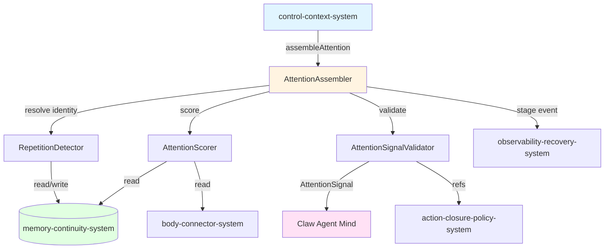
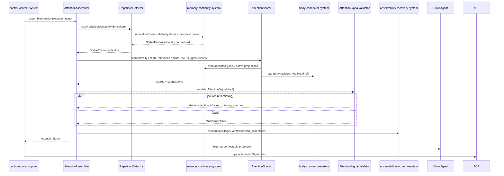
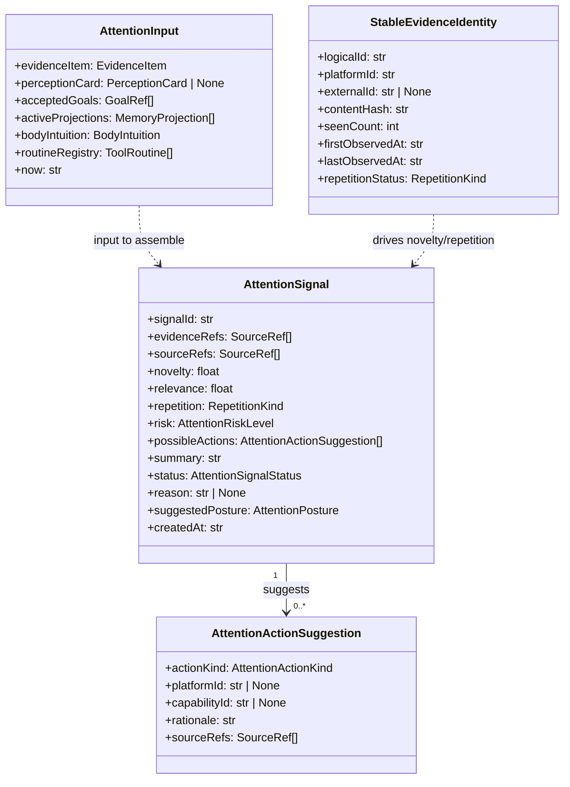

# attention-system 系统设计文档 (L0 — 导航层)

| 字段 | 值 |
| --- | --- |
| **System ID** | `attention-system` |
| **Project** | Second Nature v9 |
| **Version** | 1.0 |
| **Status** | Draft |
| **Author** | Nyx / system-designer |
| **Date** | 2026-06-21 |
| **L1 Detail** | [attention-system.detail.md](./attention-system.detail.md) — `/forge` 时加载 |

> [!IMPORTANT]
> **文档分层说明**
> - **本文件 (L0 导航层)**: 架构图、操作契约、设计决策。面向快速理解与任务规划。
> - **[attention-system.detail.md](./attention-system.detail.md) (L1 实现层)**: 完整伪代码、配置常量、边缘情况。仅 `/forge` 明确引用时加载。
> - **L1 锚点原则**: L1 中的每一节都必须在本文件有对应超链接入口。

---

## 目录 (Table of Contents)

| § | 章节 | 关键内容 |
| :---: | --- | --- |
| 1 | [概览](#1-概览-overview) | 系统目的、边界、职责 |
| 2 | [目标与非目标](#2-目标与非目标-goals--non-goals) | Goals / Non-Goals |
| 3 | [背景与上下文](#3-背景与上下文-background--context) | 为什么需要这个系统、约束 |
| 4 | [系统架构](#4-系统架构-architecture) | Mermaid 架构图、组件职责、数据流 |
| 5 | [接口设计](#5-接口设计-interface-design) | 操作契约表、跨系统协议 |
| 6 | [数据模型](#6-数据模型-data-model) | 实体字段声明、ER 图 |
| 7 | [技术选型](#7-技术选型-technology-stack) | 核心技术、关键依赖 |
| 8 | [Trade-offs](#8-trade-offs--alternatives-权衡与备选方案) | 决策理由、备选方案对比 |
| 9 | [安全性考虑](#9-安全性考虑-security-considerations) | 风险与缓解 |
| 10 | [性能考虑](#10-性能考虑-performance-considerations) | 性能目标、优化策略 |
| 11 | [测试策略](#11-测试策略-testing-strategy) | 单测、集成、契约矩阵 |
| 12 | [部署与运维](#12-部署与运维-deployment--operations) *(可选)* | N/A |
| 13 | [未来考虑](#13-未来考虑-future-considerations) *(可选)* | N/A |
| 14 | [附录](#14-appendix-附录) *(可选)* | 术语表、参考资料 |

**L1 实现层** → [attention-system.detail.md](./attention-system.detail.md)
> [§1 配置常量](./attention-system.detail.md) · [§2 数据结构](./attention-system.detail.md) · [§3 算法](./attention-system.detail.md) · [§4 决策树](./attention-system.detail.md) · [§5 边缘情况](./attention-system.detail.md)

---

## 1. 概览 (Overview)

### 1.1 System Purpose (系统目的)

`attention-system` 将 `EvidenceItem` / `PerceptionCard` 输入转换为 `AttentionSignal`，计算 novelty、relevance、repetition、risk、possible actions、thread suggestion 和 source refs。它向 Claw Agent 提示“哪些外部信号值得关注、是否应延续某个 ActivityThread”，但绝不替代 Agent 做最终心智判断。

### 1.2 System Boundary (系统边界)

- **输入 (Input)**: `EvidenceItem`（来自 `body-connector-system` / `memory-continuity-system`）、accepted goals、active memory projections、`BodyIntuition`、`ToolRoutine` 列表。
- **输出 (Output)**: `AttentionSignal`、optional `activityThreadId` / `threadSuggestion`、`StableEvidenceIdentity`、blocked/degraded reason。
- **依赖系统 (Dependencies)**:
  - `memory-continuity-system`: 稳定证据身份读写、证据读取。**`memory-continuity-system` 是 `normalizeEvidenceIdentity` 与 `EvidenceItem` 表的 canonical owner**。
  - `body-connector-system`: `BodyIntuition`、`ToolRoutine` 读取。
  - `observability-recovery-system`: stage event / audit 写入。
- **被依赖系统 (Dependents)**:
  - `control-context-system`: 调用 `assembleAttention` 并注入 EmbodiedContext。
  - `action-closure-policy-system`: 通过 AttentionSignal refs 获取注意力上下文。

### 1.3 System Responsibilities (系统职责)

**负责**:

- 稳定证据身份解析与重复暴露抑制（stable evidence identity / repetition suppression）。
- 来源可追溯的注意力评分（novelty / relevance / risk / possible actions）。
- 装配 `AttentionSignal`，输出 bounded、source-backed summary。
- 对 related/stale/duplicate evidence 给出 create/continue/pause/complete/none thread suggestion；thread lifecycle 仍由 `control-context-system` 拥有。
- 当 source refs 缺失时降级为 `attention_blocked_missing_sources`。

**不负责**:

- 最终 action judgment / decision（由 Claw Agent 与 `action-closure-policy-system` 负责）。
- external write policy evaluation（由 `action-closure-policy-system` 负责）。
- 长期记忆投影生命周期管理（由 `memory-continuity-system` 负责）。
- 人格/情绪断言（由 `character-continuity-system` 以 contestable projection 方式负责，且同样不替代 Agent）。

---

## 2. 目标与非目标 (Goals & Non-Goals)

### 2.1 Goals

- **[G1]** 将 evidence / perception 输入转换为 `AttentionSignal`，输出 novelty、relevance、repetition、risk、possible actions、source refs（PRD [REQ-003]）。
- **[G1a]** 当 evidence 与 active thread 相关时输出 `threadSuggestion`，帮助 heartbeat 延续活动脉络而不是每轮从零开始（PRD [REQ-003]）。
- **[G2]** 通过 stable evidence identity 抑制重复暴露，相同 logical identity 不新增等价 artifact（PRD [REQ-002]）。
- **[G3]** source refs 缺失时必须降级为 `attention_blocked_missing_sources`，不得触发 write-side action proposal（PRD [REQ-003]）。
- **[G4]** 单条 evidence 的注意力装配延迟默认 < 50 ms（p95），不阻塞 heartbeat 2 s 总预算（PRD §6.1）。

### 2.2 Non-Goals

- **[NG1]** 不输出“最终判断”或“Agent 必须如何做”的指令。
- **[NG2]** 不做情绪断言、人格模拟或程序化心智控制。
- **[NG3]** 不直接触发 external write 或绕过 `ActionPolicyDecision`。
- **[NG4]** 不替代 Claw Agent 的 reasoning；所有输出标注为 contestable body projection。
- **[NG5]** 不创建、关闭或持久化 `ActivityThread`；只给出 source-backed suggestion。

---

## 3. 背景与上下文 (Background & Context)

### 3.1 Why This System? (为什么需要这个系统？)

v8 使用 `JudgmentVerdict` 在实时路径上闭合语义，但这模糊了身体与 Agent 心智的边界。v9 明确：Claw Agent 是开放心智，Second Nature 只提供 source-backed attention、body intuition、policy boundary 和 contestable projection。`attention-system` 是实时语义层的收窄：从“身体替 Agent 判断”退化为“身体提示 Agent 看什么”。

**关联 PRD 需求**: [REQ-002], [REQ-003], US-002, US-003。

### 3.2 Current State (现状分析)

v8 已实现 `JudgmentVerdict`、`PerceptionCard` 和证据规范化。v9 需要：

1. 将 v8 judgment 语义迁移/包装为 `AttentionSignal`。
2. 新增 `StableEvidenceIdentity` 以阻止重复 feed artifact 膨胀。
3. 在 `AttentionSignal` 中显式保留 source refs，缺失时阻断下游 write proposal。

### 3.3 Constraints (约束条件)

- **技术约束**: 必须兼容 v8 state stores、v7 life evidence artifacts 与 OpenClaw plugin runtime（PRD §6.1）。
- **语义约束**: `observedAt` 不得参与 logical identity（PRD US-002 边界）。
- **安全约束**: summary 与 reason 不得包含 raw credential、raw private message 或未解析 source ref。
- **边界约束**: LLM 仅用于 summary 重写，不得用于评分或隐性 judgment。

---

## 4. 系统架构 (Architecture)

### 4.1 Architecture Diagram (架构图)



### 4.2 Core Components (核心组件)

| Component | Responsibility | Tech Stack | Notes |
| --- | --- | --- | --- |
| `AttentionAssembler` | 编排 identity → score → validate → signal 全流程 | TypeScript module | 暴露 `AttentionAssemblerPort` 给 `control-context-system` |
| `RepetitionDetector` | 解析 stable identity，判定 new / changed / duplicate / unstable；** durable upsert 调用 `memory-continuity-system.normalizeEvidenceIdentity`** | TypeScript + SQLite read/write | 写入端口属于 `memory-continuity-system`；`attention-system` 可本地缓存/预计算 key，但不绕过 owner 写入 |
| `AttentionScorer` | 计算 novelty、relevance、risk，生成 possible actions | TypeScript rules-first | 可选 LLM 仅用于 summary，不参与评分 |
| `AttentionSignalValidator` | 校验 source refs、summary 长度、redaction、status 一致性 | TypeScript | 缺失 source refs 时阻断 |

### 4.3 Data Flow (数据流)



**关键数据流说明**:

1. 每次 heartbeat 中 `control-context-system` 调用 `assembleAttention`，输入单条或批量 `EvidenceItem`。
2. `RepetitionDetector` 先调用 `memory-continuity-system.normalizeEvidenceIdentity` 解析 stable identity；若已存在则更新 `seenCount`，否则新建 logical identity。
3. `AttentionScorer` 读取 goals/projections（memory）与 body intuition/routines（body）计算评分。
4. `AttentionSignalValidator` 最终校验；缺失 source refs 时强制 `attention_blocked_missing_sources`。
5. 若命中 active thread，`AttentionSignal` 可携带 `activityThreadId` 与 `threadSuggestion="continue"`；若重复暴露无新信息，可建议 `pause` 或 `none`。
6. 装配结果通过 stage event 写入 `observability-recovery-system`，不直接写入外部平台。

---

## 5. 接口设计 (Interface Design)

### 5.1 操作契约表 (Operation Contracts)

| 操作 | [REQ-XXX] | 前置条件 | 消耗/输入 | 产出/副作用 | 实现细节 |
| --- | :-------: | --- | --- | --- | :-----------------: |
| `assembleAttention(input: AttentionInput)` | [REQ-003] | `input.evidenceItem` 存在；storage port 已注入 | `AttentionInput` | `AttentionSignal`；写入 stage event | [§3.6](./attention-system.detail.md) |
| `resolveStableIdentity(evidence: EvidenceItem)` | [REQ-002] | `contentHash` 或 `externalId` 至少存在一个 | `EvidenceItem` | `StableEvidenceIdentity`；upsert `seenCount` | [§3.1](./attention-system.detail.md) |
| `scoreNovelty(identity, evidence)` | [REQ-002] | identity 已解析 | `StableEvidenceIdentity`, `EvidenceItem` | `number` [0,1] | [§3.2](./attention-system.detail.md) |
| `scoreRelevance(evidence, ctx)` | [REQ-003] | `ctx.goals` / `ctx.projections` 已加载 | `EvidenceItem`, `AttentionContext` | `number` [0,1] | [§3.3](./attention-system.detail.md) |
| `scoreRisk(evidence)` | [REQ-003] | `evidence.sensitivityClass` 已分类 | `EvidenceItem` | `AttentionRiskLevel` | [§3.4](./attention-system.detail.md) |
| `suggestActions(evidence, ctx)` | [REQ-003] | body intuition / routines 已加载 | `EvidenceItem`, `AttentionContext` | `AttentionActionSuggestion[]` | [§3.5](./attention-system.detail.md) |
| `suggestActivityThread(evidence, ctx)` | [REQ-003] | active threads 可读或显式 unavailable | `EvidenceItem`, `AttentionContext`, active `ActivityThread[]` | `activityThreadId?`, `threadSuggestion` | [§3.5a](./attention-system.detail.md) |

### 5.2 跨系统接口协议 (Cross-System Interface)

```typescript
// attention-system 暴露给 control-context-system 的端口
interface AttentionAssemblerPort {
  assembleAttention(input: AttentionInput): Promise<AttentionSignal>;
}

// attention-system 内部 / 依赖 memory-continuity-system 的端口
interface RepetitionDetectorPort {
  resolveStableIdentity(evidence: EvidenceItem): Promise<StableEvidenceIdentity>;
}

// attention-system 内部评分端口
interface AttentionScorerPort {
  scoreNovelty(identity: StableEvidenceIdentity, evidence: EvidenceItem): number;
  scoreRelevance(evidence: EvidenceItem, ctx: AttentionContext): number;
  scoreRisk(evidence: EvidenceItem): AttentionRiskLevel;
  suggestActions(evidence: EvidenceItem, ctx: AttentionContext): AttentionActionSuggestion[];
}
```

### 5.3 HTTP API 端点摘要 (如适用)

N/A。`attention-system` 是运行时模块，通过 `AttentionAssemblerPort` 被 `control-context-system` 调用，不暴露独立 HTTP 端点。

---

## 6. 数据模型 (Data Model)

### 6.1 核心实体 (Core Entities)

```typescript
// 注意力信号：身体的提示，不是最终判断
@dataclass
class AttentionSignal:
    signalId: str
    evidenceRefs: SourceRef[]
    sourceRefs: SourceRef[]
    novelty: float           // [0, 1]
    relevance: float         // [0, 1]
    repetition: RepetitionKind
    risk: AttentionRiskLevel
    possibleActions: AttentionActionSuggestion[]
    summary: str             // bounded, redacted
    status: AttentionSignalStatus
    reason: str | None       // blocked/degraded reason
    suggestedPosture: AttentionPosture
    createdAt: str

    def hasWritableSources(self) -> bool: ...
    def toContestablePrompt(self) -> str: ...
```

```typescript
// 注意力装配输入
@dataclass
class AttentionInput:
    evidenceItem: EvidenceItem
    perceptionCard: PerceptionCard | None
    acceptedGoals: GoalRef[]
    activeProjections: MemoryProjection[]
    bodyIntuition: BodyIntuition
    routineRegistry: ToolRoutine[]
    now: str
```

```typescript
// 稳定证据身份：重复抑制核心实体
@dataclass
class StableEvidenceIdentity:
    logicalId: str
    platformId: str
    externalId: str | None
    contentHash: str
    seenCount: int
    firstObservedAt: str
    lastObservedAt: str
    repetitionStatus: RepetitionKind
```

```typescript
// 可行动建议：建议姿态，不是 policy 决策
@dataclass
class AttentionActionSuggestion:
    actionKind: AttentionActionKind
    platformId: str | None
    capabilityId: str | None
    rationale: str           // bounded, redacted
    sourceRefs: SourceRef[]
```

> *(完整枚举值、验证规则、SourceRef 扩展 → [L1 §2](./attention-system.detail.md)；配置常量 → [L1 §1](./attention-system.detail.md))*

### 6.2 实体关系图 (Entity Relationship)



### 6.3 数据流向 (Data Flow Direction)

- `EvidenceItem` 从 `body-connector-system` 流入，经 `attention-system` 调用 `memory-continuity-system.normalizeEvidenceIdentity` 解析为 `StableEvidenceIdentity` 后持久化到 `memory-continuity-system`。
- `AttentionSignal` 流出到 `control-context-system`，再注入 Claw Agent context；`action-closure-policy-system` 可引用其 refs，但不直接消费完整信号做决策。
- 无数据直接写入外部平台；所有输出均经过 redaction 与 source ref 校验。

---

## 7. 技术选型 (Technology Stack)

### 7.1 Core Technologies

| Domain | Choice | Rationale |
| --- | --- | --- |
| Language | TypeScript / Node.js | ADR-001 延续 v8 运行时栈 |
| Storage | SQLite/sql.js via `memory-continuity-system` | 稳定身份读写复用现有 state store |
| Scoring | Rules-first classifier | 避免模型幻觉成为隐性 judgment，符合 ADR-002 |
| Optional Summary | LLM assist (bounded) | 仅用于自然语言 summary，不参与评分 |

### 7.2 Key Libraries/Dependencies

- v8 canonical `SourceRef` / `SourceRefFamily` from `src/shared/types/v8-contracts.ts`；v9 `shared-v9-contracts.md` 已将 `attention` 纳入 `SourceRefFamily` 白名单。`stable_identity` 是 `memory-continuity-system` 内部概念，不暴露为独立 family。
- `observability-recovery-system` stage event sink（已存在 `loop_stage_event` schema）。
- `memory-continuity-system` read/write ports for `StableEvidenceIdentity`。

---

## 8. Trade-offs & Alternatives (权衡与备选方案)

### 8.1 [跨系统决策] 从 JudgmentVerdict 到 AttentionSignal

> **决策来源**: [ADR-002: Narrow Real-Time Semantics to Attention, Not Agent Mind](../03_ADR/ADR_002_ATTENTION_NOT_AGENT_MIND.md)
>
> v9 用 `AttentionSignal` 替代 v8 `JudgmentVerdict`，只提示不决策。本系统实现该 ADR，不重复其理由。
>
> **本系统特有实现**:
> - 评分层为规则优先；LLM 仅用于 summary，避免模型幻觉变成隐性 judgment。
> - `possibleActions` 是建议列表，不携带 policy 决策。
> - 缺少 source refs 时 status = `attention_blocked_missing_sources`，禁止进入 write-side proposal。

---

### 8.2 [本系统特有决策] Scoring Model: Rules-First vs Model-First

**Option A: Rules-first + optional model summary (Selected)**

- **优点**:
  - deterministic，可回归测试，低成本，安全。
  - 符合 ADR-002 的 Mind/Body 边界。
- **缺点**:
  - 不引入外部语义模型时，难以捕捉微妙的语义相关性，需要周期性调整规则。

**Option B: Model-first scoring**

- **优点**:
  - 更丰富的语义匹配能力。
- **缺点**:
  - 模型幻觉可能变成隐性 judgment；违反 ADR-002。
  - 引入不可解释评分，难以回归与审计。

**Decision**: 选择 **Option A（规则优先 + 模型仅 summary）**，因为：

1. 评分必须可解释、可回归测试，符合 ADR-002 的边界要求。
2. 避免 LLM 在实时路径上产生隐性 judgment，进而让 Second Nature 看起来在替 Agent 决策。
3. summary 是自然语言呈现，不决定 policy，因此模型辅助风险可控。

---

### 8.3 Stable Identity Key: externalId + contentHash vs contentHash-only

**Option A: externalId + contentHash composite (Selected)**

- **优点**: 利用平台原生身份稳定追踪；`contentHash` 捕获内容编辑。
- **缺点**: 要求 connector 输出稳定 `externalId`。

**Option B: contentHash only**

- **优点**: 简单，无需 connector 改字段。
- **缺点**:  cosmetic 编辑会制造 false duplicate；hash 冲突虽低但无二次校验。

**Decision**: 选择 **Option A**。当 `externalId` 缺失时降级为 `identity_unstable`，既不伪造稳定身份，也不让不稳定内容进入 routine signal。

---

## 9. 安全性考虑 (Security Considerations)

### 9.1 Data Redaction

- `AttentionSignal.summary` 与 `AttentionActionSuggestion.rationale` 必须经过 redaction gate，禁止包含 raw credential、PII、raw private message。
- `reason` 字段仅允许使用 canonical reason code，不得回显证据内容。

### 9.2 Source Ref Integrity

- 缺失或 `resolveStatus == "missing"` 的 source refs 必须触发 `attention_blocked_missing_sources`。
- `possibleActions` 中所有 `sourceRefs` 必须与 `AttentionSignal.sourceRefs` 可解析。

### 9.3 Security Risks & Mitigations

| Risk | Severity | Mitigation |
| --- | :------: | --- |
| 无来源证据被误判为可行动 | 高 | `AttentionSignalValidator` 强制阻断；status=`attention_blocked_missing_sources` |
| 敏感内容泄露到 Agent context | 高 | redaction gate + `sensitivityClass` 映射；`risk=high` 时建议 `notify_owner`/`watch` 而非 `remember` |
| LLM summary 生成虚假来源 | 中 | 规则模板回退；LLM 输出必须校验长度与 redactionClass |
| 重复证据导致 context 污染 | 中 | `StableEvidenceIdentity` + `seenCount` 抑制；duplicate 默认降低 priority |
| 空内容证据进入 attention | 低 | 标记 `degraded`，`reason="empty_evidence_content"`；见 [L1 §5.6](./attention-system.detail.md#56-empty-evidence-content) |

---

## 10. 性能考虑 (Performance Considerations)

### 10.1 Performance Goals

- 单条 evidence 注意力装配 p95 < 50 ms。
- 无 LLM 调用时批量 100 条 evidence p95 < 200 ms。
- 不阻塞 `control-context-system` 的 2 s 总预算（PRD §6.1）。

### 10.2 Optimization Strategies

1. **Stable Identity Lookup**:
   - 复合索引：`(platform_id, external_id, content_hash)`。
   - 批量读取/upsert 减少 storage round-trip。

2. **In-Memory Scoring**:
   - novelty / relevance / risk / action suggestion 全部在内存中完成。
   - goals / projections / body intuition 由调用方预加载，避免 N+1。

3. **Optional LLM Summary Guard**:
   - LLM 调用带 timeout，超时回退规则模板，不阻塞关键路径。
   - 默认关闭，需显式配置才启用。

### 10.3 Performance Monitoring

- `observability-recovery-system` 记录 `attention_assembled` stage event 与 latency。
- 关键指标：assembly latency (p50/p95/p99)、blocked ratio、duplicate ratio、identity unstable ratio。

---

## 11. 测试策略 (Testing Strategy)

### 11.1 Unit Testing

- **Framework**: Node.js native test runner / Vitest（与仓库现有测试栈一致）。
- **Key Test Areas**:
  - [ ] `RepetitionDetector`: new / changed / duplicate / identity_unstable 四种状态
  - [ ] `AttentionScorer`: novelty、relevance、risk 映射边界
  - [ ] `AttentionSignalValidator`: 缺失 source refs → `attention_blocked_missing_sources`
  - [ ] Summary redaction 与 char budget
  - [ ] Action suggestion 排序与上限

### 11.2 Integration Testing

- **Scenarios**:
  - [ ] 同一 MoltBook feed fixture 运行 3 次，验证 0 条新增 logical evidence row，仅 `seenCount` 递增（PRD US-002 AC）。
  - [ ] public technical content 与 accepted goal 相关时，输出包含 `notify_owner`/`watch`/`remember` 的 `AttentionSignal`（PRD US-003 AC）。
  - [ ] source refs 缺失时返回 `attention_blocked_missing_sources`，且不触发 action proposal。
  - [ ] `identity_unstable` 证据不进入 routine signal。

### 11.3 End-to-End Testing

- N/A for v9 design phase。E2E 验证在 `/forge` §3.7 阶段由真人回填。

### 11.4 Performance Testing

- [ ] 批量 100 evidence 装配 latency p95 < 200 ms（unit-level benchmark）。

### 11.5 Contract Verification Matrix

| 契约 | 风险级别 | 正常态验证 | 失败态验证 | 回归责任 |
| --- | --- | --- | --- | --- |
| `assembleAttention` | 关键路径 | 集成测试：goal 命中 → attentive signal | source refs 缺失 → `attention_blocked_missing_sources` | heartbeat attention 路径最小回归 |
| `resolveStableIdentity` | 高 | 单元 + 存储集成：new/changed/duplicate | `externalId` 与 `contentHash` 均缺失 → `identity_unstable` | 重复抑制回归 |
| `scoreRisk` | 中 | 单元测试：sensitivity → risk 映射 | sensitive 内容不建议 `remember` | sensitivity classifier 回归 |
| `suggestActions` | 中 | 单元测试：risk/goal/routine 命中 | 无匹配时默认 `defer` | action suggestion 回归 |

---

## 12. 部署与运维 (Deployment & Operations)

### 12.1 Deployment Process

N/A。`attention-system` 是 Second Nature 运行时 TypeScript 模块，随 `control-context-system` 一起由 OpenClaw plugin / Node CLI 加载。部署生命周期由 `runtime-ops-system` 管理。

### 12.2 Monitoring & Alerting

- 指标由 `observability-recovery-system` 聚合：
  - `attention_assembled` 计数与 latency
  - `attention_blocked_missing_sources` 比率
  - `identity_unstable` 比率
  - duplicate suppression 比率

### 12.3 Observability

- 每个 `AttentionSignal` 装配成功后写入 `loop_stage_event`，payload redacted。
- blocked / degraded 路径必须写入 reason code，不写入证据原文。

---

## 13. 未来考虑 (Future Considerations)

### 13.1 Scalability

N/A for v9。当前单 workspace 日 1,000 条 evidence 在 SQLite + 内存评分模型下足够。若未来证据量增长一个数量级，可考虑：

- 将 `StableEvidenceIdentity` 查询缓存到内存索引。
- 批量评分与异步 summary 生成。

以上不属于 v9 范围。

### 13.2 Tech Debt

- [已决策] v8 `JudgmentVerdict` 存量 rows 视为只读 legacy；`attention-system` 新写入全部使用 `AttentionSignal`。如需读取 v8 rows，由 `memory-continuity-system` 在 read 时按只读映射返回 `status=degraded`、`reason=v8_legacy_judgment_mapped` 的 `AttentionSignal`，不修改 schema。

### 13.3 Future Enhancements

N/A for v9。潜在增强（semantic relevance model、跨 evidence 注意力聚合）需要独立 ADR，不在本版本交付。

---

## 14. Appendix (附录)

### 14.1 Glossary (术语表)

- **AttentionSignal**: 身体给 Agent 的注意力提示，不替代 Agent 最终判断。
- **StableEvidenceIdentity**: 用于重复暴露抑制的逻辑证据身份。
- **AttentionActionSuggestion**: 建议性行动姿态，不是 policy 决策。
- **RepetitionKind**: `new` | `changed` | `duplicate` | `identity_unstable`。
- **contestable projection**: 可反驳、可改写、source-backed 的投影，不声称绝对真实。

### 14.2 Optional Skills & Reference Resources

N/A。本设计未使用外部 skill；模板与 ADR/PRD/Architecture Overview 为唯一事实来源。

### 14.3 References (参考资料)

- PRD: [REQ-002], [REQ-003], US-002, US-003
- ADR-002: [Narrow Real-Time Semantics to Attention, Not Agent Mind](../03_ADR/ADR_002_ATTENTION_NOT_AGENT_MIND.md)
- Architecture Overview: §2 System 3, §3 系统依赖图
- Concept Model: `Attention Signal`, `Stable Evidence Identity` 定义

### 14.4 Change Log (变更日志)

| Version | Date | Changes | Author |
| --- | --- | --- | --- |
| 1.0 | 2026-06-21 | 初始 L0；定义 AttentionSignal、StableEvidenceIdentity、操作契约与跨系统接口 | Nyx |

---

<!-- L0 撰写自检 --
- [x] 1-11 必需章节完整
- [x] 操作契约表 §5.1 含 6 个原子操作并链接 L1
- [x] 数据模型 §6 含字段声明，无方法体
- [x] Trade-offs §8 引用 ADR-002 不复制正文
- [x] 跨系统接口契约含依赖方向
- [x] 来源锚点：[REQ-002], [REQ-003], ADR-002, Architecture Overview §2/§3
- [x] L1 拆分已创建 attention-system.detail.md 并链接
-->
