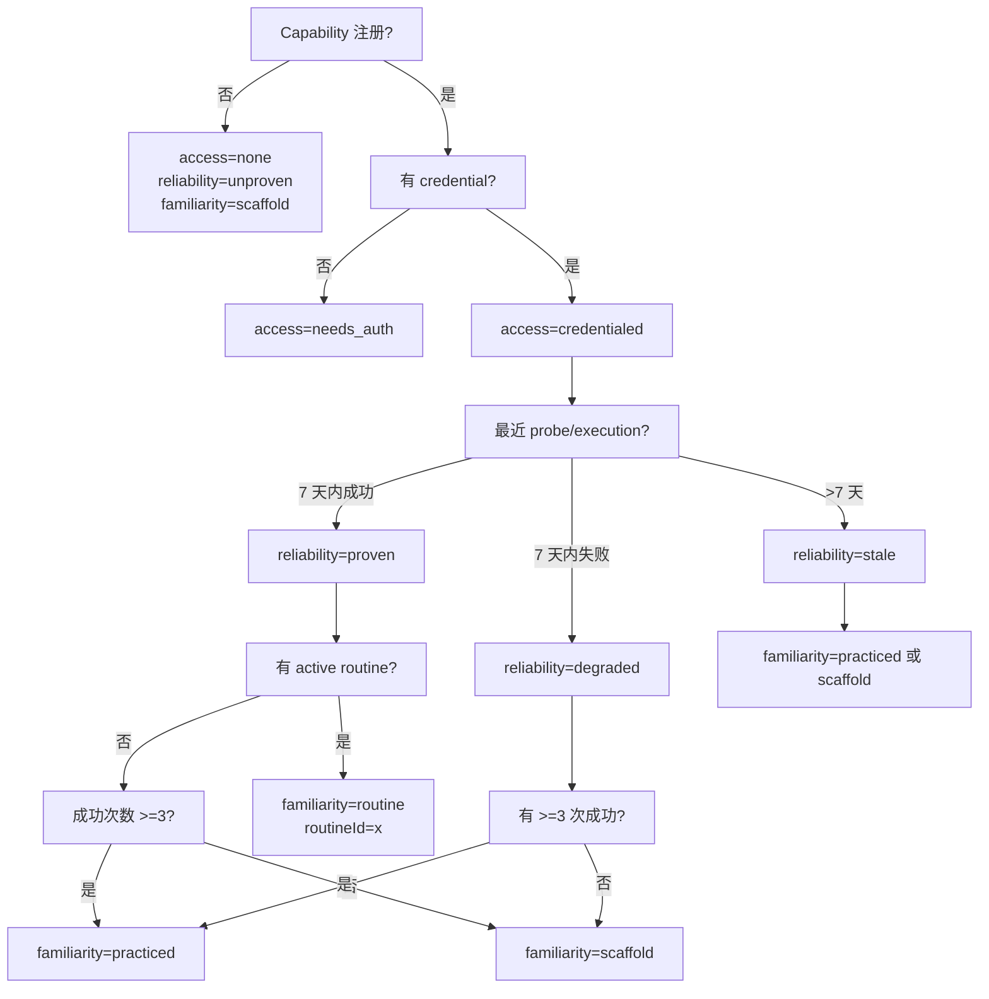
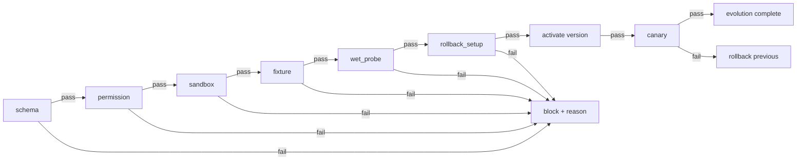
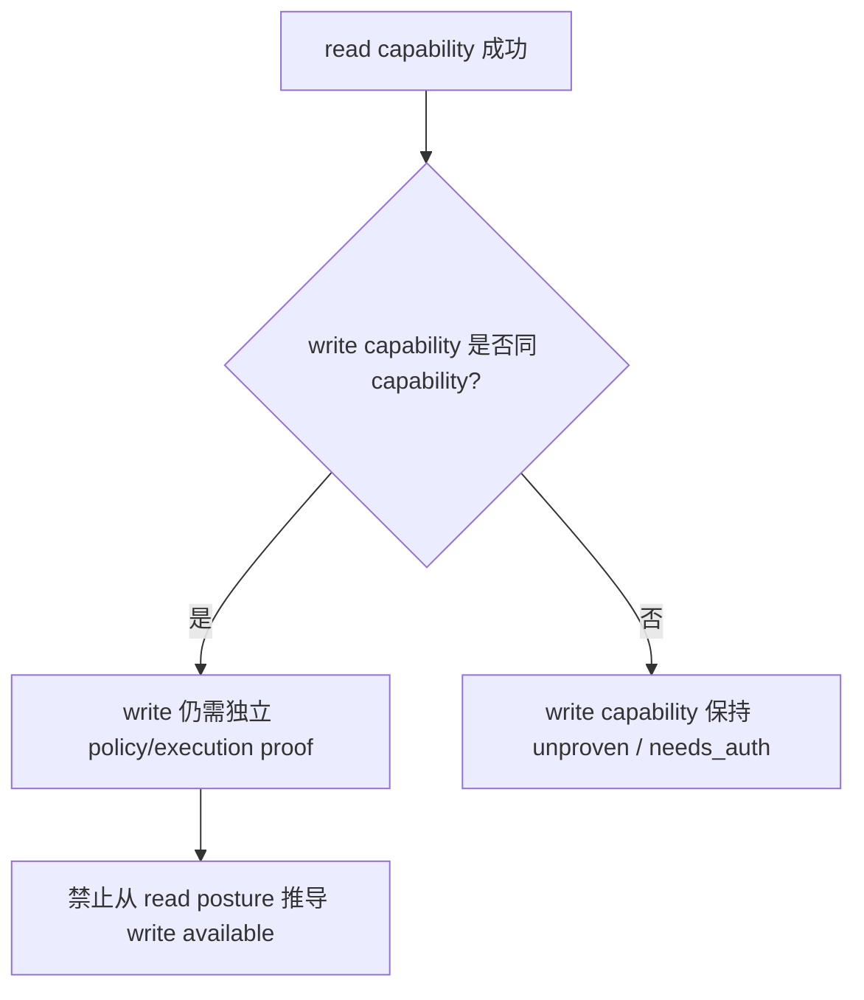

# body-connector-system L1 实现层

> 本文件仅在被 `/forge` 任务明确引用时加载。> L0 导航入口: [body-connector-system.md](./body-connector-system.md)

---

## §1 配置常量 (Configuration Constants)

对应 L0: [§7 技术选型](./body-connector-system.md#7-技术选型-technology-stack) / [§10 性能考虑](./body-connector-system.md#10-性能考虑-performance-considerations).

```typescript
// 时间衰减与缓存
const AFFORDANCE_STALE_PROBE_MS = 7 * 24 * 60 * 60 * 1000;   // 7 天未 probe 视为 stale
const AFFORDANCE_CACHE_TTL_MS   = 5 * 60 * 1000;             // heartbeat 内 memoize
const ROUTINE_RETIRE_AFTER_MS   = 90 * 24 * 60 * 60 * 1000;  // 90 天无执行可 retired

// Sandbox 限制（OPEN 项已关闭；详见 L0 §9.3）
const SANDBOX_TIMEOUT_MS      = 10_000;
const SANDBOX_MAX_MEMORY_MB   = 128;
const SANDBOX_ALLOWED_GLOBALS = ['console', 'Buffer', 'setTimeout', 'clearTimeout'];
const SANDBOX_ALLOWED_MODULES = ['node:https', 'node:url', 'node:querystring', 'node:crypto'];
const SANDBOX_FS_ROOT         = '.second-nature/connectors/{platformId}/sandbox';
const SANDBOX_NETWORK_ALLOWLIST = ['https://*.moltbook.io', 'https://*.agent-world.example']; // 按 workspace policy 可扩展
const SANDBOX_WORKER_COUNT    = 1; // 每个 adapter 一个隔离 worker

// 禁止：vm2、eval、Function constructor、child_process、fs 出沙箱目录、raw require

// 7-gate 顺序与最小通过集合
const EVOLUTION_GATE_ORDER = [
  'schema',
  'permission',
  'sandbox',
  'fixture',
  'wet_probe',
  'canary',
  'rollback_setup',
] as const;

// Failure detail 截断
const CONNECTOR_FAILURE_DETAIL_MAX_CHARS = 200; // 来源: v8 Wave 108

// Workspace connector asset file access
const CONNECTOR_ASSET_FILE_LOCK_TIMEOUT_MS = 5_000;
const CONNECTOR_ASSET_ATOMIC_RENAME = true; // writes use temp file + rename
```

### §1.1 Sandbox Policy

**对应 L0**: [§9.3 Security Risks](./body-connector-system.md#93-security-risks--mitigations-安全风险与缓解)

workspace scriptable adapter 必须在受控 sandbox 内运行：

- **Runtime**: Node.js `node:vm` + `worker_threads`；**禁止 `vm2`**。
- **Timeout**: 单个 adapter 调用不超过 `SANDBOX_TIMEOUT_MS`（10s）。
- **Memory**: 不超过 `SANDBOX_MAX_MEMORY_MB`（128MB）。
- **Globals 白名单**: 仅 `console`、`Buffer`、`setTimeout`、`clearTimeout`。
- **Module 白名单**: 仅 `node:https`、`node:url`、`node:querystring`、`node:crypto`；禁止 `child_process`、`fs` 出沙箱目录、`raw require`。
- **文件系统边界**: 读写仅限于 `.second-nature/connectors/{platformId}/sandbox/`。
- **网络边界**: 仅允许 `SANDBOX_NETWORK_ALLOWLIST` 中的域名；默认可按 workspace policy 扩展。
- **隔离**: 每个 adapter 一个 worker；执行完毕后 worker 终止，状态不共享。

---

## §2 数据结构 (Data Structures)

对应 L0: [§6 数据模型](./body-connector-system.md#6-数据模型-data-model).

```typescript
// 枚举定义
enum ToolExperienceOutcome {
  success = 'success',
  failure = 'failure',
  skipped = 'skipped',
  denied  = 'denied',
}

enum RoutineStatus {
  candidate  = 'candidate',
  validated  = 'validated',
  active     = 'active',
  retired    = 'retired',
}

enum VersionStatus {
  candidate     = 'candidate',
  staged        = 'staged',
  active        = 'active',
  rolled_back   = 'rolled_back',
}

enum PlanStatus {
  proposed   = 'proposed',
  gating     = 'gating',
  activated  = 'activated',
  rolled_back = 'rolled_back',
  blocked    = 'blocked',
}

enum AccessLevel {
  none        = 'none',
  needs_auth  = 'needs_auth',
  credentialed = 'credentialed',
}

enum ReliabilityLevel {
  unproven  = 'unproven',
  proven    = 'proven',
  stale     = 'stale',
  degraded  = 'degraded',
}

enum FamiliarityLevel {
  scaffold   = 'scaffold',
  practiced  = 'practiced',
  routine    = 'routine',
}

enum ProbeStatus {
  success          = 'success',
  auth_failure     = 'auth_failure',
  network_error    = 'network_error',
  not_implemented  = 'not_implemented',
}

// SourceRef canonical shape（与 shared-v9-contracts.md §1 对齐）
interface SourceRef {
  family: "evidence" | "attention" | "action" | "routine" | "character" | "dream" | "quiet" | "connector" | "capability_probe_result" | "ledger";
  id: string;
  label?: string;
}

interface GateResult {
  gate: string;
  passed: boolean;
  reason?: string;
  evidenceRefs: SourceRef[];
}

interface EvidenceHandoff {
  platformId: string;
  capabilityId: string;
  externalId?: string;
  contentHash?: string;
  contentJson: string;
  observedAt: string;
  sourceRefs: SourceRef[];
  sensitivity: 'public_general' | 'public_technical' | 'private' | 'credential';
}

// 核心实体（与 L0 §6 对应，补充 TypeScript 字段约束）
interface ToolExperience {
  id: string;
  platformId: string;
  capabilityId: string;
  actionKind: 'read' | 'write' | 'probe' | 'routine';
  requestSummaryJson: string;     // redacted; 不含 credential
  resultSummary: string;
  outcome: ToolExperienceOutcome;
  sourceRefs: SourceRef[];
  observedAt: string;
  contentHash?: string;
  familiarityDelta: number;       // [-1, 1]
  reliabilityDelta: number;       // [-1, 1]
}

interface ToolRoutine {
  id: string;
  routineId: string;
  version: string;
  name: string;
  triggerCapabilities: string[];
  triggerConditionsJson: string;  // e.g. { "capabilityId": "moltbook/feed.read", "minSuccessCount": 3 }
  stepsJson: string;              // typed step array
  guardSchemaJson: string;        // canonical ToolRoutineGuardSchema DSL; see shared-v9-contracts.md §6.3
  sourceRefs: SourceRef[];
  rollbackRef: string;
  status: RoutineStatus;
  createdAt: string;
  activatedAt?: string;
  retiredAt?: string;
}

interface ConnectorVersion {
  id: string;
  versionId: string;
  platformId: string;
  workspaceRoot: string;
  planType: string;               // manifest_delta / recipe_delta / adapter_delta
  manifestPath: string;           // relative to workspace root
  recipePath?: string;
  adapterPath?: string;
  declaredCapabilities: string[];
  schemaGate: GateResult;
  permissionGate: GateResult;
  sandboxGate: GateResult;
  fixtureGate: GateResult;
  wetProbeGate: GateResult;
  canaryGate: GateResult;
  status: VersionStatus;
  previousStableRef?: string;
  rollbackRef?: string;
  rollbackCommandHint?: string;   // generated at activation time
  createdAt: string;
  activatedAt?: string;
  rolledBackAt?: string;
}

interface ConnectorEvolutionPlan {
  id: string;
  planId: string;
  platformId: string;             // connector platform id
  planType: string;               // manifest_delta / recipe_delta / adapter_delta
  workspaceRoot: string;
  targetVersionId: string;
  previousStableRef?: string;
  proposedChangesJson: string;    // structured diff
  gateResultsJson?: string;
  sourceRefs: SourceRef[];
  status: PlanStatus;
  createdAt: string;
}

interface AffordancePosture {
  platformId: string;
  capabilityId: string;
  accessLevel: AccessLevel;
  reliabilityLevel: ReliabilityLevel;
  familiarityLevel: FamiliarityLevel;
  lastProbedAt?: string;
  lastExecutedAt?: string;
  routineId?: string;
  sourceRefs: SourceRef[];
}

interface CapabilityProbeResult {
  id: string;
  platformId: string;
  capabilityId: string;
  probeStatus: ProbeStatus;
  detail: string;
  observedAt: string;
  sourceRefs: SourceRef[];
}

// Canonical type: shared-v9-contracts.md §8 AutonomousChangeLedgerEntry.
// This local declaration MUST NOT drift from the shared contract; import the canonical type in implementation.
interface AutonomousChangeLedgerEntry {
  id: string;
  workspaceRoot: string;
  changeKind: 'routine_install' | 'routine_supersede' | 'routine_retire' | 'connector_manifest_delta' | 'connector_recipe_delta' | 'connector_adapter_delta';
  targetId: string;
  previousStableRef?: string;
  status: 'proposed' | 'gated' | 'activated' | 'rolled_back' | 'blocked';
  gateResultsJson?: string;
  rollbackRef?: string;
  rollbackCommandHint?: string;
  sourceRefs: SourceRef[];
  redactedPayloadJson?: string;
  createdAt: string;
  activatedAt?: string;
  rolledBackAt?: string;
}
```

---

## §3 算法与操作契约伪代码 (Algorithms)

对应 L0: [§5.1 操作契约表](./body-connector-system.md#51-操作契约表-operation-contracts).

### §3.1 assembleToolAffordance

```typescript
function assembleToolAffordance(query: AffordanceQuery): AffordancePosture[] {
  const capabilities = listCapabilities(query.platformId, query.capabilityId);
  return capabilities.map(cap => {
    const probe   = loadLatestProbe(cap.platformId, cap.capabilityId);
    const execs   = loadRecentExperiences(cap.platformId, cap.capabilityId, LOOKBACK_DAYS);
    const routine = loadActiveRoutine(cap.platformId, cap.capabilityId);

    const access  = deriveAccessLevel(probe, execs);
    const reliability = deriveReliabilityLevel(probe, execs);
    const familiarity = deriveFamiliarityLevel(execs, routine, cap.isScaffold);

    return {
      platformId: cap.platformId,
      capabilityId: cap.capabilityId,
      accessLevel: access,
      reliabilityLevel: reliability,
      familiarityLevel: familiarity,
      lastProbedAt: probe?.observedAt,
      lastExecutedAt: execs[0]?.observedAt,
      routineId: routine?.routineId,
      sourceRefs: collectSourceRefs(probe, execs, routine),
    };
  });
}
```

### §3.2 executeConnectorRequest

```typescript
async function executeConnectorRequest(
  request: ConnectorRequest,
  ctx: ExecutionContext
): Promise<ConnectorResult> {
  const runner = resolveRunner(request.platformId, request.capabilityId);
  const credential = await ctx.credentialVault.resolveRoute(request.credentialRoute);

  let result: ConnectorResult;
  try {
    result = await runner.run({
      intent: request.intent,
      payload: request.payload,
      credential,
    });
  } catch (err) {
    result = classifyFailure(err);  // v8 failure taxonomy
  }

  const experience = buildToolExperience(request, result);
  await store.writeToolExperience(experience);
  await observability.recordStageEvent({
    stage: 'connector_execution',
    platformId: request.platformId,
    capabilityId: request.capabilityId,
    outcome: experience.outcome,
    sourceRefs: experience.sourceRefs,
  });

  return result;
}
```

### §3.3 normalizeEvidence

```typescript
function normalizeEvidence(
  result: ConnectorResult,
  policy: StableIdentityPolicy,
  memoryContinuity: EvidenceIdentityPort,
): EvidenceHandoff | { status: 'identity_unstable'; reason: string } {
  const externalId = extractExternalId(result);
  const contentHash = computeContentHash(result.data, policy);

  if (!externalId && !contentHash) {
    return { status: 'identity_unstable', reason: 'missing_stable_identity' };
  }

  // canonical owner: memory-continuity-system
  const identity = memoryContinuity.normalizeEvidenceIdentity({
    platformId: result.platformId,
    capabilityId: result.capabilityId,
    externalId,
    contentHash,
    observedAt: result.observedAt,
    sourceRefs: result.sourceRefs,
  });

  return {
    platformId: result.platformId,
    capabilityId: result.capabilityId,
    externalId,
    contentHash,
    contentJson: JSON.stringify(redactPayload(result.data)),
    observedAt: result.observedAt,
    sourceRefs: result.sourceRefs,
    sensitivity: classifyEvidenceSensitivity(result.data),
  };
}
```

### §3.4 recordToolExperience

```typescript
async function recordToolExperience(draft: ToolExperienceDraft): Promise<ToolExperience> {
  const row: ToolExperience = {
    id: generateId(),
    ...draft,
    requestSummaryJson: redactPayloadSummary(draft.requestSummaryJson),
    sourceRefs: appendSelfSourceRef(draft.sourceRefs, 'tool_experience', id),
  };
  await stateStore.writeToolExperience(row);
  await observability.recordAudit({
    family: 'connector.attempt',
    sourceRefs: row.sourceRefs,
    payload: { outcome: row.outcome, platformId: row.platformId, capabilityId: row.capabilityId },
  });
  return row;
}
```

### §3.5 installToolRoutine

```typescript
async function installToolRoutine(
  candidate: RoutineCandidate,
  gate: PolicyGateResult,
  ledgerWritePort: AutonomousChangeLedgerWritePort,
): Promise<RoutineInstallResult> {
  if (!gate.allowed) {
    return {
      status: 'denied',
      reason: 'routine_permission_expansion_denied',
      sourceRefs: candidate.sourceRefs,
    };
  }

  // Canonical guard schema syntax validation (shared-v9-contracts §6.3).
  // action-closure-policy-system already evaluated policy context; body-connector verifies syntax + sandbox compliance.
  const guard = parseToolRoutineGuardSchema(candidate.guardSchemaJson);
  if (!guard.ok) {
    return { status: 'denied', reason: 'routine_guard_validation_failed', detail: guard.error };
  }
  if (guard.data.expandsCapability) {
    return { status: 'denied', reason: 'routine_permission_expansion_denied' };
  }

  const sandboxValidation = validateSandboxCompliance(candidate.stepsJson, guard.data);
  if (!sandboxValidation.ok) {
    return { status: 'denied', reason: 'routine_guard_sandbox_failed', detail: sandboxValidation.error };
  }

  const version: ToolRoutine = {
    ...candidate,
    id: generateId(),
    status: 'active',
    activatedAt: now(),
    rollbackRef: candidate.rollbackRef,
  };

  await routineRegistry.activate(version);
  await ledgerWritePort.writeLedgerEntry({
    id: generateId(),
    workspaceRoot: candidate.workspaceRoot,
    changeKind: 'routine_install',
    targetId: version.routineId,
    previousStableRef: candidate.previousRoutineId,
    status: 'activated',
    sourceRefs: version.sourceRefs,
    redactedPayloadJson: JSON.stringify({ name: version.name, triggerCapabilities: version.triggerCapabilities }),
    createdAt: now(),
    activatedAt: now(),
  });

  return { status: 'active', routine: version };
}
```

### §3.6 invokeToolRoutine

```typescript
async function invokeToolRoutine(
  routineId: string,
  ctx: RoutineInvocationContext
): Promise<RoutineInvocationResult> {
  const routine = await routineRegistry.loadActive(routineId);
  if (!routine) return { status: 'denied', reason: 'routine_not_found' };

  const policyResult = await policy.evaluate({
    actionKind: 'routine',
    capabilityRefs: routine.triggerCapabilities,
    sourceRefs: ctx.sourceRefs,
    routine,
  });
  if (!policyResult.allowed) {
    return { status: 'denied', reason: policyResult.reason };
  }

  const steps = parseSteps(routine.stepsJson);
  const trace: RoutineStepTrace[] = [];
  for (const step of steps) {
    const stepResult = await executeStep(step, ctx);
    trace.push(stepResult);
    if (stepResult.outcome === 'failure') break;
  }

  const closure = await recordRoutineClosure(routine, ctx, trace);
  return { status: 'executed', closure };
}
```

### §3.7 deriveTargetVersion (internal helper)

**对应契约**: L0 §5.1 `applyConnectorEvolution` 的 target version 推导。
**准入理由**: plan 由 `memory-continuity-system` Dream 生成；body-connector 只负责从 plan 推导 version，不对外暴露 `planConnectorEvolution`。
```typescript
function deriveTargetVersion(
  plan: ConnectorEvolutionPlan,
): ConnectorVersion {
  const proposedChanges = JSON.parse(plan.proposedChangesJson);
  return {
    id: generateId(),
    versionId: plan.targetVersionId,
    platformId: plan.platformId,
    workspaceRoot: plan.workspaceRoot,
    planType: plan.planType,
    manifestPath: proposedChanges.manifestPath,
    recipePath: proposedChanges.recipePath,
    adapterPath: proposedChanges.adapterPath,
    declaredCapabilities: proposedChanges.declaredCapabilities ?? [],
    status: 'candidate',
    previousStableRef: plan.previousStableRef,
    createdAt: now(),
  };
}
```

### §3.8 applyConnectorEvolution

**对应契约**: L0 §5.1 `applyConnectorEvolution(plan)`
**准入理由**: 7-gate 串行执行 + ledger 写入 + rollbackCommandHint 生成。

```typescript
function buildRollbackCommandHint(
  platformId: string,
  currentVersionId: string,
  previousVersionId: string | undefined,
): string {
  if (!previousVersionId) return `rollback ${platformId}:${currentVersionId} (no previous stable)`;
  return `second_nature_ops connector_evolution.rollback --platformId=${platformId} --from=${currentVersionId} --to=${previousVersionId}`;
}

async function applyConnectorEvolution(
  plan: ConnectorEvolutionPlan,
  ledgerWritePort: AutonomousChangeLedgerWritePort,
  observability: StageEventSink,
): Promise<EvolutionApplyResult> {
  const previous = loadActiveConnectorVersion(plan.platformId);
  const version = deriveTargetVersion(plan);
  version.previousStableRef = previous?.versionId;

  const gateResults: GateResult[] = [];
  // Pre-activation gates: schema, permission, sandbox, fixture, wet_probe, rollback_setup
  for (const gateName of EVOLUTION_GATE_ORDER.slice(0, -1)) {
    const result = await runGate(gateName, version, plan);
    gateResults.push(result);
    if (!result.passed) {
      version.status = 'candidate';
      await store.writeConnectorVersion(version);
      await observability.recordStageEvent({
        stage: 'connector_evolution',
        platformId: plan.platformId,
        versionId: version.versionId,
        outcome: 'blocked',
        reasonCode: `evolution_gate_${gateName}_failed`,
        sourceRefs: plan.sourceRefs,
      });
      return { status: 'blocked', gate: gateName, gateResults };
    }
  }

  // Activate and run post-activation canary
  version.status = 'active';
  version.activatedAt = now();
  version.rollbackCommandHint = buildRollbackCommandHint(plan.platformId, version.versionId, previous?.versionId);
  await store.writeConnectorVersion(version);
  if (previous) previous.status = 'rolled_back';

  await ledgerWritePort.writeLedgerEntry({
    id: generateId(),
    workspaceRoot: plan.workspaceRoot,
    changeKind: plan.planType,
    targetId: version.versionId,
    previousStableRef: version.previousStableRef,
    status: 'activated',
    gateResultsJson: JSON.stringify(gateResults),
    rollbackCommandHint: version.rollbackCommandHint,
    sourceRefs: plan.sourceRefs,
    redactedPayloadJson: JSON.stringify({ declaredCapabilities: version.declaredCapabilities }),
    createdAt: now(),
    activatedAt: now(),
  });

  await observability.recordStageEvent({
    stage: 'connector_evolution',
    platformId: plan.platformId,
    versionId: version.versionId,
    outcome: 'activated',
    reasonCode: 'evolution_activated',
    sourceRefs: plan.sourceRefs,
  });

  const canary = await runGate('canary', version, plan);
  gateResults.push(canary);
  if (!canary.passed) {
    await observability.recordStageEvent({
      stage: 'rollback',
      platformId: plan.platformId,
      versionId: version.versionId,
      outcome: 'started',
      reasonCode: 'evolution_canary_failed',
      sourceRefs: plan.sourceRefs,
    });

    const rollback = await rollbackConnectorVersion(version.versionId, ledgerWritePort, observability);
    return {
      status: rollback.status === 'rolled_back' ? 'rolled_back' : 'blocked',
      version,
      gateResults,
      rollback,
    };
  }

  return { status: 'active', version, gateResults };
}
```

### §3.9 rollbackConnectorVersion

**对应契约**: L0 §5.1 `rollbackConnectorVersion(versionId)`
**准入理由**: 恢复 previous stable version 并写入 ledger。

```typescript
async function rollbackConnectorVersion(
  versionId: string,
  ledgerWritePort: AutonomousChangeLedgerWritePort,
  observability: StageEventSink,
): Promise<RollbackResult> {
  const current = await store.loadConnectorVersion(versionId);
  if (!current?.previousStableRef) {
    await observability.recordStageEvent({
      stage: 'rollback',
      platformId: current?.platformId ?? 'unknown',
      versionId,
      outcome: 'blocked',
      reasonCode: 'no_previous_stable_ref',
      sourceRefs: current?.sourceRefs ?? [],
    });
    return { status: 'blocked', reason: 'no_previous_stable_ref' };
  }

  const previous = await store.loadConnectorVersion(current.previousStableRef);
  if (!previous) {
    await observability.recordStageEvent({
      stage: 'rollback',
      platformId: current.platformId,
      versionId,
      outcome: 'blocked',
      reasonCode: 'previous_version_missing',
      sourceRefs: current.sourceRefs,
    });
    return { status: 'blocked', reason: 'previous_version_missing' };
  }

  await observability.recordStageEvent({
    stage: 'rollback',
    platformId: current.platformId,
    versionId: current.versionId,
    outcome: 'started',
    reasonCode: 'rollback_started',
    sourceRefs: current.sourceRefs,
  });

  current.status = 'rolled_back';
  previous.status = 'active';
  previous.activatedAt = now();

  await store.writeConnectorVersion(current);
  await store.writeConnectorVersion(previous);

  const rollbackCommandHint = buildRollbackCommandHint(
    current.platformId,
    current.versionId,
    previous.versionId,
  );

  await ledgerWritePort.writeLedgerEntry({
    id: generateId(),
    workspaceRoot: current.workspaceRoot,
    changeKind: current.planType,
    targetId: current.versionId,
    previousStableRef: previous.versionId,
    status: 'rolled_back',
    gateResultsJson: JSON.stringify([{ gate: 'rollback', passed: true }]),
    rollbackCommandHint,
    sourceRefs: current.sourceRefs,
    redactedPayloadJson: JSON.stringify({ reason: 'canary_failure' }),
    createdAt: now(),
    activatedAt: now(),
  });

  await observability.recordStageEvent({
    stage: 'rollback',
    platformId: current.platformId,
    versionId: current.versionId,
    outcome: 'ok',
    reasonCode: 'rollback_succeeded',
    sourceRefs: current.sourceRefs,
  });

  return { status: 'rolled_back', restoredVersionId: previous.versionId };
}
```

### §3.10 probeCapability

```typescript
async function probeCapability(
  ref: CapabilityRef,
  route: CredentialRoute
): Promise<CapabilityProbeResult> {
  const runner = resolveRunner(ref.platformId, ref.capabilityId);
  const credential = await credentialVault.resolveRoute(route);

  let probeStatus: ProbeStatus;
  let detail: string;
  try {
    const result = await runner.run({ intent: 'probe', payload: {}, credential });
    probeStatus = result.success ? 'success' : 'not_implemented';
    detail = result.detail ?? '';
  } catch (err) {
    const failure = classifyFailure(err);
    probeStatus = mapFailureToProbeStatus(failure);
    detail = truncate(failure.detail, CONNECTOR_FAILURE_DETAIL_MAX_CHARS);
  }

  const row: CapabilityProbeResult = {
    id: generateId(),
    platformId: ref.platformId,
    capabilityId: ref.capabilityId,
    probeStatus,
    detail,
    observedAt: now(),
    sourceRefs: [{ family: 'capability_probe_result', id: this.id }],
  };
  await store.writeCapabilityProbeResult(row);
  return row;
}
```

---

### §3.11 migrateV8ConnectorManifest

**对应契约**: DR-02 v8 connector manifest → v9 `ConnectorVersion` migration
**准入理由**: 明确现有 workspace 在 v9 启动后的 connector 状态。

```typescript
interface V8ConnectorManifest {
  platformId: string;
  capabilities: { capabilityId: string; description?: string }[];
  runner?: { kind: string; config?: Record<string, unknown> };
  recipePath?: string;
  adapterPath?: string;
}

async function migrateV8ConnectorManifest(
  workspaceRoot: string,
  manifestPath: string,
): Promise<ConnectorVersion | undefined> {
  const manifest = await safeReadJson<V8ConnectorManifest>(manifestPath);
  if (!manifest) return undefined;

  const version: ConnectorVersion = {
    id: generateId(),
    versionId: `${manifest.platformId}-v8-migrated`,
    platformId: manifest.platformId,
    workspaceRoot,
    planType: 'manifest_delta',
    manifestPath,
    recipePath: manifest.recipePath,
    adapterPath: manifest.adapterPath,
    declaredCapabilities: manifest.capabilities.map((c) => c.capabilityId),
    schemaGate: { gate: 'schema', passed: true, evidenceRefs: [] },
    permissionGate: { gate: 'permission', passed: true, evidenceRefs: [] },
    sandboxGate: { gate: 'sandbox', passed: true, evidenceRefs: [] },
    fixtureGate: { gate: 'fixture', passed: false, reason: 'migration_no_fixture', evidenceRefs: [] },
    wetProbeGate: { gate: 'wet_probe', passed: false, reason: 'migration_probe_pending', evidenceRefs: [] },
    canaryGate: { gate: 'canary', passed: false, reason: 'not_run', evidenceRefs: [] },
    status: 'candidate',
    createdAt: now(),
  };

  await store.writeConnectorVersion(version);
  return version;
}
```

**迁移语义**:
- v8 manifest 仅生成 `candidate` 状态的 `ConnectorVersion`；不自动激活。
- `fixtureGate`/`wetProbeGate` 默认未通过，迫使系统在下一次 probe/evolution 时重新验证。
- 首次启动时扫描 `.second-nature/connectors/*/manifest.yaml` 与 `manifest.json`；已存在 v9 `ConnectorVersion` 的 platform 跳过迁移。

---

## §4 决策树 (Decision Trees)

对应 L0: [§8 Trade-offs](./body-connector-system.md#8-trade-offs--alternatives-权衡与备选方案).

### §4.1 Affordance 三轴推导决策树



### §4.2 Connector Evolution 7-Gate 决策树



**Post-activation canary**: `canary` gate runs *after* version activation and `rollback_setup`; failure triggers immediate rollback to `previousStableRef`.

### §4.3 Read ≠ Write 隔离规则



---

## §5 边缘情况 (Edge Cases)

对应 L0: [§9 安全性考虑](./body-connector-system.md#9-安全性考虑-security-considerations) / [§11 测试策略](./body-connector-system.md#11-测试策略-testing-strategy).

| 场景 | 预期行为 | 来源锚点 |
| ---- | -------- | -------- |
| Connector adapter 返回 `NOT_IMPLEMENTED` | `familiarity=scaffold`，`reliability=unproven`，不进入 real-hand planning | [REQ-006] |
| 同一份 feed 连续 3 次返回相同 externalId/contentHash | 只保留 1 条 logical evidence；更新 `seenCount` 与 `lastObservedAt` | [REQ-002] |
| Payload 无 externalId 且 hash 不稳定 | 标记 `identity_unstable`；不推广为 durable routine signal | [REQ-002] |
| Probe 成功但超过 7 天无新执行 | `reliability` 降级为 `stale`；planning 时视为 degraded | [REQ-006] / §1 `AFFORDANCE_STALE_PROBE_MS` |
| Read capability 连续成功 5 次 | `familiarity=practiced`，但同 capability 的 write 仍保持 `reliability=unproven` | [REQ-006] |
| Routine guard 校验失败 | 拒绝安装；reason=`routine_permission_expansion_denied` 或 `routine_guard_validation_failed` | [REQ-004] |
| Routine invocation 被 policy deny | 不执行；返回 policy reason；由 action-closure-policy-system 写 denied/no-action closure | [REQ-004] / ADR-005 |
| Evolution wet-probe 成功但 canary 失败 | 自动 rollback 到 previous stable；写入 `connector_canary_rollback` ledger | [REQ-007] |
| Rollback 时 previous stable 不存在 | `rollback` 失败；提升为 `blocked` loop health reason | [REQ-007] |
| Workspace adapter 超时或内存超限 | sandbox gate 失败；版本保持 candidate；不激活 | ADR-004 / §1 sandbox limits |
| Evolution plan 尝试修改路径超出 `.second-nature/connectors/` | permission gate 失败；标记 `evolution_outside_workspace_denied` | ADR-004 |
| `ToolExperience` 写入时包含 credential | redaction gate 拦截；detail 截断 200 字符；失败写入 `experience_redaction_failed` | [PRD §6.2] / v8 Wave 108 |
| 同一 platform 并发 evolution | 串行锁：第二次尝试返回 `evolution_in_progress`；避免并发激活冲突 | ADR-004 |
| Workspace manifest/recipe 文件并发读写 | 文件级锁 + atomic rename：每次写入先写 `.tmp` 再 `rename`，读取带 `CONNECTOR_ASSET_FILE_LOCK_TIMEOUT_MS` 超时 | DR-06 |

---

**L1 到 L0 的对应索引**:
- §1 → L0 §7 / §10
- §2 → L0 §6
- §3 → L0 §5.1
- §4 → L0 §8
- §5 → L0 §9 / §11
