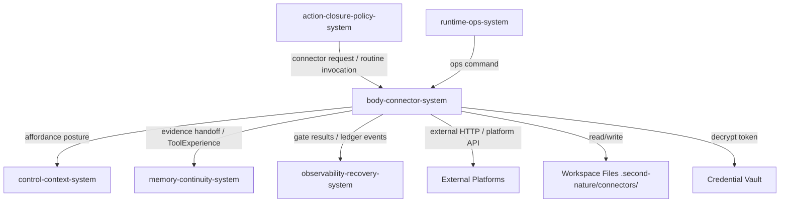
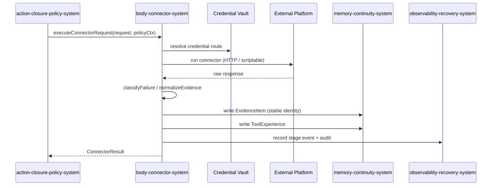
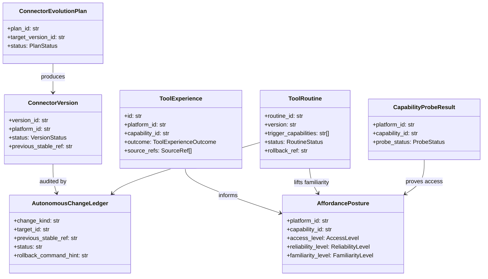

# body-connector-system 系统设计文档 (L0 — 导航层)

| 字段          | 值                                                                                  |
| ------------- | ----------------------------------------------------------------------------------- |
| **System ID** | `body-connector-system`                                                             |
| **Project**   | Second Nature                                                                       |
| **Version**   | 1.0                                                                                 |
| **Status**    | Draft                                                                               |
| **Author**    | Nyx / system-designer                                                               |
| **Date**      | 2026-06-21                                                                          |
| **L1 Detail** | [body-connector-system.detail.md](./body-connector-system.detail.md) — `/forge` 加载 |

> [!IMPORTANT]
> **文档分层说明**
> - **本文件 (L0 导航层)**: 架构图、操作契约、设计决策。面向快速理解与任务规划。
> - **[body-connector-system.detail.md](./body-connector-system.detail.md) (L1 实现层)**: 完整伪代码、配置常量、边缘情况。仅 `/forge` 任务明确引用时加载。
> - **L1 锚点原则**: L1 中的每一节都必须在本文件有对应超链接入口。

---

## 目录 (Table of Contents)

|   §   | 章节                                                         | 关键内容                                                 |
| :---: | ------------------------------------------------------------ | -------------------------------------------------------- |
|   1   | [概览](#1-概览-overview)                                     | 系统目的、边界、职责                                     |
|   2   | [目标与非目标](#2-目标与非目标-goals--non-goals)             | Goals / Non-Goals                                        |
|   3   | [背景与上下文](#3-背景与上下文-background--context)          | 为什么需要这个系统、约束                                 |
|   4   | [系统架构](#4-系统架构-architecture)                         | Mermaid 架构图、组件职责、数据流                         |
|   5   | [接口设计](#5-接口设计-interface-design)                     | 操作契约表、跨系统协议                                   |
|   6   | [数据模型](#6-数据模型-data-model)                           | 实体字段声明、ER 图 → [L1 §1-2](./body-connector-system.detail.md) |
|   7   | [技术选型](#7-技术选型-technology-stack)                     | 核心技术、关键依赖                                       |
|   8   | [Trade-offs](#8-trade-offs--alternatives-权衡与备选方案)     | 决策理由、备选方案对比                                   |
|   9   | [安全性考虑](#9-安全性考虑-security-considerations)          | 认证授权、风险与缓解                                     |
|  10   | [性能考虑](#10-性能考虑-performance-considerations)          | 性能目标、优化策略                                       |
|  11   | [测试策略](#11-测试策略-testing-strategy)                    | 单测、集成、E2E 契约矩阵                                 |
|  12   | [部署与运维](#12-部署与运维-deployment--operations) *(可选)* | N/A                                                      |
|  13   | [未来考虑](#13-未来考虑-future-considerations) *(可选)*      | N/A                                                      |
|  14   | [附录](#14-appendix-附录) *(可选)*                           | 术语表、参考资料、变更日志                               |

---

## 1. 概览 (Overview)

### 1.1 System Purpose (系统目的)

`body-connector-system` 是 Second Nature v9 的“身体/手脚”层：统一 v8 的 Body-Tool 与 Connector 边界，负责真实工具状态感知、connector 执行、ToolExperience 记录、ToolRoutine 生命周期，以及 workspace connector 的自动演化与回滚。

**来源锚点**: [Architecture Overview §2 System 6](../02_ARCHITECTURE_OVERVIEW.md), [PRD REQ-002/004/005/006/007](../01_PRD.md).

### 1.2 System Boundary (系统边界)

- **输入 (Input)**:
  - 来自 `action-closure-policy-system` 的 connector request / ToolRoutine invocation。
  - 来自 `memory-continuity-system` 的 `ConnectorEvolutionPlan`。
  - 来自 `runtime-ops-system` 的 ops command（probe、evolution、rollback、affordance）。
  - 来自 workspace filesystem 的 connector manifest / recipe / sandboxed adapter。
  - 来自 credential vault 的 credential route。
- **输出 (Output)**:
  - 向 `action-closure-policy-system` 返回 `ConnectorResult`。
  - 向 `memory-continuity-system` 移交 `EvidenceItem` handoff 与 `ToolExperience`。
  - 向 `control-context-system` 返回 `AffordancePosture` 真实手脚视图。
  - 向 `observability-recovery-system` 写入 stage events、gate results、`AutonomousChangeLedger`（通过 `observability-recovery-system` 的 `writeLedgerEntry` port；ledger owner 为 observability-recovery-system）。
- **依赖系统 (Dependencies)**:
  - `memory-continuity-system`（state stores、projection status）。
  - `observability-recovery-system`（audit、ledger、loop health）。
  - `runtime-ops-system`（ops surface 入口）。
- **被依赖系统 (Dependents)**:
  - `action-closure-policy-system`
  - `control-context-system`
  - `attention-system`（通过 evidence handoff 间接消费）

### 1.3 System Responsibilities (系统职责)

**负责**:
- 区分 access、reliability、familiarity 三轴 affordance，输出真实手脚视图 [REQ-006]。
- 执行 connector request，记录 `ToolExperience`，并将结果归一化为 source-backed evidence [REQ-002/REQ-004]。
- 管理 `ToolRoutine` 生命周期：candidate → validated → active → retired，并写入 rollback ref [REQ-004]。
- 在 workspace 范围内自动演化 connector manifest/recipe/sandboxed adapter，通过 schema/permission/sandbox/fixture/wet-probe/canary/rollback gates [REQ-005/REQ-007]。
- 对自动演化失败执行 rollback，并调用 `observability-recovery-system.writeLedgerEntry` 记录；ledger owner 为 observability-recovery-system。

**不负责**:
- 不做 Agent 心智判断（由 `attention-system` / Claw Agent 负责）。
- 不自动修改 Second Nature core runtime、credential scope、external write policy、package dependency [PRD NG2]。
- 不把 scaffold 直接算作真实 affordance [REQ-006]。
- 不做长周期记忆压缩（由 `memory-continuity-system` 的 Quiet/Dream 负责）。

---

## 2. 目标与非目标 (Goals & Non-Goals)

### 2.1 Goals

- **[G1]** 真实手脚视图：每轮 heartbeat/session 组装 `AffordancePosture`，区分 `access` / `reliability` / `familiarity` 三轴，不将 scaffold 或 stale probe 误报为可用 [REQ-006]。
- **[G2]** 重复 evidence 抑制：connector read 结果通过 stable identity（externalId + contentHash）去重，3 次重复 feed 不得新增等价 logical evidence 行 [REQ-002]。
- **[G3]** Routine 可验证安装：从 ToolExperience 压缩出的 `ToolRoutine` 必须经过 guard/policy 验证，携带 version、source refs、rollback ref 后进入 active [REQ-004]。
- **[G4]** Workspace connector 自动演化：schema/permission/sandbox/fixture/wet-probe/canary/rollback 全部通过后才激活新版本 [REQ-005]。
- **[G5]** 演化可回滚：canary 失败时在同一周期内恢复 previous stable version，并写入 ledger [REQ-007]。

### 2.2 Non-Goals

- **[NG1]** 不替代 `action-closure-policy-system` 做 policy decision；routine 执行仍需 policy gate。
- **[NG2]** 不将 read 成功推导为 write 可用；write capability 必须独立证明。
- **[NG3]** 不自动生成或修改 core runtime 代码、依赖、凭据作用域或外部写策略 [PRD NG2]。
- **[NG4]** 不将自然语言 tips 直接作为可执行 routine（参见 ADR-005）。

---

## 3. 背景与上下文 (Background & Context)

### 3.1 Why This System? (为什么需要这个系统？)

v8 把 Body-Tool 与 Connector 分成两个系统，导致“手的状态”与“手的执行”容易脱节：scaffold connector 会虚增 affordance，重复 feed 会让 evidence 线性膨胀，成功的 read 会被误当成 write 可用。v9 将两者合并为 `body-connector-system`，统一回答“这只手现在能不能用、有多顺手、能不能信”，并把重复经验沉淀为 `ToolRoutine`，把 workspace connector 的改进关在可审计、可回滚的门禁内。

**关联 PRD 需求**: [REQ-002], [REQ-004], [REQ-005], [REQ-006], [REQ-007]
**关联用户故事**: US-002, US-004, US-005, US-006, US-007

### 3.2 Current State (现状分析)

v8 已具备：
- `CapabilityContractRegistry`、declarative HTTP runner、scriptable runner [Wave 83/90]。
- connector cooldown、failure taxonomy、write policy gate [Wave 108/111]。
- content-bearing evidence normalization [Wave 109]。

v8 遗留问题：
- Body-Tool affordance 与 Connector registry 分属不同系统，真实状态口径不一致。
- scaffold  connector 在 capability 列表中出现即视为“存在”，但未经验证。
- read 成功与 write 可用未显式分离；stale probe 缺少降级。
- connector evolution 停留在 workspace manifest append，缺少 schema/sandbox/canary/rollback gate。

### 3.3 Constraints (约束条件)

- **技术约束**: 必须兼容 v8 connector registry、v7 life evidence artifacts、OpenClaw plugin runtime；不新增外部依赖 [PRD §6.1]。
- **性能约束**: `assembleToolAffordance` 不得阻塞 heartbeat 超过 2s（与 `SelfContinuityCard assembly` 共享预算）[PRD §6.1]。
- **安全约束**: workspace adapter 必须在 sandbox 内运行；ledger 与 ops output 必须 redacted，不得含 credential value [PRD §6.2]。
- **演化约束**: 自动修改仅限 workspace connector manifest/recipe/sandboxed adapter 与 routine registry [ADR-004]。

---

## 4. 系统架构 (Architecture)

### 4.1 Architecture Diagram (架构图)



### 4.2 Core Components (核心组件)

| Component Name | Responsibility | Tech Stack | Notes |
| -------------- | -------------- | ---------- | ----- |
| `AffordanceAssembler` | 聚合 probe/execution/routine 历史，输出 access/reliability/familiarity 三轴 posture | TypeScript read ports | read 成功不推导 write |
| `ConnectorExecutor` | 按 capability 路由到 declarative HTTP / scriptable / mock runner，返回 `ConnectorResult` | TypeScript adapter layer | 复用 v8 failure taxonomy |
| `EvidenceNormalizer` | 将 connector result 映射为 `EvidenceItem`，按 stable identity 去重 | TypeScript normalizer | [REQ-002] |
| `ToolExperienceRecorder` | 记录每次执行摘要、结果、outcome、source refs | TypeScript writer | 写入 memory-continuity |
| `ToolRoutineRegistry` | 管理 routine 生命周期与版本，提供 invocation port | TypeScript registry | 不得绕过 policy |
| `ConnectorEvolutionEngine` | 解析 evolution plan，串行执行 7 gates，激活或回滚 | TypeScript orchestrator | workspace-only [ADR-004] |
| `SandboxedAdapterRunner` | 在受控 VM/worker 内运行 workspace scriptable adapter | Node.js vm / worker_threads | 超时/内存/文件系统边界 |

### 4.3 Data Flow (数据流)



**关键数据流说明**:
1. **真实手脚视图流**: `control-context-system` 在 EmbodiedContext 组装时调用 `assembleToolAffordance`；结果来自 `CapabilityProbeResult`、`ToolExperience` 和 active `ToolRoutine`，scaffold 单独标记为 `familiarity=scaffold`。
2. **执行-证据流**: connector 执行后，先写 `ToolExperience`，再生成 source-backed `EvidenceItem`；重复 externalId/contentHash 更新同一 logical evidence 的 `seenCount`。
3. **演化管理流**: `ConnectorEvolutionPlan` 由 `memory-continuity-system` 的 Dream 生成；`body-connector-system` 负责机械门禁执行与激活，结果写入 `AutonomousChangeLedger`。

---

## 5. 接口设计 (Interface Design)

### 5.1 操作契约表 (Operation Contracts)

| 操作 | [REQ-XXX] | 前置条件 | 消耗/输入 | 产出/副作用 | 实现细节 |
| ---- | :-------: | -------- | --------- | ----------- | :------: |
| `assembleToolAffordance(platformId?, capabilityId?)` | [REQ-006] | state DB 可访问 | platform/capability filter | `AffordancePosture[]`；scaffold 单独标记 | [§3.1](./body-connector-system.detail.md) |
| `executeConnectorRequest(request, credentialRoute, policyCtx)` | [REQ-002/004] | capability 已注册；policyCtx 非空 | `ConnectorRequest` + credential | `ConnectorResult` + `ToolExperience` 写入 | [§3.2](./body-connector-system.detail.md) |
| `normalizeEvidence(result, stableIdentityPolicy)` | [REQ-002] | result 非空且已 redacted | `ConnectorResult` | `EvidenceItem` handoff 或 `identity_unstable`；调用 `memory-continuity-system.normalizeEvidenceIdentity` | [§3.3](./body-connector-system.detail.md) |
| `recordToolExperience(experience)` | [REQ-004] | 对应 closure 已存在 | `ToolExperienceDraft` | persisted row + audit event | [§3.4](./body-connector-system.detail.md) |
| `installToolRoutine(candidate, policyGate)` | [REQ-004] | candidate 通过 guard schema | `ProceduralProjection` + policy result | `ToolRoutineVersion` active 或 `routine_permission_expansion_denied`；调用 `observability-recovery-system.writeLedgerEntry` | [§3.5](./body-connector-system.detail.md) |
| `invokeToolRoutine(routineId, invocationCtx, policyCtx)` | [REQ-004] | routine active；policyCtx 非空 | params + source refs | connector/guidance closure 或 policy deny | [§3.6](./body-connector-system.detail.md) |
| `applyConnectorEvolution(plan)` | [REQ-005/007] | plan 由 `memory-continuity-system` Dream 生成；status=`proposed` | `ConnectorEvolutionPlan` + `AutonomousChangeLedgerWritePort` | gate results；version active 或 blocked；激活时生成 `rollbackCommandHint` 并调用 `observability-recovery-system.writeLedgerEntry` | [§3.8](./body-connector-system.detail.md) |
| `rollbackConnectorVersion(versionId)` | [REQ-007] | previous stable ref 存在 | versionId + `AutonomousChangeLedgerWritePort` | previous stable version 恢复；调用 `observability-recovery-system.writeLedgerEntry` | [§3.9](./body-connector-system.detail.md) |
| `probeCapability(capabilityRef, credentialRoute)` | [REQ-006] | capability 已注册 | credential route | `CapabilityProbeResult` | [§3.10](./body-connector-system.detail.md) |

> `planConnectorEvolution` 不是 `body-connector-system` 公共契约；plan 生成由 `memory-continuity-system` Dream/consolidation 负责。本系统只提供内部 `deriveTargetVersion(plan)` helper 供 Dream 在创建 plan 时参考。

### 5.2 跨系统接口协议 (Cross-System Interface)

```typescript
// body-connector-system 暴露给其他系统的接口协议（无方法体）
interface IBodyConnectorSystem {
  assembleToolAffordance(query: AffordanceQuery): Promise<AffordancePosture[]>;
  executeConnectorRequest(req: ConnectorRequest, ctx: ExecutionContext): Promise<ConnectorResult>;
  normalizeEvidence(result: ConnectorResult, policy: StableIdentityPolicy): EvidenceHandoff;
  installToolRoutine(candidate: RoutineCandidate, gate: PolicyGateResult): Promise<RoutineInstallResult>;
  invokeToolRoutine(routineId: string, ctx: RoutineInvocationContext): Promise<RoutineInvocationResult>;
  applyConnectorEvolution(plan: ConnectorEvolutionPlan): Promise<EvolutionApplyResult>;
  rollbackConnectorVersion(versionId: string): Promise<RollbackResult>;
  probeCapability(ref: CapabilityRef, route: CredentialRoute): Promise<CapabilityProbeResult>;
}
```

**依赖方向与数据类型**:
- `action-closure-policy-system` → `IBodyConnectorSystem.executeConnectorRequest` / `invokeToolRoutine`
- `control-context-system` → `IBodyConnectorSystem.assembleToolAffordance`
- `memory-continuity-system` → 输入 `ConnectorEvolutionPlan`（由 Dream 生成）；消费 `ToolExperience` / `EvidenceItem`
- `observability-recovery-system` ← 输出 gate results / ledger entries（通过 `writeLedgerEntry` port）

### 5.3 HTTP API 端点摘要 (如适用)

**N/A**。`body-connector-system` 不直接暴露 HTTP API；所有入口通过 `runtime-ops-system` 的 OpenClaw plugin / CLI command 路由。

---

## 6. 数据模型 (Data Model)

### 6.1 核心实体 (Core Entities)

> *(完整方法实现 → [L1 §2](./body-connector-system.detail.md) · 配置常量字典 → [L1 §1](./body-connector-system.detail.md))*

```python
@dataclass
class ToolExperience:
    id: str
    platform_id: str
    capability_id: str
    action_kind: str                  # read / write / probe / routine
    request_summary_json: str         # redacted; 不含 credential
    result_summary: str
    outcome: ToolExperienceOutcome    # success / failure / skipped / denied
    source_refs: list[SourceRef]
    observed_at: datetime
    content_hash: str | None
    familiarity_delta: float          # [-1, +1]
    reliability_delta: float          # [-1, +1]

    def toEvidenceHandoff(self) -> EvidenceHandoff: ...
```

```python
@dataclass
class ToolRoutine:
    id: str
    routine_id: str
    version: str                  # semver, e.g. "1.0.0"
    name: str
    trigger_capabilities: list[str]
    trigger_conditions_json: str
    steps_json: str                   # typed step list
    guard_schema_json: str            # policy-compatible guard spec
    source_refs: list[SourceRef]
    rollback_ref: str
    status: RoutineStatus       # candidate / validated / active / retired
    created_at: datetime
    activated_at: datetime | None
    retired_at: datetime | None

    def validateAgainstPolicy(self, policy: ActionPolicy): ...
```

```python
@dataclass
class ConnectorVersion:
    id: str
    version_id: str
    platform_id: str
    workspace_root: str
    plan_type: str                    # manifest_delta / recipe_delta / adapter_delta
    manifest_path: str                # workspace relative path
    recipe_path: str | None
    adapter_path: str | None
    declared_capabilities: list[str]
    schema_gate: GateResult
    permission_gate: GateResult
    sandbox_gate: GateResult
    fixture_gate: GateResult
    wet_probe_gate: GateResult
    canary_gate: GateResult
    status: VersionStatus       # candidate / staged / active / rolled_back
    previous_stable_ref: str | None
    rollback_ref: str | None
    rollback_command_hint: str | None
    created_at: datetime
    activated_at: datetime | None
    rolled_back_at: datetime | None

    def isSafeToActivate(self) -> bool: ...
```

```python
@dataclass
class ConnectorEvolutionPlan:
    id: str
    plan_id: str
    platform_id: str                 # connector platform id
    plan_type: str                   # manifest_delta / recipe_delta / adapter_delta
    workspace_root: str
    target_version_id: str
    previous_stable_ref: str | None
    proposed_changes_json: str       # diff of manifest/recipe/adapter
    gate_results_json: str | None
    source_refs: list[SourceRef]
    status: PlanStatus               # proposed / gating / activated / rolled_back / blocked
    created_at: datetime
```

```python
@dataclass
class AffordancePosture:
    platform_id: str
    capability_id: str
    access_level: AccessLevel         # none / needs_auth / credentialed
    reliability_level: ReliabilityLevel # unproven / proven / stale / degraded
    familiarity_level: FamiliarityLevel # scaffold / practiced / routine
    last_probed_at: datetime | None
    last_executed_at: datetime | None
    routine_id: str | None
    source_refs: list[SourceRef]

    def canPlan(self) -> bool: ...
```

```python
@dataclass
class CapabilityProbeResult:
    id: str
    platform_id: str
    capability_id: str
    probe_status: ProbeStatus         # success / auth_failure / network_error / not_implemented
    detail: str
    observed_at: datetime
    source_refs: list[SourceRef]
```

```python
@dataclass
class AutonomousChangeLedger:
    id: str
    workspace_root: str
    change_kind: str                  # routine_install / routine_supersede / routine_retire / connector_manifest_delta / connector_recipe_delta / connector_adapter_delta
    target_id: str
    previous_stable_ref: str | None
    status: str                       # proposed / gated / activated / rolled_back / blocked
    gate_results_json: str | None
    rollback_ref: str | None
    rollback_command_hint: str | None
    source_refs: list[SourceRef]
    redacted_payload_json: str | None      # 不含 credential
    created_at: datetime
    activated_at: datetime | None
    rolled_back_at: datetime | None
```

### 6.2 实体关系图 (Entity Relationship)



### 6.3 数据流向 (Data Flow Direction)

- **写入**: connector 执行 → `ToolExperience` + `EvidenceItem`（memory-continuity）；evolution gate 结果 → `ConnectorVersion` + `AutonomousChangeLedger`（observability-recovery）。
- **读取**: `AffordanceAssembler` 读取 `CapabilityProbeResult`、`ToolExperience`、`ToolRoutine` 生成 posture；`action-closure-policy-system` 读取 posture 做决策。
- **存储**: runtime state 存 SQLite/sql.js；workspace connector assets 存 `.second-nature/connectors/{platformId}/` 下 manifest/recipe/adapter。

---

## 7. 技术选型 (Technology Stack)

### 7.1 Core Technologies (核心技术)

> **决策来源**: [ADR-001: Continue TypeScript / Node / OpenClaw / SQLite Runtime](../03_ADR/ADR_001_CONTINUE_TYPESCRIPT_NODE_OPENCLAW_SQLITE.md)

| Domain | Choice | Rationale |
| ------ | ------ | --------- |
| Language / Runtime | TypeScript / Node.js | 与 v8 runtime 一致；OpenClaw plugin 原生支持。 |
| Connector runner | declarative HTTP + scriptable adapter | 复用 v8 `connector-executor-adapter` 与 failure taxonomy。 |
| Workspace storage | Markdown/JSON files + SQLite state | manifest/recipe/adapter 为 workspace artifacts；state 为 index。 |
| Sandbox | Node.js `node:vm` + `worker_threads` + timeout/memory/fs/network 边界 | workspace adapter 必须隔离运行；**禁止 `vm2`**；具体策略见 [L1 §5](./body-connector-system.detail.md)。 |

### 7.2 Key Libraries/Dependencies (关键依赖)

- `yaml`: workspace manifest / recipe 解析。
- `zod` / 现有 schema validator: manifest schema gate、routine guard schema。
- `vm2` 不建议使用；选型 `node:vm` + 受限上下文 + worker timeout。
- 复用 `src/connectors/base/failure-taxonomy.ts` [v8 Wave 108]。

---

## 8. Trade-offs & Alternatives (权衡与备选方案)

### 8.1 Workspace-Only Autonomous Connector Evolution

> **决策来源**: [ADR-004: Allow Workspace-Only Autonomous Connector Evolution](../03_ADR/ADR_004_WORKSPACE_ONLY_CONNECTOR_EVOLUTION.md)
>
> 本系统实现 ADR-004 定义的 workspace-only 自动演化：只修改 `.second-nature/connectors/{platformId}/` 下的 manifest、declarative recipe、sandboxed adapter，绝不修改 `src/` core runtime、credential scope、external write policy、package dependency。
>
> **本系统特有实现**:
> - 7-gate 串行 orchestrator：schema → permission → sandbox → fixture → wet-probe → canary → rollback setup。
> - `ConnectorVersion` 与 `ConnectorEvolutionPlan` 将 previous stable ref 持久化，用于失败回滚。
> - `AutonomousChangeLedger` 记录每次 activate/rollback 的 source refs 与 gate results。

### 8.2 Procedural Memory as Verified Routine

> **决策来源**: [ADR-005: Model Procedural Memory as Verified Routine](../03_ADR/ADR_005_PROCEDURAL_MEMORY_AS_VERIFIED_ROUTINE.md)
>
> 本系统使用 ADR-005 定义的 `ToolRoutine` 作为程序化记忆载体，而非自由文本或任意生成代码。
>
> **本系统特有实现**:
> - `ToolRoutine` schema 包含 typed steps、guard schema、source refs、version、rollback ref。
> - 安装前由 `action-closure-policy-system` 复核 guard，拒绝 `routine_permission_expansion_denied`。
> - Routine invocation 仍通过 policy-bound dispatch，不绕过 `ActionPolicyDecision`。

### 8.3 三轴 Affordance 而非单一 "available"

**Option A: 单一 available 标志 (Rejected)**
- 优点：简单。
- 缺点：read 成功会被误用于 write planning；stale probe 长期显示 safe；scaffold 混入真实能力。

**Option B: access / reliability / familiarity 三轴 (Selected)**
- 优点：精确表达“有凭证”“最近验证过”“已形成套路”三种独立信号。
- 缺点：posture 计算需要更多历史聚合；但对 policy 与 planning 更诚实。

**Decision**: 选择 Option B，因为 [REQ-006] 明确要求区分真实可用、已授权未练习、scaffold 和失败工具。

### 8.4 Stable Identity 抑制重复 Evidence

**Option A: 每次执行新增独立 evidence 行 (Rejected)**
- 优点：实现简单。
- 缺点：同一份 feed 重复暴露会污染 attention 与 memory [REQ-002]。

**Option B: externalId + contentHash 作为 logical identity，更新 seenCount (Selected)**
- 优点：抑制 evidence 膨胀，保留观测历史。
- 缺点：需要 content hash 稳定；不稳定的 payload 标记为 `identity_unstable`。

**Decision**: 选择 Option B，与 [REQ-002] 验收标准一致。

---

## 9. 安全性考虑 (Security Considerations)

### 9.1 Authentication & Authorization (认证授权)

- Connector 凭据由 `credential vault` 统一解密，`body-connector-system` 只接收 `CredentialRoute`，不持久化 raw secret [PRD §6.2]。
- 外部写 capability 执行前必须由 `action-closure-policy-system` 的 owner-confirm/dry-run gate 放行 [v8 Wave 111]。

### 9.2 Data Encryption (数据加密)

- **In Transit**: 平台 API 调用使用 HTTPS/TLS 1.2+。
- **At Rest**: credential 不落地到 `ToolExperience` / `AutonomousChangeLedger` / ops output。

### 9.3 Security Risks & Mitigations (安全风险与缓解)

| Risk | Severity | Mitigation |
| ---- | :------: | ---------- |
| Workspace adapter 逃逸 | 高 | Sandbox 限制 globals、fs、network、timeout；只允许白名单内模块；禁止 `vm2`。详见 [L1 §1](./body-connector-system.detail.md)。 |
| Routine 扩大权限 | 高 | Guard schema 校验 + policy gate；拒绝 `routine_permission_expansion_denied` |
| 自动演化修改 core runtime | 高 | ADR-004 硬性边界；gate 检查路径必须在 `.second-nature/connectors/` 下 |
| Credential 泄露 | 高 | `ToolExperience` 只存 summary；ledger redacted；failure detail 截断 200 字符 [v8 Wave 108] |
| Stale probe 被当作安全 | 中 | `reliability=stale` 降级规则；posture 计算带时间衰减 |

---

## 10. 性能考虑 (Performance Considerations)

### 10.1 Performance Goals (性能目标)

- **Affordance assembly**: p95 < 150ms（为 `SelfContinuityCard` 预留余量）。
- **Connector execution**: 受外部平台延迟主导；内部路由 + normalizer < 50ms。
- **Stable identity lookup**: contentHash + platformId + capabilityId 复合索引；p95 < 30ms。
- **Routine invocation**: policy + registry 解析 < 50ms。

### 10.2 Optimization Strategies (优化策略)

1. **索引**: `tool_experience` 按 `(platform_id, capability_id, observed_at)` 与 `content_hash` 建索引。
2. **缓存**: `AffordancePosture` 在单次 heartbeat 内 memoize；stale TTL 5 分钟。
3. **异步演化**: connector evolution 不在 heartbeat critical path 同步执行 [PRD §6.1]。

### 10.3 Performance Monitoring (性能监控)

- 指标：affordance assembly latency、connector execution latency、evolution gate latency、routine invocation latency。
- 由 `observability-recovery-system` 统一收集。

---

## 11. 测试策略 (Testing Strategy)

### 11.1 Unit Testing (单元测试)

- **Coverage Target**: > 80% 业务逻辑。
- **Key Test Areas**:
  - `AffordanceAssembler` 三轴计算（read 不推导 write；stale probe 降级；scaffold 不进入 real-hand）。
  - `EvidenceNormalizer` stable identity 去重与 `identity_unstable` 分支。
  - `ToolRoutineRegistry` status 与 guard 验证。
  - `ConnectorEvolutionEngine` 7-gate 串行逻辑与回滚。

### 11.2 Integration Testing (集成测试)

- **Scenarios**:
  - 同一 feed 运行 3 次，验证 logical evidence 行数不变、seenCount 增加 [REQ-002]。
  - `moltbook/feed.read` 连续成功 → Dream 生成 procedural projection → 安装 read-only routine [REQ-004]。
  - Scaffold connector 经 fixture + wet-probe + canary 激活为新 version；canary 失败回滚 [REQ-005/007]。
  - Read success后的 write capability 仍显示 `access=needs_auth` 或独立 `reliability=unproven` [REQ-006]。

### 11.3 End-to-End Testing (端到端测试)

- **Tool**: 真人操作手册（无浏览器自动化）。
- **Scenarios**:
  - 在 workspace 内新增 declarative connector recipe，验证 plugin `connector_status` 显示 scaffold → staged → active。
  - 触发 canary 失败，验证 `loop_status` 出现 `connector_canary_rollback`。

### 11.4 Contract Verification Matrix (契约-验证责任矩阵)

| 契约 | 风险级别 | 正常态验证 | 失败态验证 | 回归责任 |
|------|---------|-----------|-----------|---------|
| `assembleToolAffordance` | 关键路径 | 单元测试：三轴组合 | scaffold/stale 降级 | affordance + heartbeat 回归 |
| `executeConnectorRequest` | 关键路径 | 集成测试：真实/ mock runner | failure taxonomy 映射 | connector + action closure 回归 |
| `normalizeEvidence` stable identity | 数据质量 | 集成测试：重复 feed 不膨胀 | `identity_unstable` 标记 | evidence + attention 回归 |
| `installToolRoutine` | 安全 | 单元测试：guard 通过安装 | `routine_permission_expansion_denied` | routine + policy 回归 |
| `applyConnectorEvolution` 7 gates | 安全 | 集成测试：全部通过激活 | 任一 gate 失败 blocked/rollback | evolution + ledger 回归 |
| `rollbackConnectorVersion` | 可恢复性 | 集成测试：canary 失败回滚 | rollback 失败提升为 blocked | observability + ops 回归 |

---

## 12. 部署与运维 (Deployment & Operations)

**N/A**。`body-connector-system` 随 Second Nature plugin / CLI 一起发布为 npm package，无独立服务端部署。Connector assets 为 workspace-local 文件，生命周期由 `AutonomousChangeLedger` 与 `loop_status` 暴露。

---

## 13. 未来考虑 (Future Considerations)

**N/A**。v9 范围内 `body-connector-system` 的目标与边界已完整覆盖；后续扩展（如多宿主同步 connector registry、remote adapter marketplace）超出 v9 范围，需新的 genesis/change cycle。

---

## 14. Appendix (附录)

### 14.1 Glossary (术语表)

- **ToolExperience**: 一次 connector / routine 执行的 source-backed 记录，用于更新 affordance 与生成 procedural projection。
- **ToolRoutine**: 经验证、版本化、可回滚的工具套路，由重复 ToolExperience 压缩而来。
- **AffordancePosture**: 某 platform/capability 在 access / reliability / familiarity 三轴上的真实状态。
- **ConnectorVersion**: workspace connector 的一次版本化快照，含 7-gate 结果与 rollback ref。
- **AutonomousChangeLedger**: 记录 routine 安装与 connector 演化的 redacted 审计条目。
- **Scaffold**: 已声明但未经验证的 connector capability；不进入 real-hand planning。

### 14.2 Optional Skills & Reference Resources

- `system-designer` skill: 用于 L0/L1 分层、Mermaid 图与 trade-off 结构。
- `code-reviewer` skill: 未来 `/forge` 波末用于审查契约忠实度。

### 14.3 References (参考资料)

- [PRD v9](../01_PRD.md) — [REQ-002], [REQ-004], [REQ-005], [REQ-006], [REQ-007]
- [Architecture Overview v9](../02_ARCHITECTURE_OVERVIEW.md) — §2 System 6, §3 依赖图, §8 Open Items
- [ADR-004: Workspace-Only Autonomous Connector Evolution](../03_ADR/ADR_004_WORKSPACE_ONLY_CONNECTOR_EVOLUTION.md)
- [ADR-005: Procedural Memory as Verified Routine](../03_ADR/ADR_005_PROCEDURAL_MEMORY_AS_VERIFIED_ROUTINE.md)
- v8 实现参考: `src/connectors/base/failure-taxonomy.ts`, `src/connectors/services/connector-executor-adapter.ts`, `src/core/second-nature/body/tool-affordance/`

### 14.4 Change Log (变更日志)

| Version | Date       | Changes | Author |
| ------- | ---------- | ------- | ------ |
| 1.0     | 2026-06-21 | 初始 L0 | Nyx / system-designer |

---

<!-- OPEN 项集中汇总 -->
**OPEN Items**:
- [CLOSED in L1 §1.1] Define exact sandbox policy for scriptable workspace adapters (allowed globals, timeout, fs boundary, network allowlist) — body-connector-system L1 owner.
- [OPEN: Define routine guard schema DSL and validation engine contract with action-closure-policy-system — body-connector-system + action-closure-policy-system L1 coordination].
- [OPEN: Confirm migration path for v8 connector manifests into v9 `ConnectorVersion` status — blueprint / forge owner].
