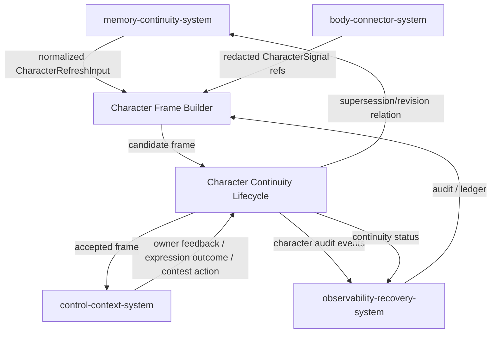
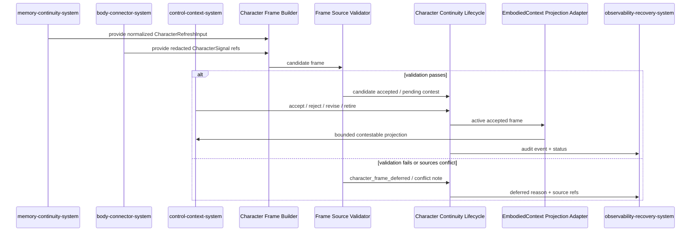
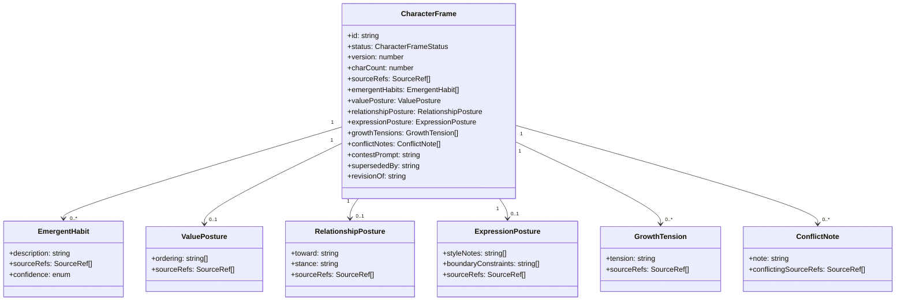

# character-continuity-system 系统设计文档 (L0 — 导航层)

| 字段          | 值                                                                    |
| ------------- | --------------------------------------------------------------------- |
| **System ID** | `character-continuity-system`                                         |
| **Project**   | Second Nature v9                                                      |
| **Version**   | 1.0                                                                   |
| **Status**    | Draft                                                                 |
| **Author**    | Nyx / OpenCode                                                        |
| **Date**      | 2026-06-21                                                            |
| **L1 Detail** | [character-continuity-system.detail.md](./character-continuity-system.detail.md) — 已创建 |

> [!IMPORTANT]
> **文档分层说明**
> - **本文件 (L0 导航层)**: 架构图、操作契约、设计决策。面向快速理解与任务规划。禁止放配置字典、算法伪代码和方法体。
> - **[character-continuity-system.detail.md](./character-continuity-system.detail.md) (L1 实现层)**: 完整配置常量、数据结构、核心算法、决策树、边缘情况与契约矩阵。仅 `/forge` 任务明确引用时加载。

---

## 目录 (Table of Contents)

|   §   | 章节                                                         | 关键内容                                                 |
| :---: | ------------------------------------------------------------ | -------------------------------------------------------- |
|   1   | [概览](#1-概览-overview)                                     | 系统目的、边界、职责                                     |
|   2   | [目标与非目标](#2-目标与非目标-goals--non-goals)             | Goals / Non-Goals                                        |
|   3   | [背景与上下文](#3-背景与上下文-background--context)          | 为什么需要这个系统、约束                                 |
|   4   | [系统架构](#4-系统架构-architecture)                         | Mermaid 架构图、组件职责、数据流                         |
|   5   | [接口设计](#5-接口设计-interface-design)                     | 操作契约表、跨系统协议                                   |
|   6   | [数据模型](#6-数据模型-data-model)                           | `CharacterFrame` schema 字段声明                         |
|   7   | [技术选型](#7-技术选型-technology-stack)                     | 核心技术、关键依赖                                       |
|   8   | [Trade-offs](#8-trade-offs--alternatives-权衡与备选方案)     | 决策理由、备选方案对比                                   |
|   9   | [安全性考虑](#9-安全性考虑-security-considerations)          | 风险与缓解                                               |
|  10   | [性能考虑](#10-性能考虑-performance-considerations)          | 性能目标、优化策略                                       |
|  11   | [测试策略](#11-测试策略-testing-strategy)                    | 单测、集成、契约验证矩阵                                 |
|  12   | [部署与运维](#12-部署与运维-deployment--operations) *(可选)* | N/A + 理由                                               |
|  13   | [未来考虑](#13-未来考虑-future-considerations) *(可选)*      | N/A + 理由                                               |
|  14   | [附录](#14-appendix-附录) *(可选)*                           | 术语表、参考资料、变更日志                               |

---

## 1. 概览 (Overview)

### 1.1 System Purpose (系统目的)

`character-continuity-system` 负责把 Agent 在 Second Nature 身体层中的真实经历——source-backed tool experience、external stimulus、feedback、action closure、Dream projection 和 expression outcome——压缩成一张**可反驳、可改写、可超替**的短投影 `CharacterFrame`。它让 Claw Agent 在上下文清空后仍能继承涌现习惯、价值姿态、关系姿态、表达姿态和成长张力，但**不替代 Agent 判断、不声称真实情绪、不输出人格分数或硬控制规则**。

### 1.2 System Boundary (系统边界)

- **输入 (Input)**:
  - 来自 `memory-continuity-system` 的 `ActionClosureRecord`、`ToolExperience`、`MemoryProjection`、`ProceduralProjection`、`DreamConsolidationRun` 输出。
  - 来自 `body-connector-system` 的 connector result/evidence、stable identity、tool routine execution trace。
  - 来自 `control-context-system` 的 owner feedback、expression outcome、Agent contest/re-authoring action。
  - 来自 `observability-recovery-system` 的 redacted audit 与 autonomous change ledger。
  - 所有上游信号必须先归一化为 `shared-v9-contracts.md §5.4` 的 `CharacterRefreshInput` / `CharacterSignal`，禁止 raw private content、raw prompt 或 credential value 直接进入本系统。

- **输出 (Output)**:
  - `CharacterFrame`（candidate / accepted / rejected / retired / superseded）。
  - `CharacterFramePointer` 与 `EmbodiedContextCharacterProjection`（bounded ≤900 chars，contestable）。
  - `character_frame_deferred` 或 conflict note（来源不足/冲突时）。
  - 给 `control-context-system` 的 EmbodiedContext 独立投影（bounded pointer + contest prompt + ≤900 字符 projection）。
  - 给 `observability-recovery-system` 的 continuity status 与 audit events。

- **依赖系统 (Dependencies)**:
  - `memory-continuity-system`: 读取 closure、experience、projection、feedback。
  - `control-context-system`: 接收 contest/re-authoring 反馈，输出投影。
  - `observability-recovery-system`: 写入 audit 与 health signals。

- **被依赖系统 (Dependents)**:
  - `control-context-system`: 将 `CharacterFrame` 作为独立投影注入 EmbodiedContext。
  - `observability-recovery-system`: 聚合 character continuity health。

### 1.3 System Responsibilities (系统职责)

**负责**:
- 从 source-backed 经历中提取并维护 `CharacterFrame` 的五个核心剖面：emergent habits、value posture、relationship posture、expression posture、growth tensions。
- 为每个 `CharacterFrame` 附加 source refs、contest prompt 和 supersession/revision relation。
- 处理 Agent/系统的 contest/re-authoring 动作：accept / reject / revise / retire / supersede。
- 在来源不足或冲突时显式降级为 `character_frame_deferred` 或 conflict note。
- 将 `CharacterFrame` 序列化为 bounded、redacted、标注为 contestable projection 的 EmbodiedContext 输入。
- 维护 Agent-boundary guardrail：所有 frame/pointer/projection 文案必须明确是 source-backed observation 或 contestable self-description，不得成为 hard-control prompt。

**不负责**:
- 不生成人格分数表、情绪断言或预配置人格属性（由设计约束排除）。
- 不替代 Agent reasoning 或强制决策（由 `attention-system` / `action-closure-policy-system` 负责）。
- 不直接执行 connector/routine（由 `body-connector-system` / `action-closure-policy-system` 负责）。
- 不持久化原始 private content、credential 或 raw prompt（由 `memory-continuity-system` 的 redaction gate 负责）。

---

## 2. 目标与非目标 (Goals & Non-Goals)

### 2.1 Goals

- **[G1]** 每次 `CharacterFrame` 刷新都必须有 source-backed 输入，并能在 EmbodiedContext 中表达为 contestable projection（来源：[REQ-008], [ADR-006]）。
- **[G2]** `CharacterFrame` 默认正文不超过 900 UTF-8 chars，且必须可被 Agent contest（accept/reject/revise/retire）或被系统 supersede（来源：[REQ-008], [ADR-006]）。
- **[G3]** 来源不足或冲突时，输出 `character_frame_deferred` 或 conflict note，禁止生成空泛人格宣言（来源：[REQ-008]）。
- **[G4]** `SelfContinuityCard` 仅保留 `CharacterFrame` 的短指针/摘要，不重复完整人格文本（来源：[ADR-006]）。

### 2.2 Non-Goals

- **[NG1]** 不维护人格分数、情绪量表或 deterministic persona controller（来源：[NG1], [ADR-006]）。
- **[NG2]** 不在提示词或上下文中把 `CharacterFrame` 写成权威情绪状态或永久身份事实（来源：[NG6], [ADR-002], [ADR-006]）。
- **[NG3]** 不直接修改 `src/` core runtime、credential scope、external write policy 或 package dependency（来源：[NG2]）。
- **[NG4]** 不把 `CharacterFrame` 当作绕过 `ActionPolicyDecision` 的决策规则来源（来源：[NG3]）。
- **[NG5]** 不输出“你就是这样的人”“你必须保持这种风格”“你的真实情绪是……”一类 Agent identity lock 或 emotion oracle 文案。

---

## 3. 背景与上下文 (Background & Context)

### 3.1 Why This System? (为什么需要这个系统？)

v8 实现了 living loop，但 Agent 上下文清空后仍需要静态 prompt 来“扮演”风格、关系和价值取舍。v9 要求这些连续性从真实身体交互中涌现，而不是预先配置。[REQ-008] 明确要求 `CharacterFrame` 作为 source-backed、bounded、contestable 的涌现人格/习惯投影，滋养 Agent 而不控制 Agent。

**关联 PRD 需求**: [REQ-008], [REQ-001]（SelfContinuityCard 引用）, [REQ-003]（注意力边界间接影响表达姿态）.

### 3.2 Current State (现状分析)

- v8 没有独立的 character 系统；风格/关系/价值假设散落在 guidance template、goal 与 narrative state 中，边界模糊。
- v8 `JudgmentVerdict` 可能让身体替 Agent 做判断；v9 用 `AttentionSignal` 替代后，更需要一个显式、可反驳的自我投影层来承接长期表达与关系连续性。

### 3.3 Constraints (约束条件)

- **技术约束**: 必须兼容 v8 state stores、OpenClaw plugin、TypeScript / Node.js / SQLite 栈（来源：[ADR-001]）。
- **安全约束**: `CharacterFrame` 与提示词不得包含 raw credential、raw private message 或 raw prompt（来源：[REQ-008], [NG4]）。
- **提示词约束**: Agent-facing text 必须标注为 contestable projection（来源：[ADR-002], [ADR-006]）。
- **来源约束**: 所有 posture/habit/tension 必须携带 source refs；无来源则降级（来源：[REQ-008]）。
- **反程序化约束**: Agent-facing text 必须提供 accept/reject/revise/retire affordance；禁止将 projection 写成永久身份、真实情绪、固定人设或必须遵守的策略。

---

## 4. 系统架构 (Architecture)

### 4.1 Architecture Diagram (架构图)



### 4.2 Core Components (核心组件)

| Component Name | Responsibility | Tech Stack | Notes |
| -------------- | -------------- | ---------- | ----- |
| `Character Frame Builder` | 从 source-backed 输入生成 candidate `CharacterFrame`，按五剖面组织并执行 redaction/边界检查。 | TypeScript projection service | 不调用 LLM 做人格推断；仅做规则聚合与可选摘要。 |
| `Posture Extractor` | 分别提取 emergent habits、value posture、relationship posture、expression posture、growth tensions。 | TypeScript rules-first extractor | 每个 posture 输出必须携带 source refs。 |
| `Character Continuity Lifecycle` | 管理 candidate → accepted → retired/superseded 生命周期；处理 contest/re-authoring。 | TypeScript lifecycle service | 接受 Agent/系统动作，写入 supersession relation。 |
| `Frame Source Validator` | 检查 source-free persona text、人格分数、情绪断言、硬控制规则。 | TypeScript validation gate | 失败时输出 `character_frame_deferred` 与具体 violations。 |
| `EmbodiedContext Projection Adapter` | 将 active `CharacterFrame` 序列化为 bounded、contestable、独立投影。 | TypeScript serializer | 输出 ≤900 UTF-8 chars，含 contest prompt。 |

### 4.3 Data Flow (数据流)



**关键数据流说明**:
1. `CharacterFrame` 只在 Dream/quiet-backed consolidation 或显式 contest 触发时刷新，不在每轮 heartbeat 同步生成。
2. 每个 posture 输出附带 source refs；冲突来源生成 `conflictNotes` 而不是强行合并。
3. 进入 EmbodiedContext 的投影是独立片段，与 `SelfContinuityCard` 中的短指针分离。

---

## 5. 接口设计 (Interface Design)

### 5.1 操作契约表 (Operation Contracts)

| 操作 | [REQ-XXX] | 前置条件 | 消耗/输入 | 产出/副作用 | 实现细节 |
| ---- | :-------: | -------- | --------- | ------------ | :------: |
| `refreshCharacterFrame(input: CharacterRefreshInput)` | [REQ-008] | 至少一项 source-backed 输入存在；`memory-continuity-system` 读端口可用 | closure/experience/projection/feedback refs | candidate `CharacterFrame` 或 `character_frame_deferred`；写入 projection store；emit audit | L1 触发时入 `.detail.md` §3 |
| `normalizeCharacterRefreshInput(rawSignals)` | [REQ-008] | 上游只提供 redacted summary 与 source refs；raw payload 不可用 | tool/closure/feedback/expression/contest signals | canonical `CharacterRefreshInput` 或 `character_refresh_input_*` deferred reason | L1 §2.5 / §3.0 |
| `applyCharacterContest(frameId, action, reason?)` | [REQ-008] | frame 存在且状态允许该 action；action ∈ {accept, reject, revise, retire} | contest action + optional reason | 更新 lifecycle status；若 retire 则建立 supersession relation；emit audit | L1 触发时入 `.detail.md` §3 |
| `supersedeFrame(previousId, newFrameId, reason)` | [REQ-008] | previous frame accepted 或 candidate；new frame 已通过 source validation | supersession reason | previous 标记为 superseded；建立 `supersededBy` relation；emit audit | L1 触发时入 `.detail.md` §3 |
| `buildEmbodiedContextProjection(frameId)` | [REQ-008], [REQ-001] | frame 状态为 accepted；projection adapter 可用 | active frame | bounded `EmbodiedContextCharacterProjection` (≤900 chars)；含 contest prompt | L1 触发时入 `.detail.md` §3 |
| `validateFrameSources(candidate)` | [REQ-008], [ADR-006] | candidate 已生成 | candidate frame | `FrameValidationResult`：通过或 violations 列表 | L1 触发时入 `.detail.md` §3 |

### 5.2 跨系统接口协议 (Cross-System Interface)

```typescript
// CharacterContinuityPort: 本系统对外暴露的核心端口
interface CharacterContinuityPort {
  refreshCharacterFrame(input: CharacterRefreshInput): Promise<CharacterFrameResult>;
  applyCharacterContest(frameId: string, action: CharacterContestAction, reason?: string): Promise<CharacterContestResult>;
  buildEmbodiedContextProjection(frameId: string): Promise<EmbodiedContextCharacterProjection>;
}

// CharacterFrameStorePort: 由 memory-continuity-system 实现，本系统消费
interface CharacterFrameStorePort {
  readLatestAcceptedFrame(): Promise<CharacterFrame | null>;
  readFrameById(id: string): Promise<CharacterFrame | null>;
  writeCandidateFrame(frame: CharacterFrame): Promise<void>;
  updateFrameLifecycle(frameId: string, status: CharacterFrameStatus, opts?: { supersededBy?: string; successorFrameId?: string }): Promise<void>;
}

// CharacterAuditPort: 由 observability-recovery-system 实现，本系统消费
interface CharacterAuditPort {
  recordCharacterFrameEvent(event: CharacterFrameAuditEvent): Promise<void>;
}

// CharacterFrameStatus（本系统拥有的生命周期状态）
type CharacterFrameStatus = "candidate" | "accepted" | "rejected" | "retired" | "superseded";

// CharacterFramePointerStatus（control-context-system 运行时注入姿态）
type CharacterFramePointerStatus = "active" | "deferred" | "contested" | "superseded";
```

### 5.3 HTTP API 端点摘要 (如适用)

N/A。`character-continuity-system` 不直接暴露 HTTP/CLI endpoint；其能力通过 `runtime-ops-system` 与 `control-context-system` 间接暴露。

---

## 6. 数据模型 (Data Model)

### 6.1 核心实体 (Core Entities)

#### `CharacterFrame`

| 字段 | 类型 | 必填 | 说明 | 来源锚点 |
| ---- | ---- | :--: | ---- | -------- |
| `id` | `string` (UUID) | 是 | 唯一标识 | 系统生成 |
| `projectionKind` | `"character_frame"` | 是 | 投影类型常量 | [ADR-003] |
| `version` | `number` | 是 | 单调递增版本 | [REQ-008] |
| `status` | `CharacterFrameStatus` | 是 | `candidate` / `accepted` / `rejected` / `retired` / `superseded` | [REQ-008], [ADR-006] |
| `validFrom` | `ISO timestamp` | 是 | 生效时间 | [REQ-008] |
| `validUntil` | `ISO timestamp \| null` | 是 | 失效时间；superseded/retired 时设置 | [REQ-008] |
| `charCount` | `number` | 是 | 投影正文 UTF-8 字符数；默认 ≤900 | [REQ-008] |
| `sourceRefs` | `SourceRef[]` | 是 | 支撑整张 frame 的顶层来源 | [REQ-008] |
| `emergentHabits` | `EmergentHabit[]` | 否 | 涌现习惯列表；每项带来源 | [REQ-008] |
| `valuePosture` | `ValuePosture \| null` | 否 | 价值顺序/取舍姿态 | [REQ-008] |
| `relationshipPosture` | `RelationshipPosture \| null` | 否 | 与 Haa/owner 的关系姿态 | [REQ-008] |
| `expressionPosture` | `ExpressionPosture \| null` | 否 | 表达风格与边界约束 | [REQ-008] |
| `growthTensions` | `GrowthTension[]` | 否 | 成长张力/未决矛盾 | [REQ-008] |
| `conflictNotes` | `ConflictNote[]` | 否 | 来源冲突时的显式说明 | [REQ-008] |
| `contestPrompt` | `string` | 是 | 提示 Agent 可 accept/reject/revise/retire 的文本 | [ADR-006] |
| `supersededBy` | `string \| null` | 是 | 指向更新 frame 的 id | [REQ-008] |
| `revisionOf` | `string \| null` | 是 | 指向被 revise 的父 frame id | [REQ-008] |

#### `EmergentHabit`

| 字段 | 类型 | 必填 | 说明 |
| ---- | ---- | :--: | ---- |
| `description` | `string` | 是 | 习惯描述；不空泛 |
| `sourceRefs` | `SourceRef[]` | 是 | 来源证据/closure/routine refs |
| `confidence` | `"low" \| "medium" \| "high"` | 是 | 定性置信度；非数值分数 |

#### `ValuePosture`

| 字段 | 类型 | 必填 | 说明 |
| ---- | ---- | :--: | ---- |
| `ordering` | `string[]` | 是 | 当前阶段价值排序；每项为短标签 |
| `note` | `string` | 否 | 情境化说明 |
| `sourceRefs` | `SourceRef[]` | 是 | 来源 |

#### `RelationshipPosture`

| 字段 | 类型 | 必填 | 说明 |
| ---- | ---- | :--: | ---- |
| `toward` | `string` | 是 | 关系对象，如 `owner:haa` |
| `stance` | `string` | 是 | 姿态摘要；例如 "responsive but needs explicit consent for external write" |
| `sourceRefs` | `SourceRef[]` | 是 | 来源 |

#### `ExpressionPosture`

| 字段 | 类型 | 必填 | 说明 |
| ---- | ---- | :--: | ---- |
| `styleNotes` | `string[]` | 是 | 表达风格观察 |
| `boundaryConstraints` | `string[]` | 否 | 表达边界约束，如避免权威情绪断言 |
| `sourceRefs` | `SourceRef[]` | 是 | 来源 |

#### `GrowthTension`

| 字段 | 类型 | 必填 | 说明 |
| ---- | ---- | :--: | ---- |
| `tension` | `string` | 是 | 张力描述 |
| `sourceRefs` | `SourceRef[]` | 是 | 来源 |

#### `ConflictNote`

| 字段 | 类型 | 必填 | 说明 |
| ---- | ---- | :--: | ---- |
| `note` | `string` | 是 | 冲突说明 |
| `conflictingSourceRefs` | `SourceRef[]` | 是 | 冲突来源 |

### 6.2 实体关系图 (Entity Relationship)



### 6.3 数据流向 (Data Flow Direction)

- 写方向：本系统读取 `memory-continuity-system` / `body-connector-system` / `control-context-system` 的只读/append-only 数据，经 `Frame Source Validator` 后写入 `memory-continuity-system` 的 projection store。
- 读方向：`control-context-system` 通过 `CharacterContinuityPort` 读取最新 accepted frame，生成独立 EmbodiedContext 投影。
- 审计方向：所有 lifecycle 变更写入 `observability-recovery-system` 的 append-only audit。

---

## 7. 技术选型 (Technology Stack)

### 7.1 Core Technologies (核心技术)

| Domain    | Choice                              | Rationale                               |
| --------- | ----------------------------------- | --------------------------------------- |
| Language  | TypeScript                          | 与 v8/v9 栈一致（来源：[ADR-001]）       |
| Runtime   | Node.js + OpenClaw native plugin    | 与 runtime-ops-system 一致              |
| Storage   | SQLite/sql.js + workspace artifacts | 与 memory-continuity-system 一致        |
| Validation| Rules-first validator               | 避免 LLM 生成空泛人格或情绪断言          |

### 7.2 Key Libraries/Dependencies (关键依赖)

- 复用 `src/shared/types/v8-contracts.ts` 中定义的 `SourceRef` 与退化结果类型。
- 复用 `src/storage/v8-state-stores.ts` 的 projection write/read port 模式。
- 复用 `src/observability/` 的 append-only audit store。

---

## 8. Trade-offs & Alternatives (权衡与备选方案)

### 8.1 跨系统决策 —— 引用 ADR

> **决策来源**: [ADR-006: Model Character Continuity as Emergent Projection](../03_ADR/ADR_006_CHARACTER_CONTINUITY_AS_EMERGENT_PROJECTION.md)
>
> 本系统实现 ADR-006 定义的 emergent projection：人格/习惯从 source-backed 身体交互中涌现，`CharacterFrame` 可反驳、可改写，不控制 Agent，不声称真实情绪。
>
> **本系统特有实现**:
> - 用五剖面（emergent habits / value / relationship / expression / growth tensions）组织 projection。
> - 每个剖面强制携带 source refs；无来源则降级。
> - 通过 `Frame Source Validator` 拦截人格分数、情绪断言、硬控制规则与空泛人格宣言。

> **决策来源**: [ADR-003: Add Continuity Projection After Quiet/Dream](../03_ADR/ADR_003_CONTINUITY_PROJECTION_AFTER_DREAM.md)
>
> `CharacterFrame` 作为 `Continuity Projection` 输出族的一员，由 Dream/Quiet consolidation 生成或刷新，而不是在实时 heartbeat 中同步计算。
>
> **本系统特有实现**:
> - `refreshCharacterFrame` 由 `memory-continuity-system` 的 Dream runner 调用，不在 heartbeat critical path。
> - 输出与 `SelfContinuityCard`、`MemoryProjection`、`ProceduralProjection`、`ConnectorEvolutionPlan` 共享 projection lifecycle 与 supersession 规则。

> **决策来源**: [ADR-002: Narrow Real-Time Semantics to Attention, Not Agent Mind](../03_ADR/ADR_002_ATTENTION_NOT_AGENT_MIND.md)
>
> `CharacterFrame` 是 contestable body projection，不是 Agent 心智或情绪的权威断言。
>
> **本系统特有实现**:
> - `contestPrompt` 必须显式说明 Agent 可接受、拒绝、改写或退役该投影。
> - `expressionPosture.boundaryConstraints` 中默认包含 "不得把程序化约束写成真实情绪" 的提示。

### 8.2 本系统特有决策

**五剖面结构 vs 自由文本段落**

- **Option A: 自由文本段落** —— 生成一段类似 "I am a careful agent..." 的连续文本。
  - 优点：读起来自然。
  - 缺点：难以验证来源、容易混入空泛人格宣言和情绪断言。
- **Option B: 结构化五剖面 +  bounded 序列化**（Selected）
  - 优点：每个剖面可独立验证 source refs；易于 contest/re-authoring；序列化时可控长度。
  - 缺点：需要额外的序列化/渲染层。

**Decision**: 选择 Option B，因为 source-backed validation 与 contestability 是 [REQ-008] 的硬约束，自然语言自由文本难以满足。

---

## 9. 安全性考虑 (Security Considerations)

### 9.1 Authentication & Authorization (认证授权)

- 本系统不直接处理认证；所有写入通过 `memory-continuity-system` / `observability-recovery-system` 的已有权限边界进行。
- Contest/re-authoring 动作默认只对 Agent/owner 开放；系统 supersede 由 lifecycle policy 触发。

### 9.2 Data Redaction (数据脱敏)

- `CharacterFrame` 不得包含 raw credential value、raw private message content、raw prompt text。
- 所有 source refs 使用 redacted `SourceRef`（platform / capability / external id / closure id），不暴露正文。

### 9.3 Security Risks & Mitigations (安全风险与缓解)

| Risk | Severity | Mitigation |
| ---- | :------: | ---------- |
| 通过 CharacterFrame 注入人格控制或情绪断言 | 高 | `Frame Source Validator` 拦截；`contestPrompt` 显式 contestable；禁止人格分数/硬控制规则。 |
| 来源不足却生成空泛人格宣言 | 高 | 输出 `character_frame_deferred` 或 conflict note；单元测试覆盖空输入与低证据路径。 |
| 泄露 raw private content / credential | 高 | source refs 仅引用 id；正文从 redacted summary 生成；audit 同样 redacted。 |
| Agent contest 被系统忽略或覆盖 | 中 | lifecycle 状态机明确区分 accept/reject/retire；retire 后不得重新启用，只能 revise/supersede。 |
| 新 frame 自动 accepted 后被误当作永久姿态 | 中 | 首次注入标注 newly proposed / contestable；Agent reject/retire 后必须降级或等待 revision。 |
| 投影过大导致上下文膨胀 | 中 | 默认 ≤900 UTF-8 chars；`charCount` 显式计算并校验。 |
| rejected/retired/superseded frame 被注入为 active | 中 | `CharacterPointerLoader` 只加载 `accepted + active` frame；`contested` 映射为 `character_frame_contested` degraded slice。 |
| observability `character_frame_event` kind 情绪化 | 低 | 仅使用事件/动作命名：`refresh`, `accepted`, `rejected`, `revised`, `retired`, `superseded`, `deferred`, `conflict`；禁止人格/情绪标签。 |

---

## 10. 性能考虑 (Performance Considerations)

### 10.1 Performance Goals (性能目标)

- `CharacterFrame` 生成/刷新不在 heartbeat critical path，但 Dream consolidation 批量运行时应能在 5s 内完成单帧构建（来源：[REQ-008], [NG1]）。
- `buildEmbodiedContextProjection` 调用应 <50ms（纯读取 + 序列化）。
- 存储增长：每个 Dream 周期最多生成一个 candidate frame；superseded frame 保留历史但只读。

### 10.2 Optimization Strategies (优化策略)

1. **缓存最新 accepted frame**: `control-context-system` 可缓存最新 accepted `CharacterFrame` id，避免每次 context assembly 重复查询。
2. **惰性刷新**: `refreshCharacterFrame` 仅在 Dream/quiet-backed consolidation 触发，不在每轮 heartbeat 执行。
3. **Bounded 序列化**: 序列化时按剖面优先级截断，确保 `charCount ≤ 900`。

### 10.3 Performance Monitoring (性能监控)

- `observability-recovery-system` 记录 `character_frame_build_duration_ms` 与 `character_frame_build_deferred_count`。
- `loop_status` 暴露 `character_continuity_degraded` 当刷新延迟或来源不足时。

---

## 11. 测试策略 (Testing Strategy)

### 11.1 Unit Testing (单元测试)

- **覆盖目标**: 每个 posture extractor、lifecycle 状态机、`Frame Source Validator`、bounded serializer。
- **关键用例**:
  - `normalizeCharacterRefreshInput` 拒绝 raw private、raw prompt、credential-shaped payload 与 source-free signal。
  - 正常五剖面生成与 source refs 携带。
  - 来源不足时返回 `character_frame_deferred`。
  - 来源冲突时生成 `conflictNotes`。
  - 人格分数/情绪断言/硬控制规则被拦截。
  - accept/reject/revise/retire/supersede 状态转换。
  - 序列化后 `charCount ≤ 900`。

### 11.2 Integration Testing (集成测试)

- 与 `memory-continuity-system`: 验证 closure/experience/projection 输入正确映射到 `CharacterFrame` source refs。
- 与 `control-context-system`: 验证 EmbodiedContext 收到独立 `CharacterFrame` 投影，且 `SelfContinuityCard` 仅含短指针。
- 与 `observability-recovery-system`: 验证 lifecycle 变更写入 audit。

### 11.3 End-to-End Testing (端到端测试)

- N/A。v9 没有独立 UI；E2E 通过 OpenClaw plugin/CLI 实机走查，在 `control-context-system` / `runtime-ops-system` 的 E2E 中覆盖。

### 11.4 Performance Testing (性能测试)

- 基准测试：单次 `refreshCharacterFrame` 在 1000 条 closure/evidence 输入下 <5s。
- 序列化基准：1000 次 `buildEmbodiedContextProjection` <50ms。

### 11.5 Contract Verification Matrix (契约-验证责任矩阵)

| 契约 | 风险级别 | 正常态验证 | 失败态验证 | 回归责任 |
|------|---------|-----------|-----------|---------|
| `normalizeCharacterRefreshInput` 拒绝 raw/private/prompt/credential 输入 | 安全边界 | 单元测试：合法 redacted signals → canonical input | 单元测试：raw/private/prompt/credential → deferred reason | input boundary 回归 |
| `refreshCharacterFrame` 输出含五剖面 + source refs | 关键路径 | 单元测试：正常输入生成完整 frame | 单元测试：空输入 → deferred | character continuity 最小回归 |
| `CharacterFrame` 默认 ≤900 UTF-8 chars | 基础规则层 | 单元测试：多种输入序列化后 ≤900 | 单元测试：超大输入触发截断/overflow 路径 | context assembly 回归 |
| `Frame Source Validator` 拦截人格分数/情绪断言/硬控制 | 安全边界 | 单元测试：含违规字段返回 violations | 单元测试：合规字段通过 | prompt safety 回归 |
| `applyCharacterContest` accept/reject/retire 状态转换 | 关键路径 | 单元测试：状态机转换矩阵 | 单元测试：非法 action 返回 error | lifecycle 回归 |
| `buildEmbodiedContextProjection` 输出独立投影 + contest prompt | 关键路径 | 集成测试：control-context 组装上下文含 projection | 集成测试：无 accepted frame 返回 unavailable | context assembly 回归 |
| `supersedeFrame` 保留历史并建立 relation | 基础规则层 | 单元测试：superseded frame 指向新版本 | 单元测试：未通过 validation 的新 frame 不能 supersede | projection lifecycle 回归 |

---

## 12. 部署与运维 (Deployment & Operations)

N/A。`character-continuity-system` 是 TypeScript 运行时模块，随 Second Nature 包一起构建与部署，没有独立的部署流程。监控与告警通过 `observability-recovery-system` 统一处理。

---

## 13. 未来考虑 (Future Considerations)

N/A。v9 阶段要求 `CharacterFrame` 保持 bounded、source-backed、contestable，不允许扩展为开放的人格建模层。任何超出本 L0 范围的扩展（例如跨 workspace character 共享、更复杂的情绪语言学模型）应回到 `/genesis` 或 `/change` 重新评估。

---

## 14. Appendix (附录)

### 14.1 Glossary (术语表)

- **CharacterFrame**: 给 Claw Agent 读取的短阶段性投影，表达涌现习惯、价值顺序、关系姿态、表达姿态和成长张力；有来源、有边界、可反驳、可改写。
- **EmergentHabit**: 从重复 closure/tool experience 中涌现的行为习惯，非预配置。
- **ValuePosture**: 当前阶段的价值排序/取舍姿态，来源-backed。
- **RelationshipPosture**: 对 Haa/owner 等对象的关系姿态。
- **ExpressionPosture**: 表达风格观察与边界约束。
- **GrowthTension**: 成长中未决的张力或矛盾。
- **Contest Prompt**: 提示 Agent 可 accept / reject / revise / retire 当前 frame 的文本。
- **No Programmatic Emotion Claim**: 程序化约束与提示词不得声称完整反映 Agent 真实情绪。

### 14.2 Optional Skills & Reference Resources (可选 Skills 与参考资源)

- 本设计主要依据 `01_PRD.md`、`02_ARCHITECTURE_OVERVIEW.md`、ADR-006/003/002 与 `concept_model.json`，未引用外部 skill。

### 14.3 References (参考资料)

- [PRD v9](../01_PRD.md) — [REQ-008], [REQ-001], [NG1], [NG6]
- [Architecture Overview v9](../02_ARCHITECTURE_OVERVIEW.md) — §2 System 7, §3 系统依赖图
- [ADR-006: Model Character Continuity as Emergent Projection](../03_ADR/ADR_006_CHARACTER_CONTINUITY_AS_EMERGENT_PROJECTION.md)
- [ADR-003: Add Continuity Projection After Quiet/Dream](../03_ADR/ADR_003_CONTINUITY_PROJECTION_AFTER_DREAM.md)
- [ADR-002: Narrow Real-Time Semantics to Attention, Not Agent Mind](../03_ADR/ADR_002_ATTENTION_NOT_AGENT_MIND.md)
- [concept_model.json](../concept_model.json)

### 14.4 Change Log (变更日志)

| Version | Date       | Changes  | Author |
| ------- | ---------- | -------- | ------ |
| 1.0     | 2026-06-21 | 初始 L0 版本 | Nyx / OpenCode |

---

## Open Items

以下 OPEN 项已在 [`character-continuity-system.detail.md`](./character-continuity-system.detail.md) 中关闭：

- [CLOSED in L1 §1.1] `CharacterFrame` 五剖面 section ordering、每个剖面的最小来源数量（≥1）与冲突阈值（互斥来源组 ≥2）。
- [CLOSED in L1 §5.1] contest/re-authoring 的 prompt wording 模板（中英双语），且模板本身通过 `Frame Source Validator`。
- [CLOSED in L1 §4.3] `supersedeFrame` 与 `revise` 的自动触发条件。
- [CLOSED in L1 §3.4] `Frame Source Validator` 的违禁词/模式清单与测试 fixtures。
