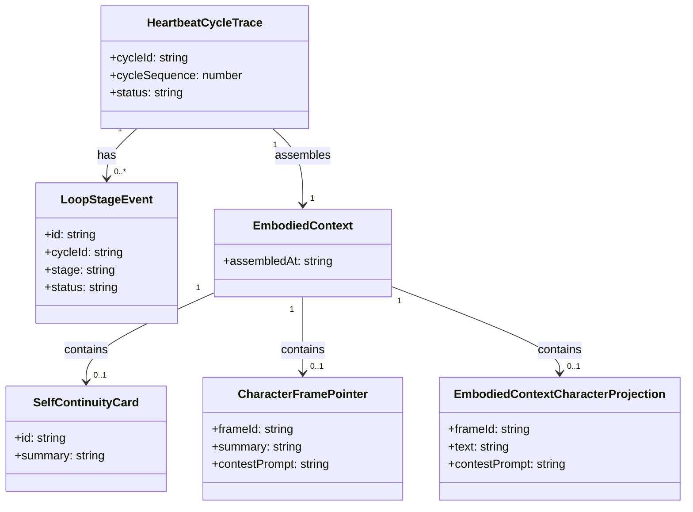

# Control Context System — 实现细节 (L1)

> **文件性质**: L1 实现层 · **对应 L0**: [`control-context-system.md`](./control-context-system.md)
> 本文件仅在 `/forge` 任务明确引用时加载。日常阅读和任务规划请优先看 L0。
> **孤岛检查**: 本文件各节均须在 L0 有对应超链接入口。

---

## 版本历史

| 版本 | 日期       | Changelog |
| ---- | ---------- | --------- |
| v9.0 | 2026-06-21 | 初始 L1：完整数据结构、核心算法伪代码、决策树与边缘情况 |

---

## 本文件章节索引

|   §   | 章节                                                                 |   对应 L0 入口   |
| :---: | -------------------------------------------------------------------- | :--------------: |
|  §1   | [配置常量](#1-配置常量-config-constants)                             |  L0 §6 数据模型  |
|  §2   | [完整数据结构](#2-核心数据结构完整定义-full-data-structures)         |  L0 §6 数据模型  |
|  §3   | [核心算法伪代码](#3-核心算法伪代码-non-trivial-algorithm-pseudocode) | L0 §5 操作契约表 |
|  §4   | [决策树详细逻辑](#4-决策树详细逻辑-decision-tree-details)            |   L0 §4 架构图   |
|  §5   | [边缘情况与注意事项](#5-边缘情况与注意事项-edge-cases--gotchas)      |    L0 §5 / §9    |
|  §6   | [测试辅助](#6-测试辅助-test-helpers)                                 | L0 §11 测试策略  |

---

## §1 配置常量 (Config Constants)

> **L0 对应入口**: L0 §6 数据模型、§10 性能考虑。

| 常量 | 值 | 来源 |
| ---- | --- | ---- |
| `INTERACTION_LIMIT` | 10 | v8 `embodied-context-assembler.ts` DR-020 |
| `TOOL_EXPERIENCE_LIMIT` | 10 | v8 `embodied-context-assembler.ts` DR-020 |
| `SOURCE_REF_LIMIT_PER_SLICE` | 20 | v8 `embodied-context-assembler.ts` DR-020 |
| `ACCEPTED_DREAM_PROJECTION_LIMIT` | 3 | v8 `embodied-context-assembler.ts` |
| `SELF_CONTINUITY_CARD_MAX_CHARS` | 1200 | PRD US-001 |
| `CHARACTER_FRAME_MAX_CHARS` | 900 | PRD US-008 |
| `CHARACTER_POINTER_SUMMARY_MAX_CHARS` | 200 | 本系统 L1 决策 |
| `HEARTBEAT_TOTAL_BUDGET_MS` | 2000 | PRD §6.1 |
| `CONTEXT_ASSEMBLY_P95_MS` | 400 | v8 DR-020 |
| `EMBODIED_CONTEXT_HARD_DEADLINE_MS` | 1800 | 非关键切片超时；确保 attention/action/observability 在 2s 预算内保留余量 |
| `ACTIVE_ACTIVITY_THREAD_LIMIT` | 3 | 注入 Agent-facing context 的 active/paused thread 上限 |
| `ACTIVITY_THREAD_MAX_STEPS` | 8 | 单个 thread 超过该步数必须 pause/complete/block，防止 runaway |
| `ACTIVITY_THREAD_STALE_HEARTBEATS` | 6 | 超过该 heartbeat gap 未推进则标记 stale/pause |
| `DEFAULT_PROFILE_ID` | `"default"` | v8 `embodied-context-assembler.ts` |

### Scope 路由映射

| trigger | scopeHint | 路由结果 | reason |
| ------- | --------- | -------- | ------ |
| `heartbeat_bridge` | * | `rhythm` | 默认节律循环 |
| `user_task` | * | `user_task` | 用户任务绕过 rhythm |
| `user_reply` | * | `user_reply` | 轻量连续性骨架 |
| `interrupt` | `paused_for_interrupt` | `rhythm` (degraded) | 中断恢复后重试 |
| `resume` | `paused_for_interrupt` | `rhythm` | 恢复节律 |

---

## §2 核心数据结构完整定义 (Full Data Structures)

> **L0 对应入口**: L0 §6.1 核心实体。

```ts
// 通用切片容器：每个切片都有独立加载状态
interface ContextSlice<T> {
  status: "loaded" | "degraded" | "blocked";
  data: T;
  reason?: V8ReasonCode;
}

interface ProjectionSlice<T> extends ContextSlice<T> {}
interface BodySlice<T> extends ContextSlice<T> {}

// 循环请求与结果
interface HeartbeatCycleRequest {
  workspaceRoot: string;
  requestedAt?: string;
  trigger: "scheduled" | "manual" | "host";
  runtimeAvailable: boolean;
}

interface HeartbeatCycleResult {
  cycleId: string;
  cycleSequence: number;
  scope: RuntimeScope;
  status: HeartbeatCycleStatus;
  closureRef?: SourceRef;
  noActionReason?: V8ReasonCode;
  degraded?: DegradedOperationResult;
  rhythmState?: DailyRhythmState;
  rhythmDegraded?: DegradedOperationResult;
}

// 装配后的 Agent-facing 上下文
interface EmbodiedContext {
  identity: ContextSlice<IdentityProfile>;
  goals: ContextSlice<AgentGoal[]>;
  recentInteractions: ContextSlice<Interaction[]>;
  toolExperience: ContextSlice<ToolExperience[]>;
  acceptedDream: ContextSlice<MemoryProjection[]>;
  affordanceMap: ContextSlice<AffordanceMap>;
  selfHealth: ContextSlice<SelfHealthSnapshot>;
  selfContinuityCard: ContextSlice<SelfContinuityCard>;
  characterFramePointer: ContextSlice<CharacterFramePointer>;
  characterFrameProjection: ContextSlice<EmbodiedContextCharacterProjection>;
  activeMemoryProjections: ContextSlice<MemoryProjection[]>;
  activeProceduralProjections: ContextSlice<ProceduralProjection[]>;
  routineList: ContextSlice<RoutineListItem[]>;
  activityThreads: ContextSlice<ActivityThread[]>;
  attentionSignals?: ContextSlice<AttentionSignal[]>;
  assembledAt: string;
}

// Continuity / Character / Routine 实体
interface SelfContinuityCard {
  id: string;
  summary: string;
  bodyIntuition: string;
  relationshipPosture: string;
  valuePosture: string;
  behaviorHabits: string[];
  activeRoutinePointers: RoutinePointer[];
  currentProhibitions: string[];
  characterFramePointer: CharacterFramePointer;
  sourceRefs: SourceRef[];
  acceptedAt: string;
  status: "active" | "deferred" | "unavailable";
}

interface CharacterFramePointer {
  frameId: string;
  summary: string;
  contestPrompt: string;
  sourceRefs: SourceRef[];
  status: "active" | "deferred" | "contested" | "superseded";
}

interface EmbodiedContextCharacterProjection {
  frameId: string;
  text: string;
  contestPrompt: string;
  sourceRefs: SourceRef[];
  status: "active" | "deferred" | "contested";
  newlyProposed?: boolean;
}

type ActivityThreadStatus = "active" | "paused" | "completed" | "abandoned" | "blocked";
type ActivityStepKind = "observe" | "associate" | "ask_agent" | "propose_action" | "policy_closure" | "pause" | "complete";

interface ActivityThread {
  threadId: string;
  originAttentionSignalId: string;
  status: ActivityThreadStatus;
  currentFocus: string;
  associations: string[];
  nextPossibleMoves: ActivityStepKind[];
  completedStepCount: number;
  lastStepKind?: ActivityStepKind;
  blockerReason?: string;
  stopCondition: "single_step_done" | "agent_paused" | "goal_satisfied" | "blocked" | "stale" | "max_steps";
  lastHeartbeatSequence: number;
  sourceRefs: SourceRef[];
  createdAt: string;
  updatedAt: string;
}

interface ActivityStep {
  stepId: string;
  threadId: string;
  cycleId: string;
  stepKind: ActivityStepKind;
  summary: string;
  sourceRefs: SourceRef[];
  closureRef?: SourceRef;
  createdAt: string;
}

interface RoutineListItem {
  routineId: string;
  capabilityPattern: string;
  version: string; // semver, mapped from ToolRoutine.version
  status: "installed" | "disabled" | "rollback"; // 从 ToolRoutine 内部 status 映射：active->installed，candidate/validated->disabled，retired->rollback
  sourceRefs: SourceRef[];
  rollbackRef?: SourceRef;
}

// Observability 实体（与 v8-contracts 对齐）
interface HeartbeatCycleTrace {
  cycleId: string;
  cycleSequence: number;
  heartbeatStartedAt: string;
  heartbeatCompletedAt?: string;
  inputCount: number;
  outputCount: number;
  status: "started" | "completed" | "failed" | "degraded";
}

interface LoopStageEvent {
  id: string;
  cycleId: string;
  cycleSequence: number;
  stageKind: LoopStage; // aligned with observability-recovery-system LoopStageEvent.stageKind
  status: "started" | "completed" | "skipped" | "blocked" | "failed";
  reasonCode?: string; // canonical reason code; aligned with observability-recovery-system
  sourceRefs: SourceRef[];
  proofRefs?: SourceRef[];
  traceRefs?: SourceRef[];
  payloadJson?: string;
  redacted: boolean;
  observedAt: string; // aligned with observability-recovery-system
}

// 跨系统端口使用的输入/输出类型
interface AttentionInput {
  cycleId: string;
  evidenceItems: EvidenceItem[];
  embodiedContext: EmbodiedContext;
  goals: AgentGoal[];
}

interface AgentActionIntent {
  intentId: string;
  actionKind: PlatformNeutralActionKind;
  attentionSignalRefs: SourceRef[];
  sourceRefs: SourceRef[];
  targetPlatformId?: string;
  targetCapabilityId?: string;
  routineInvocation?: RoutineInvocation;
}

interface ActionClosureResult {
  closureRef?: SourceRef;
  noActionReason?: V8ReasonCode;
  degraded?: DegradedOperationResult;
}

interface RoutineInvocation {
  routineId: string;
  version: string;
  capabilityPattern: string;
  payload: Record<string, unknown>;
}

// 跨系统读取参数（由 memory-continuity-system 拥有）
interface ContinuityScope {
  workspaceRoot: string;
  now?: string;
  maxSummaryLength?: number;
}

interface ProjectionFilter {
  workspaceRoot: string;
  now: string;
  activeOnly?: boolean;
}

interface RoutineFilter {
  workspaceRoot: string;
  status?: ("installed" | "disabled" | "rollback")[];
  capabilityPattern?: string;
}

interface ActivityThreadFilter {
  workspaceRoot: string;
  status?: ActivityThreadStatus[];
  limit?: number;
}

// 跨系统窄端口协议（memory-continuity-system 为 canonical owner）
interface ContinuityReadPort {
  loadSelfContinuityCard(scope: ContinuityScope): Promise<ProjectionSlice<SelfContinuityCard>>;
  loadRoutineList(filters: RoutineFilter): Promise<ProjectionSlice<RoutineListItem[]>>;
  loadActiveMemoryProjections(filters: ProjectionFilter): Promise<ProjectionSlice<MemoryProjection[]>>;
  loadActiveProceduralProjections(filters: ProjectionFilter): Promise<ProjectionSlice<ProceduralProjection[]>>;
}

interface ActivityThreadPort {
  loadActivityThreads(filters: ActivityThreadFilter): Promise<ProjectionSlice<ActivityThread[]>>;
  createActivityThread(input: ActivityThread): Promise<ProjectionSlice<ActivityThread>>;
  appendActivityStep(input: ActivityStep): Promise<ProjectionSlice<ActivityStep>>;
  updateActivityThreadStatus(threadId: string, status: ActivityThreadStatus, reason?: string): Promise<ProjectionSlice<ActivityThread>>;
}

interface CharacterReadPort {
  loadActiveCharacterFrame(now: string): Promise<ProjectionSlice<CharacterFramePointer>>;
  loadActiveCharacterFrameProjection(now: string): Promise<ProjectionSlice<EmbodiedContextCharacterProjection>>;
}

interface BodyIntuitionReadPort {
  assembleAffordanceMap(): Promise<BodySlice<AffordanceMap>>;
  loadToolExperienceSlice(limit: number): Promise<BodySlice<ToolExperience[]>>;
}

interface AttentionPort {
  buildAttentionSignal(input: AttentionInput): Promise<AttentionSignal | DegradedOperationResult>;
}

interface ActionClosurePort {
  evaluateAndDispatch(intent: AgentActionIntent): Promise<ActionClosureResult>;
}

interface ObservabilityPort {
  writeHeartbeatCycleTrace(trace: HeartbeatCycleTrace): Promise<SourceRef | DegradedOperationResult>;
  recordLoopStageEvent(event: LoopStageEvent): Promise<void>;
}
```

### §2.3 实体关系图 (Entity Relationship)

> **L0 对应入口**: L0 §6.2 实体关系图。



---

## §3 核心算法伪代码 (Non-Trivial Algorithm Pseudocode)

> 每节对应 L0 §5.1 操作契约表的一行。

### §3.1 `runHeartbeatCycle`

**对应契约**: L0 §5.1 `runHeartbeatCycle(signal, runtimeAvailable, deps)`
**准入理由**: 多步骤副作用链 + 顺序不可颠倒。

```ts
async function runHeartbeatCycle(signal, runtimeAvailable, deps) {
  const route = routeScopedInput(signal);
  if (!runtimeAvailable) {
    return { scope: route.scope, status: "runtime_carrier_only", reasons: ["runtime_unavailable"] };
  }
  if (route.scope === "user_task") return heartbeatOk(route.scope, "rhythm_gate_bypass_user_task");
  if (route.scope === "user_reply") return heartbeatOk(route.scope, "user_reply_light_continuity_skeleton");

  const cycleRef = await startCycleTrace(deps.observability, signal);
  const context = await assembleEmbodiedContext(deps.assembler);
  const attention = await deps.attention.buildAttentionSignal({ cycleId: cycleRef.id, context });

  if (isDegraded(attention)) {
    const closure = await ensureTerminalClosure(cycleRef, { degraded: attention });
    await triggerDailyRhythm(cycleRef, closure);
    return buildCycleResult(cycleRef, closure, { degraded: attention });
  }

  const activity = await advanceActivityThread({
    cycleRef,
    attention,
    context,
    threadPort: deps.activityThreadPort,
    observability: deps.observability,
  });

  const authoredIntent = await readAgentOrRoutineAuthoredIntent({
    cycleRef,
    context,
    activity,
    attentionRefs: [attention.signalId],
  });
  if (!authoredIntent) {
    const closure = await ensureTerminalClosure(cycleRef, {
      noActionReason: "attention_hint_without_agent_or_routine_intent",
      sourceRefs: attention.sourceRefs,
    });
    await linkActivityClosure(activity, closure);
    await triggerDailyRhythm(cycleRef, closure);
    return buildCycleResult(cycleRef, closure);
  }

  const closure = await deps.actionClosure.evaluateAndDispatch(authoredIntent);
  const finalClosure = await ensureTerminalClosure(cycleRef, closure);
  await linkActivityClosure(activity, finalClosure);
  await triggerDailyRhythm(cycleRef, finalClosure);
  return buildCycleResult(cycleRef, finalClosure);
}
```

### §3.2 `routeScopedInput`

**对应契约**: L0 §5.1 `routeScopedInput(trigger, scopeHint, payload)`
**准入理由**: 不明显的业务规则（scope 分类影响后续循环路径）。

```ts
function routeScopedInput(input) {
  if (input.trigger === "user_task") return { scope: "user_task", trigger: input.trigger, handled: true };
  if (input.trigger === "user_reply") return { scope: "user_reply", trigger: input.trigger, handled: true };
  if (input.trigger === "interrupt") return { scope: "rhythm", trigger: input.trigger, handled: true };
  if (input.trigger === "resume") return { scope: "rhythm", trigger: input.trigger, handled: true };
  return { scope: input.scopeHint ?? "rhythm", trigger: input.trigger, handled: true };
}

// Slice helpers for parallel assembly with individual timeouts.
function withTimeout<T>(promise: Promise<T>, ms: number): Promise<T> {
  return Promise.race([
    promise,
    new Promise<never>((_, reject) => setTimeout(() => reject(new Error("slice_timeout")), ms)),
  ]);
}

function toSlice<T>(result: PromiseSettledResult<ContextSlice<T>>): ContextSlice<T> {
  if (result.status === "fulfilled") return result.value;
  return { status: "degraded", data: {} as T, reason: "slice_timeout" };
}

function toBodySlice<T>(result: PromiseSettledResult<BodySlice<T>>): BodySlice<T> {
  if (result.status === "fulfilled") return result.value;
  return { status: "degraded", data: {} as T, reason: "slice_timeout" };
}

function toProjectionSlice<T>(result: PromiseSettledResult<ProjectionSlice<T>>): ProjectionSlice<T> {
  if (result.status === "fulfilled") return result.value;
  return { status: "degraded", data: {} as T, reason: "slice_timeout" };
}

```

### §3.3 `assembleEmbodiedContext`
**对应契约**: L0 §5.1 `assembleEmbodiedContext(options)`
**准入理由**: 多步骤副作用链 + 边界情况多。

```ts
async function assembleEmbodiedContext(options) {
  const assembledAt = new Date().toISOString();

  // Critical slices are loaded in parallel with individual timeouts.
  // Non-critical slices are best-effort and MUST NOT block the 2s heartbeat budget.
  const [
    identity,
    goals,
    recentInteractions,
    toolExperience,
    acceptedDream,
    affordanceMap,
    selfHealth,
    selfContinuityCard,
    characterFramePointer,
    characterFrameProjection,
    activeMemoryProjections,
    activeProceduralProjections,
    routineList,
    activityThreads,
  ] = await Promise.allSettled([
    loadSlice(options.statePort.loadIdentityProfile),
    loadSlice(options.statePort.listActiveGoals, 10),
    loadSlice(() => options.statePort.loadRecentInteractionSnapshot(INTERACTION_LIMIT), trimLifo),
    loadSlice(() => options.statePort.loadToolExperienceSlice(TOOL_EXPERIENCE_LIMIT), trimLifo),
    loadSlice(() => options.statePort.loadAcceptedDreamProjection(ACCEPTED_DREAM_PROJECTION_LIMIT)),
    loadBodySlice(options.affordanceAssembler.assembleAffordanceMap),
    loadBodySlice(options.selfHealthProvider?.loadSelfHealth),
    loadProjectionSlice(options.continuityLoader.loadSelfContinuityCard),
    loadProjectionSlice(options.characterLoader.loadActiveCharacterFrame),
    loadProjectionSlice(options.characterLoader.loadActiveCharacterFrameProjection),
    loadProjectionSlice(options.continuityLoader.loadActiveMemoryProjections),
    loadProjectionSlice(options.continuityLoader.loadActiveProceduralProjections),
    loadProjectionSlice(options.continuityLoader.loadRoutineList),
    loadProjectionSlice(() => options.activityThreadPort.loadActivityThreads({
      workspaceRoot: options.workspaceRoot,
      status: ["active", "paused"],
      limit: ACTIVE_ACTIVITY_THREAD_LIMIT,
    })),
  ].map((p) => withTimeout(p, EMBODIED_CONTEXT_HARD_DEADLINE_MS)));

  return {
    identity: toSlice(identity),
    goals: toSlice(goals),
    recentInteractions: toSlice(recentInteractions),
    toolExperience: toSlice(toolExperience),
    acceptedDream: toSlice(acceptedDream),
    affordanceMap: toBodySlice(affordanceMap),
    selfHealth: toBodySlice(selfHealth),
    selfContinuityCard: toProjectionSlice(selfContinuityCard),
    characterFramePointer: toProjectionSlice(characterFramePointer),
    characterFrameProjection: toProjectionSlice(characterFrameProjection),
    activeMemoryProjections: toProjectionSlice(activeMemoryProjections),
    activeProceduralProjections: toProjectionSlice(activeProceduralProjections),
    routineList: toProjectionSlice(routineList),
    activityThreads: toProjectionSlice(activityThreads),
    assembledAt,
  };
}
```

### §3.4 `loadContinuityContext`

**对应契约**: L0 §5.1 `loadContinuityContext()`
**准入理由**: 多读取端口 + 失败降级。

```ts
async function loadContinuityContext(ports, scope) {
  const [memory, procedural, card, routines] = await Promise.allSettled([
    ports.loadActiveMemoryProjections(scope),
    ports.loadActiveProceduralProjections(scope),
    ports.loadSelfContinuityCard(scope),
    ports.loadRoutineList(scope),
  ]);
  return {
    memoryProjections: toSlice(memory, "projection_unavailable"),
    proceduralProjections: toSlice(procedural, "projection_unavailable"),
    selfContinuityCard: toSlice(card, "continuity_unavailable"),
    routineList: toSlice(routines, "routine_list_unavailable"),
  };
}
```

### §3.5 `loadCharacterFramePointer`

**对应契约**: L0 §5.1 `loadCharacterFramePointer()`
**准入理由**: 独立降级语义 + contestable 标注。

```ts
async function loadCharacterFramePointer(port, now) {
  const [pointerResult, projectionResult] = await Promise.allSettled([
    port.loadActiveCharacterFrame(now),
    port.loadActiveCharacterFrameProjection(now),
  ]);

  const pointer = pointerResult.status === "fulfilled" ? pointerResult.value : undefined;
  const projection = projectionResult.status === "fulfilled" ? projectionResult.value : undefined;

  // M-1: 只加载底层 accepted + active 的 frame；contested 降级为 character_frame_contested slice
  if (!pointer || pointer.status !== "loaded" || !pointer.data || pointer.data.status !== "active") {
    return {
      status: "degraded",
      data: { frameId: "deferred", summary: "", contestPrompt: "", sourceRefs: [], status: "deferred" },
      reason: "character_frame_deferred",
    };
  }

  if (projection?.status === "loaded" && projection.data?.status === "contested") {
    return {
      status: "degraded",
      data: pointer.data,
      projection: projection.data,
      reason: "character_frame_contested",
    };
  }

  if (projection?.status === "loaded" && projection.data?.newlyProposed === true) {
    return {
      status: "loaded",
      data: pointer.data,
      projection: { ...projection.data, status: "active" },
      reason: "character_frame_newly_proposed",
    };
  }

  return { status: "loaded", data: pointer.data, projection: projection?.data };
}
```

### §3.6 `loadBodyIntuition`

**对应契约**: L0 §5.1 `loadBodyIntuition()`
**准入理由**: 外部端口失败不影响上下文装配。

```ts
async function loadBodyIntuition(ports) {
  const [affordance, experience] = await Promise.allSettled([
    ports.assembleAffordanceMap(),
    ports.loadToolExperienceSlice(TOOL_EXPERIENCE_LIMIT),
  ]);
  return {
    affordanceMap: toBodySlice(affordance, "affordance_unavailable"),
    toolExperience: toBodySlice(experience, "tool_experience_unavailable"),
  };
}
```

### §3.7 `triggerDailyRhythm`

**对应契约**: L0 §5.1 `triggerDailyRhythm(cycleRef, closureRef)`
**准入理由**: fire-and-forget + 失败记录。

```ts
async function triggerDailyRhythm(ports, cycleRef, closureRef) {
  try {
    return await ports.dailyRhythm.checkAndSchedule({ cycleId: cycleRef.id, closureRef });
  } catch (err) {
    return { rhythmDegraded: { status: "degraded", reason: "rhythm_trigger_failed", ownerStage: "quiet", sourceRefs: [cycleRef], operatorNextAction: String(err), retryable: true } };
  }
}
```

### §3.8 `ensureTerminalClosure`

**对应契约**: L0 §5.1 `ensureTerminalClosure(cycleId, closureResult)`
**准入理由**: exactly-one 不变量。

```ts
async function ensureTerminalClosure(ports, cycleId, closureResult) {
  if (closureResult?.closureRef) return closureResult;
  const degraded = closureResult?.degraded;
  const reason = closureResult?.noActionReason ?? degraded?.reason ?? "proposal_no_action";
  const fallback = await ports.actionClosure.recordNoActionClosure(cycleId, reason);
  if (fallback.closureRef) return { closureRef: fallback.closureRef, noActionReason: reason };
  return { degraded: fallback.degraded ?? degraded };
}
```

### §3.9 `advanceActivityThread`

**对应契约**: L0 §5.1 `advanceActivityThread(signal, attention, context)`
**准入理由**: 需要明确防 runaway、跨轮状态和 action policy 边界。

```ts
async function advanceActivityThread({ cycleRef, attention, context, threadPort, observability }) {
  if (isDegraded(attention) || attention.status !== "attentive") {
    await observability.recordLoopStageEvent(activitySkipped(cycleRef, "attention_not_attentive"));
    return { status: "skipped", reason: "attention_not_attentive" };
  }

  const active = context.activityThreads?.status === "loaded" ? context.activityThreads.data : [];
  const related = selectRelatedThread(active, attention);

  if (related && shouldStopThread(related, cycleRef.cycleSequence)) {
    const status = related.completedStepCount >= ACTIVITY_THREAD_MAX_STEPS ? "blocked" : "paused";
    return threadPort.updateActivityThreadStatus(related.threadId, status, stopReason(related, cycleRef));
  }

  const thread = related ?? await threadPort.createActivityThread({
    threadId: makeId("activity"),
    originAttentionSignalId: attention.signalId,
    status: "active",
    currentFocus: summarizeFocus(attention),
    associations: deriveAssociations(attention, context).slice(0, 5),
    nextPossibleMoves: ["associate", ...attention.possibleActions.map(toActivityStepKind)],
    completedStepCount: 0,
    stopCondition: "single_step_done",
    lastHeartbeatSequence: cycleRef.cycleSequence,
    sourceRefs: [{ family: "attention", id: attention.signalId }, ...attention.sourceRefs],
    createdAt: now(),
    updatedAt: now(),
  });

  // One heartbeat may advance exactly one bounded step. Side effects are not executed here;
  // propose_action is passed to action-closure-policy after this function returns.
  const stepKind = chooseNextStepKind(thread, attention, context);
  const step = await threadPort.appendActivityStep({
    stepId: makeId("activity_step"),
    threadId: thread.threadId,
    cycleId: cycleRef.id,
    stepKind,
    summary: summarizeStep(stepKind, attention),
    sourceRefs: thread.sourceRefs,
    createdAt: now(),
  });

  await observability.recordLoopStageEvent(activityAdvanced(cycleRef, thread, step));
  return { status: "advanced", thread, step };
}

function shouldStopThread(thread, cycleSequence) {
  if (thread.completedStepCount >= ACTIVITY_THREAD_MAX_STEPS) return true;
  if (cycleSequence - thread.lastHeartbeatSequence > ACTIVITY_THREAD_STALE_HEARTBEATS) return true;
  return thread.status === "blocked" || thread.status === "completed" || thread.status === "abandoned";
}
```

---

## §4 决策树详细逻辑 (Decision Tree Details)

> **L0 对应入口**: L0 §4.1 架构图、§4.3 数据流。

### §4.1 Heartbeat 入口决策

```
signal arrives
├── runtimeAvailable === false
│   └── return runtime_carrier_only (no lived-experience loop)
├── scope === user_task
│   └── return heartbeat_ok (bypass rhythm)
├── scope === user_reply
│   └── return heartbeat_ok (light continuity skeleton)
└── scope === rhythm / default
    ├── start cycle trace
    ├── assemble EmbodiedContext
    ├── build AttentionSignal
    ├── advance at most one ActivityStep
    ├── evaluate action closure
    ├── ensure terminal closure
    ├── trigger daily rhythm
    └── return HeartbeatCycleResult
```

### §4.2 EmbodiedContext 切片降级决策

```
load slice
├── status === loaded
│   └── slice.status = loaded, slice.data = data
├── status === degraded OR data partial
│   └── slice.status = degraded, slice.data = best-effort, slice.reason = reason
└── status === blocked / exception
    └── slice.status = blocked, slice.data = empty sentinel, slice.reason = canonical V8ReasonCode
```

### §4.3 Terminal Closure 保证决策

```
after action-closure-policy returns
├── closureRef exists
│   └── terminal closure satisfied
├── noActionReason exists
│   └── record no-action closure → closureRef
└── both missing (defensive)
    └── record no-action closure with reason "proposal_no_action" → closureRef
```

---

## §5 边缘情况与注意事项 (Edge Cases & Gotchas)

> **L0 对应入口**: L0 §5 接口设计、§9 安全性考虑。

| 场景 | 风险 | 处理方式 |
| ---- | ---- | -------- |
| `SelfContinuityCard` 超过字符预算 | 上下文膨胀 | trim 至 `SELF_CONTINUITY_CARD_MAX_CHARS`，优先保留 `summary` 与 `characterFramePointer`；section 顺序遵循 `shared-v9-contracts.md` §4，消费端不得重排 |
| `CharacterFramePointer` summary 缺失 | 空泛人格宣言 | 降级为 `character_frame_deferred`，不内嵌完整 frame |
| attention signal 缺失 source refs | 触发无依据 action | 降级为 `attention_blocked_missing_sources`，不传给 action closure |
| action closure 同时返回 closureRef 与 degraded | 观测歧义 | 以 closureRef 为准，degraded 仅作为 stage event reason |
| cycle 结束前异常退出 | exactly-one 破坏 | `CycleFinalizer` 在 finally/catch 路径补写 no-action closure |
| routine 调用 payload 含 credential | credential 泄露 | 经 `action-closure-policy-system` redaction gate，本系统不直接序列化 payload |
| `CharacterFrame` status = contested | Agent 已拒绝 | 仍保留 pointer，但 `characterFrameProjection.status` 映射为 `contested`，`ContextSerializer` 附加 "Agent contested" 前缀；posture 内容不作为可信投影使用 |
| `CharacterFrame` newly proposed | Agent 尚未确认新投影 | `ContextSerializer` 附加 "newly proposed / 可接受、拒绝、改写或退役" 前缀；posture 内容作为候选连续性提示而非永久身份事实 |

---

## §6 测试辅助 (Test Helpers)

> **L0 对应入口**: L0 §11 测试策略。

```ts
function makeStubEmbodiedContext(overrides = {}) {
  return {
    identity: { status: "loaded", data: {} },
    goals: { status: "loaded", data: [] },
    recentInteractions: { status: "loaded", data: [] },
    toolExperience: { status: "loaded", data: [] },
    acceptedDream: { status: "loaded", data: [] },
    affordanceMap: { status: "loaded", data: {} },
    selfHealth: { status: "loaded", data: {} },
    selfContinuityCard: { status: "loaded", data: makeStubSelfContinuityCard() },
    characterFramePointer: { status: "loaded", data: makeStubCharacterFramePointer() },
    characterFrameProjection: { status: "loaded", data: makeStubCharacterFrameProjection() },
    activeMemoryProjections: { status: "loaded", data: [] },
    activeProceduralProjections: { status: "loaded", data: [] },
    routineList: { status: "loaded", data: [] },
    assembledAt: new Date().toISOString(),
    ...overrides,
  };
}

function makeStubSelfContinuityCard() {
  return {
    id: "card_001",
    summary: "body intuition summary",
    bodyIntuition: "...",
    relationshipPosture: "...",
    valuePosture: "...",
    behaviorHabits: [],
    activeRoutinePointers: [],
    currentProhibitions: [],
    characterFramePointer: makeStubCharacterFramePointer(),
    sourceRefs: [],
    acceptedAt: new Date().toISOString(),
    status: "active",
  };
}

function makeStubCharacterFramePointer() {
  return {
    frameId: "frame_001",
    summary: "emergent habit pointer",
    contestPrompt: "This is a contestable projection compressed from your past interactions. You may accept, reject, revise, or retire it. It does not claim to fully reflect your real emotions or permanent identity.",
    sourceRefs: [],
    status: "active",
  };
}

function makeStubCharacterFrameProjection() {
  return {
    frameId: "frame_001",
    text: "emergent habits, value posture, relationship posture, expression posture, growth tensions",
    contestPrompt: "This is a contestable projection compressed from your past interactions. You may accept, reject, revise, or retire it. It does not claim to fully reflect your real emotions or permanent identity.",
    sourceRefs: [],
    status: "active",
  };
}
```
