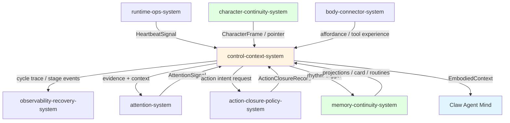
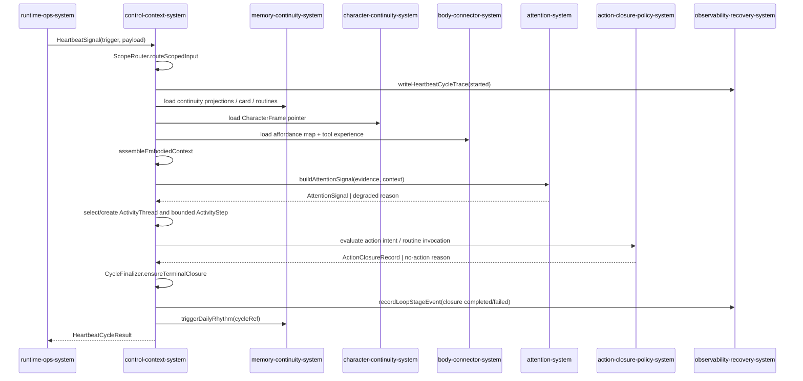

# Control Context System 系统设计文档 (L0 — 导航层)

| 字段          | 值                                                                    |
| ------------- | --------------------------------------------------------------------- |
| **System ID** | `control-context-system`                                              |
| **Project**   | Second Nature                                                         |
| **Version**   | v9.0                                                                  |
| **Status**    | `Draft`                                                               |
| **Author**    | Nyx / System Designer                                                 |
| **Date**      | 2026-06-21                                                            |
| **L1 Detail** | [control-context-system.detail.md](./control-context-system.detail.md) |

> [!IMPORTANT]
> **文档分层说明**
> - **本文件 (L0 导航层)**: 架构图、操作契约、设计决策。面向快速理解与任务规划。禁止放配置字典、算法伪代码和方法体。
> - **[control-context-system.detail.md](./control-context-system.detail.md) (L1 实现层)**: 完整数据结构、配置常量、核心算法伪代码、决策树与边缘情况。仅 `/forge` 任务明确引用时加载。

---

## 目录 (Table of Contents)

|   §   | 章节                                                         | 关键内容                                                 |
| :---: | ------------------------------------------------------------ | -------------------------------------------------------- |
|   1   | [概览](#1-概览-overview)                                     | 系统目的、边界、职责                                     |
|   2   | [目标与非目标](#2-目标与非目标-goals--non-goals)             | Goals / Non-Goals                                        |
|   3   | [背景与上下文](#3-背景与上下文-background--context)          | 为什么需要这个系统、约束、开放项                         |
|   4   | [系统架构](#4-系统架构-architecture)                         | Mermaid 架构图、组件职责、数据流                         |
|   5   | [接口设计](#5-接口设计-interface-design)                     | 操作契约表、跨系统协议、CLI surface                      |
|   6   | [数据模型](#6-数据模型-data-model)                           | 实体字段声明、ER 图 → [L1 §2](./control-context-system.detail.md) |
|   7   | [技术选型](#7-技术选型-technology-stack)                     | 核心技术、关键依赖                                       |
|   8   | [Trade-offs](#8-trade-offs--alternatives-权衡与备选方案)     | 决策理由、备选方案对比                                   |
|   9   | [安全性考虑](#9-安全性考虑-security-considerations)          | 风险与缓解                                               |
|  10   | [性能考虑](#10-性能考虑-performance-considerations)          | 性能目标、优化策略                                       |
|  11   | [测试策略](#11-测试策略-testing-strategy)                    | 单测、集成、契约验证矩阵                                 |
|  12   | [部署与运维](#12-部署与运维-deployment--operations) *(N/A)*  | 本系统为运行时编排模块，无独立部署                       |
|  13   | [未来考虑](#13-未来考虑-future-considerations) *(N/A)*       | v9 范围内不展开                                          |
|  14   | [附录](#14-appendix-附录)                                    | 术语表、参考资料、变更日志                               |

**L1 实现层** → [control-context-system.detail.md](./control-context-system.detail.md)
> [§1 配置常量](./control-context-system.detail.md) · [§2 数据结构](./control-context-system.detail.md) · [§3 算法](./control-context-system.detail.md) · [§4 决策树](./control-context-system.detail.md) · [§5 边缘情况](./control-context-system.detail.md)

---

## 1. 概览 (Overview)

### 1.1 System Purpose (系统目的)

`control-context-system` 是 Second Nature v9 的节律编排与上下文装配层。它把 OpenClaw / CLI 发来的 heartbeat 信号转译为一次受控的循环，按序调用 attention、activity-thread continuation、action-closure-policy、memory-continuity、character-continuity、body-connector 与 observability-recovery 的窄端口，最终生成可注入 Claw Agent 上下文的 `EmbodiedContext`，并保证每轮循环都有且仅有一个 terminal closure 或显式的 no-action / degraded reason [REQ-001] [REQ-003] [REQ-004] [REQ-008]。

### 1.2 System Boundary (系统边界)

| 方向 | 契约 |
| ---- | ---- |
| **输入** | `runtime-ops-system` 的 `HeartbeatSignal`、ops 命令、workspace root、runtime availability flag；`memory-continuity-system` 的 projections / card / routines / active ActivityThreads；`character-continuity-system` 的 `CharacterFrame` / pointer；`body-connector-system` 的 affordance / tool experience；`observability-recovery-system` 的 loop health。 |
| **输出** | `runtime-ops-system` 的 `HeartbeatCycleResult` / ops envelope；`attention-system` 的 evidence + context；`action-closure-policy-system` 的 intent request；`observability-recovery-system` 的 trace / stage events；`memory-continuity-system` 的 activity thread progress 与 daily rhythm trigger；Claw Agent 的 `EmbodiedContext`。 |
| **依赖** | `runtime-ops-system`, `attention-system`, `action-closure-policy-system`, `memory-continuity-system`, `character-continuity-system`, `body-connector-system`, `observability-recovery-system`。 |
| **被依赖** | `runtime-ops-system`（暴露命令）、Claw Agent（消费上下文）、`observability-recovery-system`（消费循环痕迹）。 |

### 1.3 System Responsibilities (系统职责)

**负责**:
- 编排 heartbeat 节律：signal → scope 路由 → 上下文装配 → attention → action closure → 循环终结 → daily rhythm trigger [REQ-003]。
- 选择或创建 `ActivityThread`，在每轮 heartbeat 中最多推进一个 bounded `ActivityStep`，让 observe/associate/action/pause/complete 跨多轮延续 [REQ-003]。
- 装载 active memory projection、procedural projection、body intuition、routine list、`SelfContinuityCard` 和独立的 `CharacterFrame` pointer/projection 到 `EmbodiedContext` [REQ-001] [REQ-004] [REQ-008]。
- 保证每轮 cycle 产生 terminal closure 或显式 no-action / degraded reason [REQ-003]。
- 记录 `HeartbeatCycleTrace` 与 `LoopStageEvent`，保持 cycleSequence 单调递增。
- 将 `CharacterFrame` 作为 contestable projection 注入，不自作永久人格事实或情绪事实 [ADR-006]。

**不负责**:
- 不替代 Agent 最终判断；不将 attention 信号变成最终 action judgment [ADR-002]。
- 不直接执行外部平台写入；外部写必须经 `action-closure-policy-system` 的 policy gate。
- 不拥有长期记忆语义；只读取 `memory-continuity-system` 的 accepted projections。
- 不拥有 `CharacterFrame` 的生成逻辑；只读取 `character-continuity-system` 产出的投影或 pointer。
- 不在单轮 heartbeat 内运行无限 observe/act 循环；持续性必须通过持久化 `ActivityThread` 跨轮推进。

---

## 2. 目标与非目标 (Goals & Non-Goals)

### 2.1 Goals

- **[G1]** 每次 heartbeat / Claw 会话启动时，装配出包含 `SelfContinuityCard`、`CharacterFrame` pointer、active projections、routines 和 body intuition 的 `EmbodiedContext`，或返回明确的 `continuity_unavailable` / `character_frame_deferred` reason [REQ-001] [REQ-008]。
- **[G2]** 每轮 cycle 有且仅有一个 terminal `ActionClosureRecord`（含 no-action closure），并写入 `HeartbeatCycleTrace` 与 `LoopStageEvent` [REQ-003]。
- **[G2a]** 相关 attention 可以创建或延续同一个 `ActivityThread`；每轮最多推进一个 step，且 side-effecting step 仍走 policy/closure [REQ-003]。
- **[G3]** `SelfContinuityCard` 与 `CharacterFrame` 独立注入；Card 仅保留 CharacterFrame 的 short pointer/summary，不内嵌完整 frame [REQ-008] [ADR-006]。
- **[G4]** 上下文装配在 PRD 约束的 2s 心跳预算内完成，p95 < 400ms（与 v8 DR-020 对齐）。
- **[G5]** `CharacterFrame` 必须以 contestable projection 形式呈现，提示词中明确允许 Agent accept / reject / revise / retire [REQ-008]。

### 2.2 Non-Goals

- **[NG1]** 不在本系统中预设人格属性表、人格分数或 deterministic persona controller [REQ-008] Non-Goal。
- **[NG2]** 不将 raw evidence / raw private content / raw credential 注入 `EmbodiedContext` 或 `SelfContinuityCard` [REQ-001] Non-Goal。
- **[NG3]** 不绕过 `ActionPolicyDecision` 执行动作 [ADR-002]。
- **[NG4]** 不把 `loop_status` 诊断逻辑内建为“大脑”决策输入。

---

## 3. 背景与上下文 (Background & Context)

### 3.1 Why This System? (为什么需要这个系统？)

v8 已能运行 living loop，但 Agent 上下文清空后不会继承身体直觉、重复信号抑制、关系姿态、表达边界或人格轨迹。v9 需要在每次 heartbeat / 会话启动时，把 Dream/Quiet 形成的连续性投影（memory、procedure、self continuity、character）装配成短而可验证的上下文切片，同时保持 Agent 是开放心智 [PRD §2.1] [REQ-001] [REQ-008]。

**关联 PRD 需求**: [REQ-001], [REQ-003], [REQ-004], [REQ-008] 及 US-001 / US-003 / US-004 / US-008。

### 3.2 Current State (现状分析)

v8 `control-plane-system` 已实现了 `runHeartbeatCycle`、单调 `cycleSequence`、`HeartbeatCycleTrace`、stage event 记录和每轮 closure 保证 [`.anws/v8/04_SYSTEM_DESIGN/control-plane-system.md`]。v9 在此基础上扩展上下文装配：把 `accepted projections` 升级为 `SelfContinuityCard`、`ProceduralProjection`、`RoutineList`，并新增独立的 `CharacterFrame` pointer；同时把 v8 的 `perception-judgment-system` 收窄为 `attention-system`，因此 control-context-system 不再消费 `JudgmentVerdict` 作为最终判断，而是消费 `AttentionSignal` [ADR-002]。

### 3.3 Constraints (约束条件)

- **技术约束**: 继续使用 TypeScript / Node.js / SQLite / OpenClaw plugin 栈 [ADR-001]。
- **语义约束**: `AttentionSignal` 只能提示 Agent，不能替代 Agent mind [ADR-002]。
- **连续性约束**: continuity 投影来自 post-Dream 输出，不是 raw history 堆砌 [ADR-003]。
- **人格约束**: `CharacterFrame` 是 emergent projection，必须 contestable，禁止写成人格分数或情绪事实 [ADR-006]。
- **性能约束**: `EmbodiedContext` 装配默认阻塞 heartbeat 不超过 2s；card 正文不超过 1200 UTF-8 chars，`CharacterFrame` 不超过 900 UTF-8 chars [PRD §6.1] [US-001] [US-008]。

### 3.4 Open Items (开放项)

- [x] `SelfContinuityCard` 读取端口精确字段名与失败语义已由 `memory-continuity-system.detail.md` §2 与 `runtime-ops-system.md` §5.2 确定：`ContinuityReadPort.loadSelfContinuityCard(scope)` 返回 `SelfContinuityCard | DegradedOperationResult`。
- [x] `CharacterFramePointer` 摘要长度、contest prompt 字段与 supersession 引用已由 `character-continuity-system.detail.md` §2.3 / §3.1 与 `control-context-system.detail.md` §2.2 确定。
- `[已决策: v8 JudgmentVerdict 存量测试迁移路径]`
  - **决策**: v8 `JudgmentVerdict` rows 在 v9 中视为只读 legacy；`control-context-system` 不再消费 `JudgmentVerdict` 作为决策输入。
  - **读时映射**: `memory-continuity-system` 在读取 v8 rows 时，若上游需要 attention 语义，按 `JudgmentVerdict` → `AttentionSignal` 的只读映射返回（`status=degraded`，`reason=v8_legacy_judgment_mapped`），不修改 schema。
  - **范围**: 仅影响测试与 observability replay；v9 新写入全部使用 `AttentionSignal`。
  - **Owner**: `control-context-system`（消费语义）+ `memory-continuity-system`（读时映射）+ `observability-recovery-system`（replay 标注）。

---

## 4. 系统架构 (Architecture)

### 4.1 Architecture Diagram (架构图)

### 4.2 Core Components (核心组件)

| Component Name | Responsibility | Tech Stack | Notes |
| -------------- | -------------- | ---------- | ----- |
| `HeartbeatOrchestrator` | 编排单轮 cycle：创建 trace、调用 attention、调用 action closure、触发 daily rhythm、返回 cycle result [REQ-003]。 | TypeScript | 继承 v8 `heartbeat-orchestrator.ts` 行为。 |
| `ActivityThreadCoordinator` | 选择 active/related thread，处理 create/continue/pause/complete，写入 `ActivityStep` progress [REQ-003]。 | TypeScript | 不拥有 Agent mind；每轮最多推进一个 step。 |
| `ScopeRouter` | 按 `RuntimeTrigger` + `scopeHint` 将信号路由到 `rhythm` / `user_task` / `user_reply` / `interrupt` / `resume` 路径。 | TypeScript | 与 v8 `signal.ts` 对齐。 |
| `EmbodiedContextAssembler` | 从 memory / character / body 读取端口装配 `EmbodiedContext`，应用 LIFO/去重/字符预算 trim 策略 [REQ-001] [REQ-008]。 | TypeScript | 扩展 v8 `embodied-context-assembler.ts`。 |
| `ContinuityLoader` | 读取 active `MemoryProjection`、`ProceduralProjection`、`SelfContinuityCard`、`RoutineList` [REQ-001] [REQ-004]。 | SQLite read ports | 只读，失败返回 degraded slice。 |
| `CharacterPointerLoader` | 读取当前 active / 未被 retire 的 `CharacterFrame` 或其 short pointer [REQ-008]。 | SQLite read ports | 失败返回 `character_frame_deferred` slice。 |
| `BodyIntuitionLoader` | 读取 affordance map 与最近 tool experience slice，作为 body intuition 注入上下文 [REQ-006]。 | TypeScript + connector ports | 与 `body-connector-system` 共享 affordance assembler。 |
| `CycleFinalizer` | 确保每轮 cycle 有且仅有一个 terminal closure；在异常路径写入 no-action closure 并记录 stage event [REQ-003]。 | TypeScript | exactly-one 不变量。 |
| `DailyRhythmTrigger` | closure 完成后向 `memory-continuity-system` 发出 daily rhythm 评估请求，不自行决定 Dream 是否到期 [ADR-003]。 | TypeScript | fire-and-forget，失败记录 degraded。 |
| `ContextSerializer` | 将 `EmbodiedContext` 序列化为 Claw-facing prompt slice，标注 projection 为 contestable [REQ-008]。 | TypeScript | 不暴露 raw credential。 |

### 4.3 Data Flow (数据流)

**关键数据流说明**:
1. **上下文装配先于 attention**: `EmbodiedContextAssembler` 先装载 continuity / activity / character / body 切片，再把 bounded context 交给 `attention-system`，避免 attention 直接面对原始证据堆 [ADR-002] [ADR-003]。
2. **ActivityThread 是跨轮脉络，不是内部长循环**: `ActivityThreadCoordinator` 根据 attention suggestion 与 active threads 创建/延续/暂停 thread；每轮最多写一个 `ActivityStep`。
3. **action closure 是终端节点**: `action-closure-policy-system` 返回 closure 后，`CycleFinalizer` 检查是否已写 closure；若未写则补写 no-action closure [REQ-003]。
4. **daily rhythm 在 closure 之后**: `DailyRhythmTrigger` 在 cycle 终结后发起，`memory-continuity-system` 负责判断 Quiet/Dream 是否到期 [ADR-003]。

---

## 5. 接口设计 (Interface Design)

### 5.1 操作契约表 (Operation Contracts)

| 操作 | [REQ-XXX] | 前置条件 | 消耗/输入 | 产出/副作用 | 实现细节 |
| ---- | :-------: | -------- | --------- | ----------- | :------: |
| `runHeartbeatCycle(signal, runtimeAvailable, deps)` | [REQ-001] [REQ-003] | state DB 可连接或返回 `runtime_carrier_only`; `signal.trigger` 已识别 | `HeartbeatSignal`, `HeartbeatDeps` | `HeartbeatCycleResult`, `HeartbeatCycleTrace`, `LoopStageEvent` 序列 | [L1 §3.1](./control-context-system.detail.md) |
| `routeScopedInput(trigger, scopeHint, payload)` | [REQ-003] | payload 包含 timestamp | `ScopedRuntimeInput` | `ScopeRouteResult` | [L1 §3.2](./control-context-system.detail.md) |
| `assembleEmbodiedContext(options)` | [REQ-001] [REQ-008] | workspaceRoot 已知；read ports 已注入 | `EmbodiedContextAssemblerDeps` | `EmbodiedContext`（含 loaded/degraded/blocked slices） | [L1 §3.3](./control-context-system.detail.md) |
| `advanceActivityThread(signal, attention, context)` | [REQ-003] | cycle trace 已创建；attention 有 source refs 或明确 blocked reason | active threads + `AttentionSignal` + bounded context | `ActivityThread` create/continue/pause/complete 与 0..1 `ActivityStep` | [L1 §3.9](./control-context-system.detail.md) |
| `loadContinuityContext()` | [REQ-001] [REQ-004] | memory-continuity read ports 可用 | cycleRef, workspaceRoot | `SelfContinuityCard`, active `MemoryProjection[]`, active `ProceduralProjection[]`, `RoutineList` 或 degraded slice | [L1 §3.4](./control-context-system.detail.md) |
| `loadCharacterFramePointer()` | [REQ-008] | character-continuity read port 可用 | workspaceRoot | `CharacterFramePointer` 或 `character_frame_deferred` slice | [L1 §3.5](./control-context-system.detail.md) |
| `loadBodyIntuition()` | [REQ-006] | body-connector affordance assembler 可用 | workspaceRoot, credential context | `AffordanceMap`, `ToolExperience[]` 或 degraded slice | [L1 §3.6](./control-context-system.detail.md) |
| `triggerDailyRhythm(cycleRef, closureRef)` | [REQ-004] [ADR-003] | cycle 已终结 | `SourceRef` | rhythm state 或 `rhythmDegraded` | [L1 §3.7](./control-context-system.detail.md) |
| `ensureTerminalClosure(cycleId, closureResult)` | [REQ-003] | cycle trace 已创建 | closure ref 或缺失标志 | 补写 no-action closure；记录 stage event | [L1 §3.8](./control-context-system.detail.md) |

### 5.2 跨系统接口协议 (Cross-System Interface Protocol)

本系统通过只读/窄端口与下游系统交互；不持有其它系统的内部实体。完整 TypeScript 协议定义见 [L1 §2](./control-context-system.detail.md)。

| 端口 | 依赖方向 | 数据类型 | 用途 |
| ---- | -------- | -------- | ---- |
| `ContinuityReadPort` | `memory-continuity-system` → `control-context-system` | `MemoryProjection[]`, `ProceduralProjection[]`, `SelfContinuityCard`, `RoutineListItem[]` | 读取 active continuity 投影与 routine；统一形状为 `loadSelfContinuityCard(scope)` 与 `loadRoutineList(filters)` |
| `ActivityThreadPort` | `memory-continuity-system` ↔ `control-context-system` | `ActivityThread`, `ActivityStep` | 读取 active threads；写入 create/continue/pause/complete progress |
| `CharacterReadPort` | `character-continuity-system` → `control-context-system` | `CharacterFramePointer`, `EmbodiedContextCharacterProjection` | 读取 contestable CharacterFrame pointer 与独立 bounded projection |
| `BodyIntuitionReadPort` | `body-connector-system` → `control-context-system` | `AffordanceMap`, `ToolExperience[]` | 读取真实手脚状态与工具经验 |
| `AttentionPort` | `control-context-system` → `attention-system` | `AttentionInput` → `AttentionSignal` | 生成注意力提示 |
| `ActionClosurePort` | `control-context-system` → `action-closure-policy-system` | `AgentActionIntent` → `ActionClosureResult` | 评估并闭合 action intent |
| `ObservabilityPort` | `control-context-system` → `observability-recovery-system` | `HeartbeatCycleTrace`, `LoopStageEvent` | 记录循环痕迹与 stage 事件 |

### 5.3 CLI / Plugin Surface

`control-context-system` 本身不暴露独立 HTTP API；其能力通过 `runtime-ops-system` 的 CLI / plugin 命令透出：

| 命令 / Ops | 用途 | [REQ-XXX] |
| ---------- | ---- | :-------: |
| `heartbeat_check` | 触发单轮 cycle，返回 cycle result | [REQ-003] |
| `continuity_status` | 返回 `SelfContinuityCard` 与 `CharacterFrame` pointer 的可用状态 | [REQ-001] [REQ-008] |
| `context_slice` | 返回当前 `EmbodiedContext` 的 redacted JSON 视图 | [REQ-001] |

---

## 6. 数据模型 (Data Model)

### 6.1 核心实体字段声明 (Core Entities)

| Entity | Field | Type | Source |
| ---- | ---- | ---- | ---- |
| `HeartbeatCycleRequest` | `workspaceRoot` | string | [REQ-001] |
| `HeartbeatCycleRequest` | `trigger` | `"scheduled" \| "manual" \| "host"` | v8 `signal.ts` |
| `HeartbeatCycleRequest` | `runtimeAvailable` | boolean | [REQ-003] |
| `HeartbeatCycleResult` | `cycleId` | string | v8 `HeartbeatCycleTrace` |
| `HeartbeatCycleResult` | `cycleSequence` | number | v8 `HeartbeatCycleTrace` |
| `HeartbeatCycleResult` | `scope` | `RuntimeScope` | v8 `signal.ts` |
| `HeartbeatCycleResult` | `status` | `HeartbeatCycleStatus` | v8 `signal.ts` |
| `HeartbeatCycleResult` | `closureRef` | `SourceRef?` | [REQ-003] |
| `HeartbeatCycleResult` | `noActionReason` | `V8ReasonCode?` | [REQ-003] |
| `HeartbeatCycleResult` | `degraded` | `DegradedOperationResult?` | v8 contracts |
| `HeartbeatCycleResult` | `rhythmState` / `rhythmDegraded` | ... | [REQ-004] [ADR-003] |
| `EmbodiedContext` | `identity` | `ContextSlice<IdentityProfile>` | v8 `embodied-context-assembler.ts` |
| `EmbodiedContext` | `goals` | `ContextSlice<AgentGoal[]>` | v8 `embodied-context-assembler.ts` |
| `EmbodiedContext` | `recentInteractions` | `ContextSlice<Interaction[]>` | v8 DR-020 |
| `EmbodiedContext` | `toolExperience` | `ContextSlice<ToolExperience[]>` | v8 DR-020 |
| `EmbodiedContext` | `acceptedDream` | `ContextSlice<MemoryProjection[]>` | v8 `embodied-context-assembler.ts` |
| `EmbodiedContext` | `affordanceMap` | `ContextSlice<AffordanceMap>` | [REQ-006] |
| `EmbodiedContext` | `selfHealth` | `ContextSlice<SelfHealthSnapshot>` | v8 `embodied-context-assembler.ts` |
| `EmbodiedContext` | `selfContinuityCard` | `ContextSlice<SelfContinuityCard>` | [REQ-001] |
| `EmbodiedContext` | `characterFramePointer` | `ContextSlice<CharacterFramePointer>` | [REQ-008] [ADR-006] |
| `EmbodiedContext` | `characterFrameProjection` | `ContextSlice<EmbodiedContextCharacterProjection>` | [REQ-008] [ADR-006] |
| `EmbodiedContext` | `activeMemoryProjections` | `ContextSlice<MemoryProjection[]>` | [REQ-001] |
| `EmbodiedContext` | `activeProceduralProjections` | `ContextSlice<ProceduralProjection[]>` | [REQ-004] |
| `EmbodiedContext` | `routineList` | `ContextSlice<RoutineListItem[]>` | [REQ-004] |
| `EmbodiedContext` | `attentionSignals` | `ContextSlice<AttentionSignal[]>?` | [REQ-003] [ADR-002] |
| `EmbodiedContext` | `activityThreads` | `ContextSlice<ActivityThread[]>` | [REQ-003] |
| `EmbodiedContext` | `assembledAt` | string | v8 DR-020 |
| `SelfContinuityCard` | `id` | string | [REQ-001] |
| `SelfContinuityCard` | `summary` | string (≤120 chars) | [REQ-001] |
| `SelfContinuityCard` | `bodyIntuition` | string (≤200 chars) | [REQ-001] |
| `SelfContinuityCard` | `relationshipPosture` | string (≤200 chars) | [REQ-001] |
| `SelfContinuityCard` | `valuePosture` | string (≤200 chars) | [REQ-001] |
| `SelfContinuityCard` | `behaviorHabits` | `string[]` (each ≤120 chars) | [REQ-001] |
| `SelfContinuityCard` | `activeRoutinePointers` | `RoutinePointer[]` | [REQ-001] [REQ-004] |
| `SelfContinuityCard` | `currentProhibitions` | `string[]` | [REQ-001] |
| `SelfContinuityCard` | `characterFramePointer` | `CharacterFramePointer` | [REQ-008] |
| `SelfContinuityCard` | `sourceRefs` | `SourceRef[]` | [REQ-001] |
| `SelfContinuityCard` | `acceptedAt` | string | memory-continuity lifecycle |
| `SelfContinuityCard` | `status` | `"active" \| "deferred" \| "unavailable"` | memory-continuity lifecycle |
| `CharacterFramePointer` | `frameId` | string | [REQ-008] |
| `CharacterFramePointer` | `summary` | string (≤200 chars) | [REQ-008] [ADR-006] |
| `CharacterFramePointer` | `contestPrompt` | string (≤300 chars) | [REQ-008] [ADR-006] |
| `CharacterFramePointer` | `sourceRefs` | `SourceRef[]` | [REQ-008] |
| `CharacterFramePointer` | `status` | `"active" \| "deferred" \| "contested" \| "superseded"` | character-continuity runtime |
| `RoutineListItem` | `routineId` | string | [REQ-004] |
| `RoutineListItem` | `capabilityPattern` | string | [REQ-004] |
| `RoutineListItem` | `version` | string (semver) | [REQ-004] |
| `RoutineListItem` | `status` | `"installed" \| "disabled" \| "rollback"` | [REQ-004] |
| `RoutineListItem` | `sourceRefs` | `SourceRef[]` | [REQ-004] |
| `RoutineListItem` | `rollbackRef` | `SourceRef?` | [REQ-007] |

> 完整类型定义、切片容器 `ContextSlice<T>` / `ProjectionSlice<T>` / `BodySlice<T>`、端口输入输出类型详见 [L1 §2](./control-context-system.detail.md)。

### 6.2 实体关系图 (Entity Relationship)

ER 图与完整类关系见 [L1 §2.3](./control-context-system.detail.md)。核心关系：

- `HeartbeatCycleTrace` 1 → * `LoopStageEvent`
- `HeartbeatCycleTrace` 1 → 1 `EmbodiedContext`
- `EmbodiedContext` 1 → 0..1 `SelfContinuityCard`
- `EmbodiedContext` 1 → 0..1 `CharacterFramePointer`
- `EmbodiedContext` 1 → 0..1 `EmbodiedContextCharacterProjection`
- `EmbodiedContext` 1 → 0..N active `ActivityThread`

### 6.3 数据流向 (Data Flow Direction)

- **读向**: `memory-continuity-system` → `control-context-system` → `EmbodiedContext` → Claw Agent。
- **写向**: `control-context-system` → `observability-recovery-system`（trace / stage events）; `control-context-system` → `memory-continuity-system`（activity thread progress, daily rhythm trigger）。
- **闭环**: Dream 生成的 projections 经 `memory-continuity-system` 生命周期后，被下一轮 `control-context-system` 读取 [ADR-003]。

---

## 7. 技术选型 (Technology Stack)

### 7.1 Core Technologies

| Domain    | Choice | Rationale |
| --------- | ------ | --------- |
| Runtime   | TypeScript / Node.js | 项目主栈 [ADR-001]；与 OpenClaw plugin 同构。 |
| State     | SQLite / sql.js      | 项目主存储；cycle trace 与 stage event 持久化。 |
| Plugin    | OpenClaw native plugin | heartbeat / ops 入口由 host 触发 [Architecture Overview §2 System 1]。 |
| Context assembly | Bounded read ports | 避免跨系统直接访问内部 schema。 |

### 7.2 Key Libraries/Dependencies

- `src/shared/types/v8-contracts.ts`: `SourceRef`, `HeartbeatCycleTrace`, `LoopStageEvent`, `DegradedOperationResult`, `V8ReasonCode`。
- `src/core/second-nature/heartbeat/signal.ts`: `HeartbeatSignal`, `RuntimeScope`, `RuntimeTrigger`, `HeartbeatCycleResult`。
- `src/core/second-nature/control-plane/heartbeat-orchestrator.ts`: v8 orchestrator 实现基线。

---

## 8. Trade-offs & Alternatives (权衡与备选方案)

### 8.1 注意力信号 vs 身体判断（跨系统决策）

> **决策来源**: [ADR-002: Narrow Real-Time Semantics to Attention, Not Agent Mind](../03_ADR/ADR_002_ATTENTION_NOT_AGENT_MIND.md)
>
> 本系统实现 ADR-002：控制上下文系统调用 `attention-system` 获得 `AttentionSignal`，并将其作为提示交给 Agent 或 routine；最终 action intent 仍由 Agent / verified routine 编写，再经 `action-closure-policy-system` 评估。不在控制上下文系统内把 attention 转成最终判断。
>
> **本系统特有实现**: `HeartbeatOrchestrator` 不再消费 `JudgmentVerdict` 作为决策输入；`ActionClosurePort` 接收的是 Agent/routine-authored intent + attention refs。

### 8.2 连续性投影 vs 原始历史堆砌（跨系统决策）

> **决策来源**: [ADR-003: Add Continuity Projection After Quiet/Dream](../03_ADR/ADR_003_CONTINUITY_PROJECTION_AFTER_DREAM.md)
>
> 本系统实现 ADR-003：`EmbodiedContextAssembler` 只读取 `memory-continuity-system` 产出的 `MemoryProjection`、`ProceduralProjection`、`SelfContinuityCard`、`RoutineList`，不直接注入 raw evidence 或 raw closure 日志。
>
> **本系统特有实现**: 新增 `ContinuityLoader` 与 `RoutineList` 读取端口；`EmbodiedContext` 中每个切片都有 `loaded` / `degraded` / `blocked` 状态，保证 projection 不可用时返回明确 reason。

### 8.3 CharacterFrame 独立注入 vs 内嵌到 SelfContinuityCard（跨系统决策）

> **决策来源**: [ADR-006: Model Character Continuity as Emergent Projection](../03_ADR/ADR_006_CHARACTER_CONTINUITY_AS_EMERGENT_PROJECTION.md)
>
> 本系统实现 ADR-006：`SelfContinuityCard` 仅携带 `CharacterFramePointer`（short summary + contest prompt + source refs），完整的 `CharacterFrame` 由 `character-continuity-system` 独立产出并直接注入 `EmbodiedContext`；提示词明确标注为 contestable projection。
>
> **本系统特有实现**: `CharacterPointerLoader` 与 `ContextSerializer` 分开处理 Card 和 Frame，禁止把 Frame 内嵌进 Card；序列化时附加 `accept/reject/revise/retire` affordance 文本。

### 8.4 编排层不做自动演化决策（本系统特有决策）

**Option A: control-context-system 直接批准 routine 安装 / connector 演化**
- 优点：循环闭合路径短。
- 缺点：编排层获得 policy 权限，破坏 `action-closure-policy-system` 的单一决策边界，且难以审计。

**Option B: control-context-system 只触发 rhythm 评估，演化 gate 由 memory/body/observability 系统共同执行（Selected）**
- 优点：保留 policy gate 和 ledger 审计，与 [REQ-007] 的 rollback 要求一致。
- 缺点：需要跨系统 trigger 与异步 gate 结果查询。

**Decision**: 选择 Option B。控制上下文系统只发起 `triggerDailyRhythm`，不自行批准演化。

---

## 9. 安全性考虑 (Security Considerations)

### 9.1 Data Redaction & Source Grounding

- `SelfContinuityCard` 与 `CharacterFramePointer` 必须经过 redaction gate，禁止包含 raw credential、raw private message 或未解析 source ref [REQ-001] [REQ-008]。
- 所有注入 `EmbodiedContext` 的切片必须携带 `SourceRef[]`；缺失时降级为 `blocked` 切片并记录 reason。

### 9.2 Policy Gate 不可绕过

- `control-context-system` 不直接调用 body-connector 执行器；外部动作必须经 `action-closure-policy-system` 的 `ActionPolicyDecision` [ADR-002] [REQ-003]。
- routine 调用同样走 `ActionClosurePort`，禁止把 routine 当作 policy 后门 [REQ-004 Non-Goal]。

### 9.3 CharacterFrame 提示词边界

- `ContextSerializer` 必须在 `CharacterFrame` 前附加 contestable 提示："这是基于过去互动的涌现投影，你可以接受、拒绝、修改或要求退休" [ADR-006] [REQ-008]。
- `CharacterPointerLoader` 只加载底层 `CharacterFrame.status === "accepted"` 且 pointer status 为 `active` 的 frame；`contested` 映射为 `character_frame_contested` degraded slice；`rejected` / `retired` / `superseded` 不得作为 active projection 注入。
- 禁止生成"你感到…""你的性格是…"等权威情绪或人格断言。

### 9.3a Context Serializer Anti-Programming Boundary

- `ContextSerializer` 必须把各切片分开渲染：attention hint、activity thread、routine pointer、continuity card、character projection、health diagnostics 不得合并成一段“你必须如何行动”的系统命令。
- `ActivityThread` 文案只能说明当前 focus、来源、已完成 step、可能下一步和停止条件；不得写成 Agent 内心独白或自动计划。
- `RoutineListItem` 文案只能说明 routine 是已验证、可回滚、policy-bound 的能力提示；不得暗示 routine 可绕过 Agent judgment 或 policy。
- `LoopHealth` / degraded reason 注入 context 时只能描述 Second Nature runtime 健康，不得描述 Agent 情绪或自我状态。
- Serializer 必须复用 `shared-v9-contracts.md §3.6` forbidden-pattern fixtures；命中 hard-control 或 emotion-claim 词形时返回 degraded slice 或 validation error。

### 9.4 安全风险与缓解

| Risk | Severity | Mitigation |
| ---- | :------: | ---------- |
| raw credential 进入上下文 | 高 | redaction gate + source ref 校验 |
| policy gate 被编排层绕过 | 高 | 外部写统一走 `action-closure-policy-system` |
| CharacterFrame 被写成情绪事实 | 中 | prompt 模板 contestable 标注 + 单测断言 |
| continuity 投影缺失导致空泛注入 | 中 | degraded slice + `continuity_unavailable` reason |

---

## 10. 性能考虑 (Performance Considerations)

### 10.1 Performance Goals

- **EmbodiedContext 装配**: p95 < 400ms（继承 v8 DR-020）。
- **单轮 heartbeat 总耗时**: 默认不超过 2s（PRD §6.1）。
- **循环 trace / stage event 写入**: 异步顺序写入，不阻塞 Agent-facing 输出。

### 10.2 Optimization Strategies

1. **Bounded reads**:
   - `recentInteractions` LIFO 10；`toolExperience` LIFO 10；source refs 去重后每切片不超过 20 [v8 `embodied-context-assembler.ts` DR-020]。
   - `SelfContinuityCard` 默认不超过 1200 UTF-8 chars；`CharacterFramePointer` summary 不超过 200 chars [PRD US-001 / US-008]。
2. **Fail-fast degraded slices**: 任一 read port 失败时该切片降级，不阻断其它切片装配。
3. **Projection lifecycle filtering**: `ContinuityLoader` 只读取 `status = active` 且未被 supersede 的 projections，避免历史投影膨胀。

### 10.3 Performance Monitoring

- `observability-recovery-system` 记录 `assembleEmbodiedContext` 耗时、各 read port degraded 次数、heartbeat 总耗时。
- `loop_status` 暴露 `continuity_unavailable` 与 `context_assembly_degraded` reason。

---

## 11. 测试策略 (Testing Strategy)

### 11.1 Unit Testing (单元测试)

- **ScopeRouter**: `user_task` / `user_reply` / `rhythm` 路由与 reason 映射 [REQ-003]。
- **EmbodiedContextAssembler**: trim 策略、source ref 去重、字符预算、degraded slice 保留 [REQ-001] [REQ-008]。
- **ContinuityLoader / CharacterPointerLoader**: active-only filter、superseded projection 排除、`character_frame_deferred` 路径 [REQ-001] [REQ-008]。
- **CycleFinalizer**: 正常 closure 不补写；缺失 closure 时补写 no-action 并记录 stage event [REQ-003]。
- **ContextSerializer**: `CharacterFrame` contestable 标注、无情绪断言、raw credential 不出现 [REQ-008]。

### 11.2 Integration Testing (集成测试)

- **INT-CTX-01**: heartbeat signal → 装配完整 `EmbodiedContext` → 包含 Card + Frame pointer + projections + routines [REQ-001] [REQ-004] [REQ-008]。
- **INT-CTX-02**: continuity read port 失败 → cycle 仍完成，返回 `continuity_unavailable` degraded，并补写 no-action closure [REQ-001] [REQ-003]。
- **INT-CTX-03**: `CharacterFrame` 缺失/冲突 → 注入 `character_frame_deferred` slice，不自造人格文本 [REQ-008]。
- **INT-CTX-04**: 正常 cycle → terminal closure + daily rhythm trigger + stage events 完整 [REQ-003] [ADR-003]。
- **INT-CTX-05**: attention signal 只作为输入传递给 action closure，不直接生成最终判断 [ADR-002]。

### 11.3 End-to-End Testing (端到端测试)

- 本系统无独立 UI，E2E 通过 OpenClaw plugin / CLI 实机走查：运行 `heartbeat_check`，验证 `EmbodiedContext` 可在 Claw 上下文中读取。指南见 [e2e-testing-guide skill]。

### 11.4 Contract Verification Matrix (契约-验证责任矩阵)

| 契约 | 风险级别 | 正常态验证 | 失败态验证 | 回归责任 |
|------|---------|-----------|-----------|---------|
| `runHeartbeatCycle` 返回 terminal closure | 关键路径 | INT-CTX-04 | 缺失 closure 时补写 no-action | heartbeat 主链路最小回归 |
| `EmbodiedContext` 包含 `SelfContinuityCard` | P0 | INT-CTX-01 | `continuity_unavailable` slice | continuity / context 回归 |
| `EmbodiedContext` 独立注入 `CharacterFramePointer` | P0 | INT-CTX-01 | `character_frame_deferred` slice | character continuity 回归 |
| `AttentionSignal` 不替代 Agent 判断 | P0 | INT-CTX-05 | attention_blocked_missing_sources | attention boundary 回归 |
| routine 调用走 action closure policy | P0 | INT-CTX-04 | routine_permission_expansion_denied | action policy 回归 |

---

## 12. 部署与运维 (Deployment & Operations)

### N/A

`control-context-system` 是 Second Nature runtime 内部的 TypeScript 编排模块，不独立部署、不单独扩缩容。其运维观测通过 `observability-recovery-system` 的 `loop_status`、`continuity_status` 与 digest 暴露。

---

## 13. 未来考虑 (Future Considerations)

### N/A

v9 范围内不展开未来扩展；本系统的设计边界已在 §1.3 与 §2.2 中锁定。若后续需要跨会话 context streaming 或多 workspace 共享，应在 `/change` 或 v10 `/genesis` 中重新评估。

---

## 14. Appendix (附录)

### 14.1 Glossary (术语表)

- **EmbodiedContext**: 注入 Claw Agent 的 bounded 身体/环境上下文切片集合。
- **SelfContinuityCard**: summarised continuity packet，包含身体直觉、关系姿态、价值姿态、行为习惯与来源引用。
- **CharacterFrame**: 从互动中涌现的 contestable 人格/习惯/成长张力投影。
- **AttentionSignal**: 身体给 Agent 的注意力提示，不替代最终判断。
- **Terminal Closure**: 每轮 cycle 必须产生的 exactly-one action/no-action closure。
- **Daily Rhythm Trigger**: cycle 终结后向 memory-continuity-system 发起的 Quiet/Dream 评估请求。

### 14.2 References (参考资料)

- [PRD `01_PRD.md`](../01_PRD.md) [REQ-001], [REQ-003], [REQ-004], [REQ-008], US-001 / US-003 / US-004 / US-008。
- [Architecture Overview `02_ARCHITECTURE_OVERVIEW.md`](../02_ARCHITECTURE_OVERVIEW.md) §2 System 2, §3 依赖图。
- [ADR-002: Attention Not Agent Mind](../03_ADR/ADR_002_ATTENTION_NOT_AGENT_MIND.md)
- [ADR-003: Continuity Projection After Dream](../03_ADR/ADR_003_CONTINUITY_PROJECTION_AFTER_DREAM.md)
- [ADR-006: Character Continuity as Emergent Projection](../03_ADR/ADR_006_CHARACTER_CONTINUITY_AS_EMERGENT_PROJECTION.md)
- [v8 Control Plane L0](../../../v8/04_SYSTEM_DESIGN/control-plane-system.md)（实现基线，注意 v9 系统 ID 已改为 `control-context-system`）。

### 14.3 Change Log (变更日志)

| Version | Date       | Changes | Author |
| ------- | ---------- | ------- | ------ |
| v9.0    | 2026-06-21 | 初始 L0：编排 heartbeat、EmbodiedContext 装配、SelfContinuityCard / CharacterFrame 独立注入、terminal closure 保证 | Nyx / System Designer |

---

<!-- L1 锚点：完整配置常量、数据结构、算法、决策树、边缘情况与测试辅助详见 control-context-system.detail.md -->
