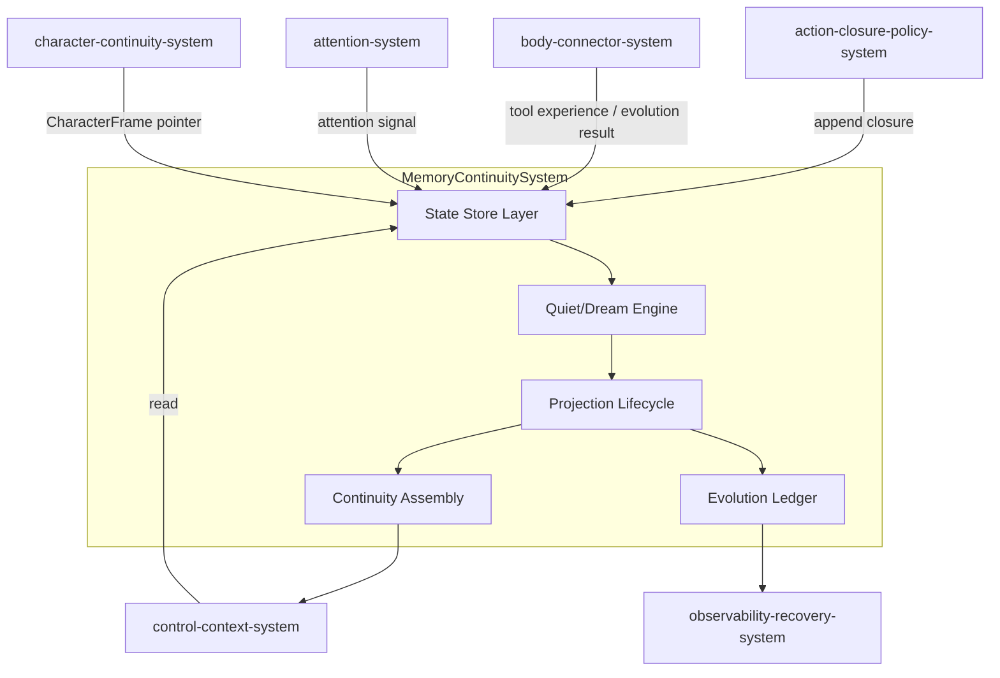
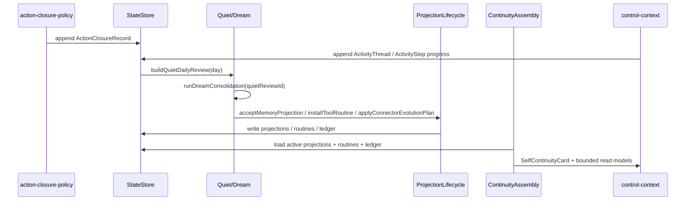
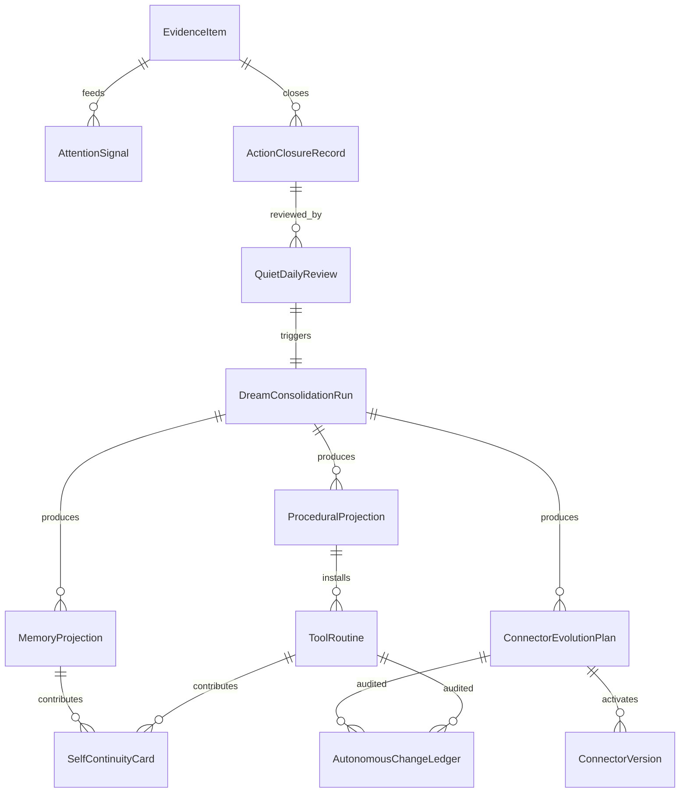

# Memory Continuity System 系统设计文档 (L0 — 导航层)

| 字段          | 值                                                                    |
| ------------- | --------------------------------------------------------------------- |
| **System ID** | `memory-continuity-system`                                            |
| **Project**   | Second Nature v9                                                      |
| **Version**   | 1.0                                                                   |
| **Status**    | Draft                                                                 |
| **Author**    | Nyx / System Designer                                                 |
| **Date**      | 2026-06-21                                                            |
| **L1 Detail** | [`memory-continuity-system.detail.md`](./memory-continuity-system.detail.md) — 完整字段表、算法与契约矩阵 |

> [!IMPORTANT]
> **文档分层说明**
> - **本文件 (L0 导航层)**: 架构图、操作契约、设计决策。面向快速理解与任务规划。
> - **L1 实现层**: 已创建 [`memory-continuity-system.detail.md`](./memory-continuity-system.detail.md)，收纳完整字段表、算法与契约矩阵；L0 保留导航层摘要。

---

## 目录 (Table of Contents)

|   §   | 章节                                                         | 关键内容                                                 |
| :---: | ------------------------------------------------------------ | -------------------------------------------------------- |
|   1   | [概览](#1-概览-overview)                                     | 系统目的、边界、职责                                     |
|   2   | [目标与非目标](#2-目标与非目标-goals--non-goals)             | Goals / Non-Goals                                        |
|   3   | [背景与上下文](#3-背景与上下文-background--context)          | 为什么需要这个系统、约束                                 |
|   4   | [系统架构](#4-系统架构-architecture)                         | Mermaid 架构图、组件职责、数据流                         |
|   5   | [接口设计](#5-接口设计-interface-design)                     | 操作契约表、跨系统协议                                   |
|   6   | [数据模型](#6-数据模型-data-model)                           | 实体字段声明、ER 图                                      |
|   7   | [技术选型](#7-技术选型-technology-stack)                     | 核心技术、关键依赖                                       |
|   8   | [Trade-offs](#8-trade-offs--alternatives-权衡与备选方案)     | 决策理由、备选方案对比                                   |
|   9   | [安全性考虑](#9-安全性考虑-security-considerations)          | 风险与缓解                                               |
|  10   | [性能考虑](#10-性能考虑-performance-considerations)          | 性能目标、优化策略                                       |
|  11   | [测试策略](#11-测试策略-testing-strategy)                    | 单测、集成、契约验证矩阵                                 |
|  12   | [部署与运维](#12-部署与运维-deployment--operations) *(可选)* | N/A                                                      |
|  13   | [未来考虑](#13-未来考虑-future-considerations) *(可选)*      | N/A                                                      |
|  14   | [附录](#14-appendix-附录) *(可选)*                           | 术语表、参考资料                                         |

---

## 1. 概览 (Overview)

### 1.1 System Purpose (系统目的)

`memory-continuity-system` 负责把 v8 living loop 的 closure、evidence、ActivityThread 与工具经历压缩为下一轮 Claw Agent 可用的连续性投影：长期记忆、程序化套路、自我连续卡、workspace connector 演化结果与自动变更账本。它让上下文清空后的 Agent 继承身体直觉和持续活动脉络，同时不让 raw history、raw private content 或 raw credential 进入上下文。

### 1.2 System Boundary (系统边界)

- **输入 (Input)**: `ActionClosureRecord`、`AttentionSignal`、`ActivityThread` / `ActivityStep`、`ToolExperience`、connector gate results、relationship/owner feedback、Agent accept/reject/retire 反馈。
- **输出 (Output)**: `MemoryProjection`、`ProceduralProjection`、`ToolRoutine`、`SelfContinuityCard`、`ActivityThread` bounded read models、`ConnectorEvolutionPlan`、bounded read models。`AutonomousChangeLedger` 由 `observability-recovery-system` 拥有，`memory-continuity-system` 作为消费者在 routine install 时调用其 `writeLedgerEntry` port。
- **依赖系统 (Dependencies)**: SQLite/sql.js 存储、`observability-recovery-system`（审计与账本写入）、`body-connector-system`（工具经历与 connector 演化执行）。
- **被依赖系统 (Dependents)**: `control-context-system`（读取 continuity 注入上下文）、`character-continuity-system`（消费投影生成 `CharacterFrame`）、`action-closure-policy-system`（读取 routine 与 closure 历史）。

### 1.3 System Responsibilities (系统职责)

**负责**:
- 持久化 v9 state families（evidence, attention, closure, quiet review, dream run, memory projection, procedural projection, self continuity card, routine metadata, connector evolution ledger）。
- 持久化 `ActivityThread` 与 `ActivityStep`，供 control-context 跨 heartbeat 延续持续活动。
- 运行 Quiet/Dream consolidation，生成 memory、procedural、self continuity 与 connector evolution outputs。
- 管理 projection lifecycle：accept、supersede、retire、reject。
- 维护 stable evidence identity，抑制重复 artifact 增长。
- 组装 bounded `SelfContinuityCard`（默认 ≤1200 UTF-8 chars）。
- 持久化完整 `CharacterFrame` artifact（由 `character-continuity-system` 生成），并向 `control-context-system` 提供 `CharacterFramePointer`。
- 在 routine install 时调用 `observability-recovery-system` 的 `AutonomousChangeLedgerWritePort.writeLedgerEntry`；ledger owner 为 observability-recovery-system。

**不负责**:
- 不替代 Agent 做最终判断（由 `control-context-system` + Agent 负责）。
- 不执行真实 connector 调用（由 `body-connector-system` 负责）。
- 不生成 `CharacterFrame` 的语义内容（由 `character-continuity-system` 负责）；本系统持久化完整 `CharacterFrame` artifact 并提供 pointer。
- 不自动修改 Second Nature core runtime、credential scope 或外部写 policy（由 ADR-004 禁止）。

---

## 2. 目标与非目标 (Goals & Non-Goals)

### 2.1 Goals

- **[G1]** 每次上下文加载必须返回 `SelfContinuityCard` 或显式 `continuity_unavailable` reason（[REQ-001]，Architecture §2 System 5）。
- **[G2]** 相同 external identity / content hash 的 evidence 重复暴露不得新增等价 artifact（[REQ-002]，PRD US-002）。
- **[G3]** 重复成功/失败的工具经历可压缩为带 guards/source refs/rollback ref 的 `ToolRoutine`（[REQ-004]，ADR-005）。
- **[G4]** Workspace connector 演化结果必须通过 schema/permission/sandbox/fixture/wet-probe/canary/rollback gate 后才持久化为 activated version（[REQ-005]，[REQ-007]，ADR-004）。
- **[G5]** 所有自动 routine 安装与 connector 演化写入 `AutonomousChangeLedger`，payload 脱敏（[REQ-007]，PRD US-007）。
- **[G6]** v9 写入不得包含 raw credential、raw private content 或 raw prompt（PRD §6.2，NG4）。
- **[G7]** `ActivityThread` 必须 source-backed、bounded、可 pause/complete/abandon/block，并可被 Quiet/Dream 汇总为后续 memory/procedural/character 输入。

### 2.2 Non-Goals

- **[NG1]** 不新增预设人格属性表或人格分数（[REQ-008] 由 `character-continuity-system` 负责）。
- **[NG2]** 不把 routine 作为绕过 `ActionPolicyDecision` 的后门（PRD NG3）。
- **[NG3]** 不在本系统内做 LLM 模型训练或向量检索索引的自主演进。
- **[NG4]** 不独立部署为网络服务；本系统是 plugin/CLI runtime 的本地库。

---

## 3. 背景与上下文 (Background & Context)

### 3.1 Why This System? (为什么需要这个系统？)

v8 能运行 living loop，但 Agent 上下文清空后不会自然继承工具直觉、重复信号抑制、关系姿态或 workspace connector 改进。v9 需要把闭环经历压缩为下一轮可用的短投影，而不是把 raw history 塞进上下文。

**关联 PRD 需求**: [REQ-001], [REQ-002], [REQ-004], [REQ-005], [REQ-007]。

### 3.2 Current State (现状分析)

v8 已具备：
- `evidence_item`、`action_closure_record`、`quiet_daily_review`、`dream_consolidation_run`、`long_term_memory_projection` 等表。
- `sourceRefsJson` / `payloadJson` / `redactionClass` 扩展模式。
- `MemoryProjection` 的 accept/supersede/retire 生命周期。

v9 需要在此基础上新增：stable identity、activity thread、procedural projection、tool routine、self continuity card、connector evolution plan/ledger。

### 3.3 Constraints (约束条件)

- **技术约束**: 必须兼容 v8 state stores 与 v7 life evidence compatibility artifacts；继续使用 SQLite/sql.js + Drizzle（Architecture §2 System 5）。
- **性能约束**: `SelfContinuityCard` assembly 默认不得阻塞 heartbeat 超过 2s（PRD §6.1）。
- **安全约束**: continuity projections 不得写入 raw credential / raw private content / raw prompt（PRD §6.2）。
- **资源约束**: 无新增外部依赖；复用 v8 storage、serialization、redaction 工具。

---

## 4. 系统架构 (Architecture)

### 4.1 Architecture Diagram (架构图)



### 4.2 Core Components (核心组件)

| Component Name          | Responsibility                                                                 | Tech Stack                | Notes                                                          |
| ----------------------- | ------------------------------------------------------------------------------ | ------------------------- | -------------------------------------------------------------- |
| State Store Layer       | 持久化 v9 families；兼容 v8 schema；提供 bounded read ports                     | SQLite/sql.js + Drizzle   | 新增列/表通过迁移完成，不破坏 v8 数据                          |
| Quiet/Dream Engine      | 按日聚合 closure/evidence，运行 Dream consolidation，生成各类 candidate        | TypeScript runners        | 复用 v8 `quiet-daily-review-builder` 与 `dream-consolidation-runner` 边界 |
| Projection Lifecycle    | 管理 memory/procedural/connector projection 的 accept、supersede、retire、reject | TypeScript lifecycle ports | 来源缺失时返回显式 degraded reason                              |
| Continuity Assembly     | 从 active projections、routines、ledger 组装 bounded `SelfContinuityCard`       | TypeScript context builder | 默认 ≤1200 UTF-8 chars；包含 source refs                        |
| Evolution Ledger        | 记录 routine 安装、connector version 激活/回滚等自动变更                        | SQLite append-only ledger | payload 脱敏；返回 rollback command hint                        |

### 4.3 Data Flow (数据流)



**关键数据流说明**:
1. **Closure/Activity → Quiet**: `action-closure-policy-system` 每轮写 exactly-one closure；`control-context-system` 可写 0..1 ActivityStep；每日 rhythm 触发 `buildQuietDailyReview`。
2. **Quiet → Dream**: `runDreamConsolidation` 生成 memory、procedural、self-continuity、connector-evolution candidates。
3. **Dream → Lifecycle**: `ProjectionLifecycle` 根据来源、guard 验证、policy gate 结果决定 accept / reject / install / rollback。
4. **Lifecycle → Continuity Assembly**: 下一轮 heartbeat/Claw session 读取 active projections 与 routines，生成 `SelfContinuityCard`。

---

## 5. 接口设计 (Interface Design)

### 5.1 操作契约表 (Operation Contracts)

| 操作 | [REQ] | 前置条件 | 消耗/输入 | 产出/副作用 | 实现细节 |
| ---- | :---: | -------- | --------- | ------------ | :------: |
| `normalizeEvidenceIdentity(item)` | [REQ-002] | connector payload 已 redaction；platformId 已知 | 一条 EvidenceItem | 返回 stable identity key；重复时更新 `seenCount` / `lastObservedAt`。`memory-continuity-system` 是 canonical owner。 | L1 §3.1 |
| `appendActivityThreadProgress(thread, step)` | [REQ-003] | thread/step sourceRefs 非空；summary 已 redacted | `ActivityThread` + optional `ActivityStep` | upsert thread；append step；link closure when available；返回 bounded read row | L1 §3.1b |
| `buildQuietDailyReview(day)` | [REQ-001] | 当日存在 closure；state DB 可读 | day string | 写入 `QuietDailyReview`；返回 review 或 `quiet_empty_input` | L1 §3.2 |
| `runDreamConsolidation(quietReviewId)` | [REQ-001] [REQ-004] [REQ-005] | Quiet review 已存在且非 placeholder | quietReviewId | 生成 candidates；更新 `DreamConsolidationRun` 状态 | L1 §3.3 |
| `acceptMemoryProjection(candidateId, topicKey, memoryText, sourceRefs)` | [REQ-001] | sourceRefs 非空；无 degraded 读 | candidate metadata | active `MemoryProjection`；同名 topic 旧 projection 被 supersede | L1 §3.3 |
| `installToolRoutine(proceduralProjection, policyGateResult)` | [REQ-004] [REQ-007] | policyGateResult = allowed；不扩大权限 | proceduralProjection | 写入 `ToolRoutine`；调用 `observability-recovery-system.writeLedgerEntry`；返回 rollback ref | L1 §3.5 |
| `applyConnectorEvolutionPlan(plan, bodyConnectorApplyPort)` | [REQ-005] [REQ-007] | plan 由 Dream 生成；body-connector 执行 7 gates 并返回结果 | `ConnectorEvolutionPlan` + `ConnectorEvolutionApplyPort` | body-connector 激活/回滚 `ConnectorVersion`；本系统更新 plan status 与 ledger ref | L1 §3.6 |
| `assembleSelfContinuityCard(scope)` | [REQ-001] | 存在 active projections/routines 或显式无数据 | bounded read filters | 返回 ≤1200 chars 的 card 或 `continuity_unavailable` | L1 §3.7 |
| `loadBoundedReadModel(modelName, filters)` | [REQ-001] [REQ-007] | modelName 属于本系统 read model 白名单 | filters (status, day, limit) | 返回 redacted rows 与 degraded envelope | L1 §3.8 |

### 5.2 跨系统接口协议 (Cross-System Interface)

```typescript
interface MemoryContinuitySystem {
  normalizeEvidenceIdentity(item: EvidenceItem): Promise<StableIdentityResult>;
  buildQuietDailyReview(day: string): Promise<QuietDailyReviewOutput>;
  runDreamConsolidation(quietReviewId: string): Promise<DreamConsolidationOutput>;
  acceptMemoryProjection(
    candidateId: string,
    topicKey: string,
    memoryText: string,
    sourceRefs: SourceRef[],
  ): Promise<ProjectionLifecycleResult>;
  installToolRoutine(
    projection: ProceduralProjection,
    gateResult: PolicyGateResult,
    ledgerWritePort: AutonomousChangeLedgerWritePort,
  ): Promise<RoutineInstallResult>;
  applyConnectorEvolutionPlan(
    plan: ConnectorEvolutionPlan,
    bodyConnector: ConnectorEvolutionApplyPort,
  ): Promise<EvolutionApplyResult>;
  assembleSelfContinuityCard(
    scope: ContinuityScope,
  ): Promise<SelfContinuityCard | DegradedOperationResult>;
  loadBoundedReadModel(
    modelName: ContinuityReadModelName,
    filters: BoundedReadFilters,
  ): Promise<BoundedReadModelResult>;
}

// 暴露给 control-context-system / runtime-ops-system 的只读端口
interface ContinuityReadPort {
  loadSelfContinuityCard(scope: ContinuityScope): Promise<SelfContinuityCard | DegradedOperationResult>;
  loadRoutineList(filters: RoutineFilter): Promise<RoutineListItem[]>;
  loadActiveMemoryProjections(filters: ProjectionFilter): Promise<MemoryProjection[]>;
  loadActiveProceduralProjections(filters: ProjectionFilter): Promise<ProceduralProjection[]>;
  loadActivityThreads(filters: ActivityThreadFilter): Promise<ActivityThread[]>;
}
```

### 5.3 HTTP API 端点摘要

N/A — 本系统是 plugin/CLI runtime 的本地库，不暴露独立 HTTP API。`runtime-ops-system` 通过命令/工具调用转发到本系统接口。

---

## 6. 数据模型 (Data Model)

### 6.1 核心实体 (Core Entities)

下表列出核心实体、关键字段与来源。完整字段声明、索引、算法与契约矩阵详见 [memory-continuity-system.detail.md](./memory-continuity-system.detail.md)。

| 实体 | 关键字段 | 生命周期 / 状态 | 来源 |
| ---- | -------- | --------------- | ---- |
| EvidenceItem | `platformId`, `externalId`, `contentHash`, `stableIdentityKey`, `seenCount`, `firstObservedAt`, `lastObservedAt`, `rowIdentityStatus` | `stable` / `unstable` / `duplicate_row` | v8 + [REQ-002] |
| AttentionSignal | `cycleId`, `evidenceRefsJson`, `novelty` (real), `relevance` (real), `repetition`, `riskFlagsJson`, `possibleActionsJson`, `status` | `attentive` / `attention_blocked_missing_sources` / `degraded` | v9 [REQ-003] |
| ActivityThread | `threadId`, `originAttentionSignalId`, `status`, `currentFocus`, `associationsJson`, `nextPossibleMovesJson`, `completedStepCount`, `stopCondition`, `lastHeartbeatSequence`, `sourceRefsJson` | `active`/`paused`/`completed`/`abandoned`/`blocked` | v9 [REQ-003] |
| ActivityStep | `stepId`, `threadId`, `cycleId`, `stepKind`, `summary`, `closureRefJson`, `sourceRefsJson` | append-only | v9 [REQ-003] |
| ActionClosureRecord | v8 schema + `routineId` nullable | v8 status | v8 + v9 |
| QuietDailyReview / DreamConsolidationRun | v8 schema；Dream payload 新增 `outputFamilies` | v8 status | v8 + v9 |
| MemoryProjection | `candidateId`, `topicKey`, `status`, `sourceRefsJson`, `payloadJson` | `candidate`/`active`/`superseded`/`rejected`/`retired` | v8 [REQ-001] |
| ProceduralProjection | `candidateId`, `capabilityPattern`, `status`, `sourceRefsJson`, `payloadJson` | `candidate`/`validated`/`rejected`/`installed` | v9 [REQ-004] |
| ToolRoutine | `name`, `version` (string; semver), `capabilityPattern`, `status`, `rollbackRef`, `guardRefsJson`, `ledgerRef` | `candidate`/`validated`/`active`/`retired` | v9 [REQ-004] |
| SelfContinuityCard | `id`, `cardText` (≤1200 UTF-8), `sectionsJson`, `characterFramePointerJson`, `sourceRefsJson`, `status` | `active`/`deferred`/`unavailable` | v9 [REQ-001] |
| CharacterFrame | `id`, `version`, `status`, `sectionsJson`, `contestPrompt`, `sourceRefsJson` | `candidate`/`accepted`/`rejected`/`retired`/`superseded` | v9 [REQ-008] |
| ConnectorEvolutionPlan | `platformId`, `planType`, `status`, `gateResultsJson`, `previousStableRef`, `rollbackCommandHint` | `proposed`/`gating`/`activated`/`rolled_back`/`blocked` | v9 [REQ-005] |
| ConnectorVersion | `platformId`, `versionId` (string), `assetPathsJson`, `declaredCapabilitiesJson`, `status`, `previousStableRef`, `rollbackRef`, `rollbackCommandHint`, `activatedAt`, `rolledBackAt` | `candidate`/`staged`/`active`/`rolled_back` | v9 [REQ-005] |
| AutonomousChangeLedger | `changeKind`, `targetId`, `previousStableRef`, `status`, `redactedPayloadJson` | `proposed`/`gated`/`activated`/`rolled_back`/`blocked`；owner: `observability-recovery-system` | v9 [REQ-007] |
| RoutineExecutionTrace | `routineId`, `cycleId`, `status`, `sourceRefsJson`, `proofRefsJson`, `traceRefsJson` | `completed`/`failed`/`denied` | v9 [REQ-004] |
| DailyRhythmState | v8 schema | v8 status | v8 |

### 6.2 实体关系图 (Entity Relationship)



### 6.3 数据流向 (Data Flow Direction)

- **写入方向**: `action-closure-policy-system` / `attention-system` / `body-connector-system` → State Store Layer。
- **压缩方向**: State Store → Quiet/Dream Engine → Projection Lifecycle。
- **消费方向**: `control-context-system` / `character-continuity-system` / `observability-recovery-system` 读取 bounded read models。

---

## 7. 技术选型 (Technology Stack)

### 7.1 Core Technologies (核心技术)

| Domain    | Choice           | Rationale                                                              |
| --------- | ---------------- | ---------------------------------------------------------------------- |
| Language  | TypeScript       | 与 v8 保持一致；OpenClaw plugin 与 CLI 共享类型                         |
| Runtime   | Node.js          | v8/v7 既定 runtime；OpenClaw native plugin 宿主                         |
| Database  | SQLite / sql.js  | v8 既定；本地 workspace 状态，无需独立服务部署                          |
| ORM       | Drizzle ORM      | v8 既定；schema 迁移与类型推导成熟                                      |
| Artifacts | Markdown / JSON  | v8 既定；workspace `.second-nature/` 中的可读/可审计工件                  |

### 7.2 Key Libraries/Dependencies (关键依赖)

- `drizzle-orm`：schema 与查询。
- `src/shared/serialization.ts`：canonical `SourceRef` 序列化/反序列化。
- `src/shared/types/v8-contracts.ts`：`SourceRef`、`DegradedOperationResult`、`V8ReasonCode` 复用。
- `src/storage/v8-state-stores.ts`：v8 read/write ports 复用与扩展。

---

## 8. Trade-offs & Alternatives (权衡与备选方案)

### 8.1 Continuity Projection 由 Dream 产出

> **决策来源**: [ADR-003: Add Continuity Projection After Quiet/Dream](../03_ADR/ADR_003_CONTINUITY_PROJECTION_AFTER_DREAM.md)
>
> 本系统实现 ADR-003：在 v8 Dream 边界内扩展 `SelfContinuityCard`、`ProceduralProjection`、`ConnectorEvolutionPlan` 等输出族，而不是新建独立 Self 系统或向上下文塞 raw history。
>
> **本系统特有实现**: `memory-continuity-system` 负责这些 projection 的持久化、生命周期与 bounded read model；语义生成由 Dream engine / `character-continuity-system` 负责。

### 8.2 Procedural Memory 建模为 Verified Routine

> **决策来源**: [ADR-005: Model Procedural Memory as Verified Routine](../03_ADR/ADR_005_PROCEDURAL_MEMORY_AS_VERIFIED_ROUTINE.md)
>
> 本系统实现 ADR-005：`ToolRoutine` 是带 version、guards、source refs、rollback ref 的 artifact；不是自由文本建议，也不是任意生成代码。
>
> **本系统特有实现**: `ProceduralProjection` 保存 candidate routine definition；`ProjectionLifecycle.installToolRoutine` 在 policy gate 通过后写入 `ToolRoutine` 与 `AutonomousChangeLedger`。

### 8.3 Workspace-Only 自动 Connector 演化

> **决策来源**: [ADR-004: Allow Workspace-Only Autonomous Connector Evolution](../03_ADR/ADR_004_WORKSPACE_ONLY_CONNECTOR_EVOLUTION.md)
>
> 本系统实现 ADR-004：自动修改仅限于 workspace connector manifest/recipe/adapter；`ConnectorEvolutionPlan` 与 `ConnectorVersion` 记录 gate 结果与回滚路径。
>
> **本系统特有实现**: `applyConnectorEvolutionPlan` 接收由 Dream 生成的 `ConnectorEvolutionPlan`（status=`proposed`），委托 `body-connector-system` 执行 7 gates 并激活 `ConnectorVersion`；`body-connector-system` 在激活时生成 `rollbackCommandHint` 并调用 `observability-recovery-system.writeLedgerEntry`；任一 gate failed 时保留 `previousStableRef` 并记录 `connector_canary_rollback` reason。

### 8.4 稳定 Evidence Identity 键设计（本系统特有决策）

**Option A: 仅 contentHash**
- 优点：简单，直接复用 v8 唯一索引。
- 缺点：不同 platform 可能冲突；无法区分同一内容不同 external id。

**Option B: platformId + externalId + contentHash（Selected）**
- 优点：跨平台隔离；connector 提供 stable externalId 时可直接去重；缺失 externalId 时退化为 platformId+contentHash。
- 缺点：需要新增 `stableIdentityKey` 列与索引。

**Decision**: 选择 Option B，满足 [REQ-002] 的 stable identity 与重复抑制目标，同时保留 v8 `platformId+contentHash` 索引作为 fallback。

---

## 9. 安全性考虑 (Security Considerations)

### 9.1 Data Redaction

- 所有 continuity projection 在写入前必须通过 redaction gate，移除 credential-shaped pattern 与 private context marker。
- `SelfContinuityCard.cardText`、`ProceduralProjection.payloadJson`、`ConnectorEvolutionPlan.payloadJson`、`AutonomousChangeLedger.payloadJson` 均不得包含 raw credential value。

### 9.2 Source Refs vs Raw Content

- projection 只存储 `sourceRefs`（指向 evidence/closure/tool experience 的 URI），不内嵌 raw private message。
- `resolveStatus` 标记 `redacted` / `permission_denied` 时，read model 不得反解原始内容。

### 9.3 Security Risks & Mitigations

| Risk | Severity | Mitigation |
| ---- | :------: | ---------- |
| Credential leak into continuity card | 高 | Redaction gate + 写入前 UTF-8 长度与敏感词扫描 |
| Routine 扩大权限 | 高 | `installToolRoutine` 必须消费 `action-closure-policy-system` 的 policy gate result；guard schema 禁止新 capability |
| Connector evolution 改 core runtime | 高 | ADR-004 禁止；`assetPath` 必须位于 workspace `.second-nature/connectors/` 下 |
| Ledger 暴露内部状态 | 中 | payloadJson redacted；不含 credential、secret、raw private content |
| v7 artifact 污染新 evidence identity | 中 | v7 compatibility read-only；新写入使用 v9 stable identity 逻辑 |

---

## 10. 性能考虑 (Performance Considerations)

### 10.1 Performance Goals

- `SelfContinuityCard` assembly 默认阻塞 heartbeat 不超过 2s（PRD §6.1）。
- 重复 evidence 查询（stable identity）p95 < 50ms。
- 每日 1,000 条 evidence 写入时，重复 feed 不造成线性 artifact 增长（PRD §7）。

### 10.2 Optimization Strategies

1. **索引**: `stableIdentityKey` 唯一索引；`MemoryProjection(topicKey, status)`；`ToolRoutine(capabilityPattern, status)`；`AutonomousChangeLedger(changeType, createdAt)`。
2. **Bounded read models**: `assembleSelfContinuityCard` 只读取 active projections 与最近 N 条 routines/ledger；不扫描全表。
3. **Lazy Dream**: connector evolution 不在 heartbeat critical path同步执行；由 daily rhythm 或异步 trigger 触发。
4. **Payload 大小限制**: `cardText` 与 projection payload 在写入层强制上限，避免大 JSON 拖慢读取。

### 10.3 Performance Monitoring

- `observability-recovery-system` 记录 `memory_continuity_assembly_duration_ms` 与 `stable_identity_lookup_duration_ms`。
- `loop_status` 暴露 `continuity_unavailable` / `card_assembly_timeout` 等 blocked reason。

---

## 11. 测试策略 (Testing Strategy)

### 11.1 Unit Testing

- **目标**: 覆盖每个操作契约的正常路径与失败路径。
- **框架**: `node --test` + TypeScript build output（与 v8 保持一致）。
- **关键测试领域**:
  - stable identity dedup：same externalId/contentHash 更新 `seenCount` 而非新增行。
  - `acceptMemoryProjection` 自动 supersede 同名 topic active projection。
  - `installToolRoutine` 拒绝扩大权限的 guard schema。
  - `assembleSelfContinuityCard` 默认 ≤1200 UTF-8 chars；无数据时返回 `continuity_unavailable`。
  - `applyConnectorEvolutionPlan` canary 失败自动回滚并写 ledger。

### 11.2 Integration Testing

- **目标**: 验证跨系统数据流与 v8 兼容性。
- **场景**:
  - Closure → Quiet → Dream → MemoryProjection 全链路。
  - ToolExperience → ProceduralProjection → ToolRoutine → ActionClosure 引用。
  - Connector scaffold → EvolutionPlan → gate pass/rollback → ledger。
  - v8 evidence table 升级后，旧数据可读，新写入使用 stable identity。

### 11.3 End-to-End Testing

- 通过 OpenClaw plugin / CLI ops surface 验证 `SelfContinuityCard` 可被 Claw-facing `control-context-system` 读取。
- Guide-only：真实宿主环境下的 connector evolution canary 回滚手册由 `body-connector-system` E2E 补充。

### 11.4 Contract Verification Matrix

完整矩阵（含 `rejectMemoryProjection` / `retireMemoryProjection`、`AutonomousChangeLedger` redaction 等）见 [memory-continuity-system.detail.md §6](./memory-continuity-system.detail.md)。

| 契约 | 风险级别 | 正常态验证 | 失败态验证 | 回归责任 |
|------|---------|-----------|-----------|---------|
| `normalizeEvidenceIdentity` 重复抑制 | 高 | same feed 3 次 → 1 row + seenCount=3 | 无 externalId + unstable hash → `identity_unstable` | evidence ingestion |
| `installToolRoutine` 权限边界 | 高 | allowed gate → installed + ledger | guard 扩大 capability → `routine_permission_expansion_denied` | routine safety |
| `applyConnectorEvolutionPlan` rollback | 高 | all gates pass → activated version | canary fail → previous stable restored + ledger | connector evolution |
| `assembleSelfContinuityCard` boundedness | 中 | 正常数据 → cardText ≤1200 | 无 active data → `continuity_unavailable` | continuity injection |

---

## 12. 部署与运维 (Deployment & Operations)

N/A — `memory-continuity-system` 是 plugin/CLI runtime 的本地 TypeScript 库，随 `pnpm build` / `pnpm build:plugin` 打包。无独立部署流程、无独立服务进程。运维观测通过 `observability-recovery-system` 的 `loop_status`、digest 与 ledger 完成。

---

## 13. 未来考虑 (Future Considerations)

N/A — v9 范围内所有 continuity、routine、connector evolution 与 ledger 需求已在本 L0 覆盖。`CharacterFrame` 的语义生成、contest/re-authoring 流程与 prompt 措辞由 `character-continuity-system` 设计；本系统只负责持久化与引用指针，不在本系统追加未来项。

---

## 14. Appendix (附录)

### 14.1 Glossary (术语表)

- **Continuity Projection**: Quiet/Dream 从闭环经历中生成并注入下一轮 EmbodiedContext 的短投影集合。
- **SelfContinuityCard**: 面向 Claw Agent 的短上下文卡，默认 ≤1200 UTF-8 chars。
- **ProceduralProjection**: 从 ToolExperience 与 ActionClosureRecord 压缩出的肌肉记忆投影。
- **ToolRoutine**: 经验证、版本化、可回滚的一键套用流程。
- **ConnectorEvolutionPlan**: workspace connector 的自动改进计划，通过机械门禁后激活。
- **AutonomousChangeLedger**: 记录自动 routine 安装、connector 演化、门禁结果与回滚的审计账本；owner 为 `observability-recovery-system`。`memory-continuity-system` 在 routine install 时调用其 `writeLedgerEntry` port。
- **Stable Identity Key**: 用于 evidence 去重的派生键，格式 `platformId:externalId:contentHash`（externalId 缺失时退化为 `platformId:contentHash`）。`memory-continuity-system` 是 canonical owner。

### 14.2 Optional Skills & Reference Resources

- `system-designer` skill：提供 L0/L1 拆分规则、6D 框架与模板约束。
- `sequential-thinking` skill：用于 trade-off 与稳定 identity 方案比较。
- 无外部 Web 资源；设计完全基于项目内 PRD、ADR、Architecture Overview、concept model 与 v8 代码审计。

### 14.3 References (参考资料)

- `.anws/v9/01_PRD.md` [REQ-001], [REQ-002], [REQ-004], [REQ-005], [REQ-007]
- `.anws/v9/02_ARCHITECTURE_OVERVIEW.md` §2 System 5, §3 系统依赖图
- `.anws/v9/03_ADR/ADR_003_CONTINUITY_PROJECTION_AFTER_DREAM.md`
- `.anws/v9/03_ADR/ADR_005_PROCEDURAL_MEMORY_AS_VERIFIED_ROUTINE.md`
- `.anws/v9/03_ADR/ADR_004_WORKSPACE_ONLY_CONNECTOR_EVOLUTION.md`
- `.anws/v9/concept_model.json`
- `src/storage/db/schema/v8-entities.ts`
- `src/shared/types/v8-contracts.ts`
- `_research/memory-continuity-system-research.md`

### 14.4 Change Log (变更日志)

| Version | Date       | Changes                          | Author            |
| ------- | ---------- | -------------------------------- | ----------------- |
| 1.0     | 2026-06-21 | 初始 L0 版本                     | Nyx / System Designer |

---

<!-- L0 撰写自检：
- 必需章节 1-11 齐全；可选章节 12-14 写 N/A + 理由。
- §5.1 操作契约表每行含 [REQ]、前置条件、输入、产出。
- §6 使用字段表而非代码块，避免触发 R1/R2。
- §8 仅引用 ADR-003/004/005，未复制正文。
- 无 TODO/TBD，所有未知项已显式写入 § 最终消息 OPEN 项。
-->
