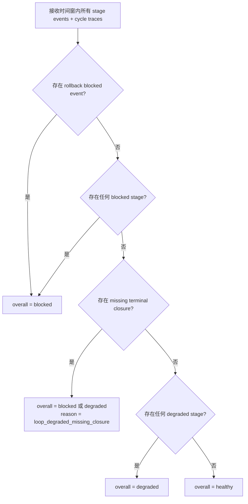
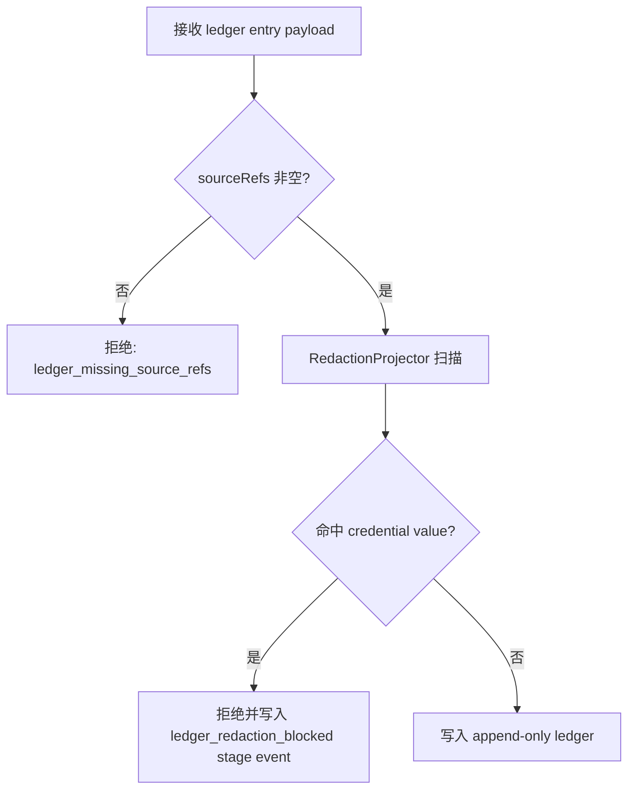

# observability-recovery-system L1 实现层

**对应 L0**: [observability-recovery-system.md](./observability-recovery-system.md)

> 本文件仅在 `/forge` 任务明确引用时加载。L1 中的每一节均已在 L0 中有对应入口。

---

## §1 配置常量 (Configuration Constants)

### §1.1 Stage Kind 枚举

```typescript
const LOOP_STAGE_KINDS = [
  'evidence',
  'perception',
  'attention',
  'activity',
  'proposal',
  'policy',
  'dispatch',
  'closure',
  'quiet',
  'dream',
  'continuity',
  'connector_evolution',
  'rollback',
] as const;
```

*来源锚点*: [L0 §6.1 `LoopStageEvent.stageKind`](./observability-recovery-system.md#61-核心实体-core-entities)

### §1.2 Stage Event Status 枚举

```typescript
const STAGE_STATUSES = ['ok', 'degraded', 'blocked', 'skipped', 'empty'] as const;
```

*来源锚点*: [L0 §6.1 `LoopStageEvent.status`](./observability-recovery-system.md#61-核心实体-core-entities)

### §1.3 Health Overall 枚举

```typescript
const HEALTH_OVERALLS = ['healthy', 'degraded', 'blocked'] as const;
```

*来源锚点*: [L0 §6.1 `LoopHealth.overall`](./observability-recovery-system.md#61-核心实体-core-entities)

### §1.4 Autonomous Change Kind 枚举

```typescript
const AUTONOMOUS_CHANGE_KINDS = [
  'routine_install',
  'routine_supersede',
  'routine_retire',
  'connector_manifest_delta',
  'connector_recipe_delta',
  'connector_adapter_delta',
] as const;
```

*来源锚点*: [L0 §6.1 `AutonomousChangeLedgerEntry.changeKind`](./observability-recovery-system.md#61-核心实体-core-entities)

### §1.5 Ledger Status 枚举

```typescript
const LEDGER_STATUSES = ['proposed', 'gated', 'activated', 'rolled_back', 'blocked'] as const;
```

*来源锚点*: [L0 §6.1 `AutonomousChangeLedgerEntry.status`](./observability-recovery-system.md#61-核心实体-core-entities)

### §1.5a Character Frame Event Kind 白名单

```typescript
const CHARACTER_FRAME_EVENT_KINDS = [
  'refresh',
  'accepted',
  'rejected',
  'revised',
  'retired',
  'superseded',
  'deferred',
  'conflict',
] as const;
```

*来源锚点*: [L0 §6.1 `TimelineRow.family`](./observability-recovery-system.md#61-核心实体-core-entities)

### §1.6 关键 Reason Code 常量

```typescript
const REASON_CODES = {
  LOOP_HEALTHY: 'loop_healthy',
  LOOP_DEGRADED_MISSING_CLOSURE: 'loop_degraded_missing_closure',
  LOOP_BLOCKED_ROLLBACK_FAILED: 'loop_blocked_rollback_failed',
  LOOP_BLOCKED_GATE_FAILURE: 'loop_blocked_gate_failure',
  ACTIVITY_STALE: 'activity_thread_stale',
  ACTIVITY_OVERLONG: 'activity_thread_overlong',
  ACTIVITY_MISSING_CLOSURE: 'activity_thread_missing_closure',
  ACTIVITY_BLOCKED: 'activity_thread_blocked',
  CONTINUITY_UNAVAILABLE: 'continuity_unavailable',
  CONTINUITY_STALE_PROJECTIONS: 'continuity_stale_projections',
  ROUTINE_VALIDATION_PENDING: 'routine_validation_pending',
  ROUTINE_PERMISSION_EXPANSION_DENIED: 'routine_permission_expansion_denied',
  EVOLUTION_GATE_SCHEMA_FAILED: 'evolution_gate_schema_failed',
  EVOLUTION_GATE_PERMISSION_FAILED: 'evolution_gate_permission_failed',
  EVOLUTION_GATE_SANDBOX_FAILED: 'evolution_gate_sandbox_failed',
  EVOLUTION_GATE_FIXTURE_FAILED: 'evolution_gate_fixture_failed',
  EVOLUTION_GATE_WET_PROBE_FAILED: 'evolution_gate_wet_probe_failed',
  EVOLUTION_CANARY_FAILED: 'evolution_canary_failed',
  EVOLUTION_ROLLBACK_FAILED: 'evolution_rollback_failed',
  LEDGER_REDACTION_BLOCKED: 'ledger_redaction_blocked',
  TIMELINE_WINDOW_TOO_LARGE: 'timeline_window_too_large',
} as const;
```

*来源锚点*: [L0 §9.3 Security Risks](./observability-recovery-system.md#93-security-risks--mitigations-安全风险与缓解)、[L0 §11.2 Integration Testing](./observability-recovery-system.md#112-integration-testing-集成测试)

### §1.7 Rollback Liveness Watchdog Constants

```typescript
const ROLLBACK_WATCHDOG = {
  MAX_WAIT_MS: 30_000,               // single rollback execution max wait
  MAX_HEARTBEATS_WITHOUT_EVENT: 5,   // infer failure if no rollback event after N heartbeats
  INFERENCE_REASON_CODE: 'rollback_failed',
} as const;
```

*来源锚点*: [DR-05 rollback liveness gap closure](../07_CHALLENGE_REPORT.md#dr-05--connector-evolution-rollback-liveness-缺失high)

### §1.8 性能与分页常量

```typescript
const PERF = {
  LOOP_STATUS_MAX_WINDOW_HOURS: 48,
  DIGEST_DEFAULT_WINDOW_HOURS: 24,
  TIMELINE_DEFAULT_LIMIT: 50,
  TIMELINE_MAX_LIMIT: 100,
  TIMELINE_MAX_WINDOW_DAYS: 7,
  LOOP_STATUS_CACHE_TTL_MS: 0, // 同一 cycle 内复用，不跨 cycle 缓存
  ACTIVITY_THREAD_STALE_HEARTBEATS: 6,
  ACTIVITY_THREAD_MAX_STEPS: 8,
};
```

*来源锚点*: [L0 §10 Performance Goals](./observability-recovery-system.md#10-性能考虑-performance-considerations)

### §1.8 Redaction 敏感键模式

```typescript
const SENSITIVE_KEY_PATTERNS = [
  /password/i,
  /token/i,
  /api[_-]?key/i,
  /secret/i,
  /credential/i,
  /private[_-]?key/i,
  /authorization/i,
];
```

*来源锚点*: [L0 §9.3 credential value 泄露风险](./observability-recovery-system.md#93-security-risks--mitigations-安全风险与缓解)

---

## §2 数据结构 (Data Structures)

### §2.1 数据库存储表声明

```typescript
interface LoopStageEventRow {
  id: string;
  cycleId: string;
  cycleSequence: number;
  stageKind: string;
  status: string;
  reasonCode: string;
  sourceRefsJson: string;
  proofRefsJson: string;
  traceRefsJson: string;
  payloadJson: string;
  observedAt: string;
  redacted: number; // SQLite boolean
}

interface HeartbeatCycleTraceRow {
  id: string;
  cycleSequence: number;
  startedAt: string;
  closedAt: string | null;
  closureRecordId: string | null;
  stageEventIdsJson: string;
  degradedReasonsJson: string;
  blockedReasonsJson: string;
}

interface ActivityThreadHealthRow {
  threadId: string;
  threadStatus: 'active' | 'paused' | 'completed' | 'abandoned' | 'blocked';
  status: 'healthy' | 'degraded' | 'blocked';
  reasonCode: string | null;
  completedStepCount: number;
  lastHeartbeatSequence: number;
  closureLinked: boolean;
  sourceRefsJson: string;
  observedAt: string;
}

interface AutonomousChangeLedgerRow {
  // Must match shared-v9-contracts.md §8 AutonomousChangeLedgerEntry exactly.
  // Implementation MUST import the canonical type and not redefine fields.
  id: string;
  changeKind: string;
  targetId: string;
  previousStableRef: string | null;
  gateResultsJson?: string;
  rollbackRef?: string;
  rollbackCommandHint?: string;
  sourceRefsJson: string;
  redactedPayloadJson?: string;
  status: string;
  createdAt: string;
  activatedAt?: string;
  rolledBackAt?: string;
}

interface DigestRow {
  id: string;
  windowStart: string;
  windowEnd: string;
  sectionsJson: string;
  sourceRefCount: number;
  generatedAt: string;
}

interface ToolRoutineRegistrySnapshot {
  workspaceRoot: string;
  routines: {
    routineId: string;
    capabilityPattern: string;
    version: string; // semver
    status: 'candidate' | 'validated' | 'active' | 'retired';
    rollbackRef?: string;
    healthReason?: 'routine_permission_expansion_denied' | 'routine_guard_validation_failed' | 'routine_install_pending';
    sourceRefs: SourceRef[];
  }[];
}

interface ConnectorEvolutionResult {
  planId: string;
  platformId: string;
  gates: { name: string; result: 'pass' | 'fail' | 'skipped' }[];
  canaryResult?: 'pass' | 'fail';
  rollbackAttempted?: boolean;
  rollbackSucceeded?: boolean;
  activeVersionRef?: string;
  previousStableRef?: string;
}
```

*来源锚点*: [L0 §6 Data Model](./observability-recovery-system.md#6-数据模型-data-model)

### §2.2 查询请求类型

```typescript
interface LoopStatusQuery {
  workspaceRoot: string;
  windowHours?: number;
  cycleSequence?: number;
}

interface ContinuityStatusQuery {
  workspaceRoot: string;
  cardResult: SelfContinuityCardAssemblyResult;
}

interface RoutineStatusQuery {
  workspaceRoot: string;
  registrySnapshot: ToolRoutineRegistrySnapshot;
}

interface ConnectorEvolutionStatusQuery {
  workspaceRoot: string;
  planResult: ConnectorEvolutionResult;
}

interface DigestRequest {
  workspaceRoot: string;
  windowStart?: string;
  windowEnd?: string;
}

interface TimelineQueryRequest {
  workspaceRoot: string;
  windowStart?: string;
  windowEnd?: string;
  family?: 'stage_event' | 'ledger' | 'digest' | 'character_frame_event';
  kind?: string;
  sourceRef?: string;
  limit?: number;
  cursor?: string;
}
```

*来源锚点*: [L0 §5.1 Operation Contracts](./observability-recovery-system.md#51-操作契约表-operation-contracts)

### §2.3 Projection / Frame 观测事件类型

```typescript
interface ProjectionLifecycleEvent {
  projectionKind: 'memory' | 'procedural' | 'self_continuity' | 'connector_evolution';
  projectionId: string;
  lifecycleStatus: 'active' | 'accepted' | 'rejected' | 'superseded' | 'retired';
  sourceRefs: SourceRef[];
  observedAt: string;
}

interface CharacterFrameObservabilityEvent {
  frameId: string;
  projectionState: 'candidate' | 'accepted' | 'rejected' | 'retired' | 'superseded';
  sourceRefCount: number;
  contestStatus: 'none' | 'accepted' | 'rejected' | 'revised';
  observedAt: string;
}
```

*来源锚点*: [L0 §1.2 Boundary (character-continuity-system input)](./observability-recovery-system.md#12-system-boundary-系统边界)、[L0 §8.2 ADR-006 实现](./observability-recovery-system.md#82-character-continuity-as-emergent-projection)

---

## §3 算法 (Algorithms)

### §3.1 记录 Loop Stage Event

```typescript
async function recordLoopStageEvent(
  deps: { auditStore: AuditStore; redaction: RedactionProjector },
  event: LoopStageEvent
): Promise<RecordResult> {
  if (!event.cycleSequence || event.cycleSequence <= 0) {
    return {
      ok: false,
      degraded: true,
      reasonCode: REASON_CODES.LOOP_DEGRADED_MISSING_CLOSURE,
    };
  }

  const redactedPayload = deps.redaction.redactPayloadJson(event.payloadJson);
  if (redactedPayload.containsCredentialValue) {
    return {
      ok: false,
      degraded: true,
      reasonCode: REASON_CODES.LEDGER_REDACTION_BLOCKED,
    };
  }

  const row: LoopStageEventRow = {
    id: event.id,
    cycleId: event.cycleId,
    cycleSequence: event.cycleSequence,
    stageKind: event.stageKind,
    status: event.status,
    reasonCode: event.reasonCode,
    sourceRefsJson: serializeSourceRefs(event.sourceRefs),
    proofRefsJson: serializeSourceRefs(event.proofRefs),
    traceRefsJson: serializeSourceRefs(event.traceRefs),
    payloadJson: redactedPayload.json,
    observedAt: event.observedAt,
    redacted: redactedPayload.wasRedacted ? 1 : 0,
  };

  await deps.auditStore.insertLoopStageEvent(row);

  return { ok: true, id: row.id };
}
```

*来源锚点*: [L0 §5.1 `recordLoopStageEvent`](./observability-recovery-system.md#51-操作契约表-operation-contracts)

### §3.2 记录 Autonomous Change Ledger

```typescript
async function recordAutonomousChangeLedger(
  deps: { auditStore: AuditStore; redaction: RedactionProjector },
  entry: AutonomousChangeLedgerEntry
): Promise<RecordResult> {
  if (entry.sourceRefs.length === 0) {
    return {
      ok: false,
      degraded: true,
      reasonCode: 'ledger_missing_source_refs',
    };
  }

  const redacted = deps.redaction.redactPayloadJson(entry.redactedPayloadJson);
  if (redacted.containsCredentialValue) {
    await deps.auditStore.insertLoopStageEvent({
      id: generateId(),
      cycleSequence: 0,
      stageKind: 'connector_evolution',
      status: 'blocked',
      reasonCode: REASON_CODES.LEDGER_REDACTION_BLOCKED,
      sourceRefsJson: serializeSourceRefs(entry.sourceRefs),
      proofRefsJson: '[]',
      traceRefsJson: '[]',
      payloadJson: JSON.stringify({ changeKind: entry.changeKind, targetId: entry.targetId }),
      observedAt: entry.createdAt,
      redacted: 1,
    });

    return {
      ok: false,
      degraded: true,
      reasonCode: REASON_CODES.LEDGER_REDACTION_BLOCKED,
    };
  }

  const row: AutonomousChangeLedgerRow = {
    id: entry.id,
    changeKind: entry.changeKind,
    targetId: entry.targetId,
    previousStableRef: entry.previousStableRef ?? null,
    gateResultsJson: entry.gateResultsJson,
    rollbackRef: entry.rollbackRef,
    rollbackCommandHint: entry.rollbackCommandHint,
    sourceRefsJson: serializeSourceRefs(entry.sourceRefs),
    redactedPayloadJson: redacted.json,
    status: entry.status,
    createdAt: entry.createdAt,
    activatedAt: entry.activatedAt,
    rolledBackAt: entry.rolledBackAt,
  };

  await deps.auditStore.insertLedgerEntry(row);

  return { ok: true, id: row.id };
}
```

*来源锚点*: [L0 §5.1 `recordAutonomousChangeLedger`](./observability-recovery-system.md#51-操作契约表-operation-contracts)

### §3.3 聚合 Loop Health

```typescript
async function aggregateLoopHealth(
  deps: { auditStore: AuditStore },
  query: LoopStatusQuery
): Promise<LoopHealth> {
  const window = computeWindow(query.windowHours ?? PERF.LOOP_STATUS_MAX_WINDOW_HOURS);
  const events = await deps.auditStore.listLoopStageEvents(window.start, window.end);
  const traces = await deps.auditStore.listHeartbeatCycleTraces(window.start, window.end);
  const activityHealth = await deps.auditStore.listActivityThreadHealth(window.start, window.end);

  const attribution: Record<string, 'healthy' | 'degraded' | 'blocked' | 'empty'> = {};
  for (const kind of LOOP_STAGE_KINDS) {
    attribution[kind] = 'empty';
  }

  const reasons: string[] = [];
  let rollbackBlocked = false;

  for (const event of events) {
    const current = attribution[event.stageKind];
    if (event.status === 'blocked') {
      attribution[event.stageKind] = 'blocked';
      reasons.push(event.reasonCode);
      if (event.stageKind === 'rollback') {
        rollbackBlocked = true;
      }
    } else if (event.status === 'degraded' && current !== 'blocked') {
      attribution[event.stageKind] = 'degraded';
      reasons.push(event.reasonCode);
    } else if (event.status === 'ok' && current === 'empty') {
      attribution[event.stageKind] = 'healthy';
    }
  }

  const missingClosureTraces = traces.filter((t) => !t.closedAt);
  if (missingClosureTraces.length > 0) {
    attribution['closure'] = 'blocked';
    reasons.push(REASON_CODES.LOOP_DEGRADED_MISSING_CLOSURE);
  }

  for (const activity of activityHealth) {
    if (activity.status === 'blocked') {
      attribution['activity'] = 'blocked';
      reasons.push(activity.reasonCode ?? REASON_CODES.ACTIVITY_BLOCKED);
    } else if (activity.status === 'degraded' && attribution['activity'] !== 'blocked') {
      attribution['activity'] = 'degraded';
      reasons.push(activity.reasonCode ?? REASON_CODES.ACTIVITY_STALE);
    } else if (attribution['activity'] === 'empty') {
      attribution['activity'] = 'healthy';
    }
  }

  const activityTerminalCounts = countByThreadStatus(activityHealth);

  let overall: 'healthy' | 'degraded' | 'blocked' = 'healthy';
  if (rollbackBlocked || Object.values(attribution).includes('blocked')) {
    overall = 'blocked';
  } else if (Object.values(attribution).includes('degraded')) {
    overall = 'degraded';
  }

  return {
    windowStart: window.start,
    windowEnd: window.end,
    overall,
    stageAttribution: attribution,
    activityTerminalCounts,
    reasons: [...new Set(reasons)],
    rollbackBlocked,
  };
}

function countByThreadStatus(rows: ActivityThreadHealthRow[]) {
  return rows.reduce(
    (counts, row) => ({ ...counts, [row.threadStatus]: counts[row.threadStatus] + 1 }),
    { active: 0, paused: 0, completed: 0, abandoned: 0, blocked: 0 },
  );
}
```

*来源锚点*: [L0 §5.1 `aggregateLoopHealth`](./observability-recovery-system.md#51-操作契约表-operation-contracts)

### §3.3a 聚合 ActivityThread Health

```typescript
function aggregateActivityThreadHealth(
  snapshot: ActivityThreadSnapshot,
  currentCycleSequence: number
): ActivityThreadHealthRow {
  const stale = currentCycleSequence - snapshot.lastHeartbeatSequence > PERF.ACTIVITY_THREAD_STALE_HEARTBEATS;
  const overlong = snapshot.completedStepCount > PERF.ACTIVITY_THREAD_MAX_STEPS;
  const missingClosure = snapshot.lastStepKind === 'propose_action' && !snapshot.closureLinked;

  if (snapshot.status === 'blocked') {
    return toActivityHealth(snapshot, 'blocked', REASON_CODES.ACTIVITY_BLOCKED);
  }
  if (overlong) {
    return toActivityHealth(snapshot, 'blocked', REASON_CODES.ACTIVITY_OVERLONG);
  }
  if (missingClosure) {
    return toActivityHealth(snapshot, 'blocked', REASON_CODES.ACTIVITY_MISSING_CLOSURE);
  }
  if (stale && snapshot.status === 'active') {
    return toActivityHealth(snapshot, 'degraded', REASON_CODES.ACTIVITY_STALE);
  }
  return toActivityHealth(snapshot, 'healthy', null);
}
```

*来源锚点*: [L0 §5.1 `aggregateActivityThreadHealth`](./observability-recovery-system.md#51-操作契约表-operation-contracts)

### §3.4 聚合 Continuity Health

```typescript
function aggregateContinuityHealth(
  cardResult: SelfContinuityCardAssemblyResult
): ContinuityHealth {
  if (cardResult.kind === 'unavailable') {
    return {
      cardAvailable: false,
      cardSourceRefCount: 0,
      unavailableReason: cardResult.reasonCode,
      projectionFreshness: 'missing',
      memoryProjectionCount: 0,
      proceduralProjectionCount: 0,
    };
  }

  const memoryCount = cardResult.projections.filter((p) => p.kind === 'memory').length;
  const proceduralCount = cardResult.projections.filter((p) => p.kind === 'procedural').length;

  return {
    cardAvailable: true,
    cardSourceRefCount: cardResult.card.sourceRefs.length,
    projectionFreshness: cardResult.isStale ? 'stale' : 'fresh',
    memoryProjectionCount: memoryCount,
    proceduralProjectionCount: proceduralCount,
  };
}
```

*来源锚点*: [L0 §5.1 `aggregateContinuityHealth`](./observability-recovery-system.md#51-操作契约表-operation-contracts)

### §3.5 聚合 Routine Health

```typescript
function aggregateRoutineHealth(
  registrySnapshot: ToolRoutineRegistrySnapshot
): RoutineHealth {
  const installed = registrySnapshot.routines.filter((r) => r.status === 'active');
  const pending = registrySnapshot.routines.filter((r) => r.status === 'validated');
  const denied = registrySnapshot.routines.filter(
    (r) => r.status === 'candidate' && r.healthReason === 'routine_permission_expansion_denied'
  );
  const rollbackReady = registrySnapshot.routines.every(
    (r) => r.status !== 'active' || !!r.rollbackRef
  );

  const reasons: string[] = [];
  if (pending.length > 0) {
    reasons.push(REASON_CODES.ROUTINE_VALIDATION_PENDING);
  }
  if (denied.length > 0) {
    reasons.push(REASON_CODES.ROUTINE_PERMISSION_EXPANSION_DENIED);
  }

  return {
    installedCount: installed.length,
    pendingValidationCount: pending.length,
    deniedCount: denied.length,
    rollbackReady,
    reasons,
  };
}
```

*来源锚点*: [L0 §5.1 `aggregateRoutineHealth`](./observability-recovery-system.md#51-操作契约表-operation-contracts)

### §3.6 聚合 Connector Evolution Health

```typescript
function aggregateConnectorEvolutionHealth(
  planResult: ConnectorEvolutionResult
): ConnectorEvolutionHealth {
  const gateSummary: Record<string, 'pass' | 'fail' | 'skipped'> = {};
  let blockedReason: string | undefined;

  for (const gate of planResult.gates) {
    gateSummary[gate.name] = gate.result;
    if (gate.result === 'fail') {
      blockedReason = `evolution_gate_${gate.name}_failed`;
    }
  }

  let rollbackStatus: 'not_needed' | 'success' | 'failed' = 'not_needed';
  if (planResult.rollbackAttempted) {
    rollbackStatus = planResult.rollbackSucceeded ? 'success' : 'failed';
    if (rollbackStatus === 'failed') {
      blockedReason = REASON_CODES.EVOLUTION_ROLLBACK_FAILED;
    }
  }

  if (planResult.canaryResult === 'fail') {
    blockedReason = REASON_CODES.EVOLUTION_CANARY_FAILED;
  }

  return {
    activeVersionRef: planResult.activeVersionRef,
    previousStableRef: planResult.previousStableRef,
    gateSummary,
    canaryResult: planResult.canaryResult ?? 'not_run',
    rollbackStatus,
    blockedReason,
  };
}
```

*来源锚点*: [L0 §5.1 `aggregateConnectorEvolutionHealth`](./observability-recovery-system.md#51-操作契约表-operation-contracts)

### §3.7 Rollback Liveness Watchdog (`RollbackHealthGate`)

**对应契约**: DR-05 / PRD [REQ-007] rollback recovery
**准入理由**: body-connector 崩溃或 hang 时，observability 必须能推断 rollback 失败并提升 loop health 为 blocked。

```typescript
async function rollbackHealthGate(
  deps: { auditStore: AuditStore },
  plan: ConnectorEvolutionPlan,
): Promise<RollbackHealth> {
  const events = await deps.auditStore.listLoopStageEvents(
    plan.createdAt,
    new Date().toISOString(),
  );

  const rollbackEvents = events.filter(
    (e) => e.stageKind === 'rollback' && e.traceRefsJson?.includes(plan.id),
  );
  const success = rollbackEvents.some((e) => e.status === 'ok' && e.reasonCode === 'rollback_succeeded');
  const failure = rollbackEvents.some((e) => e.status === 'blocked' || e.reasonCode === REASON_CODES.EVOLUTION_ROLLBACK_FAILED);

  if (success) {
    return { status: 'healthy', rollbackBlocked: false };
  }
  if (failure) {
    return { status: 'blocked', rollbackBlocked: true, reason: REASON_CODES.EVOLUTION_ROLLBACK_FAILED };
  }

  // Missing rollback event inference
  const elapsedMs = Date.now() - new Date(plan.createdAt).getTime();
  const heartbeatCount = events.filter((e) => e.stageKind === 'closure').length;
  const rollingBack = plan.status === 'rolling_back' || plan.status === 'gating';

  if (rollingBack && (elapsedMs > ROLLBACK_WATCHDOG.MAX_WAIT_MS || heartbeatCount > ROLLBACK_WATCHDOG.MAX_HEARTBEATS_WITHOUT_EVENT)) {
    // Emit inferred rollback_failed stage event so the next aggregateLoopHealth sees it.
    await deps.auditStore.insertLoopStageEvent({
      id: generateId(),
      cycleId: 'watchdog',
      cycleSequence: 0,
      stageKind: 'rollback',
      status: 'blocked',
      reasonCode: ROLLBACK_WATCHDOG.INFERENCE_REASON_CODE,
      sourceRefsJson: serializeSourceRefs(plan.sourceRefs),
      proofRefsJson: '[]',
      traceRefsJson: JSON.stringify([{ family: 'connector_evolution', id: plan.id }]),
      payloadJson: JSON.stringify({ planId: plan.id, inferred: true }),
      observedAt: new Date().toISOString(),
      redacted: 0,
    });
    return { status: 'blocked', rollbackBlocked: true, reason: ROLLBACK_WATCHDOG.INFERENCE_REASON_CODE, inferred: true };
  }

  return { status: 'degraded', rollbackBlocked: false, reason: 'rollback_pending' };
}
```

*来源锚点*: [DR-05](../07_CHALLENGE_REPORT.md#dr-05--connector-evolution-rollback-liveness-缺失high)

### §3.8 组装 Digest

```typescript
async function assembleDigest(
  deps: {
    auditStore: AuditStore;
    continuityCardResult: SelfContinuityCardAssemblyResult;
    routineRegistrySnapshot: ToolRoutineRegistrySnapshot;
    connectorEvolutionResult: ConnectorEvolutionResult;
  },
  request: DigestRequest
): Promise<Digest> {
  const window = computeDigestWindow(request);
  const events = await deps.auditStore.listLoopStageEvents(window.start, window.end);
  const ledger = await deps.auditStore.listLedgerEntries(window.start, window.end);

  const loopHealth = await aggregateLoopHealth(deps, { workspaceRoot: request.workspaceRoot, windowHours: window.hours });
  const continuityHealth = aggregateContinuityHealth(deps.continuityCardResult);
  const routineHealth = aggregateRoutineHealth(deps.routineRegistrySnapshot);
  const evolutionHealth = aggregateConnectorEvolutionHealth(deps.connectorEvolutionResult);

  const sourceRefCount = countUniqueSourceRefs(events.concat(ledger.map(toStageEventStub)));

  const digest: Digest = {
    id: generateId(),
    windowStart: window.start,
    windowEnd: window.end,
    sections: {
      loop: loopHealth,
      continuity: continuityHealth,
      routine: routineHealth,
      connectorEvolution: evolutionHealth,
    },
    sourceRefCount,
    generatedAt: new Date().toISOString(),
  };

  await deps.auditStore.insertDigest({
    id: digest.id,
    windowStart: digest.windowStart,
    windowEnd: digest.windowEnd,
    sectionsJson: JSON.stringify(digest.sections),
    sourceRefCount: digest.sourceRefCount,
    generatedAt: digest.generatedAt,
  });

  return digest;
}
```

*来源锚点*: [L0 §5.1 `assembleDigest`](./observability-recovery-system.md#51-操作契约表-operation-contracts)

### §3.9 查询 Timeline

```typescript
async function queryTimeline(
  deps: { auditStore: AuditStore },
  request: TimelineQueryRequest
): Promise<TimelinePage> {
  const window = clampTimelineWindow(request);
  const limit = Math.min(request.limit ?? PERF.TIMELINE_DEFAULT_LIMIT, PERF.TIMELINE_MAX_LIMIT);

  const rows = await deps.auditStore.queryTimeline({
    start: window.start,
    end: window.end,
    family: request.family,
    kind: request.kind,
    sourceRef: request.sourceRef,
    limit: limit + 1,
    cursor: request.cursor,
  });

  const hasMore = rows.length > limit;
  const pageRows = hasMore ? rows.slice(0, limit) : rows;
  const nextCursor = hasMore ? pageRows[pageRows.length - 1].id : undefined;

  return {
    rows: pageRows.map((r) => ({
      id: r.id,
      occurredAt: r.occurredAt,
      family: r.family,
      kind: r.kind,
      sourceRefs: parseSourceRefs(r.sourceRefsJson),
      redactedPayloadJson: r.redactedPayloadJson,
      reasonCode: r.reasonCode,
    })),
    nextCursor,
  };
}
```

*来源锚点*: [L0 §5.1 `queryTimeline`](./observability-recovery-system.md#51-操作契约表-operation-contracts)

---

## §4 决策树 (Decision Tree)

### §4.1 Loop Health 分类决策



*来源锚点*: [L0 §3.3 恢复约束](./observability-recovery-system.md#33-constraints-约束条件)、[L0 §9.3 自动演化失败风险](./observability-recovery-system.md#93-security-risks--mitigations-安全风险与缓解)

### §4.2 Ledger Redaction 决策



*来源锚点*: [L0 §9.3 credential value 泄露风险](./observability-recovery-system.md#93-security-risks--mitigations-安全风险与缓解)

### §4.3 Connector Evolution Health 决策

```mermaid
graph TD
    A[接收 ConnectorEvolutionResult] --> B{任一 gate fail?}
    B -->|是| C[blockedReason = evolution_gate_{name}_failed]
    B -->|否| D{canary fail?}
    D -->|是| E[blockedReason = evolution_canary_failed]
    D -->|否| F{rollback attempted?}
    F -->|否| G[rollbackStatus = not_needed]
    F -->|是| H{rollback succeeded?}
    H -->|是| I[rollbackStatus = success]
    H -->|否| J[rollbackStatus = failed<br/>blockedReason = evolution_rollback_failed]
```

*来源锚点*: [L0 §5.1 aggregateConnectorEvolutionHealth](./observability-recovery-system.md#51-操作契约表-operation-contracts)

---

## §5 边缘情况 (Edge Cases)

### §5.1 空时间窗无事件

- `aggregateLoopHealth` 返回 `overall = healthy`，`stageAttribution` 全部为 `empty`，`reasons = []`。
- `assembleDigest` 返回 sections 全为 empty/healthy 状态，`sourceRefCount = 0`。

### §5.2 缺失 cycleSequence

- `recordLoopStageEvent` 拒绝写入，返回 `degraded` 与 `loop_degraded_missing_closure`；确保无法通过缺失序列号掩盖问题。

### §5.3 Ledger Payload 含 Credential Value

- `RedactionProjector` 检测到 credential 模式时，写入操作被拒绝；同时写一条 `blocked` stage event 以保留审计痕迹；不会静默删除敏感字段后写入。

### §5.4 Rollback 与 Health 竞态

- rollback 结果到达时，`RollbackHealthGate` 直接覆盖 `loop_status.overall` 为 `blocked`，不等待其他健康维度投票；避免 rollback 失败被其他 ok 信号稀释。

### §5.5 所有 Gate Skipped

- `gateSummary` 中所有 gate 标记为 `skipped`；`canaryResult` 为 `not_run`；`connector_evolution_status` 为 `degraded` 并附带 `evolution_gate_not_exercised` reason，而不是 `healthy`。

### §5.6 CharacterFrame 事件来源不足

- `recordCharacterFrameEvent` 接受 `sourceRefCount = 0` 的 `deferred` 状态；timeline/digest 输出为 `character_frame_deferred`，不生成空泛人格文本。

### §5.7 Timeline 超大时间窗

- `queryTimeline` 将超过 `TIMELINE_MAX_WINDOW_DAYS` 的窗口截断为最大允许值；返回 `timeline_window_truncated` 提示，不抛出异常。

---

*L1 文件结束。*
