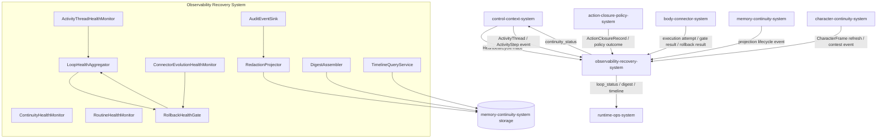
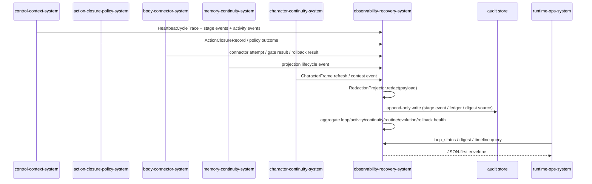
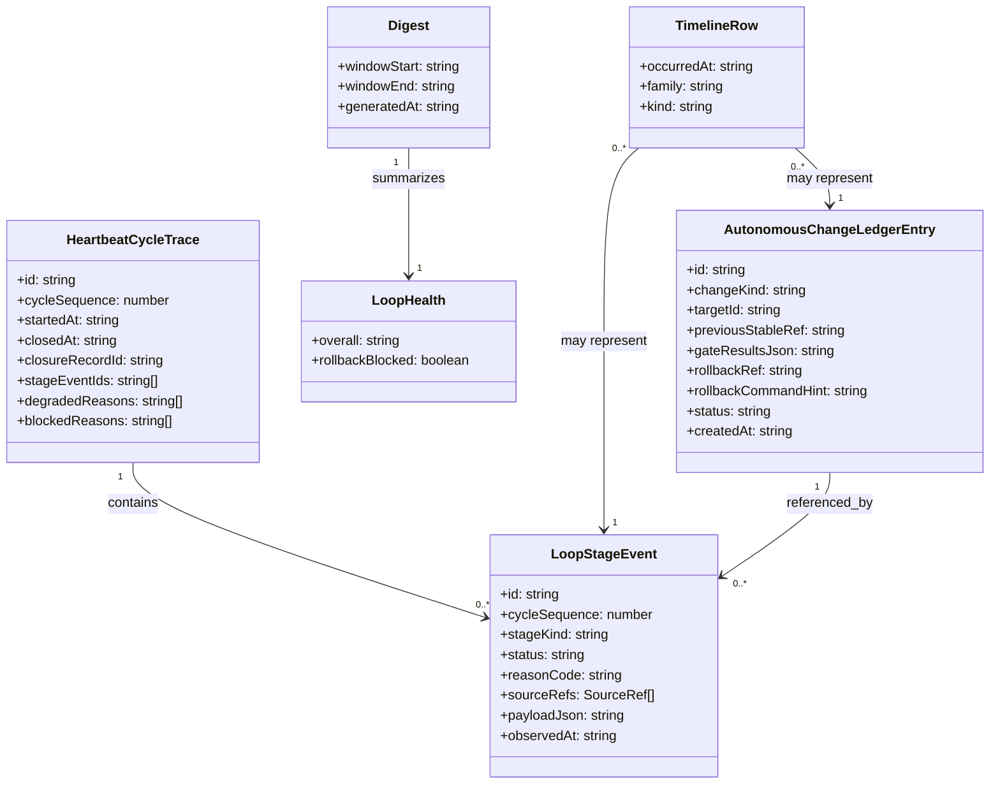

# observability-recovery-system 系统设计文档 (L0 — 导航层)

| 字段          | 值                                                                                   |
| ------------- | ------------------------------------------------------------------------------------ |
| **System ID** | `observability-recovery-system`                                                      |
| **Project**   | Second Nature v9                                                                     |
| **Version**   | 1.0                                                                                  |
| **Status**    | Draft                                                                                |
| **Author**    | Nyx / OpenCode                                                                       |
| **Date**      | 2026-06-21                                                                           |
| **L1 Detail** | [observability-recovery-system.detail.md](./observability-recovery-system.detail.md) |

> [!IMPORTANT]
> **文档分层说明**
> - **本文件 (L0 导航层)**: 架构图、操作契约、设计决策。面向快速理解与任务规划。禁止放配置字典、算法伪代码和方法体。
> - **[observability-recovery-system.detail.md](./observability-recovery-system.detail.md) (L1 实现层)**: 完整伪代码、配置常量、边缘情况。仅 `/forge` 任务明确引用时加载。
> - **L1 锚点原则**: L1 中的每一节都必须在本文件有对应超链接入口。严禁 L1 出现 L0 完全未提及的"孤岛内容"。

---

## 目录 (Table of Contents)

|   §   | 章节                                                         | 关键内容                                            |
| :---: | ------------------------------------------------------------ | --------------------------------------------------- |
|   1   | [概览](#1-概览-overview)                                     | 系统目的、边界、职责                                |
|   2   | [目标与非目标](#2-目标与非目标-goals--non-goals)             | Goals / Non-Goals                                   |
|   3   | [背景与上下文](#3-背景与上下文-background--context)          | 为什么需要这个系统、约束                            |
|   4   | [系统架构](#4-系统架构-architecture)                         | Mermaid 架构图、组件职责、数据流                    |
|   5   | [接口设计](#5-接口设计-interface-design)                     | 操作契约表、跨系统协议                              |
|   6   | [数据模型](#6-数据模型-data-model)                           | 实体字段声明、ER 图                                 |
|   7   | [技术选型](#7-技术选型-technology-stack)                     | 核心技术、关键依赖                                  |
|   8   | [Trade-offs](#8-trade-offs--alternatives-权衡与备选方案)     | 决策理由、备选方案对比                              |
|   9   | [安全性考虑](#9-安全性考虑-security-considerations)          | 认证授权、风险与缓解                                |
|  10   | [性能考虑](#10-性能考虑-performance-considerations)          | 性能目标、优化策略                                  |
|  11   | [测试策略](#11-测试策略-testing-strategy)                    | 单测、集成、性能测试                                |
|  12   | [部署与运维](#12-部署与运维-deployment--operations) *(可选)* | N/A + 理由                                          |
|  13   | [未来考虑](#13-未来考虑-future-considerations) *(可选)*      | N/A + 理由                                          |
|  14   | [附录](#14-appendix-附录) *(可选)*                           | N/A + 理由                                          |

**L1 实现层** → [observability-recovery-system.detail.md](./observability-recovery-system.detail.md)
> [§1 配置常量](./observability-recovery-system.detail.md) · [§2 数据结构](./observability-recovery-system.detail.md) · [§3 算法](./observability-recovery-system.detail.md) · [§4 决策树](./observability-recovery-system.detail.md) · [§5 边缘情况](./observability-recovery-system.detail.md)

---

## 1. 概览 (Overview)

### 1.1 System Purpose (系统目的)

`observability-recovery-system` 为 Second Nature v9 提供**可恢复的可观测层**。它在整个 living loop 之外建立一个独立、source-backed、redacted 的恢复视角：聚合 loop health、activity thread health、continuity health、routine health、connector evolution gate health 与 rollback health；记录 redacted audit、stage events、autonomous change ledger、digest 与 timeline；并确保自动演化失败或持续活动卡死不会伪装成 healthy。

### 1.2 System Boundary (系统边界)

- **输入 (Input)**:
  - `control-context-system` 产生的 `HeartbeatCycleTrace` 与阶段事件；
  - `control-context-system` / `memory-continuity-system` 产生的 `ActivityThread` 与 `ActivityStep` 进展事件；
  - `action-closure-policy-system` 产生的 `ActionClosureRecord`、policy denied/degraded 原因；
  - `body-connector-system` 产生的 connector execution attempts、gate results、canary results、rollback results；
  - `memory-continuity-system` 产生的 projection lifecycle 事件（memory / procedural / self-continuity / connector evolution）；
  - `character-continuity-system` 产生的 `CharacterFrame` refresh 事件与 contest/revision 事件；
  - host/operator 的 `loop_status`、`digest`、`timeline` 查询请求。

- **输出 (Output)**:
  - `loop_status`（包含 activity health 维度）、`continuity_status`、`routine_status`、`connector_evolution_status` 等聚合健康视图；`activity_status` 是内部/read-port 视图，默认通过 `loop_status` 暴露；
  - `digest`（日/心跳摘要）与 `timeline`（可查询事件时间线）；
  - redacted audit rows 与 `AutonomousChangeLedger` 记录；
  - 向 `runtime-ops-system` 暴露 JSON-first 的诊断 envelope。

- **依赖系统 (Dependencies)**:
  - `memory-continuity-system`：用于持久化 audit、stage event、ledger、digest、timeline 的存储端口；
  - `runtime-ops-system`：作为读取方，将健康视图暴露给 operator/owner；
  - host probe / local audit store：用于读取宿主能力与存储健康信号。

- **被依赖系统 (Dependents)**:
  - `runtime-ops-system` 依赖本系统的 read models；
  - `control-context-system` 在 EmbodiedContext assembly 时可选引用 `continuity_status` 以决定连续性注入策略。

### 1.3 System Responsibilities (系统职责)

**负责**:
- 聚合 loop / activity / continuity / routine / connector evolution / rollback 健康状态 [REQ-001][REQ-003][REQ-005][REQ-007]。
- 以 append-only 方式记录 redacted stage events、autonomous change ledger、digest source rows [REQ-007]。
- 在 ledger payload 中执行 redaction，确保不出现 credential value、raw private content 或 raw prompt [REQ-007]。
- 当 rollback 失败时，将 loop health 提升为 `blocked` 并提供明确 reason [REQ-007]。
- 阻止自动演化失败被上报为 `healthy`；gate blocked/canary failed 必须显式落入 health reason [REQ-005][REQ-007]。
- 阻止持续活动卡死被上报为 `healthy`；stale、overlong、missing closure 的 `ActivityThread` 必须显式降级或 blocked [REQ-003]。
- 暴露 `timeline` 与 `digest`，供 operator 追踪自动变化与恢复路径 [REQ-001][REQ-008]。

**不负责**:
- 不生成 `MemoryProjection`、`ProceduralProjection`、`SelfContinuityCard` 或 `CharacterFrame`（由 `memory-continuity-system` 与 `character-continuity-system` 负责）。
- 不执行 connector、不评估 autonomy policy、不决定 action 是否 dispatch（由 `body-connector-system` 与 `action-closure-policy-system` 负责）。
- 不把 health state、audit output 或 prompt 表述为 Agent 的真实情绪或人格断言（受 ADR-006 约束）。
- 不发起 workspace connector 演化或 routine 安装（仅记录与观测）。

---

## 2. 目标与非目标 (Goals & Non-Goals)

### 2.1 Goals

- **[G1]**: 每次 heartbeat / ops 查询必须返回 `loop_status`，且包含 loop、activity、continuity、routine、connector evolution、rollback 聚合结果或明确的 `unavailable` reason [REQ-001][REQ-003][US-001]。
- **[G2]**: `AutonomousChangeLedger` 的 payload 必须经 redaction 处理；任何包含 credential value 的写入必须失败并被标记为 `ledger_redaction_blocked` [REQ-007][US-007]。
- **[G3]**: connector evolution rollback 失败必须在同一次演化周期内将 loop health 提升为 `blocked`，reason code 为 `rollback_failed` [REQ-007][US-007]。
- **[G4]**: 自动 gate 失败（schema/permission/sandbox/fixture/wet-probe/canary 任一失败）不得被聚合为 `healthy`；必须在 `connector_evolution_status` 中保留失败 reason，并参与 loop health 降级 [REQ-005][US-005]。
- **[G5]**: `digest` 与 `timeline` 输出必须是 source-backed 且 redacted；timeline 查询必须支持按时间窗、family、changeKind 过滤 [REQ-001][REQ-008]。
- **[G6]**: `ActivityThread` 健康必须能暴露 stale、overlong、blocked、missing closure 与 normal pause/complete，不把未闭合的持续活动伪装为 healthy [REQ-003]。

### 2.2 Non-Goals

- **[NG1]**: 本系统不是实时 metrics pipeline，也不向外部 SaaS 发送 telemetry；只向本地 audit store 与 runtime ops surface 输出。
- **[NG2]**: 本系统不做 Agent-facing 的人格或情绪断言；`CharacterFrame` 的健康表示仅限于"投影是否存在、是否有来源、是否被 contest"，不描述 Agent 内在情绪。
- **[NG3]**: 本系统不负责 workspace connector 演化的实际文件写入或 rollback 执行（由 `body-connector-system` 与 `memory-continuity-system` 负责）。
- **[NG4]**: 本系统不替代 `action-closure-policy-system` 做 policy 决策；只记录决策结果与后果。

---

## 3. 背景与上下文 (Background & Context)

### 3.1 Why This System? (为什么需要这个系统？)

v8 已经建立了 living loop 与 causal-loop-health，但 v9 新增了连续性投影、procedural routine、workspace connector 自动演化与 `CharacterFrame`。这些能力如果缺乏统一的恢复视角，会产生两类风险：
1. **演化失败被掩盖**：自动 gate 失败、canary 失败或 rollback 失败可能只表现为局部存储状态，operator 看到 `loop_status=healthy` 却不知道手脚已损坏。
2. **自动性不可恢复**：routine 安装、connector manifest 修改没有 redacted、source-backed 的审计与回滚记录，出错后无法追踪与撤销。

因此需要 `observability-recovery-system` 作为 v9 的"恢复可观测层"：它独立于执行路径，聚合所有自动变化的证据，并在任何恢复动作失败时把系统健康降为 `blocked`。

**关联 PRD 需求**: [REQ-001], [REQ-005], [REQ-007], [REQ-008]。
**关联用户故事**: US-001 (Self Continuity Card)、US-005 (Workspace Connector Autonomous Evolution)、US-007 (Autonomous Change Ledger and Rollback)、US-008 (Character Continuity Frame)。

### 3.2 Current State (现状分析)

v8 已存在 `src/observability/loop-status.ts`、`causal-loop-health.ts`、audit store、digest assembler 与 narrative timeline。v9 的改动是：
- 把 health 维度从 loop 扩展到 continuity / routine / connector evolution / rollback；
- 新增 `AutonomousChangeLedger` 作为自动演化的审计与恢复锚点；
- 强化 redaction 约束，禁止 credential value 进入 ledger payload；
- 在 health 语义上明确 `blocked` 与 `degraded` 的区分，rollback 失败必须 `blocked`。

### 3.3 Constraints (约束条件)

- **技术约束**: 继续复用 v8 SQLite/sql.js append-only audit store；与 v8 state stores 兼容；不引入新的外部依赖 [ADR-001]。
- **性能约束**: `loop_status` 查询必须在 heartbeat critical path 内完成（默认 < 200ms）；digest 与 timeline 查询可走异步或缓存路径 [PRD §6.1]。
- **安全约束**: ledger payload 必须 redacted；禁止写入 credential value、raw private content、raw prompt；source refs 必须完整 [REQ-007]。
- **语义约束**: health / audit 输出不得声称反映 Agent 真实情绪；`CharacterFrame` 只能作为 contestable projection 被观测 [ADR-006]。
- **恢复约束**: rollback 失败必须提升为 `blocked` loop health reason；任何自动 gate 失败必须保留 previous stable ref 与 rollback command hint [REQ-007]。

---

## 4. 系统架构 (Architecture)

### 4.1 Architecture Diagram (架构图)



### 4.2 Core Components (核心组件)

| Component Name | Responsibility | Tech Stack | Notes |
| -------------- | -------------- | ---------- | ----- |
| `LoopHealthAggregator` | 消费 stage events 与 cycle traces，输出 `loop_status`；检测 stall、missing closure、rollback blocked | TypeScript rules-first aggregator | [§3.3 detail](./observability-recovery-system.detail.md) |
| `ActivityThreadHealthMonitor` | 检测 active thread stale、overlong、blocked、missing closure 与正常 pause/complete | TypeScript health monitor | [§3.3 detail](./observability-recovery-system.detail.md) |
| `ContinuityHealthMonitor` | 根据 `SelfContinuityCard` 组装结果与 projection freshness 输出 `continuity_status` | TypeScript health monitor | [§3.4 detail](./observability-recovery-system.detail.md) |
| `RoutineHealthMonitor` | 根据 `ToolRoutine` registry 生命周期事件输出 `routine_status` | TypeScript health monitor | [§3.5 detail](./observability-recovery-system.detail.md) |
| `ConnectorEvolutionHealthMonitor` | 根据 connector evolution gate results、canary、rollback 输出 `connector_evolution_status` | TypeScript health monitor | [§3.6 detail](./observability-recovery-system.detail.md) |
| `RollbackHealthGate` | 监听 rollback 结果；失败时向 `LoopHealthAggregator` 发出 `blocked` 信号 | TypeScript gate | [§3.6 detail](./observability-recovery-system.detail.md) |
| `AuditEventSink` | 接收 stage events 与 ledger entries，持久化到 append-only store | TypeScript sink + SQLite | [§3.1 detail](./observability-recovery-system.detail.md) |
| `RedactionProjector` | 对 ledger payload 与 timeline payload 执行 redaction；credential value 出现则拒绝写入 | TypeScript redaction service | [§2 detail](./observability-recovery-system.detail.md) |
| `DigestAssembler` | 按时间窗聚合 redacted events 生成 digest | TypeScript assembler | [§3.7 detail](./observability-recovery-system.detail.md) |
| `TimelineQueryService` | 提供按时间窗、family、changeKind 过滤的 timeline 查询 | TypeScript query service | [§3.8 detail](./observability-recovery-system.detail.md) |

### 4.3 Data Flow (数据流)



**关键数据流说明**:
1. 所有上游系统在产生事件后**异步**写入 `observability-recovery-system`；health aggregation 可以在查询时或心跳结束时触发。
2. 写入路径必须先经过 `RedactionProjector`；任何包含 credential value 的 payload 被拒绝并记录 `redaction_blocked`。
3. `RollbackHealthGate` 与 `ConnectorEvolutionHealthMonitor` 联动：rollback 失败直接把 `loop_status` 的 overall 字段锁为 `blocked`。
4. `runtime-ops-system` 读取健康视图时，只拿到 redacted envelope；原始 sensitive 内容不返回。

---

## 5. 接口设计 (Interface Design)

### 5.1 操作契约表 (Operation Contracts)

| 操作 | [REQ-XXX] | 前置条件 | 消耗/输入 | 产出/副作用 | 实现细节 |
| ---- | :-------: | -------- | --------- | ----------- | :------: |
| `recordLoopStageEvent(event: LoopStageEvent)` | [REQ-001] | cycleSequence 存在；event.stageKind 合法 | 1 条 stage event | 写入 redacted stage event row；失败返回 `degraded` | [§3.1](./observability-recovery-system.detail.md) |
| `recordAutonomousChangeLedger(entry: AutonomousChangeLedgerEntry)` | [REQ-007] | entry.changeKind 合法；sourceRefs 非空 | 1 条 ledger entry | 写入 append-only ledger row；redaction 失败则 `ledger_redaction_blocked` | [§3.2](./observability-recovery-system.detail.md) |
| `aggregateLoopHealth(query: HealthQuery)` | [REQ-001][REQ-007] | 存在至少一条 cycle trace 或显式空窗 | 时间窗 + stage events + rollback state | `LoopHealth`（healthy/degraded/blocked） | [§3.3](./observability-recovery-system.detail.md) |
| `aggregateActivityThreadHealth(snapshot: ActivityThreadSnapshot)` | [REQ-003] | snapshot 包含 active/paused/completed threads | thread states + step counts + closure refs | `ActivityThreadHealth` | [§3.3](./observability-recovery-system.detail.md) |
| `aggregateContinuityHealth(cardResult: SelfContinuityCardAssemblyResult)` | [REQ-001] | cardResult 包含 card 或 unavailable reason | 组装结果 + projection states | `ContinuityHealth` | [§3.4](./observability-recovery-system.detail.md) |
| `aggregateRoutineHealth(registrySnapshot: ToolRoutineRegistrySnapshot)` | [REQ-004][REQ-007] | snapshot 包含 routine list + lifecycle flags | routine 元数据 + validation flags | `RoutineHealth` | [§3.5](./observability-recovery-system.detail.md) |
| `aggregateConnectorEvolutionHealth(planResult: ConnectorEvolutionResult)` | [REQ-005][REQ-007] | planResult 包含 gate results + canary + rollback | gate results + version refs | `ConnectorEvolutionHealth` | [§3.6](./observability-recovery-system.detail.md) |
| `assembleDigest(request: DigestRequest)` | [REQ-001][REQ-008] | 时间窗合法；audit store 可用 | 时间窗 + redacted events | `Digest` JSON envelope | [§3.7](./observability-recovery-system.detail.md) |
| `queryTimeline(request: TimelineQueryRequest)` | [REQ-001] | 过滤条件可解析 | 时间窗 / family / changeKind / sourceRef | `TimelinePage` | [§3.8](./observability-recovery-system.detail.md) |

### 5.2 跨系统接口协议 (Cross-System Interface)

本系统暴露给其他系统的读取端口：

```typescript
interface ObservabilityRecoveryReadPort {
  getLoopStatus(query: LoopStatusQuery): Promise<LoopStatus>;
  getActivityStatus(query: ActivityStatusQuery): Promise<ActivityThreadHealth>;
  getContinuityStatus(query: ContinuityStatusQuery): Promise<ContinuityStatus>;
  getRoutineStatus(query: RoutineStatusQuery): Promise<RoutineStatus>;
  getConnectorEvolutionStatus(query: ConnectorEvolutionStatusQuery): Promise<ConnectorEvolutionStatus>;
  assembleDigest(request: DigestRequest): Promise<Digest>;
  queryTimeline(request: TimelineQueryRequest): Promise<TimelinePage>;
}
```

本系统接收来自上游系统的写入端口：

```typescript
interface ObservabilityRecoveryWritePort {
  recordStageEvent(event: LoopStageEvent): Promise<RecordResult>;
  recordLedgerEntry(entry: AutonomousChangeLedgerEntry): Promise<RecordResult>;
  recordProjectionLifecycleEvent(event: ProjectionLifecycleEvent): Promise<RecordResult>;
  recordCharacterFrameEvent(event: CharacterFrameObservabilityEvent): Promise<RecordResult>;
}
```

### 5.3 HTTP API 端点摘要

N/A。`observability-recovery-system` 是内部运行时系统，不直接暴露 HTTP endpoint；其 read models 通过 `runtime-ops-system` 的 plugin/CLI surface 返回。

---

## 6. 数据模型 (Data Model)

> *(完整方法实现 → [L1 §2](./observability-recovery-system.detail.md) · 配置常量字典 → [L1 §1](./observability-recovery-system.detail.md))*

### 6.1 核心实体 (Core Entities)

```typescript
// 只放属性字段 + 方法签名，禁止方法体
interface LoopStageEvent {
  id: string;
  cycleId: string;
  cycleSequence: number;
  stageKind: 'evidence' | 'perception' | 'attention' | 'activity' | 'proposal' | 'policy' | 'dispatch' | 'closure' | 'quiet' | 'dream' | 'continuity' | 'connector_evolution' | 'rollback';
  status: 'ok' | 'degraded' | 'blocked' | 'skipped' | 'empty';
  reasonCode: string;
  sourceRefs: SourceRef[];
  proofRefs: SourceRef[];
  traceRefs: SourceRef[];
  payloadJson: string; // redacted
  observedAt: string;
  redacted: boolean;

  isTerminal(): boolean;
  summarize(): string;
}

interface HeartbeatCycleTrace {
  id: string;
  cycleSequence: number;
  startedAt: string;
  closedAt?: string;
  closureRecordId?: string;
  stageEventIds: string[];
  degradedReasons: string[];
  blockedReasons: string[];

  hasTerminalClosure(): boolean;
}

interface AutonomousChangeLedgerEntry {
  id: string;
  changeKind: 'routine_install' | 'routine_supersede' | 'routine_retire' | 'connector_manifest_delta' | 'connector_recipe_delta' | 'connector_adapter_delta';
  targetId: string;          // 被修改对象的 ref
  previousStableRef?: string; // 回滚目标
  gateResultsJson?: string;    // schema/permission/sandbox/fixture/wet-probe/canary 结果
  rollbackRef?: string;       // rollback artifact ref
  rollbackCommandHint?: string;
  sourceRefs: SourceRef[];
  redactedPayloadJson?: string; // 经 RedactionProjector 处理后的 payload
  status: 'proposed' | 'gated' | 'activated' | 'rolled_back' | 'blocked';
  createdAt: string;
  activatedAt?: string;
  rolledBackAt?: string;
}

interface LoopHealth {
  windowStart: string;
  windowEnd: string;
  overall: 'healthy' | 'degraded' | 'blocked';
  stageAttribution: Record<LoopStageEvent['stageKind'], 'healthy' | 'degraded' | 'blocked' | 'empty'>;
  activityTerminalCounts: { active: number; paused: number; completed: number; abandoned: number; blocked: number };
  reasons: string[];
  rollbackBlocked: boolean;

  elevateOnRollbackFailure(): LoopHealth;
}

interface ContinuityHealth {
  cardAvailable: boolean;
  cardSourceRefCount: number;
  unavailableReason?: string;
  projectionFreshness: 'fresh' | 'stale' | 'missing';
  memoryProjectionCount: number;
  proceduralProjectionCount: number;

  isBlocked(): boolean;
}

interface RoutineHealth {
  installedCount: number;
  pendingValidationCount: number;
  deniedCount: number;
  rollbackReady: boolean;
  reasons: string[];

  hasBlocked(): boolean;
}

interface ConnectorEvolutionHealth {
  activeVersionRef?: string;
  previousStableRef?: string;
  gateSummary: Record<string, 'pass' | 'fail' | 'skipped'>;
  canaryResult: 'pass' | 'fail' | 'not_run';
  rollbackStatus: 'not_needed' | 'success' | 'failed';
  blockedReason?: string;

  isHealthy(): boolean;
}

interface Digest {
  id: string;
  windowStart: string;
  windowEnd: string;
  sections: {
    loop: LoopHealth;
    continuity: ContinuityHealth;
    routine: RoutineHealth;
    connectorEvolution: ConnectorEvolutionHealth;
  };
  sourceRefCount: number;
  generatedAt: string;

  toRedactedJson(): string;
}

interface TimelineRow {
  id: string;
  occurredAt: string;
  family: 'stage_event' | 'ledger' | 'digest' | 'character_frame_event';
  kind: string; // family='character_frame_event' 时 kind 白名单见 L1 §1.5a；禁止情绪/人格断言类命名
  sourceRefs: SourceRef[];
  redactedPayloadJson: string;
  reasonCode?: string;

  matchesFilter(filter: TimelineFilter): boolean;
}
```

### 6.2 实体关系图 (Entity Relationship)



### 6.3 数据流向 (Data Flow Direction)

- **写入流向**: 上游系统产生事件 → `AuditEventSink` → `RedactionProjector` → `memory-continuity-system` storage（append-only）。
- **聚合流向**: storage → `LoopHealthAggregator` / `ContinuityHealthMonitor` / `RoutineHealthMonitor` / `ConnectorEvolutionHealthMonitor` / `RollbackHealthGate` → health read models。
- **读取流向**: `runtime-ops-system` 通过 `ObservabilityRecoveryReadPort` 查询 → 返回 redacted JSON envelope。

---

## 7. 技术选型 (Technology Stack)

### 7.1 Core Technologies (核心技术)

| Domain    | Choice     | Rationale |
| --------- | ---------- | --------- |
| Language  | TypeScript | ADR-001 选定；与 v8 代码库一致。 |
| Storage   | SQLite/sql.js + Drizzle | ADR-001 选定；append-only audit/ledger/timeline 表复用 `memory-continuity-system` 的存储端口。 |
| Redaction | v8 redaction projector 扩展 | 已存在的 `src/observability/redaction/` 能力；v9 增加 ledger payload redaction 与 credential value 检测。 |
| Runtime   | Node.js + OpenClaw native plugin | ADR-001 选定；health read models 经 plugin/CLI 暴露。 |

### 7.2 Key Libraries/Dependencies (关键依赖)

- `drizzle-orm`: ORM 与 schema 迁移。
- `sql.js` / `better-sqlite3`: SQLite runtime（按 ADR-001 与 v8 配置）。
- 现有 `src/observability/redaction/policy.ts`: payload redaction 策略（扩展以覆盖 ledger）。
- 现有 `src/shared/types/v8-contracts.ts`: `SourceRef`、`LoopStageEvent` 等共享契约（v9 可扩展为 v9-contracts）。

---

## 8. Trade-offs & Alternatives (权衡与备选方案)

> [!IMPORTANT]
> **ADR 引用规则 (单向引用链)**: 已在 ADR 中记录的决策只引用不复制；本系统特有的决策才在此详细说明。

### 8.1 Workspace-Only Autonomous Connector Evolution

> **决策来源**: [ADR-004: Allow Workspace-Only Autonomous Connector Evolution](../03_ADR/ADR_004_WORKSPACE_ONLY_CONNECTOR_EVOLUTION.md)
>
> 本系统实现 ADR-004 的观测侧：只记录 connector evolution 的 gate results、version refs、rollback results；不发起文件修改或核心 runtime 变更。
>
> **本系统特有实现**:
> - `ConnectorEvolutionHealthMonitor` 消费 `body-connector-system` 发来的 gate results，把任一 gate fail 映射为 `connector_evolution_status.blockedReason`。
> - `RollbackHealthGate` 在 rollback 失败时把 `loop_status.overall` 锁为 `blocked`。

### 8.2 Character Continuity as Emergent Projection

> **决策来源**: [ADR-006: Model Character Continuity as Emergent Projection](../03_ADR/ADR_006_CHARACTER_CONTINUITY_AS_EMERGENT_PROJECTION.md)
>
> 本系统实现 ADR-006 的观测侧：`CharacterFrame` 在 observability 层只记录"投影是否存在、是否有 source refs、是否被 contest/superseded"，不输出人格分数、情绪断言或控制规则。
>
> **本系统特有实现**:
> - `recordCharacterFrameEvent` 只接受 `CharacterFrameObservabilityEvent`，其中包含 `projectionState`、`sourceRefCount`、`contestStatus`，不含 `emotionScore` 或 `personalityTraitScore`。
> - health / digest / timeline 文本使用"projection"、"observed pattern"、"contestable" 等措辞，避免"Agent feels"、"Agent is" 等情绪断言。

### 8.3 Central Health Aggregator vs. Per-System Health (本系统决策)

**Option A: Central aggregator (Selected)**
- **优点**: 单一 truth source 防止各系统 health 口径不一致；自动演化失败无法被局部系统粉饰为 healthy。
- **缺点**: 引入对上游事件 schema 的耦合；需要在 L1 中定义清晰的健康提升规则。

**Option B: 各系统自报 health**
- **优点**: 实现解耦，每个系统独立维护状态。
- **缺点**: `body-connector-system` 可能把 canary 失败报为 degraded 而非 blocked，导致 operator 误判系统可用；rollback 失败可能只停留在本地。

**Decision**: 选择 Option A，因为 v9 的核心风险是自动演化失败被掩盖；统一 aggregator 能强制把所有 gate/rollback 结果纳入 loop health。

---

## 9. 安全性考虑 (Security Considerations)

### 9.1 Authentication & Authorization (认证授权)

- 本系统不直接处理用户认证；读写权限通过 `runtime-ops-system` 与 `memory-continuity-system` 的端口边界控制。
- `queryTimeline` 与 `assembleDigest` 返回的 payload 必须已经 `RedactionProjector` 处理；禁止绕过 redaction 直接读取原始 audit rows。

### 9.2 Data Encryption (数据加密)

- **In Transit**: 内部函数调用，不涉及网络传输；若 `runtime-ops-system` 经 plugin 暴露给 OpenClaw Host，则由 OpenClaw 的 tool-call 通道负责传输安全。
- **At Rest**: credential 不存储在本系统的 payload 中；敏感内容在写入前 redacted；加密由 `memory-continuity-system` 的 SQLite 存储层按 ADR-001 与 v8 约定处理。

### 9.3 Security Risks & Mitigations (安全风险与缓解)

| Risk | Severity | Mitigation |
| ---- | :------: | ---------- |
| Ledger payload 泄露 credential value | 高 | `RedactionProjector` 在写入前扫描 credential 模式；命中即拒绝并写入 `ledger_redaction_blocked`；源 refs 保留用于追溯。 |
| 自动演化失败被上报为 healthy | 高 | `ConnectorEvolutionHealthMonitor` 把 gate fail/canary fail/rollback fail 强制映射为 `blocked`/`degraded`；`RollbackHealthGate` 失败即锁死 loop health。 |
| Health 输出被误读为 Agent 情绪 | 中 | 所有 health/digest/timeline 文本使用"projection"、"source-backed"、"observed" 等客观措辞；禁止"Agent feels"、"Agent is sad" 等人格断言。 |
| Audit store 被篡改导致无法回滚 | 中 | 使用 append-only 表 + hash chain / previousHash（继承 v8 audit store 设计）；写入后不可原地更新。 |
| 大量 stage events 导致查询变慢 | 中 | 按 cycleSequence 与 occurredAt 建立复合索引；digest 与 timeline 查询限制最大时间窗与分页。 |

---

## 10. 性能考虑 (Performance Considerations)

### 10.1 Performance Goals (性能目标)

- **loop_status 查询**: p95 < 200ms（与心跳同路径）[PRD §6.1]。
- **stage event 写入**: 单条 < 50ms；批量写入 < 200ms（100 条）。
- **digest 生成**: 不在 heartbeat critical path 同步运行；异步生成或读取预聚合快照。
- **timeline 查询**: 默认返回最近 24h；最大时间窗 7 天；支持分页（page size ≤ 100）。

### 10.2 Optimization Strategies (优化策略)

1. **索引**:
   - `loop_stage_event`: 复合索引 `(cycleSequence, stageKind, observedAt)`。
   - `autonomous_change_ledger`: 索引 `(status, createdAt)`、`(targetRef, createdAt)`。
   - `timeline` 视图/表：索引 `(occurredAt, family, kind)`。

2. **缓存**:
   - `loop_status` 可在一次 heartbeat 内缓存 1 个 cycle；重复查询命中缓存。
   - `continuity_status` 在 projection 不变时复用上一次的聚合结果。

3. **异步路径**:
   - `assembleDigest` 与 `queryTimeline` 不阻塞 heartbeat；由 `runtime-ops-system` 按需调用。

### 10.3 Performance Monitoring (性能监控)

- 指标: `loop_status_latency_ms`、`stage_event_write_latency_ms`、`digest_generation_latency_ms`、`timeline_query_latency_ms`。
- 慢查询阈值: > 200ms 的查询写入自身的 stage event，形成自监控。

---

## 11. 测试策略 (Testing Strategy)

### 11.1 Unit Testing (单元测试)

- **Coverage Target**: > 80%（health aggregator、redaction projector、rollback gate）。
- **Framework**: Node.js built-in test runner（与 v8 一致）。
- **Key Test Areas**:
  - [ ] `LoopHealthAggregator`: healthy / degraded / blocked 分类；rollback 失败自动提升 blocked。
  - [ ] `RedactionProjector`: credential value 检测；source refs 保留；payload 结构保持。
  - [ ] `ConnectorEvolutionHealthMonitor`: gate fail → blocked；canary pass + rollback success → healthy。
  - [ ] `RollbackHealthGate`: rollback success 不提升；rollback failure 立即提升 blocked。
  - [ ] `DigestAssembler` / `TimelineQueryService`: 时间窗过滤、redacted payload、source refs 计数。

### 11.2 Integration Testing (集成测试)

- **Tool**: Node.js built-in test runner + in-memory SQLite（v8 模式）。
- **Test Scenarios**:
  - [ ] INT-OBS-1: heartbeat 全路径产生 stage events → `loop_status` 正确归因。
  - [ ] INT-OBS-2: connector evolution gate 失败 → `connector_evolution_status` blocked，且 `loop_status` degraded/blocked。
  - [ ] INT-OBS-3: rollback 失败 → `loop_status` blocked，reason code 为 `rollback_failed`。
  - [ ] INT-OBS-4: ledger payload 含 credential value → 写入被阻断，产生 `ledger_redaction_blocked` stage event。
  - [ ] INT-OBS-5: `CharacterFrame` refresh 事件进入 observability；digest/timeline 不输出情绪断言。

### 11.3 End-to-End Testing (端到端测试) - 可选

- 通过 OpenClaw plugin/CLI 调用 `loop_status` 与 `digest` 命令，验证 JSON envelope 包含 activity/continuity/routine/evolution/rollback 健康字段与 redacted payload。

### 11.4 Performance Testing (性能测试)

- 模拟 1,000 条 stage events / 天，验证 `loop_status` p95 < 200ms，`timeline` 7 天查询 < 500ms。

### 11.5 Contract Verification Matrix (契约-验证责任矩阵)

| 契约 | 风险级别 | 正常态验证 | 失败态验证 | 回归责任 |
|------|---------|-----------|-----------|---------|
| `recordLoopStageEvent` | 关键路径 | 单元测试：合法 event 写入 | 缺失 cycleSequence → degraded | heartbeat 主链路最小回归 |
| `recordAutonomousChangeLedger` | 安全关键 | 集成测试：合法 routine install 写入 | payload 含 credential → blocked | ledger 安全回归 |
| `aggregateLoopHealth` | 关键路径 | 单元测试：全 stage ok → healthy | rollback 失败 → blocked | loop_status 回归 |
| `aggregateConnectorEvolutionHealth` | 安全关键 | 集成测试：全 gate pass → healthy | canary 失败 → blocked | connector evolution 回归 |
| `assembleDigest` | 运营关键 | 集成测试：时间窗内 redacted events 聚合 | 空窗 → empty reason | digest 回归 |
| `queryTimeline` | 运营关键 | 集成测试：按 family/kind 过滤 | 超大时间窗 → 分页截断 | timeline 回归 |

---

## 12. 部署与运维 (Deployment & Operations)

### 12.1 Deployment Process (部署流程)

N/A。`observability-recovery-system` 是 Second Nature runtime 的内部模块，随 Node.js / OpenClaw plugin 一起构建与发布；无独立部署流程。

### 12.2 Monitoring & Alerting (监控告警)

N/A。监控与告警由 `runtime-ops-system` 与 OpenClaw Host 的工具调用层负责；本系统只提供被观测数据。

### 12.3 Observability (可观测性)

N/A。本系统本身就是可观测层；其自身性能通过 stage events 与内置的慢查询 stage event 自监控。

---

## 13. 未来考虑 (Future Considerations)

### 13.1 Scalability (扩展性)

N/A。v9 明确限定为 workspace-local SQLite runtime；水平扩展不在当前版本范围。

### 13.2 Tech Debt (技术债)

N/A。当前版本无已知遗留债；后续若 v8 audit hash-chain 需要扩展到 ledger，应在 `/change` 中处理。

### 13.3 Future Enhancements (待优化项)

N/A。v9 范围内所有增强（如 ledger hash-chain、timeline 导出）应通过 `/blueprint` 评估后再纳入。

---

## 14. Appendix (附录)

### 14.1 Glossary (术语表)

N/A。术语定义见 `../concept_model.json` 与 `../01_PRD.md` §9.1。

### 14.2 Optional Skills & Reference Resources (可选 Skills 与参考资源)

- `system-designer`: 用于生成本 L0 文档结构。
- `code-reviewer`: 后续 `/challenge` 与 `/forge` Step 3 使用，用于验证本设计是否忠实于 PRD/ADR。

### 14.3 References (参考资料)

- [PRD v9](../01_PRD.md)
- [Architecture Overview v9](../02_ARCHITECTURE_OVERVIEW.md)
- [ADR-004: Workspace-Only Autonomous Connector Evolution](../03_ADR/ADR_004_WORKSPACE_ONLY_CONNECTOR_EVOLUTION.md)
- [ADR-006: Character Continuity as Emergent Projection](../03_ADR/ADR_006_CHARACTER_CONTINUITY_AS_EMERGENT_PROJECTION.md)
- [concept_model.json](../concept_model.json)

### 14.4 Change Log (变更日志)

| Version | Date       | Changes                          | Author         |
| ------- | ---------- | -------------------------------- | -------------- |
| 1.0     | 2026-06-21 | 初始 L0 设计                     | Nyx / OpenCode |

---

<!-- AGENT 使用指南：本文件为 L0 导航层，具体实现细节、配置常量、算法、边缘情况已全部链接到 ./observability-recovery-system.detail.md。 -->
