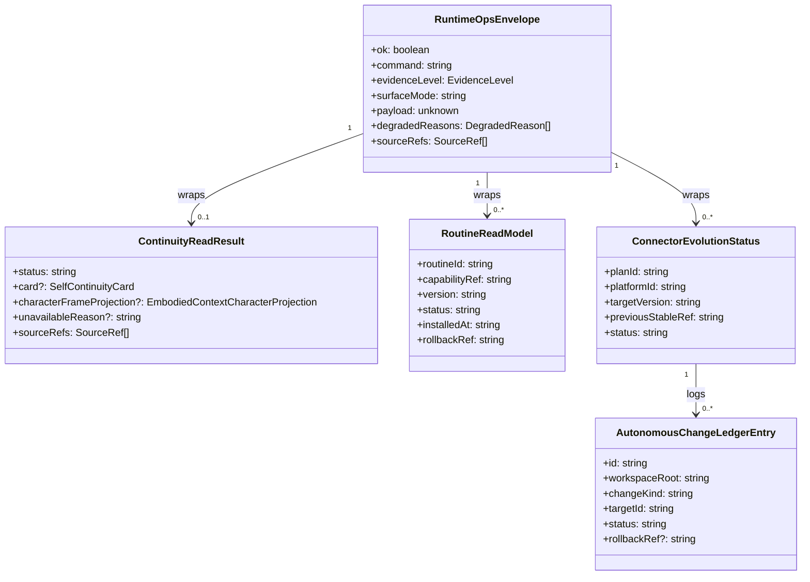

# runtime-ops-system L1 实现层

> 本文件是 `runtime-ops-system.md` 的 L1 实现层，仅在 `/forge` 编码阶段需要完整参数、算法与边缘情况时加载。
> L0 中的对应入口：
> - [§5.1 操作契约完整表](../runtime-ops-system.md#51-操作契约表-operation-contracts)
> - [§6 数据结构字段说明](../runtime-ops-system.md#6-数据模型-data-model)
> - [§6.2 ER 图](../runtime-ops-system.md#62-实体关系图-entity-relationship)
> - [§6.3 数据流向](../runtime-ops-system.md#63-数据流向-data-flow-direction)
> - [§9.3 安全风险完整表](../runtime-ops-system.md#93-security-risks--mitigations)
> - [§10.2/10.3 性能监控与优化策略](../runtime-ops-system.md#102-optimization-strategies)
> - [§11.5 契约验证矩阵](../runtime-ops-system.md#115-contract-verification-matrix)
> - [§14.1 术语表](../runtime-ops-system.md#141-glossary)

---

## §1 命令与枚举常量

### §1.1 命令注册表

| 命令族            | 命令名                         | 来源系统                |
| ----------------- | ------------------------------ | ----------------------- |
| `heartbeat`       | `heartbeat_check`              | control-context-system  |
| `continuity`      | `continuity.read`              | memory-continuity-system |
| `routine`         | `routine.list`, `routine.show`, `routine.rollback` | body-connector-system |
| `connector_evolution` | `connector_evolution.status`, `connector_evolution.trigger`, `connector_evolution.rollback` | body-connector-system + memory-continuity-system |
| `observability`   | `loop_status.read`             | observability-recovery-system |
| `setup`           | `setup_hint`, `setup_ack`      | runtime-ops-system (packaged guide) |

### §1.2 EvidenceLevel 赋值规则

1. `carrier_ack`: Host 已确认收到命令，但未进入 Second Nature runtime。
2. `contract_smoke`: 输入通过 schema 校验，但无法访问 state DB 或下游系统。
3. `state_present`: 成功读取到下游 state，但未验证该 state 来自真实 runtime 动作。
4. `real_runtime`: state 来自最近真实 heartbeat / action closure / probe。
5. `durable_verified`: 结果经过 source refs、audit hash chain 与 rollback gate 验证。

降级规则：
- 若 `surfaceMode` 为 `carrier` 且命令需要 full runtime，则最高证据等级为 `carrier_ack`。
- 若 state DB 不可读，则最高证据等级为 `contract_smoke`。
- 若下游返回 `unavailable` 或超时，evidence level 取下游能提供的最高等级或 `state_present`。

### §1.3 SurfaceMode 检测规则

| 检测条件 | SurfaceMode |
| -------- | ----------- |
| plugin 调用且 Host 仅暴露 tool schema，无法加载完整 runtime deps | `carrier` |
| CLI 命令且 `state` / `workspaceRoot` 完整装配 | `full_runtime` |
| plugin 调用且 Host 已注入完整 runtime deps（v8 Wave 116D 之后模式） | `workspace_full_runtime` |

---

## §2 数据结构字段说明

### §2.1 RuntimeOpsEnvelope

| 字段 | 类型 | 必填 | 说明 |
| ---- | ---- | :--: | ---- |
| `ok` | boolean | 是 | 命令是否完成，不代表业务成功。 |
| `command` | string | 是 | 原始命令名。 |
| `evidenceLevel` | `EvidenceLevel` | 是 | 本结果的最高证据等级。 |
| `surfaceMode` | string | 是 | `carrier` / `full_runtime` / `workspace_full_runtime`。 |
| `payload` | unknown | 是 | 按命令族承载的业务结果或降级 reason。 |
| `degradedReasons` | `DegradedReason[]` | 是 | 空数组表示无降级。 |
| `diagnostics` | `RuntimeDiagnostics` | 是 | 包含 `surfaceMode`、`host_tool_unavailable`、`skill_projection_unavailable` 等诊断。 |
| `sourceRefs` | `SourceRef[]` | 是 | 结果所依赖的来源引用列表。 |

### §2.2 ContinuityReadResult

| 字段 | 类型 | 必填 | 说明 |
| ---- | ---- | :--: | ---- |
| `status` | string | 是 | `available` / `unavailable`。 |
| `card` | `SelfContinuityCard` | 否 | 可用时返回完整 runtime card。 |
| `characterFrameProjection` | `EmbodiedContextCharacterProjection` | 否 | 可用时返回独立 bounded projection（≤900 字符）。 |
| `unavailableReason` | string | 否 | 不可用时返回 canonical reason。 |
| `sourceRefs` | `SourceRef[]` | 是 | card / projection / reason 的来源引用。 |

### §2.3 RoutineReadModel

| 字段 | 类型 | 必填 | 说明 |
| ---- | ---- | :--: | ---- |
| `routineId` | string | 是 | 全局唯一 routine 标识。 |
| `capabilityRef` | string | 是 | 关联 capability URI。 |
| `version` | string | 是 | semver 版本号。 |
| `status` | string | 是 | `installed` / `disabled` / `rollback`；映射自 registry 状态 `active` / `candidate|validated` / `retired`。 |
| `installedAt` | ISO timestamp | 是 | 安装时间。 |
| `rollbackRef` | `SourceRef` | 是 | 回滚命令/ledger entry 引用。 |
| `sourceRefs` | `SourceRef[]` | 是 | 安装来源引用。 |

### §2.4 ConnectorEvolutionStatus

| 字段 | 类型 | 必填 | 说明 |
| ---- | ---- | :--: | ---- |
| `planId` | string | 是 | Dream 生成的 plan id。 |
| `platformId` | string | 是 | 目标平台。 |
| `targetVersion` | string | 是 | 新版本 versionId。 |
| `previousStableRef` | `SourceRef` | 否 | 回滚目标版本引用。 |
| `gateResults` | `GateResult[]` | 是 | schema/permission/sandbox/fixture/wet-probe/canary 结果。 |
| `status` | string | 是 | `proposed` / `gating` / `activated` / `rolled_back` / `blocked`。 |
| `activatedAt` | ISO timestamp | 否 | 激活时间。 |
| `rollbackRef` | `SourceRef` | 否 | 回滚引用。 |

### §2.5 实体关系图 (ER Diagram)



### §2.6 数据流向 (Data Flow Direction)

- 所有实体从下游系统向 `runtime-ops-system` 流动，ops surface 只读或显式触发，不持久化业务状态。
- `AutonomousChangeLedgerEntry` 由 `observability-recovery-system` 拥有；`body-connector-system` / `memory-continuity-system` 调用其 `writeLedgerEntry` port 写入，ops surface 只读取并包装进 envelope。
- `RuntimeOpsEnvelope` 是跨边界的唯一输出形状；`payload` 按命令族承载 `ContinuityReadResult`、`RoutineReadModel[]`、`ConnectorEvolutionStatus[]` 等。

### §2.7 AutonomousChangeLedgerEntry

| 字段 | 类型 | 必填 | 说明 |
| ---- | ---- | :--: | ---- |
| `id` | string | 是 | ledger entry 唯一 id。 |
| `workspaceRoot` | string | 是 | 所属 workspace。 |
| `changeKind` | string | 是 | `routine_install` / `routine_supersede` / `routine_retire` / `connector_manifest_delta` / `connector_recipe_delta` / `connector_adapter_delta`。 |
| `targetId` | string | 是 | 被修改目标引用（routine id 或 connector id）。 |
| `previousStableRef` | string | 否 | 回滚前稳定版本。 |
| `status` | string | 是 | `proposed` / `gated` / `activated` / `rolled_back` / `blocked`。 |
| `gateResultsJson` | string | 否 | gate 结果 JSON。 |
| `rollbackRef` | string | 否 | 回滚 artifact 引用。 |
| `rollbackCommandHint` | string | 否 | 由 `body-connector-system` 在激活时生成。 |
| `sourceRefs` | `SourceRef[]` | 是 | 变更来源引用。 |
| `redactedPayloadJson` | string | 否 | 脱敏后的变更 payload。 |
| `createdAt` | ISO timestamp | 是 | 创建时间。 |
| `activatedAt` | ISO timestamp | 否 | 激活时间。 |
| `rolledBackAt` | ISO timestamp | 否 | 回滚时间。 |

**Owner**: `observability-recovery-system`。`memory-continuity-system`（routine install）与 `body-connector-system`（connector activation/rollback）作为消费者调用 `writeLedgerEntry` port。详细 schema 见 [`shared-v9-contracts.md`](./shared-v9-contracts.md) §8。

---

## §3 算法与决策树

### §3.1 命令分派决策树

```
收到 OpsRouterInput
├── command 未知 → envelope { ok:false, degradedReasons:[unknown_command] }
├── command 需要 workspaceRoot 但缺失 → degradedReasons:[workspace_root_missing]
├── surfaceMode == carrier 且命令要求 full_runtime
│   → payload:{ host_tool_unavailable }, evidenceLevel:carrier_ack
└── 装配 deps 并调用下游系统
    ├── 下游抛出异常 → envelope { ok:false, degradedReasons:[{system}_exception] }
    └── 下游返回 result → 进入 EnvelopeFactory
```

### §3.2 EvidenceLevel 提升规则

```
初始 evidenceLevel = contract_smoke
若 surfaceMode in [full_runtime, workspace_full_runtime]:
  初始 evidenceLevel = state_present
若下游返回结果包含 sourceRefs:
  evidenceLevel = max(当前, state_present)
若结果带有 real_runtime proof refs:
  evidenceLevel = max(当前, real_runtime)
若结果带有 durable audit hash / rollback ref:
  evidenceLevel = max(当前, durable_verified)
```

### §3.3 Redaction 检查清单

在 `RuntimeOpsEnvelopeFactory.assemble` 阶段按顺序执行：
1. 扫描 payload 中所有字符串字段是否匹配 credential pattern（`SECOND_NATURE_` key、token、password）。
2. 扫描 private content（email、phone、message body）是否匹配 PII regex。
3. 扫描 prompt 字段；若存在，替换为 `prompt_redacted:<hash>`。
4. 任何命中 redaction 的字段被替换为 `<redacted:kind>` 并记录 `diagnostics.redactedKeys`。

---

## §4 边缘情况

### §4.1 Carrier Mode 诚实降级

当 Host 仅暴露 tool schema 但未注入完整 runtime deps 时：
- `heartbeat_check` 返回 `host_tool_unavailable`。
- `continuity.read` 返回 `continuity_unavailable`。
- `connector_evolution.trigger` 返回 `host_tool_unavailable`。
- `setup_hint` 仍可返回 packaged `SKILL.md` 内容或 `skill_projection_unavailable`。

### §4.2 State DB 不可读

- 若 SQLite 文件损坏或 sql.js 加载失败，`ops-router` 捕获异常并返回 `state_store_unavailable`。
- envelope evidenceLevel 不超过 `contract_smoke`。
- 不抛出未处理异常，避免 Host 认为 plugin 未加载。

### §4.3 Rollback 失败

- `routine.rollback` 或 `connector_evolution.rollback` 调用下游后，若下游返回 `rollback_failed`，ops surface 把该 reason 透传给 `observability-recovery-system`。
- `loop_status.read` 在下一次查询时暴露 `rollback_failed` 为 blocked health reason [REQ-007]。

### §4.4 超时

- `continuity.read` 调用 `control-context-system` 时设置 2s deadline；超时返回 `continuity_assembly_timeout`。
- `heartbeat_check` 整体 deadline 由 Host 控制，ops surface 不额外设置，但记录各阶段 latency。

---

## §5 操作契约完整表

| 操作                                              | [REQ-XXX]        | 前置条件                                      | 消耗 / 输入                                | 产出 / 副作用                                                                 | 实现细节 |
| ------------------------------------------------- | :--------------: | --------------------------------------------- | ------------------------------------------ | ----------------------------------------------------------------------------- | :------: |
| `heartbeat_check(workspaceRoot, mode)`            | [REQ-001]        | workspaceRoot 可解析；state DB 可加载或降级   | plugin/CLI 调用                            | 返回 cycle trace 或降级 reason；写入 loop stage event                         | §3.1     |
| `continuity.read(workspaceRoot)`                  | [REQ-001]        | workspaceRoot 可解析                          | 无                                         | 返回 `SelfContinuityCardEnvelope`（含 `selfContinuityCard` + `characterFrameProjection`）或 `continuity_unavailable` reason          | §4.1     |
| `routine.list(workspaceRoot, filter)`             | [REQ-004]        | state DB 或 artifact 可读                     | filter（status / capability / platform）   | 返回 `RoutineReadModel[]` 列表                                                | §2.3     |
| `routine.show(workspaceRoot, routineId)`          | [REQ-004]        | routineId 存在或不存在均可                    | routineId                                  | 返回单个 `RoutineReadModel` 或 `routine_not_found`                            | §2.3     |
| `routine.rollback(workspaceRoot, routineId)`      | [REQ-007]        | routine 已安装且 rollback ref 有效            | routineId + operatorConfirm（可选）        | 触发 `body-connector-system` 回滚；返回 `RollbackResultEnvelope`              | §4.3     |
| `connector_evolution.status(workspaceRoot)`       | [REQ-005][REQ-007] | workspaceRoot 可解析                        | 无                                         | 返回 `ConnectorEvolutionStatusEnvelope` 列表                                  | §2.4     |
| `connector_evolution.trigger(workspaceRoot, planId)` | [REQ-005]      | planId 来自 Dream 生成的 `ConnectorEvolutionPlan` | planId + gate override flags             | 显式触发 gate 链；成功后激活新版本，失败返回 blocked/rollback reason          | §3.1     |
| `connector_evolution.rollback(workspaceRoot, planId)` | [REQ-007]    | planId 处于 activated 或 canary_failed 状态   | planId                                     | 恢复 previous stable version；写入 `AutonomousChangeLedger` rollback 记录     | §4.3     |
| `loop_status.read(workspaceRoot)`                 | [REQ-006][REQ-007] | 无                                            | 无                                         | 返回聚合 loop/continuity/routine/evolution/rollback health 的诊断 envelope    | §3.2     |
| `setup_hint(workspaceRoot)`                       | [REQ-001]        | 无                                            | 无                                         | 返回 packaged setup guidance 或 `skill_projection_unavailable`                | §4.1     |
| `setup_ack(workspaceRoot, ack)`                   | [REQ-001]        | workspaceRoot 可写                            | ack payload                                | 在 workspace 写入 ack artifact；后续 `setup_hint` 不再打扰                    | §4.1     |

---

## §6 安全风险与缓解（完整表）

| Risk                                           | Severity | Mitigation                                                      |
| ---------------------------------------------- | :------: | --------------------------------------------------------------- |
| Raw credential 泄漏                            | 高       | 所有 envelope 经 redaction projector；credential value 永不输出。 |
| Raw private content 进入 loop status / continuity card | 高 | 敏感内容走 redaction gate；source refs 替代正文。                |
| Raw prompt 通过 ops surface 暴露               | 中       | prompt 仅存在于 `control-context-system` 内部；ops 只返回指针或摘要。 |
| 自动演化命令被恶意触发                         | 中       | trigger/rollback 校验 planId 来源与 workspace root；gate 链在下游执行。 |
| Carrier mode 被误判为 full runtime             | 中       | `surfaceMode` 显式标注；carrier mode 诚实返回 `host_tool_unavailable` 或降级。 |
| State DB 损坏导致 ops 命令抛出未处理异常       | 中       | 所有下游调用包裹 try/catch，返回降级 envelope。                  |

---

## §7 性能监控指标与优化策略

### §7.1 监控指标

- `runtime_ops_command_latency_ms` — label: command, surfaceMode。
- `runtime_ops_envelope_degraded_total` — label: command, degradedReason。
- `runtime_ops_surface_mode_total` — label: surfaceMode。
- `runtime_ops_redaction_hits_total` — label: redactedKind。

### §7.2 优化策略

1. **Read model caching**: `memory-continuity-system` 提供按 projection id 缓存的 read port；ops surface 不自行缓存，避免 stale。
2. **Bounded assembly**: `control-context-system` 在 2s 内完成 continuity assembly，超时返回 `continuity_unavailable` 降级。
3. **Async evolution**: `connector_evolution.trigger` 默认写入 `gating` ledger 后返回，gate 执行由后台完成并通过 status 查询暴露。
4. **Diagnostic aggregation lazy**: `loop_status` 仅在请求时聚合；不常驻内存。

---

## §8 契约验证矩阵（完整版）

| 契约 | 风险级别 | 正常态验证 | 失败态验证 | 回归责任 |
|------|---------|-----------|-----------|---------|
| `continuity.read` 返回 card 或 unavailable reason | 关键路径 | 集成测试 | state DB 缺失 / 超时返回 `continuity_unavailable` | 每次 heartbeat/continuity 变更后回归 |
| `routine.list/show/rollback` | 高 | 集成测试 | 非法 routineId 返回 `routine_not_found` | routine registry 变更后回归 |
| `connector_evolution.trigger/rollback` | 高 | 集成测试 | gate 失败保留 previous stable；rollback 失败提升为 blocked health | connector evolution 变更后回归 |
| `loop_status.read` evidence level 与 degraded reason | 关键路径 | 单元 + 集成测试 | carrier mode 不误报为 real runtime | observability 与 ops surface 变更后回归 |
| OpenClaw plugin / CLI envelope shape 一致 | 高 | 集成测试 | plugin bridge 参数缺失返回降级 envelope | plugin/CLI 命令新增后回归 |
| 无 raw credential / private content / prompt 泄漏 | 关键路径 | 单元 + 集成测试（redaction fixture） | 敏感字段命中 redaction gate | security 或 redaction 变更后回归 |

---

## §9 术语表

- **RuntimeOpsEnvelope**: runtime-ops-system 的统一输出结构，含 `ok`、`evidenceLevel`、`surfaceMode`、`payload`、`degradedReasons`。
- **EvidenceLevel**: 证据等级，取值 `carrier_ack`、`contract_smoke`、`state_present`、`real_runtime`、`durable_verified`。
- **SurfaceMode**: plugin/CLI 的运行时模式，区分 carrier、full_runtime、workspace_full_runtime。
- **SelfContinuityCardPointer**: 指向 `memory-continuity-system` 生成的 `SelfContinuityCard` 的摘要指针。
- **AutonomousChangeLedger**: 记录 routine 安装、connector evolution、rollback 等自动变更的审计账本。
- **GateResult**: connector evolution 中单个 gate（schema/permission/sandbox/fixture/wet-probe/canary）的执行结果。
