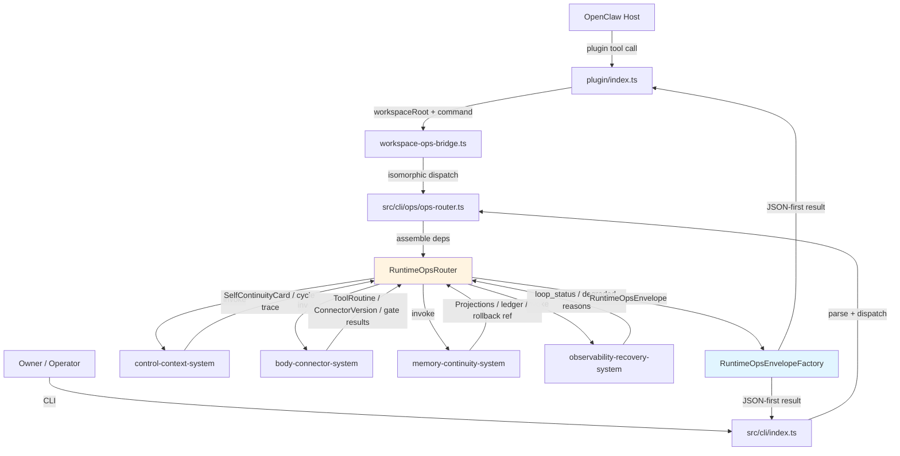
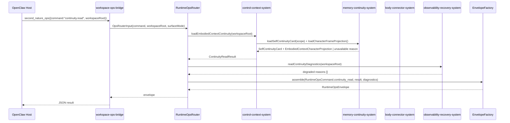

# runtime-ops-system 系统设计文档 (L0 — 导航层)

| 字段          | 值                                                                    |
| ------------- | --------------------------------------------------------------------- |
| **System ID** | `runtime-ops-system`                                                  |
| **Project**   | Second Nature v9                                                      |
| **Version**   | 1.0                                                                   |
| **Status**    | Draft                                                                 |
| **Author**    | System Designer (Nyx)                                                 |
| **Date**      | 2026-06-21                                                            |
| **L1 Detail** | [runtime-ops-system.detail.md](./runtime-ops-system.detail.md) — 已触发 L1 拆分 (R5) |

> [!IMPORTANT]
> **文档分层说明**
> - **本文件 (L0 导航层)**: 架构图、操作契约摘要、设计决策。面向快速理解与任务规划。
> - **[runtime-ops-system.detail.md](./runtime-ops-system.detail.md) (L1 实现层)**: 完整操作契约表、字段说明、算法、边缘情况、风险表、验证矩阵与术语表。

---

## 目录 (Table of Contents)

|   §   | 章节                                                         | 关键内容                                                 |
| :---: | ------------------------------------------------------------ | -------------------------------------------------------- |
|   1   | [概览](#1-概览-overview)                                     | 系统目的、边界、职责                                     |
|   2   | [目标与非目标](#2-目标与非目标-goals--non-goals)             | Goals / Non-Goals                                        |
|   3   | [背景与上下文](#3-背景与上下文-background--context)          | 为什么需要这个系统、约束                                 |
|   4   | [系统架构](#4-系统架构-architecture)                         | Mermaid 架构图、组件职责、数据流                         |
|   5   | [接口设计](#5-接口设计-interface-design)                     | 操作契约表、跨系统协议                                   |
|   6   | [数据模型](#6-数据模型-data-model)                           | 实体字段声明、ER 图                                      |
|   7   | [技术选型](#7-技术选型-technology-stack)                     | 核心技术、关键依赖                                       |
|   8   | [Trade-offs](#8-trade-offs--alternatives-权衡与备选方案)     | 决策理由、备选方案对比                                   |
|   9   | [安全性考虑](#9-安全性考虑-security-considerations)          | 认证授权、风险与缓解                                     |
|  10   | [性能考虑](#10-性能考虑-performance-considerations)          | 性能目标、优化策略                                       |
|  11   | [测试策略](#11-测试策略-testing-strategy)                    | 单测、集成、契约矩阵                                     |
|  12   | [部署与运维](#12-部署与运维-deployment--operations) *(可选)* | N/A + 理由                                               |
|  13   | [未来考虑](#13-未来考虑-future-considerations) *(可选)*      | N/A + 理由                                               |
|  14   | [附录](#14-appendix-附录) *(可选)*                           | 术语表、参考资料                                         |

---

## 1. 概览 (Overview)

### 1.1 System Purpose (系统目的)

`runtime-ops-system` 是 Second Nature v9 的统一入口与只读操作表面。它通过 OpenClaw plugin 与 CLI 暴露同构命令，把外部请求路由到 `control-context-system`、`body-connector-system`、`memory-continuity-system` 与 `observability-recovery-system`，并始终返回带 evidence level 与 degraded diagnostics 的 JSON-first envelope。

本系统不替代 Agent 心智，也不做语义判断或自动演化决策；它只负责：接收命令、装配依赖、调用下游系统、标准化返回、记录观测事件。

### 1.2 System Boundary (系统边界)

- **输入 (Input)**: OpenClaw plugin tool call、CLI 命令行、manual run 触发、host cadence/heartbeat 请求、workspaceRoot、ops command 与参数。
- **输出 (Output)**: `RuntimeOpsEnvelope`、command result、degraded diagnostics、continuity/routine/connector evolution/rollback read surface。
- **依赖系统 (Dependencies)**: `control-context-system`, `body-connector-system`, `memory-continuity-system`, `observability-recovery-system` [Architecture Overview §2][Architecture Overview §3]。
- **被依赖系统 (Dependents)**: OpenClaw Host、Claw Agent、Owner/Operator 直接消费；其他系统通过 ops surface 被调用但不被本系统反向控制。

### 1.3 System Responsibilities (系统职责)

**负责**:
- 暴露 JSON-first、同构的 OpenClaw plugin + CLI ops surface [REQ-001][REQ-005][REQ-006][REQ-007]。
- 对每条命令生成带 `evidenceLevel` 与 `degradedReasons` 的标准 envelope。
- 提供 `continuity`、`routine`、`connector evolution`、`rollback` 的读取与显式触发入口。
- 在 plugin/CLI 边界统一 redact raw credential、raw private content 与 raw prompt。
- 把 loop status、continuity status、routine status、connector evolution status 聚合成 operator-facing diagnostics。

**不负责**:
- 不执行语义判断、attention 计算、policy decision 或 Dream 压缩（由 `control-context-system`、`attention-system`、`action-closure-policy-system`、`memory-continuity-system` 负责）。
- 不直接修改 workspace connector manifest/recipe/adapter 或安装 routine（由 `body-connector-system` 与 `memory-continuity-system` 在 gate 通过后执行）。
- 不保留自动演化决策权；只暴露触发、查询与回滚命令。

---

## 2. 目标与非目标 (Goals & Non-Goals)

### 2.1 Goals

- **[G1] 同构入口**: OpenClaw plugin 与 CLI 对同一命令返回完全一致的 `RuntimeOpsEnvelope` shape [REQ-001][REQ-007]。
- **[G2] 只读/显式触发**: continuity、routine、connector evolution、rollback 均可被查询；显式触发命令必须返回 source refs、gate results 与 rollback ref，不隐藏自动演化状态 [REQ-005][REQ-007]。
- **[G3] Evidence-level 透明**: 每个 envelope 标明 `carrier_ack`、`contract_smoke`、`state_present`、`real_runtime`、`durable_verified` 中的最高证据等级，并在降级时给出 canonical reason [Architecture Overview §2 System 1]。
- **[G4] 安全输出**: ops surface 永不泄漏 raw credential、raw private content 或 raw prompt [PRD §6.2][REQ-001]。
- **[G5] 宿主兼容**: 支持 OpenClaw carrier mode 与 full runtime mode；carrier mode 下诚实返回 `host_tool_unavailable` 或 `surfaceMode` 诊断，不伪造 real runtime 证据 [ADR-001]。

### 2.2 Non-Goals

- **[NG1] 不在 ops surface 中实现 connector 演化算法或 routine 压缩逻辑**。
- **[NG2] 不暴露可让外部调用者绕过 `ActionPolicyDecision` 的隐藏通道** [PRD NG3]。
- **[NG3] 不把 `CharacterFrame` 的生成逻辑下沉到 ops surface；ops 只读取已生成的 projection 或不可用 reason** [REQ-008]。
- **[NG4] 不提供长期运行状态机；ops 命令是无状态/短事务的触发与查询**。

---

## 3. 背景与上下文 (Background & Context)

### 3.1 Why This System? (为什么需要这个系统？)

v9 要求 Agent 上下文清空后仍能继承身体直觉、习惯与 workspace connector 改进结果。Claw Host 通过 plugin tool 调用 Second Nature，Owner/Maintainer 通过 CLI 巡检。如果入口表面语义不一致或返回伪造的 runtime health，Agent 会把说明书当成真实手脚，operator 也无法判断自动演化是否安全。

因此需要一个统一的 runtime ops 层：把所有 v9 新增能力（continuity、routine、connector evolution、rollback）以 JSON-first envelope 暴露，同时明确区分“命令已收到”“状态已读到”“真实 runtime 已发生”三种证据等级。

**关联 PRD 需求**: [REQ-001], [REQ-005], [REQ-006], [REQ-007]。

### 3.2 Current State (现状分析)

v8 runtime-ops-system 已经提供 `heartbeat_check`、`loop_status`、`connector_status`、`setup_hint`、`setup_ack`、`snapshot:capture` 等命令，并实现了 OpenClaw plugin 与 CLI 同构桥接。v9 需要：
- 新增 `continuity`、`routine`、`connector_evolution`、`rollback` 命令族。
- 把 envelope 升级为显式 evidence level / degraded diagnostics。
- 保持与 v8 命令的向后兼容，不在 plugin surface 暴露未经验证的 v9 演化结果。

### 3.3 Constraints (约束条件)

- **技术约束**: 继续使用 TypeScript / Node.js / OpenClaw native plugin / SQLite/sql.js [ADR-001]；不引入新运行时。
- **安全约束**: 禁止泄漏 credential value、private message content、raw prompt；所有输出必须经过 redaction projector。
- **演化边界约束**: 自动演化仅限于 workspace connector manifest/recipe/sandboxed adapter，不得修改 core runtime、credential scope、external write policy 或 package dependency [ADR-004]。
- **性能约束**: `heartbeat_check` 与 `continuity.read` 必须在 2s 内完成；connector evolution 触发不在 heartbeat critical path 同步阻塞 [PRD §6.1]。

---

## 4. 系统架构 (Architecture)

### 4.1 Architecture Diagram (架构图)



### 4.2 Core Components (核心组件)

| Component Name              | Responsibility                                                                 | Tech Stack                          | Notes                                                       |
| --------------------------- | ------------------------------------------------------------------------------ | ----------------------------------- | ----------------------------------------------------------- |
| `plugin/index.ts`           | OpenClaw plugin 注册入口；声明 `second_nature_ops` tool schema。               | TypeScript / OpenClaw plugin        | 与 CLI 共享命令契约。                                       |
| `workspace-ops-bridge.ts`   | 把 plugin call 参数转换为与 CLI 同构的 `OpsRouterInput`。                      | TypeScript                          | 处理 carrier/full runtime `surfaceMode` 诊断。              |
| `src/cli/ops/ops-router.ts` | 命令分派、依赖装配、结果归一化。                                               | TypeScript                          | 无状态；每条命令独立。                                      |
| `RuntimeOpsRouter`          | 按命令族把调用路由到下游系统，并收集 read models / gate results。              | TypeScript functions                | 不拥有业务语义。                                            |
| `RuntimeOpsEnvelopeFactory` | 把下游结果装配为带 `evidenceLevel` 与 `degradedReasons` 的标准 envelope。      | TypeScript                          | 统一 redaction 与大小限制。                                 |
| `DiagnosticsCollector`      | 收集 `surfaceMode`、`host_tool_unavailable`、下游降级 reason 等 diagnostics。  | TypeScript                          | 供 `loop_status` 与失败态 envelope 使用。                   |

### 4.3 Data Flow (数据流)



**关键数据流说明**: Plugin/CLI 请求经 `RuntimeOpsRouter` 规范化后调用下游系统；`RuntimeOpsEnvelopeFactory` 统一附加 `evidenceLevel`、`surfaceMode`、`degradedReasons` 并执行 redaction，最后返回 JSON。详细时序说明 → [runtime-ops-system.detail.md §4](./runtime-ops-system.detail.md)。

---

## 5. 接口设计 (Interface Design)

### 5.1 操作契约表 (Operation Contracts)

| 操作                                              | [REQ-XXX]        | 产出 / 副作用                                                                 |
| ------------------------------------------------- | :--------------: | ----------------------------------------------------------------------------- |
| `heartbeat_check(workspaceRoot, mode)`            | [REQ-001]        | 返回 cycle trace 或降级 reason；写入 loop stage event                         |
| `continuity.read(workspaceRoot)`                  | [REQ-001]        | 返回 `SelfContinuityCardEnvelope`（含 `selfContinuityCard` 与 `characterFrameProjection`）或 `continuity_unavailable` reason          |
| `routine.list/show/rollback(...)`                 | [REQ-004][REQ-007] | 查询/回滚 `ToolRoutine`；返回 `RoutineReadModel` / `RollbackResultEnvelope` |
| `connector_evolution.status/trigger/rollback(...)` | [REQ-005][REQ-007] | 查询/触发/回滚 workspace connector evolution；返回 `ConnectorEvolutionStatusEnvelope` |
| `loop_status.read(workspaceRoot)`                 | [REQ-006][REQ-007] | 返回聚合 loop/continuity/routine/evolution/rollback health 诊断 envelope    |
| `setup_hint / setup_ack(workspaceRoot, ack)`      | [REQ-001]        | 返回 packaged setup guidance 或在 workspace 写入 ack artifact                 |

> 完整前置条件、输入参数、错误码、JSON 示例与全量命令列表 → [runtime-ops-system.detail.md §5](./runtime-ops-system.detail.md).

### 5.2 跨系统接口协议 (Cross-System Interface)

```typescript
interface RuntimeOpsPort {
  dispatch(input: OpsRouterInput): Promise<RuntimeOpsEnvelope>;
}

interface ContinuityReadPort {
  loadSelfContinuityCard(scope: ContinuityScope): Promise<SelfContinuityCard | DegradedOperationResult>;
  loadRoutineList(filters: RoutineFilter): Promise<RoutineListItem[]>;
}

interface RoutineOpsPort {
  listRoutines(workspaceRoot: string, filter: RoutineFilter): Promise<RoutineReadModel[]>;
  rollbackRoutine(workspaceRoot: string, routineId: string, confirm?: boolean): Promise<RollbackResult>;
}

interface ConnectorEvolutionOpsPort {
  listEvolutionStatus(workspaceRoot: string): Promise<ConnectorEvolutionStatus[]>;
  triggerEvolution(workspaceRoot: string, planId: string): Promise<EvolutionTriggerResult>;
  rollbackEvolution(workspaceRoot: string, planId: string): Promise<RollbackResult>;
}

interface ObservabilityReadPort {
  readLoopStatus(workspaceRoot: string): Promise<LoopStatusReadModel>;
  readContinuityDiagnostics(workspaceRoot: string): Promise<DegradedReason[]>;
}
```

### 5.3 HTTP API 端点摘要

N/A。`runtime-ops-system` 不是独立 HTTP 服务，而是通过 OpenClaw plugin tool 与 CLI 命令暴露 surface。后端 API 形式不适合本系统。

---

## 6. 数据模型 (Data Model)

### 6.1 核心实体 (Core Entities)

```typescript
interface RuntimeOpsEnvelope {
  ok: boolean;
  command: string;
  evidenceLevel: EvidenceLevel;
  surfaceMode: "carrier" | "full_runtime" | "workspace_full_runtime";
  payload: unknown;
  degradedReasons: DegradedReason[];
  diagnostics: RuntimeDiagnostics;
  sourceRefs: SourceRef[];
}

interface ContinuityReadResult {
  status: "available" | "unavailable";
  card?: SelfContinuityCard;
  characterFrameProjection?: EmbodiedContextCharacterProjection;
  unavailableReason?: string;
  sourceRefs: SourceRef[];
}

interface RoutineReadModel {
  routineId: string;
  capabilityRef: string;
  version: string; // semver
  status: "installed" | "disabled" | "rollback"; // installed←active, disabled←candidate/validated, rollback←retired
  installedAt: string;
  rollbackRef: SourceRef;
  sourceRefs: SourceRef[];
}

interface ConnectorEvolutionStatus {
  planId: string;
  platformId: string;
  targetVersion: string; // versionId
  previousStableRef?: SourceRef;
  gateResults: GateResult[];
  status: "proposed" | "gating" | "activated" | "rolled_back" | "blocked";
  activatedAt?: string;
  rollbackRef?: SourceRef;
}

interface AutonomousChangeLedgerEntry {
  id: string;
  workspaceRoot: string;
  changeKind: "routine_install" | "routine_supersede" | "routine_retire" | "connector_manifest_delta" | "connector_recipe_delta" | "connector_adapter_delta";
  targetId: string;
  previousStableRef?: string;
  status: "proposed" | "gated" | "activated" | "rolled_back" | "blocked";
  gateResultsJson?: string;
  rollbackRef?: string;
  rollbackCommandHint?: string;
  sourceRefs: SourceRef[];
  redactedPayloadJson?: string;
  createdAt: string;
  activatedAt?: string;
  rolledBackAt?: string;
}
```

> 完整方法实现与配置常量 → L1 实现层（若 `/forge` 触发拆分）。

### 6.2 实体关系图 (Entity Relationship)

ER 图与关系说明 → [runtime-ops-system.detail.md §2.5](./runtime-ops-system.detail.md)。

### 6.3 数据流向 (Data Flow Direction)

实体从下游系统流向 ops surface；ops surface 只读或显式触发，不持久化业务状态。详细流向与 payload 映射 → [runtime-ops-system.detail.md §2.6](./runtime-ops-system.detail.md)。

---

## 7. 技术选型 (Technology Stack)

### 7.1 Core Technologies (核心技术)

| Domain        | Choice                        | Rationale                                              |
| ------------- | ----------------------------- | ------------------------------------------------------ |
| Language      | TypeScript                    | 与 v8 一致；强类型契约、OpenClaw plugin 可编译为 JS。   |
| Runtime       | Node.js                       | 与 v8 一致；插件在 OpenClaw Host 的 Node 环境中运行。   |
| Plugin Host   | OpenClaw native plugin        | v9 继续作为 Claw 的 plugin tool 暴露 ops surface。      |
| State Access  | SQLite/sql.js read ports      | 通过 `memory-continuity-system` 读取 projection 与 ledger。 |
| Validation    | Zod                           | plugin/CLI 输入校验与 envelope shape 校验。             |

### 7.2 Key Libraries/Dependencies (关键依赖)

- `zod`: plugin tool args、CLI 参数、envelope shape 的运行时校验。
- OpenClaw plugin SDK / `openclaw.plugin.json`: tool schema 声明与 Host 集成。
- 共享类型模块 `src/shared/types/v9-contracts.ts`（规划）：命令、envelope、evidence level 的 canonical types。

> **决策来源**: [ADR-001: Continue TypeScript / Node / OpenClaw / SQLite Runtime](../03_ADR/ADR_001_CONTINUE_TYPESCRIPT_NODE_OPENCLAW_SQLITE.md)。

---

## 8. Trade-offs & Alternatives (权衡与备选方案)

### 8.1 继续使用现有技术栈

> **决策来源**: [ADR-001: Continue TypeScript / Node / OpenClaw / SQLite Runtime](../03_ADR/ADR_001_CONTINUE_TYPESCRIPT_NODE_OPENCLAW_SQLITE.md)
>
> 本系统使用 ADR-001 定义的 TypeScript / Node.js / OpenClaw / SQLite 栈。
>
> **本系统特有实现**:
> - plugin surface 与 CLI 共享同一 `OpsRouterInput` 与 `RuntimeOpsEnvelope` 类型。
> - plugin bridge 在 `register()` 阶段延迟计算 `import.meta.url`，避免 VM 作用域问题。
> - 所有 state 读取通过 `memory-continuity-system` 的 read port，不直接访问 SQLite schema。

### 8.2 Workspace-Only 自动演化边界

> **决策来源**: [ADR-004: Allow Workspace-Only Autonomous Connector Evolution](../03_ADR/ADR_004_WORKSPACE_ONLY_CONNECTOR_EVOLUTION.md)
>
> 本系统执行 ADR-004 的 workspace-only 边界：ops surface 只暴露 trigger/rollback/read 命令，真正的 schema/permission/sandbox/fixture/wet-probe/canary/rollback gate 由 `body-connector-system` 与 `memory-continuity-system` 实现。
>
> **本系统特有实现**:
> - `connector_evolution.trigger` 在调用 gate 链之前检查 planId 来源与 workspace root 边界。
> - `connector_evolution.rollback` 始终尝试恢复 previous stable version，并把 rollback 结果写入 `AutonomousChangeLedger` 的读取 surface；ledger 的 owner 是 `observability-recovery-system`，`memory-continuity-system`（routine install）与 `body-connector-system`（connector activation/rollback）作为消费者调用其 `writeLedgerEntry` port。

### 8.3 JSON-first envelope vs Host-native struct

**Option A: JSON-first envelope (Selected)**
- **优点**: OpenClaw plugin 与 CLI 天然同构；operator 可直接阅读；evidence level 与 degraded diagnostics 是 envelope 的一级字段。
- **缺点**: Host 需要解析 JSON；强类型契约必须额外用 Zod 校验。

**Option B: Host-native object / typed struct only**
- **优点**: 类型安全更接近 Host。
- **缺点**: 不同 Host 的 struct 不同，无法保证 CLI 与 plugin 输出一致；debug 与审计可读性差。

**Decision**: 选择 Option A。runtime ops 的输出必须是人机可读、可审计、跨表面一致的 JSON-first envelope [PRD §5.2]。

### 8.4 Ops surface 对演化的控制深度

**Option A: 只读 + 显式触发 (Selected)**
- **优点**: 职责清晰；自动演化决策留在 `body-connector-system` / `memory-continuity-system`；ops 不拥有决策权。
- **缺点**: 需要 Agent/Owner 显式触发某些演化；heartbeat 不会自动在 ops surface 完成演化。

**Option B: Ops surface 直接拥有 gate orchestration**
- **优点**: 入口统一。
- **缺点**: 让只读表面变成决策点，违反 [Architecture Overview §2 System 1]“不拥有语义判断或自动演化决策”的边界。

**Decision**: 选择 Option A。ops surface 是触发器与读取器，不是 orchestrator。

---

## 9. 安全性考虑 (Security Considerations)

### 9.1 Authentication & Authorization (认证授权)

- OpenClaw Host 负责验证 plugin tool 调用者身份；Second Nature plugin 不自行鉴权。
- CLI 以当前 OS user 权限运行；connector evolution trigger/rollback 等敏感命令可要求 operator confirm flag。
- Routine rollback 与 connector evolution rollback 默认需要显式确认，除非调用来自已授权的 automation context。

### 9.2 Data Encryption (数据加密)

- 静态 credential 由 `credential-vault` 加密存储；ops surface 只读取 redacted 摘要或诊断码。
- 传输中无网络暴露；plugin/CLI 与 core 在同一 Node 进程或本地 workspace 中通信。

### 9.3 Security Risks & Mitigations (安全风险与缓解)

核心风险与缓解策略：
- **Raw credential / private content / prompt 泄漏**: 所有 envelope 经 redaction projector；credential value、private message body、raw prompt 永不输出 [REQ-001][PRD §6.2]。
- **Carrier mode 被误判为 full runtime**: `surfaceMode` 显式标注；carrier mode 诚实返回 `host_tool_unavailable` 或降级 [ADR-001]。
- **自动演化命令被恶意触发**: trigger/rollback 校验 planId 来源与 workspace root；gate 链在下游执行 [ADR-004]。

完整风险矩阵 → [runtime-ops-system.detail.md §6](./runtime-ops-system.detail.md)。

---

## 10. 性能考虑 (Performance Considerations)

### 10.1 Performance Goals (性能目标)

- **`continuity.read` / `heartbeat_check` p95**: < 2s（含下游 read） [PRD §6.1]。
- **`loop_status.read` p95**: < 500ms。
- **`connector_evolution.trigger`**: 不在 heartbeat critical path 同步执行；允许异步或显式阻塞，但默认返回 gating 状态而非等待全部 gate 完成 [PRD §6.1]。
- **Envelope payload size**: 默认不超过 64 KB；`SelfContinuityCard` 正文不超过 1200 UTF-8 chars [REQ-001]。

### 10.2 Optimization Strategies (优化策略)

核心策略：read port 复用 `memory-continuity-system` 缓存、continuity assembly 2s deadline、connector evolution 默认异步 gating、`loop_status` 懒聚合。详细策略 → [runtime-ops-system.detail.md §7](./runtime-ops-system.detail.md)。

### 10.3 Performance Monitoring (性能监控)

`observability-recovery-system` 记录每条 ops command 的 latency、evidence level、degraded reason。关键指标与标签定义 → [runtime-ops-system.detail.md §7](./runtime-ops-system.detail.md)。

---

## 11. 测试策略 (Testing Strategy)

### 11.1 Unit Testing (单元测试)

- **Coverage Target**: > 80% for ops-router, envelope factory, diagnostics collector.
- **Framework**: Node.js native test runner + `pnpm typecheck`.
- **Key Test Areas**:
  - [ ] `RuntimeOpsEnvelopeFactory` 正确设置 `evidenceLevel` 与 `degradedReasons`。
  - [ ] `DiagnosticsCollector` 识别 carrier mode 并生成 `host_tool_unavailable`。
  - [ ] `ops-router` 对未知命令返回 `unknown_command` 降级 envelope。
  - [ ] plugin bridge 与 CLI 对同一命令产生一致的 envelope shape。

### 11.2 Integration Testing (集成测试)

- **Tool**: Node.js native test runner with in-memory SQLite + workspace fixture.
- **Test Scenarios**:
  - [ ] `continuity.read` 在 active projection 存在时返回 `SelfContinuityCardEnvelope` [REQ-001]。
  - [ ] `continuity.read` 在 state 不可读时返回 `continuity_unavailable` [REQ-001]。
  - [ ] `routine.list` 与 `routine.rollback` 与 `body-connector-system` 集成 [REQ-004][REQ-007]。
  - [ ] `connector_evolution.status` / `trigger` / `rollback` 全生命周期集成 [REQ-005][REQ-007]。
  - [ ] `loop_status.read` 在 canary rollback 后暴露 `connector_canary_rollback` reason [REQ-007]。

### 11.3 End-to-End Testing (端到端测试)

- **Tool**: OpenClaw plugin bridge integration test + CLI smoke。
- **Scenarios**:
  - [ ] plugin `second_nature_ops` 返回与 CLI 完全一致的 JSON。
  - [ ] carrier mode 下 `setup_hint` 返回 `skill_projection_unavailable` 或 packaged guide。

### 11.4 Performance Testing (性能测试)

- `continuity.read` 在 1000 条 evidence 的 workspace 下 p95 < 2s。
- `loop_status.read` 在 100 条 ledger entries 下 p95 < 500ms。

### 11.5 Contract Verification Matrix (契约-验证责任矩阵)

关键契约（`continuity.read`、`routine.*`、`connector_evolution.*`、`loop_status.read`、plugin/CLI envelope shape 一致性、redaction 无泄漏）的验证责任矩阵 → [runtime-ops-system.detail.md §8](./runtime-ops-system.detail.md)。

---

## 12. 部署与运维 (Deployment & Operations)

N/A。`runtime-ops-system` 不是独立部署服务，而是随 Second Nature package 一起通过 `pnpm build` / `pnpm build:plugin` 构建为 OpenClaw plugin 与 CLI binary。部署与运维由整个 Second Nature package 的发布流程覆盖。

---

## 13. 未来考虑 (Future Considerations)

N/A。v9 范围内 runtime-ops-system 的需求已在 PRD [REQ-001][REQ-005][REQ-006][REQ-007] 中完整定义；后续可能新增 ops command，但应通过 `/change` 工作流演进，不在本 L0 预留未经验证的扩展槽。

---

## 14. Appendix (附录)

### 14.1 Glossary (术语表)

术语表（含 RuntimeOpsEnvelope、EvidenceLevel、SurfaceMode、SelfContinuityCardPointer、AutonomousChangeLedger 等）→ [runtime-ops-system.detail.md §9](./runtime-ops-system.detail.md)。

### 14.2 References (参考资料)

- [PRD v9](../01_PRD.md) — [REQ-001], [REQ-005], [REQ-006], [REQ-007]
- [Architecture Overview v9](../02_ARCHITECTURE_OVERVIEW.md) — §2 System 1, §3 系统依赖图
- [ADR-001: Continue TypeScript / Node / OpenClaw / SQLite Runtime](../03_ADR/ADR_001_CONTINUE_TYPESCRIPT_NODE_OPENCLAW_SQLITE.md)
- [ADR-004: Allow Workspace-Only Autonomous Connector Evolution](../03_ADR/ADR_004_WORKSPACE_ONLY_CONNECTOR_EVOLUTION.md)

### 14.3 Change Log (变更日志)

| Version | Date       | Changes      | Author          |
| ------- | ---------- | ------------ | --------------- |
| 1.0     | 2026-06-21 | 初始 L0 设计 | System Designer |

---

<!-- L0 自检:
- 章节 1-11 完整；12-14 因不适用写 N/A + 理由。
- 操作契约表 §5.1 覆盖核心命令族并链接 L1 完整表。
- 数据模型 §6 声明 RuntimeOpsEnvelope、ContinuityReadResult、RoutineReadModel、ConnectorEvolutionStatus、AutonomousChangeLedgerEntry。
- Trade-offs §8 引用 ADR-001 与 ADR-004，未复制正文。
- 所有契约与模型均带 [REQ-XXX] / ADR 来源锚点。
- 已触发 L1 拆分 (R5: 文档总行 >500)，完整实现细节移入 runtime-ops-system.detail.md。
-->
