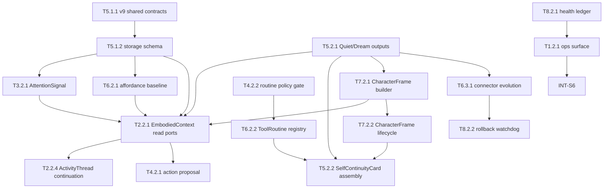

# 05A_TASKS.md — 执行主清单

> 版本: v9
> 产出自: /blueprint
> 最后更新: 2026-06-22
>
> 验证计划: [05B_VERIFICATION_PLAN.md](./05B_VERIFICATION_PLAN.md)（每个任务有对应 `验证引用`）

---

## 0. Blueprint 输入与门禁

- **事实源**: `01_PRD.md`, `02_ARCHITECTURE_OVERVIEW.md`, `03_ADR/ADR_001~006`, `04_SYSTEM_DESIGN/*.md`, `04_SYSTEM_DESIGN/*.detail.md`, `04_SYSTEM_DESIGN/shared-v9-contracts.md`, `07_CHALLENGE_REPORT.md`, `concept_model.json`。
- **WBS Level-1 系统 ID**: `runtime-ops-system`, `control-context-system`, `attention-system`, `action-closure-policy-system`, `memory-continuity-system`, `character-continuity-system`, `body-connector-system`, `observability-recovery-system`。
- **不可变边界**: v9 不替代 Agent mind；不自动修改 core runtime / credential scope / external write policy / dependency；不声称 Agent 真实情绪；routine 不绕过 policy；E2E 仅记录触发与证据预期，不在 blueprint 执行。
- **验证硬约束**: 项目验收必须包含单元测试与 API接口功能测试；所有公共契约必须有实现任务和验证承接。

---

## 依赖图总览

---

## Sprint 路线图

| Sprint | 代号 | 核心任务 | 退出标准 | 预估 |
|--------|------|---------|---------|------|
| S1 | Contract Spine | shared v9 contracts、storage schema、legacy mapping | `pnpm typecheck` 通过；v9 schema fresh/upgrade smoke 通过；AttentionSignal legacy adapter 可读 | 4-5d |
| S2 | Attention + Context | stable identity、AttentionSignal、EmbodiedContext、ActivityThread、SelfContinuityCard read path | same feed 3 次不膨胀；context 可返回 card/frame/thread degraded reason；attention 不生成最终 judgment；相关 attention 可延续同一 thread | 5-6d |
| S3 | Policy + Procedural Routine | Agent/routine intent、guard policy、ToolRoutine registry、closure | routine install/invocation 不能绕过 policy；exactly-one closure 保持 | 5-6d |
| S4 | Connector Evolution | real-hand affordance、v8 manifest migration、7 gates、rollback | scaffold 不进 real-hand；canary 失败自动 rollback；ledger 有 redacted 记录 | 6-7d |
| S5 | Character + Observability + Ops | CharacterFrame、ledger/health、ops CLI/plugin read surface | loop_status 暴露 activity/continuity/routine/evolution/rollback 等健康；CharacterFrame contestable 注入；CLI/plugin envelope 同构 | 5-6d |
| S6 | Release Regression | v9 集成、回归、build/package gate | P0/P1 user stories 均有自动化测试或报告；typecheck/build/build:plugin/test gate 通过 | 3-4d |

---

## System 1: runtime-ops-system

### Phase 2: Core

- [ ] **T1.2.1** [REQ-001][REQ-005][REQ-007]: 实现 v9 ops command surface 与 JSON-first envelope
  - **描述**: 扩展 CLI 与 OpenClaw plugin bridge，暴露 `continuity.read`, `routine.list/show/rollback`, `connector_evolution.status/trigger/rollback`, `loop_status.read`，并通过 `loop_status.read` 返回 activity health 维度与统一 `RuntimeOpsEnvelope`。
  - **输入**: `04_SYSTEM_DESIGN/runtime-ops-system.md §5.1`, `04_SYSTEM_DESIGN/runtime-ops-system.detail.md §5`, `T8.2.1` 产出的 health read ports, `T5.2.2` 产出的 card read port, `T6.2.2` 产出的 routine read port, `T6.3.1` 产出的 evolution port
  - **输出**: `src/cli/ops/ops-router.ts` v9 command handlers, `src/cli/commands/index.ts` registrations, `plugin/workspace-ops-bridge.ts` v9 command allowlist, `RuntimeOpsEnvelope` shared type
  - **契约承接**: CLI/plugin command contract；`RuntimeOpsEnvelope.evidenceLevel/surfaceMode/degradedReasons`；carrier/full-runtime 降级语义
  - **参考**: ADR-001, ADR-004, `shared-v9-contracts.md §8`
  - **验收标准**:
    - Given full runtime workspace 具备 v9 state
    - When CLI 与 plugin 分别调用同一 v9 command
    - Then 返回同构 JSON envelope，含 evidenceLevel、surfaceMode、sourceRefs、degradedReasons
  - **验证类型**: API接口功能测试 + 集成测试 + 编译检查
  - **E2E触发设想**: 若 `/forge` 实机 OpenClaw 可用，补充 `second_nature_ops continuity.read` 真人走查；blueprint 阶段不执行。
  - **验证摘要**: API 测试覆盖正常请求、缺 workspaceRoot、carrier mode、未知命令、下游 unavailable。
  - **验证引用**: `05B_VERIFICATION_PLAN.md#t1-2-1`
  - **证据产出**: `tests/api/runtime-ops/v9-ops-surface.test.ts`, `tests/integration/plugin/v9-workspace-ops-bridge.test.ts`, `logs/v9-ops-envelope-smoke.json`
  - **估时**: 1.5d
  - **依赖**: T5.2.2, T6.2.2, T6.3.1, T8.2.1
  - **优先级**: P0

- [ ] **T1.2.2** [REQ-001][REQ-007]: 实现 ops redaction 与 evidence-level truth gate
  - **描述**: 在 v9 ops envelope 组装阶段统一执行 payload redaction、credential/private/prompt 泄漏阻断与 evidence level 提升/封顶。
  - **输入**: `04_SYSTEM_DESIGN/runtime-ops-system.detail.md §1.2 §3.2 §3.3`, `04_SYSTEM_DESIGN/observability-recovery-system.detail.md §1.8 §3.2`, `T8.1.2` 产出的 redaction projector
  - **输出**: `RuntimeOpsEnvelopeFactory`, `DiagnosticsCollector`, redaction diagnostics
  - **契约承接**: evidence level truth gate；ops output 不泄漏 raw credential/private content/raw prompt
  - **参考**: ADR-001, PRD §6.2
  - **验收标准**:
    - Given payload 含 token/private/prompt 形状字段
    - When ops envelope 被组装
    - Then 敏感字段被阻断或替换，diagnostics 标记 redactedKeys，evidenceLevel 不被错误提升
  - **验证类型**: 单元测试 + API接口功能测试
  - **E2E触发设想**: 无
  - **验证摘要**: 单元测试覆盖 redaction 分类；API 测试覆盖敏感 payload 与 carrier/full runtime truth gate。
  - **验证引用**: `05B_VERIFICATION_PLAN.md#t1-2-2`
  - **证据产出**: `tests/unit/runtime-ops/v9-envelope-factory.test.ts`, `tests/api/runtime-ops/v9-redaction-envelope.test.ts`
  - **估时**: 1d
  - **依赖**: T8.1.2
  - **优先级**: P0

---

## System 2: control-context-system

### Phase 2: Core

- [x] **T2.2.1** [REQ-001][REQ-008]: 扩展 `EmbodiedContext` 装配 SelfContinuityCard 与 CharacterFrame
  - **描述**: 在 context assembly 中并行加载 `SelfContinuityCard`、`CharacterFramePointer`、独立 `EmbodiedContextCharacterProjection`、active projections、routine list、active ActivityThreads 与 affordance slices。
  - **输入**: `04_SYSTEM_DESIGN/control-context-system.md §5.1 §6.1`, `04_SYSTEM_DESIGN/control-context-system.detail.md §1 §3.3 §3.5`, `shared-v9-contracts.md §3.5 §4 §5 §10`, `T5.1.2`, `T5.2.1`, `T6.2.1`, `T7.2.1`
  - **输出**: `src/core/second-nature/control-plane/embodied-context-assembler.ts` v9 slices, `ContextSerializer` v9 projection rendering
  - **契约承接**: `EmbodiedContext.selfContinuityCard`, `characterFramePointer`, `characterFrameProjection`, `routineList`, `activityThreads`, 1200/900/200 字符预算；Agent-boundary labels prevent continuity/activity/routine/health from becoming Agent controller text
  - **参考**: ADR-003, ADR-006
  - **验收标准**:
    - Given active card、accepted frame、routine、activity thread 与 affordance 数据存在
    - When assembly runs
    - Then context 含 Card、Frame pointer、独立 Frame projection、active thread summary，并保留 contest prompt/source refs；serializer 不输出 emotion claim、identity lock 或 hard-control wording
  - **验证类型**: 单元测试 + 集成测试
  - **E2E触发设想**: S6 可通过 OpenClaw heartbeat 手动确认 Claw context 可读；blueprint 不执行。
  - **验证摘要**: 覆盖 loaded/degraded/blocked slices、字符预算、source ref 去重、activity thread slice、frame deferred 与 Agent-boundary forbidden-pattern fixtures。
  - **验证引用**: `05B_VERIFICATION_PLAN.md#t2-2-1`
  - **证据产出**: `tests/unit/control-plane/v9-embodied-context.test.ts`, `tests/integration/v9/context-continuity-injection.test.ts`
  - **估时**: 1.5d
  - **依赖**: T5.1.2, T5.2.1, T6.2.1, T7.2.1
  - **优先级**: P0

- [ ] **T2.2.2** [REQ-003]: 将 heartbeat 主链路从 JudgmentVerdict 切换到 AttentionSignal
  - **描述**: 更新 heartbeat orchestrator，让 `AttentionSignal` 作为提示进入 Agent/routine-authored action intent，不再把 v8 `JudgmentVerdict` 当最终 decision 输入。
  - **输入**: `04_SYSTEM_DESIGN/control-context-system.md §3.4 §8.1`, `04_SYSTEM_DESIGN/control-context-system.detail.md §3.1 §5`, `T3.2.1`, `T4.2.1`
  - **输出**: `runHeartbeatCycle` v9 attention path, `AgentActionIntent` handoff, degraded path closure handling
  - **契约承接**: AttentionSignal 不替代 Agent mind；missing source refs 不触发 write-side action proposal
  - **参考**: ADR-002
  - **验收标准**:
    - Given attention signal status is `attention_blocked_missing_sources`
    - When heartbeat cycle runs
    - Then action proposal 不被触发，cycle 仍产生 no-action closure 与 stage event
  - **验证类型**: 单元测试 + 集成测试
  - **E2E触发设想**: 无
  - **验证摘要**: 覆盖 attentive、blocked、degraded 三条 heartbeat 路径与 exactly-one closure。
  - **验证引用**: `05B_VERIFICATION_PLAN.md#t2-2-2`
  - **证据产出**: `tests/unit/control-plane/v9-attention-cycle.test.ts`, `tests/integration/v9/attention-to-closure-chain.test.ts`
  - **估时**: 1.5d
  - **依赖**: T3.2.1, T4.2.1
  - **优先级**: P0

- [ ] **T2.2.3** [REQ-001]: 实现 2s heartbeat deadline 与 context slice timeout 分发
  - **描述**: 为 context assembly 添加 `EMBODIED_CONTEXT_HARD_DEADLINE_MS` 与 per-slice timeout，使非关键切片降级而不阻塞 heartbeat。
  - **输入**: `04_SYSTEM_DESIGN/control-context-system.detail.md §1 §3.3`, `PRD §6.1`, `T2.2.1` 产出的 v9 assembler
  - **输出**: timeout helper, degraded slice mapper, latency stage events
  - **契约承接**: heartbeat 不超过 2s；continuity unavailable 显式 reason
  - **参考**: `04_SYSTEM_DESIGN/control-context-system.detail.md §3.3`
  - **验收标准**:
    - Given one non-critical read port hangs
    - When assembly runs
    - Then 该 slice degraded，整体 heartbeat 在 deadline 内完成
  - **验证类型**: 单元测试 + 集成测试 + 性能测试
  - **E2E触发设想**: 无
  - **验证摘要**: 使用 fake timers/slow port 覆盖 timeout 与 p95 budget。
  - **验证引用**: `05B_VERIFICATION_PLAN.md#t2-2-3`
  - **证据产出**: `tests/unit/control-plane/v9-context-deadline.test.ts`, `reports/v9-context-deadline-benchmark.md`
  - **估时**: 1d
  - **依赖**: T2.2.1
  - **优先级**: P1

- [x] **T2.2.4** [REQ-003]: 实现 `ActivityThread` 跨 heartbeat continuation spine
  - **描述**: 新增 `ActivityThreadCoordinator`，根据 `AttentionSignal.threadSuggestion` 与 active threads 创建/延续/暂停/完成 thread；每轮最多推进一个 bounded `ActivityStep`，side-effecting step 仍交给 action policy。
  - **输入**: `04_SYSTEM_DESIGN/control-context-system.md §5.1`, `04_SYSTEM_DESIGN/control-context-system.detail.md §3.9`, `04_SYSTEM_DESIGN/memory-continuity-system.detail.md §3.1b`, `shared-v9-contracts.md §3.5`, `T2.2.1`, `T3.2.1`, `T5.1.2`
  - **输出**: `activity-thread-coordinator.ts`, ActivityThread read/write port wiring, heartbeat progress stage events
  - **契约承接**: `ActivityThread` / `ActivityStep` lifecycle；one bounded step per heartbeat；no internal infinite loop；side-effecting step remains policy-bound
  - **参考**: ADR-002, `04_SYSTEM_DESIGN/control-context-system.detail.md §3.9`, `04_SYSTEM_DESIGN/memory-continuity-system.detail.md §3.1b`
  - **验收标准**:
    - Given an active thread and related attention signal
    - When heartbeat runs repeatedly
    - Then the same thread advances by at most one step per heartbeat and can pause/complete/block with source refs
  - **验证类型**: 单元测试 + 集成测试
  - **E2E触发设想**: 无
  - **验证摘要**: Covers create/continue/pause/complete, stale/max-step guard, and side-effect handoff to action policy.
  - **验证引用**: `05B_VERIFICATION_PLAN.md#t2-2-4`
  - **证据产出**: `tests/unit/control-plane/v9-activity-thread-coordinator.test.ts`, `tests/integration/v9/activity-thread-continuation.test.ts`
  - **估时**: 1.5d
  - **依赖**: T2.2.1, T3.2.1, T5.1.2
  - **优先级**: P0

---

## System 3: attention-system

### Phase 2: Core

- [x] **T3.2.1** [REQ-002][REQ-003]: 实现 `AttentionSignal` 装配器与 stable identity 读取
  - **描述**: 新增 `AttentionAssembler`, `RepetitionDetector`, `AttentionScorer`, `AttentionSignalValidator`，将 evidence 转为 source-backed attention hint，并为相关 evidence 输出 ActivityThread create/continue/pause suggestion。
  - **输入**: `04_SYSTEM_DESIGN/attention-system.md §5.1 §6.1`, `04_SYSTEM_DESIGN/attention-system.detail.md §1-§5`, `shared-v9-contracts.md §2 §3`, `T5.1.2`
  - **输出**: `src/core/second-nature/perception/attention-assembler.ts`, scorer/validator modules, `AttentionSignal` persistence handoff
  - **契约承接**: `AttentionSignal` runtime/storage shape；`activityThreadId` / `threadSuggestion`; `RepetitionKind`; missing source refs → `attention_blocked_missing_sources`
  - **参考**: ADR-002
  - **验收标准**:
    - Given new/changed/duplicate/identity_unstable evidence
    - When attention assembly runs
    - Then novelty/repetition/risk/actions/status/threadSuggestion 符合 shared contract，且不输出最终 judgment
  - **验证类型**: 单元测试 + 集成测试
  - **E2E触发设想**: 无
  - **验证摘要**: 表驱动覆盖 identity、score、risk、actions、thread suggestion 与 source ref blocker。
  - **验证引用**: `05B_VERIFICATION_PLAN.md#t3-2-1`
  - **证据产出**: `tests/unit/attention/v9-attention-assembler.test.ts`, `tests/integration/v9/stable-identity-attention.test.ts`
  - **估时**: 1.5d
  - **依赖**: T5.1.2
  - **优先级**: P0

- [x] **T3.2.2** [REQ-002]: 实现重复 feed 抑制与 `identity_unstable` routine-signal 阻断
  - **描述**: 将同一 externalId/contentHash 的 repeated feed 聚合到同一 logical identity，并保证 unstable identity 不进入 routine promotion。
  - **输入**: `04_SYSTEM_DESIGN/attention-system.detail.md §3.1 §5.2`, `04_SYSTEM_DESIGN/memory-continuity-system.detail.md §3.1`, `T5.1.2`, `T3.2.1`
  - **输出**: stable identity integration path, duplicate suppression assertions
  - **契约承接**: `observedAt` 不参与 logical identity；same feed 3 次 seenCount 递增且不新增等价 logical row
  - **参考**: PRD US-002
  - **验收标准**:
    - Given same MoltBook feed fixture runs 3 times
    - When normalization and attention assembly run
    - Then logical evidence row remains 1 and `seenCount=3`
  - **验证类型**: 集成测试 + 回归测试
  - **E2E触发设想**: 无
  - **验证摘要**: 覆盖 stable externalId、missing externalId stable hash、missing content hash 三类。
  - **验证引用**: `05B_VERIFICATION_PLAN.md#t3-2-2`
  - **证据产出**: `tests/integration/v9/repeated-feed-suppression.test.ts`
  - **估时**: 1d
  - **依赖**: T3.2.1
  - **优先级**: P0

---

## System 4: action-closure-policy-system

### Phase 2: Core

- [ ] **T4.2.1** [REQ-003][REQ-004]: 扩展 `ActionProposalBuilder` 接收 Agent intent、ActivityStep 与 RoutineInvocation，并使用 AttentionSignal refs 作为 grounding
  - **描述**: 将 Agent-authored intent、policy-bound ActivityStep intent 与 RoutineInvocation 归一为 policy-bound `ActionProposal`；AttentionSignal refs 只用于 source/risk/rationale grounding，attention-only 不生成 action proposal。
  - **输入**: `04_SYSTEM_DESIGN/action-closure-policy-system.md §5.1`, `04_SYSTEM_DESIGN/action-closure-policy-system.detail.md §2.1 §3.1`, `T3.2.1`, `T2.2.4`
  - **输出**: `ActionProposalBuilder` v9 inputs, `AgentActionIntent`, `ActivityStepIntent`, `AttentionSignalRef` grounding, `RoutineInvocation` mapping
  - **契约承接**: source-backed proposal；attention refs 不是 action author；activity suggestion 不是最终 action；routine invocation 记录 id/version
  - **参考**: ADR-002, ADR-005
  - **验收标准**:
    - Given Agent intent、activity step、attention refs-only、routine invocation 四类输入
    - When proposal builder runs
    - Then Agent/activity/routine 输入输出统一 proposal；attention refs-only 输出 no-action / ask-agent reason
  - **验证类型**: 单元测试
  - **E2E触发设想**: 无
  - **验证摘要**: 表驱动覆盖 Agent/activity/routine authorship、attention refs-only no-action、missing refs、connector_read ignore。
  - **验证引用**: `05B_VERIFICATION_PLAN.md#t4-2-1`
  - **证据产出**: `tests/unit/action/v9-action-proposal-builder.test.ts`
  - **估时**: 1d
  - **依赖**: T3.2.1, T2.2.4
  - **优先级**: P0

- [ ] **T4.2.2** [REQ-004][REQ-007]: 集成 `ToolRoutineGuardSchema` 到 policy evaluator
  - **描述**: 在 routine install/invocation 时由 action policy 复核 guard 的 permission expansion、owner confirm、breaker、permission 与 owner preference。
  - **输入**: `shared-v9-contracts.md §6.3`, `04_SYSTEM_DESIGN/action-closure-policy-system.detail.md §2.3 §4.2`, `T5.1.1`, `T4.2.1`
  - **输出**: `RoutinePolicyEvaluationContext`, guard policy evaluator branches, `routine_permission_expansion_denied` reason
  - **契约承接**: ToolRoutine guard policy-context evaluation；routine 不绕过 `ActionPolicyDecision`
  - **参考**: ADR-005, `04_SYSTEM_DESIGN/shared-v9-contracts.md §6.3`, `04_SYSTEM_DESIGN/action-closure-policy-system.detail.md §2.3`
  - **验收标准**:
    - Given routine guard 扩大 capability 或 requiresOwnerConfirm=true
    - When policy evaluator runs
    - Then 分别 deny `routine_permission_expansion_denied` 或 downgrade owner_confirm
  - **验证类型**: 单元测试 + 集成测试
  - **E2E触发设想**: 无
  - **验证摘要**: 覆盖 guard allow/deny/downgrade 与 breaker open。
  - **验证引用**: `05B_VERIFICATION_PLAN.md#t4-2-2`
  - **证据产出**: `tests/unit/action/v9-routine-policy-guard.test.ts`, `tests/integration/v9/routine-policy-closure.test.ts`
  - **估时**: 1.5d
  - **依赖**: T5.1.1, T4.2.1
  - **优先级**: P0

- [ ] **T4.2.3** [REQ-003][REQ-007]: 保持 v9 exactly-one closure 与 routine execution trace
  - **描述**: 扩展 closure recorder payload，支持 routineInvocationId/routineVersion 与 activityThreadId/activityStepId，同时保持每 cycle exactly-one closure invariant。
  - **输入**: `04_SYSTEM_DESIGN/action-closure-policy-system.detail.md §3.4-§3.6`, `shared-v9-contracts.md §9`, `T4.2.1`
  - **输出**: v9 closure write payload, routine closure refs, no-action fallback
  - **契约承接**: `ActionClosureRecord` canonical shape；ActivityStep closure linkage；exactly-one terminal closure
  - **参考**: ADR-002, ADR-005
  - **验收标准**:
    - Given a cycle with routine denied, connector failed, or no actionable intent
    - When closure recorder runs
    - Then exactly one terminal closure is persisted with source/proof/trace refs
  - **验证类型**: 单元测试 + 集成测试
  - **E2E触发设想**: 无
  - **验证摘要**: 覆盖 idempotency、no-action fallback、routine payload redaction、activity step closure linkage。
  - **验证引用**: `05B_VERIFICATION_PLAN.md#t4-2-3`
  - **证据产出**: `tests/unit/action/v9-action-closure-recorder.test.ts`, `tests/integration/v9/exactly-one-closure.test.ts`
  - **估时**: 1d
  - **依赖**: T4.2.1
  - **优先级**: P0

---

## System 5: memory-continuity-system

### Phase 1: Foundation

- [x] **T5.1.1** [REQ-001~REQ-008]: 建立 v9 shared contract TypeScript spine
  - **描述**: 将 `shared-v9-contracts.md` 的 canonical shapes 落为 `src/shared/types/v9-contracts.ts`，并禁止 ledger/routine/card/frame 本地重定义。
  - **输入**: `04_SYSTEM_DESIGN/shared-v9-contracts.md §1-§10`, `04_SYSTEM_DESIGN/action-closure-policy-system.detail.md §2.3`, `04_SYSTEM_DESIGN/observability-recovery-system.detail.md §2.1 §3.2`
  - **输出**: `src/shared/types/v9-contracts.ts`, shared serializers or exports, compile-time import surface
  - **契约承接**: SourceRef family, AttentionSignal, ActivityThread, ActivityStep, SelfContinuityCard, CharacterFrame, ToolRoutineGuardSchema, ConnectorVersion, AutonomousChangeLedgerEntry, EmbodiedContext
  - **参考**: ADR-001~006
  - **验收标准**:
    - Done When v9 canonical types compile and are imported by dependent modules
    - Done When no v9 local ledger/type clone remains in touched implementation modules
  - **验证类型**: 编译检查 + 单元测试
  - **E2E触发设想**: 无
  - **验证摘要**: Compile tests assert canonical exports and guard DSL enum values.
  - **验证引用**: `05B_VERIFICATION_PLAN.md#t5-1-1`
  - **证据产出**: `tests/unit/contracts/v9-shared-contracts.test.ts`, `logs/v9-contract-import-search.log`
  - **估时**: 1d
  - **依赖**: 无
  - **优先级**: P0

- [x] **T5.1.2** [REQ-002][REQ-003][REQ-004][REQ-005][REQ-008]: 实现 v9 storage schema 与 v8 compatibility migrations
  - **描述**: 新增/迁移 `attention_signal`, stable identity fields, `activity_thread`, `activity_step`, procedural projection, tool routine, self continuity card, character frame, connector version/evolution plan 与 routine execution trace。
  - **输入**: `04_SYSTEM_DESIGN/memory-continuity-system.md §6.1`, `04_SYSTEM_DESIGN/memory-continuity-system.detail.md §2`, `T5.1.1`
  - **输出**: `src/storage/db/schema/v9-entities.ts` or v8 schema extension, migrations, `src/storage/v9-state-stores.ts`
  - **契约承接**: v9 persisted structures；ActivityThread/ActivityStep state；v8 `judgment_verdict` read-only legacy；new writes use `attention_signal`
  - **参考**: ADR-001, ADR-002, `04_SYSTEM_DESIGN/memory-continuity-system.detail.md §2 §3.1a §3.1b`
  - **验收标准**:
    - Given fresh DB and pre-v9 DB
    - When storage bootstrap/migration runs
    - Then v9 tables/columns including activity thread/step exist, v8 rows remain readable, and no destructive migration occurs
  - **验证类型**: 集成测试 + 编译检查
  - **E2E触发设想**: 无
  - **验证摘要**: Storage tests cover fresh bootstrap, idempotent migration, activity thread/step persistence, legacy mapping availability.
  - **验证引用**: `05B_VERIFICATION_PLAN.md#t5-1-2`
  - **证据产出**: `tests/integration/storage/v9-schema-migration.test.ts`, `reports/v9-schema-shape.md`
  - **估时**: 2d
  - **依赖**: T5.1.1
  - **优先级**: P0

### Phase 2: Core

- [x] **T5.2.1** [REQ-001][REQ-004][REQ-005][REQ-008]: 扩展 Quiet/Dream 输出族与 projection lifecycle
  - **描述**: 让 Dream consolidation 产生 memory、procedural、self-continuity、connector-evolution、character signals，并维护 accept/supersede/reject/retire 生命周期。
  - **输入**: `04_SYSTEM_DESIGN/memory-continuity-system.md §5.1`, `04_SYSTEM_DESIGN/memory-continuity-system.detail.md §3.2-§3.4 §4.1`, `T5.1.2`
  - **输出**: `src/core/second-nature/quiet-dream/v9-dream-consolidation-runner.ts`, `src/core/second-nature/quiet-dream/v9-procedural-projection-lifecycle.ts`, `src/storage/v9-state-stores.ts` 新增 `proceduralProjection` / `connectorEvolutionPlan` 读写端口, character refresh handoff
  - **契约承接**: Continuity Projection output family；Quiet placeholder rejection；Dream blocked no content
  - **参考**: ADR-003, ADR-005, ADR-006
  - **验收标准**:
    - Given source-backed quiet review with memory/routine/connector/character signals
    - When Dream consolidation runs
    - Then expected candidate output families are produced and source refs preserved
  - **验证类型**: 单元测试 + 集成测试
  - **E2E触发设想**: 无
  - **验证摘要**: Covers output routing, no-content blocked path, supersede lifecycle.
  - **验证引用**: `05B_VERIFICATION_PLAN.md#t5-2-1`
  - **证据产出**: `tests/unit/dream/v9-dream-consolidation-runner.test.ts`, `tests/unit/dream/v9-procedural-projection-lifecycle.test.ts`, `tests/integration/v9/quiet-dream-continuity.test.ts`
  - **估时**: 2d
  - **依赖**: T5.1.2
  - **优先级**: P0

- [x] **T5.2.2** [REQ-001]: 实现 `SelfContinuityCard` assembly 与 bounded read model
  - **描述**: 从 active memory/procedural projections、ToolRoutine、CharacterFrame pointer 组装 canonical section ordering 的 `SelfContinuityCard`。
  - **输入**: `shared-v9-contracts.md §4`, `04_SYSTEM_DESIGN/memory-continuity-system.detail.md §3.7`, `T5.2.1`, `T7.2.2`, `T6.2.2`
  - **输出**: `assembleSelfContinuityCard`, `ContinuityReadPort.loadSelfContinuityCard`, card store/read model
  - **契约承接**: card section ordering；≤1200 UTF-8 chars；summary/pointer preservation；`continuity_unavailable`
  - **参考**: ADR-003, `04_SYSTEM_DESIGN/shared-v9-contracts.md §4`, `04_SYSTEM_DESIGN/memory-continuity-system.detail.md §3.7`
  - **验收标准**:
    - Given active projections/routines/frame pointer exist
    - When card assembly runs
    - Then card sections are rendered in canonical order, bounded, source-backed, and persisted
  - **验证类型**: 单元测试 + 集成测试
  - **E2E触发设想**: S6 may verify plugin `continuity.read` returns card; blueprint does not execute.
  - **验证摘要**: Covers normal, unavailable, truncation and raw credential blocker.
  - **验证引用**: `05B_VERIFICATION_PLAN.md#t5-2-2`
  - **证据产出**: `tests/unit/memory/v9-self-continuity-card.test.ts`, `tests/integration/v9/self-continuity-card-read.test.ts`
  - **估时**: 1.5d
  - **依赖**: T5.2.1, T7.2.2, T6.2.2
  - **优先级**: P0

- [x] **T5.2.3** [REQ-003]: 实现 v8 `JudgmentVerdict` legacy adapter 到 `AttentionSignal`
  - **描述**: 保留 v8 `judgment_verdict` 为只读 legacy，提供 `readLegacyJudgmentVerdictAsAttentionSignal` 给 replay/history，不进入 v9 realtime cycle。
  - **输入**: `04_SYSTEM_DESIGN/memory-continuity-system.detail.md §2 AttentionSignal §3.1a`, `04_SYSTEM_DESIGN/attention-system.detail.md §2.2`, `T5.1.2`
  - **输出**: legacy read adapter, replay diagnostic reason `v8_legacy_judgment_mapped`, migrated/justified tests
  - **契约承接**: v8 judgment compatibility; v9 realtime uses AttentionSignal only
  - **参考**: ADR-002, `04_SYSTEM_DESIGN/memory-continuity-system.detail.md §2 §3.1a`
  - **验收标准**:
    - Given a v8 judgment row exists
    - When legacy adapter reads it
    - Then it returns degraded AttentionSignal with `v8_legacy_judgment_mapped` and no action suggestions
  - **验证类型**: 单元测试 + 回归测试
  - **E2E触发设想**: 无
  - **验证摘要**: Covers found/not found mapping and v8 test migration boundary.
  - **验证引用**: `05B_VERIFICATION_PLAN.md#t5-2-3`
  - **证据产出**: `tests/unit/memory/v9-legacy-judgment-adapter.test.ts`, `reports/v9-judgment-test-migration.md`
  - **估时**: 1d
  - **依赖**: T5.1.2
  - **优先级**: P0

---

## System 6: body-connector-system

### Phase 2: Core

- [x] **T6.2.1** [REQ-006]: 实现 real-hand affordance 三轴与 scaffold/stale 降级
  - **描述**: 统一 probe、execution、routine 历史，输出 access/reliability/familiarity 三轴 posture，禁止 scaffold 与 stale probe 伪装真实可用。
  - **输入**: `04_SYSTEM_DESIGN/body-connector-system.md §5.1 §6.1`, `04_SYSTEM_DESIGN/body-connector-system.detail.md §3.1 §4.1 §5`, `T5.1.2`
  - **输出**: `AffordanceAssembler` v9 posture, `CapabilityProbeResult` read path
  - **契约承接**: read success 不推导 write；NOT_IMPLEMENTED → scaffold；stale probe 降级
  - **参考**: ADR-004, PRD US-006
  - **验收标准**:
    - Given scaffold, stale probe, read success, active routine four capability states
    - When affordance is assembled
    - Then posture reflects access/reliability/familiarity independently
  - **验证类型**: 单元测试 + 集成测试
  - **E2E触发设想**: 无
  - **验证摘要**: Covers三轴组合的代表性等价类，不做全组合爆炸。
  - **验证引用**: `05B_VERIFICATION_PLAN.md#t6-2-1`
  - **证据产出**: `tests/unit/body/v9-affordance-posture.test.ts`, `tests/integration/v9/real-hand-affordance.test.ts`
  - **估时**: 1.5d
  - **依赖**: T5.1.2
  - **优先级**: P1

- [ ] **T6.2.2** [REQ-004][REQ-007]: 实现 ToolRoutine registry、syntax/sandbox validation 与 invocation port
  - **描述**: 实现 `ToolRoutine` lifecycle、guard schema syntax validation、sandbox compliance validation、routine invocation trace 和 rollback ref。
  - **输入**: `04_SYSTEM_DESIGN/body-connector-system.detail.md §2 §3.5 §3.6`, `shared-v9-contracts.md §6.3`, `T4.2.2`, `T5.1.2`
  - **输出**: `ToolRoutineRegistry`, `validateGuardSchema`, `invokeToolRoutine`, `RoutineExecutionTrace`
  - **契约承接**: guard grammar validation owner；routine active/retired mapping；routine execution still policy-bound
  - **参考**: ADR-005, `04_SYSTEM_DESIGN/shared-v9-contracts.md §6.3`, `04_SYSTEM_DESIGN/body-connector-system.detail.md §3.5`
  - **验收标准**:
    - Given validated read-only routine and denied permission-expanding routine
    - When install/invoke paths run
    - Then valid routine becomes active with ledger ref; invalid routine is denied before execution
  - **验证类型**: 单元测试 + 集成测试
  - **E2E触发设想**: 无
  - **验证摘要**: Covers guard syntax, sandbox policy, active invocation and denied invocation.
  - **验证引用**: `05B_VERIFICATION_PLAN.md#t6-2-2`
  - **证据产出**: `tests/unit/body/v9-tool-routine-registry.test.ts`, `tests/integration/v9/tool-routine-install-invoke.test.ts`
  - **估时**: 2d
  - **依赖**: T4.2.2, T5.1.2
  - **优先级**: P0

### Phase 3: Integration

- [ ] **T6.3.1** [REQ-005][REQ-007]: 实现 workspace connector evolution 7-gate orchestrator
  - **描述**: 对 Dream 生成的 `ConnectorEvolutionPlan` 串行执行 schema、permission、sandbox、fixture、wet-probe、rollback_setup、post-activation canary，并激活或 blocked/rollback。
  - **输入**: `04_SYSTEM_DESIGN/body-connector-system.md §5.1`, `04_SYSTEM_DESIGN/body-connector-system.detail.md §3.8 §4.2 §5`, `T5.2.1`, `T8.1.1`
  - **输出**: `ConnectorEvolutionEngine`, `ConnectorVersion` activation, gate result writer, ledger write calls
  - **契约承接**: workspace-only file modification; 7-gate activation; canary fail rollback
  - **参考**: ADR-004, PRD US-005/US-007
  - **验收标准**:
    - Given a scaffold connector plan and fixture
    - When all gates pass
    - Then new version activates and ledger records gate results and rollbackCommandHint
  - **验证类型**: 单元测试 + 集成测试
  - **E2E触发设想**: S6 可补手动 workspace connector recipe 走查；blueprint 不执行。
  - **验证摘要**: Gate tests use representative pass/fail samples; no Cartesian gate combinations.
  - **验证引用**: `05B_VERIFICATION_PLAN.md#t6-3-1`
  - **证据产出**: `tests/unit/connectors/v9-connector-evolution-gates.test.ts`, `tests/integration/v9/connector-evolution-activation.test.ts`
  - **估时**: 2d
  - **依赖**: T5.2.1, T8.1.1
  - **优先级**: P0

- [ ] **T6.3.2** [REQ-005][REQ-007]: 实现 connector rollback 与 v8 manifest migration
  - **描述**: 实现 `rollbackConnectorVersion`、v8 manifest → candidate `ConnectorVersion` migration、file lock 与 atomic rename 策略。
  - **输入**: `04_SYSTEM_DESIGN/body-connector-system.detail.md §1 §3.9 §3.11 §5`, `T6.3.1`
  - **输出**: migration scanner, rollback port, file lock/atomic write helpers
  - **契约承接**: v8 manifest candidate migration；rollback previous stable；concurrent evolution `evolution_in_progress`
  - **参考**: ADR-004
  - **验收标准**:
    - Given v8 manifest exists and no v9 version exists
    - When v9 startup migration runs
    - Then candidate ConnectorVersion is created with fixture/wet_probe pending and not active
  - **验证类型**: 集成测试 + API接口功能测试
  - **E2E触发设想**: 无
  - **验证摘要**: Integration covers manifest migration and rollback; API test covers `connector_evolution.rollback` before/after state.
  - **验证引用**: `05B_VERIFICATION_PLAN.md#t6-3-2`
  - **证据产出**: `tests/integration/connectors/v9-manifest-migration.test.ts`, `tests/api/runtime-ops/v9-connector-rollback.test.ts`
  - **估时**: 1.5d
  - **依赖**: T6.3.1
  - **优先级**: P0

---

## System 7: character-continuity-system

### Phase 2: Core

- [x] **T7.2.1** [REQ-008]: 实现 `CharacterFrame` builder、五剖面 extractor 与 source validator
  - **描述**: 从 normalized `CharacterRefreshInput` 的 source-backed closure、tool experience、feedback、projection、expression outcome 生成五剖面 `CharacterFrame` candidate，并阻断空泛人格、人格分数、情绪断言、硬控制规则。
  - **输入**: `04_SYSTEM_DESIGN/character-continuity-system.md §5.1 §6.1`, `04_SYSTEM_DESIGN/character-continuity-system.detail.md §1-§3.5`, `shared-v9-contracts.md §5`, `T5.2.1`
  - **输出**: `src/core/second-nature/character/character-frame-builder.ts`, `frame-source-validator.ts`, `character-refresh-input-normalizer.ts`, extractor modules
  - **契约承接**: CharacterFrame source-backed五剖面；`CharacterRefreshInput`/`CharacterSignal` canonical input；allowed source family allowlist；raw private/prompt/credential payload blocker；≤900 chars；中英双语 no emotion/personality score/identity lock/hard-control claims
  - **参考**: ADR-006
  - **验收标准**:
    - Given source-backed feedback/tool/closure inputs
    - When refresh runs
    - Then input is normalized, disallowed raw/private/prompt/credential payload is blocked, and frame contains source-backed habits/value/relationship/expression/tensions or returns deferred/conflict reason
  - **验证类型**: 单元测试 + 集成测试
  - **E2E触发设想**: 无
  - **验证摘要**: Unit covers input normalizer, source family allowlist, bilingual forbidden fixtures, identity-lock patterns and section ordering; integration covers memory input mapping.
  - **验证引用**: `05B_VERIFICATION_PLAN.md#t7-2-1`
  - **证据产出**: `tests/unit/character/v9-character-frame-builder.test.ts`, `tests/unit/character/v9-character-refresh-input-normalizer.test.ts`, `tests/integration/v9/character-frame-from-dream.test.ts`
  - **估时**: 2d
  - **依赖**: T5.2.1
  - **优先级**: P0

- [x] **T7.2.2** [REQ-008]: 实现 CharacterFrame lifecycle、contest/re-authoring 与 EmbodiedContext projection adapter
  - **描述**: 实现 candidate/accepted/rejected/retired/superseded 状态机、accept/reject/revise/retire 动作、bounded projection serializer、`newlyProposed` first-injection 标记与 contest prompt。
  - **输入**: `04_SYSTEM_DESIGN/character-continuity-system.detail.md §2 §3.2 §3.3 §4.2 §5.1`, `T7.2.1`
  - **输出**: `character-continuity-lifecycle.ts`, `buildEmbodiedContextProjection`, CharacterFrame store port integration
  - **契约承接**: accepted-only active injection；newly proposed frame is contestable on first injection；rejected/retired/superseded never active；contest prompt ≤300 chars；projection text exposes accept/reject/revise/retire affordance rather than permanent identity
  - **参考**: ADR-006
  - **验收标准**:
    - Given newly proposed accepted frame then Agent rejects/revises/retires it
    - When lifecycle updates run
    - Then first injection carries `newlyProposed`, and after reject/revise/retire active projection becomes deferred/contested or superseded according to state transition rules
  - **验证类型**: 单元测试 + 集成测试
  - **E2E触发设想**: S6 可通过 `continuity.read` inspect contest prompt；blueprint 不执行。
  - **验证摘要**: Covers transition matrix, illegal actions, newly proposed first-injection, reject-after-first-injection, and projection serialization.
  - **验证引用**: `05B_VERIFICATION_PLAN.md#t7-2-2`
  - **证据产出**: `tests/unit/character/v9-character-lifecycle.test.ts`, `tests/integration/v9/character-context-projection.test.ts`
  - **估时**: 1.5d
  - **依赖**: T7.2.1
  - **优先级**: P0

---

## System 8: observability-recovery-system

### Phase 1: Foundation

- [x] **T8.1.1** [REQ-007]: 实现 canonical `AutonomousChangeLedger` write/read port
  - **描述**: 建立 ledger append-only 写入、read model、sourceRefs 非空校验与 canonical type import，供 routine install 与 connector evolution 使用。
  - **输入**: `shared-v9-contracts.md §8`, `04_SYSTEM_DESIGN/observability-recovery-system.md §5.1 §6.1`, `04_SYSTEM_DESIGN/observability-recovery-system.detail.md §2.1 §3.2`, `T5.1.1`, `T5.1.2`
  - **输出**: `AutonomousChangeLedgerWritePort`, ledger store, redacted read model
  - **契约承接**: ledger canonical shape；routine/connector automatic changes audited with rollback hint
  - **参考**: ADR-004, ADR-005, `04_SYSTEM_DESIGN/shared-v9-contracts.md §8`
  - **验收标准**:
    - Given valid ledger entry with source refs
    - When write port records it
    - Then append-only row is persisted and queryable by target/changeKind/status
  - **验证类型**: 单元测试 + 集成测试
  - **E2E触发设想**: 无
  - **验证摘要**: Covers valid write, missing refs, canonical import and query filters.
  - **验证引用**: `05B_VERIFICATION_PLAN.md#t8-1-1`
  - **证据产出**: `tests/unit/observability/v9-ledger-store.test.ts`, `tests/integration/v9/autonomous-change-ledger.test.ts`
  - **估时**: 1.5d
  - **依赖**: T5.1.1, T5.1.2
  - **优先级**: P0

- [ ] **T8.1.2** [REQ-007][REQ-008]: 扩展 redaction projector 覆盖 ledger、timeline 与 CharacterFrame events
  - **描述**: 对 ledger payload、timeline payload、character events 执行 credential/private/prompt redaction，命中 credential value 时拒绝写入并记录 blocked stage event。
  - **输入**: `04_SYSTEM_DESIGN/observability-recovery-system.detail.md §1.8 §3.2 §4.2 §5.3`, `T8.1.1`
  - **输出**: v9 redaction projector extensions, `ledger_redaction_blocked` handling
  - **契约承接**: no raw credential/private content/raw prompt in ledger/digest/timeline/ops
  - **参考**: PRD §6.2, ADR-006
  - **验收标准**:
    - Given ledger payload contains credential-shaped field
    - When record ledger entry is called
    - Then write is blocked and a redacted blocked stage event is emitted
  - **验证类型**: 单元测试 + 集成测试
  - **E2E触发设想**: 无
  - **验证摘要**: Covers representative sensitive keys and structure-preserving redaction.
  - **验证引用**: `05B_VERIFICATION_PLAN.md#t8-1-2`
  - **证据产出**: `tests/unit/observability/v9-redaction-projector.test.ts`, `tests/integration/v9/ledger-redaction-block.test.ts`
  - **估时**: 1d
  - **依赖**: T8.1.1
  - **优先级**: P0

### Phase 2: Core

- [ ] **T8.2.1** [REQ-001][REQ-005][REQ-007][REQ-008]: 实现 loop/activity/continuity/routine/evolution health aggregator
  - **描述**: 聚合 stage events、cycle traces、activity thread states、card results、routine registry、connector evolution results、character events，形成 `loop_status` read model。
  - **输入**: `04_SYSTEM_DESIGN/observability-recovery-system.md §5.1`, `04_SYSTEM_DESIGN/observability-recovery-system.detail.md §3.3-§3.6`, `T8.1.1`, `T2.2.1`, `T2.2.4`, `T6.3.1`, `T7.2.2`
  - **输出**: `LoopHealthAggregator`, `ActivityThreadHealthMonitor`, `ContinuityHealthMonitor`, `RoutineHealthMonitor`, `ConnectorEvolutionHealthMonitor`, `CharacterFrame` observability events
  - **契约承接**: stale/overlong/missing-closure thread not healthy; gate fail not healthy; continuity unavailable explicit; character/health output no English/Chinese emotion/personality/identity-lock/hard-control claim
  - **参考**: ADR-004, ADR-006
  - **验收标准**:
    - Given stage events include stale activity thread, gate fail, continuity unavailable, routine denied, and character deferred
    - When loop_status aggregates
    - Then health dimensions expose degraded/blocked reasons without sensitive content
  - **验证类型**: 单元测试 + 集成测试 + API接口功能测试
  - **E2E触发设想**: 无
  - **验证摘要**: Unit covers activity health classification, overall health classification and bilingual character-safety wording; API covers `loop_status.read` JSON shape.
  - **验证引用**: `05B_VERIFICATION_PLAN.md#t8-2-1`
  - **证据产出**: `tests/unit/observability/v9-loop-health.test.ts`, `tests/api/runtime-ops/v9-loop-status.test.ts`
  - **估时**: 2d
  - **依赖**: T8.1.1, T2.2.1, T2.2.4, T6.3.1, T7.2.2
  - **优先级**: P0

- [ ] **T8.2.2** [REQ-007]: 实现 rollback liveness watchdog 与 missing-event 推断
  - **描述**: 监听 `ConnectorEvolutionPlan` rollback 状态，当超过时间/heartbeat 阈值且缺少 rollback success/failure event 时写入 inferred `rollback_failed`，并将 loop health 提升为 blocked。
  - **输入**: `04_SYSTEM_DESIGN/observability-recovery-system.detail.md §1.7 §3.7 §5.4`, `04_SYSTEM_DESIGN/body-connector-system.detail.md §3.9`, `T6.3.2`, `T8.2.1`
  - **输出**: `RollbackHealthGate`, watchdog scheduler/read path, inferred stage event
  - **契约承接**: rollback failure liveness; `rollback_failed` blocked loop reason
  - **参考**: ADR-004, `04_SYSTEM_DESIGN/observability-recovery-system.detail.md §3.7`
  - **验收标准**:
    - Given plan remains rolling_back/gating past watchdog threshold with no rollback event
    - When watchdog evaluates
    - Then inferred rollback_failed stage event is written and loop_status overall becomes blocked
  - **验证类型**: 单元测试 + 集成测试
  - **E2E触发设想**: 无
  - **验证摘要**: Covers success, explicit failure, timeout inference and heartbeat-count inference.
  - **验证引用**: `05B_VERIFICATION_PLAN.md#t8-2-2`
  - **证据产出**: `tests/unit/observability/v9-rollback-watchdog.test.ts`, `tests/integration/v9/rollback-liveness-gate.test.ts`
  - **估时**: 1.5d
  - **依赖**: T6.3.2, T8.2.1
  - **优先级**: P0

- [ ] **T8.2.3** [REQ-001][REQ-008]: 实现 v9 digest 与 timeline read models
  - **描述**: 扩展 digest/timeline，支持 loop、continuity、routine、connector evolution、character events 的 redacted 查询与分页。
  - **输入**: `04_SYSTEM_DESIGN/observability-recovery-system.md §5.1`, `04_SYSTEM_DESIGN/observability-recovery-system.detail.md §3.8 §3.9 §5.6 §5.7`, `T8.2.1`
  - **输出**: `DigestAssembler` v9 sections, `TimelineQueryService` filters and pagination
  - **契约承接**: digest/timeline source-backed redacted output；character frame event kind whitelist
  - **参考**: ADR-006
  - **验收标准**:
    - Given redacted events in a 24h window
    - When digest/timeline are queried
    - Then output includes sourceRefCount, health sections and no emotion/personality assertion text
  - **验证类型**: 单元测试 + API接口功能测试
  - **E2E触发设想**: 无
  - **验证摘要**: Covers time window, family/kind filter, truncation and empty window.
  - **验证引用**: `05B_VERIFICATION_PLAN.md#t8-2-3`
  - **证据产出**: `tests/unit/observability/v9-digest-timeline.test.ts`, `tests/api/runtime-ops/v9-digest-timeline.test.ts`
  - **估时**: 1d
  - **依赖**: T8.2.1
  - **优先级**: P1

---

## INT 集成验证任务

- [x] **INT-S1** [MILESTONE]: S1 集成验证 — Contract Spine
  - **描述**: 验证 shared contracts、storage schema、legacy adapter 基线可用。
  - **输入**: T5.1.1, T5.1.2, T5.2.3 的产出
  - **输出**: `reports/int-s1-v9-contract-spine.md`
  - **验收标准**:
    - Given S1 tasks completed
    - When typecheck、schema migration tests、legacy adapter tests run
    - Then all pass or produce blocking bug list
  - **验证类型**: 冒烟测试 / 集成测试 / 编译检查
  - **E2E触发设想**: 无
  - **验证摘要**: Sprint 退出 gate；不新增业务用例。
  - **验证引用**: `05B_VERIFICATION_PLAN.md#int-s1`
  - **证据产出**: `reports/int-s1-v9-contract-spine.md`, `logs/int-s1-v9-typecheck.log`
  - **估时**: 4h
  - **依赖**: T5.2.3
  - **优先级**: P0

- [ ] **INT-S2** [MILESTONE]: S2 集成验证 — Attention + Context
  - **描述**: 验证 stable identity、AttentionSignal、ActivityThread、EmbodiedContext 与 SelfContinuityCard read path。
  - **输入**: T3.2.1, T3.2.2, T2.2.1, T2.2.2, T2.2.3, T2.2.4, T5.2.2 的产出
  - **输出**: `reports/int-s2-v9-attention-context.md`
  - **验收标准**:
    - Given S2 tasks completed
    - When repeated feed, attention blocked, activity continuation, context assembly and deadline checks run
    - Then all S2 exit standards pass
  - **验证类型**: 冒烟测试 / 集成测试
  - **E2E触发设想**: 无
  - **验证摘要**: Sprint gate binds repeated feed, activity continuation and context injection.
  - **验证引用**: `05B_VERIFICATION_PLAN.md#int-s2`
  - **证据产出**: `reports/int-s2-v9-attention-context.md`, `logs/int-s2-loop-status.json`
  - **估时**: 4h
  - **依赖**: T2.2.4
  - **优先级**: P0

- [ ] **INT-S3** [MILESTONE]: S3 集成验证 — Policy + Procedural Routine
  - **描述**: 验证 routine proposal、guard policy、registry、invocation 与 closure 全链路。
  - **输入**: T4.2.1, T4.2.2, T4.2.3, T6.2.2 的产出
  - **输出**: `reports/int-s3-v9-policy-routine.md`
  - **验收标准**:
    - Given S3 tasks completed
    - When allowed and denied routine scenarios run
    - Then policy gate blocks permission expansion and exactly-one closure remains true
  - **验证类型**: 冒烟测试 / 集成测试
  - **E2E触发设想**: 无
  - **验证摘要**: Sprint gate focuses on routine safety and closure invariant.
  - **验证引用**: `05B_VERIFICATION_PLAN.md#int-s3`
  - **证据产出**: `reports/int-s3-v9-policy-routine.md`
  - **估时**: 4h
  - **依赖**: T6.2.2
  - **优先级**: P0

- [ ] **INT-S4** [MILESTONE]: S4 集成验证 — Connector Evolution + Rollback
  - **描述**: 验证 affordance truth、v8 manifest migration、connector evolution gates、canary rollback 与 watchdog。
  - **输入**: T6.2.1, T6.3.1, T6.3.2, T8.2.2 的产出
  - **输出**: `reports/int-s4-v9-connector-evolution.md`
  - **验收标准**:
    - Given S4 tasks completed
    - When scaffold/migration/evolution/canary-fail/watchdog scenarios run
    - Then previous stable is preserved or restored and loop_status exposes blocked reasons
  - **验证类型**: 冒烟测试 / 集成测试 / API接口功能测试
  - **E2E触发设想**: Optional manual workspace connector recipe walk in `/forge`; not executed here.
  - **验证摘要**: Sprint gate binds connector evolution public ops API and storage before/after assertions.
  - **验证引用**: `05B_VERIFICATION_PLAN.md#int-s4`
  - **证据产出**: `reports/int-s4-v9-connector-evolution.md`, `logs/int-s4-connector-evolution.json`
  - **估时**: 4h
  - **依赖**: T8.2.2
  - **优先级**: P0

- [ ] **INT-S5** [MILESTONE]: S5 集成验证 — Character + Observability + Ops
  - **描述**: 验证 CharacterFrame、observability activity/continuity/routine/evolution/rollback health、digest/timeline 与 CLI/plugin ops surface。
  - **输入**: T7.2.1, T7.2.2, T8.1.1, T8.1.2, T8.2.1, T8.2.3, T1.2.1, T1.2.2 的产出
  - **输出**: `reports/int-s5-v9-character-observability-ops.md`
  - **验收标准**:
    - Given S5 tasks completed
    - When continuity.read, loop_status.read, digest/timeline and character contest scenarios run
    - Then JSON envelopes are redacted, source-backed and semantically bounded
  - **验证类型**: 冒烟测试 / API接口功能测试 / 集成测试
  - **E2E触发设想**: Optional OpenClaw plugin `second_nature_ops continuity.read`; not executed in blueprint.
  - **验证摘要**: Sprint gate validates public command contracts and no emotion/personality claim boundary.
  - **验证引用**: `05B_VERIFICATION_PLAN.md#int-s5`
  - **证据产出**: `reports/int-s5-v9-character-observability-ops.md`, `logs/int-s5-v9-ops.json`
  - **估时**: 4h
  - **依赖**: T1.2.2
  - **优先级**: P0

- [ ] **INT-S6** [MILESTONE]: S6 集成验证 — v9 Release Regression Gate
  - **描述**: 验证 v9 P0/P1 User Story 全覆盖、build/package/test gate 与 v8 regression sample。
  - **输入**: S1-S5 所有 INT 报告与产物
  - **输出**: `reports/int-s6-v9-release-regression.md`
  - **验收标准**:
    - Given S1-S5 passed
    - When `pnpm typecheck`, `pnpm build`, `pnpm build:plugin`, targeted v9 tests, selected v8 regression sample run
    - Then all pass or produce blocking bug list; all P0/P1 story rows are Complete
  - **验证类型**: 冒烟测试 / 回归测试 / 编译检查 / Lint检查
  - **E2E触发设想**: If host is available, run manual OpenClaw smoke for `heartbeat_check`, `continuity.read`, `loop_status.read`; evidence expected in `reports/int-s6-v9-release-regression.md`.
  - **验证摘要**: Release gate; E2E is optional guide-only unless `/forge` environment supports it.
  - **验证引用**: `05B_VERIFICATION_PLAN.md#int-s6`
  - **证据产出**: `reports/int-s6-v9-release-regression.md`, `logs/int-s6-v9-test.log`, `logs/int-s6-v9-build.log`
  - **估时**: 1d
  - **依赖**: INT-S5
  - **优先级**: P0

---

## User Story Overlay

### US-001: Self Continuity Card (P0)
**涉及任务**: T5.1.1 → T5.1.2 → T5.2.1 → T7.2.2 → T6.2.2 → T5.2.2 → T2.2.1 → T1.2.1 → INT-S5
**关键路径**: T5.2.2 → T2.2.1 → T1.2.1
**独立可测**: S2 后可通过 integration；S5 后可通过 ops surface。
**覆盖状态**: Complete

### US-002: Stable Evidence Identity and Repetition Suppression (P0)
**涉及任务**: T5.1.2 → T3.2.1 → T3.2.2 → T6.3.1 → INT-S2
**关键路径**: T5.1.2 → T3.2.2
**独立可测**: S2 repeated feed integration。
**覆盖状态**: Complete

### US-003: Attention Signal Boundary (P0)
**涉及任务**: T5.1.1 → T5.1.2 → T3.2.1 → T2.2.2 → T2.2.4 → T4.2.1 → INT-S2
**关键路径**: T3.2.1 → T2.2.2 → T2.2.4
**独立可测**: S2 attention-to-closure chain + activity-thread continuation。
**覆盖状态**: Complete

### US-004: Procedural Projection and Tool Routine (P0)
**涉及任务**: T5.2.1 → T4.2.2 → T6.2.2 → T4.2.3 → INT-S3
**关键路径**: T5.2.1 → T6.2.2 → T4.2.3
**独立可测**: S3 routine install/invoke/closure integration。
**覆盖状态**: Complete

### US-005: Workspace Connector Autonomous Evolution (P0)
**涉及任务**: T5.2.1 → T6.3.1 → T6.3.2 → T8.2.1 → T1.2.1 → INT-S4
**关键路径**: T6.3.1 → T6.3.2
**独立可测**: S4 scaffold connector gate integration。
**覆盖状态**: Complete

### US-006: Real-Hand Affordance Truth (P1)
**涉及任务**: T6.2.1 → T2.2.1 → T4.2.2 → INT-S4
**关键路径**: T6.2.1
**独立可测**: S4 affordance posture integration。
**覆盖状态**: Complete

### US-007: Autonomous Change Ledger and Rollback (P1)
**涉及任务**: T8.1.1 → T8.1.2 → T6.3.1 → T6.3.2 → T8.2.2 → T1.2.1 → INT-S4
**关键路径**: T6.3.1 → T6.3.2 → T8.2.2
**独立可测**: S4 canary rollback and watchdog gate。
**覆盖状态**: Complete

### US-008: Character Continuity Frame (P0)
**涉及任务**: T7.2.1 → T7.2.2 → T5.2.2 → T2.2.1 → T8.2.1 → T1.2.1 → INT-S5
**关键路径**: T7.2.1 → T7.2.2 → T2.2.1
**独立可测**: S5 character frame projection and ops read surface。
**覆盖状态**: Complete
